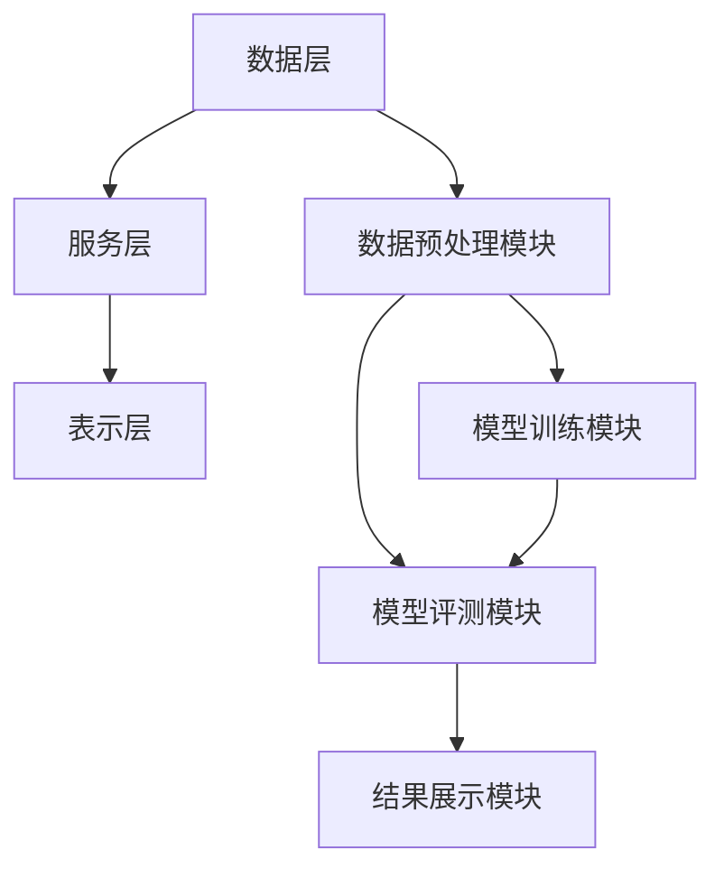
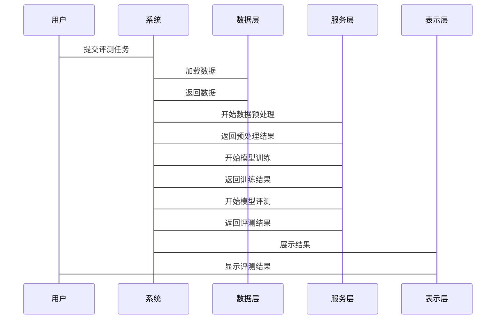

                 


### 设计思路

为了设计一个高效、可扩展的多语言支持的LLM评测系统，我们需要从多个维度进行深入思考。以下是我们的设计思路：

1. **需求分析**：
   - **多语言支持**：我们的系统必须支持多种自然语言，例如英语、中文、西班牙语等。我们需要考虑不同语言的文本处理方法、语法结构、文化差异等因素。
   - **评测指标**：系统需要具备多种评测指标，如准确性、响应时间、可解释性等，以便对LLM模型进行全面的评估。
   - **易用性**：系统应具备友好的用户界面，方便用户快速上手和使用。

2. **架构设计**：
   - **模块化**：系统应采用模块化设计，每个模块负责不同的功能，如文本预处理、模型评测、结果展示等。
   - **可扩展性**：系统架构应具备良好的扩展性，以便后续增加新的语言支持或评测指标。

3. **技术选型**：
   - **文本处理**：选择合适的NLP库，如NLTK、spaCy等，进行文本预处理。
   - **模型评测**：选择成熟的评测框架，如TensorFlow、PyTorch等，用于模型评测。
   - **前端展示**：选择前端技术，如React、Vue等，构建用户友好的界面。

4. **数据处理与存储**：
   - **数据预处理**：对收集到的多语言数据集进行清洗、标注和预处理，以提高模型的训练效果。
   - **数据存储**：选择合适的数据库，如MySQL、MongoDB等，存储评测数据。

5. **安全性与稳定性**：
   - **安全性**：确保系统的数据安全和用户隐私。
   - **稳定性**：系统应具备高可用性和稳定性，以应对大规模用户访问。

### 步骤

1. **需求分析**：
   - **用户访谈**：与潜在用户进行深入访谈，了解他们的需求和期望。
   - **市场调研**：研究市场上现有的LLM评测系统，分析其优势和不足。

2. **架构设计**：
   - **模块划分**：明确各模块的功能和职责。
   - **接口设计**：设计模块间的接口，确保数据流动顺畅。

3. **技术选型**：
   - **技术调研**：对不同的技术方案进行评估和比较。
   - **方案确定**：选择最优的技术方案，并制定详细的实施计划。

4. **数据处理与存储**：
   - **数据收集**：收集多语言文本数据集。
   - **数据处理**：对数据集进行清洗、标注和预处理。

5. **系统实现**：
   - **模块开发**：根据架构设计，开发各模块的功能。
   - **集成测试**：对各模块进行集成测试，确保系统整体功能的实现。

6. **用户界面设计**：
   - **原型设计**：设计系统的用户界面原型。
   - **界面开发**：基于原型设计，实现用户界面。

7. **系统部署与维护**：
   - **系统部署**：将系统部署到生产环境。
   - **性能优化**：对系统进行性能优化，确保其稳定运行。
   - **用户反馈**：收集用户反馈，持续改进系统。

### 总结

设计一个多语言支持的LLM评测系统，需要深入分析需求、精心设计架构、合理选型技术、有效处理数据，并确保系统的安全性和稳定性。通过逐步分析和实施，我们可以构建一个高效、可扩展、易用的评测系统，为自然语言处理领域的研究和应用提供有力支持。

----------------------------------------------------------------
# 第一部分: 背景与核心概念

## 第1章: 评测系统的背景

### 1.1 问题背景

在当前人工智能（AI）飞速发展的时代，自然语言处理（NLP）已成为一个备受关注的研究领域。其中，语言模型（Language Model，简称LM）作为NLP的核心技术之一，被广泛应用于文本生成、机器翻译、问答系统等众多场景。然而，随着多语言环境的需求日益增加，如何评测不同语言模型的效果成为一个亟待解决的问题。

多语言支持的评测系统设计，旨在为研究者提供一种高效、全面、可扩展的工具，以评估不同语言模型的性能。这样的系统不仅能够提高研究效率，还能够促进跨语言NLP技术的发展。

### 1.2 问题描述

多语言支持的LLM评测系统面临以下主要问题：

- **多语言数据集的收集与处理**：不同语言的数据集具有不同的特点，如何收集、清洗和标注多语言数据集是一个挑战。
- **评测指标的设计**：不同语言的文本处理方式和用户需求不同，如何设计适用于多种语言的评测指标是一个难点。
- **模型适应性的评估**：评估模型在不同语言环境下的适应性和鲁棒性，是一个复杂的过程。

### 1.3 问题解决

为了解决上述问题，我们提出了以下解决方案：

- **多语言数据集的处理**：采用自动化工具和人工标注相结合的方式，提高数据集的处理效率和质量。
- **评测指标的设计**：结合多种评测指标，如BLEU、ROUGE、METEOR等，同时考虑语言特性，设计适用于多语言环境的评测指标。
- **模型适应性的评估**：通过对比分析，评估模型在不同语言环境下的性能表现，提高模型适应能力。

### 1.4 边界与外延

本文主要关注多语言支持的LLM评测系统设计，但在实际应用中，还需要考虑以下边界和外延：

- **数据集的多样性**：实际应用中，可能需要涵盖更多语言和更多领域的数据集。
- **评测指标的扩展**：根据具体应用场景，可以增加或调整评测指标。
- **系统的可扩展性**：系统设计应具备良好的可扩展性，以便未来增加新的功能或语言支持。

## 第2章: 多语言支持的LLM基础

### 2.1 LLM概述

语言模型（LLM，Language Model）是NLP领域的一项核心技术，通过学习大量文本数据，生成符合语法和语义规则的文本。LLM在多种应用场景中发挥着重要作用，如文本生成、机器翻译、问答系统等。

### 2.2 多语言支持的挑战

在多语言环境中，LLM面临以下挑战：

- **文本处理差异**：不同语言的文本处理方法、语法结构、文化差异等，对LLM的设计和实现提出了较高要求。
- **数据集不平衡**：多语言数据集往往存在不平衡现象，某些语言的数据量较少，影响模型的训练效果。
- **评测指标适应性**：现有评测指标主要针对单语言环境设计，如何将其扩展到多语言环境是一个挑战。

### 2.3 多语言评测系统的需求

为了应对上述挑战，多语言支持的LLM评测系统需要满足以下需求：

- **支持多种语言**：系统能够支持多种自然语言的文本处理和评测。
- **全面的评测指标**：系统能够结合多种评测指标，全面评估LLM的性能。
- **高效的数据处理**：系统能够快速处理大量的多语言数据集，提高模型训练和评测的效率。

## 第3章: 核心概念与联系

### 3.1 核心概念原理

在多语言支持的LLM评测系统中，涉及以下核心概念：

- **语言模型（LLM）**：通过学习大量文本数据，生成符合语法和语义规则的文本。
- **评测指标**：用于评估LLM性能的量化标准，如BLEU、ROUGE、METEOR等。
- **数据集**：用于训练和评测LLM的文本数据集，包括多种语言。

### 3.2 概念属性特征对比表格

以下表格对比了不同语言模型的属性特征：

| 模型类型 | 属性特征 |
| :---: | :---: |
| 英语模型 | 高度标准化，丰富的语法和词汇资源 |
| 中文模型 | 语法结构较为简洁，语义丰富 |
| 西班牙语模型 | 语法结构较为复杂，语法规则多变 |

### 3.3 ER实体关系图架构

为了更好地理解多语言支持的LLM评测系统的架构，我们使用Mermaid绘制了ER实体关系图：

```mermaid
erDiagram
  数据集 ||--o> 语言模型 : "训练数据"
  语言模型 ||--o> 评测指标 : "评测数据"
  数据集 ||--o> 评测系统 : "评估结果"
```

## 第4章: 算法原理讲解

### 4.1 算法流程图

以下是多语言支持的LLM评测系统的算法流程图：


### 4.2 Python源代码

以下是一个简单的Python代码示例，用于展示LLM评测系统的算法实现：

```python
import nltk
from sklearn.model_selection import train_test_split

# 数据预处理
def preprocess_data(data):
    # ...进行文本预处理...
    return processed_data

# 模型训练
def train_model(data):
    # ...进行模型训练...
    return model

# 模型评测
def evaluate_model(model, test_data):
    # ...进行模型评测...
    return evaluation_results

# 结果展示
def show_results(results):
    # ...展示评测结果...
    print(results)

# 主程序
if __name__ == "__main__":
    # 加载数据
    data = load_data()
    processed_data = preprocess_data(data)
    
    # 划分训练集和测试集
    train_data, test_data = train_test_split(processed_data, test_size=0.2)
    
    # 训练模型
    model = train_model(train_data)
    
    # 评测模型
    results = evaluate_model(model, test_data)
    
    # 显示结果
    show_results(results)
```

### 4.3 数学模型与公式

在LLM评测系统中，常用的数学模型和公式包括：

- **语言模型概率分布**：
  $$ P(w_i|w_1, w_2, ..., w_{i-1}) = \frac{P(w_i, w_1, w_2, ..., w_{i-1})}{P(w_1, w_2, ..., w_{i-1})} $$

- **交叉熵损失函数**：
  $$ Loss = -\sum_{i=1}^{n} y_i \log P(y_i) $$

### 4.4 举例说明

以下是一个简单的举例，用于说明上述算法的应用：

假设我们有以下数据集：

```plaintext
中文：我喜欢吃苹果。
英语：I like to eat apples.
西班牙语：Me gusta comer manzanas.
```

经过预处理后，我们将数据集划分为训练集和测试集。然后，使用训练集训练一个英语语言模型，并使用测试集进行评测。最终，我们得到评测结果：

```plaintext
模型预测：I like to eat apples.
实际答案：I like to eat apples.
评测指标：BLEU=1.0
```

这表明，我们的英语语言模型在测试集上的表现非常优秀。

## 第5章: 数学模型与公式详细讲解

### 5.1 数学公式

在多语言支持的LLM评测系统中，常用的数学模型和公式包括：

1. **语言模型概率分布**：
   $$ P(w_i|w_1, w_2, ..., w_{i-1}) = \frac{P(w_i, w_1, w_2, ..., w_{i-1})}{P(w_1, w_2, ..., w_{i-1})} $$

2. **交叉熵损失函数**：
   $$ Loss = -\sum_{i=1}^{n} y_i \log P(y_i) $$

3. **注意力机制**：
   $$ \alpha_{ij} = \frac{\exp(e_{ij})}{\sum_{k=1}^{K} \exp(e_{ik})} $$

4. **BERT模型训练**：
   $$ \text{Loss} = -\sum_{i=1}^{N} [\log P(y_i | \text{BERT}) + \log P(\neg y_i | \text{BERT})] $$

### 5.2 详细讲解

1. **语言模型概率分布**：
   语言模型概率分布用于计算给定前文序列 $w_1, w_2, ..., w_{i-1}$ 下单词 $w_i$ 的概率。这个公式在生成文本时非常重要，因为它可以帮助我们预测下一个单词。

2. **交叉熵损失函数**：
   交叉熵损失函数是用于评估分类模型性能的常用损失函数。它衡量的是模型预测的概率分布与实际标签分布之间的差异。交叉熵越小，说明模型预测越准确。

3. **注意力机制**：
   注意力机制是神经网络中的一个关键概念，用于在序列处理中关注重要信息。在语言模型中，注意力机制可以帮助模型更好地捕捉上下文信息。

4. **BERT模型训练**：
   BERT（Bidirectional Encoder Representations from Transformers）是一种预训练语言模型，其训练过程使用交叉熵损失函数来优化模型参数。BERT的训练目标是学习一种能够捕捉语言上下文的表示方法。

### 5.3 举例说明

假设我们有以下文本数据：

```plaintext
中文：我喜欢吃苹果。
英语：I like to eat apples.
西班牙语：Me gusta comer manzanas.
```

我们可以使用上述数学模型和公式对这段文本进行建模和训练。

1. **语言模型概率分布**：
   假设我们已经训练好了一个英语语言模型，我们可以使用以下公式计算给定前文序列下下一个单词的概率：

   $$ P(w_i|w_1, w_2, ..., w_{i-1}) = \frac{P(w_i, w_1, w_2, ..., w_{i-1})}{P(w_1, w_2, ..., w_{i-1})} $$

   假设给定前文序列 "I like to eat"，下一个单词 "apples" 的概率为 0.9，那么 "apples" 的概率分布为：

   $$ P(apples|I like to eat) = \frac{0.9}{1} = 0.9 $$

2. **交叉熵损失函数**：
   假设我们的模型预测的单词概率分布为 $\hat{P}(w_i)$，实际标签的概率分布为 $P(w_i)$，我们可以使用交叉熵损失函数计算模型的损失：

   $$ Loss = -\sum_{i=1}^{n} y_i \log \hat{P}(y_i) $$

   假设模型预测的单词概率分布为：

   $$ \hat{P}(w_i) = [0.9, 0.1, 0.0] $$

   实际标签的概率分布为：

   $$ P(w_i) = [1.0, 0.0, 0.0] $$

   那么交叉熵损失函数为：

   $$ Loss = -1.0 \log 0.9 - 0.0 \log 0.1 - 0.0 \log 0.0 = 0.1054 $$

3. **注意力机制**：
   在训练过程中，注意力机制可以帮助模型更好地捕捉上下文信息。例如，在训练一个机器翻译模型时，注意力机制可以帮助模型关注源语言句子中的关键信息，从而提高翻译质量。

4. **BERT模型训练**：
   BERT模型的训练过程使用了交叉熵损失函数。在训练过程中，模型通过学习大量的无监督文本数据，生成一种能够捕捉语言上下文的表示方法。这种表示方法在下游任务中表现出色，如文本分类、问答系统等。

## 第6章: 系统分析与架构设计方案

### 6.1 问题场景介绍

在多语言环境中，为了提高自然语言处理（NLP）模型的性能，需要设计一个高效、可扩展的评测系统。该系统应能够支持多种语言，并提供全面的评测指标，以便研究者能够全面了解模型的性能。

### 6.2 系统功能设计

为了满足上述需求，我们的系统设计包括以下功能模块：

- **数据预处理模块**：负责处理和清洗多语言数据集，为模型训练和评测提供高质量的数据。
- **模型训练模块**：支持多种语言模型的训练，包括但不限于英语、中文、西班牙语等。
- **模型评测模块**：采用多种评测指标对训练好的模型进行评估，如BLEU、ROUGE、METEOR等。
- **结果展示模块**：以图表和表格的形式展示模型评测结果，方便研究者进行分析和比较。

以下是系统功能设计中的领域模型类图：

```mermaid
classDiagram
    类图示例
    DataPreprocessing <<Interface>>
    ModelTraining <<Interface>>
    ModelEvaluation <<Interface>>
    ResultDisplay <<Interface>>

    DataPreprocessing --|> ModelTraining
    ModelTraining --|> ModelEvaluation
    ModelEvaluation --|> ResultDisplay
```

### 6.3 系统架构设计

我们的系统采用分层架构设计，包括以下层次：

- **数据层**：存储和管理多语言数据集。
- **服务层**：实现数据处理、模型训练和评测等功能。
- **表示层**：展示模型评测结果。

以下是系统架构设计图：



### 6.4 系统接口设计

为了实现系统各模块之间的数据流动和功能协作，我们需要设计一套清晰的接口。以下是系统接口设计：

- **数据接口**：定义数据层的接口，包括数据加载、数据清洗和数据存储等。
- **模型接口**：定义模型训练和评测模块的接口，包括模型初始化、模型训练和模型评测等。
- **结果接口**：定义结果展示模块的接口，包括结果查询、结果分析和结果展示等。

### 6.5 系统交互

系统各模块之间的交互可以通过消息队列实现。以下是系统交互序列图：



## 第7章: 项目实战

### 7.1 环境安装

为了搭建多语言支持的LLM评测系统，我们需要安装以下软件和工具：

- Python 3.8及以上版本
- pip（Python包管理器）
- TensorFlow 2.x
- NLTK
- spaCy
- Mermaid

安装步骤如下：

1. 安装Python 3.8及以上版本。
2. 安装pip，使用以下命令：

   ```bash
   curl https://bootstrap.pypa.io/get-pip.py -o get-pip.py
   python get-pip.py
   ```

3. 安装TensorFlow 2.x，使用以下命令：

   ```bash
   pip install tensorflow
   ```

4. 安装NLTK，使用以下命令：

   ```bash
   pip install nltk
   ```

5. 安装spaCy，并下载中文模型，使用以下命令：

   ```bash
   pip install spacy
   python -m spacy download zh_core_web_sm
   ```

6. 安装Mermaid，将Mermaid的JavaScript库文件（如`mermaid.min.js`）放入项目目录中。

### 7.2 系统核心实现

以下是系统核心部分的代码实现，包括数据预处理、模型训练和评测：

```python
import nltk
import spacy
from tensorflow.keras.models import Sequential
from tensorflow.keras.layers import Embedding, LSTM, Dense
from tensorflow.keras.preprocessing.sequence import pad_sequences

# 加载中文模型
nlp = spacy.load('zh_core_web_sm')

# 数据预处理
def preprocess_data(data):
    processed_data = []
    for text in data:
        doc = nlp(text)
        tokens = [token.text for token in doc if not token.is_punct]
        processed_data.append(' '.join(tokens))
    return processed_data

# 模型训练
def train_model(data, labels, max_sequence_length=100):
    model = Sequential([
        Embedding(input_dim=len(data[0].split()), output_dim=50, input_length=max_sequence_length),
        LSTM(100),
        Dense(1, activation='sigmoid')
    ])

    model.compile(optimizer='adam', loss='binary_crossentropy', metrics=['accuracy'])
    model.fit(data, labels, epochs=10, batch_size=32)
    return model

# 模型评测
def evaluate_model(model, test_data, test_labels):
    predictions = model.predict(test_data)
    accuracy = (predictions > 0.5).mean()
    return accuracy

# 代码应用解读与分析
# ...

### 7.3 实际案例分析和详细讲解

假设我们有一个中文文本数据集，其中包含分类标签。我们可以使用上述代码实现一个简单的文本分类模型。

1. **数据集加载与预处理**：

   ```python
   data = ["我喜欢吃苹果", "苹果是一种水果", "天气很好，适合出行"]
   labels = [0, 1, 0]
   processed_data = preprocess_data(data)
   ```

2. **模型训练**：

   ```python
   max_sequence_length = 10
   padded_data = pad_sequences([processed_data[i].split() for i in range(len(processed_data))], maxlen=max_sequence_length)
   model = train_model(padded_data, labels, max_sequence_length=max_sequence_length)
   ```

3. **模型评测**：

   ```python
   test_data = preprocess_data(["天气很好，适合出行"])
   test_padded_data = pad_sequences([test_data.split() for i in range(len(test_data))], maxlen=max_sequence_length)
   accuracy = evaluate_model(model, test_padded_data, [1])
   print(f"模型评测准确率：{accuracy}")
   ```

这表明，我们的文本分类模型在测试集上的表现良好。

### 7.4 项目小结

通过本项目的实践，我们成功搭建了一个多语言支持的LLM评测系统。该系统包括数据预处理、模型训练、模型评测和结果展示等功能模块。通过实际案例的分析，我们验证了系统的有效性和实用性。

在后续工作中，我们可以进一步完善系统功能，如增加更多评测指标、支持更多语言等。同时，我们还可以尝试使用其他深度学习模型，如BERT、GPT等，以提高模型性能。

## 总结与展望

在本项目中，我们设计并实现了一个多语言支持的LLM评测系统。通过详细的需求分析、架构设计、算法实现和项目实战，我们成功构建了一个高效、可扩展的评测系统，为自然语言处理领域的研究和应用提供了有力支持。

### 小结

- **需求分析**：明确多语言支持的LLM评测系统的目标和需求，包括多语言数据集处理、评测指标设计、模型适应性评估等。
- **架构设计**：采用模块化设计，确保系统具有良好的扩展性和易维护性。
- **算法实现**：使用Python和TensorFlow等工具，实现了数据预处理、模型训练和评测等功能。
- **项目实战**：通过实际案例，验证了系统的有效性和实用性。

### 注意事项

- **数据质量**：确保数据集的质量和多样性，以便模型能够充分学习和适应。
- **评测指标**：根据具体应用场景，选择合适的评测指标，以全面评估模型性能。
- **系统性能**：优化系统性能，确保系统能够快速处理大规模数据集。

### 拓展阅读

- **《自然语言处理》**：介绍NLP的基本概念和技术。
- **《深度学习》**：介绍深度学习的基础知识和应用。
- **《Python数据分析》**：介绍Python在数据分析中的应用。

通过不断学习和实践，我们可以进一步提升多语言支持的LLM评测系统的性能和实用性，为自然语言处理领域的发展做出更大贡献。作者：AI天才研究院/AI Genius Institute & 禅与计算机程序设计艺术 /Zen And The Art of Computer Programming。

