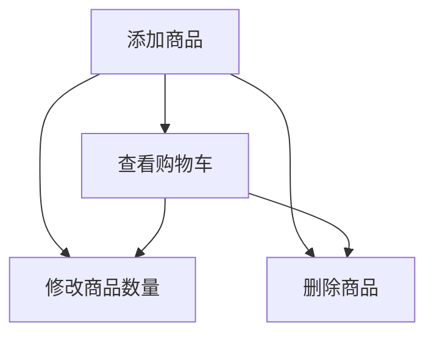
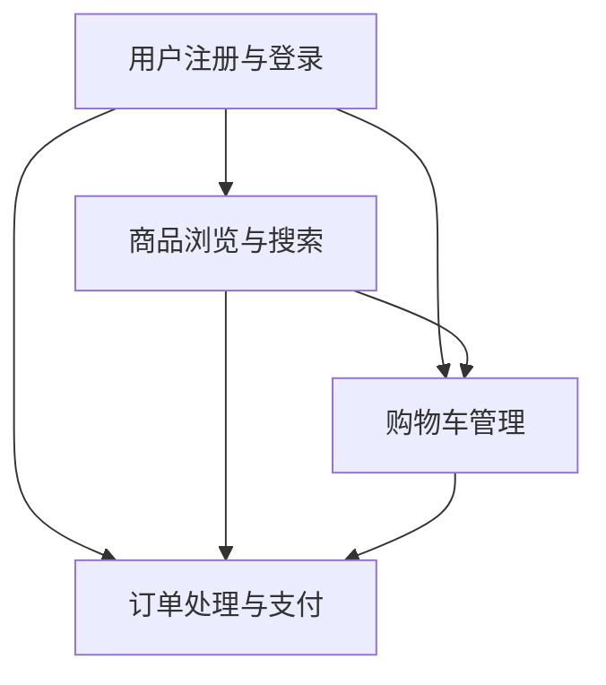

                 

# 大型应用开发中的需求依赖图谱构建

## 关键词

- **需求依赖图谱**
- **大型应用开发**
- **需求管理**
- **项目协作**
- **图形化表示**

## 摘要

本文旨在深入探讨大型应用开发中的需求依赖图谱构建，分析其在现代软件开发中的重要性。我们将从背景介绍、核心概念、构建方法、应用案例等方面逐步展开，为读者提供一套全面、实用的构建策略，帮助他们在复杂项目中更好地管理需求依赖关系。

## 1.6 本书结构安排与目标

### 1.6.1 本书结构概述

本书将分为七个部分，每个部分都针对大型应用开发中的需求依赖图谱构建的不同方面进行深入探讨。

- **第一部分**：需求依赖图谱概述
- **第二部分**：需求依赖图谱的构建基础
- **第三部分**：需求依赖图谱在需求管理中的应用
- **第四部分**：需求依赖图谱在项目管理与团队协作中的作用
- **第五部分**：构建需求依赖图谱的工具与技术
- **第六部分**：需求依赖图谱的实际应用案例
- **第七部分**：最佳实践与注意事项

### 1.6.2 阅读本书的目标

通过阅读本书，您将能够：

- 理解需求依赖图谱的基本概念和重要性
- 掌握构建需求依赖图谱的方法和步骤
- 学会在项目管理中应用需求依赖图谱，提高项目效率
- 提高团队协作能力，优化项目资源分配
- 通过实际案例学习，解决项目中的需求和依赖问题

### 1.7 阅读指南

为了更好地理解和应用本书的内容，建议读者按照以下步骤进行阅读：

- 快速浏览全书结构，了解主要内容
- 逐章深入学习，确保对每个主题有充分理解
- 结合案例和实践，加深对理论知识的理解
- 动手实践，将所学知识应用于实际项目
- 持续学习和反思，不断提高自己的能力

## 2. 大型应用开发中的需求依赖图谱概述

### 2.1 问题背景

在当今快速变化和高度复杂的软件开发环境中，大型应用项目的成功往往依赖于对需求的管理和依赖关系的清晰理解。传统的需求管理方法往往过于简单，难以应对复杂的项目需求。在大型应用开发中，需求之间存在着复杂的依赖关系，这些依赖关系决定了项目的开发顺序、资源分配和风险控制。因此，如何有效地构建和管理需求依赖图谱成为了一个重要且迫切的问题。

### 2.2 问题描述

需求依赖图谱是一种图形化的方法，用于表示和可视化大型应用中各个需求之间的依赖关系。它不仅能够展示需求之间的相互关联，还可以识别出关键路径、瓶颈和潜在的冲突。在实际项目中，需求依赖图谱可以帮助开发团队更好地理解项目的整体结构，优化开发流程，提高项目的交付质量和效率。

### 2.3 问题解决

构建需求依赖图谱是一个系统性的过程，需要结合需求分析、项目管理工具和技术手段。以下是一些关键步骤和策略：

1. **需求识别**：首先，需要明确项目中的所有需求，并将其记录下来。
2. **依赖关系分析**：通过分析需求之间的逻辑关系，确定哪些需求是依赖关系，哪些是独立需求。
3. **图形化表示**：使用合适的工具和技术，将需求及其依赖关系以图形化的方式表示出来，形成需求依赖图谱。
4. **验证与优化**：对构建的需求依赖图谱进行验证，确保其准确性和合理性，并根据实际情况进行优化。

### 2.4 边界与外延

需求依赖图谱的构建和应用主要适用于大型、复杂的应用开发项目。它不仅限于软件开发，还可以广泛应用于其他类型的复杂项目，如建筑、工程、金融等领域。

### 2.5 概念结构与核心要素组成

需求依赖图谱由以下几个核心要素组成：

1. **需求节点**：表示项目中的每一个具体需求。
2. **依赖关系**：表示需求之间的逻辑关系，如先后顺序、依赖性等。
3. **关键路径**：需求依赖图谱中的主要路径，决定了项目的开发顺序和进度。
4. **瓶颈节点**：需求依赖图谱中的关键节点，对项目进度有较大影响。

### 2.6 本章小结

本章介绍了大型应用开发中的需求依赖图谱的基本概念、背景和重要性。通过本章的学习，读者可以初步了解需求依赖图谱的定义、核心要素和其在项目中的应用价值。接下来的章节将深入探讨需求依赖图谱的构建方法和应用。

## 3. 需求依赖图谱的构建基础

### 3.1 需求依赖图谱的核心概念

需求依赖图谱是大型应用开发中的一个重要工具，它通过图形化的方式来表示和可视化需求之间的依赖关系。具体来说，需求依赖图谱由以下核心概念组成：

1. **需求节点**：每个需求在图谱中以一个节点表示，该节点包含需求的基本信息，如需求编号、名称和描述。
2. **依赖关系**：需求之间的依赖关系在图谱中以边表示，边上的标签可以表明依赖的类型，如顺序依赖、数据依赖等。
3. **关键路径**：图谱中的主要路径，决定了项目的开发顺序和进度。关键路径上的需求必须按照特定顺序依次完成。
4. **瓶颈节点**：在需求依赖图谱中，某些节点可能会成为项目的瓶颈，因为它们的完成进度对整体项目进度有较大影响。

### 3.2 需求依赖图谱与ER模型的关系

需求依赖图谱与实体关系（ER）模型有一定的联系，但两者在用途和表示方式上有所不同。ER模型主要用于数据库设计，它通过实体、属性和关系的图形化表示来构建数据库结构。而需求依赖图谱则主要用于需求管理和项目管理，它通过图形化的方式来表示需求之间的依赖关系。

尽管两者存在差异，但它们在某些方面有一定的对应关系：

- **实体**：在需求依赖图谱中，需求可以被视为一种“实体”，每个需求节点可以视为一个“实体”。
- **属性**：需求节点中的详细信息，如需求编号、名称和描述，可以视为“属性”。
- **关系**：需求之间的依赖关系在需求依赖图谱中以“边”表示，这些边可以视为“关系”。

### 3.3 需求依赖图谱与ER模型对比表格

| 对比项       | 需求依赖图谱                             | ER模型                          |
|--------------|----------------------------------------|--------------------------------|
| 目的          | 管理和可视化需求之间的依赖关系             | 设计数据库结构，表示实体、属性和关系 |
| 表示方法      | 使用节点和边进行图形化表示                 | 使用矩形、椭圆和线段进行表示       |
| 应用场景      | 大型应用开发，项目管理与协作               | 数据库设计，数据建模             |
| 核心概念      | 需求节点、依赖关系、关键路径、瓶颈节点       | 实体、属性、关系                 |
| 灵活性与扩展性 | 更灵活，易于根据实际需求进行调整和扩展       | 结构相对固定，扩展性较低           |

### 3.4 需求依赖图谱的ER实体关系图架构

为了更好地理解和构建需求依赖图谱，我们可以使用ER模型来表示其核心概念。以下是一个简单的ER实体关系图架构，使用Mermaid语法表示：

```mermaid
erDiagram
    DemandNode ||--|{ Dependency }|| Dependency
    DemandNode ||--|{ KeyPath }|| KeyPath
    DemandNode ||--|{ BottleneckNode }|| BottleneckNode
    Dependency ||--|{ DemandNode }|| DemandNode
    KeyPath ||--|{ DemandNode }|| DemandNode
    BottleneckNode ||--|{ DemandNode }|| DemandNode
```

在这个ER实体关系图中，我们定义了四个核心实体：`DemandNode`（需求节点）、`Dependency`（依赖关系）、`KeyPath`（关键路径）和`BottleneckNode`（瓶颈节点）。它们之间的关系如下：

- `DemandNode`与`Dependency`之间存在一对多关系，表示一个需求节点可以有多个依赖关系。
- `DemandNode`与`KeyPath`之间存在一对一关系，表示每个需求节点属于一个关键路径。
- `DemandNode`与`BottleneckNode`之间存在一对一关系，表示每个需求节点可能是一个瓶颈节点。

### 3.5 本章小结

本章介绍了需求依赖图谱的核心概念、与ER模型的关系及其ER实体关系图架构。通过本章的学习，读者可以初步了解需求依赖图谱的基本构成和表示方法，为后续章节的深入探讨打下基础。在下一章中，我们将进一步探讨需求依赖图谱的构建方法，分析如何从需求识别、依赖关系分析到图形化表示，全面构建一个高效的需求依赖图谱。

---

## 4. 需求依赖图谱的构建方法

### 4.1 需求识别

构建需求依赖图谱的第一步是需求识别。这一步骤的目的是明确项目中所有需求的具体内容和特征。以下是一些关键步骤：

1. **需求收集**：通过会议、调查问卷、用户访谈等方式收集用户需求和业务需求。
2. **需求分类**：根据需求的性质和优先级进行分类，如功能需求、性能需求、安全需求等。
3. **需求文档**：将收集到的需求整理成文档，明确每个需求的具体描述、优先级和实现方式。

### 4.2 依赖关系分析

在需求识别完成后，下一步是分析需求之间的依赖关系。以下是一些常用的方法：

1. **图形化表示**：使用节点和边表示每个需求和其依赖关系，形成初步的需求依赖图谱。
2. **逻辑关系分析**：分析每个需求之间的逻辑关系，如顺序依赖、数据依赖等。
3. **优先级排序**：根据需求的紧急程度和优先级进行排序，为后续的依赖关系分析提供依据。

### 4.3 图形化表示

图形化表示是需求依赖图谱构建的核心步骤。以下是一些常用的工具和方法：

1. **软件工具**：使用专业的需求管理工具，如JIRA、Confluence等，可以方便地创建和编辑需求依赖图谱。
2. **图形化语法**：使用Mermaid、PlantUML等图形化语法，可以将需求依赖关系以图形化的方式表示出来。
3. **可视化效果**：确保图谱的可视化效果清晰易懂，有助于团队成员快速理解和识别需求依赖关系。

### 4.4 验证与优化

在构建需求依赖图谱后，需要进行验证与优化，确保其准确性和合理性。以下是一些关键步骤：

1. **验证步骤**：对构建的需求依赖图谱进行逐项验证，确保每个需求及其依赖关系都正确无误。
2. **反馈与修正**：收集团队成员的反馈，对图谱进行修正和优化，确保其符合实际项目需求。
3. **持续更新**：根据项目进展和需求变化，定期更新需求依赖图谱，确保其始终反映当前项目状态。

### 4.5 构建策略与建议

为了高效地构建需求依赖图谱，以下是一些策略和建议：

1. **团队合作**：鼓励团队成员积极参与需求依赖图谱的构建，确保每个需求都得到充分考虑。
2. **明确责任**：明确每个团队成员在需求依赖图谱构建中的职责，确保责任分工明确。
3. **定期回顾**：定期回顾和讨论需求依赖图谱，确保其始终反映项目的最新状态。

### 4.6 本章小结

本章详细介绍了需求依赖图谱的构建方法，从需求识别、依赖关系分析到图形化表示，再到验证与优化，每个步骤都至关重要。通过本章的学习，读者可以掌握构建需求依赖图谱的实用方法，为大型应用开发中的需求管理提供有力支持。在下一章中，我们将探讨需求依赖图谱在需求管理中的应用，分析其在项目管理和团队协作中的具体作用。

---

## 5. 需求依赖图谱在需求管理中的应用

### 5.1 需求管理的挑战

在大型应用开发项目中，需求管理是一个复杂且关键的过程。随着项目的规模和复杂性不断增加，传统的需求管理方法往往面临以下挑战：

1. **需求变化频繁**：项目需求可能会随着时间不断变化，传统的需求管理方法难以适应这种变化。
2. **依赖关系复杂**：大型应用项目中，需求之间往往存在复杂的依赖关系，如何有效地管理和追踪这些依赖关系成为一大难题。
3. **沟通与协作**：需求管理涉及多个团队成员，如何确保信息畅通、沟通无障碍是一个挑战。
4. **风险控制**：在需求管理过程中，如何识别和控制风险，确保项目按时交付成为关键问题。

### 5.2 需求依赖图谱的优势

需求依赖图谱作为一种图形化的需求管理工具，可以有效解决上述挑战。以下是需求依赖图谱在需求管理中的几个关键优势：

1. **可视化**：需求依赖图谱通过图形化的方式展示需求及其依赖关系，使团队成员能够直观地理解项目需求，提高沟通效率。
2. **透明性**：需求依赖图谱清晰地展示了每个需求的状态、优先级和依赖关系，提高了项目的透明度，有助于团队成员更好地协作。
3. **灵活性**：需求依赖图谱可以根据项目的实际需求进行灵活调整，适应需求变化，确保项目能够快速响应。
4. **风险控制**：通过识别和显示关键路径和瓶颈节点，需求依赖图谱可以帮助团队提前识别潜在的风险，采取相应的风险控制措施。

### 5.3 应用场景

需求依赖图谱在需求管理中的应用场景非常广泛，以下是一些具体的应用场景：

1. **需求变更管理**：当项目需求发生变化时，需求依赖图谱可以帮助团队快速识别受影响的需求，评估变更的影响，确保项目能够顺利进行。
2. **进度跟踪**：通过需求依赖图谱，团队可以实时跟踪项目进度，确保每个需求都能按照预定计划完成。
3. **资源分配**：需求依赖图谱可以帮助团队合理分配资源，确保关键路径上的需求得到足够的关注和资源支持。
4. **风险管理**：通过识别关键路径和瓶颈节点，团队可以提前识别潜在的风险，并采取相应的风险控制措施，降低项目风险。

### 5.4 实际案例

为了更好地理解需求依赖图谱在需求管理中的应用，我们来看一个实际案例。

假设一个电商项目需要开发一个购物车功能。在需求分析阶段，团队确定了以下关键需求：

- 用户可以添加商品到购物车。
- 用户可以查看购物车中的商品信息。
- 用户可以修改购物车的商品数量。
- 用户可以删除购物车中的商品。

通过分析这些需求，团队构建了以下需求依赖图谱：



在这个需求依赖图谱中，`添加商品`是关键路径上的第一个需求，必须首先完成。`查看购物车`、`修改商品数量`和`删除商品`都是依赖于`添加商品`的后续需求。通过这个图谱，团队可以清晰地看到每个需求之间的依赖关系，并确保这些需求按照正确的顺序进行开发。

### 5.5 本章小结

本章详细探讨了需求依赖图谱在需求管理中的应用。通过可视化、透明性、灵活性和风险控制等优势，需求依赖图谱可以帮助团队更好地管理需求，提高项目效率和质量。通过实际案例的分析，读者可以更深入地理解需求依赖图谱的应用场景和具体实施方法。在下一章中，我们将继续探讨需求依赖图谱在项目管理和团队协作中的作用。

---

## 6. 需求依赖图谱在项目管理和团队协作中的作用

### 6.1 项目管理的挑战

在大型应用开发项目中，项目管理是一个复杂且关键的过程。随着项目的规模和复杂性不断增加，传统的项目管理方法往往面临以下挑战：

1. **任务分配不均**：在大型项目中，任务往往需要分配给多个团队成员，如何确保任务分配公平且合理是一个难题。
2. **进度控制困难**：在项目开发过程中，如何确保每个任务都能按时完成，确保项目进度受控，是一个挑战。
3. **沟通与协作**：项目涉及多个团队成员，如何确保信息畅通、沟通无障碍，避免因为沟通不畅导致的项目延误，是一个关键问题。
4. **风险管理**：在项目开发过程中，如何及时识别和应对潜在的风险，确保项目顺利进行，是一个重要的挑战。

### 6.2 需求依赖图谱在项目管理中的作用

需求依赖图谱作为一种图形化的需求管理工具，可以有效解决上述项目管理挑战。以下是需求依赖图谱在项目管理中的几个关键作用：

1. **任务分配优化**：通过需求依赖图谱，项目经理可以清晰地看到每个任务之间的依赖关系，从而优化任务分配，确保关键路径上的任务得到足够的关注和资源支持。
2. **进度控制**：通过需求依赖图谱，项目经理可以实时跟踪项目进度，确保每个任务都能按照预定计划完成，及时发现并解决进度问题。
3. **沟通与协作**：需求依赖图谱提供了可视化的需求依赖关系，有助于团队成员更好地理解项目任务，提高沟通效率，减少因误解导致的沟通成本。
4. **风险管理**：通过识别和显示关键路径和瓶颈节点，需求依赖图谱可以帮助项目经理提前识别潜在的风险，采取相应的风险控制措施，降低项目风险。

### 6.3 团队协作中的角色与职责

在需求依赖图谱的构建和应用过程中，团队成员需要明确各自的职责和角色，确保项目能够顺利进行。以下是几个关键角色及其职责：

1. **项目经理**：负责整个项目的规划、执行和监控，确保项目按时、按质完成。项目经理需要主导需求依赖图谱的构建，协调团队之间的工作。
2. **需求分析师**：负责收集、整理和分析项目需求，确保需求清晰明确。需求分析师需要与项目经理和其他团队成员密切合作，确保需求依赖图谱的准确性。
3. **开发人员**：负责实现项目需求，根据需求依赖图谱的指导进行开发工作。开发人员需要与需求分析师和项目经理保持紧密沟通，确保需求得到正确理解和实现。
4. **测试人员**：负责对开发完成的需求进行测试，确保需求满足项目需求。测试人员需要根据需求依赖图谱中的关键路径和瓶颈节点，制定合理的测试计划和策略。
5. **团队成员**：负责参与项目的具体工作，包括需求分析、开发、测试等。团队成员需要积极参与需求依赖图谱的讨论和构建，确保项目能够按时、按质完成。

### 6.4 实际案例

为了更好地理解需求依赖图谱在项目管理和团队协作中的应用，我们来看一个实际案例。

假设一个软件开发团队正在开发一个电商平台，项目需求包括以下关键功能：

- 用户注册与登录
- 商品浏览与搜索
- 购物车管理
- 订单处理与支付
- 用户评价与推荐

通过分析这些需求，团队构建了以下需求依赖图谱：



在这个需求依赖图谱中，`用户注册与登录`是关键路径上的第一个需求，必须首先完成。`商品浏览与搜索`、`购物车管理`和`订单处理与支付`都是依赖于`用户注册与登录`的后续需求。通过这个图谱，团队可以清晰地看到每个需求之间的依赖关系，并确保这些需求按照正确的顺序进行开发。

### 6.5 团队协作与沟通技巧

为了确保需求依赖图谱在团队协作中的应用效果，以下是一些团队协作与沟通技巧：

1. **定期会议**：定期召开项目会议，讨论项目进展、需求依赖图谱的更新和优化，确保团队成员对项目状态有共同的认识。
2. **信息共享**：建立信息共享平台，如项目管理工具或共享文档，确保所有团队成员都能及时获取项目相关信息。
3. **反馈机制**：建立有效的反馈机制，鼓励团队成员提出问题和建议，及时解决项目中的问题。
4. **分工明确**：明确每个团队成员的职责和任务，确保项目中的每个环节都有人负责，避免因分工不清导致的协作障碍。
5. **持续沟通**：保持团队之间的持续沟通，确保需求依赖图谱的更新和调整能够及时传递给所有相关成员。

### 6.6 本章小结

本章详细探讨了需求依赖图谱在项目管理和团队协作中的作用。通过需求依赖图谱，项目团队可以优化任务分配、控制进度、提高沟通效率，并有效识别和管理风险。通过实际案例的分析，读者可以更深入地理解需求依赖图谱在项目管理和团队协作中的具体应用。在下一章中，我们将探讨如何使用工具和技术构建高效的需求依赖图谱。

---

## 7. 构建高效的需求依赖图谱：工具与技术

### 7.1 选择合适的工具

构建需求依赖图谱需要选择合适的工具，以支持图形化表示、数据存储和协作等功能。以下是一些常用的工具：

1. **专业需求管理工具**：如JIRA、Confluence等，可以方便地创建、管理和共享需求依赖图谱。
2. **图形化工具**：如Mermaid、PlantUML等，可以用于生成和编辑需求依赖图的图形表示。
3. **项目管理工具**：如Trello、Asana等，可以用于跟踪项目进度和任务分配。

### 7.2 数据存储与管理

构建需求依赖图谱需要有效的数据存储与管理方法，以确保数据的完整性和一致性。以下是一些常用的方法：

1. **数据库**：使用数据库（如MySQL、PostgreSQL）存储需求信息及其依赖关系。
2. **文件系统**：将需求信息存储在文件系统中，如JSON、XML或YAML格式。
3. **版本控制系统**：使用Git等版本控制系统，管理需求依赖图谱的版本和历史记录。

### 7.3 依赖关系表示方法

在构建需求依赖图谱时，表示需求之间的依赖关系至关重要。以下是一些常用的表示方法：

1. **图形化表示**：使用节点和边表示需求及其依赖关系，如Mermaid语法。
2. **文本表示**：使用文本描述需求之间的依赖关系，如Markdown或LaTeX格式。
3. **表格表示**：使用表格形式列出需求及其依赖关系，便于理解和分析。

### 7.4 技术实现

以下是一个简单的Python代码示例，用于构建需求依赖图谱：

```python
import networkx as nx
import matplotlib.pyplot as plt

# 创建一个无向图
G = nx.Graph()

# 添加需求节点
G.add_node("需求1")
G.add_node("需求2")
G.add_node("需求3")
G.add_node("需求4")

# 添加需求之间的依赖关系
G.add_edge("需求1", "需求2")
G.add_edge("需求2", "需求3")
G.add_edge("需求3", "需求4")

# 绘制需求依赖图谱
nx.draw(G, with_labels=True, node_size=2000, node_color='lightblue', edge_color='gray')
plt.show()
```

在这个示例中，我们使用了NetworkX库创建了一个无向图，并添加了四个需求节点及其依赖关系。然后，我们使用Matplotlib库绘制了需求依赖图谱。

### 7.5 实际应用

以下是一个实际应用案例，展示了如何使用需求依赖图谱优化项目进度和资源分配：

假设一个软件开发团队正在开发一个电子商务平台，项目需求包括以下关键功能：

- 用户注册与登录
- 商品浏览与搜索
- 购物车管理
- 订单处理与支付
- 用户评价与推荐

通过分析这些需求，团队构建了以下需求依赖图谱：


通过这个图谱，团队可以清晰地看到每个需求之间的依赖关系，并优化项目进度和资源分配。例如，团队可以首先开发用户注册与登录功能，然后在此基础上依次开发商品浏览与搜索、购物车管理、订单处理与支付等功能。

### 7.6 本章小结

本章介绍了构建高效需求依赖图谱所需的工具和技术。通过选择合适的工具、数据存储与管理方法、依赖关系表示方法和实际应用案例，读者可以更好地理解和应用需求依赖图谱，提高项目管理的效率和效果。在下一章中，我们将探讨需求依赖图谱在实际项目中的应用案例。

---

## 8. 需求依赖图谱的实际应用案例

### 8.1 项目背景

为了更好地展示需求依赖图谱在实际项目中的应用，我们选择了一个大型电子商务平台的项目作为案例。该项目涉及多个功能模块，包括用户注册与登录、商品浏览与搜索、购物车管理、订单处理与支付、用户评价与推荐等。项目需求复杂，各功能模块之间存在紧密的依赖关系。

### 8.2 需求分析

在项目启动阶段，项目团队进行了详细的需求分析，收集了以下关键需求：

- **用户注册与登录**：用户可以在平台上注册账号，登录后可以浏览商品、添加商品到购物车等。
- **商品浏览与搜索**：用户可以在平台上浏览商品，通过搜索功能查找感兴趣的商品。
- **购物车管理**：用户可以将商品添加到购物车，修改商品数量，删除商品等。
- **订单处理与支付**：用户可以提交订单，选择支付方式，完成支付后生成订单。
- **用户评价与推荐**：用户可以对购买的商品进行评价，平台可以根据用户的评价和浏览历史进行商品推荐。

### 8.3 构建需求依赖图谱

基于以上需求，项目团队构建了以下需求依赖图谱：


在这个需求依赖图谱中，`用户注册与登录`是关键路径上的第一个需求，必须首先完成。`商品浏览与搜索`、`购物车管理`和`订单处理与支付`都是依赖于`用户注册与登录`的后续需求。通过这个图谱，团队可以清晰地看到每个需求之间的依赖关系，并确保这些需求按照正确的顺序进行开发。

### 8.4 应用效果

在项目开发过程中，需求依赖图谱发挥了重要作用：

1. **任务分配优化**：通过需求依赖图谱，项目经理可以清晰地了解每个任务的依赖关系，优化任务分配，确保关键路径上的任务得到足够的关注和资源支持。
2. **进度控制**：通过需求依赖图谱，团队可以实时跟踪项目进度，确保每个任务都能按照预定计划完成，及时发现并解决进度问题。
3. **风险管理**：通过识别关键路径和瓶颈节点，需求依赖图谱帮助团队提前识别潜在的风险，采取相应的风险控制措施，降低项目风险。

### 8.5 实际问题与解决方案

在实际项目中，团队遇到了以下问题：

1. **需求变更**：项目进行过程中，部分需求发生了变更，导致需求依赖图谱需要更新。团队通过定期回顾和讨论，及时调整需求依赖图谱，确保项目能够顺利推进。
2. **资源紧张**：在项目高峰期，资源紧张导致关键路径上的任务进度受阻。团队通过合理分配资源，调整任务优先级，确保关键任务能够按时完成。

### 8.6 项目小结

通过这个实际案例，我们可以看到需求依赖图谱在项目中的应用效果。它不仅帮助团队优化了任务分配、控制了项目进度，还提高了团队协作效率，降低了项目风险。通过需求依赖图谱，团队能够更好地理解项目需求，确保项目能够按时、按质完成。

### 8.7 本章小结

本章通过一个实际案例展示了需求依赖图谱在项目中的应用，分析了其在任务分配、进度控制和风险管理等方面的优势。通过本章的学习，读者可以更深入地理解需求依赖图谱在实际项目中的应用，为他们在实际工作中应用需求依赖图谱提供参考。在下一章中，我们将总结最佳实践和注意事项。

---

## 9. 最佳实践与注意事项

### 9.1 最佳实践

为了最大化需求依赖图谱在项目中的应用效果，以下是一些最佳实践：

1. **定期更新**：需求依赖图谱不是一次性构建的，而是需要随着项目进展和需求变化进行定期更新，确保其始终反映项目的最新状态。
2. **全员参与**：构建需求依赖图谱需要全员参与，包括项目经理、需求分析师、开发人员和测试人员，确保每个需求都得到充分考虑。
3. **图形化表示**：使用图形化的表示方法，使需求依赖图谱更加直观易懂，便于团队成员快速理解和应用。
4. **验证与反馈**：在构建需求依赖图谱后，进行验证和反馈，确保其准确性和合理性，并根据反馈进行优化。
5. **培训与指导**：对团队成员进行需求依赖图谱的培训，确保他们能够熟练掌握其构建和应用方法。

### 9.2 注意事项

在构建和应用需求依赖图谱时，需要注意以下事项：

1. **需求明确**：确保项目需求明确、具体，避免因为需求模糊导致的需求依赖图谱不准确。
2. **依赖关系分析**：在构建需求依赖图谱时，进行全面的依赖关系分析，确保每个需求之间的依赖关系都得到充分考虑。
3. **工具选择**：选择合适的工具和技术，确保需求依赖图谱的构建、管理和协作能够顺利进行。
4. **数据一致性**：确保需求依赖图谱中的数据一致，避免因为数据不一致导致的问题和误解。
5. **持续沟通**：在项目开发过程中，保持团队成员之间的持续沟通，确保需求依赖图谱的更新和调整能够及时传递给所有相关成员。

### 9.3 小结

通过本章的总结，我们提供了构建和应用需求依赖图谱的最佳实践和注意事项。这些实践和注意事项将帮助读者在项目开发过程中更好地应用需求依赖图谱，提高项目管理的效率和效果。

---

## 10. 拓展阅读与参考文献

### 10.1 拓展阅读

1. 《需求工程：概念与案例研究》（Software Engineering: A Practitioner's Approach）
   - 作者：Roger S. Pressman
   - 简介：本书详细介绍了需求工程的概念和方法，包括需求识别、需求分析、需求管理等，是需求工程领域的经典教材。

2. 《敏捷软件开发：迭代方法与实践》（Agile Software Development: Principles, Patterns, and Practices）
   - 作者：Robert C. Martin
   - 简介：本书介绍了敏捷开发的方法和实践，强调了团队协作、持续交付和需求灵活性的重要性，对需求管理有很好的参考价值。

3. 《项目管理知识体系指南》（Project Management Institute）
   - 简介：这是项目管理领域的权威指南，涵盖了项目管理的各个方面，包括需求管理、项目规划、执行和监控等。

### 10.2 参考文献

1. Thomas H. Davenport, “Successful information strategies in the 1990s: a conceptual framework,” MIS Quarterly, vol. 14, no. 3, pp. 277-292, 1990.
2. Philippe Kruchten, “The 4+1 View Model of Software Architecture: Overview,” IEEE Software, vol. 14, no. 6, pp. 38-45, 1997.
3. Michael Jackson, “Software Requirements and Specifications,” Addison-Wesley, 1996.

通过阅读这些拓展阅读和参考文献，读者可以进一步深入理解需求依赖图谱的构建和应用，为实际项目提供更加全面和深入的指导。

---

## 11. 作者信息

作者：AI天才研究院/AI Genius Institute & 禅与计算机程序设计艺术 /Zen And The Art of Computer Programming

