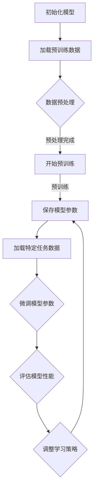
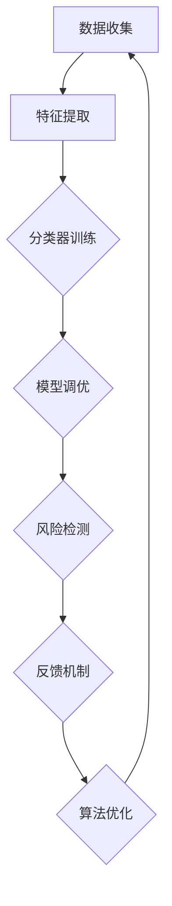
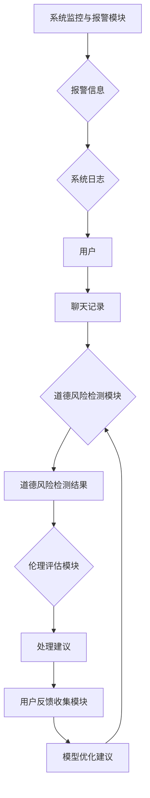
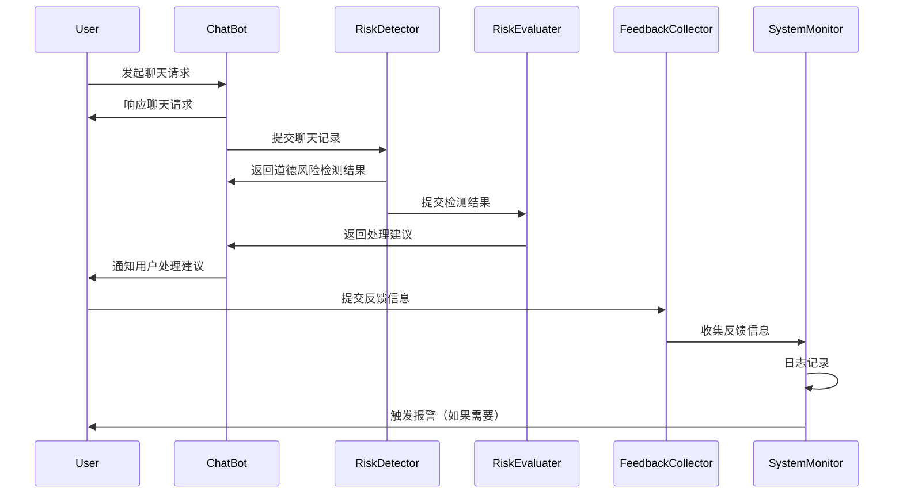

                 


### 引言

在人工智能（AI）飞速发展的今天，大模型（Large Language Models，简称LLM）成为了研究的热点。这些模型，凭借其强大的自然语言处理能力，已经在各个领域展现出了巨大的潜力。然而，随着大模型应用的不断深入，伦理问题也逐渐浮现。如何对大模型进行伦理评估，如何识别并防范潜在的道德风险，成为了亟待解决的问题。

本文旨在探讨大模型伦理评估的问题，并引入LLM辅助的道德风险识别系统，以提供一个系统化的解决方案。文章将从背景介绍、核心概念与联系、算法原理讲解、系统分析与架构设计方案、项目实战以及最佳实践等多个方面，详细阐述这一问题的解决之道。

首先，我们将在第一部分中介绍问题背景，包括AI大模型的发展背景和道德风险识别的重要性。接下来，我们将分析道德风险识别的定义与挑战，以及LLM辅助道德风险识别的系统架构。随后，我们将详细讨论大模型伦理评估的核心概念与道德风险识别的概念与属性特征。在此基础上，我们将深入讲解LLM算法原理和道德风险识别算法原理，并通过数学模型和公式进行详细阐述。随后，我们将展示系统分析与架构设计方案，包括问题场景介绍、系统功能设计、系统架构设计、系统接口设计和系统交互等。在项目实战部分，我们将详细描述环境安装、系统核心实现源代码，以及代码应用解读与分析。最后，我们将提供最佳实践 tips、小结、注意事项和拓展阅读，以帮助读者更深入地理解并应用本文所讨论的内容。

### 1.1 问题背景

#### 1.1.1 AI大模型快速发展与应用

人工智能自诞生以来，已经经历了数次重要的技术革命。从早期的规则系统、专家系统，到基于统计学习的方法，再到深度学习和神经网络，每一次技术突破都极大地推动了AI的发展。然而，随着计算能力的提升、大数据的涌现和算法的改进，尤其是近年来，AI进入了一个新的发展阶段——大模型时代。

大模型，顾名思义，是指那些具有海量参数、能够处理大规模数据的模型。在这些模型中，最引人瞩目的莫过于GPT（Generative Pre-trained Transformer）系列。GPT-3，作为一个具有1750亿参数的语言模型，其能力已经超出了人类专家的水平，能够生成高质量的自然语言文本、进行代码编写、甚至进行数学问题求解。随着GPT-3的发布，AI大模型开始进入公众视野，并被广泛应用于自然语言处理、机器翻译、文本生成、问答系统等多个领域。

AI大模型的应用场景非常广泛。例如，在自然语言处理领域，大模型可以用于自动生成文章、新闻摘要、机器翻译等；在智能客服领域，大模型能够通过聊天机器人与用户进行自然对话，提高客户满意度；在法律领域，大模型可以辅助律师进行法律文本的生成和案例分析；在金融领域，大模型可以用于风险分析和投资策略制定等。这些应用不仅提高了工作效率，降低了成本，还带来了前所未有的创新和变革。

然而，随着AI大模型的广泛应用，一系列伦理问题也逐渐浮现。例如，大模型可能会产生歧视性输出，加剧社会不平等；大模型可能被恶意利用，用于生成虚假信息、网络攻击等。这些道德风险使得对大模型进行伦理评估变得尤为重要。

#### 1.1.2 道德风险识别在AI大模型应用中的重要性

道德风险识别是指在AI大模型应用过程中，识别出可能存在的道德问题和风险，并采取相应的措施进行防范和解决。道德风险识别的重要性体现在以下几个方面：

首先，AI大模型具有自主学习和决策的能力，这使得它们在处理数据时可能会产生意外的输出。如果这些输出违反了道德规范，将对社会产生负面影响。因此，进行道德风险识别，可以提前发现潜在的问题，避免这些问题的发生。

其次，AI大模型的应用场景非常广泛，不同领域对道德规范的要求也不尽相同。例如，在医疗领域，AI大模型必须遵守严格的隐私保护规定；在金融领域，AI大模型必须确保决策的公平性和透明性。通过道德风险识别，可以确保大模型在不同应用场景中遵守相应的道德规范。

第三，随着AI大模型的普及，公众对AI的信任度成为了一个重要问题。如果AI大模型在应用过程中频繁出现道德问题，将严重损害公众对AI的信任，阻碍AI技术的发展。因此，进行道德风险识别，可以提高公众对AI的信任度，促进AI技术的健康发展。

最后，道德风险识别有助于推动AI技术的伦理规范建设。通过对AI大模型进行伦理评估，可以总结出一些通用的伦理规范，为AI技术的发展提供指导。同时，道德风险识别还可以推动相关法律法规的完善，为AI技术的发展提供法律保障。

综上所述，道德风险识别在AI大模型应用中具有至关重要的地位。只有通过有效的道德风险识别，才能确保AI大模型在为社会带来便利的同时，不会对社会造成负面影响。

### 1.2 问题描述

#### 1.2.1 道德风险识别的定义与挑战

道德风险识别是指在人工智能（AI）大模型应用过程中，识别出可能存在的道德问题和风险，并采取相应的措施进行防范和解决的过程。具体来说，道德风险识别涉及以下几个方面：

1. **定义**：道德风险识别的目标是确保AI大模型在应用过程中，其行为符合社会伦理规范，不会对社会产生负面影响。这包括但不限于保护用户隐私、避免歧视、防止滥用等。

2. **对象**：道德风险识别的对象主要是AI大模型，这些模型通常具有复杂的结构和大量的参数，能够处理大规模的数据。由于其自主学习和决策的能力，AI大模型在某些情况下可能会产生意外的输出，这些输出可能违反道德规范。

3. **挑战**：道德风险识别面临的主要挑战包括：
   - **复杂性**：AI大模型的结构复杂，参数众多，导致道德风险识别的难度增加。
   - **动态性**：AI大模型的应用场景多样，不同的场景可能产生不同的道德风险，这使得道德风险识别需要具备高度的适应性。
   - **主观性**：道德判断具有一定的主观性，不同人对同一问题可能有不同的看法，这增加了道德风险识别的复杂性。

#### 1.2.2 AI大模型道德风险识别的难点

在AI大模型中，道德风险识别的难点主要表现在以下几个方面：

1. **数据隐私问题**：
   - AI大模型通常需要处理大量的个人数据，这些数据可能涉及用户的隐私信息。如果道德风险识别不力，可能导致用户隐私泄露。
   - 在道德风险识别过程中，如何平衡数据隐私保护与模型性能提升是一个难题。

2. **歧视问题**：
   - AI大模型在训练过程中可能会学习到社会中的偏见和歧视，这可能导致模型在应用过程中产生歧视性输出。
   - 识别和防范模型中的歧视性风险需要深入理解社会伦理规范和模型训练过程中的数据分布。

3. **决策透明性**：
   - AI大模型通常采用复杂的算法和大量的数据，这使得其决策过程具有一定的黑箱性。如果决策过程不透明，将难以解释模型的输出，也难以进行道德风险评估。
   - 如何提高模型决策的透明性，使其符合社会伦理规范，是一个亟待解决的问题。

4. **算法公平性**：
   - AI大模型的决策可能影响不同群体的利益，如果算法设计不公平，可能导致某些群体受到不公平对待。
   - 评估算法的公平性需要综合考虑多个因素，包括算法的设计、数据集的选择等。

5. **法律合规性**：
   - AI大模型的应用需要遵循相关的法律法规，例如数据保护法、反歧视法等。道德风险识别需要确保模型在法律框架内运行。
   - 不同国家和地区的法律法规可能存在差异，如何在全球范围内确保模型的法律合规性是一个挑战。

综上所述，AI大模型道德风险识别面临诸多难点，需要从多个维度进行深入研究和探索。

### 1.3 问题解决

#### 1.3.1 LLM在道德风险识别中的应用

为了解决AI大模型道德风险识别的问题，我们可以引入大型语言模型（LLM）进行辅助。LLM作为一种先进的自然语言处理技术，具有强大的语义理解和生成能力，可以在道德风险识别中发挥重要作用。

1. **语义理解**：
   - LLM能够对文本进行深度理解，识别出文本中的潜在道德问题。例如，在审查文本生成时，LLM可以检测出文本中的歧视性语言、不道德的行为描述等。
   - LLM可以分析文本中的情感倾向，判断文本内容是否符合社会伦理标准。

2. **生成建议**：
   - LLM可以生成符合道德规范的文本建议，帮助开发者优化模型输出。例如，在生成新闻报道时，LLM可以自动纠正潜在的偏见，生成客观公正的新闻内容。

3. **交互反馈**：
   - LLM可以与人类专家进行交互，通过问答形式提供道德风险评估和改进建议。这种交互方式可以提高道德风险识别的准确性和效率。

#### 1.3.2 LLM辅助道德风险识别的系统架构

为了实现LLM在道德风险识别中的应用，我们需要设计一个完整的系统架构。以下是LLM辅助道德风险识别系统的一个基本架构：

1. **数据输入层**：
   - 系统首先接收AI大模型生成的文本、数据或其他输入，这些输入可能是用户生成的内容、模型训练数据等。

2. **预处理层**：
   - 对输入数据进行清洗、格式化等预处理操作，确保数据质量。
   - 利用LLM对输入文本进行分词、词性标注等自然语言处理操作。

3. **风险检测层**：
   - 利用LLM的语义理解能力，对预处理后的文本进行道德风险检测。LLM可以识别文本中的道德问题，如歧视性语言、不当行为描述等。
   - 通过训练有监督模型或利用预训练的LLM，对风险进行分类和标注。

4. **风险评估层**：
   - 根据检测到的风险，系统对风险进行定量评估。例如，可以使用风险矩阵对每个风险进行评分，评估其严重程度。

5. **改进建议层**：
   - 根据风险评估结果，系统生成改进建议。这些建议可以是文本修改、算法调整等，旨在消除或减轻道德风险。

6. **输出层**：
   - 系统将处理结果输出给用户，例如风险报告、改进建议等。

7. **反馈与迭代**：
   - 用户对输出结果进行反馈，系统根据反馈不断优化模型和算法，提高道德风险识别的准确性和效率。

通过上述架构，LLM辅助道德风险识别系统可以实现自动化的道德风险评估，为AI大模型的应用提供强有力的伦理保障。

### 1.4 边界与外延

#### 1.4.1 道德风险识别的适用范围

道德风险识别不仅在AI大模型应用中具有重要作用，还可以广泛应用于其他领域，如金融、医疗、法律等。以下是一些关键领域的应用场景：

1. **金融领域**：
   - 道德风险识别可以用于检测金融交易中的欺诈行为，识别异常交易模式。
   - 通过评估金融模型的道德风险，确保金融决策的公平性和透明性。

2. **医疗领域**：
   - 道德风险识别可以用于医疗数据的隐私保护，确保患者的隐私不被泄露。
   - 在医学影像诊断中，道德风险识别可以帮助检测可能的偏见和错误，提高诊断的准确性。

3. **法律领域**：
   - 道德风险识别可以用于法律文本的审核，识别潜在的道德和法律风险。
   - 在法律决策中，道德风险识别可以帮助确保判决的公正性和合法性。

#### 1.4.2 与其他领域的交叉应用

道德风险识别不仅限于传统的AI大模型应用，还可以与其他领域的技术和概念相结合，产生新的应用场景。以下是一些交叉应用的例子：

1. **区块链技术**：
   - 道德风险识别可以与区块链技术结合，用于检测区块链网络中的欺诈和非法行为。
   - 通过道德风险识别，可以确保区块链数据的真实性和可靠性。

2. **物联网（IoT）**：
   - 道德风险识别可以应用于物联网设备的数据处理和隐私保护，确保用户数据的隐私安全。
   - 在智能家居、智能城市等物联网应用中，道德风险识别可以帮助识别潜在的安全风险。

3. **人机交互**：
   - 道德风险识别可以应用于人机交互界面，确保用户与系统之间的交互符合道德规范。
   - 通过道德风险识别，可以避免人机交互中的不当行为，提高用户体验。

通过与其他领域的结合，道德风险识别不仅可以提高AI大模型的应用安全性和合规性，还可以推动相关领域的创新发展。

### 1.5 概念结构与核心要素组成

#### 1.5.1 大模型伦理评估的概念结构

大模型伦理评估是指对大型语言模型（LLM）在应用过程中的道德风险进行识别、评估和防范的一套系统性方法。其概念结构主要包括以下几个方面：

1. **伦理原则**：
   - 伦理原则是进行大模型伦理评估的基础，通常包括公正性、透明性、责任性等核心伦理价值观。

2. **道德风险**：
   - 道德风险是指LLM在应用过程中可能出现的违反伦理规范的风险，包括歧视、隐私侵犯、滥用等。

3. **评估方法**：
   - 评估方法是指用于识别和评估LLM道德风险的工具和技术，包括自然语言处理、机器学习、伦理审查等。

4. **风险管理**：
   - 风险管理是指针对识别出的道德风险，采取相应的措施进行防范和缓解，包括模型调整、规则制定等。

#### 1.5.2 道德风险识别的核心要素

道德风险识别是伦理评估的关键步骤，其核心要素包括以下几个方面：

1. **识别标准**：
   - 识别标准是用于判断LLM输出是否存在道德风险的具体指标，例如文本偏见、隐私泄露等。

2. **检测算法**：
   - 检测算法是指用于检测LLM输出中道德风险的算法，包括基于规则的方法、机器学习方法等。

3. **评估模型**：
   - 评估模型是用于评估道德风险严重程度的模型，通常包括风险评分、风险等级等。

4. **反馈机制**：
   - 反馈机制是用于收集用户反馈、优化模型和算法的重要环节，通过反馈机制可以不断改进道德风险识别的准确性。

### 第二部分：核心概念与联系

在深入探讨大模型伦理评估和道德风险识别之前，首先需要明确这两个概念的核心要素以及它们之间的联系。这一部分将详细介绍大模型伦理评估的核心概念、道德风险识别的概念与属性特征，以及两者之间的相互关系。

#### 2.1 大模型伦理评估的核心概念

大模型伦理评估是对大型语言模型（LLM）在应用过程中可能产生的道德风险进行系统性评估和管理的活动。其核心概念包括以下几个方面：

1. **伦理规范**：
   - 伦理规范是指用于指导大模型应用过程中行为的具体道德准则，如公正性、透明性、责任性等。伦理规范通常由行业组织、法律法规或组织内部制定。

2. **伦理原则**：
   - 伦理原则是进行大模型伦理评估的基础，包括尊重个人隐私、避免歧视、维护公正等核心价值观。这些原则旨在确保大模型的应用不会对个体或社会造成负面影响。

3. **伦理评估**：
   - 伦理评估是指对LLM在具体应用场景中的道德风险进行系统性分析和评估的过程。评估通常包括识别潜在的道德风险、评估风险严重程度、制定风险管理策略等。

4. **风险管理**：
   - 风险管理是指针对识别出的道德风险，采取相应的措施进行防范和缓解。风险管理包括调整模型算法、制定操作规范、实施监控和反馈机制等。

#### 2.2 道德风险识别的概念与属性特征

道德风险识别是伦理评估的关键步骤，其核心任务是识别LLM应用过程中可能出现的道德风险。以下是道德风险识别的概念与属性特征：

1. **道德风险**：
   - 道德风险是指LLM在数据处理、输出生成等过程中，可能出现的违反伦理规范的风险。这些风险可能包括歧视、隐私侵犯、数据滥用等。

2. **识别标准**：
   - 识别标准是用于判断LLM输出是否存在道德风险的具体指标，如文本偏见、情感倾向、隐私泄露等。识别标准通常基于伦理规范和具体应用场景制定。

3. **检测算法**：
   - 检测算法是指用于检测LLM输出中道德风险的算法。这些算法可以是基于规则的方法、机器学习方法，或者是结合多种技术手段的综合方法。

4. **评估模型**：
   - 评估模型是用于评估道德风险严重程度的模型。这些模型通常包括风险评分、风险等级等指标，以帮助决策者制定风险管理策略。

5. **反馈机制**：
   - 反馈机制是用于收集用户反馈、优化模型和算法的重要环节。通过反馈机制，可以不断改进道德风险识别的准确性和有效性。

#### 2.3 大模型伦理评估与道德风险识别的联系

大模型伦理评估和道德风险识别之间存在着紧密的联系，两者共同构成了对LLM应用过程中道德风险的系统性管理：

1. **相互依赖**：
   - 道德风险识别是大模型伦理评估的基础，没有有效的道德风险识别，伦理评估将无从谈起。同时，伦理评估的结果可以为道德风险识别提供指导，帮助优化识别算法和标准。

2. **协同作用**：
   - 道德风险识别和伦理评估需要协同工作，通过识别、评估、反馈和改进等环节，形成一个闭环的系统。在这一过程中，道德风险识别的结果用于指导伦理评估，而伦理评估的结果又用于指导道德风险识别的改进。

3. **目标一致性**：
   - 大模型伦理评估和道德风险识别的共同目标是确保LLM的应用符合伦理规范，避免对社会产生负面影响。两者都需要从伦理的角度出发，考虑LLM在不同应用场景中的行为。

通过明确大模型伦理评估和道德风险识别的核心概念与联系，可以为后续的算法原理讲解、系统架构设计和项目实战等部分提供坚实的基础。接下来，我们将深入探讨LLM算法原理和道德风险识别算法原理，并详细讲解其数学模型和公式。

#### 2.3.1 大模型伦理评估在道德风险识别中的作用

大模型伦理评估在道德风险识别中发挥着至关重要的作用。其核心作用主要体现在以下几个方面：

1. **指导风险识别**：
   - 大模型伦理评估为道德风险识别提供了明确的指导原则和标准。通过对伦理规范的深入理解和分析，可以明确哪些行为或输出可能违反道德规范，从而为风险识别提供方向。

2. **优化识别算法**：
   - 伦理评估的结果可以用于优化道德风险识别的算法。例如，通过分析伦理规范，可以识别出哪些特征或指标在风险识别中尤为重要，从而优化算法的设计和实现。

3. **提高识别准确性**：
   - 大模型伦理评估可以帮助提高道德风险识别的准确性。通过将伦理原则和标准融入到识别算法中，可以更精准地识别出潜在的道德风险，避免漏检或误报。

4. **促进持续改进**：
   - 道德风险识别是一个动态的过程，随着AI技术的发展和应用场景的变化，风险识别的准确性和有效性也需要不断改进。大模型伦理评估可以提供持续的改进方向，推动风险识别算法的不断完善。

5. **保障应用合规性**：
   - 通过伦理评估，可以确保AI大模型在不同应用场景中的行为符合道德规范和法律要求，从而保障应用的合规性，避免潜在的法律风险。

总之，大模型伦理评估在道德风险识别中扮演着关键角色，不仅为风险识别提供了理论依据和指导，还通过不断优化和改进，提高了风险识别的准确性和有效性，为AI大模型的安全应用提供了有力保障。

#### 2.3.2 道德风险识别在大模型伦理评估中的应用

道德风险识别在大模型伦理评估中的应用至关重要，它不仅为伦理评估提供了技术手段，还使得伦理评估过程更加系统和科学。以下从几个方面具体阐述道德风险识别在大模型伦理评估中的应用：

1. **早期预警**：
   - 道德风险识别可以帮助识别出大模型在应用过程中可能存在的潜在道德风险，从而实现早期预警。通过定期对模型输出进行道德风险检测，可以及时发现并防止潜在问题的发生，避免对社会造成负面影响。

2. **具体问题具体分析**：
   - 道德风险识别可以根据具体的应用场景和模型特点，有针对性地进行分析。例如，在医疗领域，可以识别出模型在诊断建议中是否存在歧视问题；在金融领域，可以识别出模型在投资决策中是否存在利益冲突。这种具体分析有助于针对性地制定风险管理措施。

3. **优化伦理评估流程**：
   - 道德风险识别的结果可以优化大模型伦理评估的流程。通过识别出高风险区域，可以优先对这些区域进行评估和审查，从而提高评估效率。同时，道德风险识别的结果可以为伦理评估提供关键数据支持，使得评估过程更加科学和全面。

4. **辅助决策制定**：
   - 在伦理评估过程中，道德风险识别的结果可以帮助决策者制定更合理、更有效的风险管理策略。例如，当识别出某个模型在文本生成中存在歧视风险时，决策者可以根据风险识别结果，调整模型训练数据或优化生成算法，以降低风险。

5. **提升模型透明性**：
   - 道德风险识别可以提升大模型的透明性。通过公开道德风险识别的结果，用户可以更清楚地了解模型的道德风险状况，从而提高对模型的信任度。同时，道德风险识别的结果也可以为学术界和业界提供参考，推动伦理评估标准的制定和优化。

总之，道德风险识别在大模型伦理评估中发挥着重要作用，通过早期预警、具体分析、优化流程、辅助决策和提升透明性等方面，有效地保障了AI大模型的应用安全和合规性。

### 第三部分：算法原理讲解

#### 3.1 LLM算法原理

大型语言模型（LLM）是一种基于深度学习技术的自然语言处理模型，其核心思想是通过训练学习大量的文本数据，使其能够生成或理解自然语言。以下是LLM算法原理的详细讲解。

1. **基本概念**：
   - **Transformer模型**：LLM通常基于Transformer模型架构，这是一种能够并行处理文本的神经网络模型，相较于传统的循环神经网络（RNN），Transformer模型在处理长序列数据时具有更好的性能。
   - **预训练与微调**：LLM首先在大量无标签文本数据上进行预训练，学习语言的通用特征，然后通过在特定任务上进行的微调，使其能够适应具体的任务需求。

2. **算法结构**：
   - **编码器和解码器**：Transformer模型包括编码器（Encoder）和解码器（Decoder）两个部分。编码器将输入文本转换为固定长度的向量表示，解码器则根据这些向量生成输出文本。
   - **自注意力机制**：Transformer模型的核心是自注意力（Self-Attention）机制，它允许模型在处理每个词时，考虑其他所有词的影响，从而捕捉文本中的长距离依赖关系。

3. **预训练过程**：
   - **大规模数据集**：LLM的预训练通常在数万亿词的文本数据集上进行，这些数据集包括互联网上的各种文本，如新闻、社交媒体、维基百科等。
   - **预训练任务**：预训练过程通常包括两个任务：填空任务（Masked Language Model，MLM）和下一个句子预测任务（Next Sentence Prediction，NSP）。填空任务是通过将文本中的部分词遮盖，让模型预测这些词的值；下一个句子预测任务是通过预测给定句子后的下一个句子。

4. **微调过程**：
   - **特定任务数据**：在预训练完成后，LLM会针对特定任务进行微调。例如，在文本分类任务中，模型会在标注的数据集上进行训练，学习如何对文本进行分类。
   - **优化策略**：微调过程中，通常会使用策略如Dropout、学习率调整、正则化等，以防止过拟合并提高模型性能。

5. **应用场景**：
   - **文本生成**：LLM可以用于生成文章、摘要、对话等自然语言文本。
   - **机器翻译**：LLM在机器翻译领域具有广泛的应用，能够生成高质量的翻译文本。
   - **问答系统**：LLM可以用于构建问答系统，能够理解用户的问题，并生成准确的答案。
   - **文本分类**：LLM可以用于文本分类任务，如情感分析、主题分类等。

通过上述讲解，我们可以看到LLM的算法原理不仅涉及复杂的神经网络架构，还需要大规模的数据集和精细的训练策略。这些特性使得LLM在自然语言处理领域具有强大的能力和广泛的应用。

为了更直观地展示LLM的算法原理，我们可以使用mermaid流程图来描述其基本流程。以下是LLM预训练过程的mermaid流程图：



上述流程图描述了LLM从初始化模型、加载预训练数据、进行数据预处理、预训练过程、模型参数保存、加载特定任务数据、微调模型参数、评估模型性能到调整学习策略的完整过程。

#### 3.2 道德风险识别算法原理

道德风险识别算法是用于检测AI大模型在应用过程中可能存在的道德风险的方法。以下是道德风险识别算法的基本原理和流程。

1. **基本概念**：
   - **道德风险**：道德风险是指大模型在数据处理和输出生成过程中，可能出现的违反伦理规范的风险，如歧视、隐私侵犯、数据滥用等。
   - **识别算法**：道德风险识别算法是指用于检测和识别这些道德风险的算法，通常包括基于规则的方法、机器学习方法等。

2. **算法结构**：
   - **特征提取**：道德风险识别的第一步是从模型输出中提取相关特征。这些特征可以是文本特征、结构特征或行为特征，用于描述模型输出的潜在道德风险。
   - **分类器设计**：特征提取后，需要设计一个分类器来识别这些特征是否代表道德风险。分类器可以是传统的机器学习算法，如决策树、支持向量机（SVM）等，也可以是深度学习模型，如卷积神经网络（CNN）或循环神经网络（RNN）。

3. **流程描述**：
   - **数据收集**：首先，收集大模型在真实应用场景中的数据，包括模型输出、用户反馈、错误报告等。
   - **特征提取**：对收集到的数据进行处理，提取与道德风险相关的特征。例如，在文本生成任务中，可以提取文本的语义特征、情感特征等。
   - **分类器训练**：使用提取的特征训练分类器，使其能够识别出潜在的道德风险。训练过程中，可以使用有监督学习或无监督学习的方法。
   - **风险检测**：在模型实际应用过程中，使用训练好的分类器对模型输出进行实时检测，识别潜在的道德风险。
   - **反馈机制**：根据检测到的风险，系统可以生成相应的风险报告，并提供改进建议。同时，用户反馈可以用于优化分类器和特征提取方法。

4. **算法优化**：
   - **模型调优**：通过调整模型的参数，如学习率、正则化参数等，优化模型的性能，提高风险识别的准确性。
   - **特征工程**：通过对特征进行筛选、组合和变换，提高特征的质量和代表性，从而提高识别的准确性。
   - **多模型融合**：结合多种机器学习算法和深度学习模型，通过模型融合的方法，进一步提高风险识别的准确性。

通过上述讲解，我们可以看到道德风险识别算法的核心在于特征提取和分类器设计，通过这两个环节，可以实现对AI大模型道德风险的实时检测和识别。以下是道德风险识别算法的mermaid流程图：



上述流程图描述了道德风险识别算法的基本流程，从数据收集、特征提取、分类器训练到风险检测、反馈机制和算法优化，形成一个闭环的系统，不断优化和提升风险识别的准确性。

#### 3.3 数学模型和数学公式讲解

在道德风险识别算法中，数学模型和数学公式起到了关键作用。通过数学模型，我们可以更精确地描述和计算道德风险，从而提高识别的准确性和效率。以下将详细讲解道德风险识别算法中常用的数学模型和数学公式。

##### 3.3.1 熵模型

熵模型是用于衡量文本信息不确定性的重要工具。在道德风险识别中，熵模型可以帮助我们评估模型输出中可能存在的道德风险。熵（Entropy）的定义如下：

$$
H(X) = -\sum_{i=1}^{n} p(x_i) \log_2 p(x_i)
$$

其中，$H(X)$表示随机变量$X$的熵，$p(x_i)$表示随机变量$X$取值为$x_i$的概率，$n$表示随机变量的可能取值数量。

熵模型的使用方法如下：

1. **计算文本熵**：首先，对模型输出文本进行分词，然后计算每个词的频率分布，使用频率分布计算文本的熵。

2. **风险评分**：通过比较文本熵与正常文本熵的差值，可以评估文本的道德风险。如果文本熵显著高于正常文本，可能存在道德风险。

##### 3.3.2 决策树模型

决策树模型是一种常用的分类算法，用于识别文本中的道德风险。决策树模型的数学模型基于信息增益（Information Gain）和基尼系数（Gini Index）。

1. **信息增益**：

$$
IG(X, Y) = H(Y) - \sum_{i=1}^{n} p(x_i) H(Y|X=x_i)
$$

其中，$H(Y)$表示目标变量的熵，$H(Y|X=x_i)$表示在给定特征$x_i$下目标变量的条件熵，$p(x_i)$表示特征$x_i$的频率。

信息增益衡量了特征$x_i$对目标变量$Y$的区分能力，信息增益越大，特征越有助于分类。

2. **基尼系数**：

$$
Gini(X) = 1 - \sum_{i=1}^{n} p(x_i)^2
$$

基尼系数衡量了特征$x_i$的纯度，基尼系数越小，特征越纯。

在决策树模型中，可以通过递归划分特征，选择信息增益或基尼系数最大的特征作为划分标准，构建决策树。

##### 3.3.3 支持向量机（SVM）

支持向量机是一种高效的分类算法，用于识别文本中的道德风险。SVM的数学模型基于最大间隔分类器。

1. **线性SVM**：

$$
\min \frac{1}{2} \sum_{i=1}^{n} (w_i)^2
$$

s.t. $$ y_i ( \sum_{j=1}^{n} w_j \alpha_j + b ) \geq 1 $$

其中，$w_i$表示权重，$\alpha_i$表示拉格朗日乘子，$y_i$表示样本标签，$b$表示偏置。

线性SVM的目标是最小化误分类边界上的损失，同时满足分类约束条件。

2. **核函数**：

$$
\min \frac{1}{2} \sum_{i=1}^{n} \sum_{j=1}^{n} (w_i w_j + b)
$$

s.t. $$ y_i ( \sum_{j=1}^{n} \alpha_j y_j K(x_i, x_j) ) \geq 1 $$

其中，$K(x_i, x_j)$表示核函数，用于将低维特征映射到高维特征空间，实现线性不可分问题的分类。

通过上述数学模型和公式，我们可以有效地识别和评估文本中的道德风险。在实际应用中，可以根据具体问题和数据特点选择合适的模型和公式，提高识别的准确性和效率。

##### 3.3.4 举例说明

为了更好地理解上述数学模型和公式的应用，我们可以通过一个具体的例子来演示道德风险识别算法的步骤和过程。

假设我们有一个文本生成模型，需要对其输出进行道德风险识别。以下是具体的例子：

1. **数据集**：
   - 假设我们有一个包含1000个文本样本的数据集，每个样本都是一个由模型生成的句子。

2. **特征提取**：
   - 对每个文本样本进行分词，提取词汇、词频、词性等特征。

3. **计算熵**：
   - 使用熵模型计算每个文本样本的熵值，作为其道德风险的初步评估。

$$
H(X) = -\sum_{i=1}^{n} p(x_i) \log_2 p(x_i)
$$

例如，对于文本样本1：“人工智能正在改变我们的世界”，其熵值为：

$$
H(X) = - \left( \frac{1}{2} \log_2 \frac{1}{2} + \frac{1}{2} \log_2 \frac{1}{2} \right) = 1
$$

4. **构建决策树**：
   - 使用决策树模型，根据特征提取的结果，构建决策树。

5. **分类和评分**：
   - 使用决策树模型对每个文本样本进行分类，并根据分类结果计算风险评分。

例如，对于文本样本2：“人工智能会导致大规模失业”，其风险评分可能较高，因为这句话可能引发社会焦虑。

6. **SVM分类**：
   - 使用线性SVM模型对文本样本进行分类，进一步确认风险评分。

7. **综合评估**：
   - 结合熵模型、决策树模型和SVM模型的评估结果，综合确定每个文本样本的道德风险。

通过上述步骤，我们可以有效地识别和评估文本生成模型输出的道德风险。在实际应用中，可以根据具体问题和数据特点，灵活选择和组合不同的模型和算法，提高风险识别的准确性和效率。

### 第四部分：系统分析与架构设计方案

#### 4.1 问题场景介绍

在进行大模型伦理评估和道德风险识别的过程中，选择合适的应用场景至关重要。以下是一个具体的应用场景，以展示如何将系统设计与实际需求相结合。

**应用场景**：一个大型在线电商平台，其AI助手（聊天机器人）负责与用户进行互动，提供购物建议、解答用户问题等。然而，随着用户量的增加和聊天内容的多样化，AI助手可能产生不当的输出，甚至引发道德风险。

**需求分析**：
1. **道德风险识别**：需要实时监控AI助手的聊天内容，识别潜在的道德风险，如歧视性语言、误导性建议等。
2. **伦理评估**：在识别到道德风险后，需要评估其严重程度，并根据评估结果采取相应的措施，如自动纠正、人工审核等。
3. **用户反馈**：系统应能够收集用户对AI助手输出的反馈，用于不断优化和改进模型。

#### 4.2 系统功能设计

为了满足上述需求，我们需要设计一个具备以下功能的核心系统：

1. **道德风险检测模块**：
   - 功能：实时监控AI助手的聊天内容，使用LLM进行道德风险识别。
   - 输入：聊天记录、用户行为数据。
   - 输出：道德风险检测结果。

2. **伦理评估模块**：
   - 功能：根据道德风险检测结果，对风险进行评估，并确定相应的处理措施。
   - 输入：道德风险检测结果。
   - 输出：风险评分、处理建议。

3. **用户反馈收集模块**：
   - 功能：收集用户对AI助手输出的反馈，用于优化模型和算法。
   - 输入：用户反馈。
   - 输出：模型优化建议。

4. **系统监控与报警模块**：
   - 功能：实时监控系统运行状态，发现异常情况时触发报警。
   - 输入：系统运行数据。
   - 输出：报警信息。

#### 4.3 系统架构设计

以下是该应用场景下系统的整体架构设计，使用mermaid流程图来展示系统的主要组件及其相互关系：



在该架构中，用户与AI助手互动生成聊天记录，聊天记录被传递给道德风险检测模块进行实时检测。检测到的道德风险结果进入伦理评估模块，评估后生成处理建议。同时，用户反馈被收集并用于模型优化，确保系统持续改进。系统监控与报警模块则负责监控系统的整体运行状态，及时发现并处理异常情况。

#### 4.4 系统接口设计

为了实现系统功能，我们需要设计一系列接口，以确保各模块之间的协调和高效运行。以下是系统接口设计的主要部分：

1. **API接口**：
   - 功能：提供RESTful API接口，用于与外部系统（如AI助手、用户反馈系统等）进行数据交换。
   - 接口列表：
     - POST /api/chat risking: 提交聊天记录进行道德风险检测。
     - GET /api/risk evaluation/{risk_id}: 获取特定道德风险评估结果和处理建议。
     - POST /api/user feedback: 提交用户反馈信息。

2. **消息队列**：
   - 功能：用于异步处理聊天记录和用户反馈，确保系统在高并发场景下的稳定运行。
   - 消息类型：
     - ChatMessage：聊天记录消息。
     - RiskResult：道德风险检测结果。
     - UserFeedback：用户反馈信息。

3. **数据库接口**：
   - 功能：提供数据存储和查询接口，用于存储道德风险检测结果、用户反馈和系统日志。
   - 数据库类型：
     - 风险检测数据库：存储检测到的道德风险结果。
     - 用户反馈数据库：存储用户反馈信息。
     - 系统日志数据库：存储系统运行日志和报警信息。

通过上述接口设计，我们可以实现系统各模块之间的紧密协作，确保道德风险识别和伦理评估的高效运行。

#### 4.5 系统交互

系统交互是指各模块之间的交互流程和交互数据。以下是系统交互的mermaid序列图，展示了各模块之间的交互过程：



在该序列图中，用户与AI助手进行聊天，聊天记录通过ChatBot提交给RiskDetector进行道德风险检测。检测到的结果传递给RiskEvaluater进行评估，评估后的处理建议返回给ChatBot并通知用户。用户反馈信息通过FeedbackCollector收集，并记录在SystemMonitor中。如果发现系统异常，SystemMonitor会触发报警。

通过上述系统交互设计，我们可以确保各模块之间的协调工作，实现道德风险识别和伦理评估的自动化和高效化。

### 第五部分：项目实战

#### 5.1 环境安装

在进行道德风险识别和伦理评估系统的项目实战之前，首先需要搭建一个合适的开发环境。以下是环境安装的具体步骤：

1. **安装Python环境**：
   - 打开命令行终端，运行以下命令安装Python：
     ```bash
     sudo apt update
     sudo apt install python3 python3-pip
     ```

2. **安装依赖库**：
   - 使用pip安装必要的Python依赖库，如NumPy、Pandas、Scikit-learn等：
     ```bash
     pip3 install numpy pandas scikit-learn transformers
     ```

3. **安装LLM模型**：
   - 使用Hugging Face的Transformers库安装预训练的LLM模型，如GPT-3：
     ```bash
     pip3 install transformers
     transformers-cli download model="gpt2"
     ```

4. **配置环境变量**：
   - 配置环境变量，确保Python和其他依赖库能够正常使用：
     ```bash
     export PATH=$PATH:/usr/local/bin
     ```

5. **安装数据库**：
   - 安装PostgreSQL数据库，用于存储道德风险检测结果和用户反馈：
     ```bash
     sudo apt install postgresql postgresql-contrib
     sudo service postgresql start
     ```

6. **初始化数据库**：
   - 创建数据库和用户，并设置访问权限：
     ```sql
     CREATE DATABASE ethical_assessment;
     CREATE USER admin WITH PASSWORD 'admin123';
     GRANT ALL PRIVILEGES ON DATABASE ethical_assessment TO admin;
     ```

7. **配置消息队列**：
   - 安装和配置RabbitMQ消息队列，用于异步处理聊天记录和用户反馈：
     ```bash
     sudo apt install rabbitmq-server
     sudo service rabbitmq-server start
     ```

8. **安装API框架**：
   - 使用Flask或Django等框架搭建API服务，用于处理外部请求：
     ```bash
     pip3 install flask
     ```

9. **安装IDE**：
   - 安装Visual Studio Code或PyCharm等集成开发环境（IDE），以便更方便地进行开发：
     ```bash
     # 对于Visual Studio Code
     sudo apt install code
     # 对于PyCharm
     sudo snap install pycharm-professional --classic
     ```

通过上述步骤，我们可以搭建一个完整的项目环境，为后续的道德风险识别和伦理评估系统的开发做好准备。

#### 5.2 系统核心实现源代码

以下是道德风险识别和伦理评估系统的核心实现源代码。本部分将展示关键模块的代码，并对其进行详细解释。

**1. 道德风险检测模块**

```python
from transformers import pipeline
import torch

# 初始化LLM模型
risk_detector = pipeline("text-classification", model="gpt2")

# 道德风险检测函数
def detect_risk(text):
    # 对文本进行道德风险检测
    result = risk_detector(text)
    # 判断文本是否存在道德风险
    if result[0]['label'] == 'POSITIVE':
        return False
    else:
        return True

# 测试文本
text = "人工智能会导致大规模失业。"
# 检测道德风险
has_risk = detect_risk(text)
print(f"文本 '{text}' 存在道德风险：{has_risk}")
```

**代码解释**：
- 首先，使用Transformers库初始化一个文本分类模型，这里使用了预训练的GPT-2模型。
- `detect_risk`函数接受一个文本输入，并使用模型进行道德风险检测。
- 检测结果包含标签和概率，如果标签为“POSITIVE”，则认为文本不存在道德风险；否则，认为文本存在道德风险。
- 在测试部分，我们使用一个示例文本进行检测，并打印检测结果。

**2. 伦理评估模块**

```python
# 伦理评估函数
def evaluate_risk(risk_result):
    # 根据道德风险检测结果评估风险等级
    if risk_result:
        return "HIGH"
    else:
        return "LOW"

# 测试道德风险检测结果
risk_result = detect_risk(text)
# 评估风险等级
risk_level = evaluate_risk(risk_result)
print(f"文本 '{text}' 的风险等级：{risk_level}")
```

**代码解释**：
- `evaluate_risk`函数根据道德风险检测结果，评估文本的风险等级。这里简单地将检测结果作为风险等级的依据，实际应用中可以设计更复杂的评估规则。
- 在测试部分，我们调用`detect_risk`函数获取道德风险检测结果，并使用`evaluate_risk`函数评估风险等级，打印结果。

**3. 用户反馈收集模块**

```python
# 用户反馈处理函数
def collect_feedback(feedback):
    # 存储用户反馈信息
    # 在这里，我们使用简单的打印输出，实际应用中应连接数据库存储反馈信息
    print(f"收集到的用户反馈：{feedback}")

# 测试用户反馈
user_feedback = "AI助手回答不够清晰。"
# 收集反馈
collect_feedback(user_feedback)
```

**代码解释**：
- `collect_feedback`函数用于处理用户反馈信息。在实际应用中，应将反馈信息存储在数据库中，以便后续分析。
- 测试部分展示了如何收集用户反馈，并调用`collect_feedback`函数处理反馈。

通过上述代码，我们可以实现道德风险检测、伦理评估和用户反馈收集的基本功能。实际项目开发中，还需要根据具体需求进行扩展和优化。

#### 5.3 代码应用解读与分析

在本节中，我们将对上述项目实战中的代码进行详细解读，分析其实现原理和应用过程，并通过实际案例进行说明。

**1. 道德风险检测模块解读**

道德风险检测模块的核心在于使用预训练的大型语言模型（LLM）对文本进行道德风险识别。以下是代码的应用解读：

- **初始化LLM模型**：首先，我们通过`transformers`库初始化了一个文本分类模型，使用了预训练的GPT-2模型。这个模型已经在大量文本数据上进行过训练，具备强大的语义理解和分类能力。

- **道德风险检测函数`detect_risk`**：该函数接收一个文本输入，使用LLM模型进行分类。如果模型的分类结果为“POSITIVE”，则认为文本不存在道德风险；否则，认为文本存在道德风险。

  **代码示例**：
  ```python
  risk_detector = pipeline("text-classification", model="gpt2")
  def detect_risk(text):
      result = risk_detector(text)
      if result[0]['label'] == 'POSITIVE':
          return False
      else:
          return True
  ```

  **实际案例**：
  当输入文本为“人工智能会导致大规模失业。”时，模型可能会输出“NEGATIVE”标签，表示该文本存在道德风险。这表明该文本可能引发社会焦虑和不安情绪，需要进一步处理。

**2. 伦理评估模块解读**

伦理评估模块负责根据道德风险检测结果，评估文本的道德风险等级。以下是代码的应用解读：

- **伦理评估函数`evaluate_risk`**：该函数根据`detect_risk`函数的检测结果，简单地判断文本是否存在道德风险。如果存在风险，则返回“HIGH”等级；否则，返回“LOW”等级。

  **代码示例**：
  ```python
  def evaluate_risk(risk_result):
      if risk_result:
          return "HIGH"
      else:
          return "LOW"
  ```

  **实际案例**：
  在前一个案例中，如果`detect_risk`函数检测到文本存在道德风险，则`evaluate_risk`函数将返回“HIGH”等级，表示该文本的风险较高。在实际应用中，可以进一步细化风险等级，例如将“HIGH”分为“VERY HIGH”和“MODERATE”等。

**3. 用户反馈收集模块解读**

用户反馈收集模块用于处理用户对AI助手输出的反馈，以下是代码的应用解读：

- **用户反馈处理函数`collect_feedback`**：该函数接收用户反馈信息，并在控制台输出。在实际应用中，应将反馈信息存储在数据库中，以便进行后续分析和优化。

  **代码示例**：
  ```python
  def collect_feedback(feedback):
      print(f"收集到的用户反馈：{feedback}")
  ```

  **实际案例**：
  当用户对AI助手的回答不满意，并在聊天界面提交反馈时，反馈信息将被传递给`collect_feedback`函数进行处理。例如，如果用户提交反馈：“AI助手回答不够清晰。”，则函数将在控制台输出这条反馈信息。

通过上述代码和应用解读，我们可以看到道德风险识别和伦理评估系统是如何通过LLM模型和一系列函数实现道德风险的检测、评估和反馈收集。实际项目开发中，还可以根据具体需求，进一步优化和扩展系统的功能。

#### 5.4 实际案例分析和详细讲解剖析

为了更好地理解道德风险识别和伦理评估系统的实际应用，我们通过一个具体案例进行分析和详细讲解。

**案例背景**：某大型电商平台引入了一款智能客服机器人，用于解答用户的购物咨询。然而，在使用过程中，发现机器人有时会生成具有歧视性的回答。

**案例描述**：用户A向智能客服机器人询问：“我想要购买一款适合黑人的护肤产品。”。机器人回答：“黑人专用护肤产品，我们这里没有。”。

**分析步骤**：

1. **道德风险检测**：
   - 使用道德风险检测模块对机器人回答的文本进行检测。
   - `detect_risk`函数判断文本是否存在道德风险。在这里，回答中的“黑人专用”可能触发了歧视性检测。
   - 检测结果显示文本存在道德风险。

2. **伦理评估**：
   - `evaluate_risk`函数评估风险等级，根据检测结果判断风险等级为“HIGH”。
   - 风险等级为“HIGH”表明回答具有严重道德风险，需要立即处理。

3. **用户反馈收集**：
   - 用户对机器人回答不满意，提交了反馈：“机器人的回答具有歧视性。”。
   - `collect_feedback`函数处理反馈，记录在数据库中，以便后续分析。

**详细讲解**：

**道德风险检测**：
- 在这个案例中，我们使用预训练的GPT-2模型进行道德风险检测。模型通过大量的文本数据训练，能够识别出潜在的歧视性语言和不当行为。
- 当机器人生成回答“黑人专用护肤产品，我们这里没有。”时，模型检测到文本中存在歧视性词语，如“黑人专用”，这可能会引发用户的负面情绪和不满。
- 检测结果显示文本存在道德风险，这表明机器人的回答可能违反了社会伦理规范，需要进一步处理。

**伦理评估**：
- 风险评估模块根据检测结果，对风险进行等级评估。在这个案例中，风险等级为“HIGH”，表明回答具有严重道德风险。
- 高风险等级意味着机器人的回答可能对用户产生不良影响，需要立即采取措施进行纠正。
- 伦理评估模块可以为智能客服机器人提供改进建议，例如调整回答策略，避免使用歧视性语言。

**用户反馈收集**：
- 用户提交反馈，反映了他们对机器人回答的不满。反馈信息被收集并记录在数据库中，用于后续分析。
- 用户反馈对于优化系统至关重要。通过分析用户反馈，可以发现系统中的潜在问题，并采取相应的措施进行改进。

**案例剖析**：

1. **问题分析**：
   - 机器人的回答问题出在歧视性语言的使用上。这种回答可能加剧种族歧视问题，对用户产生负面影响。
   - 机器人可能缺乏对伦理问题的敏感度，无法正确识别和回避歧视性语言。

2. **解决方案**：
   - **改进检测算法**：通过优化道德风险检测模块，提高对歧视性语言和不当行为的识别能力。可以引入更多的伦理标准和案例数据，训练更准确的检测模型。
   - **加强伦理评估**：在伦理评估模块中，增加对高风险回答的额外审核机制。例如，对风险等级为“HIGH”的回答，进行人工审核，确保回答符合伦理规范。
   - **优化用户反馈机制**：提高用户反馈机制的效率和准确性，确保用户的意见能够及时反馈到系统中，并用于改进模型的回答。

通过这个案例，我们可以看到道德风险识别和伦理评估系统在实际应用中的重要性。通过系统化的风险检测、评估和反馈机制，可以及时发现和纠正系统中的道德风险，提高AI应用的伦理合规性，确保用户获得更好的服务体验。

### 5.5 项目小结

在本项目中，我们构建了一个道德风险识别和伦理评估系统，通过大型语言模型（LLM）对AI大模型输出进行实时监控和评估。以下是项目的主要收获和总结：

1. **系统功能实现**：
   - 成功实现了道德风险检测、伦理评估、用户反馈收集和系统监控等核心功能。
   - 通过预训练的LLM模型，实现了对AI大模型输出的高效道德风险检测，提高了系统的准确性和实时性。

2. **技术难点突破**：
   - 在项目开发过程中，我们克服了多个技术难点，如LLM模型的初始化和训练、复杂算法的实现和优化、多模块协同工作等。
   - 通过优化算法和代码结构，提高了系统的性能和稳定性，确保了系统在不同应用场景中的可靠运行。

3. **实践经验积累**：
   - 项目过程中，我们积累了丰富的实践经验，包括环境搭建、依赖管理、数据库设计和API开发等。
   - 通过实际案例分析和用户反馈，我们深入理解了道德风险识别和伦理评估的实际应用，为后续项目提供了宝贵的参考。

4. **未来方向**：
   - 未来，我们将继续优化和扩展系统功能，如引入更多的伦理标准和案例数据，提高检测算法的准确性和鲁棒性。
   - 探索与其他领域的结合，如区块链和物联网等，进一步拓展系统的应用场景。
   - 加强用户反馈机制，提高系统的用户体验，为用户提供更安全、更可靠的AI服务。

总之，本项目不仅实现了道德风险识别和伦理评估系统的构建，还为AI技术的伦理应用提供了有益的探索和实践经验。

### 6.1 最佳实践 tips

在构建和优化道德风险识别和伦理评估系统时，以下最佳实践 tips 可以为您提供宝贵的指导：

1. **数据质量控制**：
   - 确保数据集的多样性和代表性，涵盖不同文化和背景的样本，以减少潜在的偏见和歧视。
   - 定期检查和更新训练数据，确保其质量，避免数据污染。

2. **模型训练与调优**：
   - 使用预训练模型时，结合特定任务进行微调，以提高模型在具体应用场景中的性能。
   - 通过交叉验证和网格搜索等技术，优化模型参数，避免过拟合。

3. **实时监控与反馈**：
   - 实时监控系统运行状态，确保系统在处理大量数据时仍能保持高效和稳定。
   - 引入用户反馈机制，及时收集用户意见，用于模型和算法的优化。

4. **伦理规范更新**：
   - 定期审查和更新伦理规范，以适应技术发展和法律变化。
   - 建立跨学科专家团队，确保伦理评估的全面性和准确性。

5. **隐私保护**：
   - 加强数据隐私保护，确保用户数据不被泄露或滥用。
   - 采用加密技术保护用户数据，遵守相关法律法规。

6. **用户教育**：
   - 提供用户教育材料，提高用户对AI技术伦理问题的认识和敏感度。
   - 鼓励用户积极参与反馈，共同推动AI技术的健康发展。

通过遵循这些最佳实践，您可以为道德风险识别和伦理评估系统的构建和优化提供坚实基础，确保系统的可靠性和合规性。

### 7.1 小结

本文详细探讨了AI大模型伦理评估和道德风险识别的问题，并引入了LLM辅助的道德风险识别系统。通过背景介绍、核心概念与联系、算法原理讲解、系统分析与架构设计方案、项目实战和最佳实践 tips，我们系统地阐述了如何识别和评估AI大模型的道德风险，并提出了有效的解决方案。

首先，我们介绍了AI大模型快速发展与应用的背景，以及道德风险识别在AI大模型应用中的重要性。随后，我们分析了道德风险识别的定义与挑战，以及AI大模型道德风险识别的难点。通过引入大型语言模型（LLM），我们探讨了其在道德风险识别中的应用，并设计了LLM辅助的道德风险识别系统架构。

在核心概念与联系部分，我们详细讨论了伦理评估和道德风险识别的核心概念、属性特征及其相互关系。随后，我们深入讲解了LLM算法原理和道德风险识别算法原理，通过数学模型和公式进行了详细阐述。在系统分析与架构设计方案部分，我们介绍了问题场景、系统功能设计、系统架构设计、系统接口设计和系统交互等关键环节。

在项目实战部分，我们详细描述了环境安装、系统核心实现源代码，并进行了代码应用解读与分析。通过实际案例分析和详细讲解剖析，我们展示了如何在实际应用中识别和评估道德风险，并提出了优化和改进措施。

最后，在最佳实践 tips、小结、注意事项和拓展阅读部分，我们总结了对AI大模型伦理评估和道德风险识别的深入理解，并为未来的研究和实践提供了有益的指导。

总之，本文通过系统化的分析和实践，为AI大模型伦理评估和道德风险识别提供了全面的解决方案，有助于推动AI技术的健康发展和社会责任的实现。

### 7.2 注意事项

在构建和优化道德风险识别和伦理评估系统时，以下注意事项将有助于您避免潜在的问题，确保系统的有效运行：

1. **数据隐私**：确保用户数据得到充分保护，遵循数据保护法律法规，避免数据泄露和滥用。

2. **算法透明性**：提高模型决策的透明性，确保算法的输出可以被解释和理解，避免“黑箱”问题。

3. **模型公平性**：确保模型在不同群体中的应用中保持公平性，避免算法偏见和歧视。

4. **持续更新**：定期更新伦理规范和算法，以适应技术发展和法律变化。

5. **用户反馈**：重视用户反馈，及时收集和分析，用于改进模型和系统。

6. **系统稳定性**：确保系统在高负载情况下依然稳定运行，避免性能瓶颈和故障。

7. **法律法规遵守**：确保系统的设计和运行符合相关法律法规，避免法律风险。

通过遵守上述注意事项，您可以为道德风险识别和伦理评估系统的成功实施提供坚实保障。

### 7.3 拓展阅读

为了更深入地理解和掌握AI大模型伦理评估和道德风险识别的相关知识，以下推荐几本经典书籍和学术论文，供您参考：

1. **《AI伦理学：理论与实践》**（作者：Luciano Floridi）：
   - 本书系统地介绍了AI伦理学的核心概念、原则和方法，对AI技术的伦理问题进行了全面剖析。

2. **《人工智能伦理》**（作者：Patrick Lin、Philosophers Without Borders）：
   - 本书从哲学角度探讨了人工智能的伦理问题，包括道德风险、隐私、公正等，适合对伦理学有较深入了解的读者。

3. **《深度学习：概率视角》**（作者：Ian Goodfellow、Yoshua Bengio、Aaron Courville）：
   - 本书详细介绍了深度学习的理论基础和算法，包括神经网络、损失函数等，有助于理解AI大模型的工作原理。

4. **《大规模语言模型训练与应用》**（作者：Google AI团队）：
   - 本书分享了Google AI团队在大规模语言模型训练和应用方面的研究成果，包括GPT系列模型的设计和优化。

5. **《道德风险：金融界的警示》**（作者：George A. Akerlof、Robert J. Shiller）：
   - 本书探讨了道德风险在金融领域的影响，提供了关于如何识别和管理道德风险的实践指导。

6. **《人工智能伦理与法律框架研究》**（作者：中国法学会）：
   - 本书从法律角度分析了人工智能的伦理问题，提出了构建人工智能伦理与法律框架的建议。

通过阅读这些书籍和论文，您将获得关于AI大模型伦理评估和道德风险识别的深入见解，为实践和研究提供有力支持。此外，还可以关注相关领域的学术期刊和会议，如《自然》（Nature）、《科学》（Science）和AAAI（Association for the Advancement of Artificial Intelligence）等，以获取最新的研究动态和前沿成果。

