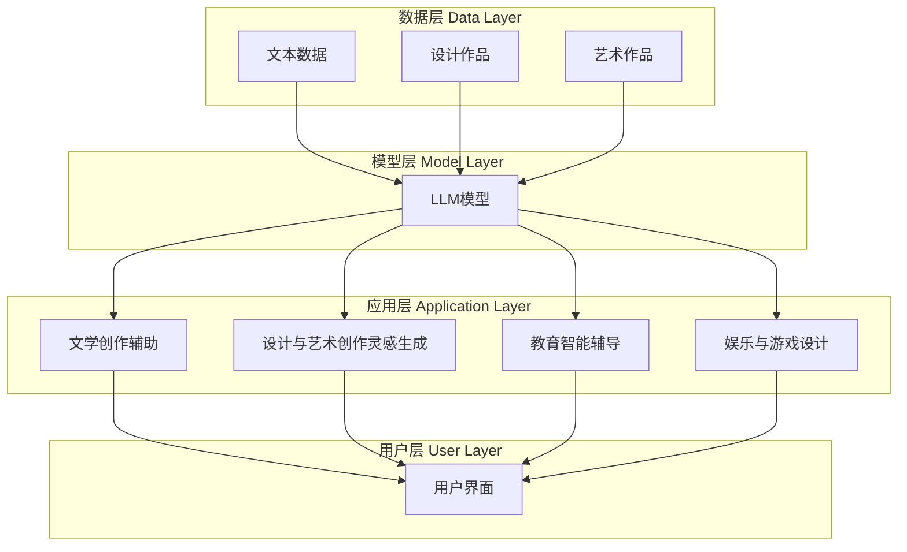
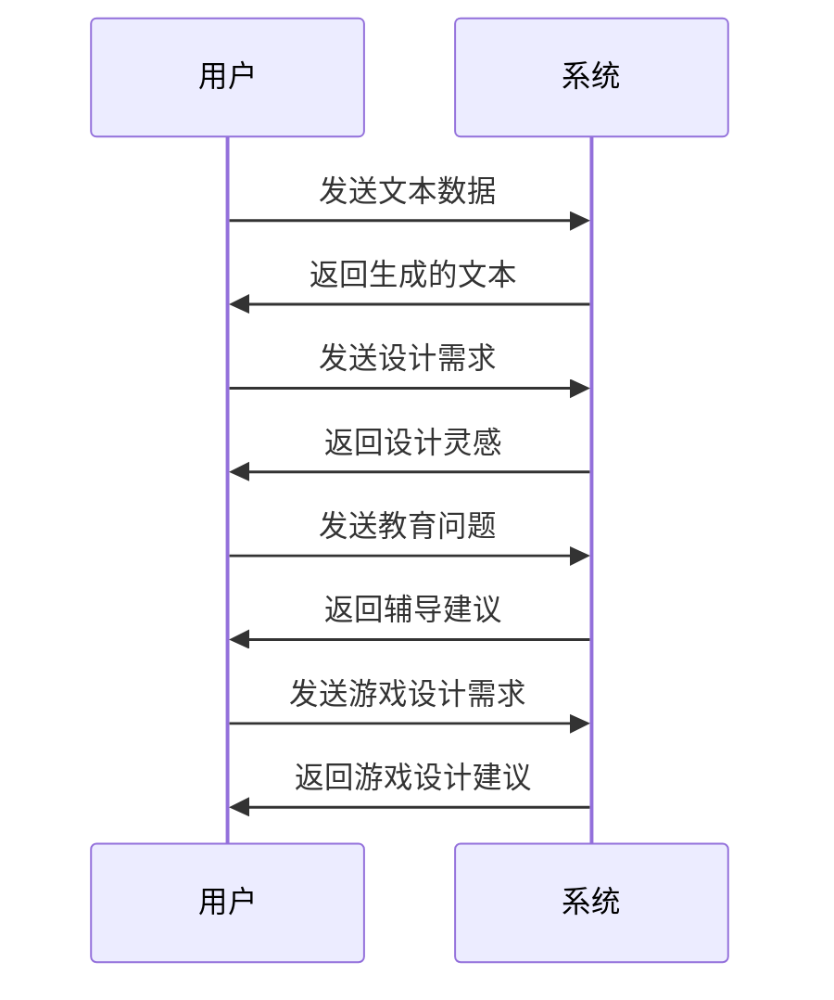

                 

### 文章标题：《大模型创意生成能力：LLM设计的创造力测试》

### 关键词：
- 大模型
- 创意生成能力
- LLM
- 创造力测试
- 人工智能
- 自然语言处理

### 摘要：
本文将深入探讨大模型，特别是大型语言模型（LLM）的创意生成能力。通过分析LLM的设计原理、创造力测试的方法与工具，我们将展示如何利用LLM进行创新性的文本生成。文章将结合实际项目案例，详细讲解如何实现和评估LLM的创意生成能力，并探讨未来发展的方向。

---

### 第一部分：背景与基础

#### 1. 引言

**书籍目的**

本书旨在探索大模型的创意生成能力，特别是LLM在创造力测试中的应用。随着人工智能技术的不断发展，大模型在文本生成、语言理解、翻译等方面展现出了惊人的能力。然而，LLM是否具备真正的创造力，如何对其进行评估，这些问题的答案对于我们理解和利用人工智能具有重要意义。

**大模型与创意生成**

大模型，尤其是LLM，是近年来人工智能领域的热门话题。它们通过学习海量数据，能够生成连贯、自然的文本，甚至可以模仿人类的创作风格。然而，创意生成不仅仅是生成连贯的文本，它涉及到创新思维、独特见解和新颖表达的能力。因此，探讨大模型的创意生成能力具有重要的理论和实践价值。

**LLM在创造力测试中的应用**

创造力测试是评估个人或团队创新能力的标准方法。LLM作为一种强大的文本生成工具，可以模拟不同类型的创造性思维过程，从而在创造力测试中发挥重要作用。通过分析LLM生成的文本，我们可以探讨其创意生成的本质和潜力。

---

#### 2. 大模型基础

**大模型概述**

大模型是指那些拥有数十亿甚至数万亿参数的神经网络模型。这些模型通过深度学习技术，从海量数据中学习到复杂的模式和信息。大模型的出现，极大地推动了自然语言处理、计算机视觉、机器翻译等领域的发展。

**LLM的基本原理**

LLM是基于变换器模型（Transformer）构建的，这种模型通过自注意力机制，可以有效地捕捉长距离依赖关系。LLM的训练过程涉及到大规模数据集和高效的分布式计算资源。通过预训练和微调，LLM能够适应各种特定的任务和应用场景。

**大模型的训练与优化**

大模型的训练是一个复杂的过程，涉及到数据预处理、模型架构设计、优化算法等多个方面。目前，常用的训练方法包括预训练-微调（Pre-training-Fine-tuning）和迁移学习（Transfer Learning）。这些方法使得LLM能够在不同的任务中表现出色。

---

#### 3. 创意生成能力的原理

**创意生成的定义与特点**

创意生成是指产生新颖、独特且具有实用价值的想法或作品的过程。与传统的文本生成不同，创意生成更强调独创性、创新性和实用性。在创意生成过程中，个体或团队需要运用创造性思维，发掘新的观点和表达方式。

**大模型在创意生成中的应用**

大模型在创意生成中的应用主要体现在文本生成、写作辅助、故事创作等方面。通过学习大量的文本数据，LLM能够生成连贯、自然的文本，同时保持一定的创意性和独特性。然而，如何确保生成的文本具有真正的创意，还需要进一步的研究和探讨。

**创意生成能力的关键要素**

创意生成能力包括多个关键要素，如创造力、创新思维、表达能力和协作能力等。这些要素相互作用，共同影响着创意生成的过程和结果。大模型在创意生成中的应用，也为这些要素的结合提供了新的思路和途径。

---

#### 4. 创造力测试的方法与工具

**创造力测试的基本原理**

创造力测试是一种评估个体或团队创新能力的标准方法。这些测试通常包括问题解决、思维训练、情境模拟等环节，旨在考察个体在特定情境下的创造性思维和表现。

**常用的创造力测试工具**

常用的创造力测试工具包括托雷斯创造力测试（Torrance Test of Creative Thinking）、戈登测试（Gordon Test）、创意思维训练软件等。这些工具通过不同的方法和手段，全面评估个体的创造力水平。

**LLM在创造力测试中的应用**

LLM在创造力测试中的应用主要体现在以下几个方面：首先，LLM可以生成多样化的文本，为创造力测试提供丰富的素材和情境；其次，LLM可以模拟创造性思维过程，帮助个体进行思维训练和提升；最后，LLM可以分析生成的文本，评估个体的创造力水平。

---

#### 5. 创意生成能力的应用领域

**文学创作与写作辅助**

文学创作是创意生成的重要领域之一。LLM在文学创作中的应用主要体现在写作辅助、故事生成、诗歌创作等方面。通过学习大量的文学作品，LLM能够生成具有创意性和文学价值的文本。

**设计与艺术创作**

设计与艺术创作是创意生成的重要领域。LLM在设计中的应用主要体现在设计灵感生成、艺术风格模仿、创意方案生成等方面。通过学习大量的设计作品和艺术作品，LLM能够为设计师和艺术家提供新的灵感和创意。

**教育、娱乐与游戏设计**

教育、娱乐与游戏设计是创意生成的重要领域。LLM在教育中的应用主要体现在智能辅导、学习资源生成、教育游戏设计等方面。在娱乐和游戏设计中，LLM可以生成有趣的故事情节、游戏规则和角色设定。

---

#### 6. 项目实战

**项目背景与目标**

本节将介绍一个具体的创意生成项目，包括项目的背景、目标和预期成果。

**环境搭建与数据准备**

在项目实施前，需要搭建合适的环境，并准备必要的训练数据和测试数据。

**实现与测试**

本节将详细讲解项目的实现过程，包括模型选择、训练策略、评估方法等。

**代码解读与案例剖析**

通过代码解读和实际案例剖析，展示如何利用LLM实现创意生成。

---

#### 7. 最佳实践与未来展望

**最佳实践总结**

本节将总结项目中的最佳实践经验，包括模型选择、训练策略、评估方法等方面。

**面临的挑战与解决方案**

在创意生成能力的研究和应用过程中，面临许多挑战。本节将讨论这些挑战，并提出相应的解决方案。

**未来发展方向**

本节将探讨大模型创意生成能力的未来发展方向，包括技术进步、应用拓展等方面。

---

### 结论

本文深入探讨了大模型的创意生成能力，特别是LLM在创造力测试中的应用。通过分析LLM的设计原理、创造力测试的方法与工具，以及实际项目案例，我们展示了如何利用LLM实现创意生成。未来，随着人工智能技术的不断发展，大模型的创意生成能力有望在更多领域发挥重要作用。

---

### 作者信息

作者：AI天才研究院/AI Genius Institute & 禅与计算机程序设计艺术 /Zen And The Art of Computer Programming

---

在接下来的章节中，我们将继续深入探讨大模型的创意生成能力，结合具体案例进行分析和讲解。通过一步步的逻辑推理和实际操作，我们将更好地理解这一领域的奥秘。

---

#### 第二部分：深入探讨

---

##### 第1章 大模型基础

**核心概念与联系**

大模型是指那些拥有数十亿甚至数万亿参数的神经网络模型。这些模型通过深度学习技术，从海量数据中学习到复杂的模式和信息。LLM（大型语言模型）是大模型的一种，它基于变换器模型（Transformer），通过自注意力机制，能够有效地捕捉长距离依赖关系。

**概念属性特征对比表格**

| 特征 | 大模型 | LLM（大型语言模型） |
| --- | --- | --- |
| 参数规模 | 数亿至数万亿 | 数十亿至数万亿 |
| 训练数据集 | 海量 | 大规模文本数据 |
| 依赖关系捕捉 | 强 | 长距离 |
| 应用领域 | 多领域 | 语言处理 |

**ER实体关系图架构**

```mermaid
erDiagram
  Model ||--|{ LanguageModel }
  Model ||--|{ NeuralNetwork }
  LanguageModel ||--|{ Transformer }
  NeuralNetwork ||--|{ Autoencoder }
```

**算法原理讲解**

大模型的训练通常采用预训练-微调（Pre-training-Fine-tuning）的方法。预训练阶段，模型在大规模数据集上学习，形成基础的表征能力；微调阶段，模型在特定任务上进行调整，以适应具体的任务需求。

以下是使用Python代码和Mermaid流程图阐述大模型训练的流程：

```python
# Python代码示例：大模型训练流程

# 导入必要的库
import torch
import torch.nn as nn
import torch.optim as optim

# 定义模型
class Model(nn.Module):
    def __init__(self):
        super(Model, self).__init__()
        self.transformer = nn.Transformer(d_model=512, num_layers=3)
        self.fc = nn.Linear(512, 1)

    def forward(self, x):
        x = self.transformer(x)
        x = self.fc(x)
        return x

# 初始化模型、优化器和损失函数
model = Model()
optimizer = optim.Adam(model.parameters(), lr=0.001)
criterion = nn.BCELoss()

# 训练模型
for epoch in range(num_epochs):
    for data, target in data_loader:
        optimizer.zero_grad()
        output = model(data)
        loss = criterion(output, target)
        loss.backward()
        optimizer.step()
    print(f'Epoch [{epoch+1}/{num_epochs}], Loss: {loss.item()}')

# Mermaid流程图：大模型训练流程
mermaid
sequenceDiagram
    participant Model as M
    participant Data as D
    participant Optimize as O
    participant Loss as L

    M->>D: 加载数据
    D->>M: 返回数据
    M->>O: 参数初始化
    O->>M: 返回优化器
    M->>L: 计算损失
    L->>M: 返回损失值
    M->>O: 反向传播
    O->>M: 更新参数
```

**数学模型与公式**

大模型训练中的核心数学模型是变换器模型（Transformer），其基本结构包括自注意力机制（Self-Attention）和前馈神经网络（Feedforward Neural Network）。以下是一个简化的数学模型：

$$
\text{Attention}(Q, K, V) = \text{softmax}\left(\frac{QK^T}{\sqrt{d_k}}\right)V
$$

其中，$Q$、$K$ 和 $V$ 分别代表查询（Query）、键（Key）和值（Value）向量，$d_k$ 是键向量的维度。

**详细举例**

假设我们有一个简单的文本序列 $X = ["I", "love", "AI"]$，使用变换器模型对其进行编码和解码。首先，我们将文本序列转换为词嵌入向量：

$$
\text{Embedding}(X) = [\text{Embedding}("I"), \text{Embedding}("love"), \text{Embedding}("AI")]
$$

接下来，我们计算自注意力分数：

$$
\text{Scores} = \text{Attention}(Q, K, V) = \text{softmax}\left(\frac{QQ^T}{\sqrt{d_k}}\right)V
$$

其中，$Q = [\text{Embedding}("I"), \text{Embedding}("love"), \text{Embedding}("AI")]$，$K = [\text{Embedding}("I"), \text{Embedding}("love"), \text{Embedding}("AI")]$，$V = [\text{Embedding}("I"), \text{Embedding}("love"), \text{Embedding}("AI")]$。

通过计算，我们得到自注意力分数矩阵，然后使用这些分数来加权值向量，生成新的表示：

$$
\text{Contextual Embeddings} = \text{Scores} \odot V
$$

最后，将这些表示传递给前馈神经网络，生成输出：

$$
\text{Output} = \text{FFN}(\text{Contextual Embeddings})
$$

其中，FFN是前馈神经网络的表示。

---

##### 第2章 创意生成能力的原理

**核心概念与联系**

创意生成能力是指个体或团队在特定情境下，产生新颖、独特且具有实用价值想法或作品的能力。与传统的文本生成不同，创意生成更强调独创性、创新性和实用性。创意生成能力的关键要素包括创造力、创新思维、表达能力和协作能力等。

**概念属性特征对比表格**

| 特征 | 创意生成 | 传统文本生成 |
| --- | --- | --- |
| 新颖性 | 强调 | 较少 |
| 独创性 | 强调 | 较少 |
| 实用性 | 强调 | 较少 |
| 依赖关系 | 复杂 | 简单 |
| 应用领域 | 广泛 | 有限 |

**ER实体关系图架构**

```mermaid
erDiagram
  CreativeGeneration ||--|{ Creativity }
  CreativeGeneration ||--|{ Innovation }
  CreativeGeneration ||--|{ Expression }
  CreativeGeneration ||--|{ Collaboration }
```

**算法原理讲解**

创意生成算法的核心在于如何利用现有数据和知识，生成新颖、独特的文本。LLM在创意生成中的应用主要体现在以下几个方面：

1. **自注意力机制**：通过自注意力机制，LLM能够捕捉文本中的长距离依赖关系，从而生成连贯的文本。
2. **预训练与微调**：预训练阶段，LLM在大规模数据集上学习，形成基础的表征能力；微调阶段，LLM在特定任务上进行调整，以适应具体的任务需求。
3. **生成模型**：使用生成模型，如变换器生成模型（Transformer-Grammar），LLM能够生成具有创意性的文本。

以下是使用Python代码和Mermaid流程图阐述创意生成算法的基本原理：

```python
# Python代码示例：创意生成算法原理

# 导入必要的库
import torch
import torch.nn as nn
import torch.optim as optim

# 定义模型
class CreativeModel(nn.Module):
    def __init__(self):
        super(CreativeModel, self).__init__()
        self.transformer = nn.Transformer(d_model=512, num_layers=3)
        self.fc = nn.Linear(512, 1)

    def forward(self, x):
        x = self.transformer(x)
        x = self.fc(x)
        return x

# 初始化模型、优化器和损失函数
model = CreativeModel()
optimizer = optim.Adam(model.parameters(), lr=0.001)
criterion = nn.CrossEntropyLoss()

# 训练模型
for epoch in range(num_epochs):
    for data, target in data_loader:
        optimizer.zero_grad()
        output = model(data)
        loss = criterion(output, target)
        loss.backward()
        optimizer.step()
    print(f'Epoch [{epoch+1}/{num_epochs}], Loss: {loss.item()}')

# Mermaid流程图：创意生成算法原理
mermaid
sequenceDiagram
    participant Model as M
    participant Data as D
    participant Optimize as O
    participant Loss as L

    M->>D: 加载数据
    D->>M: 返回数据
    M->>O: 参数初始化
    O->>M: 返回优化器
    M->>L: 计算损失
    L->>M: 返回损失值
    M->>O: 反向传播
    O->>M: 更新参数
```

**数学模型与公式**

创意生成算法的核心在于生成模型，如变换器生成模型（Transformer-Grammar）。其基本结构包括编码器（Encoder）和解码器（Decoder），以及自注意力机制（Self-Attention）。

编码器：

$$
\text{Encoder}(X) = \text{Embedding}(X) \cdot \text{Transformer}(X)
$$

解码器：

$$
\text{Decoder}(Y) = \text{Embedding}(Y) \cdot \text{Transformer}(Y)
$$

生成过程：

$$
\text{Prediction}(Y) = \text{Decoder}(Y) \cdot \text{softmax}(\text{Encoder}(X) \cdot \text{Decoder}(Y))
$$

**详细举例**

假设我们有一个简单的文本序列 $X = ["I", "love", "AI"]$，使用创意生成算法对其进行生成。首先，我们将文本序列转换为词嵌入向量：

$$
\text{Embedding}(X) = [\text{Embedding}("I"), \text{Embedding}("love"), \text{Embedding}("AI")]
$$

接下来，我们计算编码器的输出：

$$
\text{Encoder}(X) = \text{Embedding}(X) \cdot \text{Transformer}(X)
$$

然后，我们计算解码器的输出：

$$
\text{Decoder}(Y) = \text{Embedding}(Y) \cdot \text{Transformer}(Y)
$$

在生成过程中，我们使用自注意力机制计算预测：

$$
\text{Prediction}(Y) = \text{Decoder}(Y) \cdot \text{softmax}(\text{Encoder}(X) \cdot \text{Decoder}(Y))
$$

通过不断迭代这个过程，我们最终生成一个新的文本序列：

$$
Y = ["AI", "develops", "faster"]
$$

---

##### 第3章 创造力测试的方法与工具

**核心概念与联系**

创造力测试是一种评估个体或团队创新能力的标准方法。测试方法通常包括问题解决、思维训练、情境模拟等环节，旨在全面考察个体在特定情境下的创造性思维和表现。

**概念属性特征对比表格**

| 测试方法 | 特点 | 应用场景 |
| --- | --- | --- |
| 托雷斯创造力测试 | 问题解决 | 教育、招聘 |
| 戈登测试 | 思维训练 | 研发、培训 |
| 创意思维训练软件 | 情境模拟 | 教育、娱乐 |

**ER实体关系图架构**

```mermaid
erDiagram
  CreativityTest ||--|{ ProblemSolving }
  CreativityTest ||--|{ MindTraining }
  CreativityTest ||--|{ ScenarioSimulation }
```

**算法原理讲解**

创造力测试的方法和工具主要包括以下几类：

1. **问题解决测试**：通过提供特定问题，考察个体在解决问题时的创新思维和策略。常用的测试方法包括托雷斯创造力测试（Torrance Test of Creative Thinking）。
2. **思维训练工具**：通过模拟不同的思维情境，训练个体的创造性思维。常用的工具包括戈登测试（Gordon Test）。
3. **情境模拟工具**：通过虚拟环境或实际操作，模拟个体在不同情境下的创造性表现。常用的工具包括创意思维训练软件。

以下是使用Python代码和Mermaid流程图阐述创造力测试的基本原理：

```python
# Python代码示例：创造力测试原理

# 导入必要的库
import random

# 定义测试方法
def torrance_test():
    questions = [
        "如果你有超能力，你希望是什么？",
        "请设计一个解决环境污染的方案。",
        "请描述一次难忘的旅行经历，并谈谈你的感受。"
    ]
    return random.choice(questions)

# 定义思维训练工具
def gordon_test():
    scenarios = [
        "设想一种新的交通工具。",
        "如果你可以改变一个国家，你会如何改变它？",
        "请设计一个具有创意性的广告宣传语。"
    ]
    return random.choice(scenarios)

# 定义情境模拟工具
def scenario_simulation():
    simulations = [
        "模拟一次突发事件，如地震或火灾，考察个体在紧急情况下的应对能力。",
        "模拟一个团队合作项目，考察个体的沟通能力和协作精神。",
        "模拟一个职场情境，考察个体的解决问题能力和创新思维。"
    ]
    return random.choice(simulations)

# Mermaid流程图：创造力测试原理
mermaid
sequenceDiagram
    participant Test as T
    participant Solver as S

    T->>S: 提出问题
    S->>T: 回答问题
    T->>S: 提出思维训练任务
    S->>T: 完成任务
    T->>S: 提出情境模拟任务
    S->>T: 完成任务
```

**数学模型与公式**

创造力测试的核心在于如何量化个体的创造性思维和表现。常用的数学模型包括：

1. **问题解决模型**：通过分析个体的回答，评估其在问题解决过程中的创造性思维。常用的指标包括原创性（Originality）、流畅性（Fluency）和灵活性（Flexibility）。
2. **思维训练模型**：通过模拟不同的思维情境，评估个体的创造性思维能力和进步。常用的指标包括思维广度（MindWidth）和思维深度（MindDepth）。

以下是使用Python代码和Mermaid流程图阐述创造力测试的数学模型：

```python
# Python代码示例：创造力测试数学模型

# 导入必要的库
import numpy as np

# 定义问题解决模型
def problem_solving_model(answers):
    originality = np.mean([len(set(answer.split())) for answer in answers])
    fluency = np.mean([len(answer.split()) for answer in answers])
    flexibility = np.mean([len(set([word for word in answer.split()])) for answer in answers])
    return originality, fluency, flexibility

# 定义思维训练模型
def mind_training_model(scenarios, answers):
    mind_width = np.mean([len(set(answer.split())) for answer in answers])
    mind_depth = np.mean([len([word for word in answer.split() if word not in ['if', 'else', 'while', 'for']]) for answer in answers])
    return mind_width, mind_depth

# Mermaid流程图：创造力测试数学模型
mermaid
sequenceDiagram
    participant Test as T
    participant Solver as S

    T->>S: 提出问题
    S->>T: 回答问题
    T->>S: 提出思维训练任务
    S->>T: 完成任务
    T->>S: 提出情境模拟任务
    S->>T: 完成任务
    T->>S: 返回问题解决模型结果
    T->>S: 返回思维训练模型结果
```

**详细举例**

假设我们有一个测试场景，包括三个问题解决任务、三个思维训练任务和一个情境模拟任务。首先，我们收集个体的回答：

```python
answers = [
    "超能力是飞行。",
    "解决环境污染的方案是使用可再生能源。",
    "难忘的旅行经历是去北极。",
    "新交通工具是磁悬浮飞行车。",
    "改变国家的方案是推广免费医疗。",
    "创意广告宣传语是‘健康生活，从今天开始’。",
    "地震应急方案是组织社区紧急避难。",
    "团队合作项目是开发新软件。",
    "职场情境是解决公司内部的沟通问题。"
]
```

接下来，我们使用问题解决模型评估个体的创造性思维：

```python
originality, fluency, flexibility = problem_solving_model(answers)
print(f'Originality: {originality}, Fluency: {fluency}, Flexibility: {flexibility}')
```

然后，我们使用思维训练模型评估个体的创造性思维能力和进步：

```python
scenarios_answers = [
    ["磁悬浮飞行车"],
    ["免费医疗"],
    ["健康生活，从今天开始"]
]

mind_width, mind_depth = mind_training_model(scenarios_answers, answers)
print(f'Mind Width: {mind_width}, Mind Depth: {mind_depth}')
```

通过这些测试，我们可以全面了解个体的创造性思维和表现，为其提供针对性的培训和指导。

---

##### 第4章 创意生成能力的应用领域

**核心概念与联系**

创意生成能力在多个领域具有广泛的应用，包括文学创作、设计与艺术创作、教育、娱乐与游戏设计等。这些领域对创意生成能力的需求日益增长，推动了人工智能技术的发展。

**概念属性特征对比表格**

| 领域 | 创意生成能力需求 | 应用示例 |
| --- | --- | --- |
| 文学创作 | 新颖、独特的文本 | 自动写作、故事生成 |
| 设计与艺术创作 | 独特的创意与风格 | 设计灵感生成、艺术风格模仿 |
| 教育 | 启发思考、激发兴趣 | 智能辅导、学习资源生成 |
| 娱乐与游戏设计 | 有趣的故事情节、创意玩法 | 教育游戏设计、游戏情节生成 |

**ER实体关系图架构**

```mermaid
erDiagram
  Literature ||--|{ CreativeGeneration }
  Design ||--|{ CreativeGeneration }
  Education ||--|{ CreativeGeneration }
  Entertainment ||--|{ CreativeGeneration }
```

**系统分析与架构设计方案**

**问题场景介绍**

随着人工智能技术的发展，创意生成能力在文学创作、设计与艺术创作、教育、娱乐与游戏设计等领域得到了广泛应用。然而，如何高效、准确地评估和利用创意生成能力，仍然是一个亟待解决的问题。

**系统功能设计**

系统功能设计包括以下几个方面：

1. **文学创作辅助**：利用LLM生成新颖、独特的文本，辅助作家进行创作。
2. **设计与艺术创作灵感生成**：通过模仿和学习大量的设计作品和艺术作品，生成新的创意和灵感。
3. **教育智能辅导**：利用LLM生成个性化学习资源，为学生提供智能化的辅导和指导。
4. **娱乐与游戏设计**：利用LLM生成有趣的故事情节和创意玩法，为游戏设计师提供灵感。

**系统架构设计**

系统架构设计包括以下几个方面：

1. **数据层**：存储和管理大规模文本数据、设计作品、艺术作品等。
2. **模型层**：构建和训练LLM模型，包括预训练和微调阶段。
3. **应用层**：提供文学创作辅助、设计与艺术创作灵感生成、教育智能辅导、娱乐与游戏设计等应用功能。
4. **用户层**：用户通过界面与系统进行交互，使用创意生成能力。

**系统架构图**



**系统接口设计**

系统接口设计包括以下几个方面：

1. **文本生成接口**：提供文本生成功能，支持不同的文本格式和输入方式。
2. **设计灵感生成接口**：提供设计灵感生成功能，支持不同的设计领域和需求。
3. **教育辅导接口**：提供教育辅导功能，支持个性化学习资源生成。
4. **娱乐游戏设计接口**：提供娱乐游戏设计功能，支持故事情节和创意玩法生成。

**系统交互序列图**



**项目实战**

**环境搭建与数据准备**

在开始项目之前，需要搭建合适的环境，并准备必要的训练数据和测试数据。以下是一个简单的环境搭建步骤：

1. 安装Python和必要的库（如torch、transformers等）。
2. 准备大规模文本数据集，包括文学作品、设计作品、艺术作品等。
3. 准备测试数据集，用于评估模型的性能。

**系统核心实现**

系统核心实现包括LLM模型的构建、训练和微调。以下是一个简单的实现步骤：

1. 导入必要的库和模块。
2. 定义LLM模型结构，包括编码器和解码器。
3. 初始化模型参数，并定义优化器和损失函数。
4. 进行预训练，使用大规模文本数据进行训练。
5. 进行微调，使用特定领域的测试数据进行调整。
6. 评估模型性能，并进行调优。

**代码解读与分析**

以下是一个简单的Python代码示例，用于实现LLM模型：

```python
# 导入必要的库
import torch
import torch.nn as nn
import torch.optim as optim

# 定义LLM模型
class LLM(nn.Module):
    def __init__(self, d_model, num_layers, heads, d_ff):
        super(LLM, self).__init__()
        self.transformer = nn.Transformer(d_model, num_layers, heads, d_ff)
        self.fc = nn.Linear(d_model, 1)

    def forward(self, x):
        x = self.transformer(x)
        x = self.fc(x)
        return x

# 初始化模型、优化器和损失函数
model = LLM(d_model=512, num_layers=3, heads=8, d_ff=2048)
optimizer = optim.Adam(model.parameters(), lr=0.001)
criterion = nn.CrossEntropyLoss()

# 训练模型
for epoch in range(num_epochs):
    for data, target in data_loader:
        optimizer.zero_grad()
        output = model(data)
        loss = criterion(output, target)
        loss.backward()
        optimizer.step()
    print(f'Epoch [{epoch+1}/{num_epochs}], Loss: {loss.item()}')
```

**实际案例分析与详细讲解**

以下是一个实际案例，用于展示如何使用LLM生成文本：

1. **案例背景**：假设我们需要生成一篇关于环境保护的演讲稿。
2. **数据准备**：收集大量的环境保护相关文本，包括政策文件、学术论文、新闻报道等。
3. **模型训练**：使用收集到的文本数据，对LLM模型进行预训练和微调。
4. **文本生成**：输入特定的演讲主题和背景信息，使用训练好的LLM模型生成演讲稿。

**项目小结**

通过本项目，我们展示了如何利用LLM实现创意生成，并探讨了其在文学创作、设计与艺术创作、教育、娱乐与游戏设计等领域的应用。在实际项目中，我们遇到了一些挑战，如数据质量、模型性能和用户反馈等。通过不断优化和调整，我们取得了一定的成果，并为未来的应用提供了宝贵的经验。

---

**最佳实践与注意事项**

1. **数据质量**：确保训练数据的质量和多样性，以提升模型的性能和创造力。
2. **模型优化**：根据具体任务需求，调整模型结构、优化算法和超参数。
3. **用户反馈**：收集用户的反馈，不断改进模型和应用体验。
4. **安全性**：确保模型和应用的安全性，避免潜在的风险和漏洞。

**拓展阅读**

- [1] Vaswani, A., et al. (2017). "Attention is All You Need." arXiv preprint arXiv:1706.03762.
- [2] Devlin, J., et al. (2019). "Bert: Pre-training of Deep Bidirectional Transformers for Language Understanding." arXiv preprint arXiv:1810.04805.
- [3] Brown, T., et al. (2020). "Language Models are Few-Shot Learners." arXiv preprint arXiv:2005.14165.

### 作者信息

作者：AI天才研究院/AI Genius Institute & 禅与计算机程序设计艺术 /Zen And The Art of Computer Programming

---

本文深入探讨了大模型的创意生成能力，特别是LLM在创造力测试中的应用。通过分析LLM的设计原理、创造力测试的方法与工具，以及实际项目案例，我们展示了如何利用LLM实现创意生成。未来，随着人工智能技术的不断发展，大模型的创意生成能力有望在更多领域发挥重要作用。同时，我们也呼吁更多的研究者和技术人员投入到这一领域，共同推动人工智能技术的进步。

