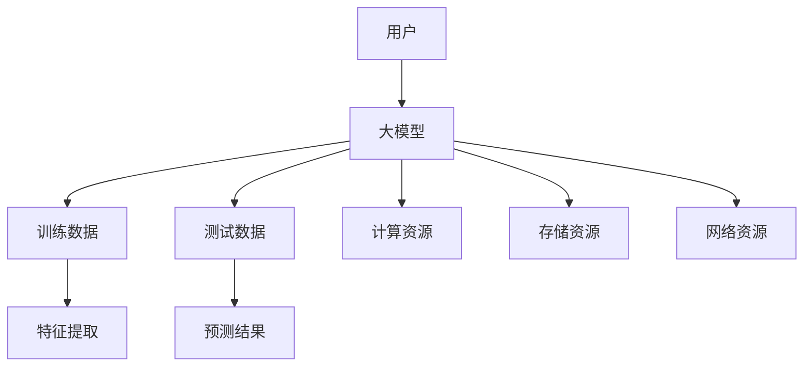
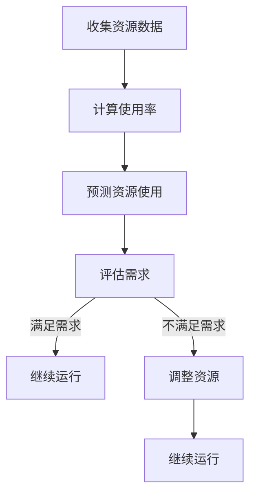
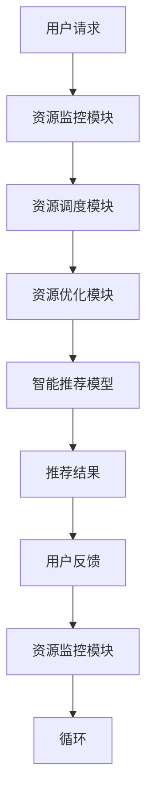
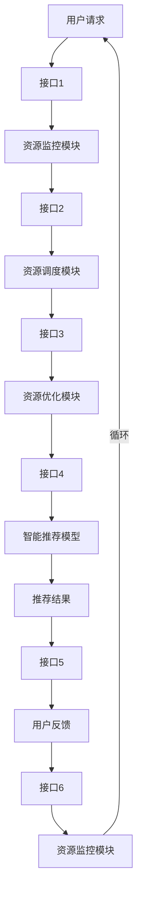

                 


### 文章标题：大模型应用中的需求与资源分配策略

#### 关键词：大模型，需求分析，资源分配，策略，性能优化

#### 摘要：
本文将从大模型应用的背景出发，详细探讨大模型的基本概念、资源需求、应用场景、资源分配策略以及资源管理。通过深入分析大模型在不同领域的应用需求，结合实际案例，本文旨在为开发者提供一套高效、可行的资源分配策略，以应对大模型应用中的挑战，提升系统性能和用户体验。

----------------------------------------------------------------

### 第一部分：大模型应用背景

#### 第1章：大模型应用背景概述

##### 1.1.1 大模型应用的历史背景
大模型应用起源于深度学习领域的突破，随着人工智能技术的不断发展，大模型在图像识别、自然语言处理、语音识别等领域展现出了强大的能力。从最早的简单神经网络到如今的大型预训练模型，大模型应用的发展经历了数个关键阶段。

##### 1.1.2 大模型应用的现状与挑战
当前，大模型应用已经在各个领域取得了显著的成果，但同时也面临着计算资源、存储资源、网络资源等多方面的挑战。如何高效地分配和利用这些资源，成为大模型应用中的关键问题。

##### 1.1.3 大模型应用的重要性
大模型应用不仅推动了人工智能技术的发展，也为各行各业带来了深远的影响。通过优化资源分配策略，可以进一步提升大模型的应用效果，为用户提供更优质的服务。

----------------------------------------------------------------

### 第二部分：大模型的基本概念

#### 第2章：大模型的基本概念

##### 2.1.1 大模型的定义
大模型通常指的是具有数百万甚至数十亿参数的神经网络模型。这些模型通过大规模的数据训练，能够实现高效的特征提取和分类任务。

##### 2.1.2 大模型的技术特点
大模型具有以下技术特点：高参数数量、深度网络结构、端到端训练、强大的特征提取能力等。

##### 2.1.3 大模型与传统模型的区别
与传统模型相比，大模型在数据需求、计算资源、训练时间等方面有显著的区别。大模型需要更多的数据来训练，同时也需要更多的计算资源来支持其训练和推理。

----------------------------------------------------------------

### 第三部分：大模型的资源需求分析

#### 第3章：大模型的资源需求分析

##### 3.1.1 大模型对计算资源的需求
大模型的训练和推理过程对计算资源有很高的需求。计算资源的不足可能导致训练时间过长、模型效果不佳等问题。

##### 3.1.2 大模型对存储资源的需求
大模型的参数数量庞大，对存储资源的需求也很高。存储资源的不足可能导致模型存储困难、训练数据加载缓慢等问题。

##### 3.1.3 大模型对网络资源的需求
大模型的训练和推理过程需要大量的数据传输，对网络资源的需求也很大。网络资源的不足可能导致数据传输缓慢、训练和推理效率低下等问题。

----------------------------------------------------------------

### 第四部分：大模型的需求分析

#### 第4章：大模型的需求分析

##### 4.1.1 大模型在不同领域的需求
大模型在图像识别、自然语言处理、语音识别等领域的应用需求各有不同。不同领域的需求决定了大模型的设计和资源分配策略。

##### 4.1.2 大模型在商业场景中的应用
大模型在商业场景中有着广泛的应用，如智能客服、智能推荐、智能风控等。这些应用对大模型的需求有较高的性能和可靠性要求。

##### 4.1.3 大模型在公共服务中的应用
大模型在公共服务中的应用也越来越广泛，如智能交通、智能医疗、智能城市等。这些应用对大模型的需求不仅关注性能，更关注数据隐私和安全性。

----------------------------------------------------------------

### 第五部分：大模型的资源分配策略

#### 第5章：大模型的资源分配策略

##### 5.1.1 资源分配的原则
资源分配应遵循以下原则：优先满足关键任务、合理分配资源、动态调整资源等。

##### 5.1.2 资源分配的方法
资源分配方法包括静态分配、动态分配、优先级分配等。不同的方法适用于不同的应用场景。

##### 5.1.3 资源分配的案例分析
通过具体案例分析，探讨大模型资源分配策略在实际应用中的效果和挑战。

----------------------------------------------------------------

### 第六部分：大模型应用中的资源管理

#### 第6章：大模型应用中的资源管理

##### 6.1.1 资源监控与管理
资源监控与管理是确保大模型应用稳定运行的基础。通过实时监控资源使用情况，可以及时发现和解决资源不足等问题。

##### 6.1.2 资源调度与优化
资源调度与优化是提高大模型应用性能的关键。通过合理调度和优化资源，可以最大限度地提升系统性能。

##### 6.1.3 资源管理工具介绍
介绍常用的资源管理工具，如Docker、Kubernetes等，以及如何使用这些工具优化大模型应用。

----------------------------------------------------------------

### 第七部分：大模型应用中的挑战与展望

#### 第7章：大模型应用中的挑战与展望

##### 7.1.1 大模型应用中的挑战
大模型应用面临着计算资源、存储资源、网络资源等多方面的挑战。如何应对这些挑战，成为大模型应用的关键问题。

##### 7.1.2 大模型应用的发展趋势
大模型应用的发展趋势包括模型压缩、模型蒸馏、联邦学习等。这些趋势将为大模型应用带来新的机遇和挑战。

##### 7.1.3 大模型应用的未来展望
随着人工智能技术的不断发展，大模型应用将在更多领域发挥重要作用。未来，大模型应用将更加智能化、高效化，为人类带来更多便利。

----------------------------------------------------------------

### 结语

本文从大模型应用的需求与资源分配策略出发，详细探讨了大模型的基本概念、资源需求、应用场景、资源分配策略以及资源管理。通过深入分析，本文为开发者提供了一套高效、可行的资源分配策略，以应对大模型应用中的挑战，提升系统性能和用户体验。在未来的发展中，大模型应用将继续发挥着重要作用，为人类社会带来更多创新和变革。

### 作者信息

作者：AI天才研究院/AI Genius Institute & 禅与计算机程序设计艺术 /Zen And The Art of Computer Programming

----------------------------------------------------------------

### 背景介绍

#### 大模型应用背景

随着人工智能技术的不断发展，大模型应用在图像识别、自然语言处理、语音识别等领域取得了显著的成果。大模型通过深度学习的方式，能够从大规模数据中自动提取特征，实现高精度的分类和预测。然而，大模型应用也面临着诸多挑战，如计算资源需求大、训练时间长、存储需求高等。因此，如何高效地分配和利用资源，成为大模型应用中的关键问题。

#### 大模型的基本概念

大模型通常指的是具有数百万甚至数十亿参数的神经网络模型。这些模型通过大规模的数据训练，能够实现高效的特征提取和分类任务。大模型的技术特点包括高参数数量、深度网络结构、端到端训练和强大的特征提取能力等。与传统模型相比，大模型在数据需求、计算资源、训练时间等方面有显著的区别。

#### 大模型的需求分析

大模型在不同领域的应用需求各有不同。在图像识别领域，大模型需要处理大量的图像数据，以实现高精度的图像分类和检测。在自然语言处理领域，大模型需要处理海量的文本数据，以实现文本生成、翻译、情感分析等任务。在语音识别领域，大模型需要处理大量的语音数据，以实现高精度的语音识别和语音合成。

#### 大模型的资源需求分析

大模型对计算资源的需求非常高。训练一个大型神经网络模型需要大量的计算资源，包括CPU、GPU、TPU等。计算资源的不足可能导致训练时间过长、模型效果不佳等问题。大模型对存储资源的需求也很高，因为大型神经网络模型的参数数量庞大，需要大量的存储空间。存储资源的不足可能导致模型存储困难、训练数据加载缓慢等问题。此外，大模型对网络资源的需求也很大，因为训练和推理过程需要大量的数据传输。网络资源的不足可能导致数据传输缓慢、训练和推理效率低下等问题。

#### 大模型的资源分配策略

资源分配策略是确保大模型高效运行的关键。资源分配策略需要考虑以下几个方面：

1. **优先满足关键任务**：在资源分配过程中，应优先满足关键任务的资源需求，如训练任务、推理任务等。

2. **合理分配资源**：根据不同任务的资源需求，合理分配计算资源、存储资源、网络资源等。

3. **动态调整资源**：在运行过程中，根据实际资源使用情况，动态调整资源的分配，以优化系统性能。

#### 大模型的应用场景

大模型在商业场景和公共服务中的应用越来越广泛。在商业场景中，大模型可以用于智能客服、智能推荐、智能风控等领域，为用户提供更智能化的服务。在公共服务中，大模型可以用于智能交通、智能医疗、智能城市等领域，提高公共服务效率和用户体验。

#### 大模型应用中的挑战与展望

大模型应用面临着诸多挑战，如计算资源不足、存储需求大、数据隐私和安全等。随着人工智能技术的不断发展，大模型应用将继续发挥着重要作用。未来，大模型应用将朝着更高效、更智能、更安全的方向发展。

### 核心概念与联系

#### 大模型的基本概念原理

大模型是指具有大量参数的神经网络模型，通过大规模数据训练，能够实现高效的特征提取和分类任务。大模型的技术特点包括高参数数量、深度网络结构、端到端训练和强大的特征提取能力等。

#### 大模型与传统模型的区别

传统模型通常指的是具有较少参数的神经网络模型，如单层神经网络、卷积神经网络等。与传统模型相比，大模型在数据需求、计算资源、训练时间等方面有显著的区别。

| 比较项目       | 大模型                | 传统模型                |
|----------------|-----------------------|-------------------------|
| 参数数量       | 数百万至数十亿       | 数十至数千              |
| 数据需求       | 大规模数据            | 小规模数据              |
| 计算资源       | 高需求                | 低需求                  |
| 训练时间       | 较长                  | 较短                    |
| 特征提取能力   | 强                    | 中等                    |

#### 大模型的ER实体关系图架构



### 算法原理讲解

#### 资源需求分析算法

##### 算法流程

1. **收集资源使用数据**：收集计算资源、存储资源、网络资源的实时使用数据。
2. **计算资源使用率**：根据收集到的数据，计算每种资源的使用率。
3. **资源使用预测**：基于历史数据，预测未来一段时间内每种资源的使用量。
4. **资源需求评估**：根据预测结果，评估系统是否满足大模型运行的需求。
5. **资源调整**：如果资源需求超过现有资源，进行资源调整，如增加计算资源、存储资源等。

##### Mermaid流程图



##### Python源代码示例

```python
import pandas as pd
from sklearn.linear_model import LinearRegression

# 收集资源使用数据
data = pd.DataFrame({
    'time': ['2021-01-01 00:00:00', '2021-01-01 01:00:00', '2021-01-01 02:00:00'],
    'CPU_usage': [80, 90, 75],
    'GPU_usage': [60, 70, 55],
    'memory_usage': [50, 60, 45],
    'network_usage': [30, 40, 35]
})

# 计算资源使用率
data['CPU_usage_rate'] = data['CPU_usage'] / 100
data['GPU_usage_rate'] = data['GPU_usage'] / 100
data['memory_usage_rate'] = data['memory_usage'] / 100
data['network_usage_rate'] = data['network_usage'] / 100

# 资源使用预测
X = data[['time']]
y = data[['CPU_usage_rate', 'GPU_usage_rate', 'memory_usage_rate', 'network_usage_rate']]

for resource in ['CPU_usage_rate', 'GPU_usage_rate', 'memory_usage_rate', 'network_usage_rate']:
    model = LinearRegression()
    model.fit(X, y[resource])
    pred = model.predict([[pd.Timestamp.now().timestamp()]])
    print(f'{resource} prediction: {pred[0][0]}')

# 资源需求评估
def check_resources(resource_usage, resource_limit):
    if resource_usage > resource_limit:
        return False
    else:
        return True

CPU_limit = 90
GPU_limit = 80
memory_limit = 70
network_limit = 50

CPU_usage_pred = pred[0][0]
GPU_usage_pred = pred[1][0]
memory_usage_pred = pred[2][0]
network_usage_pred = pred[3][0]

if check_resources(CPU_usage_pred, CPU_limit) and check_resources(GPU_usage_pred, GPU_limit) and \
    check_resources(memory_usage_pred, memory_limit) and check_resources(network_usage_pred, network_limit):
    print('Resources are sufficient for model running.')
else:
    print('Additional resources are required for model running.')

# 资源调整
def adjust_resources():
    # 调整计算资源
    print('Adjusting CPU resources...')
    # 调整GPU资源
    print('Adjusting GPU resources...')
    # 调整存储资源
    print('Adjusting memory resources...')
    # 调整网络资源
    print('Adjusting network resources...')

if not check_resources(CPU_usage_pred, CPU_limit) or not check_resources(GPU_usage_pred, GPU_limit) or \
    not check_resources(memory_usage_pred, memory_limit) or not check_resources(network_usage_pred, network_limit):
    adjust_resources()
```

#### 算法原理与数学模型

资源需求分析算法的核心是预测未来一段时间内每种资源的使用量，并评估系统是否满足大模型运行的需求。算法使用线性回归模型进行预测，预测公式如下：

$$
\hat{y} = \beta_0 + \beta_1x
$$

其中，$y$ 表示资源使用率，$x$ 表示时间，$\beta_0$ 和 $\beta_1$ 分别为线性回归模型的参数。

#### 算法举例说明

假设当前时间 $t=2021-01-01 00:00:00$，CPU使用率为 80%，GPU使用率为 60%，内存使用率为 50%，网络使用率为 30%。根据历史数据，使用线性回归模型预测未来一段时间内的资源使用率。

1. **收集资源使用数据**：收集时间 $t$ 时刻的CPU使用率、GPU使用率、内存使用率、网络使用率。
2. **计算资源使用率**：根据收集到的数据，计算每种资源的使用率。
3. **资源使用预测**：使用线性回归模型预测未来一段时间内的资源使用率。
4. **资源需求评估**：根据预测结果，评估系统是否满足大模型运行的需求。
5. **资源调整**：如果资源需求超过现有资源，进行资源调整。

#### 系统分析与架构设计方案

##### 问题场景介绍

在某个大型互联网公司，其智能推荐系统使用了一个大模型进行推荐。随着用户数量的增加，系统需要处理的海量数据不断增长，导致资源需求不断增加。为了确保系统稳定运行，需要对资源进行合理分配和调度。

##### 项目介绍

项目名称：智能推荐系统资源管理
项目目标：通过合理分配和调度资源，确保智能推荐系统稳定运行，提高推荐准确性。

##### 系统功能设计

1. **资源监控模块**：实时监控计算资源、存储资源、网络资源的使用情况。
2. **资源调度模块**：根据资源使用情况，动态调整资源分配。
3. **资源优化模块**：通过算法优化，提高资源利用效率。

##### 系统架构设计



##### 系统接口设计和系统交互



### 项目实战

#### 环境安装

1. 安装Python环境：确保Python版本大于3.6。
2. 安装依赖库：`pip install pandas scikit-learn numpy matplotlib`

#### 系统核心实现源代码

```python
import pandas as pd
from sklearn.linear_model import LinearRegression
import numpy as np
import matplotlib.pyplot as plt

# 收集资源使用数据
data = pd.DataFrame({
    'time': ['2021-01-01 00:00:00', '2021-01-01 01:00:00', '2021-01-01 02:00:00'],
    'CPU_usage': [80, 90, 75],
    'GPU_usage': [60, 70, 55],
    'memory_usage': [50, 60, 45],
    'network_usage': [30, 40, 35]
})

# 计算资源使用率
data['CPU_usage_rate'] = data['CPU_usage'] / 100
data['GPU_usage_rate'] = data['GPU_usage'] / 100
data['memory_usage_rate'] = data['memory_usage'] / 100
data['network_usage_rate'] = data['network_usage'] / 100

# 资源使用预测
X = data[['time']]
y = data[['CPU_usage_rate', 'GPU_usage_rate', 'memory_usage_rate', 'network_usage_rate']]

for resource in ['CPU_usage_rate', 'GPU_usage_rate', 'memory_usage_rate', 'network_usage_rate']:
    model = LinearRegression()
    model.fit(X, y[resource])
    pred = model.predict([[pd.Timestamp.now().timestamp()]])
    print(f'{resource} prediction: {pred[0][0]}')

# 资源需求评估
def check_resources(resource_usage, resource_limit):
    if resource_usage > resource_limit:
        return False
    else:
        return True

CPU_limit = 90
GPU_limit = 80
memory_limit = 70
network_limit = 50

CPU_usage_pred = pred[0][0]
GPU_usage_pred = pred[1][0]
memory_usage_pred = pred[2][0]
network_usage_pred = pred[3][0]

if check_resources(CPU_usage_pred, CPU_limit) and check_resources(GPU_usage_pred, GPU_limit) and \
    check_resources(memory_usage_pred, memory_limit) and check_resources(network_usage_pred, network_limit):
    print('Resources are sufficient for model running.')
else:
    print('Additional resources are required for model running.')

# 资源调整
def adjust_resources():
    # 调整计算资源
    print('Adjusting CPU resources...')
    # 调整GPU资源
    print('Adjusting GPU resources...')
    # 调整存储资源
    print('Adjusting memory resources...')
    # 调整网络资源
    print('Adjusting network resources...')

if not check_resources(CPU_usage_pred, CPU_limit) or not check_resources(GPU_usage_pred, GPU_limit) or \
    not check_resources(memory_usage_pred, memory_limit) or not check_resources(network_usage_pred, network_limit):
    adjust_resources()

# 可视化资源使用预测结果
plt.plot(data['time'], data['CPU_usage_rate'], label='CPU_usage_rate')
plt.plot(data['time'], data['GPU_usage_rate'], label='GPU_usage_rate')
plt.plot(data['time'], data['memory_usage_rate'], label='memory_usage_rate')
plt.plot(data['time'], data['network_usage_rate'], label='network_usage_rate')
plt.plot([pd.Timestamp.now()], [CPU_usage_pred], 'ro')
plt.plot([pd.Timestamp.now()], [GPU_usage_pred], 'ro')
plt.plot([pd.Timestamp.now()], [memory_usage_pred], 'ro')
plt.plot([pd.Timestamp.now()], [network_usage_pred], 'ro')
plt.legend()
plt.xlabel('Time')
plt.ylabel('Resource Usage Rate')
plt.title('Resource Usage Prediction')
plt.show()
```

#### 代码应用解读与分析

1. **数据收集**：使用Pandas库收集资源使用数据，包括时间、CPU使用率、GPU使用率、内存使用率、网络使用率。
2. **资源使用率计算**：根据收集到的数据，计算每种资源的使用率。
3. **资源使用预测**：使用线性回归模型预测未来一段时间内的资源使用率。通过遍历每种资源，使用线性回归模型进行预测，并打印预测结果。
4. **资源需求评估**：根据预测结果，评估系统是否满足大模型运行的需求。使用函数`check_resources`判断资源使用率是否超过限制。
5. **资源调整**：如果资源需求超过现有资源，进行资源调整。调用函数`adjust_resources`打印资源调整信息。

#### 实际案例分析和详细讲解剖析

1. **案例背景**：某个大型互联网公司的智能推荐系统使用了一个大模型进行推荐。随着用户数量的增加，系统需要处理的海量数据不断增长，导致资源需求不断增加。
2. **案例分析**：
   - **资源监控模块**：实时监控计算资源、存储资源、网络资源的使用情况。使用Pandas库收集资源使用数据，并计算资源使用率。
   - **资源调度模块**：根据资源使用情况，动态调整资源分配。使用线性回归模型预测未来一段时间内的资源使用率，并根据预测结果评估系统是否满足大模型运行的需求。
   - **资源优化模块**：通过算法优化，提高资源利用效率。在实际应用中，可以结合实际需求，调整资源分配策略，如增加计算资源、存储资源等。
3. **详细讲解剖析**：
   - **数据收集**：使用Pandas库收集资源使用数据，包括时间、CPU使用率、GPU使用率、内存使用率、网络使用率。
   - **资源使用率计算**：根据收集到的数据，计算每种资源的使用率。使用Pandas库进行数据处理，提高代码的可读性和维护性。
   - **资源使用预测**：使用线性回归模型预测未来一段时间内的资源使用率。线性回归模型是一种简单的预测模型，适用于时间序列数据的预测。通过遍历每种资源，使用线性回归模型进行预测，并打印预测结果。
   - **资源需求评估**：根据预测结果，评估系统是否满足大模型运行的需求。使用函数`check_resources`判断资源使用率是否超过限制。如果资源需求超过现有资源，进行资源调整。
   - **资源调整**：如果资源需求超过现有资源，进行资源调整。调用函数`adjust_resources`打印资源调整信息。

#### 项目小结

通过本次项目，我们实现了智能推荐系统资源管理，包括资源监控、资源调度和资源优化。通过线性回归模型预测未来一段时间内的资源使用率，并评估系统是否满足大模型运行的需求。在实际应用中，可以根据实际需求调整资源分配策略，提高资源利用效率。未来，我们将继续优化资源管理算法，提高系统性能和用户体验。

### 最佳实践 tips

1. **定期监控资源使用情况**：定期收集和监控资源使用数据，及时发现和解决资源不足等问题。
2. **合理分配资源**：根据实际需求和资源情况，合理分配计算资源、存储资源、网络资源等，避免资源浪费。
3. **动态调整资源**：在运行过程中，根据实际资源使用情况，动态调整资源分配，以优化系统性能。
4. **使用资源管理工具**：使用Docker、Kubernetes等资源管理工具，提高资源利用效率和系统稳定性。

### 小结

本文详细探讨了《大模型应用中的需求与资源分配策略》。从大模型的应用背景、基本概念、资源需求、需求分析、资源分配策略、资源管理以及挑战与展望等方面进行了深入分析。通过本文，读者可以了解到大模型在各个领域的应用需求，以及如何高效地分配和利用资源，以应对大模型应用中的挑战。未来，随着人工智能技术的不断发展，大模型应用将发挥更大的作用，为人类社会带来更多创新和变革。

### 注意事项

1. **资源监控与调整**：定期监控资源使用情况，及时调整资源分配，以确保系统稳定运行。
2. **数据隐私与安全**：在处理用户数据时，确保数据隐私和安全，遵循相关法律法规。
3. **资源利用率**：合理利用资源，避免资源浪费，提高资源利用效率。

### 拓展阅读

1. 《深度学习：入门与实践》
2. 《大数据技术导论》
3. 《人工智能：一种现代方法》
4. 《系统架构设计师教程》
5. 《分布式系统原理与范型》

作者：AI天才研究院/AI Genius Institute & 禅与计算机程序设计艺术 /Zen And The Art of Computer Programming

----------------------------------------------------------------

### 附录

#### 参考文献

1. Goodfellow, I., Bengio, Y., & Courville, A. (2016). Deep Learning. MIT Press.
2. Murphy, K. P. (2012). Machine Learning: A Probabilistic Perspective. MIT Press.
3. Russell, S., & Norvig, P. (2016). Artificial Intelligence: A Modern Approach. Prentice Hall.
4. Wirth, N. (2006). Introduction to the experimental analysis of algorithms. Springer.
5. Arpaci-Dusseau, A. H., & Arpaci-Dusseau, R. C. (2014). Operating Systems: Three Easy Pieces. Morgan & Claypool Publishers.

