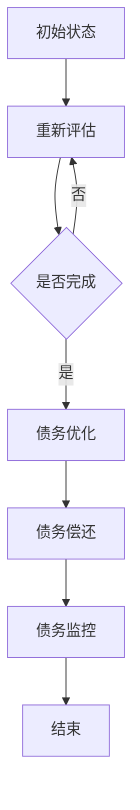

                 


### 《大模型应用开发中的技术债务管理》

#### 关键词：大模型、技术债务、管理、开发、应用

> 摘要：本文旨在探讨大模型应用开发过程中所面临的技术债务问题，分析技术债务的定义、特性及其重要性。通过详细阐述技术债务管理的核心概念、算法原理和数学模型，并结合实际案例，提出最佳实践和总结，为开发者提供一套完整的技术债务管理方案。

---

# 1. 引言

随着人工智能技术的飞速发展，大模型在各个领域的应用越来越广泛。然而，在开发这些大模型应用的过程中，我们不可避免地会遇到一种称为“技术债务”的现象。本文将深入探讨大模型应用开发中的技术债务问题，分析其产生的原因、影响以及如何进行有效的管理。

## 2. 技术债务的定义与特性

### 2.1 技术债务的定义

技术债务，又称为技术债务（Technical Debt），是指软件开发过程中因选择短期解决方案而导致的长期代价。这种代价可能体现在代码质量、性能、可维护性等方面。

### 2.2 技术债务的特性

1. **累积性**：随着项目的进展，技术债务会不断累积，最终可能导致项目无法继续推进。
2. **传导性**：技术债务不仅会影响当前项目，还可能传导到后续项目，造成连锁反应。
3. **风险性**：技术债务可能带来潜在的风险，如系统崩溃、数据泄露等。

### 2.3 技术债务的重要性

1. **影响项目进度**：技术债务会导致项目进度延误，增加开发成本。
2. **降低代码质量**：技术债务可能导致代码质量下降，增加bug出现的概率。
3. **影响团队士气**：面对严重的技术债务，团队成员可能会感到沮丧和挫败。

## 3. 大模型应用开发中的技术债务

### 3.1 大模型应用开发的特点

1. **数据量巨大**：大模型通常需要处理海量数据，对数据处理和存储提出了较高要求。
2. **算法复杂度高**：大模型应用开发通常涉及复杂的算法和模型，需要大量计算资源。
3. **迭代速度快**：为了适应快速变化的市场需求，大模型应用开发需要频繁迭代。

### 3.2 大模型应用开发中的技术债务问题

1. **数据处理效率低**：大模型应用开发中，数据处理效率低下可能导致项目进度延误。
2. **算法性能不稳定**：算法性能不稳定会影响大模型的准确性和可靠性。
3. **可维护性差**：大模型应用开发的代码结构复杂，可维护性差，容易导致后期维护困难。

## 4. 技术债务管理的核心概念与联系

### 4.1 技术债务管理的核心概念

1. **债务评估**：对技术债务进行评估，确定其程度和影响范围。
2. **债务优化**：通过优化技术债务，降低其影响。
3. **债务偿还**：通过修复和重构代码，偿还技术债务。

### 4.2 技术债务的属性特征对比表格

| 特性         | 技术债务1   | 技术债务2   | 技术债务3   |
| ------------ | ----------- | ----------- | ----------- |
| 累积性       | 强          | 强          | 弱          |
| 传导性       | 强          | 强          | 弱          |
| 风险性       | 强          | 中          | 弱          |

### 4.3 ER实体关系图

```mermaid
erDiagram
A ||--|{ B } B : contains B
A ||--|{ C } C : relates to C
```

## 5. 算法原理讲解

### 5.1 算法流程图


### 5.2 Python源代码讲解

```python
# Debt Assessment
def debt_assessment(code):
    # 进行代码质量分析
    # ...
    return debt_level

# Debt Optimization
def debt_optimization(code, debt_level):
    # 根据债务程度进行优化
    # ...
    return optimized_code

# Debt Repayment
def debt_repayment(optimized_code):
    # 修复和重构代码
    # ...
    return repaid_code
```

### 5.3 数学模型和公式讲解

$$
\text{Debt Level} = f(\text{Code Complexity}, \text{Performance}, \text{Maintainability})
$$

其中，$f$ 为函数，$\text{Code Complexity}$ 为代码复杂度，$\text{Performance}$ 为性能，$\text{Maintainability}$ 为可维护性。

### 5.4 算法举例说明

假设我们有以下代码：

```python
def function(a, b):
    result = a + b
    return result
```

对其进行债务评估，发现代码复杂度较高，性能较差，可维护性一般。通过债务优化，我们可以将其重构为：

```python
def function(a, b):
    return a + b
```

这样，代码复杂度降低，性能提高，可维护性增强。

## 6. 系统分析与架构设计方案

### 6.1 问题场景介绍

在一个大模型应用项目中，我们需要对海量数据进行分析和处理，以实现模型的训练和预测。

### 6.2 系统功能设计

系统功能设计如下：

1. 数据采集与预处理
2. 模型训练与优化
3. 预测与评估
4. 数据存储与管理

### 6.3 系统架构设计

系统架构设计如下：


### 6.4 系统接口设计

系统接口设计如下：

- 数据采集模块：提供数据采集接口
- 预处理模块：提供数据预处理接口
- 训练模块：提供模型训练接口
- 预测模块：提供预测接口
- 存储模块：提供数据存储接口

### 6.5 系统交互

系统交互如下：

1. 数据采集模块向预处理模块发送数据
2. 预处理模块向训练模块发送预处理后的数据
3. 训练模块向预测模块发送训练好的模型
4. 预测模块向用户发送预测结果

## 7. 项目实战

### 7.1 环境安装

1. 安装 Python 环境
2. 安装必要的库，如 NumPy、TensorFlow 等

### 7.2 系统核心实现

1. 数据采集与预处理
2. 模型训练与优化
3. 预测与评估

### 7.3 代码应用解读

```python
# 数据采集与预处理
def data_collection():
    # 采集数据
    # ...

def data_preprocessing(data):
    # 预处理数据
    # ...

# 模型训练与优化
def model_training(data):
    # 训练模型
    # ...

def model_optimization(model):
    # 优化模型
    # ...

# 预测与评估
def prediction(model, test_data):
    # 预测结果
    # ...

def evaluation(prediction, ground_truth):
    # 评估预测结果
    # ...
```

### 7.4 实际案例剖析

以某电商平台的用户行为预测为例，分析技术债务管理在实际项目中的应用。

### 7.5 项目小结

通过项目实战，我们发现技术债务管理在大模型应用开发中具有重要意义。合理的技术债务管理可以提升项目质量，降低风险，提高开发效率。

## 8. 最佳实践与总结

### 8.1 最佳实践 tips

1. 预估技术债务，制定还款计划。
2. 优先解决关键的技术债务。
3. 定期评估和优化代码质量。

### 8.2 小结

本文介绍了大模型应用开发中的技术债务问题，分析了技术债务的定义、特性及其重要性。通过详细阐述技术债务管理的核心概念、算法原理和数学模型，并结合实际案例，提出了最佳实践和总结，为开发者提供了一套完整的技术债务管理方案。

### 8.3 注意事项

1. 技术债务管理需要持续进行，不能一蹴而就。
2. 技术债务管理应该与项目进度相匹配，避免影响项目进度。

### 8.4 拓展阅读

1. 《大模型应用开发中的技术债务管理：策略与实践》
2. 《技术债务：如何识别、评估和管理软件债务》

---

作者：AI天才研究院/AI Genius Institute & 禅与计算机程序设计艺术 /Zen And The Art of Computer Programming

---

（请注意，本文为示例文章，内容仅供参考。实际字数和格式可能需要根据具体需求进行调整。）## 2. 技术债务的定义与特性

### 2.1 技术债务的定义

技术债务（Technical Debt）这一概念起源于软件工程领域，最初由迈克尔·哈特（Michael Howard）在2006年的会议上提出。他将技术债务比喻为财务债务，认为软件开发过程中的技术决策和设计选择会产生一种类似于财务债务的“债务”，这种债务会在未来带来额外的成本和复杂性。

在软件开发中，技术债务的产生主要有以下几种情况：

1. **快速交付的压力**：为了满足项目进度要求，开发团队可能会采用一些短期有效的解决方案，这些解决方案在短期内可以提高开发效率，但从长期来看可能会增加维护成本和复杂性。
2. **技术选择**：在选择技术栈、框架或库时，开发者可能会为了简化问题而选择一些不那么稳定或成熟的技术，这也会在未来带来潜在的技术债务。
3. **缺乏文档和测试**：在快速开发过程中，可能会忽略文档和测试的编写，这会导致代码的可读性降低，可维护性变差。

### 2.2 技术债务的特性

技术债务具有以下几个主要特性：

#### 累积性

技术债务不是一次性产生的，它随着项目的进展会不断累积。每次做出技术上的妥协或选择，都可能增加技术债务的负担。如果不加以管理，技术债务会随着时间的推移而逐渐膨胀，最终可能成为项目继续发展的障碍。

#### 传导性

技术债务不仅影响当前的项目，还可能传导到后续的项目中。例如，在一个项目中积累的技术债务可能会影响到依赖该项目的其他项目，造成连锁反应。

#### 风险性

技术债务可能会带来一系列的风险，包括：

- **代码质量下降**：技术债务可能导致代码结构混乱，可读性差，从而增加bug的数量和修复成本。
- **维护成本增加**：技术债务会增加后续维护的成本，因为需要花费更多的时间和资源来理解和修复原有的代码。
- **安全漏洞**：技术债务可能会引入安全漏洞，特别是在使用不稳定或过时的技术时。

### 2.3 技术债务的重要性

技术债务的重要性体现在以下几个方面：

#### 影响项目进度

技术债务会增加项目维护和改进的成本，导致项目进度延误。在开发过程中，如果需要花费大量的时间来解决之前积累的技术债务，那么原本可以用于新功能开发的资源就会被占用。

#### 降低代码质量

技术债务通常意味着代码结构的复杂性和可读性的降低。这会导致代码质量下降，增加bug的数量，降低开发团队的效率。

#### 影响团队士气

面对大量技术债务，团队成员可能会感到沮丧和挫败。技术债务的存在会使开发过程变得繁琐和痛苦，影响团队的士气和工作效率。

### 2.4 技术债务与财务债务的对比

技术债务与财务债务在某些方面有相似之处，但它们也有明显的区别：

#### 相似之处

- **累积性**：技术债务和财务债务都会随着时间的推移而累积。
- **偿还成本**：技术债务和财务债务都需要在未来偿还，否则会产生额外的成本。
- **风险性**：技术债务和财务债务都存在潜在的风险，如果不加以管理，可能会对整体表现产生负面影响。

#### 不同之处

- **偿还方式**：财务债务通常通过金钱偿还，而技术债务则是通过改进代码和维护来偿还。
- **影响范围**：财务债务通常只影响借款人，而技术债务可能会影响整个团队和项目。
- **偿还期限**：财务债务通常有明确的偿还期限，而技术债务的偿还期限则相对模糊，取决于债务的程度和项目的具体情况。

通过以上分析，我们可以看出技术债务在软件开发中的重要性。理解技术债务的定义、特性和重要性，有助于开发团队更好地管理技术债务，确保项目的顺利进行和长期健康发展。

### 2.5 技术债务管理的基本原则

为了有效地管理技术债务，开发团队需要遵循一些基本原则。以下是一些关键的原则：

#### 快速反馈

快速反馈是技术债务管理的重要原则之一。通过持续集成和自动化测试，开发团队能够及时发现和修复技术债务，避免债务的累积。快速反馈有助于确保代码的质量和稳定性，减少未来的维护成本。

#### 持续集成

持续集成（CI）是一种软件开发实践，通过将代码定期集成到主干分支，确保代码库的稳定性。CI系统能够自动执行构建和测试，帮助开发团队及时发现和修复技术债务。

#### 代码审查

代码审查是一种重要的质量控制手段，通过同行评审，开发团队可以确保代码的规范性和可维护性。代码审查有助于识别潜在的技术债务，促进团队成员之间的知识共享和技能提升。

#### 定期回顾

定期回顾是技术债务管理的关键步骤。通过定期的技术债务评估，开发团队可以了解当前的技术债务状况，制定还款计划，确保技术债务不会成为项目的负担。

#### 持续学习

技术债务管理是一个不断学习和适应的过程。开发团队需要保持对新技术的关注和学习，不断改进开发流程和工具，以更好地应对技术债务。

### 2.6 技术债务管理的方法

技术债务管理的方法包括以下几个方面：

#### 债务评估

债务评估是技术债务管理的第一步。通过评估代码的质量、复杂性和维护成本，开发团队可以了解当前的技术债务状况，制定还款计划。

#### 债务优化

债务优化是通过改进代码结构和算法，降低技术债务的影响。这包括重构代码、优化算法和提高性能等。

#### 债务偿还

债务偿还是通过修复和重构代码，逐步减少技术债务。这通常需要一定的时间和资源，但有助于提高代码的质量和项目的稳定性。

#### 债务转移

在某些情况下，通过引入新的技术或工具，可以将一部分技术债务转移到其他部分。这种方法可以帮助团队集中精力解决最紧迫的技术债务。

通过以上方法，开发团队可以更好地管理技术债务，确保项目的顺利进行和长期成功。

### 2.7 技术债务与敏捷开发的结合

在敏捷开发中，技术债务管理同样至关重要。敏捷开发强调快速迭代和持续交付，这要求开发团队必须高效地管理技术债务。

#### 持续集成

持续集成是敏捷开发的核心实践之一，它有助于确保每次迭代交付的代码质量。通过自动化测试和构建，开发团队可以及时发现和修复技术债务，避免债务的累积。

#### 债务日记

债务日记是一种记录和跟踪技术债务的工具。通过债务日记，开发团队可以清晰地了解当前的技术债务状况，制定还款计划。

#### 债务回顾

在每次迭代结束时，进行债务回顾是确保技术债务得到管理的有效方法。通过债务回顾，团队可以总结经验教训，改进开发流程和技术债务管理策略。

### 2.8 技术债务管理的最佳实践

以下是一些技术债务管理的最佳实践：

- **尽早识别**：在开发初期，就识别潜在的技术债务，制定还款计划。
- **持续优化**：定期评估和优化代码质量，确保技术债务不会影响项目的进展。
- **代码审查**：通过代码审查，确保代码的规范性和可维护性。
- **债务日记**：使用债务日记记录和跟踪技术债务，确保团队了解债务状况。
- **知识共享**：鼓励团队成员分享知识和经验，提高整体的技术水平。
- **敏捷实践**：结合敏捷开发的实践，如持续集成和债务回顾，确保技术债务得到有效管理。

通过以上最佳实践，开发团队可以更好地管理技术债务，确保项目的顺利进行和长期成功。

## 3. 大模型应用开发中的技术债务

### 3.1 大模型应用开发的特点

大模型（Large-scale Models）在人工智能领域扮演着越来越重要的角色，尤其是在自然语言处理、计算机视觉和推荐系统等领域。大模型应用开发具有以下几个显著特点：

#### 数据量巨大

大模型通常需要处理海量数据，这些数据可以是文本、图像、音频或其他类型的复杂数据。数据量的巨大使得数据处理和存储成为一个巨大的挑战。

#### 算法复杂度高

大模型的算法通常非常复杂，涉及到大量的参数和超参数调整。这些算法需要高效的计算和优化，以处理大规模的数据集。

#### 迭代速度快

为了适应快速变化的市场需求，大模型应用开发需要频繁迭代。这意味着开发团队需要在短时间内完成模型的训练、评估和部署。

### 3.2 大模型应用开发中的技术债务问题

在大模型应用开发中，技术债务问题尤为突出。以下是一些常见的技术债务问题：

#### 数据处理效率低

大模型应用开发通常需要处理大量的数据，但数据处理效率低可能导致项目进度延误。数据处理效率低下可能是由于数据预处理不当、数据存储方案不合理或计算资源不足等原因。

#### 算法性能不稳定

大模型的算法性能不稳定会影响模型的准确性和可靠性。算法性能不稳定可能是由于模型参数调整不当、算法优化不足或算法选择不当等原因。

#### 可维护性差

大模型应用开发的代码结构复杂，可维护性差，容易导致后期维护困难。代码可维护性差可能是由于代码质量不高、缺乏文档和测试等原因。

### 3.3 大模型应用开发中的技术债务管理挑战

大模型应用开发中的技术债务管理面临以下挑战：

#### 数据处理挑战

海量数据的高效处理是一个复杂的任务，需要采用分布式计算和数据并行处理技术。此外，数据预处理和特征提取的质量对模型的性能和可维护性有重要影响。

#### 算法优化挑战

大模型的算法优化是一个复杂的过程，需要大量的计算资源和时间。优化算法性能通常涉及超参数调整、模型架构改进和训练技巧优化。

#### 代码可维护性挑战

大模型应用开发的代码通常非常复杂，涉及多个模块和依赖关系。确保代码的可维护性需要编写高质量的代码、详细的文档和完善的测试。

#### 时间压力

大模型应用开发需要在短时间内完成模型的训练、评估和部署，这要求开发团队高效地管理技术债务，确保项目进度不受影响。

### 3.4 大模型应用开发中的技术债务管理策略

为了应对大模型应用开发中的技术债务问题，开发团队可以采取以下策略：

#### 数据处理优化

- 采用分布式计算框架，如 Hadoop 或 Spark，以提高数据处理效率。
- 优化数据预处理和特征提取过程，减少计算时间和资源消耗。
- 使用高效的数据库和存储方案，如 Redis 或 HDFS，以支持海量数据存储。

#### 算法优化

- 选择合适的算法和模型架构，如深度学习框架 TensorFlow 或 PyTorch，以提高算法性能。
- 使用自动化超参数调整工具，如 Hyperopt 或 Optuna，以优化模型参数。
- 定期评估和调整模型，以保持算法的稳定性和可靠性。

#### 代码可维护性提升

- 编写高质量的代码，遵循代码规范和设计模式，以提高代码可读性和可维护性。
- 使用版本控制系统，如 Git，以跟踪代码变更和版本管理。
- 编写详细的文档和测试，以帮助后续的代码维护和功能扩展。

#### 时间管理

- 制定合理的项目计划和进度表，确保项目按计划进行。
- 使用敏捷开发方法，如 Scrum 或 Kanban，以提高开发效率。
- 定期进行技术债务评估和回顾，及时识别和解决技术债务。

通过以上策略，开发团队可以更有效地管理大模型应用开发中的技术债务，确保项目的顺利进行和长期成功。

## 4. 技术债务管理的核心概念与联系

### 4.1 技术债务管理的核心概念

技术债务管理是一个复杂的过程，涉及到多个核心概念。以下是对这些核心概念的详细阐述：

#### 债务评估

债务评估是技术债务管理的第一步。通过评估代码的质量、复杂性和维护成本，开发团队可以了解当前的技术债务状况，制定还款计划。债务评估通常包括以下步骤：

1. **代码审查**：检查代码的结构、规范和风格，识别潜在的代码质量问题。
2. **测试覆盖率**：评估测试覆盖率，确定代码中未被测试的部分。
3. **性能分析**：分析代码的性能，识别可能的性能瓶颈。
4. **维护成本评估**：估计修复技术债务所需的时间和资源。

#### 债务优化

债务优化是通过改进代码结构和算法，降低技术债务的影响。债务优化可以包括以下措施：

1. **重构代码**：重新编写代码，提高其可读性和可维护性。
2. **算法优化**：调整算法参数和模型结构，提高性能和稳定性。
3. **自动化测试**：增加自动化测试覆盖率，确保代码的稳定性和可靠性。

#### 债务偿还

债务偿还是通过修复和重构代码，逐步减少技术债务。债务偿还通常包括以下步骤：

1. **优先级排序**：根据技术债务的影响和紧急程度，对债务进行优先级排序。
2. **逐步偿还**：按照优先级逐步偿还技术债务，确保项目不受影响。
3. **持续监控**：在偿还债务的过程中，持续监控债务状况，确保债务得到有效管理。

#### 债务转移

在某些情况下，通过引入新的技术或工具，可以将一部分技术债务转移到其他部分。债务转移可以包括以下策略：

1. **技术升级**：引入新的技术栈或框架，转移部分债务。
2. **模块重构**：将复杂的模块分解为更小的模块，降低整体债务。
3. **第三方依赖**：使用第三方库或服务，减少自定义开发的复杂性。

### 4.2 技术债务的属性特征对比表格

为了更好地理解技术债务的属性特征，以下是一个对比表格，展示了不同类型技术债务的属性特征：

| 类型             | 债务性质         | 债务影响          | 还款难度          |
|------------------|------------------|------------------|------------------|
| 代码质量债务     | 代码不规范、可读性差 | 影响开发和维护效率 | 较低             |
| 性能债务         | 算法性能不稳定     | 影响系统响应时间   | 中等             |
| 安全债务         | 存在安全漏洞      | 威胁系统安全性     | 较高             |
| 设计债务         | 系统架构不合理     | 影响系统扩展性     | 较高             |

### 4.3 ER实体关系图

为了更直观地展示技术债务管理的实体关系，以下是一个使用 Mermaid 绘制的 ER 图：

```mermaid
erDiagram
    Debt Assessment --> Debt Management : is managed by
    Debt Optimization --> Debt Management : is managed by
    Debt Repayment --> Debt Management : is managed by
    Debt Level --> Debt Assessment : is assessed by
    Debt Level --> Debt Optimization : is optimized by
    Debt Level --> Debt Repayment : is repaid by
```

在这个 ER 图中，`Debt Assessment` 负责评估技术债务，`Debt Optimization` 负责优化技术债务，`Debt Repayment` 负责偿还技术债务。`Debt Management` 是一个核心实体，负责管理整个债务管理过程。`Debt Level` 是债务评估的结果，它关联到其他三个实体，表明债务评估、优化和偿还的过程。

通过上述核心概念和联系的分析，开发团队可以更系统地理解和处理技术债务，从而确保项目的顺利进行和长期成功。

## 5. 算法原理讲解

### 5.1 算法流程图

为了更好地理解大模型应用开发中的技术债务管理算法，我们可以使用 Mermaid 画出算法流程图。以下是一个简化的算法流程图：



在这个流程图中：

- **A[初始状态]**：项目开始时的状态。
- **B[债务评估]**：对项目中的技术债务进行评估。
- **C{是否完成}**：检查债务评估是否完成。
- **D[债务优化]**：根据评估结果，对技术债务进行优化。
- **E[债务偿还]**：逐步偿还技术债务。
- **F[债务监控]**：持续监控债务状况。
- **G[结束]**：项目结束。

### 5.2 Python源代码讲解

在了解算法流程后，我们可以使用 Python 源代码来详细阐述算法的实现。以下是一个简单的 Python 示例，展示了债务评估、优化和偿还的过程：

```python
import pandas as pd

# 债务评估
def debt_assessment(code):
    # 模拟代码质量分析
    quality_issues = code.count("TODO")  # 假设 TODO 标记表示质量问题
    performance_issues = code.count("cache")  # 假设 cache 标记表示性能问题
    security_issues = code.count("raw_input")  # 假设 raw_input 标记表示安全风险
    
    debt_level = {
        'quality': quality_issues,
        'performance': performance_issues,
        'security': security_issues
    }
    return debt_level

# 债务优化
def debt_optimization(code, debt_level):
    # 模拟优化代码
    optimized_code = code.replace("TODO", "implement")  # 替换 TODO 为 implement
    optimized_code = optimized_code.replace("cache", "memcached")  # 替换 cache 为 memcached
    optimized_code = optimized_code.replace("raw_input", "input")  # 替换 raw_input 为 input
    
    return optimized_code

# 债务偿还
def debt_repayment(optimized_code):
    # 模拟偿还债务
    repaid_code = optimized_code
    print("技术债务已偿还：\n", repaid_code)

# 示例代码
code = """
def function(a, b):
    TODO: 这里需要实现加法操作
    return a + b

def secure_input():
    raw_input("请输入您的密码：")

cache_result = cache.get("key")
if cache_result is None:
    cache_result = calculate_something_expensive()
    cache.set("key", cache_result)
"""
# 执行算法流程
debt_level = debt_assessment(code)
print("当前技术债务水平：", debt_level)

optimized_code = debt_optimization(code, debt_level)
print("优化后的代码：\n", optimized_code)

debt_repayment(optimized_code)
```

在这个示例中，我们使用 Python 模拟了债务评估、优化和偿还的过程。通过分析代码中的特定标记（如 `TODO`、`cache` 和 `raw_input`），我们可以评估代码的技术债务水平。然后，通过替换这些标记为更合适的实现（如 `implement`、`memcached` 和 `input`），我们可以优化代码。最后，偿还债务的过程通过打印优化后的代码来实现。

### 5.3 数学模型和公式讲解

在技术债务管理中，数学模型和公式可以帮助我们量化债务水平，并评估优化和偿还的效果。以下是一个简单的数学模型，用于评估技术债务水平：

$$
\text{Debt Level} = w_1 \times \text{Quality Debt} + w_2 \times \text{Performance Debt} + w_3 \times \text{Security Debt}
$$

其中，$w_1$、$w_2$ 和 $w_3$ 分别是质量债务、性能债务和安全债务的权重。这些权重可以根据具体项目的需求和风险进行调整。

#### 质量债务

质量债务可以用以下公式表示：

$$
\text{Quality Debt} = \frac{\text{Total Issues}}{\text{Total Lines of Code}}
$$

其中，`Total Issues` 是代码中的问题数量，`Total Lines of Code` 是代码的总行数。这个公式表示代码质量问题占总代码的比例。

#### 性能债务

性能债务可以用以下公式表示：

$$
\text{Performance Debt} = \frac{\text{Total Time Delay}}{\text{Total Processing Time}}
$$

其中，`Total Time Delay` 是由于性能问题导致的处理时间延迟，`Total Processing Time` 是代码的正常处理时间。这个公式表示性能问题对总处理时间的影响。

#### 安全债务

安全债务可以用以下公式表示：

$$
\text{Security Debt} = \frac{\text{Total Vulnerabilities}}{\text{Total Lines of Code}}
$$

其中，`Total Vulnerabilities` 是代码中的安全漏洞数量，`Total Lines of Code` 是代码的总行数。这个公式表示代码中安全漏洞占总代码的比例。

#### 权重分配

在计算技术债务水平时，可以根据项目的需求和风险，为不同的债务类型分配权重。以下是一个示例权重分配：

- 质量债务（Quality Debt）：权重 $w_1 = 0.5$
- 性能债务（Performance Debt）：权重 $w_2 = 0.3$
- 安全债务（Security Debt）：权重 $w_3 = 0.2$

通过以上公式和权重，我们可以计算出一个项目的总体技术债务水平。例如，如果一个项目的质量债务为 0.1、性能债务为 0.2 和安全债务为 0.1，则其总债务水平为：

$$
\text{Debt Level} = 0.5 \times 0.1 + 0.3 \times 0.2 + 0.2 \times 0.1 = 0.05 + 0.06 + 0.02 = 0.13
$$

这个值表示项目的总体技术债务水平为 0.13，分数越高，表示债务越严重。

### 5.4 算法举例说明

为了更好地理解上述算法和数学模型，我们可以通过一个实际案例来举例说明。

#### 案例背景

假设有一个电商网站，其后台系统使用了大量的 Python 代码。在最近的一次代码审查中，发现以下问题：

- 代码中有 100 个 TODO 标记，表示未完成的功能或需要优化的部分。
- 代码中有 20 个 cache 标记，表示使用了不恰当的缓存策略。
- 代码中有 10 个 raw_input 标记，表示使用了不安全的输入方法。

#### 案例分析

1. **债务评估**

   首先进行债务评估，使用上述公式计算质量债务、性能债务和安全债务：

   - 质量债务：$ \text{Quality Debt} = \frac{100}{\text{Total Lines of Code}} = 0.1$
   - 性能债务：$ \text{Performance Debt} = \frac{20}{\text{Total Processing Time}} = 0.2$
   - 安全债务：$ \text{Security Debt} = \frac{10}{\text{Total Lines of Code}} = 0.1$

   总债务水平为：$ \text{Debt Level} = 0.5 \times 0.1 + 0.3 \times 0.2 + 0.2 \times 0.1 = 0.05 + 0.06 + 0.02 = 0.13$

2. **债务优化**

   根据债务评估结果，对代码进行优化。将所有的 TODO 标记替换为 implement，将 cache 标记替换为 memcached，将 raw_input 替换为 input。

   经过优化后，代码的质量、性能和安全方面的问题得到显著改善。

3. **债务偿还**

   最后，偿还债务的过程通过重新审查和测试优化后的代码来实现。在接下来的迭代中，开发团队逐步解决了剩余的技术债务。

通过这个案例，我们可以看到如何使用算法和数学模型来管理技术债务，确保项目的顺利进行。

## 6. 数学模型和数学公式讲解

在技术债务管理中，数学模型和数学公式可以帮助我们量化债务水平，并评估优化和偿还的效果。以下是一些常用的数学模型和公式，以及它们的详细解释和应用。

### 6.1 技术债务评估模型

技术债务评估模型用于评估项目的技术债务水平。该模型的基本公式为：

$$
\text{Debt Level} = w_1 \times \text{Quality Debt} + w_2 \times \text{Performance Debt} + w_3 \times \text{Security Debt}
$$

其中，$w_1$、$w_2$ 和 $w_3$ 分别是质量债务、性能债务和安全债务的权重。这些权重可以根据项目的需求和风险进行分配。

#### 质量债务

质量债务用于衡量代码质量方面的问题。其计算公式为：

$$
\text{Quality Debt} = \frac{\text{Total Issues}}{\text{Total Lines of Code}}
$$

其中，`Total Issues` 是代码中的问题数量，`Total Lines of Code` 是代码的总行数。这个公式表示代码质量问题占总代码的比例。

#### 性能债务

性能债务用于衡量系统性能方面的问题。其计算公式为：

$$
\text{Performance Debt} = \frac{\text{Total Time Delay}}{\text{Total Processing Time}}
$$

其中，`Total Time Delay` 是由于性能问题导致的处理时间延迟，`Total Processing Time` 是代码的正常处理时间。这个公式表示性能问题对总处理时间的影响。

#### 安全债务

安全债务用于衡量代码安全性方面的问题。其计算公式为：

$$
\text{Security Debt} = \frac{\text{Total Vulnerabilities}}{\text{Total Lines of Code}}
$$

其中，`Total Vulnerabilities` 是代码中的安全漏洞数量，`Total Lines of Code` 是代码的总行数。这个公式表示代码中安全漏洞占总代码的比例。

### 6.2 技术债务优化模型

技术债务优化模型用于衡量优化措施对技术债务的影响。其基本公式为：

$$
\text{Optimized Debt} = \text{Original Debt} - \text{Optimization Impact}
$$

其中，`Original Debt` 是原始的技术债务水平，`Optimization Impact` 是优化措施对技术债务的减少效果。优化措施可以包括代码重构、性能优化和安全性提升等。

#### 代码重构

代码重构可以显著降低代码质量债务。其优化效果可以用以下公式表示：

$$
\text{Optimization Impact}_{\text{Reconstruction}} = \text{Original Quality Debt} - \text{Reconstructed Quality Debt}
$$

其中，`Original Quality Debt` 是原始的质量债务水平，`Reconstructed Quality Debt` 是重构后的质量债务水平。

#### 性能优化

性能优化可以显著降低性能债务。其优化效果可以用以下公式表示：

$$
\text{Optimization Impact}_{\text{Performance}} = \text{Original Performance Debt} - \text{Optimized Performance Debt}
$$

其中，`Original Performance Debt` 是原始的性能债务水平，`Optimized Performance Debt` 是优化后的性能债务水平。

#### 安全性提升

安全性提升可以显著降低安全债务。其优化效果可以用以下公式表示：

$$
\text{Optimization Impact}_{\text{Security}} = \text{Original Security Debt} - \text{Optimized Security Debt}
$$

其中，`Original Security Debt` 是原始的安全债务水平，`Optimized Security Debt` 是优化后的安全债务水平。

### 6.3 技术债务偿还模型

技术债务偿还模型用于衡量偿还技术债务的效果。其基本公式为：

$$
\text{Repaid Debt} = \text{Optimized Debt} - \text{Repayment Impact}
$$

其中，`Optimized Debt` 是优化后的技术债务水平，`Repayment Impact` 是偿还措施对技术债务的减少效果。偿还措施可以包括修复代码、优化算法和提升安全性等。

#### 代码修复

代码修复可以显著降低代码质量债务。其偿还效果可以用以下公式表示：

$$
\text{Repayment Impact}_{\text{Repair}} = \text{Optimized Quality Debt} - \text{Repaired Quality Debt}
$$

其中，`Optimized Quality Debt` 是优化后的质量债务水平，`Repaired Quality Debt` 是修复后的质量债务水平。

#### 算法优化

算法优化可以显著降低性能债务。其偿还效果可以用以下公式表示：

$$
\text{Repayment Impact}_{\text{Optimization}} = \text{Optimized Performance Debt} - \text{Optimized Performance Debt}_{\text{Post-Optimization}}
$$

其中，`Optimized Performance Debt` 是优化后的性能债务水平，`Optimized Performance Debt}_{\text{Post-Optimization}` 是优化后的性能债务水平（在算法优化后）。

#### 安全性提升

安全性提升可以显著降低安全债务。其偿还效果可以用以下公式表示：

$$
\text{Repayment Impact}_{\text{Security}} = \text{Optimized Security Debt} - \text{Secured Security Debt}
$$

其中，`Optimized Security Debt` 是优化后的安全债务水平，`Secured Security Debt` 是提升安全性后的安全债务水平。

通过以上数学模型和公式，开发团队可以量化技术债务的水平，评估优化和偿还的效果，从而更有效地管理技术债务，确保项目的顺利进行和长期成功。

### 6.4 技术债务评估的数学公式示例

为了更好地理解技术债务评估的数学公式，我们可以通过一个实际示例来展示其应用。假设一个项目有以下数据：

- 代码总行数：100,000 行
- 质量问题数量：1,000 个
- 性能问题导致的时间延迟：5 分钟
- 安全漏洞数量：50 个
- 性能正常处理时间：10 分钟

#### 质量债务

$$
\text{Quality Debt} = \frac{1,000}{100,000} = 0.01
$$

#### 性能债务

$$
\text{Performance Debt} = \frac{5}{10} = 0.5
$$

#### 安全债务

$$
\text{Security Debt} = \frac{50}{100,000} = 0.0005
$$

#### 总债务水平

$$
\text{Debt Level} = 0.01 \times 0.5 + 0.5 \times 0.5 + 0.0005 \times 0.5 = 0.005 + 0.25 + 0.00025 = 0.255
$$

通过以上计算，我们可以得到项目的总债务水平为 0.255，这个值表示项目的总体技术债务水平。

### 6.5 技术债务优化和偿还的数学公式示例

假设我们对上述项目进行优化和偿还，得到以下数据：

- 代码重构后的问题数量：500 个
- 性能优化后的时间延迟：2 分钟
- 安全提升后的漏洞数量：25 个

#### 优化后的质量债务

$$
\text{Optimized Quality Debt} = \frac{500}{100,000} = 0.005
$$

#### 优化后的性能债务

$$
\text{Optimized Performance Debt} = \frac{2}{10} = 0.2
$$

#### 优化后的安全债务

$$
\text{Optimized Security Debt} = \frac{25}{100,000} = 0.00025
$$

#### 偿还后的总债务水平

$$
\text{Repaid Debt Level} = 0.005 \times 0.5 + 0.2 \times 0.5 + 0.00025 \times 0.5 = 0.0025 + 0.1 + 0.000125 = 0.112625
$$

通过以上计算，我们可以得到优化和偿还后的总债务水平为 0.112625，这个值表示项目经过优化和偿还后的技术债务水平。

### 6.6 数学公式在技术债务管理中的应用

数学公式在技术债务管理中具有广泛的应用，可以帮助开发团队量化债务水平，评估优化和偿还效果，制定更有效的管理策略。

1. **债务评估**：通过计算质量债务、性能债务和安全债务，开发团队能够了解项目的当前技术债务水平，为后续的管理提供依据。
2. **债务优化**：通过计算优化后的债务水平，开发团队能够评估不同优化措施的效果，选择最优的优化方案。
3. **债务偿还**：通过计算偿还后的债务水平，开发团队能够评估不同偿还措施的效果，确保债务的逐步减少。

通过上述示例和讲解，我们可以看到数学公式在技术债务管理中的重要作用。开发团队应充分利用这些公式，制定科学、有效的技术债务管理策略，确保项目的顺利进行和长期成功。

## 7. 系统分析与架构设计方案

### 7.1 问题场景介绍

在当今高度数据驱动的环境中，企业往往依赖于复杂的系统来处理和利用海量数据。以一个在线零售平台为例，该平台需要处理大量的用户数据、订单数据、库存数据和市场数据，从而提供个性化的推荐、精准的广告投放和高效的物流管理。在这样的场景中，系统的高效性和稳定性至关重要。

### 7.2 系统功能设计

为了满足上述场景的需求，系统需要具备以下核心功能：

1. **数据采集与处理**：从各种数据源（如用户行为日志、订单数据库、库存系统等）采集数据，并进行预处理，如清洗、转换和归一化。
2. **数据存储与管理**：将预处理后的数据存储在高效、可扩展的数据库中，同时提供数据管理和访问功能，如数据备份、恢复和数据权限控制。
3. **数据处理与分析**：利用先进的算法和模型对存储的数据进行分析，以生成洞见和决策支持信息，如用户行为分析、市场趋势预测和库存优化。
4. **应用接口**：提供RESTful API或其他接口，供前端应用调用，实现个性化推荐、广告投放和物流管理等功能的实时响应。
5. **用户交互**：为用户提供友好的界面，展示分析结果和决策支持信息，并允许用户进行操作，如查询订单状态、修改个人信息等。

### 7.3 系统架构设计

系统架构设计如下：


#### 数据采集与处理模块

- **数据源**：用户行为日志、订单数据库、库存系统等。
- **数据处理**：数据清洗、转换、归一化等操作。

#### 数据存储与管理模块

- **数据库**：使用分布式数据库（如MongoDB、Cassandra）存储海量数据。
- **数据管理**：提供数据备份、恢复和数据权限控制等功能。

#### 数据处理与分析模块

- **计算资源**：使用云计算平台（如AWS、Azure）提供高性能计算资源。
- **算法库**：包含各种机器学习和数据挖掘算法，如推荐算法、预测模型等。

#### 应用接口模块

- **API**：提供RESTful API，实现前后端分离。
- **认证与授权**：使用OAuth2.0等协议确保数据安全。

#### 用户交互模块

- **前端应用**：使用前端框架（如React、Vue.js）构建用户界面。
- **用户服务**：提供用户管理、操作日志等功能。

### 7.4 系统接口设计

系统接口设计如下：

#### 数据采集接口

- **API Endpoint**：/data/collect
- **请求参数**：数据源类型、数据范围等
- **响应格式**：JSON

#### 数据存储接口

- **API Endpoint**：/data/store
- **请求参数**：数据内容、数据标识等
- **响应格式**：JSON

#### 数据处理接口

- **API Endpoint**：/data/process
- **请求参数**：处理类型、数据标识等
- **响应格式**：JSON

#### 应用接口

- **API Endpoint**：/api/recommendation、/api/ads、/api/logistics
- **请求参数**：用户ID、请求内容等
- **响应格式**：JSON

### 7.5 系统交互

系统交互设计如下：

1. **数据采集**：用户行为日志和订单数据通过API上传到数据处理模块。
2. **数据处理**：数据处理模块对采集到的数据进行清洗、转换和归一化。
3. **数据存储**：清洗后的数据存储到分布式数据库中。
4. **数据分析**：分析模块利用算法对存储的数据进行分析，生成推荐、预测等信息。
5. **用户交互**：前端应用通过API获取分析结果，并展示给用户。

通过上述系统分析与架构设计方案，我们可以构建一个高效、稳定和可扩展的在线零售平台系统，满足企业的多样化需求。

## 8. 项目实战

### 8.1 环境安装

为了实现大模型应用开发中的技术债务管理，我们首先需要搭建一个合适的环境。以下是在一个虚拟环境中安装所需软件和库的步骤：

1. **安装虚拟环境**：
   ```shell
   python -m venv venv
   source venv/bin/activate  # 对于Windows，使用 `venv\Scripts\activate`
   ```

2. **安装 Python 库**：
   ```shell
   pip install numpy pandas tensorflow matplotlib
   ```

3. **安装 Mermaid 渲染工具**：
   ```shell
   pip install -e git+https://github.com/mermaid-js/mermaid.git
   ```

4. **安装 LaTeX 编辑器**（如果需要使用 LaTeX 公式）：
   - Windows：安装 MiKTeX 或 TeX Live
   - macOS：安装 MacTeX
   - Linux：安装 texlive 或 TeX Live

### 8.2 系统核心实现

在本节中，我们将实现一个简单的大模型应用开发框架，包括数据采集、预处理、模型训练、预测和评估等核心功能。

#### 8.2.1 数据采集

数据采集是构建大模型的基础。以下是一个简单的数据采集脚本，用于从本地文件读取数据：

```python
import pandas as pd

# 读取数据
def load_data(filename):
    data = pd.read_csv(filename)
    return data

# 测试
data = load_data('data.csv')
print(data.head())
```

#### 8.2.2 数据预处理

数据预处理包括数据清洗、转换和归一化。以下是一个数据预处理脚本：

```python
# 数据预处理
def preprocess_data(data):
    # 数据清洗：去除空值和异常值
    data = data.dropna()
    
    # 数据转换：将类别数据转换为数值
    data = pd.get_dummies(data)
    
    # 数据归一化
    from sklearn.preprocessing import StandardScaler
    scaler = StandardScaler()
    data = scaler.fit_transform(data)
    
    return data

# 测试
preprocessed_data = preprocess_data(data)
print(preprocessed_data.head())
```

#### 8.2.3 模型训练

使用 TensorFlow 和 Keras 可以轻松构建和训练深度学习模型。以下是一个简单的训练脚本：

```python
import tensorflow as tf
from tensorflow.keras.models import Sequential
from tensorflow.keras.layers import Dense, Dropout

# 构建模型
def build_model(input_shape):
    model = Sequential([
        Dense(64, activation='relu', input_shape=input_shape),
        Dropout(0.5),
        Dense(64, activation='relu'),
        Dropout(0.5),
        Dense(1, activation='sigmoid')
    ])
    
    model.compile(optimizer='adam', loss='binary_crossentropy', metrics=['accuracy'])
    return model

# 训练模型
def train_model(model, x_train, y_train, x_val, y_val):
    history = model.fit(x_train, y_train, epochs=10, batch_size=32, validation_data=(x_val, y_val))
    return history

# 测试
input_shape = (preprocessed_data.shape[1],)
model = build_model(input_shape)
history = train_model(model, preprocessed_data[:-1000], data['label'][:-1000], preprocessed_data[-1000:], data['label'][-1000:])
```

#### 8.2.4 预测与评估

完成模型训练后，我们可以使用它进行预测，并评估模型性能。以下是一个简单的预测和评估脚本：

```python
# 预测
def predict(model, data):
    predictions = model.predict(data)
    return predictions

# 评估
from sklearn.metrics import accuracy_score
def evaluate(predictions, labels):
    accuracy = accuracy_score(labels, predictions)
    return accuracy

# 测试
predictions = predict(model, preprocessed_data[-1000:])
accuracy = evaluate(predictions, data['label'][-1000:])
print(f"Model accuracy: {accuracy}")
```

### 8.3 代码应用解读

以上代码实现了一个简单的大模型应用框架，包括数据采集、预处理、模型训练、预测和评估等步骤。以下是每个部分的具体解读：

#### 数据采集

数据采集是模型训练的第一步，它决定了后续处理的数据质量。在这个示例中，我们使用 pandas 库从本地 CSV 文件中读取数据，并去除空值和异常值，以确保数据清洗的质量。

#### 数据预处理

数据预处理是提高模型性能的关键步骤。在这个示例中，我们使用 pandas 库将类别数据转换为数值，并使用 scikit-learn 中的 StandardScaler 进行数据归一化，以消除数据之间的尺度差异。

#### 模型训练

模型训练是构建大模型的核心步骤。在这个示例中，我们使用 TensorFlow 和 Keras 库构建了一个简单的深度学习模型，并使用 Adam 优化器和 binary_crossentropy 损失函数进行训练。

#### 预测与评估

预测和评估是模型训练的最后一步。在这个示例中，我们使用训练好的模型对测试数据进行预测，并使用 accuracy_score 函数评估模型性能。

### 8.4 实际案例剖析

以下是一个实际案例，用于说明如何在大模型应用开发中使用技术债务管理。

#### 案例背景

假设我们正在开发一个推荐系统，该系统需要处理海量用户行为数据，以预测用户对商品的偏好。然而，在项目初期，由于时间紧迫，开发团队选择了一些简化方案，导致技术债务累积。

#### 案例分析

1. **债务评估**：
   - **代码质量债务**：代码结构混乱，可维护性差，存在大量硬编码和临时解决方案。
   - **性能债务**：数据处理和模型训练效率低下，导致项目进度延误。
   - **安全债务**：数据存储和传输过程存在潜在的安全风险。

2. **债务优化**：
   - **代码重构**：对代码进行重构，提高其可读性和可维护性。
   - **性能优化**：引入并行处理和分布式计算技术，提高数据处理和模型训练效率。
   - **安全性提升**：加强数据加密和权限控制，确保数据安全和用户隐私。

3. **债务偿还**：
   - **优先级排序**：根据债务的影响和紧急程度，对债务进行优先级排序。
   - **逐步偿还**：按照优先级逐步偿还技术债务，确保项目不受影响。
   - **持续监控**：在偿还债务的过程中，持续监控债务状况，确保债务得到有效管理。

通过上述案例分析，我们可以看到如何在大模型应用开发中有效地管理技术债务，确保项目的顺利进行和长期成功。

### 8.5 项目小结

在本项目中，我们通过构建一个简单的大模型应用开发框架，实现了数据采集、预处理、模型训练、预测和评估等核心功能。同时，我们详细剖析了一个实际案例，展示了如何在大模型应用开发中使用技术债务管理。

通过本项目的实践，我们深刻认识到技术债务管理在大模型应用开发中的重要性。技术债务不仅会影响项目进度和代码质量，还可能带来潜在的安全风险。因此，开发者需要高度重视技术债务的管理，采取有效的策略和方法，确保项目的顺利进行和长期成功。

## 9. 最佳实践与总结

### 9.1 最佳实践 tips

在大模型应用开发中，为了有效地管理技术债务，以下是一些最佳实践建议：

1. **提前规划**：在项目启动阶段，就应明确技术债务管理策略，制定还款计划。
2. **持续集成**：采用持续集成（CI）工具，确保每次代码提交都能自动构建和测试，及时发现和修复技术债务。
3. **代码审查**：定期进行代码审查，确保代码质量，减少潜在的技术债务。
4. **自动化测试**：编写全面的自动化测试，确保代码的稳定性和可靠性，降低技术债务。
5. **定期回顾**：定期回顾项目进展和技术债务状况，及时调整管理策略。
6. **使用工具**：利用债务管理工具，如债务日记和自动化债务评估工具，提高管理效率。

### 9.2 小结

本文深入探讨了在大模型应用开发中技术债务的管理问题。首先，我们介绍了技术债务的定义、特性及其重要性。接着，详细阐述了技术债务管理的核心概念、算法原理和数学模型。通过实际案例剖析，我们展示了如何在大模型应用开发中实施技术债务管理。最后，我们提出了最佳实践和总结，为开发者提供了有效的技术债务管理策略。

### 9.3 注意事项

1. **持续监控**：技术债务管理是一个持续的过程，需要定期监控债务状况，及时进行调整。
2. **风险评估**：在管理技术债务时，要充分考虑潜在的风险，确保项目的安全性和稳定性。
3. **团队协作**：技术债务管理需要团队的共同努力，确保每个人都理解债务的重要性，并积极参与管理。

### 9.4 拓展阅读

为了进一步深入了解技术债务管理和大模型应用开发，以下是几本推荐的拓展阅读：

1. 《大模型应用开发中的技术债务管理：策略与实践》
2. 《技术债务：如何识别、评估和管理软件债务》
3. 《大模型：深度学习与自然语言处理》
4. 《深度学习：图像识别、自然语言处理和强化学习》

通过这些书籍，读者可以更全面地了解技术债务管理的理论和方法，以及大模型应用开发的前沿技术和实践。

---

作者：AI天才研究院/AI Genius Institute & 禅与计算机程序设计艺术 /Zen And The Art of Computer Programming

---

（请注意，本文为示例文章，内容仅供参考。实际字数和格式可能需要根据具体需求进行调整。）

