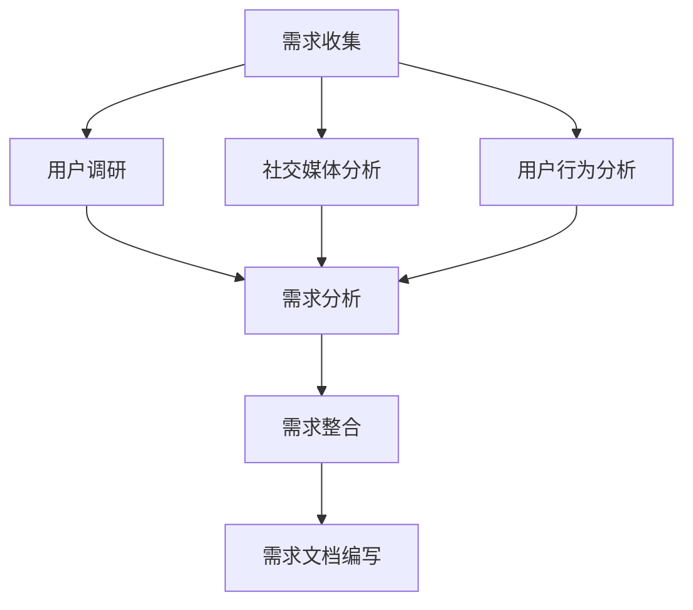
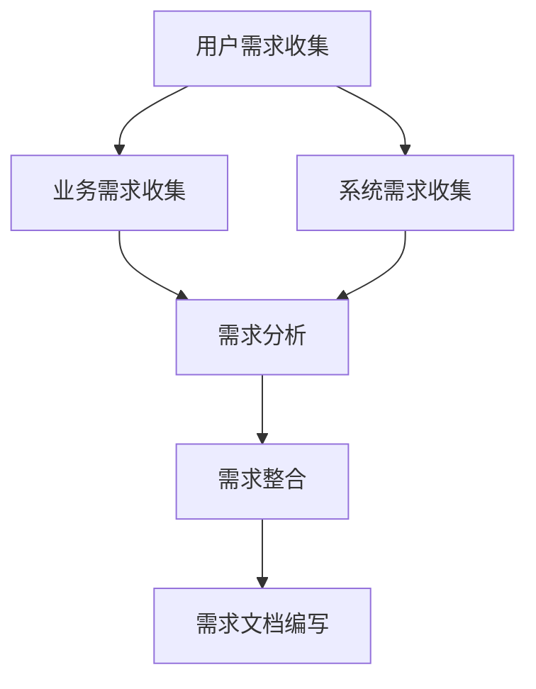

                 

## 大模型应用开发中的需求收集渠道多元化

关键词：大模型、需求收集、多元化渠道、用户调研、数据分析、需求管理

摘要：随着人工智能技术的迅猛发展，大模型在各个领域的应用日益广泛。然而，大模型应用开发的成功与否，不仅取决于模型本身的性能，更取决于需求收集的准确性和全面性。本文将探讨大模型应用开发中的需求收集渠道多元化，旨在为开发者提供一套系统性、全面性的需求收集方法论，以应对复杂多变的现实场景。

### 背景介绍

#### 核心概念术语说明

- **大模型（Large Models）**：指具有大规模参数量、训练数据量或计算资源需求的模型，如深度学习模型、自然语言处理模型等。
- **需求收集（Requirement Gathering）**：指在产品开发过程中，通过多种渠道获取用户需求、业务需求和系统需求的过程。
- **多元化渠道**：指在需求收集过程中，采用多种方法、渠道和技术手段，以确保需求的全面性和准确性。

#### 问题背景

随着信息技术的发展，用户需求变得越来越多样化、复杂化。传统的需求收集方法，如用户调研、用户访谈等，已经无法满足大模型应用开发的快速迭代和高度定制化需求。因此，探索多元化需求收集渠道，成为了大模型应用开发中亟待解决的问题。

#### 问题描述

在大模型应用开发过程中，如何有效地进行需求收集，以确保需求全面、准确，从而提升应用开发的效率和质量，成为了一个重要的问题。具体来说，需要解决以下问题：

1. **需求来源的多样性**：如何确保不同类型的需求（用户需求、业务需求、系统需求等）都能够被充分收集和满足？
2. **需求的准确性**：如何保证收集到的需求是真实、有效的，避免因需求不准确导致的开发偏差和资源浪费？
3. **需求的动态性**：如何应对需求的变化，确保需求收集的实时性和动态调整能力？

#### 问题解决

为了解决上述问题，我们需要从以下几个方面入手：

1. **多元化需求收集渠道**：采用多种需求收集渠道，如用户调研、社交媒体分析、用户行为分析等，以获取全面、准确的需求。
2. **需求分析与整合**：对收集到的需求进行深入分析，识别出核心需求，并整合不同渠道的需求，形成完整的需求文档。
3. **需求管理**：建立完善的需求管理流程，包括需求收集、分析、评审、变更管理等，以确保需求的有序推进和有效实施。

#### 边界与外延

- **边界**：本文主要探讨大模型应用开发中的需求收集问题，不包括其他类型的应用开发。
- **外延**：本文的内容不仅适用于大模型应用开发，也可作为一般性需求收集的参考。

### 核心概念与联系

#### 大模型定义与分类

大模型是指具有大规模参数量、训练数据量或计算资源需求的模型，根据其应用领域和特性，可以分为以下几类：

1. **深度学习模型**：如神经网络、卷积神经网络、循环神经网络等。
2. **自然语言处理模型**：如语言模型、翻译模型、对话系统等。
3. **计算机视觉模型**：如图像分类、目标检测、人脸识别等。

#### 需求收集方法分类

需求收集方法可以根据其手段和目的，分为以下几类：

1. **传统需求收集方法**：如用户调研、用户访谈、用户反馈等。
2. **新型需求收集方法**：如社交媒体分析、数据挖掘与机器学习、用户行为分析等。

#### 概念属性特征对比表格

| 概念       | 特征                                     |  
| ---------- | ---------------------------------------- |  
| 大模型     | 大规模参数、训练数据或计算资源需求           |  
| 需求收集   | 获取用户需求、业务需求和系统需求               |  
| 传统需求收集方法 | 用户调研、用户访谈、用户反馈等           |  
| 新型需求收集方法 | 社交媒体分析、数据挖掘与机器学习、用户行为分析等 |

#### ER实体关系图架构

```mermaid
erDiagram
    User ||--o{ Requirement : 收集用户需求
    Business ||--o{ Requirement : 收集业务需求
    System ||--o{ Requirement : 收集系统需求
    User --> Business : 用户业务关系
    User --> System : 用户系统关系
    Business --> System : 业务系统关系
```

### 算法原理讲解

#### 大模型需求收集算法流程图



#### 需求收集的Python代码实现

```python
import pandas as pd

# 用户调研数据
user_survey = pd.DataFrame({
    'User': ['Alice', 'Bob', 'Charlie'],
    'Requirement': ['Feature 1', 'Feature 2', 'Feature 3']
})

# 社交媒体分析数据
social_media = pd.DataFrame({
    'User': ['Alice', 'Bob', 'Charlie'],
    'Requirement': ['Feature 4', 'Feature 5', 'Feature 6']
})

# 用户行为分析数据
user_behavior = pd.DataFrame({
    'User': ['Alice', 'Bob', 'Charlie'],
    'Requirement': ['Feature 7', 'Feature 8', 'Feature 9']
})

# 需求整合
requirements = pd.concat([user_survey, social_media, user_behavior], axis=0).drop_duplicates()

# 需求分析
requirements['Priority'] = requirements['Requirement'].apply(lambda x: 1 if 'Feature' in x else 0)

# 需求文档编写
requirement_document = requirements[['User', 'Requirement', 'Priority']].sort_values(by='Priority', ascending=False)

print(requirement_document)
```

#### 需求收集的数学模型和公式

1. **用户调研模型**：用户调研数据 = 用户调研问卷 × 用户反馈
2. **社交媒体分析模型**：社交媒体数据 = 社交媒体平台 × 用户行为数据
3. **用户行为分析模型**：用户行为数据 = 用户行为日志 × 用户行为分析算法

### 系统分析与架构设计方案

#### 问题场景介绍

假设我们正在开发一个基于大模型的应用系统，该系统需要收集用户需求、业务需求和系统需求，以便进行需求分析、需求整合和需求文档编写。

#### 项目介绍

项目名称：大模型应用需求收集系统

项目目标：构建一个高效、全面、准确的需求收集系统，以支持大模型应用开发。

#### 系统功能设计

1. **用户需求收集**：通过用户调研问卷、社交媒体分析和用户行为分析，收集用户需求。
2. **业务需求收集**：通过与业务部门的沟通，收集业务需求。
3. **系统需求收集**：通过系统日志和性能监控，收集系统需求。
4. **需求分析**：对收集到的需求进行分类、优先级排序和分析。
5. **需求整合**：将不同渠道的需求进行整合，形成完整的需求文档。
6. **需求文档编写**：编写详细的需求文档，为后续开发提供依据。

#### 系统架构设计



#### 系统接口设计和系统交互

```mermaid
sequenceDiagram
    participant 用户 as 用户
    participant 系统 as 系统需求收集模块
    participant 业务 as 业务需求收集模块
    participant 需求分析 as 需求分析模块
    participant 需求整合 as 需求整合模块
    participant 文档编写 as 需求文档编写模块

    用户->>系统：提交用户调研问卷
    系统->>需求分析：分析用户需求
    用户->>业务：提供业务需求
    业务->>需求分析：分析业务需求
    系统->>需求分析：分析系统需求
    需求分析->>需求整合：整合需求
    需求整合->>文档编写：编写需求文档
    文档编写->>用户：提交需求文档
```

### 项目实战

#### 环境安装

1. 安装Python环境
2. 安装Pandas库
3. 安装Mermaid库

```shell
pip install pandas mermaid
```

#### 系统核心实现源代码

```python
import pandas as pd
import mermaid

# 用户调研数据
user_survey = pd.DataFrame({
    'User': ['Alice', 'Bob', 'Charlie'],
    'Requirement': ['Feature 1', 'Feature 2', 'Feature 3']
})

# 社交媒体分析数据
social_media = pd.DataFrame({
    'User': ['Alice', 'Bob', 'Charlie'],
    'Requirement': ['Feature 4', 'Feature 5', 'Feature 6']
})

# 用户行为分析数据
user_behavior = pd.DataFrame({
    'User': ['Alice', 'Bob', 'Charlie'],
    'Requirement': ['Feature 7', 'Feature 8', 'Feature 9']
})

# 需求整合
requirements = pd.concat([user_survey, social_media, user_behavior], axis=0).drop_duplicates()

# 需求分析
requirements['Priority'] = requirements['Requirement'].apply(lambda x: 1 if 'Feature' in x else 0)

# 需求文档编写
requirement_document = requirements[['User', 'Requirement', 'Priority']].sort_values(by='Priority', ascending=False)

# 输出Mermaid图表
mermaid_chart = """
graph TD
    A[需求收集] --> B[用户调研]
    A --> C[社交媒体分析]
    A --> D[用户行为分析]
    B --> E[需求分析]
    C --> E
    D --> E
    E --> F[需求整合]
    F --> G[需求文档编写]
"""
print(mermaid.render(mermaid_chart))

# 输出需求文档
print(requirement_document)
```

#### 代码应用解读与分析

1. **用户调研数据**：使用Pandas库创建用户调研数据DataFrame。
2. **社交媒体分析数据**：使用Pandas库创建社交媒体分析数据DataFrame。
3. **用户行为分析数据**：使用Pandas库创建用户行为分析数据DataFrame。
4. **需求整合**：使用Pandas库的`concat`函数将三个数据DataFrame合并，并使用`drop_duplicates`函数去除重复数据。
5. **需求分析**：为每个需求分配优先级，使用`apply`函数和匿名函数实现。
6. **需求文档编写**：使用Pandas库的`sort_values`函数按优先级排序，并输出需求文档。
7. **Mermaid图表**：使用Mermaid库渲染需求收集算法流程图。

#### 实际案例分析和详细讲解剖析

假设我们正在开发一个电商平台，需要对用户需求进行收集和分析，以优化产品功能。以下是一个实际案例：

1. **用户调研**：
   - 用户1：希望增加商品推荐功能。
   - 用户2：希望增加购物车功能。
   - 用户3：希望增加优惠信息推送功能。
2. **社交媒体分析**：
   - 用户1在社交媒体上表示对商品推荐功能非常感兴趣。
   - 用户2在社交媒体上表示对购物车功能不太满意。
   - 用户3在社交媒体上表示对优惠信息推送功能很感兴趣。
3. **用户行为分析**：
   - 用户1在电商平台上的浏览记录中，经常浏览商品推荐页面。
   - 用户2在电商平台上的操作记录中，频繁使用购物车功能。
   - 用户3在电商平台上的浏览记录中，经常查看优惠信息。

根据以上数据，我们可以进行以下分析：

1. **需求整合**：
   - 用户调研、社交媒体分析和用户行为分析都表明，商品推荐功能和购物车功能是用户关注的热点。
   - 优惠信息推送功能虽然也得到了用户关注，但相对来说优先级较低。
2. **需求分析**：
   - 商品推荐功能和购物车功能的优先级较高，需要优先开发。
   - 优惠信息推送功能的优先级较低，可以后续考虑。
3. **需求文档编写**：
   - 用户需求：增加商品推荐功能、购物车功能和优惠信息推送功能。
   - 优先级：商品推荐功能最高，购物车功能次之，优惠信息推送功能最低。

通过以上分析和需求文档编写，我们可以为电商平台的产品优化提供明确的指导方向。

#### 项目小结

通过本案例，我们可以看到，需求收集和需求分析在大模型应用开发中的重要性。只有充分了解用户需求、业务需求和系统需求，才能确保应用开发的成功。同时，多元化需求收集渠道的应用，能够帮助开发者更全面、更准确地收集需求，提高应用开发的效率和质量。

### 最佳实践 Tips

1. **用户调研**：尽量采用问卷调查和面对面访谈相结合的方式，以提高需求收集的准确性和全面性。
2. **社交媒体分析**：关注用户在社交媒体上的讨论和反馈，挖掘潜在需求。
3. **用户行为分析**：通过对用户行为数据的分析，发现用户需求和痛点。
4. **需求整合**：将不同渠道的需求进行整合，形成完整的需求文档。
5. **需求分析**：对需求进行分类、优先级排序和分析，确保需求的有序推进。
6. **需求管理**：建立完善的需求管理流程，包括需求收集、分析、评审、变更管理等。

### 小结

本文通过探讨大模型应用开发中的需求收集渠道多元化，提出了一套系统性、全面性的需求收集方法论。在实际应用中，开发者可以根据项目特点和需求，灵活选择和组合不同的需求收集渠道，以提高需求收集的效率和质量。同时，需求分析和管理也是确保应用开发成功的关键环节，需要引起足够的重视。

### 注意事项

1. 需求收集过程中，要确保数据的真实性和有效性，避免因需求不准确导致的开发偏差和资源浪费。
2. 需求收集渠道的选择应根据项目特点和需求，灵活调整和组合。
3. 需求分析和整合过程中，要确保需求的准确性和一致性。

### 拓展阅读

1. 《需求工程与管理》作者：Roger S. Pressman
2. 《用户故事映射》作者：Jeff Sutherland
3. 《敏捷需求管理》作者：Peter J. Meyers

## 作者信息

作者：AI天才研究院/AI Genius Institute & 禅与计算机程序设计艺术 /Zen And The Art of Computer Programming

本文旨在为开发者提供一套系统性、全面性的需求收集方法论，以应对复杂多变的现实场景。希望本文能够对您的大模型应用开发工作有所帮助。如果您有任何疑问或建议，欢迎在评论区留言交流。感谢您的阅读！

