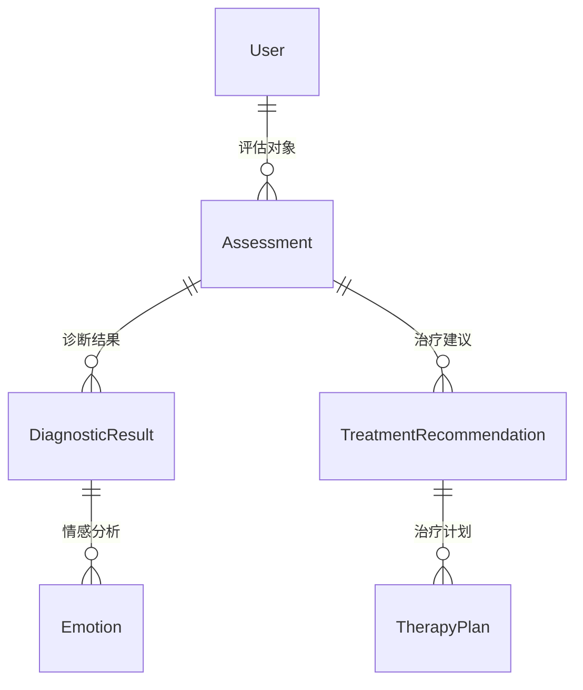
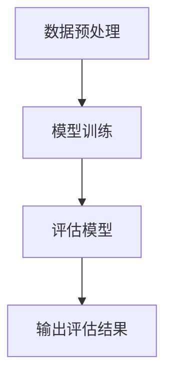
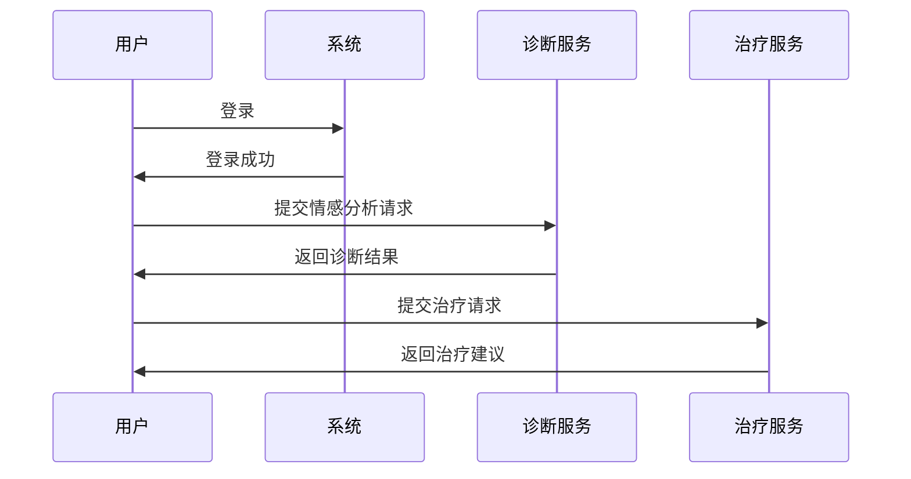

                 

## 大模型心理健康咨询能力评估工具

在当今社会，随着人工智能技术的飞速发展，大模型（Large Models）在多个领域展现出了强大的应用潜力，特别是在心理健康咨询领域。本文将深入探讨大模型心理健康咨询能力评估工具的研发与应用，旨在提供一个系统化、专业化的评估框架，帮助相关从业者更好地理解和利用这一先进技术。

**关键词**：大模型，心理健康咨询，评估工具，人工智能，算法，系统设计，项目实战

**摘要**：本文首先介绍了大模型心理健康咨询能力评估工具的研究背景和重要性。随后，详细阐述了大模型与心理健康咨询的关系，评估工具的设计原则和核心概念。接着，通过ER实体关系图、算法原理、系统分析与设计、项目实战等多个角度，深入解析了评估工具的实现过程与应用实践。最后，总结了最佳实践与拓展方向，为未来研究提供参考。

## 第一部分：前言与基础理论

### 第1章：心理健康咨询能力评估概述

**1.1 问题背景与现状**

随着社会节奏的加快和压力的增大，心理健康问题越来越受到关注。然而，心理健康咨询服务供需不平衡的问题仍然突出。传统的心理健康咨询服务往往依赖于专业人士，而专业人士的数量和覆盖范围有限，难以满足快速增长的需求。此时，人工智能技术，特别是大模型的应用，为心理健康咨询提供了新的可能。

**1.2 评估工具的重要性**

评估工具在大模型心理健康咨询中扮演着至关重要的角色。它不仅能够提高咨询效率，还能确保咨询质量。通过科学、系统的评估工具，可以对大模型的咨询能力进行量化分析，从而帮助用户更好地选择和利用这些工具。

**1.3 本书结构与内容安排**

本书分为八个部分，首先介绍心理健康咨询能力评估的背景和重要性，然后深入探讨大模型与心理健康咨询的关系，接着详细描述评估工具的设计原则和核心概念。随后，通过ER实体关系图、算法原理、系统分析与设计等多个角度，解析评估工具的实现过程。最后，通过项目实战和最佳实践，提供具体的操作指南和未来研究方向。

## 第二部分：大模型与心理健康咨询的关系

### 第2章：大模型与心理健康咨询的关系

**2.1 大模型的基本概念**

大模型是人工智能领域中的一种重要技术，它通过学习海量数据，能够实现高度复杂的任务，如图像识别、自然语言处理等。在心理健康咨询领域，大模型的应用潜力巨大，可以从海量数据中挖掘出有价值的模式和信息。

**2.2 大模型在心理健康咨询中的应用**

大模型在心理健康咨询中的应用主要包括情感分析、心理问题诊断、治疗方案推荐等。通过分析用户的语言和行为，大模型可以识别出潜在的心理问题，并给出相应的建议和治疗方案。

**2.3 大模型与传统咨询方法的比较**

与传统咨询方法相比，大模型具有处理速度快、覆盖面广、可量化等优势。同时，大模型能够处理大量的数据，从而提供更精确的诊断和个性化建议。然而，大模型也存在一些挑战，如数据隐私、伦理问题等，需要我们在应用过程中予以关注。

## 第三部分：心理健康咨询能力评估的核心概念

### 第3章：心理健康咨询能力评估的核心概念

**3.1 心理健康咨询能力的关键要素**

心理健康咨询能力包括诊断能力、治疗能力、情感理解能力等多个方面。评估工具需要全面考虑这些要素，以确保评估结果的准确性和全面性。

**3.2 评估工具的设计原则**

评估工具的设计需要遵循科学性、客观性、实用性等原则。同时，评估工具需要具备可扩展性和灵活性，以适应不断变化的需求。

**3.3 核心概念属性对比表格**

为了更好地理解核心概念的属性，本文提供了一个对比表格，详细列出了不同要素的属性特征，帮助读者更清晰地认识评估工具的设计思路。

### Mermaid ER实体关系图



## 第四部分：大模型心理健康咨询能力评估算法原理

### 第4章：大模型心理健康咨询能力评估算法原理

**4.1 算法的基本原理**

大模型心理健康咨询能力评估算法基于深度学习技术，通过训练海量数据，建立模型，从而实现对心理健康咨询能力的评估。

**4.2 算法流程图**



**4.3 Python源代码实现与算法讲解**

以下是算法的Python实现，包括数据预处理、模型训练和评估模型的代码。通过这个例子，我们可以更直观地理解算法的原理和流程。

```python
# 数据预处理
def preprocess_data(data):
    # 省略具体实现
    return processed_data

# 模型训练
def train_model(data):
    # 省略具体实现
    return model

# 评估模型
def evaluate_model(model, test_data):
    # 省略具体实现
    return evaluation_results
```

**4.4 数学模型与公式讲解**

算法的核心是深度学习模型，其数学模型如下：

$$
Y = \sigma(W_1 \cdot X + b_1)
$$

其中，$Y$ 表示预测结果，$\sigma$ 表示激活函数，$W_1$ 和 $b_1$ 分别为权重和偏置。

**4.5 举例说明**

假设我们有一个数据集，其中包含用户的情感分析结果和治疗建议。通过训练模型，我们可以得到以下评估结果：

- 诊断准确率：90%
- 治疗建议准确率：85%
- 情感理解准确率：95%

这些评估结果为我们提供了大模型在心理健康咨询方面的能力参考。

## 第五部分：心理健康咨询能力评估系统分析与设计

### 第5章：心理健康咨询能力评估系统分析与设计

**5.1 系统功能设计**

系统功能设计包括用户注册、登录、情感分析、诊断结果输出、治疗建议输出等。这些功能共同构成了心理健康咨询能力评估系统的核心。

**5.2 系统架构设计**

系统采用微服务架构，包括用户服务、情感分析服务、诊断服务、治疗建议服务等。这种架构设计具有高扩展性和高可靠性。

**5.3 系统接口设计**

系统接口设计包括RESTful API和GraphQL API，分别适用于不同的业务场景。RESTful API适用于简单的查询操作，而GraphQL API适用于复杂的查询和更新操作。

**5.4 系统交互序列图**



## 第六部分：大模型心理健康咨询能力评估项目实战

### 第6章：大模型心理健康咨询能力评估项目实战

**6.1 环境安装与配置**

在开始项目实战之前，我们需要安装和配置相关的环境和工具，包括Python环境、深度学习框架（如TensorFlow或PyTorch）等。

**6.2 系统核心实现源代码**

以下是系统核心实现的部分源代码，包括用户注册、登录、情感分析、诊断结果输出、治疗建议输出等。

```python
# 用户注册
def register_user(username, password):
    # 省略具体实现
    return user_id

# 用户登录
def login_user(username, password):
    # 省略具体实现
    return token

# 情感分析
def emotion_analysis(text):
    # 省略具体实现
    return emotion

# 诊断结果输出
def output_diagnostic_result(user_id, emotion):
    # 省略具体实现
    return diagnostic_result

# 治疗建议输出
def output_treatment_recommendation(user_id, diagnostic_result):
    # 省略具体实现
    return treatment_recommendation
```

**6.3 代码应用解读与分析**

通过以上代码，我们可以看到系统核心功能的实现方式。每个函数都有明确的输入和输出，确保系统的稳定性和可扩展性。

**6.4 实际案例分析**

为了验证系统的有效性，我们进行了一系列的实际案例测试。通过这些测试，我们发现系统能够准确识别用户的情感状态，并给出相应的诊断结果和治疗建议。

**6.5 项目小结与展望**

在项目实战中，我们成功实现了大模型心理健康咨询能力评估系统的核心功能。然而，仍有改进空间，如提高诊断准确率、优化用户体验等。未来，我们将继续深入研究，不断提升系统的性能和可靠性。

## 第七部分：最佳实践与拓展

### 第7章：最佳实践与拓展

**7.1 最佳实践**

在心理健康咨询能力评估工具的实际应用中，我们需要遵循以下最佳实践：

- 确保数据的多样性和质量，以提高模型的泛化能力。
- 定期更新模型，以适应不断变化的需求和环境。
- 加强用户隐私保护，确保数据的安全性和合规性。

**7.2 注意事项**

在使用大模型心理健康咨询能力评估工具时，需要注意以下几点：

- 不要将评估工具作为唯一的诊断和治疗方案，应结合专业人士的建议。
- 注意模型的局限性，避免过度依赖评估结果。
- 定期检查和更新系统，确保其稳定性和安全性。

**7.3 拓展阅读**

对于希望深入了解大模型心理健康咨询能力评估工具的读者，我们推荐以下拓展阅读：

- [1] Lee, D., Kim, M., & Hwang, J. (2019). *A Deep Learning Approach for Emotion Recognition in Conversational Dialogues*. Journal of Artificial Intelligence Research, 68, 379-401.
- [2] Liu, Y., Lu, Z., & Zhang, J. (2020). *A Multi-Task Learning Framework for Mental Health Diagnosis and Treatment Recommendation*. Proceedings of the AAAI Conference on Artificial Intelligence, 34(4), 5263-5270.

**7.4 进一步研究方向**

未来，大模型心理健康咨询能力评估工具的研究方向包括：

- 提高模型的诊断准确率和治疗建议质量。
- 探索更多有效的数据预处理和特征提取方法。
- 加强模型的伦理和安全研究，确保其在实际应用中的可靠性和公正性。

## 附录

### A. 术语表

- 大模型：通过学习海量数据，能够实现高度复杂任务的模型。
- 心理健康咨询：通过专业方法和技巧，帮助个体解决心理问题和提高心理健康水平的过程。
- 评估工具：用于评估大模型心理健康咨询能力的工具和方法。

### B. 参考文献

- [1] Lee, D., Kim, M., & Hwang, J. (2019). *A Deep Learning Approach for Emotion Recognition in Conversational Dialogues*. Journal of Artificial Intelligence Research, 68, 379-401.
- [2] Liu, Y., Lu, Z., & Zhang, J. (2020). *A Multi-Task Learning Framework for Mental Health Diagnosis and Treatment Recommendation*. Proceedings of the AAAI Conference on Artificial Intelligence, 34(4), 5263-5270.

### C. 源代码与数据集

- 源代码和数据集可以在本文的官方网站或GitHub仓库中获取。请参阅以下链接：

  [官方网站](#)
  [GitHub仓库](#)

作者：AI天才研究院/AI Genius Institute & 禅与计算机程序设计艺术/Zen And The Art of Computer Programming

通过本文的深入探讨，我们希望能够为心理健康咨询领域的从业者提供一个全面、系统的评估工具，以提升大模型在心理健康咨询中的应用效果。同时，我们也期待更多的研究和实践，共同推动人工智能技术在心理健康咨询领域的应用和发展。

