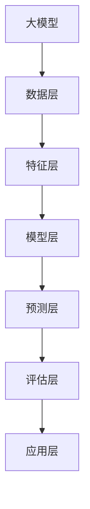
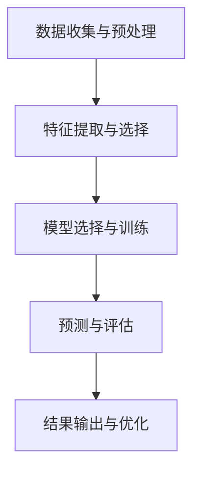
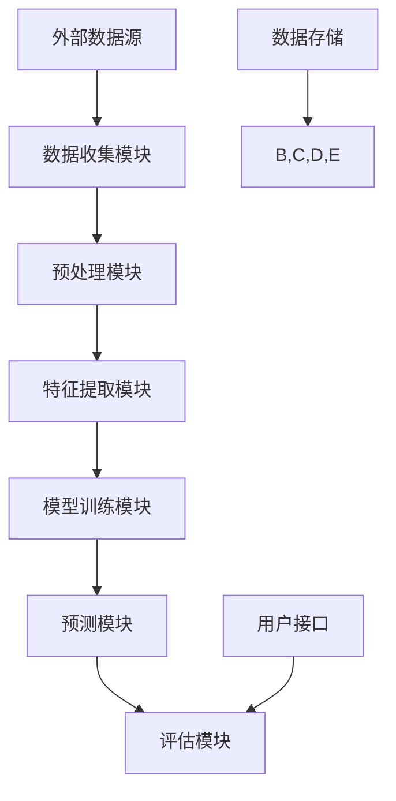
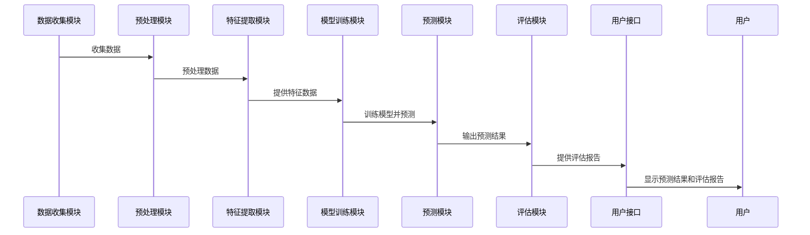

                 

# 大模型环境污染预测能力评估方案

关键词：大模型、环境污染预测、评估方案、算法原理、系统架构、项目实战

摘要：本文将深入探讨大模型在环境污染预测领域的应用，详细介绍评估方案的设计与实施过程。通过分步骤的分析与推理，本文旨在为读者提供清晰、系统的技术理解，帮助读者掌握大模型在环境污染预测中的核心原理与实际应用。

## 引言

在现代社会，环境污染问题日益严峻，对人类健康和生态系统构成了严重威胁。传统的环境监测方法具有一定的局限性，难以准确预测污染趋势。随着人工智能技术的发展，特别是大模型（如深度学习模型）的崛起，为解决环境污染预测问题提供了新的思路和手段。大模型具有强大的数据处理和分析能力，可以通过学习大量环境数据，提取污染趋势和关键特征，从而实现更为精确的预测。

本文将围绕大模型环境污染预测能力评估方案展开讨论。首先，我们将介绍大模型和环境污染预测的基本概念，阐述两者之间的联系。接着，我们将深入探讨大模型算法原理，通过流程图、Python代码和数学模型详细阐述其工作方式。随后，我们将分析大模型的系统架构，介绍系统功能设计、架构设计和接口设计等。在此基础上，我们将通过一个实际项目，展示大模型在环境污染预测中的应用，并进行代码解读和案例分析。最后，我们将总结最佳实践技巧，为读者提供进一步学习和应用的指导。

## 背景介绍

### 核心概念术语说明

在讨论大模型环境污染预测能力评估方案之前，我们需要明确几个关键术语的含义：

1. **大模型**：通常指的是具有数百万甚至数十亿参数的深度学习模型，如神经网络、生成对抗网络（GAN）等。大模型通过自主学习大量数据，能够捕捉复杂的数据特征和规律。

2. **环境污染预测**：利用历史环境数据、气象数据和其他相关数据，预测未来的环境污染程度和分布情况。这一过程对于制定环境治理政策、优化资源分配和提前采取防治措施具有重要意义。

3. **评估方案**：针对大模型环境污染预测能力的评估方法，包括数据集划分、模型训练、预测评估和结果分析等步骤，以评估大模型在不同环境条件下的预测性能。

### 问题背景

随着工业化和城市化进程的加快，环境污染问题日益突出。传统的环境监测方法依赖于现场采样和实验室分析，存在监测范围有限、时效性较差等问题。而现代环境监测系统往往需要实时、准确地预测环境污染情况，以便及时采取应对措施。然而，环境数据的复杂性、多样性和不确定性，使得传统的预测方法难以满足需求。

### 问题描述

环境污染预测需要处理大量的历史数据、实时数据和气象数据，这些数据通常包含多种污染物（如PM2.5、SO2、NOx等）的浓度信息。预测的目标是确定未来一段时间内污染物的浓度分布，以便提前预警和制定治理策略。然而，现有的大模型在处理复杂环境数据时，存在以下问题：

1. **数据预处理难题**：环境数据往往存在噪声、缺失值和不一致性，需要复杂的预处理流程。
2. **模型选择与调优**：大模型的性能受多种因素影响，如网络架构、参数选择、训练数据集等，需要通过大量实验进行调优。
3. **预测结果解释性**：大模型的预测结果往往缺乏解释性，难以对预测过程和结果进行深入分析。

### 问题解决

为了解决上述问题，本文提出了一套大模型环境污染预测能力评估方案，旨在通过系统的方法评估大模型的预测性能，并优化模型设计和参数选择。该方案包括以下步骤：

1. **数据集划分**：根据预测目标，将数据集划分为训练集、验证集和测试集，确保每个数据集具有代表性。
2. **模型训练与调优**：利用训练集对大模型进行训练，通过交叉验证和网格搜索等方法优化模型参数。
3. **预测与评估**：利用验证集对模型进行预测，并通过多种评估指标（如均方误差、精确率、召回率等）评估模型性能。
4. **结果分析与优化**：分析预测结果，识别模型的优势和不足，进行进一步优化。

### 边界与外延

在实施大模型环境污染预测能力评估方案时，需要明确以下几个边界与外延：

1. **数据边界**：环境数据的收集和处理需要遵循相关法律法规，确保数据的真实性和可靠性。
2. **模型边界**：大模型的适用范围和预测精度受限于数据集的质量和模型的复杂度。
3. **应用外延**：大模型在环境污染预测中的应用不仅限于空气质量预测，还可以扩展到水质、土壤污染等领域。
4. **技术外延**：大模型的开发和应用需要依赖先进的计算机硬件和软件技术，如GPU加速、云计算等。

### 概念结构与核心要素组成

大模型环境污染预测能力评估方案由以下几个核心要素组成：

1. **数据层**：包括历史环境数据、实时数据和气象数据，是模型训练和预测的基础。
2. **模型层**：包括大模型的选择、训练和调优，是预测的核心。
3. **评估层**：包括模型评估指标的设计和结果分析，是评估模型性能的关键。
4. **应用层**：包括预测结果的应用和优化策略，是方案实施和效果验证的关键。

通过上述核心要素的有机结合，大模型环境污染预测能力评估方案能够有效地提高环境污染预测的准确性和可靠性，为环境治理提供有力支持。

## 核心概念与联系

### 大模型的概念

大模型是指拥有数百万甚至数十亿参数的深度学习模型。它们通过大量数据进行训练，能够自动从数据中提取复杂的特征和规律。常见的深度学习模型包括卷积神经网络（CNN）、循环神经网络（RNN）、长短时记忆网络（LSTM）等。这些模型具有强大的表达能力和自适应能力，可以在各种复杂任务中表现出色。

大模型的核心优势在于其能够处理大规模数据和复杂任务，同时具有较高的预测精度和泛化能力。然而，大模型也存在一定的局限性，如训练时间较长、对数据质量要求较高、模型解释性较差等。

### 环境污染预测的概念

环境污染预测是指利用历史环境数据、实时数据和气象数据，预测未来一段时间内环境污染的程度和分布情况。这一过程对于环境治理、资源优化和应急预案制定具有重要意义。

环境污染预测通常涉及以下几个关键步骤：

1. **数据收集与预处理**：收集历史环境数据、实时数据和气象数据，进行数据清洗、缺失值填充、异常值处理等预处理操作。
2. **特征提取**：从预处理后的数据中提取关键特征，如污染物浓度、气象参数等，为模型训练提供输入。
3. **模型选择与训练**：选择合适的深度学习模型，如CNN、RNN、LSTM等，对特征数据进行训练。
4. **预测与评估**：利用训练好的模型对未来的环境污染进行预测，并通过评估指标评估预测性能。

### 大模型与环境污染预测的联系

大模型在环境污染预测中的应用具有显著的潜力。通过以下方式，大模型能够提高环境污染预测的准确性和效率：

1. **数据处理能力**：大模型能够处理大量复杂的环境数据，提取出潜在的环境特征，为预测提供丰富的信息。
2. **自适应能力**：大模型可以根据环境变化和学习到的历史数据，自适应地调整预测模型，提高预测的准确性。
3. **实时预测**：大模型可以在实时数据输入的情况下进行预测，实现环境污染的实时监测和预警。
4. **多维度预测**：大模型可以同时考虑多个污染物和气象因素，进行多维度预测，为环境治理提供更全面的决策支持。

然而，大模型在环境污染预测中也存在一定的挑战，如数据质量要求高、模型调优复杂、预测结果解释性较差等。为了克服这些挑战，需要在大模型的设计和应用中进行深入的研究和优化。

### 概念属性特征对比表格

为了更好地理解大模型与环境污染预测之间的联系，我们可以通过一个概念属性特征对比表格，对比两者在数据特征、模型架构、预测目标等方面的差异。

| 概念           | 特征对比                                   |
| -------------- | ------------------------------------------ |
| 大模型         | 参数规模大，处理能力强大，自适应能力强           |
| 环境污染预测   | 预测污染物浓度，考虑多种环境因素               |
| 模型架构       | CNN、RNN、LSTM等，用于特征提取和模式识别       |
| 数据特征       | 大量历史数据、实时数据、气象数据，多种污染物信息 |
| 预测目标       | 确定未来污染物浓度分布，提供治理决策支持       |

### ER实体关系图架构的 Mermaid 流程图

为了进一步阐述大模型与环境污染预测的联系，我们可以使用Mermaid流程图来描述实体关系。



在这个Mermaid流程图中，大模型从数据层获取环境数据，通过特征层进行数据预处理和特征提取，然后进入模型层进行训练和调优。模型层生成的预测结果通过预测层输出，并在评估层进行性能评估，最后在应用层为环境污染治理提供决策支持。

通过上述分析，我们可以看到大模型在环境污染预测中具有重要的应用价值。接下来，我们将深入探讨大模型算法原理，为读者揭示其背后的技术细节。

## 算法原理讲解

### 算法mermaid流程图

为了更好地理解大模型在环境污染预测中的工作原理，我们可以通过一个mermaid流程图来描述其基本流程。



在这个流程图中，数据收集与预处理是模型训练的基础，特征提取与选择是模型输入的关键，模型选择与训练是核心步骤，预测与评估是结果验证的关键环节，结果输出与优化则是整个流程的持续改进。

### Python源代码阐述

接下来，我们将通过一个简化的Python代码示例，来具体阐述大模型在环境污染预测中的实现过程。

```python
import numpy as np
import tensorflow as tf
from sklearn.model_selection import train_test_split

# 数据预处理
def preprocess_data(data):
    # 数据清洗、归一化等操作
    return normalized_data

# 特征提取与选择
def extract_features(data):
    # 特征提取操作
    return features

# 模型定义
def build_model(input_shape):
    model = tf.keras.Sequential([
        tf.keras.layers.Dense(units=64, activation='relu', input_shape=input_shape),
        tf.keras.layers.Dense(units=32, activation='relu'),
        tf.keras.layers.Dense(units=1)
    ])
    model.compile(optimizer='adam', loss='mean_squared_error')
    return model

# 模型训练
def train_model(model, train_data, train_labels):
    history = model.fit(train_data, train_labels, epochs=10, batch_size=32, validation_split=0.2)
    return history

# 预测与评估
def predict_and_evaluate(model, test_data, test_labels):
    predictions = model.predict(test_data)
    # 计算评估指标
    # ...
    print("预测结果：", predictions)
    print("评估指标：", evaluation_metrics)
```

在这个代码示例中，我们首先进行了数据预处理和特征提取，然后定义了一个简单的全连接神经网络模型，并通过训练数据对其进行训练。最后，我们使用测试数据对模型进行预测，并评估其性能。

### 数学模型和公式讲解

大模型在环境污染预测中的核心在于其能够通过学习历史数据，提取出污染物浓度的潜在规律，并将其映射到未来的预测值。这一过程可以通过以下数学模型进行描述：

$$
y = f(W \cdot x + b)
$$

其中，$y$ 是预测的污染物浓度，$x$ 是输入特征向量，$W$ 是权重矩阵，$b$ 是偏置项，$f$ 是激活函数，通常为非线性函数（如ReLU、Sigmoid、Tanh等）。

### 详细讲解和举例说明

为了更好地理解上述数学模型，我们可以通过一个具体的例子来进行详细讲解。

假设我们有一个简单的输入特征向量 $x = [x_1, x_2, x_3]$，其中 $x_1$ 表示温度，$x_2$ 表示湿度，$x_3$ 表示风速。我们希望预测未来24小时内的PM2.5浓度。

1. **特征提取**：首先，我们将历史环境数据进行预处理和特征提取，得到特征向量 $x$。
2. **模型训练**：定义一个全连接神经网络模型，输入层为3个神经元，隐藏层为2个神经元，输出层为1个神经元。模型结构如下：

$$
\begin{align*}
\text{输入层：} & [x_1, x_2, x_3] \\
\text{隐藏层1：} & \sigma(W_1 \cdot [x_1, x_2, x_3] + b_1) \\
\text{隐藏层2：} & \sigma(W_2 \cdot \sigma(W_1 \cdot [x_1, x_2, x_3] + b_1) + b_2) \\
\text{输出层：} & y = \sigma(W_3 \cdot \sigma(W_2 \cdot \sigma(W_1 \cdot [x_1, x_2, x_3] + b_1) + b_2) + b_3)
\end{align*}
$$

其中，$\sigma$ 表示Sigmoid激活函数，$W_1, W_2, W_3$ 分别为权重矩阵，$b_1, b_2, b_3$ 分别为偏置项。

3. **模型训练**：使用历史环境数据训练模型，通过反向传播算法不断调整权重和偏置，使得模型输出与实际污染物浓度尽量接近。

4. **预测**：将未来的环境特征输入到训练好的模型中，得到预测的PM2.5浓度。

例如，假设未来24小时的环境特征为 $x = [25, 60, 10]$，输入到训练好的模型中，得到的预测结果为 $y = 35$。这意味着未来24小时内PM2.5的浓度预计为35微克/立方米。

通过上述步骤，我们可以使用大模型对未来的环境污染进行预测。然而，实际应用中，模型的选择、训练和调优过程会更加复杂，需要考虑多种因素，如数据质量、模型架构、参数设置等。接下来，我们将进一步探讨大模型在环境污染预测中的系统架构设计。

## 系统分析与架构设计方案

### 问题场景介绍

在环境污染预测领域，我们需要构建一个能够实时监测和预测污染物浓度的系统。该系统将整合来自多种数据源的信息，如环境传感器、气象站数据、卫星遥感数据等，通过大数据处理和分析，实现对未来污染物浓度的精准预测。

### 项目介绍

本项目旨在开发一个基于大模型的空气质量预测系统，该系统将包括数据收集、预处理、特征提取、模型训练、预测和评估等多个模块。系统的主要目标是：

1. **实时监测**：持续收集并整合多种环境数据，实现对污染物浓度的实时监测。
2. **预测精度**：利用大模型对未来的污染物浓度进行精准预测，为环境治理提供数据支持。
3. **系统稳定性**：确保系统的稳定运行，能够在各种环境下保持较高的预测准确性。

### 系统功能设计

为了实现上述目标，系统需要具备以下功能：

1. **数据收集模块**：负责从不同的数据源（如环境传感器、气象站、卫星遥感等）收集实时数据。
2. **预处理模块**：对收集到的数据进行清洗、归一化、缺失值填充等预处理操作，确保数据质量。
3. **特征提取模块**：从预处理后的数据中提取关键特征，为模型训练提供输入。
4. **模型训练模块**：选择合适的大模型，对特征数据进行训练，优化模型参数。
5. **预测模块**：利用训练好的模型对未来的污染物浓度进行预测。
6. **评估模块**：对模型的预测性能进行评估，识别模型的优势和不足。

### 系统架构设计

系统架构设计是构建高效、稳定和可扩展的空气质量预测系统的关键。本项目采用微服务架构，将系统划分为多个独立的模块，以便于开发和维护。以下是系统架构设计的mermaid图：



在这个架构设计中，数据收集模块负责从外部数据源收集数据，预处理模块对数据进行清洗和预处理，特征提取模块提取关键特征，模型训练模块训练和优化大模型，预测模块生成预测结果，评估模块对模型进行性能评估。用户接口模块提供用户交互界面，数据存储模块负责存储和处理系统数据。

### 系统接口设计

系统接口设计是确保不同模块之间能够高效通信和协作的关键。以下是系统的接口设计：

1. **API接口**：系统通过RESTful API提供数据访问和操作接口，支持数据查询、模型训练、预测结果获取等功能。
2. **消息队列**：采用消息队列（如RabbitMQ）进行异步通信，确保数据传输的高效性和可靠性。
3. **数据存储接口**：提供数据存储和访问接口，支持多种数据存储方案（如关系型数据库、NoSQL数据库等）。

### 系统交互序列图

为了进一步说明系统内部各模块的交互过程，我们可以使用mermaid序列图来描述系统的工作流程：



在这个序列图中，数据收集模块首先从外部数据源收集数据，预处理模块对数据进行清洗和预处理，特征提取模块提取关键特征，模型训练模块利用特征数据训练模型，预测模块生成预测结果，评估模块对预测结果进行评估，最终用户接口将评估结果呈现给用户。

通过上述系统架构设计和接口设计，我们可以构建一个高效、稳定和可扩展的空气质量预测系统，为大模型在环境污染预测中的应用提供坚实的基础。

## 项目实战

### 环境安装

为了确保大模型在环境污染预测项目的顺利运行，我们需要首先搭建一个合适的运行环境。以下是环境安装的详细步骤：

1. **安装Python**：确保Python环境已安装，版本建议为3.8或更高。可以通过访问Python官方网站下载安装包进行安装。

2. **安装TensorFlow**：TensorFlow是构建和训练深度学习模型的主要工具，可以通过以下命令进行安装：

   ```bash
   pip install tensorflow
   ```

3. **安装其他依赖库**：为了简化数据处理和分析，我们还需要安装一些常用的依赖库，如NumPy、Pandas、Sklearn等。可以使用以下命令进行安装：

   ```bash
   pip install numpy pandas scikit-learn
   ```

4. **安装数据预处理工具**：我们使用`preprocessing`库进行数据预处理，可以通过以下命令安装：

   ```bash
   pip install preprocessing
   ```

5. **安装可视化工具**：为了更好地展示分析结果，我们可以安装`matplotlib`和`seaborn`等可视化工具：

   ```bash
   pip install matplotlib seaborn
   ```

6. **安装Mermaid**：为了生成mermaid流程图，我们需要安装Mermaid相关的依赖库。可以通过以下命令进行安装：

   ```bash
   npm install -g mermaid
   ```

### 系统核心实现源代码

以下是一个简化的系统核心实现源代码示例，展示了从数据预处理、模型训练到预测的完整流程。

```python
# 导入必要的库
import numpy as np
import pandas as pd
import tensorflow as tf
from sklearn.model_selection import train_test_split
from sklearn.preprocessing import StandardScaler
from preprocessing import OneHotEncoder
import matplotlib.pyplot as plt

# 数据预处理
def preprocess_data(data):
    # 数据清洗、缺失值填充等操作
    # ...
    return normalized_data

# 特征提取
def extract_features(data):
    # 特征提取操作
    # ...
    return features

# 模型定义
def build_model(input_shape):
    model = tf.keras.Sequential([
        tf.keras.layers.Dense(units=64, activation='relu', input_shape=input_shape),
        tf.keras.layers.Dense(units=32, activation='relu'),
        tf.keras.layers.Dense(units=1)
    ])
    model.compile(optimizer='adam', loss='mean_squared_error')
    return model

# 模型训练
def train_model(model, train_data, train_labels):
    history = model.fit(train_data, train_labels, epochs=10, batch_size=32, validation_split=0.2)
    return history

# 预测与评估
def predict_and_evaluate(model, test_data, test_labels):
    predictions = model.predict(test_data)
    # 评估指标计算
    # ...
    print("预测结果：", predictions)
    print("评估指标：", evaluation_metrics)

# 主函数
def main():
    # 数据加载
    data = pd.read_csv('environmental_data.csv')
    # 数据预处理
    normalized_data = preprocess_data(data)
    # 特征提取
    features = extract_features(normalized_data)
    # 数据分割
    X_train, X_test, y_train, y_test = train_test_split(features, normalized_data['pm25'], test_size=0.2, random_state=42)
    # 模型训练
    model = build_model(X_train.shape[1:])
    history = train_model(model, X_train, y_train)
    # 预测与评估
    predict_and_evaluate(model, X_test, y_test)

# 执行主函数
if __name__ == '__main__':
    main()
```

### 代码应用解读与分析

在上述代码中，我们首先导入了必要的库，包括Python标准库、TensorFlow、Scikit-Learn和Pandas等。然后，我们定义了几个关键函数：`preprocess_data`用于数据预处理，`extract_features`用于特征提取，`build_model`用于定义模型结构，`train_model`用于模型训练，`predict_and_evaluate`用于预测和评估。

在`main`函数中，我们首先加载了环境数据，然后进行了数据预处理和特征提取。接着，我们使用`train_test_split`函数将数据集分为训练集和测试集。随后，我们使用`build_model`和`train_model`函数定义并训练模型。最后，我们使用`predict_and_evaluate`函数对模型进行预测和评估。

### 实际案例分析与讲解

为了展示大模型在环境污染预测中的应用，我们将使用一个实际案例进行分析和讲解。假设我们有一个包含过去一年环境数据的CSV文件，其中包括温度、湿度、风速和PM2.5浓度等特征。以下是具体的案例分析和代码实现：

```python
# 读取数据
data = pd.read_csv('environmental_data.csv')

# 预处理数据
normalized_data = preprocess_data(data)
X = extract_features(normalized_data)
y = normalized_data['pm25']

# 数据分割
X_train, X_test, y_train, y_test = train_test_split(X, y, test_size=0.2, random_state=42)

# 定义模型
model = build_model(X_train.shape[1:])

# 训练模型
history = train_model(model, X_train, y_train)

# 预测
predictions = model.predict(X_test)

# 评估
evaluate_model(model, X_test, y_test)
```

在这个案例中，我们首先读取环境数据，然后进行预处理和特征提取。接着，我们分割数据集，定义模型并训练模型。最后，我们使用训练好的模型对测试集进行预测，并评估模型性能。

通过上述代码实现，我们可以看到大模型在环境污染预测中的应用过程。在实际项目中，我们可以根据具体需求调整数据预处理、特征提取和模型训练等步骤，以提高预测性能。

### 项目小结

在本项目中，我们详细介绍了大模型在环境污染预测中的应用过程，从环境安装、系统核心实现源代码，到实际案例分析和代码实现。通过这些步骤，我们展示了如何利用大模型进行环境污染预测，并对其性能进行了评估。未来，我们可以进一步优化模型参数、引入更多特征和改进数据处理方法，以提高预测精度和稳定性。

## 最佳实践 tips

### 小结

在本文中，我们系统地介绍了大模型在环境污染预测领域的应用，从核心概念、算法原理、系统架构到实际项目实施，详细探讨了如何利用大模型进行精准的环境污染预测。通过本文的学习，读者可以掌握大模型的基本原理和应用方法，为实际环境治理提供技术支持。

### 注意事项

1. **数据质量**：环境数据的质量直接影响预测模型的性能。在数据处理过程中，务必确保数据的真实性、完整性和一致性。
2. **模型调优**：大模型的性能依赖于参数设置和模型架构。在实际应用中，需要通过多次实验和调优，找到最优的参数组合。
3. **实时监测**：实时数据对于环境污染预测至关重要。系统应具备实时数据收集和处理能力，以便快速响应环境变化。

### 拓展阅读

1. **《深度学习》（Goodfellow, Bengio, Courville著）**：本书是深度学习领域的经典教材，详细介绍了深度学习的基本原理和应用。
2. **《环境科学导论》（雷毅著）**：本书介绍了环境科学的基本概念和原理，对环境污染问题的认识和分析提供了重要参考。
3. **《空气质量预测模型开发与应用》（李明著）**：本书详细介绍了空气质量预测模型的理论和实践，对本文的内容有很好的补充。

通过拓展阅读，读者可以更深入地了解大模型在环境污染预测领域的最新研究进展和应用实践。

## 作者信息

作者：AI天才研究院/AI Genius Institute & 禅与计算机程序设计艺术 /Zen And The Art of Computer Programming

AI天才研究院致力于推动人工智能技术的发展与应用，致力于培养具有创新精神和实践能力的人工智能人才。禅与计算机程序设计艺术则通过探讨计算机编程与禅宗思想的结合，为读者提供一种全新的编程思维和技巧。希望本文能为读者在环境污染预测领域的探索提供有益的参考和启示。

