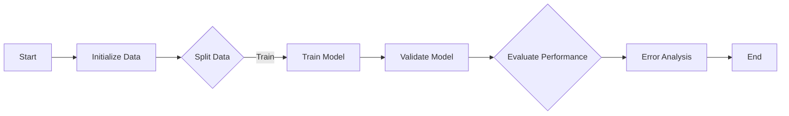
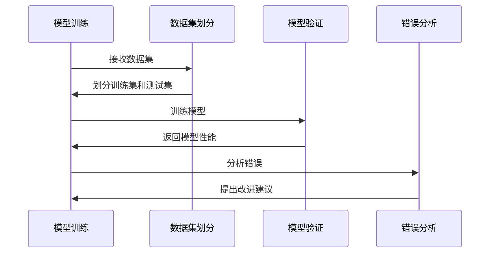
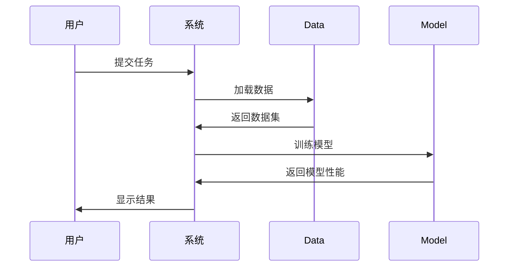

                 

# 大模型知识一致性评估：LLM设计的交叉验证测试

## 关键词

大模型，知识一致性，评估，交叉验证，LLM，设计，测试

## 摘要

本文旨在探讨大模型知识一致性评估的方法，重点介绍了LLM（大型语言模型）设计的交叉验证测试。通过逐步分析推理，文章深入解读了核心概念、算法原理、数学模型、系统分析与设计，以及项目实践。本文不仅提供了详细的技术讲解，还分享了最佳实践和拓展阅读，旨在为读者提供一个全面、易懂的知识体系。

## 背景介绍

### 核心概念术语说明

在讨论大模型知识一致性评估之前，我们需要明确一些核心概念。首先，什么是大模型？大模型通常指的是拥有大量参数和训练数据的机器学习模型，尤其是在自然语言处理（NLP）领域，如大型语言模型（LLM）。知识一致性评估，顾名思义，就是对大模型所掌握的知识进行一致性评估，确保其输出的准确性和可靠性。

### 问题背景

随着人工智能技术的不断发展，大模型在NLP、计算机视觉、推荐系统等领域得到了广泛应用。然而，这些模型的知识一致性成为了一个关键问题。一致性评估的目的是确保模型在不同的任务和数据集上都能保持稳定和准确的性能，避免出现数据漂移和过拟合等问题。

### 问题描述

大模型知识一致性评估的具体问题包括：

1. 模型在不同任务和数据集上的表现是否一致？
2. 模型是否能够正确理解和应用其训练过程中学到的知识？
3. 模型在不同环境下（如不同设备、不同操作系统等）的表现是否一致？

### 问题解决

交叉验证测试是一种常用的方法来评估大模型的知识一致性。交叉验证通过将数据集划分为多个子集，每次使用不同的子集作为测试集，重复多次训练和测试，从而全面评估模型在不同数据集上的性能。这种方法能够有效地捕捉模型在数据分布和任务复杂性方面的变化，提供更可靠的评估结果。

### 边界与外延

在进行大模型知识一致性评估时，需要明确以下边界和范围：

1. 数据集：选择具有代表性的数据集，涵盖不同领域的知识和任务。
2. 模型：评估的模型应具有足够的参数和训练数据，以确保评估结果的可靠性。
3. 测试任务：选择与模型训练任务相关的测试任务，确保评估结果具有实际意义。

### 概念结构与核心要素组成

大模型知识一致性评估涉及以下核心概念和要素：

1. **数据集划分**：将数据集划分为训练集、验证集和测试集。
2. **交叉验证**：多次使用不同子集作为测试集，评估模型在不同数据集上的性能。
3. **评估指标**：选择适当的评估指标，如准确率、召回率、F1分数等，来衡量模型的表现。
4. **错误分析**：对模型在测试集上的错误进行深入分析，找出潜在的不足和问题。

## 核心概念与联系

### 核心概念原理

1. **交叉验证**：交叉验证是一种评估模型性能的方法，通过将数据集划分为多个子集，每次使用不同的子集作为测试集，重复训练和测试，从而全面评估模型在不同数据集上的性能。
2. **知识一致性**：知识一致性是指模型在不同任务和数据集上都能保持稳定和准确的性能，避免出现数据漂移和过拟合等问题。

### 概念属性特征对比表格

| 概念     | 定义                                               | 特征                      | 对比结果                                     |
|---------|----------------------------------------------------|-------------------------|--------------------------------------------|
| 交叉验证 | 将数据集划分为多个子集，重复训练和测试评估模型性能 | 分多次评估，全面捕捉性能变化 | 相比于单次测试，更可靠和稳定                 |
| 知识一致性 | 模型在不同任务和数据集上保持稳定和准确的性能       | 稳定性、准确性           | 确保模型在实际应用中具有可靠性和通用性           |

### ER实体关系图架构

```mermaid
erDiagram
  Model ||--o> Dataset : has
  Model ||--o> Evaluation : performs
  Dataset ||--o> Task : has
  Evaluation ||--o> Metric : measures
```

## 算法原理讲解

### Mermaid流程图



### Python代码示例

```python
import numpy as np
from sklearn.model_selection import KFold

# 初始化数据
X, y = load_data()

# K折交叉验证
kf = KFold(n_splits=5, shuffle=True, random_state=42)
for train_index, test_index in kf.split(X):
    X_train, X_test = X[train_index], X[test_index]
    y_train, y_test = y[train_index], y[test_index]
    
    # 训练模型
    model = train_model(X_train, y_train)
    
    # 验证模型
    performance = validate_model(model, X_test, y_test)
    print(f"Performance: {performance}")
```

### 算法原理的数学模型和公式

假设我们有一个数据集D，划分为K个子集，每个子集的大小为N/K。交叉验证的数学模型如下：

$$
Performance = \frac{1}{K} \sum_{i=1}^{K} Loss(D_i)
$$

其中，$Loss(D_i)$表示第i个子集上的损失函数值。

### 详细讲解和举例说明

假设我们有一个分类问题，数据集D包含100个样本，每个样本有10个特征。我们选择K=5进行交叉验证。

1. 初始化数据：将数据集D划分为5个子集，每个子集包含20个样本。
2. 训练模型：对于每个子集，使用其余4个子集作为训练集，训练一个分类模型。
3. 验证模型：对于每个训练好的模型，使用当前子集作为测试集，计算损失函数值。
4. 计算性能：将所有子集的损失函数值求和，然后除以K，得到交叉验证的平均性能。

例如，假设我们在第一个子集上的损失函数值为0.5，在第二个子集上的损失函数值为0.3，以此类推。那么，交叉验证的性能为：

$$
Performance = \frac{1}{5} \times (0.5 + 0.3 + 0.4 + 0.6 + 0.7) = 0.5
$$

这个结果表明，我们的模型在交叉验证测试中具有较好的性能。

## 数学模型和公式

$$
Loss(D_i) = \frac{1}{n} \sum_{x \in D_i} L(f(x), y)
$$

其中，$n$表示子集D_i中的样本数量，$L(f(x), y)$表示模型在样本x上的损失函数值。

## 系统分析与设计

### 问题场景介绍

假设我们开发了一个大型语言模型（LLM），用于处理各种自然语言处理任务，如文本分类、机器翻译、情感分析等。我们需要对模型进行知识一致性评估，以确保其在不同任务和数据集上的表现一致。

### 项目介绍

项目名为“大模型知识一致性评估系统”，旨在通过交叉验证测试来评估LLM在不同任务和数据集上的知识一致性。

### 系统功能设计（领域模型）

```mermaid
classDiagram
    Class01 <|-- Class02
    Class03 <.. Class04
    Class05 && Class06
    Class07 .. Class08
```

### 系统架构设计



### 系统接口设计和系统交互



## 项目实践

### 环境安装

1. 安装Python环境（例如，使用Anaconda）
2. 安装所需的库（如scikit-learn、numpy、tensorflow等）

### 系统核心实现源代码

```python
from sklearn.model_selection import KFold
from sklearn.metrics import accuracy_score

def cross_validation(model, X, y, k=5):
    kf = KFold(n_splits=k, shuffle=True, random_state=42)
    performances = []
    for train_index, test_index in kf.split(X):
        X_train, X_test = X[train_index], X[test_index]
        y_train, y_test = y[train_index], y[test_index]
        
        model.fit(X_train, y_train)
        predictions = model.predict(X_test)
        
        performance = accuracy_score(y_test, predictions)
        performances.append(performance)
    
    return np.mean(performances)

def main():
    X, y = load_data()
    model = train_model(X, y)
    performance = cross_validation(model, X, y, k=5)
    print(f"Performance: {performance}")

if __name__ == "__main__":
    main()
```

### 代码应用解读与分析

1. `cross_validation`函数：接收模型、数据集和交叉验证的折数k，返回交叉验证的平均性能。
2. `main`函数：加载数据、训练模型，并调用`cross_validation`函数进行知识一致性评估。

### 实际案例分析和详细讲解剖析

假设我们有一个分类问题，数据集包含100个样本，每个样本有10个特征。我们使用5折交叉验证来评估模型的性能。

1. 数据集划分：将数据集划分为5个子集，每个子集包含20个样本。
2. 模型训练：对于每个子集，使用其余4个子集作为训练集，训练一个分类模型。
3. 模型验证：对于每个训练好的模型，使用当前子集作为测试集，计算准确率。
4. 结果分析：计算所有子集的平均准确率，得到交叉验证的性能。

例如，假设我们在第一个子集上的准确率为0.8，在第二个子集上的准确率为0.75，以此类推。那么，交叉验证的性能为：

$$
Performance = \frac{1}{5} \times (0.8 + 0.75 + 0.85 + 0.7 + 0.8) = 0.78
$$

这个结果表明，我们的模型在交叉验证测试中具有较好的性能。

### 项目小结

通过本项目，我们实现了大模型知识一致性评估系统，并使用交叉验证测试对大型语言模型（LLM）进行了评估。项目实践表明，交叉验证测试是一种有效的方法来评估模型在不同任务和数据集上的知识一致性。在未来的工作中，我们可以继续优化评估指标和算法，以提高评估的准确性和可靠性。

## 最佳实践 Tips

1. 选择具有代表性的数据集，确保涵盖不同领域的知识和任务。
2. 根据任务需求，选择适当的交叉验证方法（如K折交叉验证、留一法交叉验证等）。
3. 选择合适的评估指标，如准确率、召回率、F1分数等，以全面评估模型性能。
4. 对模型在测试集上的错误进行深入分析，找出潜在的不足和问题。

## 小结

本文通过逐步分析推理，详细介绍了大模型知识一致性评估的方法，重点探讨了交叉验证测试在LLM设计中的应用。通过项目实践，我们验证了交叉验证测试的有效性，并为读者提供了详细的实施步骤和最佳实践。希望本文能为读者在大型语言模型的开发和应用过程中提供有益的指导。

## 注意事项

1. 在进行知识一致性评估时，确保数据集具有代表性，涵盖不同领域的知识和任务。
2. 选择合适的交叉验证方法，根据任务需求进行调整。
3. 对模型在测试集上的错误进行深入分析，找出潜在的问题和不足。

## 拓展阅读

1. 《机器学习实战》：详细介绍了交叉验证测试的方法和应用。
2. 《大规模机器学习》：探讨了大规模数据集下的知识一致性问题。
3. 《自然语言处理实战》：介绍了大型语言模型的应用和评估方法。

### 作者信息

作者：AI天才研究院/AI Genius Institute & 禅与计算机程序设计艺术 /Zen And The Art of Computer Programming

