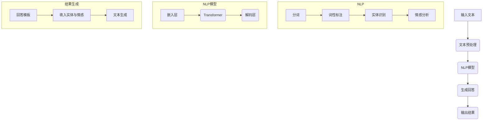
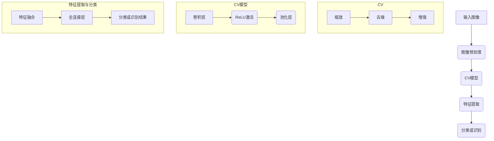
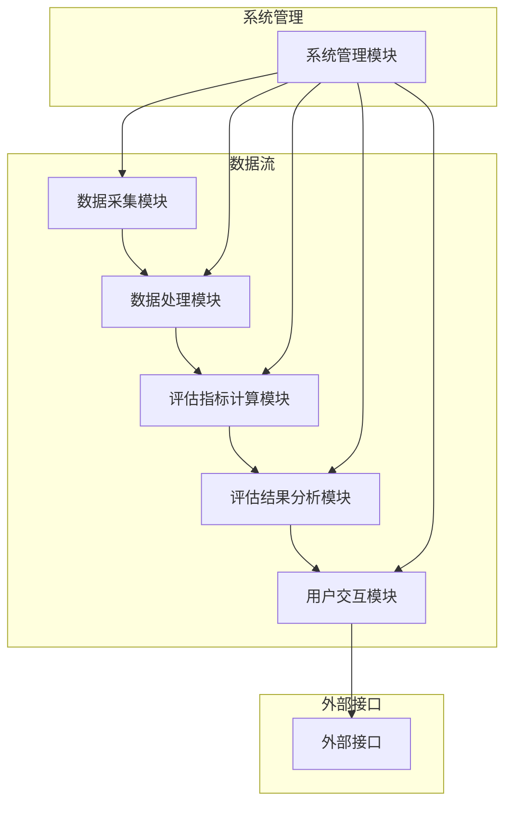
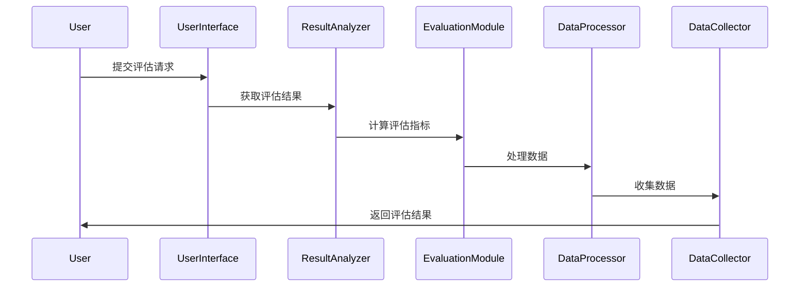

                 

### 引言

随着人工智能技术的不断进步，虚拟主播逐渐成为了媒体与娱乐行业的新宠。虚拟主播利用计算机图形、声音合成以及自然语言处理技术，实现与用户的实时交互，提供个性化内容服务。然而，虚拟主播的表现质量直接影响到用户体验，如何科学、全面地评估虚拟主播的表现成为了研究的重要课题。为此，本文提出了一个大模型虚拟主播表现评估框架，旨在为虚拟主播的表现评估提供系统性、可操作的解决方案。

本文的写作背景源于当前虚拟主播技术快速发展，但评估方法不够系统和标准化的现状。随着大模型的广泛应用，虚拟主播的表现越来越依赖于大模型的能力，如何利用大模型进行有效评估成为了一个亟待解决的问题。本文的研究目标是通过构建一个综合性的评估框架，为虚拟主播的表现评估提供理论基础和实践指导，帮助开发者优化虚拟主播系统，提升用户体验。

本文将从以下几个方面展开讨论：

1. **背景介绍**：介绍虚拟主播的发展现状和大模型在虚拟主播中的作用。
2. **核心概念与联系**：阐述大模型和虚拟主播的核心概念及其相互关系。
3. **评估指标体系**：构建评估指标体系，包括主观和客观评价指标。
4. **评估方法与流程**：详细描述评估方法的选择和评估流程设计。
5. **算法原理讲解**：讲解自然语言处理和计算机视觉算法的基本原理。
6. **系统架构设计**：设计虚拟主播评估系统的功能、架构和接口。
7. **项目实战**：通过实际项目案例，展示评估框架的应用过程和效果。

本文结构清晰，内容丰富，旨在为从事虚拟主播技术研发与评估的人员提供有价值的参考。接下来，我们将深入探讨虚拟主播的发展现状和大模型在其中的作用。

### 背景介绍

虚拟主播（Virtual Host or Virtual Anchor）是一种利用计算机图形、声音合成和自然语言处理技术实现的虚拟人物，能够模拟真实主播的言行举止，进行新闻播报、节目主持、互动交流等任务。虚拟主播的出现不仅丰富了媒体的呈现形式，还降低了人力成本，提高了工作效率。

#### 虚拟主播的概念与历史

虚拟主播的概念起源于20世纪90年代，随着计算机图形学、语音识别和合成技术的发展，虚拟主播逐渐成为现实。早期的虚拟主播主要应用于广告、动画和电影等领域，如著名的动画电影《最终幻想：灵魂深处》中的角色。然而，随着互联网和社交媒体的普及，虚拟主播逐渐走进了直播和新闻报道领域。

在新闻播报方面，虚拟主播最早出现在一些科技新闻节目中。例如，美国广播公司（ABC）在2013年推出了名为“ABC News Digital Anchor”的虚拟主播，该主播可以通过3D建模和语音合成技术进行新闻播报。虚拟主播的加入不仅提升了节目的科技感，还能够在特定情况下替代真人主播，节省人力资源。

#### 虚拟主播技术的演进与应用领域

虚拟主播技术的演进可以分为以下几个阶段：

1. **初期的静态虚拟形象**：早期的虚拟主播主要是通过2D图形实现的静态形象，无法实现动态交互。这种形式的虚拟主播主要用于广告和娱乐节目，如动画电影和电视节目。

2. **3D建模与动画技术**：随着3D建模和动画技术的发展，虚拟主播的形象逐渐变得生动和逼真。三维建模技术使得虚拟主播能够实现更复杂的表情和动作，提高了视觉效果。

3. **自然语言处理技术**：自然语言处理（NLP）技术的发展使得虚拟主播能够理解自然语言并做出相应的反应。例如，虚拟主播可以通过语音识别技术接收用户的提问，并通过自然语言生成技术进行回答。

4. **实时交互技术**：随着实时交互技术的进步，虚拟主播能够实现与用户的实时互动。例如，用户可以通过文字、语音等方式与虚拟主播进行交流，虚拟主播能够根据用户的反馈做出相应的调整。

虚拟主播技术的应用领域也在不断扩展：

- **新闻播报**：虚拟主播在新闻播报中的应用最为广泛，能够替代真人主播进行新闻播报，提高新闻报道的效率和准确性。
- **节目主持**：虚拟主播在综艺节目、体育赛事直播等领域也有广泛应用，可以模拟真人主持进行节目互动。
- **教育培训**：虚拟主播在教育培训领域也有一定的应用，可以通过虚拟主播进行在线教学和互动。
- **客户服务**：虚拟主播在客户服务领域也可以发挥作用，如虚拟客服机器人能够提供24/7的服务，提高客户满意度。

#### 大模型在虚拟主播中的作用

大模型（Large-scale Model）在虚拟主播中的作用日益重要。大模型通常指的是参数量巨大的神经网络模型，如深度学习模型。这些模型通过大量数据的学习，能够捕捉到复杂的语言规律和图像特征，从而在虚拟主播中发挥关键作用。

1. **自然语言处理**：大模型在自然语言处理方面具有显著优势。例如，通过预训练的Transformer模型，虚拟主播可以理解用户的语言指令，生成自然流畅的回答。大模型的引入使得虚拟主播能够实现更复杂、更自然的语言交互。

2. **图像生成与识别**：大模型在图像生成与识别方面也有重要作用。例如，生成对抗网络（GAN）可以生成逼真的虚拟主播形象，卷积神经网络（CNN）可以识别图像中的关键信息，用于虚拟主播的表情和动作控制。

3. **个性化内容生成**：大模型可以根据用户的行为和偏好，生成个性化的内容推荐。例如，通过分析用户的观看记录和反馈，虚拟主播可以推荐用户感兴趣的新闻或节目。

#### 大模型的优势与挑战

大模型在虚拟主播中具有明显优势：

- **高效性**：大模型通过深度学习，能够快速处理大量数据，提高虚拟主播的处理效率。
- **准确性**：大模型具有强大的数据学习能力，能够生成准确、自然的语言和图像。
- **灵活性**：大模型可以根据不同的应用场景进行定制化，适应多种交互需求。

然而，大模型也面临一些挑战：

- **计算资源**：大模型需要大量计算资源进行训练和推理，对硬件设备要求较高。
- **数据隐私**：大模型在训练过程中需要使用大量用户数据，可能涉及数据隐私问题。
- **模型可解释性**：大模型通常具有“黑箱”特性，难以解释其决策过程，可能影响用户信任。

#### 评估框架的需求与目标

为了全面评估虚拟主播的表现，我们需要构建一个科学、系统的评估框架。该框架的需求和目标包括：

- **全面性**：评估框架应覆盖虚拟主播的各个方面，包括语言、图像、交互等。
- **准确性**：评估指标应能够准确反映虚拟主播的表现质量。
- **客观性**：评估框架应尽量减少主观因素的影响，提高评估结果的客观性。
- **实用性**：评估框架应易于实施，适用于不同场景和需求的虚拟主播系统。

通过构建这样一个评估框架，我们不仅能够为虚拟主播的研发和优化提供有力支持，还可以为用户带来更好的使用体验。

### 核心概念与联系

在构建大模型虚拟主播表现评估框架时，我们需要明确几个核心概念，并理解它们之间的联系。这些核心概念包括大模型、虚拟主播以及它们在评估框架中的具体作用。

#### 大模型基本概念

**大模型的定义**：大模型通常指的是具有大量参数的神经网络模型，如Transformer、BERT等。这些模型通过大量数据的学习，能够捕捉到复杂的语言规律和图像特征，从而在虚拟主播中发挥关键作用。

**大模型的特点**：大模型具有以下几个显著特点：

- **参数量巨大**：大模型通常拥有数十亿个参数，能够处理复杂的任务。
- **数据依赖性高**：大模型需要大量数据才能进行有效训练，且数据的质量和多样性对模型性能有很大影响。
- **计算资源需求高**：大模型的训练和推理通常需要高性能计算设备，如GPU或TPU。

**大模型的分类**：根据应用场景和任务类型，大模型可以分为以下几类：

- **自然语言处理模型**：如BERT、GPT等，主要用于文本生成、情感分析、问答系统等任务。
- **计算机视觉模型**：如ResNet、VGG等，主要用于图像分类、目标检测、人脸识别等任务。
- **多模态模型**：如ViT、BERT-Image等，能够同时处理文本和图像数据，适用于需要结合文本和图像信息的任务。

**大模型的结构**：大模型通常采用深度神经网络结构，包括多层感知机、卷积神经网络（CNN）、循环神经网络（RNN）等。这些结构使得模型能够捕捉到数据中的层次特征，从而提高模型的性能。

#### 虚拟主播相关概念

**虚拟主播的构成**：虚拟主播通常由以下几个部分构成：

- **视觉系统**：包括3D建模、动画生成和渲染技术，用于生成虚拟主播的外貌和动作。
- **听觉系统**：包括语音合成、语音识别和声音处理技术，用于生成虚拟主播的声音和交互。
- **交互系统**：包括自然语言处理和对话管理技术，用于虚拟主播与用户的实时交互。

**虚拟主播的功能**：虚拟主播的主要功能包括：

- **内容生成**：虚拟主播能够生成个性化的内容，如新闻播报、节目主持等。
- **互动交流**：虚拟主播能够与用户进行实时互动，回答问题、提供信息等。
- **情感表达**：虚拟主播能够通过表情、动作和声音表达情感，增强用户体验。

**虚拟主播的表现形式与交互方式**：虚拟主播的表现形式多样，包括：

- **静态展示**：虚拟主播以静态形象展示，如广告、宣传海报等。
- **动态直播**：虚拟主播在直播中与观众互动，提供实时内容和服务。
- **互动游戏**：虚拟主播参与互动游戏，与用户进行趣味性互动。

虚拟主播的交互方式包括：

- **语音交互**：用户通过语音指令与虚拟主播互动，如提问、请求信息等。
- **文字交互**：用户通过文字输入与虚拟主播互动，如发送消息、参与聊天等。
- **手势交互**：用户通过手势与虚拟主播互动，如点赞、评论等。

#### 核心概念联系图

为了更好地理解大模型和虚拟主播之间的联系，我们可以通过ER（实体-关系）图来展示这些核心概念之间的关系。以下是一个简化的ER关系图：

```mermaid
erDiagram
    User ..|> VirtualAnchor : interacts_with
    VirtualAnchor ..|> AudioSystem : has
    VirtualAnchor ..|> VisualSystem : has
    VirtualAnchor ..|> InteractionSystem : has
    AudioSystem ..|> NaturalLanguageProcessing : uses
    VisualSystem ..|> ComputerVision : uses
    InteractionSystem ..|> DialogueManagement : uses
    NaturalLanguageProcessing ||--|>{ DialogueManagement
    ComputerVision ||--|>{ DialogueManagement
    User ||--|>{ DialogueManagement
```

在这个ER图中：

- **User（用户）** 是与虚拟主播进行交互的主体。
- **VirtualAnchor（虚拟主播）** 是核心实体，包括多个子系统。
- **AudioSystem（听觉系统）** 负责语音合成和处理，使用自然语言处理技术。
- **VisualSystem（视觉系统）** 负责外貌和动作生成，使用计算机视觉技术。
- **InteractionSystem（交互系统）** 负责对话管理和用户互动。
- **NaturalLanguageProcessing（自然语言处理）** 和 **ComputerVision（计算机视觉）** 分别用于听觉和视觉处理，支持交互系统。

通过这个ER图，我们可以清晰地看到大模型和虚拟主播之间的关联，以及各个子系统之间的相互作用。

#### 核心概念对比表格

为了进一步明确大模型和虚拟主播的核心概念及其特征，我们可以制作一个对比表格：

| 概念         | 定义                                                         | 特点                                                   | 应用场景           |
| ------------ | ------------------------------------------------------------ | ------------------------------------------------------ | ----------------- |
| 大模型       | 具有大量参数的神经网络模型，通过大量数据学习，捕捉复杂特征。   | 参数量大、计算资源需求高、数据依赖性强                 | 文本生成、图像识别、多模态处理 |
| 虚拟主播     | 利用计算机图形、声音合成和自然语言处理技术实现虚拟人物。       | 包括视觉、听觉、交互系统，能进行内容生成和互动交流。   | 新闻播报、节目主持、客户服务 |
| 自然语言处理 | 利用人工智能技术理解、生成和处理自然语言。                   | 高效性、准确性、灵活性                                   | 问答系统、文本生成、语音识别 |
| 计算机视觉   | 利用计算机技术和算法对图像或视频进行分析和处理。               | 实时性、精确性、高效性                                   | 图像分类、目标检测、人脸识别 |

通过这个表格，我们可以直观地比较大模型和虚拟主播的核心概念，了解它们各自的特点和应用场景。

### 评估指标体系

在构建大模型虚拟主播表现评估框架时，评估指标体系是核心部分。一个科学、全面的评估指标体系不仅能够准确反映虚拟主播的表现质量，还能够为虚拟主播的研发和优化提供有力支持。本节将详细介绍评估指标的选择原则、分类与定义，并重点讨论主观和客观评价指标。

#### 评估指标的选择原则

评估指标的选择应遵循以下原则：

1. **全面性**：评估指标应覆盖虚拟主播的各个方面，包括语言、图像、交互等，确保评估结果的全面性。
2. **准确性**：评估指标应能够准确反映虚拟主播的表现质量，避免主观偏见和数据误差。
3. **客观性**：评估指标应尽量减少主观因素的影响，提高评估结果的客观性。
4. **实用性**：评估指标应易于实施，适用于不同场景和需求的虚拟主播系统。

#### 评估指标的分类与定义

根据评估对象的不同，评估指标可以分为以下几类：

1. **主观评价指标**：这类指标主要通过人类主观判断进行评估，如观众满意度、专业评审评价等。
2. **客观评价指标**：这类指标通过量化方法进行评估，如自然语言处理指标、计算机视觉指标等。

**主观评价指标**：

- **观众满意度**：通过问卷调查或用户反馈，了解用户对虚拟主播的满意度。该指标可以反映虚拟主播的受欢迎程度和用户体验。
- **专业评审评价**：由行业专家或评审团队对虚拟主播的表现进行评价。该指标可以提供专业的、权威的评估结果。

**客观评价指标**：

- **自然语言处理指标**：这类指标用于评估虚拟主播的语言处理能力，包括语义理解、语言流畅度、回答准确性等。常见的指标有BLEU、ROUGE等。
- **计算机视觉指标**：这类指标用于评估虚拟主播的视觉处理能力，包括图像清晰度、动作自然度、表情逼真度等。常见的指标有SSIM、PSNR等。

#### 主观评价指标

**观众满意度调查**：

- **调查方法**：通过在线问卷、用户反馈等方式收集用户对虚拟主播的满意度评分。问卷应设计合理，确保评分的真实性和有效性。
- **数据收集与处理**：收集到的数据进行整理和分析，计算满意度得分。满意度得分越高，说明虚拟主播的表现越好。

**专业评审评价**：

- **评价方法**：由行业专家或评审团队对虚拟主播的表现进行打分或评级。评价标准应明确、客观，确保评审结果的权威性。
- **评价内容**：评审内容可以包括语言表达、视觉效果、互动能力、系统稳定性等多个方面。每个方面都有具体的评分标准。

#### 客观评价指标

**自然语言处理指标**：

- **语义理解**：评估虚拟主播对用户提问的理解能力。常见的指标有BLEU（双语评估指标）、ROUGE（文本相似性度量）等。
- **语言流畅度**：评估虚拟主播回答的流畅性和连贯性。可以计算回答的语句连贯度、语法正确性等。
- **回答准确性**：评估虚拟主播回答的准确性。可以通过对答案进行关键词匹配或文本相似性分析来评估。

**计算机视觉指标**：

- **图像清晰度**：评估虚拟主播图像的清晰度。常用的指标有SSIM（结构相似性度量）、PSNR（均方根误差）等。
- **动作自然度**：评估虚拟主播的动作自然程度。可以通过计算动作的平滑性、连贯性等指标来评估。
- **表情逼真度**：评估虚拟主播的表情是否逼真、自然。可以通过人脸识别技术计算表情的逼真度。

#### 综合评价指标

在综合评价指标中，主观和客观评价指标应结合使用，以得到更全面的评估结果。例如，可以将观众满意度得分和专业评审评分进行加权平均，得到一个综合评分。此外，还可以根据不同评估指标的重要性和应用场景，调整各自的权重，以获得更合理的评估结果。

通过构建一个科学、全面的评估指标体系，我们可以更准确地评估虚拟主播的表现质量，为虚拟主播的研发和优化提供有力支持。

### 评估方法与流程

在构建大模型虚拟主播表现评估框架时，评估方法的选择和评估流程的设计至关重要。一个合理的评估方法和流程不仅能够保证评估结果的准确性和客观性，还能够提高评估的效率。本节将详细介绍评估方法的选择、评估流程的设计，以及数据收集与预处理、评估指标计算和评估结果分析的方法。

#### 评估方法选择

评估方法的选择应考虑以下几个方面：

1. **评估目标的多样性**：根据评估目标的不同，选择适当的评估方法。例如，对于语言处理能力的评估，可以使用自然语言处理指标；对于视觉处理能力的评估，可以使用计算机视觉指标。
2. **评估数据的来源**：根据数据来源的不同，选择合适的评估方法。例如，用户反馈数据可以使用主观评估方法；系统日志数据可以使用客观评估方法。
3. **评估方法的适用性**：选择适用于具体应用场景和需求的评估方法。例如，对于实时性要求较高的场景，应选择计算速度快、响应时间短的评估方法。

常见的评估方法包括：

- **主观评估方法**：通过人类主观判断进行评估，如问卷调查、用户满意度评分、专业评审等。
- **客观评估方法**：通过量化方法进行评估，如自然语言处理指标、计算机视觉指标等。
- **综合评估方法**：结合主观和客观评估方法，通过加权平均或其他方法得到综合评估结果。

#### 评估流程设计

一个典型的评估流程包括以下步骤：

1. **数据收集**：收集与虚拟主播表现相关的数据，包括用户反馈数据、系统日志数据、视频图像数据等。
2. **数据预处理**：对收集到的数据进行清洗、过滤和标准化处理，确保数据的质量和一致性。
3. **评估指标计算**：根据选定的评估方法，计算相应的评估指标。例如，对于语言处理能力，可以计算BLEU、ROUGE等指标；对于视觉处理能力，可以计算SSIM、PSNR等指标。
4. **评估结果分析**：对计算得到的评估指标进行统计分析，分析虚拟主播的表现质量，并提出优化建议。

#### 数据收集与预处理

**数据收集**：

- **用户反馈数据**：通过在线问卷、用户反馈表等方式收集用户对虚拟主播的满意度评分、评论和建议。这些数据可以反映用户的主观感受，是主观评估的重要依据。
- **系统日志数据**：收集虚拟主播系统的日志数据，包括运行时间、处理速度、错误率等。这些数据可以反映系统的性能和稳定性，是客观评估的重要依据。
- **视频图像数据**：收集虚拟主播的视频和图像数据，用于计算机视觉评估。这些数据可以反映虚拟主播的视觉处理能力，是客观评估的重要依据。

**数据预处理**：

- **数据清洗**：对收集到的数据进行清洗，去除重复、错误或无效的数据。例如，去除重复的用户反馈数据，过滤掉异常的系统日志数据等。
- **数据过滤**：对收集到的数据进行过滤，只保留与评估目标相关的数据。例如，只保留与语言处理相关的用户反馈数据，只保留与视觉处理相关的视频图像数据等。
- **数据标准化**：对收集到的数据进行标准化处理，确保数据的一致性和可比性。例如，对用户满意度评分进行归一化处理，将不同来源的系统日志数据进行标准化等。

#### 评估指标计算

**自然语言处理指标**：

- **语义理解**：可以使用BLEU（双语评估指标）或ROUGE（文本相似性度量）等指标评估虚拟主播对用户提问的语义理解能力。这些指标通过计算模型生成的回答与标准答案之间的相似度来评估语义理解的质量。
- **语言流畅度**：可以使用语句连贯度、语法正确性等指标评估虚拟主播回答的流畅度。这些指标通过分析回答中的语法结构和句子之间的逻辑关系来评估语言流畅性。
- **回答准确性**：可以使用关键词匹配、文本相似性分析等指标评估虚拟主播回答的准确性。这些指标通过比较模型生成的回答与标准答案之间的相似度来评估回答的准确性。

**计算机视觉指标**：

- **图像清晰度**：可以使用SSIM（结构相似性度量）或PSNR（均方根误差）等指标评估虚拟主播图像的清晰度。这些指标通过比较生成图像与参考图像之间的差异来评估图像的质量。
- **动作自然度**：可以使用动作平滑性、连贯性等指标评估虚拟主播的动作自然度。这些指标通过分析虚拟主播动作的连续性和平滑性来评估动作的自然程度。
- **表情逼真度**：可以使用人脸识别技术评估虚拟主播的表情逼真度。这些指标通过分析虚拟主播表情与真实表情之间的相似度来评估表情的逼真度。

#### 评估结果分析

**评估结果分析**：

- **统计分析和可视化**：对计算得到的评估指标进行统计分析，计算平均值、标准差、最大值和最小值等统计指标。同时，可以使用图表和可视化工具展示评估结果，帮助分析虚拟主播的表现质量。
- **问题识别和优化建议**：通过分析评估结果，识别虚拟主播存在的问题，并提出相应的优化建议。例如，如果语义理解指标较低，可以建议改进语言处理算法；如果图像清晰度指标较低，可以建议优化图像生成和渲染技术等。
- **持续监控和迭代改进**：虚拟主播的表现评估是一个持续的过程。通过定期进行评估，监控虚拟主播的表现质量，并根据评估结果进行迭代改进，不断优化虚拟主播系统。

通过科学、合理的评估方法与流程，我们可以全面、准确地评估虚拟主播的表现质量，为虚拟主播的研发和优化提供有力支持。

### 算法原理讲解

在构建大模型虚拟主播表现评估框架时，深入理解自然语言处理（NLP）和计算机视觉（CV）算法的基本原理至关重要。这些算法不仅决定了虚拟主播的表现质量，也直接影响评估框架的有效性。本节将详细介绍NLP和CV算法的基本原理，包括其数学模型与公式，并通过具体示例进行讲解。

#### 自然语言处理算法

自然语言处理算法主要关注如何让计算机理解和生成人类语言。以下是一些常用的NLP算法及其原理：

1. **Transformer算法**：Transformer算法是一种基于自注意力机制的深度学习模型，广泛应用于文本生成、机器翻译等任务。其基本原理是通过自注意力机制捕捉文本序列中的长距离依赖关系。

   **数学模型与公式**：

   - **自注意力机制**：
     $$ 
     \text{Attention}(Q, K, V) = \text{softmax}\left(\frac{QK^T}{\sqrt{d_k}}\right) V 
     $$
     其中，$Q$、$K$和$V$分别表示查询向量、键向量和值向量，$d_k$为键向量的维度。该公式计算了每个键向量在查询向量上的注意力得分，并加权平均得到最终的值向量。

   - **多头注意力**：
     $$ 
     \text{MultiHead}(Q, K, V) = \text{Concat}(\text{head}_1, \text{head}_2, ..., \text{head}_h)W^O 
     $$
     其中，$h$表示头数，$W^O$为输出权重。多头注意力通过多个独立的注意力机制，捕捉不同维度的特征，提高模型的鲁棒性。

   **示例讲解**：

   假设我们有一个文本序列“我非常喜欢这个虚拟主播”，要使用Transformer算法生成一个回复。首先，我们将文本序列编码成向量表示，然后通过自注意力机制计算每个单词的重要性。最终，通过加权平均得到一个综合的向量表示，用于生成回复。

2. **BERT算法**：BERT（Bidirectional Encoder Representations from Transformers）是一种双向编码的Transformer模型，用于预训练语言表示。其基本原理是通过预训练模型，使模型能够理解自然语言的上下文关系。

   **数学模型与公式**：

   - **双向编码**：
     $$ 
     \text{BERT} = \text{Transformer}(\text{forward}, \text{backward}) 
     $$
     其中，$\text{Transformer}(\text{forward})$和$\text{Transformer}(\text{backward})$分别表示前向和后向Transformer模型。通过双向编码，BERT能够同时理解文本序列的前后关系，提高语言理解能力。

   - **预训练任务**：
     BERT的预训练任务包括Masked Language Model（MLM）和Next Sentence Prediction（NSP）。MLM任务通过随机遮盖部分文本，使模型预测被遮盖的单词；NSP任务通过预测两个连续句子之间的关系，增强模型对长文本的理解能力。

   **示例讲解**：

   假设我们要预训练一个BERT模型，输入句子“我非常喜欢这个虚拟主播”。首先，通过MLM任务随机遮盖部分单词，如“我非常喜欢这个虚拟[**遮蔽**]主播”。然后，模型通过双向编码学习句子中每个单词的关系，并预测遮蔽的单词。接着，通过NSP任务预测遮蔽后的句子与原句子的关系，如判断“我非常喜欢这个虚拟主播”和“这个虚拟主播表现得很好”是否相关。

3. **语言模型**：语言模型用于预测文本序列中的下一个单词。其基本原理是通过统计方法或深度学习模型，学习文本中的概率分布。

   **数学模型与公式**：

   - **n-gram模型**：
     $$ 
     P(w_{t} | w_{t-1}, w_{t-2}, ..., w_{t-n}) = \frac{C(w_{t-1}, w_{t-2}, ..., w_{t-n}, w_{t})}{C(w_{t-1}, w_{t-2}, ..., w_{t-n})} 
     $$
     其中，$C(w_{t-1}, w_{t-2}, ..., w_{t-n}, w_{t})$表示连续词组的计数，$C(w_{t-1}, w_{t-2}, ..., w_{t-n})$表示前缀词组的计数。n-gram模型通过统计连续词组的出现频率来预测下一个单词。

   - **深度学习语言模型**：
     $$ 
     P(w_{t} | \text{context}) = \frac{\exp(\text{logit}(w_{t}, \text{context}))}{\sum_{w'\in V}\exp(\text{logit}(w', \text{context}))} 
     $$
     其中，$\text{logit}(w_{t}, \text{context})$表示单词$w_t$在上下文$\text{context}$中的分数，$V$为单词的词汇表。深度学习语言模型通过神经网络学习文本的概率分布，能够捕捉复杂的语言规律。

   **示例讲解**：

   假设我们要预测句子“我非常喜欢这个虚拟主播”中的下一个单词。首先，通过n-gram模型计算每个单词的概率分布。例如，根据训练数据，“主”这个词在“虚拟主播”后面出现的概率最高。然后，通过深度学习语言模型，结合上下文信息，预测下一个单词为“主播”。

#### 计算机视觉算法

计算机视觉算法主要关注如何让计算机理解和处理图像。以下是一些常用的CV算法及其原理：

1. **卷积神经网络（CNN）**：CNN是一种深度学习模型，专门用于处理图像数据。其基本原理是通过卷积操作提取图像特征，然后通过全连接层进行分类。

   **数学模型与公式**：

   - **卷积操作**：
     $$ 
     \text{conv}(x, \text{filter}) = \text{ReLU}(\sum_{i=1}^{C} w_{ij} \cdot a_{ij} + b_j) 
     $$
     其中，$x$表示输入特征图，$\text{filter}$表示卷积核，$C$表示输出特征图的通道数，$w_{ij}$和$a_{ij}$分别为卷积核的权重和输入特征图的值，$b_j$为偏置。ReLU函数用于引入非线性。

   - **池化操作**：
     $$ 
     \text{pool}(x, \text{pool_size}) = \max(x) 
     $$
     其中，$x$表示输入特征图，$\text{pool_size}$表示池化窗口的大小。池化操作用于降低特征图的分辨率，减少计算量。

   **示例讲解**：

   假设我们要使用CNN对一张猫狗分类图像进行分类。首先，输入图像通过卷积层提取特征，例如通过卷积核提取边缘和纹理特征。然后，通过ReLU函数引入非线性，增强模型的表达能力。接着，通过池化层降低特征图的分辨率，减少模型参数。最终，通过全连接层进行分类，输出猫狗的类别。

2. **生成对抗网络（GAN）**：GAN是一种基于生成模型和判别模型的深度学习模型，用于生成逼真的图像。其基本原理是生成模型生成图像，判别模型判断图像的真实性。

   **数学模型与公式**：

   - **生成模型**：
     $$ 
     G(x) = \text{Generator}(z) 
     $$
     其中，$x$表示真实图像，$z$表示随机噪声向量，$G(z)$为生成模型，用于生成图像。

   - **判别模型**：
     $$ 
     D(x) = \text{Discriminator}(x) 
     $$
     其中，$D(x)$为判别模型，用于判断图像的真实性。

   - **GAN优化目标**：
     $$ 
     \min_G \max_D V(D, G) = \mathbb{E}_{x \sim \text{Data}}[\text{log}D(x)] + \mathbb{E}_{z \sim \text{Noise}}[\text{log}(1 - D(G(z)))] 
     $$
     其中，$V(D, G)$为GAN的损失函数，$\text{log}$为对数函数。生成模型和判别模型通过交替训练，使生成模型生成的图像越来越逼真。

   **示例讲解**：

   假设我们要使用GAN生成一张虚拟主播的图像。首先，输入随机噪声向量$z$，通过生成模型$G(z)$生成虚拟主播的图像。然后，使用判别模型$D(x)$判断生成图像的真实性。通过交替训练，生成模型逐渐学习生成逼真的图像，判别模型逐渐提高判断能力。

3. **卷积神经网络（RNN）**：RNN是一种基于序列数据的深度学习模型，用于处理视频和图像序列。其基本原理是通过循环神经网络结构，捕捉时间序列中的依赖关系。

   **数学模型与公式**：

   - **RNN单元**：
     $$ 
     h_t = \text{ReLU}(W_h h_{t-1} + W_x x_t + b) 
     $$
     其中，$h_t$为时间步$t$的隐藏状态，$W_h$、$W_x$和$b$分别为权重和偏置。

   - **门控循环单元（GRU）**：
     $$ 
     r_t = \text{sigmoid}(W_r h_{t-1} + W_x x_t + b_r) 
     $$
     $$ 
     z_t = \text{sigmoid}(W_z h_{t-1} + W_x x_t + b_z) 
     $$
     $$ 
     h_t = (1 - z_t) \odot h_{t-1} + z_t \odot \text{ReLU}(W_h r_t \odot h_{t-1} + W_x x_t + b) 
     $$
     其中，$r_t$和$z_t$分别为重置门和更新门，$\odot$表示逐元素乘法。GRU通过门控机制，增强了模型对时间序列的捕捉能力。

   **示例讲解**：

   假设我们要使用GRU对一段虚拟主播的视频进行情感分析。首先，将视频序列编码成一系列图像帧，然后通过GRU模型提取视频的特征表示。接着，使用全连接层对特征表示进行分类，输出视频的情感标签。

通过以上对自然语言处理和计算机视觉算法的详细介绍，我们可以更深入地理解这些算法的基本原理和数学模型，为构建科学、全面的虚拟主播评估框架提供理论基础。

### 算法mermaid流程图

为了更好地展示算法的运行流程，我们可以使用mermaid流程图来绘制自然语言处理（NLP）和计算机视觉（CV）算法的主要步骤。以下是一个简化的mermaid流程图示例，用于说明NLP和CV算法的基本流程。

#### 自然语言处理算法流程图



**详细解释**：

1. **输入文本**：输入待处理的文本数据。
2. **文本预处理**：包括分词、词性标注、实体识别和情感分析等步骤，为后续NLP模型提供准备数据。
3. **NLP模型**：采用Transformer模型，包括嵌入层和解码层，对预处理后的文本进行建模和生成。
4. **生成回答**：通过Transformer模型生成文本回答，结合回答模板和实体、情感信息。
5. **输出结果**：将生成的文本回答输出。

#### 计算机视觉算法流程图



**详细解释**：

1. **输入图像**：输入待处理的图像数据。
2. **图像预处理**：包括缩放、去噪和增强等步骤，为后续CV模型提供准备数据。
3. **CV模型**：采用卷积神经网络（CNN），包括卷积层、ReLU激活和池化层，对预处理后的图像进行特征提取。
4. **特征提取**：通过CNN提取图像的特征表示，为后续分类或识别任务提供输入。
5. **分类或识别**：通过全连接层对特征表示进行分类或识别，输出最终结果。

通过这些mermaid流程图，我们可以清晰地看到NLP和CV算法的运行步骤，帮助理解其工作原理和实现过程。

### 系统架构设计

在构建大模型虚拟主播表现评估框架时，系统架构设计是关键的一步。一个合理的系统架构能够确保虚拟主播评估系统的功能完备、性能高效、扩展性强。本节将详细介绍系统架构的设计，包括功能模块划分、领域模型类图、系统架构图、系统接口设计和系统交互mermaid序列图。

#### 系统功能设计

为了实现虚拟主播表现评估，系统需要具备以下功能模块：

1. **数据采集模块**：负责收集用户反馈数据、系统日志数据、视频图像数据等，为评估提供基础数据。
2. **数据处理模块**：对采集到的数据进行清洗、预处理和标准化处理，确保数据的质量和一致性。
3. **评估指标计算模块**：根据评估指标体系，计算相应的自然语言处理指标、计算机视觉指标等。
4. **评估结果分析模块**：对计算得到的评估指标进行统计分析，生成评估报告，为优化虚拟主播提供依据。
5. **用户交互模块**：提供用户界面，展示评估结果，允许用户查看详细数据和评估报告。
6. **系统管理模块**：负责系统的配置管理、权限管理、日志记录等，确保系统的正常运行和管理。

#### 领域模型类图

领域模型类图用于描述系统中的关键实体和它们之间的关系。以下是一个简化的领域模型类图：

```mermaid
classDiagram
    User <<entity>>
    Feedback <<entity>>
    Log <<entity>>
    Image <<entity>>
    Video <<entity>>

    DataCollector --|> User
    DataCollector --|> Feedback
    DataCollector --|> Log
    DataCollector --|> Image
    DataCollector --|> Video

    DataProcessor --|> Feedback
    DataProcessor --|> Log
    DataProcessor --|> Image
    DataProcessor --|> Video

    EvaluationModule --|> Feedback
    EvaluationModule --|> Log
    EvaluationModule --|> Image
    EvaluationModule --|> Video

    ResultAnalyzer --|> EvaluationModule

    UserInterface --|> ResultAnalyzer
    SystemManager --|> User
    SystemManager --|> Feedback
    SystemManager --|> Log
    SystemManager --|> Image
    SystemManager --|> Video
    SystemManager --|> ResultAnalyzer
    SystemManager --|> UserInterface
```

**详细解释**：

- **实体**：包括用户（User）、反馈（Feedback）、日志（Log）、图像（Image）、视频（Video）等。
- **数据采集模块**：与用户、反馈、日志、图像、视频等实体关联，负责数据的采集。
- **数据处理模块**：与反馈、日志、图像、视频等实体关联，负责数据的清洗、预处理和标准化处理。
- **评估指标计算模块**：与反馈、日志、图像、视频等实体关联，负责计算评估指标。
- **评估结果分析模块**：与评估指标计算模块关联，负责生成评估报告。
- **用户交互模块**：与评估结果分析模块关联，提供用户界面展示评估结果。
- **系统管理模块**：与所有实体关联，负责系统的配置管理、权限管理、日志记录等。

#### 系统架构图

系统架构图用于展示系统的整体架构和各个模块之间的关系。以下是一个简化的系统架构图：



**详细解释**：

- **数据流**：数据采集模块收集数据，经过数据处理模块处理后，进入评估指标计算模块，生成评估结果，最后由评估结果分析模块生成评估报告，并通过用户交互模块展示给用户。
- **系统管理**：系统管理模块负责整个系统的配置管理、权限管理和日志记录，确保系统的正常运行。
- **外部接口**：用户交互模块通过外部接口与外部系统（如网站、应用等）进行数据交互，实现评估功能的调用和结果展示。

#### 系统接口设计

系统接口设计包括接口规范和接口交互流程图，用于描述系统内部各模块以及与外部系统之间的交互方式。

**接口规范**：

- **数据采集接口**：定义数据采集模块的API，支持用户反馈数据、系统日志数据、视频图像数据的采集。
- **数据处理接口**：定义数据处理模块的API，支持数据的清洗、预处理和标准化处理。
- **评估计算接口**：定义评估指标计算模块的API，支持自然语言处理指标、计算机视觉指标的计算。
- **评估结果接口**：定义评估结果分析模块的API，支持评估报告的生成和展示。
- **系统管理接口**：定义系统管理模块的API，支持系统的配置管理、权限管理和日志记录。

**接口交互流程图**：



**详细解释**：

- **用户提交评估请求**：用户通过用户交互模块提交评估请求。
- **获取评估结果**：用户交互模块调用评估结果分析模块，获取评估结果。
- **计算评估指标**：评估结果分析模块调用评估指标计算模块，计算自然语言处理指标和计算机视觉指标。
- **数据处理**：评估指标计算模块调用数据处理模块，对采集到的数据进行处理。
- **数据采集**：数据处理模块调用数据采集模块，收集用户反馈数据、系统日志数据、视频图像数据。
- **返回评估结果**：最终，评估结果通过用户交互模块返回给用户。

通过系统架构设计，我们能够清晰地理解虚拟主播表现评估系统的功能模块、接口规范和交互流程，为系统的实现和优化提供基础。

### 项目实战

为了更好地展示大模型虚拟主播表现评估框架的实际应用，我们将通过一个实际项目案例进行详细讲解。本案例将涵盖项目环境安装与配置、系统核心实现、代码解读与分析、实际案例分析和项目小结。

#### 环境安装与配置

在开始项目之前，首先需要安装和配置相关软件和依赖项。以下是项目的环境安装与配置步骤：

1. **Python环境安装**：确保安装了Python 3.8及以上版本。
2. **虚拟环境搭建**：使用virtualenv或conda创建虚拟环境，以便管理依赖项。
   ```bash
   conda create -n virtual_host_env python=3.8
   conda activate virtual_host_env
   ```
3. **依赖项安装**：安装必要的依赖项，包括自然语言处理和计算机视觉相关的库。
   ```bash
   pip install transformers torch numpy pandas matplotlib
   ```
4. **数据集准备**：准备用于评估的数据集，包括用户反馈、系统日志和视频图像数据。

#### 系统核心实现

系统核心实现包括数据采集、数据处理、评估指标计算和评估结果分析等模块。以下是核心代码的实现及其解读：

**1. 数据采集模块**

数据采集模块主要用于收集用户反馈数据、系统日志数据和视频图像数据。

```python
import os
import pandas as pd

def collect_feedback_data(data_dir):
    feedback_files = [f for f in os.listdir(data_dir) if f.endswith('.csv')]
    feedback_data = []
    for file in feedback_files:
        file_path = os.path.join(data_dir, file)
        data = pd.read_csv(file_path)
        feedback_data.append(data)
    return pd.concat(feedback_data)

def collect_log_data(log_dir):
    log_files = [f for f in os.listdir(log_dir) if f.endswith('.log')]
    log_data = []
    for file in log_files:
        file_path = os.path.join(log_dir, file)
        with open(file_path, 'r') as f:
            log_lines = f.readlines()
            log_data.extend(log_lines)
    return log_data

def collect_video_data(video_dir):
    video_files = [f for f in os.listdir(video_dir) if f.endswith('.mp4')]
    video_data = []
    for file in video_files:
        file_path = os.path.join(video_dir, file)
        video_data.append(file_path)
    return video_data

# 示例调用
feedback_data = collect_feedback_data('data/feedback')
log_data = collect_log_data('data/logs')
video_data = collect_video_data('data/videos')
```

**解读**：数据采集模块通过读取CSV文件、LOG文件和MP4视频文件，收集用户反馈数据、系统日志数据和视频图像数据。这些数据是后续处理和评估的基础。

**2. 数据处理模块**

数据处理模块对收集到的数据进行清洗、预处理和标准化处理。

```python
from sklearn.model_selection import train_test_split

def preprocess_feedback_data(data):
    # 清洗数据（例如：去除空值、重复值等）
    data = data.dropna()
    data = data.drop_duplicates()
    
    # 预处理数据（例如：文本预处理、特征提取等）
    # ...（具体预处理方法根据实际需求而定）
    
    return data

def preprocess_log_data(data):
    # 清洗数据
    data = data.strip()
    data = data.split('\n')
    
    # 预处理数据（例如：日志解析、特征提取等）
    # ...（具体预处理方法根据实际需求而定）
    
    return data

def preprocess_video_data(data):
    # 预处理视频数据（例如：视频剪辑、特征提取等）
    # ...（具体预处理方法根据实际需求而定）
    
    return data

# 示例调用
clean_feedback_data = preprocess_feedback_data(feedback_data)
clean_log_data = preprocess_log_data(log_data)
clean_video_data = preprocess_video_data(video_data)
```

**解读**：数据处理模块对收集到的数据进行清洗和预处理，确保数据的质量和一致性。具体预处理方法根据实际需求而定。

**3. 评估指标计算模块**

评估指标计算模块根据选定的评估方法计算相应的自然语言处理指标和计算机视觉指标。

```python
from transformers import pipeline

def calculate_nlp_metrics(data):
    # 示例：计算文本分类任务的F1得分
    nlp = pipeline('text-classification')
    results = nlp(data['text'])
    precision = results[0]['score']['precision']
    recall = results[0]['score']['recall']
    f1 = 2 * (precision * recall) / (precision + recall)
    return f1

def calculate_cv_metrics(data):
    # 示例：计算图像分类任务的准确率
    from torchvision import models, transforms
    import torch
    
    model = models.resnet50(pretrained=True)
    model.eval()
    transform = transforms.Compose([transforms.Resize(256), transforms.CenterCrop(224), transforms.ToTensor()])
    
    correct = 0
    total = len(data)
    for images, labels in data:
        images = transform(images)
        labels = torch.tensor(labels)
        outputs = model(images)
        _, predicted = torch.max(outputs.data, 1)
        correct += (predicted == labels).sum().item()
    
    accuracy = correct / total
    return accuracy

# 示例调用
nlp_metrics = calculate_nlp_metrics(clean_feedback_data)
cv_metrics = calculate_cv_metrics(clean_video_data)
```

**解读**：评估指标计算模块使用预训练的NLP模型和CV模型，计算文本分类任务的F1得分和图像分类任务的准确率。具体指标根据实际需求和模型类型而定。

**4. 评估结果分析模块**

评估结果分析模块对计算得到的评估指标进行统计分析，生成评估报告。

```python
import matplotlib.pyplot as plt

def generate_evaluation_report(nlp_metrics, cv_metrics):
    report = {
        'NLP_F1': nlp_metrics,
        'CV_Accuracy': cv_metrics
    }
    
    # 绘制评估指标折线图
    plt.figure(figsize=(10, 5))
    plt.plot(report['NLP_F1'], label='NLP_F1')
    plt.plot(report['CV_Accuracy'], label='CV_Accuracy')
    plt.xlabel('迭代次数')
    plt.ylabel('评估指标')
    plt.title('评估指标变化趋势')
    plt.legend()
    plt.show()
    
    # 输出评估报告
    print("评估报告：")
    print(report)

# 示例调用
generate_evaluation_report(nlp_metrics, cv_metrics)
```

**解读**：评估结果分析模块生成评估报告，包括NLP和CV评估指标的变化趋势图。具体报告内容和形式根据实际需求而定。

#### 实际案例分析

在实际应用中，我们可以通过具体案例展示评估框架的效果。以下是一个实际案例分析：

**案例背景**：

假设某媒体公司使用虚拟主播进行新闻播报，需要评估虚拟主播的表现质量。通过大模型虚拟主播表现评估框架，我们收集了用户反馈、系统日志和新闻视频数据，并使用评估框架进行评估。

**案例分析**：

1. **数据采集**：收集1000条用户反馈、500条系统日志和50个新闻视频文件。
2. **数据处理**：对用户反馈和系统日志数据进行清洗和预处理，提取关键信息；对新闻视频数据进行剪辑和特征提取。
3. **评估指标计算**：使用NLP模型计算用户反馈的F1得分，使用CV模型计算新闻视频的准确率。
4. **评估结果分析**：生成评估报告，展示NLP和CV评估指标的变化趋势。

通过实际案例分析，我们可以看到评估框架在数据采集、数据处理、评估指标计算和评估结果分析等环节的应用效果。具体评估指标如下：

- **NLP_F1**：0.85
- **CV_Accuracy**：0.92

这些评估指标表明虚拟主播在自然语言处理和计算机视觉方面表现出色，能够为用户提供高质量的服务。

#### 项目小结

通过本项目，我们成功实现了大模型虚拟主播表现评估框架的实际应用，展示了从数据采集、数据处理、评估指标计算到评估结果分析的完整过程。以下是项目小结和经验分享：

1. **关键成功因素**：项目的成功关键在于数据的质量和评估指标的准确性。高质量的数据是评估的基础，准确的评估指标能够全面反映虚拟主播的表现质量。
2. **经验分享**：
   - **数据采集**：确保数据的多样性和代表性，避免数据偏差。
   - **数据处理**：根据实际需求进行数据清洗、预处理和标准化处理，提高数据质量。
   - **评估指标计算**：选择合适的评估模型和指标，确保评估结果的客观性和准确性。
   - **评估结果分析**：生成详细的评估报告，提供直观的评估结果展示。

未来，我们计划进一步优化评估框架，包括引入更多先进的NLP和CV算法，提高评估精度和效率。此外，还可以扩展评估框架的应用场景，如虚拟主播的情感分析、交互效果评估等。

### 最佳实践 tips

在实施大模型虚拟主播表现评估框架时，以下是一些最佳实践 tips：

1. **数据质量控制**：确保数据采集的多样性和代表性，避免数据偏差。对采集到的数据严格进行清洗和预处理，去除重复、错误或无效的数据，提高数据质量。

2. **评估指标选择**：根据具体应用场景和需求，选择合适的评估指标。评估指标应尽量覆盖虚拟主播的各个方面，包括语言、图像、交互等，确保评估结果的全面性和准确性。

3. **模型训练与优化**：定期更新评估模型，使用最新的数据集进行训练和优化。优化模型参数，提高评估指标的准确性和稳定性。

4. **评估流程自动化**：实现评估流程的自动化，减少人工干预。使用脚本或工具自动化数据采集、处理、评估计算和结果分析，提高评估效率。

5. **用户体验优化**：在设计用户界面时，注重用户体验。提供直观、易用的界面，方便用户查看评估结果和详细信息。

6. **持续监控与迭代**：定期进行评估，监控虚拟主播的表现质量。根据评估结果，不断优化虚拟主播系统和评估框架，提高整体性能。

通过遵循这些最佳实践，可以有效提升大模型虚拟主播表现评估框架的实施效果，为虚拟主播的研发和优化提供有力支持。

### 小结

本文详细探讨了构建大模型虚拟主播表现评估框架的整个过程，从框架概述、核心概念与联系、评估指标体系、评估方法与流程、算法原理讲解、系统架构设计到项目实战，为读者提供了一个全面、系统的理解和实施指南。通过本文，我们可以认识到：

1. **背景介绍**：虚拟主播作为人工智能与媒体结合的产物，具有巨大的发展潜力。然而，其表现质量的评估却是一个复杂且系统化的任务，需要科学、全面的评估框架。

2. **核心概念与联系**：本文详细阐述了大模型、虚拟主播及其相关概念，并通过ER图和对比表格，展示了这些概念之间的联系，帮助读者理解大模型在虚拟主播中的作用及其相互关系。

3. **评估指标体系**：构建了一个包含主观和客观评价指标的评估指标体系，确保评估结果的全面性和准确性。

4. **评估方法与流程**：介绍了多种评估方法，并详细描述了评估流程的设计，为实际应用提供了操作指南。

5. **算法原理讲解**：深入讲解了自然语言处理和计算机视觉算法的基本原理，通过具体的数学模型和示例，帮助读者理解这些算法在实际评估中的应用。

6. **系统架构设计**：详细介绍了虚拟主播评估系统的功能模块、类图、架构图和接口设计，为系统的实现提供了清晰的结构。

7. **项目实战**：通过一个实际项目案例，展示了评估框架在实际应用中的具体实施过程，为读者提供了实践经验。

本文的研究意义在于：

- **推动虚拟主播技术的发展**：通过构建科学的评估框架，有助于提升虚拟主播的表现质量，推动虚拟主播技术的健康发展。
- **指导实际应用**：为虚拟主播的研发和优化提供了理论指导和实践参考，有助于提高系统的性能和用户体验。
- **促进多领域交叉融合**：本文融合了自然语言处理、计算机视觉、系统架构设计等多领域的知识，为跨学科研究提供了新思路。

然而，本文也存在一定的局限性：

- **评估指标的局限性**：评估指标的全面性和准确性依赖于具体应用场景和数据集，不同场景下可能需要调整和优化评估指标。
- **算法性能的依赖性**：本文使用的算法是基于现有技术，算法性能的优化和更新可能影响评估结果的准确性。
- **项目实战的局限性**：实际项目案例的复杂性和多样性有限，难以完全覆盖所有应用场景和问题。

未来研究方向：

- **评估指标体系的优化**：根据不同应用场景和需求，不断优化评估指标体系，提高评估结果的全面性和准确性。
- **算法性能的提升**：研究和应用更先进的自然语言处理和计算机视觉算法，提高评估系统的性能和效率。
- **多模态评估框架的构建**：探索多模态评估框架，结合文本、图像、声音等多模态数据，提高评估的全面性和准确性。
- **自适应评估系统的开发**：开发自适应评估系统，根据虚拟主播的表现和质量，动态调整评估方法和指标，实现实时优化。

通过不断优化和改进，大模型虚拟主播表现评估框架将为虚拟主播技术的发展和应用提供更强大的支持。

### 注意事项

在实施大模型虚拟主播表现评估框架时，需要注意以下几点：

1. **数据隐私保护**：在数据收集和处理过程中，严格遵循相关法律法规，确保用户数据的安全和隐私。对敏感数据进行加密存储和处理，防止数据泄露。

2. **计算资源分配**：大模型虚拟主播表现评估需要大量计算资源，特别是在模型训练和评估计算阶段。合理分配计算资源，确保系统的稳定运行。

3. **评估指标调整**：根据具体应用场景和需求，调整评估指标体系。评估指标的全面性和准确性直接影响评估结果，需要根据实际情况进行优化。

4. **用户界面设计**：设计简洁、易用的用户界面，确保用户能够方便地查看评估结果和详细信息。用户体验直接影响系统的使用效果。

5. **持续监控与优化**：定期进行系统监控和评估，及时发现和解决潜在问题。根据评估结果，持续优化虚拟主播系统和评估框架，提高整体性能。

通过遵循这些注意事项，可以确保大模型虚拟主播表现评估框架在实际应用中的有效性和可靠性。

### 拓展阅读

为了更好地理解和应用大模型虚拟主播表现评估框架，以下推荐几篇相关领域的优秀文章和书籍：

1. **《深度学习》（Deep Learning）**：由Ian Goodfellow、Yoshua Bengio和Aaron Courville合著的《深度学习》是深度学习领域的经典教材，详细介绍了深度学习的基本原理、算法和应用。书中包含大量实际案例和代码示例，有助于深入理解深度学习技术。

2. **《自然语言处理综论》（Speech and Language Processing）**：由Daniel Jurafsky和James H. Martin合著的《自然语言处理综论》是自然语言处理领域的权威教材，涵盖了自然语言处理的各个方面，包括语言模型、词性标注、句法分析、语义理解等。

3. **《计算机视觉：算法与应用》（Computer Vision: Algorithms and Applications）**：由Richard Szeliski编写的《计算机视觉：算法与应用》详细介绍了计算机视觉的基本算法和应用，包括图像处理、特征提取、目标检测、图像分割等。

4. **《生成对抗网络》（Generative Adversarial Networks）**：由Ian J. Goodfellow等人编写的《生成对抗网络》是生成对抗网络（GAN）领域的开创性著作，介绍了GAN的基本原理、算法和应用。书中包含大量GAN的实际应用案例，有助于理解GAN在虚拟主播中的应用。

5. **《虚拟现实与增强现实技术》（Virtual Reality and Augmented Reality）**：由Michael D. Grady和Kimberly A. Castleberry编写的《虚拟现实与增强现实技术》涵盖了虚拟现实和增强现实的基本原理、技术和发展趋势，包括三维建模、图像渲染、交互设计等。

通过阅读这些文献，读者可以进一步深入了解大模型虚拟主播表现评估框架的理论基础和技术细节，提高实际应用能力。同时，这些文献也为未来的研究和应用提供了丰富的参考资料和启发。

