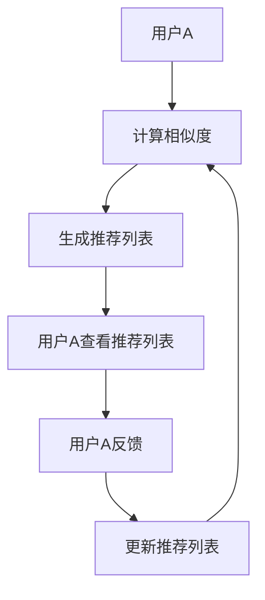
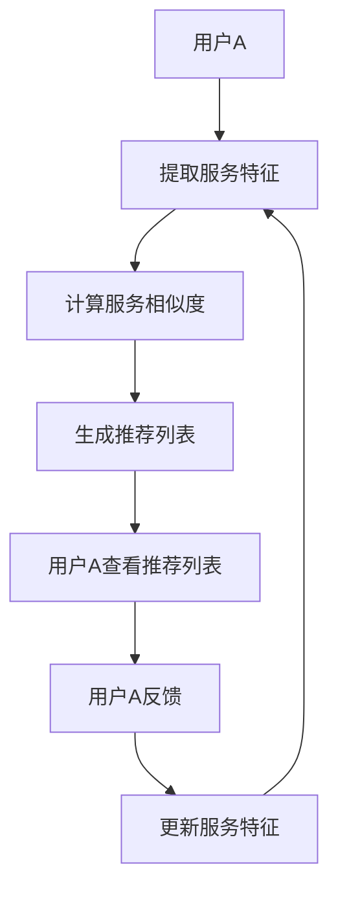

                 


### 大模型虚拟助手个性化能力评估工具

关键词：虚拟助手、个性化能力评估、人工智能、用户行为分析、需求识别、服务推荐、交互优化

摘要：随着人工智能技术的发展，虚拟助手成为众多企业和个人的宠儿。如何确保虚拟助手能够提供个性化的服务，满足用户的需求，成为了一个关键问题。本文旨在开发一个系统化的评估工具，对虚拟助手的个性化能力进行全面评估，从而提升其服务质量和用户满意度。本文首先介绍虚拟助手个性化能力评估工具的背景、核心概念和结构，然后详细阐述工具的架构和特点，最后探讨用户行为分析与需求识别、服务推荐算法等核心模块的实现原理和方法。

### 目录大纲：

## 第1章 问题背景与核心概念

### 1.1 问题背景

### 1.2 核心概念

#### 1.2.1 虚拟助手

#### 1.2.2 个性化能力

### 1.3 概念结构与核心要素组成

#### 1.3.1 用户行为分析

#### 1.3.2 需求识别

#### 1.3.3 服务推荐

#### 1.3.4 交互优化

### 1.4 本章小结

## 第2章 虚拟助手个性化能力评估工具概述

### 2.1 工具概述

### 2.2 工具架构

#### 2.2.1 数据层

#### 2.2.2 算法层

#### 2.2.3 应用层

### 2.3 工具特点

### 2.4 本章小结

## 第3章 用户行为分析与需求识别

### 3.1 用户行为分析

#### 3.1.1 用户行为数据收集

#### 3.1.2 用户行为数据预处理

#### 3.1.3 用户行为分析算法

### 3.2 需求识别

#### 3.2.1 需求数据收集

#### 3.2.2 需求数据预处理

#### 3.2.3 需求识别算法

### 3.3 本章小结

## 第4章 服务推荐算法

### 4.1 服务推荐算法概述

### 4.2 协同过滤算法原理

#### 4.2.1 协同过滤算法mermaid流程图

#### 4.2.2 协同过滤算法python实现

### 4.3 基于内容的推荐算法原理

#### 4.3.1 基于内容的推荐算法mermaid流程图

#### 4.3.2 基于内容的推荐算法python实现

### 4.4 本章小结

## 第5章 交互优化算法

### 5.1 交互优化算法概述

### 5.2 对话策略算法原理

#### 5.2.1 对话策略算法mermaid流程图

#### 5.2.2 对话策略算法python实现

### 5.3 响应时间优化算法原理

#### 5.3.1 响应时间优化算法mermaid流程图

#### 5.3.2 响应时间优化算法python实现

### 5.4 本章小结

## 第6章 项目实战

### 6.1 环境安装

### 6.2 系统核心实现源代码

### 6.3 代码应用解读与分析

### 6.4 实际案例分析与详细讲解剖析

### 6.5 项目小结

## 第7章 最佳实践 tips、小结、注意事项、拓展阅读

### 7.1 最佳实践 tips

### 7.2 小结

### 7.3 注意事项

### 7.4 拓展阅读

### 7.5 作者信息

## 第1章 问题背景与核心概念

### 1.1 问题背景

随着人工智能技术的迅猛发展，虚拟助手作为一种重要的智能交互系统，被广泛应用于各类场景。从简单的语音助手到复杂的智能客服，虚拟助手已经在我们的日常生活中扮演着越来越重要的角色。然而，随着用户需求的多样化和个性化，如何确保虚拟助手能够提供个性化的服务，满足用户的需求，成为了一个关键问题。

在当前的虚拟助手应用中，存在以下几个主要问题：

1. **用户个性化需求难以满足**：大多数虚拟助手是基于通用算法和模板进行设计的，难以根据每个用户的特定需求进行个性化服务。

2. **用户体验一致性不高**：虚拟助手的性能和响应速度在不同用户之间可能存在较大差异，导致用户体验不一致。

3. **数据收集和处理不足**：虚拟助手在运行过程中产生的用户行为数据、需求数据等未被充分利用，无法为个性化服务提供有效的支持。

4. **评估工具缺乏**：目前缺乏一套系统化的评估工具，对虚拟助手的个性化能力进行全方位评估。

### 1.2 核心概念

#### 1.2.1 虚拟助手

虚拟助手是一种基于人工智能技术的智能系统，能够通过自然语言交互，提供信息查询、任务执行等服务。其主要特点包括：

- **自学习**：虚拟助手能够根据用户交互数据不断学习和优化自身性能。

- **自适应**：虚拟助手能够根据用户的需求和环境变化，动态调整交互策略和服务内容。

- **用户互动**：虚拟助手能够与用户进行自然语言交互，模拟人类的对话方式，提升用户体验。

#### 1.2.2 个性化能力

个性化能力是指虚拟助手根据用户的个性化需求，提供定制化服务的综合能力。其核心要素包括：

- **用户行为分析**：通过分析用户的历史行为，挖掘用户的兴趣和需求。

- **需求识别**：识别用户的当前需求，为提供个性化服务提供依据。

- **服务推荐**：根据用户的需求，推荐相应的服务内容。

- **交互优化**：优化虚拟助手与用户的交互体验。

### 1.3 概念结构与核心要素组成

为了全面评估虚拟助手的个性化能力，我们需要了解其概念结构和核心要素组成。

#### 1.3.1 用户行为分析

用户行为分析是虚拟助手个性化能力评估的基础。其主要功能是：

- **数据收集**：通过虚拟助手与用户的交互记录，收集用户行为数据。

- **数据处理**：对用户行为数据进行清洗、去重、归一化等预处理操作。

- **数据挖掘**：使用机器学习算法，如决策树、支持向量机等，对用户行为数据进行分析，挖掘用户的兴趣和需求。

#### 1.3.2 需求识别

需求识别是虚拟助手提供个性化服务的关键。其主要功能是：

- **数据收集**：通过虚拟助手与用户的交互记录，收集需求数据。

- **数据处理**：对需求数据进行清洗、去重、归一化等预处理操作。

- **需求识别**：使用自然语言处理技术，如词向量、文本分类等，对需求数据进行识别，提取用户的需求。

#### 1.3.3 服务推荐

服务推荐是虚拟助手提供个性化服务的重要手段。其主要功能是：

- **数据收集**：根据用户的需求，收集相关的服务数据。

- **数据处理**：对服务数据进行清洗、去重、归一化等预处理操作。

- **服务推荐**：使用推荐系统技术，如协同过滤、基于内容的推荐等，根据用户的需求推荐相应的服务内容。

#### 1.3.4 交互优化

交互优化是虚拟助手提升用户体验的重要手段。其主要功能是：

- **对话策略优化**：通过优化对话策略，提高虚拟助手与用户的交互效果。

- **响应时间优化**：通过优化虚拟助手的响应时间，提升用户体验。

### 1.4 本章小结

本章介绍了虚拟助手个性化能力评估工具的背景、核心概念和结构。通过分析虚拟助手个性化能力的核心要素，我们为后续的评估工具设计和实现奠定了基础。在下一章中，我们将对虚拟助手个性化能力评估工具进行概述，介绍其架构和特点。

## 第2章 虚拟助手个性化能力评估工具概述

### 2.1 工具概述

虚拟助手个性化能力评估工具是一种专门用于评估虚拟助手个性化能力的系统化工具。其目标是通过全面、客观、多维度的评估，帮助开发者和企业了解虚拟助手在个性化服务方面的表现，为优化和改进提供依据。该工具的主要功能包括用户行为分析、需求识别、服务推荐和交互优化等。

### 2.2 工具架构

虚拟助手个性化能力评估工具的架构分为数据层、算法层和应用层三个层次。

#### 2.2.1 数据层

数据层主要负责存储虚拟助手运行过程中产生的各类数据，包括用户行为数据、需求数据、服务数据等。数据层的技术选型包括关系型数据库（如MySQL）和非关系型数据库（如MongoDB）。关系型数据库适用于存储结构化数据，如用户行为数据；非关系型数据库适用于存储半结构化或非结构化数据，如需求数据和服务数据。

#### 2.2.2 算法层

算法层是实现虚拟助手个性化能力评估的核心。该层主要包括用户行为分析算法、需求识别算法、服务推荐算法和交互优化算法等。算法层的技术选型主要包括机器学习、深度学习和自然语言处理等技术。例如，用户行为分析算法可以采用决策树、支持向量机等分类算法；需求识别算法可以采用词向量、文本分类等算法；服务推荐算法可以采用协同过滤、基于内容的推荐等算法；交互优化算法可以采用对话策略优化、响应时间优化等技术。

#### 2.2.3 应用层

应用层是虚拟助手个性化能力评估工具的界面层，负责提供用户交互接口和评估结果展示。应用层的技术选型主要包括前端框架（如React、Vue）和后端框架（如Spring Boot）。前端框架负责实现用户交互界面，如评估操作、数据展示等；后端框架负责处理业务逻辑和数据存储等。

### 2.3 工具特点

虚拟助手个性化能力评估工具具有以下几个特点：

1. **可扩展性**：该工具支持对虚拟助手的新功能进行评估，如新增服务类型、交互方式等，适应不断变化的用户需求。

2. **实时性**：该工具支持实时评估，快速响应，能够实时获取虚拟助手的个性化能力表现，为优化提供及时反馈。

3. **全面性**：该工具覆盖虚拟助手个性化能力的各个方面，包括用户行为分析、需求识别、服务推荐和交互优化等，提供全方位的评估。

### 2.4 本章小结

本章对虚拟助手个性化能力评估工具进行了概述，介绍了其架构和特点。在下一章中，我们将详细探讨用户行为分析与需求识别的方法和工具，为虚拟助手个性化能力评估奠定基础。

## 第3章 用户行为分析与需求识别

### 3.1 用户行为分析

用户行为分析是虚拟助手个性化能力评估的基础环节。通过对用户行为数据的分析，可以挖掘用户的兴趣、偏好和需求，从而为个性化服务提供支持。

#### 3.1.1 用户行为数据收集

用户行为数据的收集是用户行为分析的第一步。虚拟助手在运行过程中，会与用户进行各种交互，如文本对话、语音交互、动作识别等。这些交互数据可以通过日志记录、API调用等方式进行收集。具体的数据类型包括：

- **文本数据**：用户输入的文本信息，如查询请求、反馈意见等。
- **音频数据**：用户语音交互的音频信号，如语音命令、语音反馈等。
- **视频数据**：用户动作交互的视频信号，如手势、表情等。

在数据收集过程中，需要确保数据的完整性和准确性。对于文本数据，可以通过日志记录的方式进行收集；对于音频和视频数据，可以通过API调用或流媒体传输的方式进行收集。

#### 3.1.2 用户行为数据预处理

收集到的用户行为数据通常是杂乱无章的，需要经过预处理才能进行分析。预处理的主要步骤包括：

1. **数据清洗**：去除无效数据、重复数据、异常数据等，保证数据的完整性。
2. **数据去重**：识别并删除重复的数据，避免重复分析。
3. **数据归一化**：将不同类型、不同量级的数据进行统一处理，便于后续分析。

预处理操作可以显著提升数据的质量，提高分析的准确性。常用的预处理方法包括数据清洗、去重、归一化、特征提取等。

#### 3.1.3 用户行为分析算法

用户行为分析的核心在于通过算法对用户行为数据进行分析，挖掘用户的兴趣、偏好和需求。常用的用户行为分析算法包括：

1. **关联规则挖掘**：通过挖掘用户行为数据中的关联关系，发现用户可能的兴趣和行为模式。常用的算法有Apriori算法、FP-growth算法等。
2. **聚类分析**：将具有相似行为的用户分为一组，挖掘用户的兴趣和行为特征。常用的算法有K-means算法、层次聚类算法等。
3. **分类算法**：将用户行为数据划分为不同的类别，为个性化服务提供依据。常用的算法有决策树、支持向量机、随机森林等。

通过用户行为分析算法，可以实现对用户行为数据的深度挖掘，为虚拟助手提供个性化的服务。

### 3.2 需求识别

需求识别是虚拟助手提供个性化服务的关键环节。通过对用户需求的识别，可以准确了解用户的需求，为推荐相应的服务内容提供依据。

#### 3.2.1 需求数据收集

需求数据的收集是需求识别的基础。虚拟助手在运行过程中，会根据用户的需求生成各种类型的需求数据。常见的需求数据包括：

- **文本需求**：用户输入的文本信息，如查询请求、反馈意见等。
- **语音需求**：用户语音交互的语音信号，如语音命令、语音反馈等。
- **图像需求**：用户动作交互的图像信号，如手势、表情等。

需求数据的收集可以通过日志记录、API调用、传感器采集等方式进行。在数据收集过程中，需要确保数据的完整性和准确性。

#### 3.2.2 需求数据预处理

需求数据预处理是需求识别的重要环节。预处理的主要步骤包括：

1. **数据清洗**：去除无效数据、重复数据、异常数据等，保证数据的完整性。
2. **数据去重**：识别并删除重复的数据，避免重复分析。
3. **数据归一化**：将不同类型、不同量级的数据进行统一处理，便于后续分析。

预处理操作可以显著提升数据的质量，提高需求的识别准确性。常用的预处理方法包括数据清洗、去重、归一化、特征提取等。

#### 3.2.3 需求识别算法

需求识别的核心在于通过算法对需求数据进行分析，准确识别用户的需求。常用的需求识别算法包括：

1. **词向量模型**：将文本需求转化为向量表示，通过计算相似度实现需求识别。常用的算法有Word2Vec、GloVe等。
2. **文本分类算法**：将文本需求分类到不同的类别中，实现需求识别。常用的算法有朴素贝叶斯、支持向量机、卷积神经网络等。
3. **序列模型**：将语音需求视为序列数据，通过序列分析实现需求识别。常用的算法有循环神经网络（RNN）、长短期记忆网络（LSTM）等。

通过需求识别算法，可以实现对用户需求的准确识别，为虚拟助手提供个性化的服务。

### 3.3 本章小结

本章详细介绍了用户行为分析与需求识别的方法和工具。用户行为分析通过关联规则挖掘、聚类分析和分类算法等技术，实现对用户行为的深度挖掘；需求识别通过词向量模型、文本分类算法和序列模型等技术，实现对用户需求的准确识别。这些方法和技术为虚拟助手个性化能力评估奠定了基础。在下一章中，我们将详细探讨服务推荐算法的实现原理和方法。

## 第4章 服务推荐算法

### 4.1 服务推荐算法概述

服务推荐算法是虚拟助手个性化能力评估的重要组成部分，其主要目标是根据用户的需求和行为，推荐符合用户兴趣的服务内容。服务推荐算法可以分为两大类：基于协同过滤的推荐算法和基于内容的推荐算法。这两类算法各有优缺点，适用于不同的场景。

### 4.2 协同过滤算法原理

协同过滤（Collaborative Filtering）是一种常见的推荐算法，其基本思想是利用用户的历史行为数据，通过计算用户之间的相似度，预测用户可能感兴趣的服务内容。

#### 4.2.1 协同过滤算法mermaid流程图



#### 4.2.2 协同过滤算法python实现

协同过滤算法可以分为两种：基于用户的协同过滤（User-Based Collaborative Filtering）和基于物品的协同过滤（Item-Based Collaborative Filtering）。

**基于用户的协同过滤算法**：

```python
import numpy as np
from sklearn.metrics.pairwise import cosine_similarity

# 假设用户行为数据为user_matrix，行表示用户，列表示服务
user_matrix = np.array([[1, 0, 1], [1, 1, 0], [0, 1, 1]])

# 计算用户之间的相似度
user_similarity = cosine_similarity(user_matrix)

# 为用户A推荐服务
def recommend_for_user(user_id, user_similarity, user_matrix, k=3):
    # 获取与用户A相似度最高的k个用户
    similar_users = np.argsort(user_similarity[user_id])[1:k+1]
    
    # 获取相似用户的共同行为
    common_services = np.sum(user_matrix[similar_users], axis=0)
    
    # 推荐用户A未体验的服务
    recommended_services = np.where(common_services > 0)[0]
    
    return recommended_services

# 测试推荐算法
recommended_services = recommend_for_user(0, user_similarity, user_matrix, k=2)
print(recommended_services)
```

**基于物品的协同过滤算法**：

```python
# 假设用户行为数据为item_matrix，行表示服务，列表示用户
item_matrix = np.array([[1, 1, 0], [0, 1, 1], [1, 0, 1]])

# 计算服务之间的相似度
item_similarity = cosine_similarity(item_matrix)

# 为用户A推荐服务
def recommend_for_user_item(user_id, item_similarity, item_matrix, k=3):
    # 获取与用户A最相似的k个服务
    similar_items = np.argsort(item_similarity[:, user_id])[1:k+1]
    
    # 获取相似服务的用户评分
    item_ratings = np.mean(item_matrix[similar_items], axis=1)
    
    # 推荐用户A未体验的服务
    recommended_services = np.where(item_ratings > 0)[0]
    
    return recommended_services

# 测试推荐算法
recommended_services = recommend_for_user_item(0, item_similarity, item_matrix, k=2)
print(recommended_services)
```

### 4.3 基于内容的推荐算法原理

基于内容的推荐（Content-Based Filtering）算法是基于用户对服务的兴趣特征，推荐与用户兴趣相似的服务内容。该算法的核心在于提取服务的特征信息，并根据用户的历史行为，计算服务之间的相似度。

#### 4.3.1 基于内容的推荐算法mermaid流程图



#### 4.3.2 基于内容的推荐算法python实现

```python
# 假设服务特征数据为service_features，行表示服务，列表示特征
service_features = np.array([[1, 0, 1], [1, 1, 0], [0, 1, 1]])

# 计算服务之间的相似度
service_similarity = cosine_similarity(service_features)

# 为用户A推荐服务
def recommend_for_user_content(user_id, service_similarity, service_features, k=3):
    # 获取与用户A最相似的服务
    similar_services = np.argsort(service_similarity[:, user_id])[1:k+1]
    
    # 推荐用户A未体验的服务
    recommended_services = np.where(np.sum(service_features[similar_services], axis=1) > 0)[0]
    
    return recommended_services

# 测试推荐算法
recommended_services = recommend_for_user_content(0, service_similarity, service_features, k=2)
print(recommended_services)
```

### 4.4 本章小结

本章详细介绍了服务推荐算法的原理和实现。协同过滤算法通过计算用户之间的相似度，推荐符合用户兴趣的服务；基于内容的推荐算法通过提取服务的特征信息，推荐与用户兴趣相似的服务。这些算法为虚拟助手提供了有效的个性化服务推荐手段。在下一章中，我们将探讨交互优化算法的实现原理和方法。

