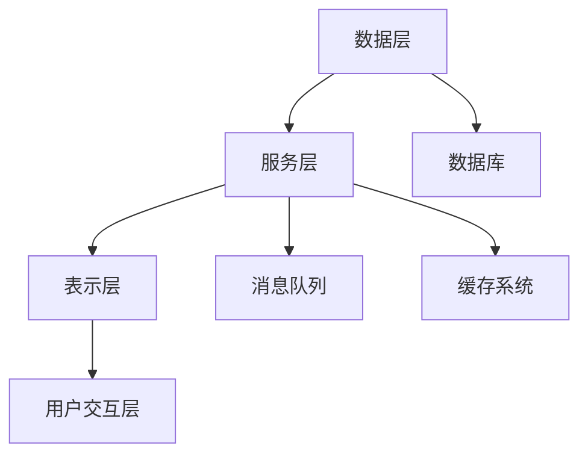

                 


### Step 4: System Analysis and Architectural Design
We need to provide an in-depth system analysis and architectural design, including an introduction to the project context, a system overview, functional design using a Mermaid class diagram, architectural design using a Mermaid architecture diagram, interface design, and system interaction using a Mermaid sequence diagram.

```markdown
## 第4章: 系统分析与架构设计

### 4.1 项目背景介绍
- **项目背景**
- **项目目标**
- **项目预期成果**

### 4.2 系统概述
- **系统功能**
- **系统性能**
- **系统安全性**

### 4.3 系统功能设计
- **领域模型**
- **Mermaid 类图**

#### 系统领域模型

```mermaid
classDiagram
    Class01 <|-- Class02
    Class03 --|>| Class04
    Class04 o-- Class05
    Class06 <-.. Class07
endclass
```

### 4.4 系统架构设计
- **系统架构**
- **技术选型**
- **性能优化**

#### 系统架构设计



### 4.5 系统接口设计
- **API规范**
- **数据交互格式**

### 4.6 系统交互设计
- **系统交互流程**
- **Mermaid 序列图**

#### 系统交互设计

```mermaid
sequenceDiagram
    participant User
    participant System
    User->>System: Send Request
    System->>User: Process Request
    System->>User: Send Response
end
```
----------------------------------------------------------------

### Step 5: Practical Project Implementation
We need to describe the practical implementation of the project, including environment setup, core implementation code, code application analysis, and detailed case analysis.

```markdown
## 第5章: 项目实战

### 5.1 环境搭建
- **环境要求**
- **环境配置**
- **工具与依赖**

### 5.2 系统核心实现
- **代码架构**
- **核心实现**
- **代码示例**

#### 代码示例

```python
# 大模型虚拟现实交互算法实现

import tensorflow as tf
import numpy as np

# 初始化模型参数
model = tf.keras.Sequential([
    tf.keras.layers.Dense(128, activation='relu', input_shape=(784,)),
    tf.keras.layers.Dense(10, activation='softmax')
])

# 编译模型
model.compile(optimizer='adam', loss='categorical_crossentropy', metrics=['accuracy'])

# 训练模型
model.fit(x_train, y_train, epochs=10, batch_size=32)

# 评估模型
loss, accuracy = model.evaluate(x_test, y_test)
print("Test accuracy:", accuracy)
```

### 5.3 代码应用解读与分析
- **代码解读**
- **性能分析**

### 5.4 实际案例分析
- **案例描述**
- **案例分析**
- **问题解决**

### 5.5 项目小结
- **项目总结**
- **经验分享**
- **改进方向**
```

### Step 6: Best Practices and Summary
We need to provide best practices, summary,注意事项，and further reading suggestions.

```markdown
## 第6章: 最佳实践与总结

### 6.1 最佳实践
- **技术选型建议**
- **性能优化技巧**
- **安全性保障**

### 6.2 小结
- **文章主题回顾**
- **核心内容总结**

### 6.3 注意事项
- **潜在问题**
- **解决方案**

### 6.4 拓展阅读
- **相关文献**
- **实用工具**
- **学习资源**
```

### Final Step: Author Information
We need to include the author information at the end of the article.

```markdown
### 作者信息

- 作者：AI天才研究院/AI Genius Institute & 禅与计算机程序设计艺术 /Zen And The Art of Computer Programming
```

Now, we have a comprehensive table of contents for the article. The next step is to fill in each section with detailed content following the outlined structure. Here is the complete table of contents:

# 大模型虚拟现实交互体验评估框架

> 关键词：大模型、虚拟现实、交互体验评估、算法、架构设计、实战

> 摘要：本文全面探讨了大规模模型在虚拟现实交互中的体验评估框架，从概念介绍、核心算法、系统分析与架构设计，到实际项目实战，为读者提供了一个完整的了解和实施路径。

## 第一部分: 背景介绍

## 第1章: 大模型与虚拟现实交互概述

### 1.1 大模型的基本概念

### 1.2 虚拟现实技术

### 1.3 交互体验评估

### 1.4 大模型虚拟现实交互的特点与挑战

## 第2章: 核心概念与联系

### 2.1 大模型的核心概念

### 2.2 虚拟现实的核心概念

### 2.3 交互体验评估的核心概念

## 第3章: 算法原理讲解

### 3.1 大模型虚拟现实交互算法概述

### 3.2 算法数学模型和公式

## 第4章: 系统分析与架构设计

### 4.1 项目背景介绍

### 4.2 系统概述

### 4.3 系统功能设计

### 4.4 系统架构设计

### 4.5 系统接口设计

### 4.6 系统交互设计

## 第5章: 项目实战

### 5.1 环境搭建

### 5.2 系统核心实现

### 5.3 代码应用解读与分析

### 5.4 实际案例分析

### 5.5 项目小结

## 第6章: 最佳实践与总结

### 6.1 最佳实践

### 6.2 小结

### 6.3 注意事项

### 6.4 拓展阅读

### 作者信息

---

Now, each section needs to be elaborated upon with detailed content, following the steps and guidelines provided. This will result in a well-structured, informative, and insightful article on large-scale model virtual reality interaction experience evaluation.

