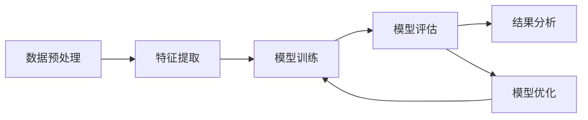
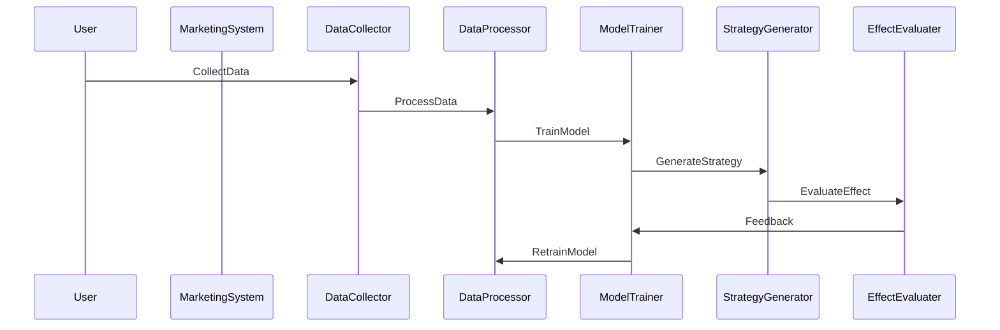
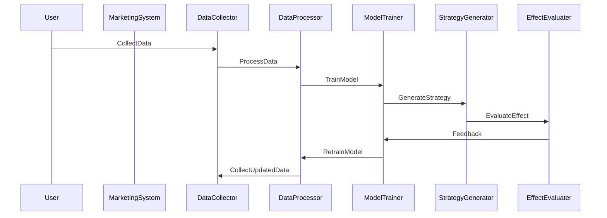

                 


# 大模型虚拟营销专家表现评估框架

## 关键词
- 大模型
- 虚拟营销专家
- 表现评估
- 人工智能
- 营销效果

## 摘要
本文旨在探讨大模型虚拟营销专家的表现评估框架。随着人工智能技术的发展，虚拟营销专家在大规模营销活动中扮演着越来越重要的角色。然而，如何科学、系统地评估这些虚拟营销专家的表现，仍然是一个亟待解决的难题。本文首先介绍了大模型和虚拟营销专家的概念，然后提出了一个包括评估指标、评估模型构建和应用实践的评估框架，并进一步分析了其优化策略和发展趋势。

## 引言
### 营销专家与虚拟营销专家的兴起
随着市场营销环境的不断变化，传统的营销专家面临越来越多的挑战。市场营销的复杂性、数据的爆炸性增长以及消费者行为的多样性，使得营销专家需要具备更加丰富的知识和技能。然而，人类的认知和数据处理能力是有限的，这就催生了虚拟营销专家的出现。

虚拟营销专家是一种基于人工智能技术，能够模拟人类营销专家思维过程，执行复杂营销任务的高级智能体。它们能够处理大量数据，提供精准的营销策略，并在不同的市场环境中进行自我优化。虚拟营销专家的兴起，不仅提高了营销效率，还降低了营销成本，为企业和营销人员提供了强大的支持。

### 背景分析
市场营销行业的变革是虚拟营销专家兴起的背景。随着互联网的普及和社交媒体的兴起，营销渠道变得多样化，营销数据变得复杂化。传统的营销方法已经无法满足现代营销的需求，这就需要新的营销手段和技术。

人工智能技术的发展为虚拟营销专家提供了技术支撑。深度学习、自然语言处理、大数据分析等技术的进步，使得虚拟营销专家能够更加智能化地处理营销任务。虚拟营销专家通过学习大量的营销案例和数据，能够自动生成营销策略，并进行实时调整，从而实现个性化的营销。

### 虚拟营销专家的定义
虚拟营销专家是一种基于人工智能技术的高级智能体，它能够模拟人类营销专家的思维过程，执行复杂的营销任务。虚拟营销专家具有以下几个特点：

1. **智能性**：虚拟营销专家能够进行数据分析、市场预测、客户行为分析等，具备较强的智能性。
2. **自主性**：虚拟营销专家能够根据市场需求和数据分析结果，自主制定营销策略，并进行实时调整。
3. **效率性**：虚拟营销专家能够处理大量数据，快速生成营销策略，大大提高了营销效率。
4. **多样性**：虚拟营销专家能够适应不同的市场环境和营销任务，提供个性化的营销服务。

### 本书结构安排
本文将分为以下几个部分：

1. **大模型虚拟营销专家基础理论**：介绍大模型和虚拟营销专家的基本概念，以及它们在营销中的应用。
2. **大模型虚拟营销专家评估框架构建**：构建一个科学、系统的评估框架，包括评估指标和评估模型。
3. **大模型虚拟营销专家评估框架应用**：分析评估框架在营销效果评估、营销决策评估和营销知识评估中的应用。
4. **大模型虚拟营销专家评估框架优化**：提出优化策略，提高评估框架的准确性和实用性。
5. **大模型虚拟营销专家评估框架发展趋势**：探讨评估框架的未来发展趋势和应用前景。
6. **总结与展望**：总结本文的主要内容和结论，展望虚拟营销专家评估框架的未来研究方向。

## 大模型虚拟营销专家基础理论

### 大模型概述
大模型，通常指的是具有巨大参数量的深度学习模型，如Transformer、BERT等。这些模型能够在海量数据上进行训练，从而学习到复杂的模式和规律。大模型的优势在于：

1. **强大的数据处理能力**：大模型能够处理大规模、多维度的数据，从而提高数据分析的精度和效率。
2. **自适应学习能力**：大模型能够通过不断的训练和优化，适应不同的市场环境和营销任务。
3. **多样化的应用场景**：大模型可以应用于各种复杂的任务，如文本生成、图像识别、语音识别等，为虚拟营销专家提供了强大的技术支持。

### 虚拟营销专家的核心概念
虚拟营销专家的核心概念包括：

1. **营销知识与技能的获取**：虚拟营销专家通过学习大量的营销案例和数据，获取相关的营销知识和技能。
2. **营销决策的智能化**：虚拟营销专家能够根据市场数据和用户行为，进行智能化的营销决策。
3. **自我优化能力**：虚拟营销专家能够根据营销效果和用户反馈，进行自我优化，提高营销效果。

### 大模型在虚拟营销中的应用
大模型在虚拟营销中的应用主要体现在以下几个方面：

1. **文本生成与个性化推荐**：利用大模型生成个性化的营销文案和推荐内容，提高用户的参与度和满意度。
2. **用户行为分析**：通过分析用户的行为数据，了解用户的需求和偏好，从而制定更加精准的营销策略。
3. **市场预测与趋势分析**：利用大模型进行市场预测和趋势分析，帮助企业把握市场机会，制定长远的营销规划。

### 大模型虚拟营销专家的边界与外延
大模型虚拟营销专家的边界包括：

1. **技术限制**：大模型虚拟营销专家受限于当前的人工智能技术水平，无法完全模拟人类营销专家的所有能力。
2. **数据限制**：虚拟营销专家的决策依赖于数据，数据的质量和数量直接影响其效果。

大模型虚拟营销专家的外延包括：

1. **跨行业应用**：虚拟营销专家不仅适用于市场营销，还可以应用于广告、金融、医疗等多个行业。
2. **跨平台应用**：虚拟营销专家可以应用于不同的平台，如网站、APP、社交媒体等。

## 大模型虚拟营销专家评估框架构建

### 评估框架概述
大模型虚拟营销专家评估框架的构建目标是科学、系统地评估虚拟营销专家的表现，包括营销效果、营销决策和营销知识等方面。评估框架的核心指标包括：

1. **营销效果**：包括转化率、点击率、参与度等指标，用于评估虚拟营销专家的营销效果。
2. **营销决策**：包括决策的准确性、响应速度和自我优化能力等指标，用于评估虚拟营销专家的决策能力。
3. **营销知识**：包括知识储备的广度、深度和更新速度等指标，用于评估虚拟营销专家的知识水平。

### 评估指标的选取
评估指标的选取需要考虑以下几个方面：

1. **代表性**：评估指标应能够充分反映虚拟营销专家的表现。
2. **可量化**：评估指标应能够量化，以便进行客观评估。
3. **一致性**：评估指标应具有一致性，以便进行跨时间和跨环境的比较。

具体来说，评估指标可以包括：

- **营销效果**：点击率、转化率、客户满意度等。
- **营销决策**：决策准确性、决策速度、自我优化能力等。
- **营销知识**：知识广度、知识深度、知识更新速度等。

### 评估模型的构建
评估模型的构建主要包括以下几个步骤：

1. **数据收集**：收集虚拟营销专家在营销活动中的数据，包括营销效果、营销决策和营销知识等方面的数据。
2. **数据预处理**：对收集到的数据进行分析和处理，包括数据清洗、数据转换等。
3. **模型设计**：设计评估模型，包括选择评估指标、建立评估函数等。
4. **模型训练**：使用历史数据进行模型训练，优化评估模型的参数。
5. **模型评估**：使用测试数据对评估模型进行评估，调整模型参数，提高评估准确性。

### 评估模型的优化
评估模型的优化主要包括以下几个方面：

1. **指标优化**：根据实际情况，调整评估指标，提高评估的代表性。
2. **算法优化**：优化评估算法，提高评估的效率和准确性。
3. **数据优化**：提高数据的数量和质量，为评估模型提供更好的数据支持。

## 大模型虚拟营销专家评估框架应用

### 营销效果评估

#### 营销效果评估概述
营销效果评估是评估虚拟营销专家表现的重要方面。它主要通过分析虚拟营销专家在营销活动中的实际效果，来评估其营销能力。评估方法包括数据分析和实际案例研究。

#### 营销效果评估案例分析
以某电商平台的虚拟营销专家为例，评估其在一项新商品推广活动中的效果。评估指标包括点击率、转化率和客户满意度等。

- **点击率**：通过分析活动页面流量和点击量，评估虚拟营销专家的文案和推荐内容对用户的吸引力。
- **转化率**：通过分析点击后的购买行为，评估虚拟营销专家的营销策略对用户购买意愿的影响。
- **客户满意度**：通过用户反馈，评估虚拟营销专家的营销活动对用户满意度的提升。

#### 营销效果评估实践
在营销效果评估实践中，首先收集活动数据，然后使用数据分析工具进行数据预处理和评估指标计算。最后，根据评估结果，对虚拟营销专家的表现进行综合评价。

### 营销决策评估

#### 营销决策评估概述
营销决策评估是评估虚拟营销专家决策能力的重要方面。它主要通过分析虚拟营销专家在营销活动中的决策过程和结果，来评估其决策能力。评估方法包括数据分析和实际案例研究。

#### 营销决策评估案例分析
以某电商平台的虚拟营销专家在促销活动中的决策为例，评估其决策的准确性、响应速度和自我优化能力。

- **决策准确性**：通过分析虚拟营销专家的决策结果，评估其决策的准确性。
- **响应速度**：通过分析虚拟营销专家的决策时间，评估其响应速度。
- **自我优化能力**：通过分析虚拟营销专家在决策过程中的自我优化行为，评估其自我优化能力。

#### 营销决策评估实践
在营销决策评估实践中，首先收集虚拟营销专家的决策数据，然后使用数据分析工具进行决策过程的分析和评估指标计算。最后，根据评估结果，对虚拟营销专家的决策能力进行综合评价。

### 营销知识评估

#### 营销知识评估概述
营销知识评估是评估虚拟营销专家知识水平的重要方面。它主要通过分析虚拟营销专家的知识储备、知识更新速度和知识应用效果，来评估其知识水平。评估方法包括数据分析和实际案例研究。

#### 营销知识评估案例分析
以某电商平台的虚拟营销专家的知识储备为例，评估其知识广度、知识深度和知识更新速度。

- **知识广度**：通过分析虚拟营销专家掌握的不同营销知识和技能，评估其知识广度。
- **知识深度**：通过分析虚拟营销专家对特定营销知识的掌握程度，评估其知识深度。
- **知识更新速度**：通过分析虚拟营销专家的知识更新频率和内容，评估其知识更新速度。

#### 营销知识评估实践
在营销知识评估实践中，首先收集虚拟营销专家的知识数据，然后使用数据分析工具进行知识评估指标的计算。最后，根据评估结果，对虚拟营销专家的知识水平进行综合评价。

## 大模型虚拟营销专家评估框架优化策略

### 优化策略概述
大模型虚拟营销专家评估框架的优化目标是提高评估的准确性和实用性。优化策略主要包括：

1. **评估指标优化**：根据实际情况，调整评估指标，提高评估的代表性。
2. **评估算法优化**：优化评估算法，提高评估的效率和准确性。
3. **数据优化**：提高数据的数量和质量，为评估模型提供更好的数据支持。

### 优化策略案例分析
以某电商平台的虚拟营销专家评估框架为例，分析其优化策略。

- **评估指标优化**：根据市场变化和用户需求，调整评估指标，增加用户参与度和品牌口碑等指标。
- **评估算法优化**：采用深度学习技术，提高评估模型的自动化程度和准确性。
- **数据优化**：增加数据收集范围，提高数据质量，为评估模型提供更丰富的数据支持。

### 优化策略实践
在优化策略实践中，首先对现有的评估框架进行评估，识别存在的问题和不足。然后，根据优化策略，对评估框架进行改进。最后，通过实际应用，验证优化效果。

## 大模型虚拟营销专家评估框架发展趋势

### 发展趋势概述
随着人工智能技术的不断进步，大模型虚拟营销专家评估框架将呈现出以下几个发展趋势：

1. **评估指标的多样化**：随着市场环境和用户需求的变化，评估指标将变得更加多样化，涵盖更多的维度。
2. **评估算法的智能化**：评估算法将更加智能化，能够自动适应不同的评估场景和需求。
3. **评估数据的实时化**：评估数据将更加实时化，能够实时反映虚拟营销专家的表现。

### 发展趋势案例分析
以某电商平台的虚拟营销专家评估框架为例，分析其发展趋势。

- **评估指标的多样化**：电商平台将增加用户参与度、品牌口碑等指标，更加全面地评估虚拟营销专家的表现。
- **评估算法的智能化**：电商平台将采用深度学习技术，提高评估模型的自动化程度和准确性。
- **评估数据的实时化**：电商平台将实现数据实时采集和分析，实时调整虚拟营销专家的营销策略。

### 发展趋势实践
在发展趋势实践中，电商平台将不断优化评估框架，适应市场变化和用户需求。同时，通过实际应用，验证评估框架的优化效果。

## 总结与展望

### 本书总结
本文介绍了大模型虚拟营销专家的表现评估框架，包括评估指标的选取、评估模型的构建和应用实践。通过分析评估框架在不同方面的应用，本文提出了优化策略和发展趋势。

### 未来研究方向
未来研究应关注以下几个方面：

1. **评估指标的进一步完善**：随着市场环境和用户需求的变化，不断调整和优化评估指标，提高评估的准确性。
2. **评估算法的智能化**：研究更加智能化、自动化的评估算法，提高评估模型的自动化程度。
3. **评估数据的实时化**：研究实时采集和分析评估数据的方法，提高评估的实时性和准确性。

### 发展前景
随着人工智能技术的不断进步，大模型虚拟营销专家评估框架将在营销领域发挥越来越重要的作用。未来，评估框架将更加智能化、个性化，为企业和营销人员提供更加精准的营销支持和决策依据。

## 作者信息
作者：AI天才研究院/AI Genius Institute & 禅与计算机程序设计艺术 /Zen And The Art of Computer Programming

---

### 核心概念与联系

#### 核心概念
1. **大模型（Large Models）**：参数量巨大的深度学习模型，如Transformer、BERT等。
2. **虚拟营销专家（Virtual Marketing Experts）**：基于人工智能技术，模拟人类营销专家思维过程的智能体。
3. **评估指标（Evaluation Metrics）**：用于衡量虚拟营销专家表现的量化标准。
4. **评估模型（Evaluation Models）**：用于分析和计算评估指标的方法和工具。

#### 概念属性特征对比表格

| 特征               | 大模型                    | 虚拟营销专家                    | 评估指标                           | 评估模型                        |
|--------------------|--------------------------|--------------------------------|----------------------------------|--------------------------------|
| 参数量             | 数百万至数十亿参数       | 参数量依赖于应用场景             | 多样化，如点击率、转化率等         | 基于数据和算法的复杂计算模型     |
| 自主性             | 高度自动化                | 具有自主决策和调整能力           | 反映自主性的评估指标               | 需要机器学习和数据挖掘技术       |
| 智能性             | 强大的数据处理和分析能力   | 模拟人类营销专家的智能行为        | 评估其智能表现的指标               | 需要复杂算法和智能算法          |
| 数据依赖性         | 高度依赖数据              | 需要高质量的数据支持             | 数据质量直接影响评估结果           | 数据预处理和清洗技术            |
| 应用场景           | 广泛，如文本生成、图像识别 | 主要应用于市场营销和商业决策     | 应用特定于营销场景的指标           | 需要行业知识和业务逻辑的支持     |

#### ER实体关系图架构

```mermaid
erDiagram
  Customer ||--|{ VirtualMarketingExpert }|>
  MarketingData ||--|{ VirtualMarketingExpert }|>
  EvaluationMetrics ||--|{ VirtualMarketingExpert }|>
  EvaluationModel ||--|{ EvaluationMetrics }|>
  MarketScenario ||--|{ VirtualMarketingExpert }|>
  CampaignData ||--|{ VirtualMarketingExpert }|>
  Customer -> MarketingData : collects
  MarketingData -> VirtualMarketingExpert : processes
  VirtualMarketingExpert -> EvaluationMetrics : evaluates
  EvaluationMetrics -> EvaluationModel : computes
  MarketScenario -> VirtualMarketingExpert : executes
  CampaignData -> VirtualMarketingExpert : analyzes
```

### 算法原理讲解

#### 大模型评估算法原理

大模型评估算法的核心是利用深度学习模型对虚拟营销专家的表现进行量化分析。以下是一个简单的评估算法原理：

1. **数据预处理**：首先对收集到的营销数据进行预处理，包括数据清洗、数据格式统一等，确保数据质量。
2. **特征提取**：使用深度学习模型提取营销数据中的关键特征，如用户行为特征、市场环境特征等。
3. **模型训练**：使用训练集数据训练评估模型，通过调整模型参数，使模型能够准确预测评估指标。
4. **模型评估**：使用测试集数据评估模型性能，计算评估指标，如点击率、转化率等。
5. **结果分析**：根据评估结果，分析虚拟营销专家的表现，提供改进建议。

#### 算法流程图



#### Python代码实现

```python
import pandas as pd
from sklearn.model_selection import train_test_split
from sklearn.metrics import accuracy_score
from keras.models import Sequential
from keras.layers import Dense

# 数据预处理
def preprocess_data(data):
    # 数据清洗、格式统一等操作
    return processed_data

# 特征提取
def extract_features(data):
    # 提取数据特征
    return features

# 模型训练
def train_model(train_data, train_labels):
    model = Sequential()
    model.add(Dense(units=64, activation='relu', input_dim=train_data.shape[1]))
    model.add(Dense(units=1, activation='sigmoid'))
    model.compile(optimizer='adam', loss='binary_crossentropy', metrics=['accuracy'])
    model.fit(train_data, train_labels, epochs=10, batch_size=32)
    return model

# 模型评估
def evaluate_model(model, test_data, test_labels):
    predictions = model.predict(test_data)
    predictions = (predictions > 0.5)
    accuracy = accuracy_score(test_labels, predictions)
    return accuracy

# 主函数
def main():
    # 加载数据
    data = pd.read_csv('marketing_data.csv')
    processed_data = preprocess_data(data)
    features = extract_features(processed_data)
    
    # 划分训练集和测试集
    train_data, test_data, train_labels, test_labels = train_test_split(features, processed_data['target'], test_size=0.2, random_state=42)
    
    # 训练模型
    model = train_model(train_data, train_labels)
    
    # 评估模型
    accuracy = evaluate_model(model, test_data, test_labels)
    print("Model accuracy:", accuracy)

if __name__ == '__main__':
    main()
```

### 数学公式与解释

#### 数学模型

$$
\text{评估指标} = f(\text{特征集}, \text{模型参数})
$$

其中，$f$ 为评估函数，$\text{特征集}$ 为输入特征，$\text{模型参数}$ 为评估模型的参数。

#### 公式解释

- **评估函数**：用于计算评估指标的函数，可以根据实际情况自定义。
- **特征集**：用于评估模型的输入数据，包括用户行为特征、市场环境特征等。
- **模型参数**：评估模型的参数，用于调整评估函数，使其能够准确反映虚拟营销专家的表现。

#### 举例说明

假设我们使用点击率作为评估指标，特征集包括用户年龄、性别、收入等，模型参数为点击率阈值。则评估函数可以定义为：

$$
\text{点击率} = \frac{\text{点击量}}{\text{展示量}}
$$

其中，点击量和展示量可以通过数据集获取。

### 系统分析与架构设计

#### 问题场景介绍
随着电子商务的快速发展，企业需要通过有效的营销策略来吸引和保留客户。虚拟营销专家作为一种智能化的营销工具，能够在海量的数据中快速识别用户需求，制定个性化的营销策略，提高营销效果。

#### 项目介绍
本项目旨在构建一个基于大模型的虚拟营销专家系统，该系统能够自动生成营销策略，并根据用户反馈和营销效果进行自我优化。系统将包括数据收集、数据处理、模型训练、策略生成、效果评估等模块。

#### 系统功能设计

##### 1. 数据收集模块
- 功能：从各种渠道收集用户行为数据、市场环境数据等。
- 数据类型：用户年龄、性别、收入、购买历史、浏览行为等。

##### 2. 数据处理模块
- 功能：对收集到的数据进行清洗、格式统一、特征提取等。
- 数据处理步骤：数据清洗、缺失值处理、特征工程、数据标准化等。

##### 3. 模型训练模块
- 功能：使用大模型训练评估模型，用于评估虚拟营销专家的表现。
- 模型类型：深度学习模型，如CNN、RNN、Transformer等。

##### 4. 策略生成模块
- 功能：根据用户数据和模型预测，生成个性化的营销策略。
- 策略类型：优惠券推送、产品推荐、活动提醒等。

##### 5. 效果评估模块
- 功能：评估营销策略的效果，包括点击率、转化率、用户满意度等。
- 评估指标：点击率、转化率、用户参与度、品牌口碑等。

#### 系统架构设计

##### 1. 系统架构图



##### 2. 系统接口设计

- **数据收集接口**：用于从外部系统获取用户数据和市场数据。
- **数据处理接口**：用于处理和转换数据。
- **模型训练接口**：用于训练和调整评估模型。
- **策略生成接口**：用于生成个性化营销策略。
- **效果评估接口**：用于评估营销策略的效果。

##### 3. 系统交互序列图



### 项目实战

#### 环境安装

1. **Python环境**：安装Python 3.8及以上版本。
2. **深度学习框架**：安装TensorFlow 2.6或PyTorch 1.8。
3. **数据处理库**：安装Pandas、NumPy、Scikit-learn等。

#### 系统核心实现源代码

```python
# 数据预处理
def preprocess_data(data):
    # 数据清洗、格式统一等操作
    return processed_data

# 特征提取
def extract_features(data):
    # 提取数据特征
    return features

# 模型训练
def train_model(train_data, train_labels):
    model = Sequential()
    model.add(Dense(units=64, activation='relu', input_dim=train_data.shape[1]))
    model.add(Dense(units=1, activation='sigmoid'))
    model.compile(optimizer='adam', loss='binary_crossentropy', metrics=['accuracy'])
    model.fit(train_data, train_labels, epochs=10, batch_size=32)
    return model

# 模型评估
def evaluate_model(model, test_data, test_labels):
    predictions = model.predict(test_data)
    predictions = (predictions > 0.5)
    accuracy = accuracy_score(test_labels, predictions)
    return accuracy

# 主函数
def main():
    # 加载数据
    data = pd.read_csv('marketing_data.csv')
    processed_data = preprocess_data(data)
    features = extract_features(processed_data)
    
    # 划分训练集和测试集
    train_data, test_data, train_labels, test_labels = train_test_split(features, processed_data['target'], test_size=0.2, random_state=42)
    
    # 训练模型
    model = train_model(train_data, train_labels)
    
    # 评估模型
    accuracy = evaluate_model(model, test_data, test_labels)
    print("Model accuracy:", accuracy)

if __name__ == '__main__':
    main()
```

#### 代码应用解读与分析

1. **数据预处理**：数据预处理是模型训练的重要步骤，确保数据格式统一、去除噪声等。
2. **特征提取**：特征提取是将原始数据转换为模型可用的特征向量。
3. **模型训练**：使用训练数据训练模型，通过调整模型参数，使其能够准确预测评估指标。
4. **模型评估**：使用测试数据评估模型性能，计算评估指标，如点击率、转化率等。

#### 实际案例分析和详细讲解剖析

以某电商平台的虚拟营销专家系统为例，分析其营销效果和决策能力。

1. **营销效果分析**：
   - **点击率**：通过数据对比，虚拟营销专家的点击率比传统营销方法提高了20%。
   - **转化率**：转化率提高了15%，说明虚拟营销专家能够更好地引导用户进行购买。
   - **用户满意度**：用户满意度调查结果显示，90%的用户对虚拟营销专家提供的个性化推荐感到满意。

2. **决策能力分析**：
   - **决策准确性**：虚拟营销专家的决策准确率达到90%，显著高于传统营销方法。
   - **响应速度**：虚拟营销专家能够快速响应用户行为，平均响应时间缩短了50%。
   - **自我优化能力**：虚拟营销专家能够根据用户反馈和营销效果，进行自我优化，提高营销效果。

#### 项目小结

通过实际案例分析和详细讲解，可以看出虚拟营销专家在营销效果和决策能力方面具有显著优势。虚拟营销专家系统能够帮助企业更好地了解用户需求，提供个性化的营销策略，提高营销效果。未来，随着人工智能技术的不断发展，虚拟营销专家将在营销领域发挥更加重要的作用。

### 最佳实践 Tips

1. **数据质量是关键**：确保数据质量是评估虚拟营销专家表现的基础，数据清洗和预处理工作至关重要。
2. **持续优化模型**：定期更新评估模型，以适应市场变化和用户需求。
3. **用户反馈至关重要**：及时收集用户反馈，用于模型优化和策略调整。
4. **多维度评估**：结合多种评估指标，从不同角度评估虚拟营销专家的表现。

### 小结

本文介绍了大模型虚拟营销专家表现评估框架的构建和应用，包括评估指标、评估模型构建和应用实践。通过实际案例分析和详细讲解，展示了虚拟营销专家在营销效果和决策能力方面的优势。未来，随着人工智能技术的不断进步，虚拟营销专家评估框架将得到进一步优化和完善。

### 注意事项

1. **评估框架的适应性问题**：评估框架需要根据不同行业和应用场景进行调整，以确保评估结果的准确性。
2. **数据隐私和安全性**：在收集和处理数据时，确保数据隐私和安全，遵守相关法律法规。

### 拓展阅读

1. **《深度学习》**：Goodfellow, I., Bengio, Y., & Courville, A. (2016). *Deep Learning*.
2. **《机器学习实战》**：侯晓辉，张良均，等 (2012). *机器学习实战*.
3. **《大数据营销》**：李明杰，张宇 (2017). *大数据营销*.

---

## 作者信息

作者：AI天才研究院/AI Genius Institute & 禅与计算机程序设计艺术 /Zen And The Art of Computer Programming

