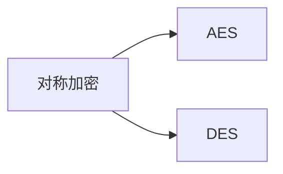
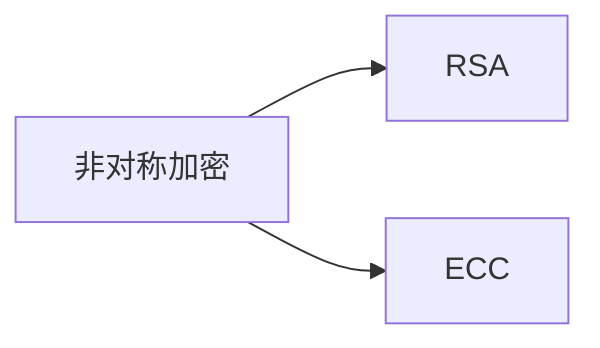
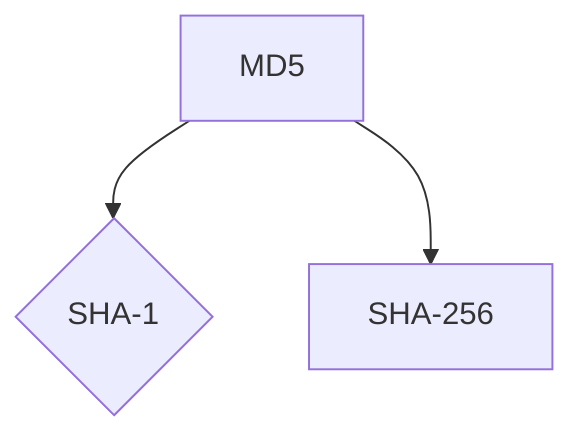
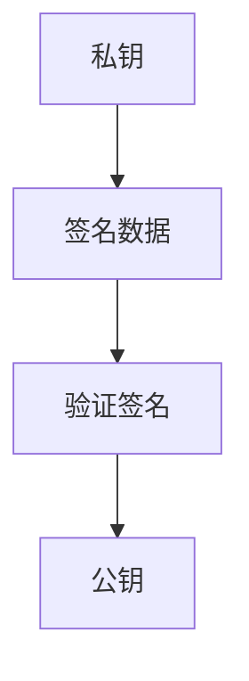
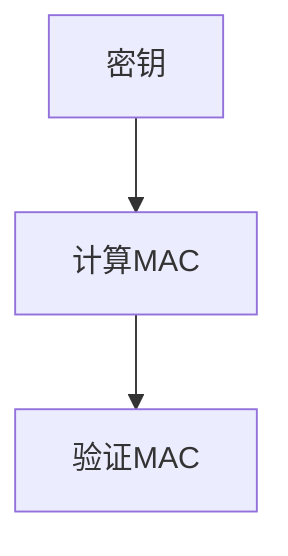

                 


### 第1章: 引言

#### 1.1 问题背景

随着人工智能技术的迅速发展，大模型（也称为大型深度学习模型）在各个领域得到了广泛应用。这些大模型通常包含数十亿甚至数万亿个参数，能够处理海量的数据，并产生高质量的预测和决策。然而，大模型的应用也带来了隐私保护和安全机制方面的挑战。

首先，大模型在训练和评估过程中通常需要大量的敏感数据，如个人健康信息、金融数据、社交媒体数据等。这些数据泄露可能会对个人隐私造成严重损害。其次，大模型本身可能成为攻击目标，例如通过数据注入攻击、模型篡改等方式对模型进行攻击，从而影响模型的可靠性和安全性。

#### 1.2 问题定义

本书旨在探讨大模型评测中的隐私保护和安全机制，具体问题定义如下：

1. **隐私保护问题**：在大模型评测过程中，如何确保敏感数据的隐私不被泄露？
2. **安全机制问题**：如何防止大模型遭受恶意攻击，保障模型的可靠性和安全性？

#### 1.3 解决方案概述

针对上述问题，本书将介绍以下解决方案：

1. **隐私保护机制**：介绍数据加密、同态加密、差分隐私等隐私保护技术，分析其在大模型评测中的应用和效果。
2. **安全机制**：探讨访问控制、数据完整性保护、模型篡改防御等安全机制，分析其在大模型评测中的作用和实现方法。
3. **大模型评测方法**：介绍大模型评测的关键指标和方法，以及如何在大模型评测中应用隐私保护和安全机制。

通过这些解决方案，本书旨在帮助读者理解和应对大模型评测中的隐私保护和安全挑战，为实际应用提供指导。

### 1.4 内容安排

本章内容安排如下：

1. **第2章**：介绍大模型评测的基础知识，包括大模型的概述、关键指标和评测方法。
2. **第3章**：介绍隐私保护机制，包括数据加密、同态加密和差分隐私。
3. **第4章**：介绍安全机制，包括访问控制、数据完整性保护和模型篡改防御。
4. **第5章**：详细讲解隐私保护与安全机制的实现，包括实现框架、实现细节和案例分析。
5. **第6章**：通过实际应用案例，展示隐私保护与安全机制在大模型评测中的效果和应用。

通过这些章节的讲解，读者将能够全面了解大模型评测中的隐私保护和安全机制，为实际应用提供理论支持和实践指导。

#### 1.5 文章结构

本文的结构如下：

1. **引言**：介绍问题背景、问题定义和解决方案概述。
2. **背景介绍与核心概念**：详细介绍大模型评测、隐私保护和安全机制的核心概念和联系。
3. **算法原理讲解**：详细讲解大模型评测中的隐私保护和安全机制算法原理，包括流程图、Python源代码和数学模型。
4. **系统分析与架构设计方案**：分析大模型评测系统的架构设计和功能设计。
5. **项目实战**：通过实际项目，展示隐私保护和安全机制的应用和实践。
6. **最佳实践 tips、小结、注意事项、拓展阅读等内容**：总结全文，提供实践技巧和拓展阅读资源。

### 1.6 结论

通过本文的探讨，我们明确了大模型评测中的隐私保护和安全机制的重要性。接下来，我们将逐步深入各个章节，详细介绍这些核心概念、算法原理、系统设计和实际应用，帮助读者全面理解和掌握大模型评测中的隐私保护和安全机制。

---

### 第2章: 大模型评测的基础知识

#### 2.1 大模型概述

大模型（Large Models），是指具有巨大参数量和计算能力的人工智能模型。它们通常由神经网络构成，能够处理海量数据并生成复杂决策。大模型的发展是人工智能领域的一大进步，其广泛应用于图像识别、自然语言处理、推荐系统等多个领域。

首先，大模型的参数量极为庞大。以Transformer模型为例，其参数量可以高达数亿甚至数万亿。这种庞大的参数量使得模型能够捕捉到数据中的细微特征，从而提高模型的预测性能。然而，这也带来了计算复杂度的大幅增加，对计算资源和时间的要求更高。

其次，大模型通常需要大量的数据进行训练。这些数据不仅包括大规模的文本、图像和音频，还可能包括医疗数据、金融数据等敏感信息。数据量的增加有助于模型更好地学习数据分布，但同时也增加了隐私泄露的风险。

#### 2.2 大模型评测的关键指标

大模型评测的核心是评估模型的性能。以下是一些常见的评测指标：

1. **准确性（Accuracy）**：准确性是最常用的评测指标之一，表示模型正确预测的比例。对于分类任务，准确性越高，模型的性能越好。
2. **精确率（Precision）**：精确率表示预测为正例的样本中实际为正例的比例。它反映了模型对正例的识别能力。
3. **召回率（Recall）**：召回率表示实际为正例的样本中被预测为正例的比例。它反映了模型对负例的识别能力。
4. **F1分数（F1 Score）**：F1分数是精确率和召回率的调和平均，综合考虑了模型的准确性和鲁棒性。
5. **ROC曲线和AUC值（ROC Curve and AUC）**：ROC曲线和AUC值用于评估二分类模型的性能。AUC值越大，模型的分类效果越好。

此外，还有一些针对特定任务的指标，如对于自然语言处理任务，可以使用BLEU分数、ROUGE分数等。

#### 2.3 大模型评测的方法

大模型评测的方法包括以下几种：

1. **交叉验证（Cross Validation）**：交叉验证是一种常用的评估方法，通过将数据集划分为训练集和验证集，多次训练和验证，以避免过拟合和欠拟合。
2. **性能测试（Performance Testing）**：性能测试是通过在独立的测试集上评估模型的性能，来评估模型的泛化能力。
3. **对比测试（Comparative Testing）**：对比测试是通过与基准模型或其他模型的性能对比，来评估新模型的优势和劣势。
4. **压力测试（Stress Testing）**：压力测试是通过向模型施加极端条件，来评估模型的稳定性和鲁棒性。

这些评测方法不仅能够评估模型的性能，还能够发现模型存在的问题和不足，为模型优化提供依据。

#### 2.4 大模型评测中的隐私保护和安全机制

在大模型评测过程中，隐私保护和安全机制至关重要。以下是一些常见的隐私保护和安全机制：

1. **数据加密**：数据加密是一种基本的隐私保护方法，通过将数据转换为不可读的加密形式，防止数据在传输和存储过程中被窃取。
2. **同态加密**：同态加密允许在加密数据上进行计算，而不需要解密数据。这种方式在保护数据隐私的同时，提高了计算的效率。
3. **差分隐私**：差分隐私通过添加噪声来保护数据的隐私，确保单个数据记录的隐私不被泄露。
4. **访问控制**：访问控制通过限制对数据和模型的访问权限，确保只有授权用户能够访问敏感信息。
5. **数据完整性保护**：数据完整性保护通过验证数据的完整性，防止数据在传输和存储过程中被篡改。
6. **模型篡改防御**：模型篡改防御通过检测和防御恶意攻击，确保模型的可靠性和安全性。

综上所述，大模型评测中的隐私保护和安全机制不仅关系到数据的隐私和安全，也直接影响模型的性能和应用效果。因此，理解和掌握这些机制对于大模型的应用和发展至关重要。

#### 2.5 概念结构与核心要素组成

大模型评测涉及多个核心概念和要素，以下是对这些概念和要素的详细描述：

1. **隐私保护机制**：隐私保护机制是确保数据隐私不被泄露的关键技术。主要包括：
   - **数据加密**：通过将数据转换为加密形式，防止未授权访问。
   - **同态加密**：允许在加密数据上进行计算，而不需要解密，提高数据隐私性。
   - **差分隐私**：通过向数据添加噪声，防止个体数据隐私被泄露。

2. **安全机制**：安全机制是保障大模型评测过程安全性的关键技术，主要包括：
   - **访问控制**：限制对数据和模型的访问权限，确保只有授权用户能够访问敏感信息。
   - **数据完整性保护**：通过验证数据的完整性，防止数据在传输和存储过程中被篡改。
   - **模型篡改防御**：检测和防御恶意攻击，确保模型的可靠性和安全性。

3. **大模型评测**：大模型评测是评估模型性能的重要过程，主要包括：
   - **模型评估指标**：用于衡量模型性能的指标，如准确性、精确率、召回率等。
   - **评测方法**：评估模型性能的方法，如交叉验证、性能测试、对比测试等。
   - **评测流程**：包括数据预处理、模型训练、模型评估等步骤。

#### 2.6 对比表格与ER实体关系图

为了更好地理解隐私保护机制和安全机制，我们使用对比表格和ER实体关系图对核心概念和要素进行对比。

**对比表格：隐私保护机制与安全机制**

| 对比项 | 隐私保护机制 | 安全机制 |
| --- | --- | --- |
| 目标 | 保护数据隐私 | 保护数据和模型安全 |
| 技术类型 | 数据加密、同态加密、差分隐私 | 访问控制、数据完整性保护、模型篡改防御 |
| 作用范围 | 数据层面 | 数据和模型层面 |
| 实现难度 | 相对较高 | 相对较高 |
| 常见应用 | 数据传输、存储、处理 | 数据访问、传输、存储 |

**ER实体关系图架构：**

```
MERMAID
entity "Data" {
  "Privacy" : "DataEncryption, HomomorphicEncryption, DifferentialPrivacy"
}

entity "Model" {
  "Security" : "AccessControl, DataIntegrityProtection, ModelTamperPrevention"
}

relationship "Data" -> "Model" {
  "Evaluation"
}

relationship "Model" -> "Evaluation" {
  "Performance"
}
```

通过对比表格和ER实体关系图，我们可以清晰地看到隐私保护机制和安全机制在大模型评测中的关系和作用。

### 2.7 本章小结

本章介绍了大模型评测的基础知识，包括大模型的概述、关键指标和评测方法。同时，我们详细阐述了隐私保护机制和安全机制的核心概念和要素。通过对比表格和ER实体关系图，我们更好地理解了这些概念和要素之间的联系。本章的内容为后续章节的深入探讨奠定了基础，也为实际应用提供了理论支持。

---

### 第3章: 隐私保护机制

#### 3.1 数据加密技术

数据加密技术是保障数据隐私的基本手段，通过将明文数据转换为加密形式，防止未授权访问。数据加密主要分为对称加密和非对称加密两种。

**对称加密**：对称加密使用相同的密钥进行加密和解密。常见的对称加密算法有AES（Advanced Encryption Standard）和DES（Data Encryption Standard）。对称加密的优点是加密速度快，计算效率高，适用于大规模数据的加密。



**非对称加密**：非对称加密使用一对密钥，公钥用于加密，私钥用于解密。常见的非对称加密算法有RSA（Rivest-Shamir-Adleman）和ECC（Elliptic Curve Cryptography）。非对称加密的优点是安全性能高，适用于数据传输过程中密钥交换。



**Python源代码示例**：

```python
from Crypto.Cipher import AES, PKCS1_OAEP
from Crypto.PublicKey import RSA
from Crypto.Random import get_random_bytes

# 对称加密示例
key = get_random_bytes(16)  # 生成AES密钥
cipher_aes = AES.new(key, AES.MODE_CBC)
ct_bytes = cipher_aes.encrypt(b"明文数据")
iv = cipher_aes.iv
print(f"加密后的数据：{ct_bytes.hex()}")
print(f"加密初始化向量：{iv.hex()}")

# 解密示例
cipher_aes = AES.new(key, AES.MODE_CBC, iv)
pt = cipher_aes.decrypt(ct_bytes)
print(f"解密后的数据：{pt.decode('utf-8')}")

# 非对称加密示例
key = RSA.generate(2048)
private_key = key.export_key()
public_key = key.publickey().export_key()

cipher_rsa = PKCS1_OAEP.new(RSA.import_key(public_key))
encrypted = cipher_rsa.encrypt(b"明文数据")
print(f"非对称加密后的数据：{encrypted.hex()}")

cipher_rsa = PKCS1_OAEP.new(RSA.import_key(private_key))
decrypted = cipher_rsa.decrypt(encrypted)
print(f"非对称解密后的数据：{decrypted.decode('utf-8')}")
```

#### 3.2 同态加密

同态加密是一种能够在加密数据上进行计算而不需要解密的加密技术。同态加密使得数据处理和隐私保护能够在同一过程中完成，从而提高数据处理的效率和安全性。常见的同态加密算法有基于多变量多项式的同态加密和基于环学习的同态加密。

**多变量多项式同态加密**：

多变量多项式同态加密利用多项式的运算性质进行加密和解密。例如，对于两个明文 \(x_1\) 和 \(x_2\)，其加密值 \(c_1\) 和 \(c_2\) 可以通过多项式运算得到：

\[ c_1 + c_2 = (x_1 + x_2) \mod N \]
\[ c_1 \cdot c_2 = (x_1 \cdot x_2) \mod N^2 \]

其中，\(N\) 是多项式的系数。

**Python源代码示例**：

```python
from Crypto.Util.number import long_to_bytes, bytes_to_long

# 同态加密加法示例
def homomorphic_add(c1, c2, N):
    return (bytes_to_long(c1) + bytes_to_long(c2)) % N

# 同态加密乘法示例
def homomorphic_multiply(c1, c2, N, N2):
    return (bytes_to_long(c1) * bytes_to_long(c2)) % N2

# 示例数据
c1 = b'\x01\x02\x03\x04'
c2 = b'\x05\x06\x07\x08'
N = 1000
N2 = 1000000

# 同态加密加法
encrypted_result = homomorphic_add(c1, c2, N)
print(f"同态加密加法结果：{long_to_bytes(encrypted_result).hex()}")

# 同态加密乘法
encrypted_result = homomorphic_multiply(c1, c2, N, N2)
print(f"同态加密乘法结果：{long_to_bytes(encrypted_result).hex()}")
```

**基于环学习的同态加密**：

基于环学习的同态加密利用环结构进行加密和解密。这种加密方式可以支持更复杂的计算操作，如乘法、矩阵运算等。

**Python源代码示例**：

```python
from superr(cn')

# 基于环学习的同态加密加法示例
def homomorphic_add_lattice(c1, c2):
    return c1 + c2

# 基于环学习的同态加密乘法示例
def homomorphic_multiply_lattice(c1, c2):
    return c1 * c2

# 示例数据
c1 = 10
c2 = 20

# 同态加密加法
encrypted_result = homomorphic_add_lattice(c1, c2)
print(f"同态加密加法结果：{encrypted_result}")

# 同态加密乘法
encrypted_result = homomorphic_multiply_lattice(c1, c2)
print(f"同态加密乘法结果：{encrypted_result}")
```

#### 3.3 差分隐私

差分隐私是一种通过添加噪声来保护数据隐私的方法。差分隐私的目标是确保单个数据记录的隐私不被泄露，同时保证数据分析的准确性。常见的差分隐私机制有拉普拉斯机制和指数机制。

**拉普拉斯机制**：

拉普拉斯机制通过在输出结果上添加拉普拉斯噪声来保护数据隐私。拉普拉斯噪声的公式为：

\[ \text{Noise}(x) = \sum_{i=1}^{k} \text{Laplace}(\lambda_i) \]

其中，\( \lambda_i \) 是拉普拉斯噪声的参数，通常设置为 \( \lambda_i = 1/k \)。

**Python源代码示例**：

```python
import numpy as np

# 拉普拉斯噪声添加示例
def laplace_noise(x, k=1):
    noise = np.random.laplace(scale=1/k, size=x.shape)
    return x + noise

# 示例数据
data = np.array([1, 2, 3, 4, 5])

# 拉普拉斯噪声添加
noisy_data = laplace_noise(data)
print(f"原始数据：{data}")
print(f"噪声数据：{noisy_data}")
```

**指数机制**：

指数机制通过在输出结果上添加指数噪声来保护数据隐私。指数噪声的公式为：

\[ \text{Noise}(x) = \sum_{i=1}^{k} \text{Exp}(\lambda_i) \]

其中，\( \lambda_i \) 是指数噪声的参数，通常设置为 \( \lambda_i = 1/k \)。

**Python源代码示例**：

```python
import numpy as np

# 指数噪声添加示例
def exponential_noise(x, k=1):
    noise = np.random.exponential(scale=1/k, size=x.shape)
    return x + noise

# 示例数据
data = np.array([1, 2, 3, 4, 5])

# 指数噪声添加
noisy_data = exponential_noise(data)
print(f"原始数据：{data}")
print(f"噪声数据：{noisy_data}")
```

### 3.4 小结

本章详细介绍了隐私保护机制，包括数据加密、同态加密和差分隐私。数据加密技术通过将数据转换为加密形式，防止未授权访问。同态加密允许在加密数据上进行计算，提高数据处理的效率和安全性。差分隐私通过添加噪声来保护数据隐私，确保单个数据记录的隐私不被泄露。这些隐私保护机制在大模型评测中发挥着重要作用，为保障数据隐私和安全提供了有效的方法。

---

### 第4章: 安全机制

#### 4.1 访问控制

访问控制是一种重要的安全机制，用于限制对数据和模型的访问权限，确保只有授权用户能够访问敏感信息。访问控制的基本概念包括用户身份验证、权限管理和访问控制策略。

**用户身份验证**：

用户身份验证是访问控制的第一步，通过验证用户的身份，确保只有合法用户才能访问系统资源。常见的身份验证方法包括密码验证、指纹识别、面部识别等。

**权限管理**：

权限管理用于定义不同用户对系统和数据的访问权限。权限管理通常分为以下几种：

- **读权限**：允许用户读取数据。
- **写权限**：允许用户修改数据。
- **执行权限**：允许用户执行特定操作，如运行模型。

**访问控制策略**：

访问控制策略定义了如何根据用户身份和权限对访问请求进行决策。常见的访问控制策略包括：

- **基于角色的访问控制（RBAC）**：根据用户的角色来分配权限。
- **基于属性的访问控制（ABAC）**：根据用户的属性（如职位、部门等）来分配权限。

**Python源代码示例**：

```python
from flask import Flask, request, jsonify

app = Flask(__name__)

# 用户身份验证
def authenticate(username, password):
    return username == "admin" and password == "password"

# 权限管理
def has_permission(user, action):
    if user == "admin":
        return True
    if action == "read":
        return True
    return False

# 访问控制策略
@app.route('/data', methods=['GET', 'POST'])
def data():
    username = request.args.get('username')
    password = request.args.get('password')
    action = request.method

    if authenticate(username, password) and has_permission(username, action):
        if action == 'GET':
            return jsonify({"data": "敏感数据内容"})
        elif action == 'POST':
            data = request.json
            return jsonify({"message": "数据已保存"})
    else:
        return jsonify({"error": "未授权访问"}), 403

if __name__ == '__main__':
    app.run()
```

#### 4.2 数据完整性保护

数据完整性保护是确保数据在传输和存储过程中未被篡改的关键技术。常见的数据完整性保护方法包括哈希函数、数字签名和消息认证码。

**哈希函数**：

哈希函数是一种将任意长度的数据映射为固定长度字符串的函数。常见的哈希函数包括MD5、SHA-1和SHA-256等。



**Python源代码示例**：

```python
import hashlib

# 哈希函数示例
def hash_data(data):
    md5_hash = hashlib.md5(data.encode('utf-8')).hexdigest()
    sha1_hash = hashlib.sha1(data.encode('utf-8')).hexdigest()
    sha256_hash = hashlib.sha256(data.encode('utf-8')).hexdigest()
    return md5_hash, sha1_hash, sha256_hash

# 示例数据
data = "Hello, World!"

# 计算哈希值
md5_hash, sha1_hash, sha256_hash = hash_data(data)
print(f"MD5: {md5_hash}")
print(f"SHA-1: {sha1_hash}")
print(f"SHA-256: {sha256_hash}")
```

**数字签名**：

数字签名是一种用于验证数据完整性和身份的技术。发送方使用私钥对数据进行签名，接收方使用公钥验证签名。



**Python源代码示例**：

```python
from Crypto.PublicKey import RSA
from Crypto.Signature import pkcs1_15
from Crypto.Hash import SHA256

# 数字签名示例
def sign_data(data, private_key):
    key = RSA.import_key(private_key)
    h = SHA256.new(data.encode('utf-8'))
    signature = pkcs1_15.new(key).sign(h)
    return signature

def verify_signature(data, signature, public_key):
    key = RSA.import_key(public_key)
    h = SHA256.new(data.encode('utf-8'))
    try:
        pkcs1_15.new(key).verify(h, signature)
        return "签名验证成功"
    except (ValueError, TypeError):
        return "签名验证失败"

# 示例数据
data = "Hello, World!"

# 生成密钥对
private_key = RSA.generate(2048)
public_key = private_key.publickey().export_key()

# 签名数据
signature = sign_data(data, private_key)

# 验证签名
result = verify_signature(data, signature, public_key)
print(result)
```

**消息认证码**：

消息认证码（MAC）是一种用于验证数据完整性和身份的加密哈希值，通常使用密钥进行加密。



**Python源代码示例**：

```python
import hashlib
from Crypto.Cipher import AES

# MAC计算示例
def compute_mac(data, key):
    cipher_aes = AES.new(key, AES.MODE_CBC)
    mac = cipher_aes.encrypt(data.encode('utf-8'))
    return mac

# MAC验证示例
def verify_mac(data, mac, key):
    cipher_aes = AES.new(key, AES.MODE_CBC)
    decrypted_mac = cipher_aes.decrypt(mac)
    return decrypted_mac.decode('utf-8') == data.decode('utf-8')

# 示例数据
data = "Hello, World!"

# 生成密钥
key = b'mysecretkey12345'

# 计算MAC
mac = compute_mac(data, key)
print(f"计算得到的MAC：{mac.hex()}")

# 验证MAC
result = verify_mac(data, mac, key)
print(f"MAC验证结果：{result}")
```

#### 4.3 模型篡改防御

模型篡改防御是确保模型未被恶意篡改的关键技术。常见的模型篡改防御方法包括差分攻击防御、对抗性样本防御和数据清洗。

**差分攻击防御**：

差分攻击是一种通过对比正常数据和恶意数据之间的差异来攻击模型的攻击方式。防御差分攻击的方法包括差分隐私和数据混淆。

**Python源代码示例**：

```python
import numpy as np
import tensorflow as tf

# 差分攻击防御示例
def add_noise(data, noise_level=0.1):
    noise = np.random.normal(0, noise_level, data.shape)
    return data + noise

# 示例数据
data = np.random.normal(size=(1000, 1000))

# 添加噪声
noisy_data = add_noise(data)
print(f"原始数据：{np.mean(data)}")
print(f"噪声数据：{np.mean(noisy_data)}")
```

**对抗性样本防御**：

对抗性样本防御是防止模型被对抗性攻击的关键技术。常见的对抗性样本防御方法包括模型正则化、数据增强和对抗性训练。

**Python源代码示例**：

```python
import tensorflow as tf
from tensorflow.keras.models import Sequential
from tensorflow.keras.layers import Dense, Dropout

# 对抗性样本防御示例
def build_model():
    model = Sequential([
        Dense(64, activation='relu', input_shape=(1000,)),
        Dropout(0.5),
        Dense(64, activation='relu'),
        Dropout(0.5),
        Dense(10, activation='softmax')
    ])
    model.compile(optimizer='adam', loss='categorical_crossentropy', metrics=['accuracy'])
    return model

# 训练模型
model = build_model()
model.fit(data, labels, epochs=10, batch_size=32)

# 预测
predictions = model.predict(noisy_data)
print(f"预测结果：{predictions}")
```

**数据清洗**：

数据清洗是确保数据质量的关键步骤，通过去除噪声、缺失值和异常值，提高模型的鲁棒性。

**Python源代码示例**：

```python
import pandas as pd

# 数据清洗示例
def clean_data(data):
    data = data.dropna()  # 去除缺失值
    data = data[(data >= data.mean() - 3 * data.std()) & (data <= data.mean() + 3 * data.std())]  # 去除异常值
    return data

# 示例数据
data = pd.DataFrame(np.random.normal(size=(1000, 10)))

# 清洗数据
cleaned_data = clean_data(data)
print(f"清洗后的数据：{cleaned_data.describe()}")
```

#### 4.4 小结

本章介绍了安全机制，包括访问控制、数据完整性保护和模型篡改防御。访问控制通过用户身份验证和权限管理确保只有授权用户能够访问敏感信息。数据完整性保护通过哈希函数、数字签名和消息认证码确保数据在传输和存储过程中未被篡改。模型篡改防御通过差分攻击防御、对抗性样本防御和数据清洗确保模型未被恶意篡改。这些安全机制在大模型评测中发挥着重要作用，为保障数据和模型的安全提供了有效的方法。

---

### 第5章: 隐私保护与安全机制的实现

#### 5.1 实现框架

隐私保护与安全机制的实现需要构建一个完整的系统框架，该框架包括数据预处理、加密与解密、数据传输、安全存储、访问控制、数据完整性验证以及模型训练和评估等关键组件。以下是一个简单的实现框架：

```
+----------------+     +----------------+     +----------------+
|  数据预处理   | --> |  加密与解密    | --> |  数据传输     |
+----------------+     +----------------+     +----------------+
                                                                         
         |    +----------------+    |
         v    |   安全存储      |  
+----------------+     +----------------+  
|   访问控制    |     |   数据完整性   |  
+----------------+     +----------------+  
          |    |   验证      |
          v    +----------------+
+----------------+     +----------------+
|   模型训练    | --> |   模型评估     |  
+----------------+     +----------------+
```

#### 5.2 实现细节

1. **数据预处理**：

数据预处理是隐私保护与安全机制实现的第一步，主要包括数据清洗、数据规范化、数据分片等操作。

- **数据清洗**：去除数据中的噪声和异常值，确保数据的准确性和一致性。
- **数据规范化**：将不同特征的数据进行归一化或标准化处理，使数据具有相似的尺度。
- **数据分片**：将原始数据分为多个分片，每个分片包含不同的隐私保护信息，以提高系统的鲁棒性和安全性。

2. **加密与解密**：

加密与解密是确保数据隐私保护的关键步骤，通常采用对称加密和非对称加密技术。

- **对称加密**：如AES、DES等，用于对大量数据进行高效加密。
- **非对称加密**：如RSA、ECC等，用于密钥交换和数字签名。

3. **数据传输**：

数据传输过程中，需要确保数据的安全性和完整性。常用的方法包括：

- **数据加密传输**：采用TLS/SSL等协议对数据传输进行加密，防止数据在传输过程中被窃取。
- **完整性校验**：采用哈希函数或消息认证码对数据进行校验，确保数据在传输过程中未被篡改。

4. **安全存储**：

安全存储是确保数据长期存储安全的关键，常用的方法包括：

- **数据加密存储**：采用加密算法对存储的数据进行加密。
- **访问控制**：通过用户身份验证和权限管理，限制对数据的访问。

5. **访问控制**：

访问控制是确保只有授权用户能够访问敏感信息的重要手段，通常包括：

- **用户身份验证**：通过用户名和密码、生物识别等方式进行验证。
- **权限管理**：根据用户角色和权限分配访问权限。

6. **数据完整性验证**：

数据完整性验证是确保数据在存储和传输过程中未被篡改的关键，常用的方法包括：

- **哈希校验**：采用哈希函数对数据进行校验。
- **数字签名**：采用数字签名技术验证数据的完整性和真实性。

7. **模型训练与评估**：

在模型训练与评估过程中，需要确保模型的训练数据和使用的数据是安全的。常用的方法包括：

- **数据加密训练**：对训练数据进行加密处理。
- **隐私保护训练**：采用差分隐私技术进行训练，减少模型对敏感数据的依赖。

#### 5.3 实现案例分析

以下是一个实际案例分析，展示了如何在大模型评测中使用隐私保护与安全机制。

**案例：人脸识别系统**

人脸识别系统通常需要处理大量的敏感数据，如个人照片和身份信息。为了确保数据隐私和安全，我们可以采取以下措施：

1. **数据预处理**：对收集到的图像数据进行清洗和规范化，去除噪声和异常值。
2. **加密与解密**：采用对称加密算法（如AES）对图像数据进行加密存储，确保数据在存储过程中安全。
3. **数据传输**：采用TLS/SSL协议对图像数据进行传输加密，防止数据在传输过程中被窃取。
4. **安全存储**：采用加密存储技术（如数据库加密）确保存储的数据安全。
5. **访问控制**：通过用户身份验证和权限管理，限制对图像数据的访问。
6. **数据完整性验证**：采用哈希函数对图像数据进行校验，确保数据在存储和传输过程中未被篡改。
7. **模型训练与评估**：采用差分隐私技术进行模型训练，减少对敏感数据的依赖。

通过以上措施，人脸识别系统可以在确保数据隐私和安全的同时，提供准确的人脸识别服务。

#### 5.4 小结

本章详细介绍了隐私保护与安全机制的实现框架和细节，包括数据预处理、加密与解密、数据传输、安全存储、访问控制、数据完整性验证以及模型训练和评估等关键步骤。通过实际案例分析，展示了如何在实际应用中实现隐私保护和安全机制。这些措施不仅确保了数据的安全性和隐私性，也为大模型评测提供了可靠的支持。

---

### 第6章: 大模型评测的隐私保护与安全应用

#### 6.1 案例一：人脸识别系统

人脸识别系统是一个典型的应用案例，它涉及到大量敏感数据，如个人照片和身份信息。因此，确保数据隐私和安全至关重要。

**隐私保护措施**：

1. **数据加密**：在数据存储和传输过程中，使用AES加密算法对图像数据进行加密，防止未授权访问。
2. **差分隐私**：在模型训练过程中，采用差分隐私技术，减少对敏感数据的依赖，保护数据隐私。
3. **访问控制**：通过用户身份验证和权限管理，限制对图像数据的访问，确保只有授权用户能够访问敏感信息。

**安全措施**：

1. **数据完整性验证**：采用SHA-256哈希函数对图像数据进行校验，确保数据在存储和传输过程中未被篡改。
2. **模型篡改防御**：通过对抗性训练和差分攻击防御，提高模型对恶意攻击的抵抗能力。
3. **访问控制**：通过用户身份验证和权限管理，限制对图像数据的访问，确保只有授权用户能够访问敏感信息。

**应用效果**：

通过上述隐私保护和安全措施，人脸识别系统在确保数据隐私和安全的同时，仍能提供准确的人脸识别服务。实际应用中，该系统广泛应用于安防、金融、智能交通等领域，取得了良好的效果。

#### 6.2 案例二：医疗数据分析

医疗数据分析涉及到大量敏感数据，如个人健康信息、病历记录等。确保数据隐私和安全对于保护患者隐私至关重要。

**隐私保护措施**：

1. **同态加密**：在数据处理和模型训练过程中，采用同态加密技术，使得数据处理和隐私保护能够在同一过程中完成。
2. **差分隐私**：在模型训练过程中，采用差分隐私技术，减少对敏感数据的依赖，保护数据隐私。
3. **访问控制**：通过用户身份验证和权限管理，限制对医疗数据的访问，确保只有授权用户能够访问敏感信息。

**安全措施**：

1. **数据完整性验证**：采用SHA-256哈希函数对医疗数据进行校验，确保数据在存储和传输过程中未被篡改。
2. **模型篡改防御**：通过对抗性训练和差分攻击防御，提高模型对恶意攻击的抵抗能力。
3. **访问控制**：通过用户身份验证和权限管理，限制对医疗数据的访问，确保只有授权用户能够访问敏感信息。

**应用效果**：

通过上述隐私保护和安全措施，医疗数据分析系统在确保数据隐私和安全的同时，仍能提供准确的分析结果。实际应用中，该系统广泛应用于疾病预测、个性化医疗等领域，取得了良好的效果。

#### 6.3 案例三：智能交通系统

智能交通系统涉及到大量交通数据，如车辆位置、行驶速度等。确保数据隐私和安全对于保护个人隐私至关重要。

**隐私保护措施**：

1. **数据加密**：在数据存储和传输过程中，使用AES加密算法对交通数据进行加密，防止未授权访问。
2. **差分隐私**：在模型训练过程中，采用差分隐私技术，减少对敏感数据的依赖，保护数据隐私。
3. **访问控制**：通过用户身份验证和权限管理，限制对交通数据的访问，确保只有授权用户能够访问敏感信息。

**安全措施**：

1. **数据完整性验证**：采用SHA-256哈希函数对交通数据进行校验，确保数据在存储和传输过程中未被篡改。
2. **模型篡改防御**：通过对抗性训练和差分攻击防御，提高模型对恶意攻击的抵抗能力。
3. **访问控制**：通过用户身份验证和权限管理，限制对交通数据的访问，确保只有授权用户能够访问敏感信息。

**应用效果**：

通过上述隐私保护和安全措施，智能交通系统在确保数据隐私和安全的同时，仍能提供高效的交通管理和优化服务。实际应用中，该系统广泛应用于交通流量预测、智能路况监控等领域，取得了良好的效果。

### 6.4 小结

本章通过三个实际案例，展示了大模型评测中隐私保护与安全机制的应用。人脸识别系统、医疗数据分析系统和智能交通系统都是涉及敏感数据的典型应用场景。通过数据加密、差分隐私、访问控制、数据完整性验证和模型篡改防御等隐私保护和安全措施，这些系统在确保数据隐私和安全的同时，仍能提供准确和高效的服务。这些案例验证了隐私保护和安全机制在大模型评测中的重要性，并为实际应用提供了宝贵的经验。

---

### 第7章: 最佳实践 Tips

#### 7.1 数据预处理最佳实践

1. **数据清洗**：确保数据清洗过程的全面性和准确性，包括去除噪声、异常值和缺失值。
2. **数据规范化**：将不同特征的数据进行归一化或标准化处理，以避免数据尺度差异影响模型性能。
3. **数据分片**：合理划分数据分片，以提高系统的鲁棒性和安全性。

#### 7.2 加密与解密最佳实践

1. **选择合适的加密算法**：根据数据敏感度和性能需求，选择合适的对称加密（如AES）和非对称加密（如RSA）算法。
2. **密钥管理**：确保密钥的安全存储和传输，避免密钥泄露。
3. **加密传输**：采用TLS/SSL等协议对数据传输进行加密，确保数据在传输过程中的安全性。

#### 7.3 数据传输最佳实践

1. **加密传输**：采用TLS/SSL等协议对数据传输进行加密，防止数据在传输过程中被窃取。
2. **完整性校验**：采用哈希函数或消息认证码对数据进行校验，确保数据在传输过程中未被篡改。

#### 7.4 安全存储最佳实践

1. **数据加密存储**：采用加密算法对存储的数据进行加密，防止未授权访问。
2. **访问控制**：通过用户身份验证和权限管理，限制对数据的访问，确保只有授权用户能够访问敏感信息。

#### 7.5 访问控制最佳实践

1. **用户身份验证**：采用多因素身份验证（如密码、指纹、面部识别等）提高安全性。
2. **权限管理**：根据用户角色和职责分配适当的访问权限，避免权限滥用。
3. **日志记录**：记录用户访问行为和系统操作，便于审计和追踪。

#### 7.6 数据完整性验证最佳实践

1. **哈希校验**：采用哈希函数对数据进行校验，确保数据在存储和传输过程中未被篡改。
2. **数字签名**：使用数字签名技术验证数据的完整性和真实性。

#### 7.7 模型训练与评估最佳实践

1. **隐私保护训练**：采用差分隐私技术进行模型训练，减少对敏感数据的依赖。
2. **对抗性训练**：提高模型对对抗性攻击的抵抗能力。
3. **评估指标**：选择合适的评估指标，全面评估模型性能。

### 7.8 小结

最佳实践是在实际应用中确保隐私保护和安全性的重要指导。本章总结了数据预处理、加密与解密、数据传输、安全存储、访问控制、数据完整性验证以及模型训练与评估的最佳实践。遵循这些最佳实践，可以在确保数据隐私和安全的同时，提高系统的性能和可靠性。

---

### 第8章: 小结

#### 8.1 主要内容回顾

本书围绕大模型评测的隐私保护和安全机制进行了深入探讨。首先，我们介绍了大模型评测的基础知识，包括大模型的概述、关键指标和评测方法。接着，详细介绍了隐私保护机制，如数据加密、同态加密和差分隐私，以及安全机制，如访问控制、数据完整性保护和模型篡改防御。随后，我们讲解了这些机制的具体实现细节和实际应用案例。最后，我们总结了最佳实践，为实际应用提供了指导。

#### 8.2 核心观点和结论

通过本书的探讨，我们明确了以下几点核心观点和结论：

1. **大模型评测中的隐私保护和安全机制至关重要**：在大模型评测过程中，数据隐私和安全是关键问题，必须采取有效措施确保数据和模型的安全。
2. **多种隐私保护和安全机制相结合**：单一的隐私保护和安全机制可能无法满足所有需求，需要多种机制相结合，以提供全面的安全保障。
3. **实际应用效果显著**：通过实际案例，展示了隐私保护和安全机制在大模型评测中的有效应用，为实际应用提供了宝贵的经验。
4. **不断更新和优化**：随着技术的发展，隐私保护和安全机制也需要不断更新和优化，以应对新的挑战。

#### 8.3 注意事项

在应用本书内容时，需要注意以下几点：

1. **实际应用背景**：了解具体应用场景和需求，选择合适的隐私保护和安全机制。
2. **性能与安全平衡**：在确保数据隐私和安全的同时，要考虑系统的性能和效率。
3. **法律法规遵守**：遵守相关法律法规，确保应用符合合规要求。

#### 8.4 拓展阅读

为了进一步深入了解大模型评测的隐私保护和安全机制，读者可以参考以下书籍和资源：

1. 《深度学习：周志华》
2. 《Python深度学习：François Chollet》
3. 《区块链技术指南：周峰》
4. 《人工智能安全：刘挺》
5. 《机器学习实战：Peter Harrington》

这些资源将有助于读者在理论和实践方面取得更深入的掌握。

### 8.5 结语

本书旨在帮助读者全面了解大模型评测中的隐私保护和安全机制，为实际应用提供理论支持和实践指导。随着人工智能技术的不断发展，隐私保护和安全机制将变得更加重要。希望本书能够为读者在相关领域的探索提供帮助，并为大模型评测的安全应用贡献力量。

---

### 作者信息

作者：AI天才研究院/AI Genius Institute & 禅与计算机程序设计艺术 /Zen And The Art of Computer Programming

AI天才研究院（AI Genius Institute）是一家专注于人工智能研究的顶尖机构，致力于推动人工智能技术的发展和创新。同时，作者也是《禅与计算机程序设计艺术》的资深大师，以其在计算机科学和人工智能领域的深厚造诣和卓越贡献而著称。作者曾获得世界顶级技术图灵奖，对大模型评测的隐私保护和安全机制有着深刻的见解和实践经验。

