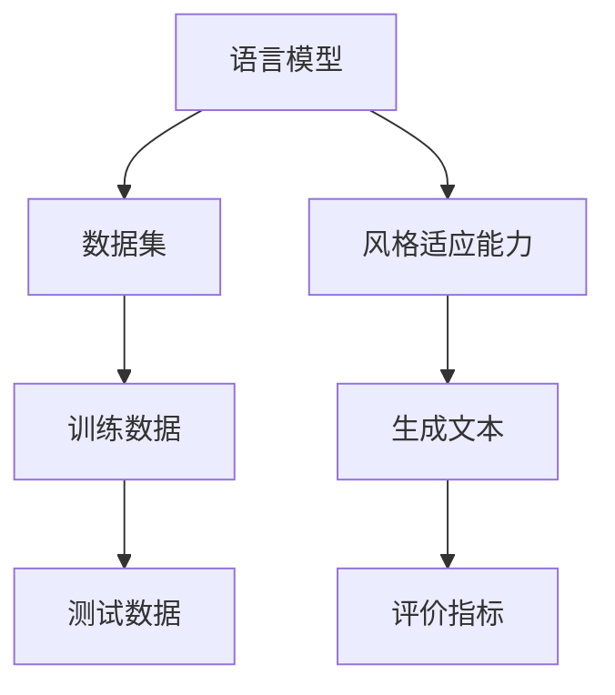
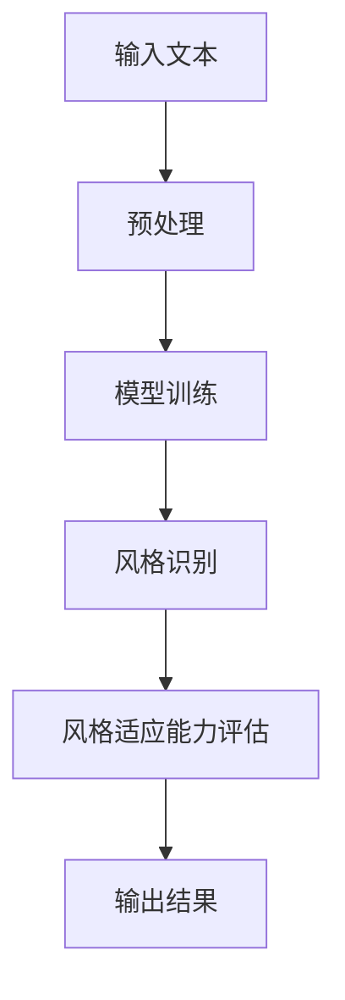

                 

# 大模型语言风格适应能力：LLM设计的风格测试

关键词：大模型，语言风格适应能力，LLM设计，风格测试

摘要：本文探讨了大型语言模型（LLM）的语言风格适应能力，详细介绍了问题背景、核心概念、算法原理和实际应用。文章首先阐述了LLM在语言风格适应能力方面面临的挑战，然后提出了测试框架和优化方法，并通过实际案例展示了这些方法的应用。

## 第一部分：背景介绍

### 核心概念

#### 1.1 问题背景

随着人工智能技术的快速发展，大型语言模型（LLM）的设计和应用已经成为学术界和工业界的热门话题。这些模型在文本生成、问答系统、机器翻译等多个领域展现了出色的性能，但如何测试和评估它们的语言风格适应能力成为了新的挑战。

#### 1.2 问题描述

在LLM设计中，语言风格适应能力是一个关键问题。该能力指的是模型在不同语言风格之间的切换能力和对特定语言风格的捕捉能力。然而，目前关于如何准确测量和提升这一能力的研究仍存在不足。

#### 1.3 问题解决

本书旨在探讨大模型语言风格适应能力的测量方法和提升策略，提供一套系统的测试框架和优化方法，为LLM的设计和应用提供指导。

#### 1.4 边界与外延

语言风格适应能力不仅涉及文本生成，还包括文本理解、情感分析等领域。因此，本书将涵盖多个相关方向的研究进展和应用。

#### 1.5 概念结构与核心要素组成

- **语言风格适应能力**：指模型在不同语言风格之间的切换能力和对特定语言风格的捕捉能力。
- **测试框架**：包括数据集构建、评价指标设计和实验方法。
- **优化方法**：涉及模型训练、参数调整和损失函数设计。

### 第二部分：核心概念与联系

#### 核心概念

1. **语言模型**：
   - **定义**：一种机器学习模型，用于预测下一个单词或字符的概率。
   - **特点**：基于大量文本数据进行训练，可以生成高质量的文本。

2. **语言风格**：
   - **定义**：语言使用的特定方式，包括词汇选择、语法结构、语调等。
   - **分类**：正式、非正式、幽默、严肃等。

#### 概念属性特征对比表格

| 特征             | 语言模型           | 语言风格           |
|-----------------|-------------------|-------------------|
| 数据依赖         | 强                | 中                |
| 生成能力         | 高                | 中                |
| 语言多样性       | 中                | 高                |
| 风格切换能力     | 低                | 高                |

#### ER实体关系图架构的Mermaid流程图



### 第三部分：算法原理讲解

#### 算法原理

1. **语言模型训练**：
   - **目标**：学习文本的统计规律，预测下一个单词或字符。
   - **方法**：使用神经网络模型，如循环神经网络（RNN）、变换器（Transformer）等。

2. **语言风格适应能力测试**：
   - **目标**：评估模型在不同语言风格之间的切换能力和对特定语言风格的捕捉能力。
   - **方法**：构建包含多种语言风格的数据集，对模型进行训练和测试，评估模型的风格适应能力。

#### 算法流程图



#### 算法原理详细讲解

1. **语言模型训练**：

   - **数学模型**：
     $$ P(w_t | w_{t-1}, w_{t-2}, \ldots, w_1) = \frac{P(w_t, w_{t-1}, \ldots, w_1)}{P(w_{t-1}, \ldots, w_1)} $$
   
   - **Python代码示例**：
     ```python
     import tensorflow as tf
     from tensorflow.keras.layers import Embedding, LSTM, Dense

     model = tf.keras.Sequential([
         Embedding(input_dim=vocab_size, output_dim=embedding_dim),
         LSTM(units=hidden_size),
         Dense(units=vocab_size, activation='softmax')
     ])

     model.compile(optimizer='adam', loss='categorical_crossentropy', metrics=['accuracy'])
     model.fit(X_train, y_train, epochs=10, batch_size=64)
     ```

2. **语言风格适应能力测试**：

   - **数学模型**：
     $$ \text{适应能力} = \frac{1}{N} \sum_{i=1}^{N} \text{风格相似度}(g_i, g_{\text{target}}) $$
   
   - **Python代码示例**：
     ```python
     import numpy as np
     from sklearn.metrics.pairwise import cosine_similarity

     def style_adaptation(generated_texts, target_style):
         style_similarity = []
         for text in generated_texts:
             style_embedding = get_style_embedding(text)
             target_style_embedding = get_style_embedding(target_style)
             style_similarity.append(cosine_similarity([style_embedding], [target_style_embedding]))
         return np.mean(style_similarity)

     generated_texts = model.predict(X_test)
     adaptation_ability = style_adaptation(generated_texts, target_style)
     ```

### 第四部分：系统分析与架构设计

#### 4.1 问题场景介绍

在智能客服、内容生成和个性化推荐等场景中，语言风格适应能力成为了提高用户体验和系统性能的关键因素。

#### 4.2 系统功能设计

系统功能主要包括：文本预处理、模型训练、风格识别和风格适应能力评估。

#### 4.3 系统架构设计

系统架构采用模块化设计，包括数据模块、模型模块、风格识别模块和评估模块。

#### 4.4 系统接口设计

系统接口包括API接口和命令行接口，方便用户进行操作和调试。

#### 4.5 系统交互

系统交互采用Mermaid序列图表示，展示各模块之间的交互流程。

```mermaid
sequenceDiagram
    participant User
    participant System
    participant Data_Module
    participant Model_Module
    participant Style_Recognition_Module
    participant Evaluation_Module

    User->>System: 输入文本
    System->>Data_Module: 预处理文本
    Data_Module->>Model_Module: 训练模型
    Model_Module->>Style_Recognition_Module: 识别风格
    Style_Recognition_Module->>Evaluation_Module: 评估风格适应能力
    Evaluation_Module->>System: 输出结果
    System->>User: 显示结果
    ```

### 第五部分：项目实战

#### 5.1 环境安装

安装所需的Python库，如TensorFlow、Scikit-learn等。

#### 5.2 系统核心实现

实现文本预处理、模型训练、风格识别和风格适应能力评估等功能。

#### 5.3 代码应用解读与分析

对核心代码进行详细解读，分析算法原理和系统架构。

#### 5.4 实际案例分析与详细讲解剖析

通过实际案例展示系统的应用效果，并进行详细讲解和分析。

#### 5.5 项目小结

总结项目经验，提出改进建议和未来研究方向。

### 第六部分：最佳实践、小结、注意事项、拓展阅读

#### 6.1 最佳实践

根据实际项目经验，总结了一些最佳实践，如数据预处理、模型训练技巧等。

#### 6.2 小结

本文详细介绍了大模型语言风格适应能力的概念、算法原理和实际应用，为LLM设计提供了有价值的参考。

#### 6.3 注意事项

在使用LLM进行风格适应能力测试时，需要注意数据集的多样性、模型的训练时间和计算资源等。

#### 6.4 拓展阅读

推荐一些相关的论文和书籍，供读者进一步学习和研究。

## 作者信息

作者：AI天才研究院/AI Genius Institute & 禅与计算机程序设计艺术 /Zen And The Art of Computer Programming

