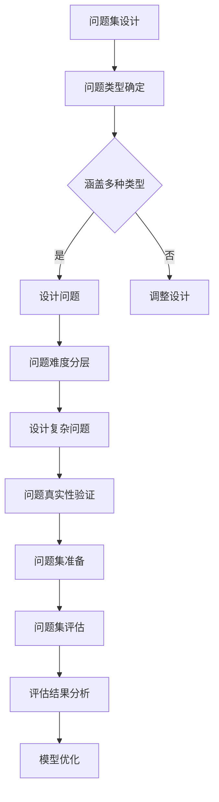

                 

## 引言

### 1.1 背景介绍

逻辑推理能力作为人工智能的核心竞争力，在当今科技迅猛发展的背景下愈发显得重要。随着大型语言模型（Large Language Model，简称LLM）如BERT、GPT-3等在自然语言处理（NLP）领域的突破性进展，评估LLM的逻辑推理能力成为了一个亟待解决的关键问题。LLM因其庞大的模型规模和深度学习技术，在处理自然语言、生成文本、翻译、问答等方面表现出了卓越的性能，但其在逻辑推理上的能力仍存在诸多局限和挑战。

首先，逻辑推理能力是指人工智能系统能够根据已有知识和信息，运用逻辑规则进行推断和判断的能力。逻辑推理不仅涉及到语言的理解和生成，还涉及到概念的抽象、关系的建立和推理规则的运用。而LLM的设计初衷主要是为了处理大规模的文本数据，其在逻辑推理方面的能力往往被忽视。事实上，逻辑推理能力对于人工智能的应用场景，如智能问答系统、决策支持系统、自动驾驶等，具有重要的意义。

其次，大模型的发展对逻辑推理能力评估提出了新的要求。传统评估方法往往基于预定义的规则和标准，而大模型的复杂性和不确定性使得这些方法难以适用。因此，如何设计一套有效的评估方法来衡量LLM的逻辑推理能力，成为当前人工智能研究中的一个热点问题。

最后，LLM设计的复杂问题集作为评估逻辑推理能力的核心工具，其设计原则和评估方法的研究也具有重要意义。复杂问题集不仅需要涵盖多种类型的逻辑推理问题，还要能够模拟实际应用场景中的复杂性，以便更全面地评估LLM的推理能力。

### 1.2 核心概念

#### 1.2.1 大模型概述

大模型是指具有巨大参数量和深度网络结构的人工智能模型，如深度神经网络（DNN）、卷积神经网络（CNN）和递归神经网络（RNN）等。大模型通过大量训练数据学习到复杂的数据特征和内在规律，能够进行高效的数据分析和模式识别。

大模型的发展经历了多个阶段。最初，基于统计方法和规则的人工智能系统在特定任务上表现有限。随着计算能力的提升和深度学习技术的发展，大模型逐渐成为人工智能研究的主流。特别是近年来，随着大规模数据集和分布式计算技术的应用，大模型在图像识别、自然语言处理、语音识别等领域取得了显著的成果。

大模型的结构与工作原理通常包括以下几个部分：

1. **输入层**：接收外部输入数据，如文本、图像或声音等。
2. **隐藏层**：进行特征提取和变换，每一层都能够对输入数据进行不同的变换和抽象。
3. **输出层**：根据训练数据学习到的规律，对输入数据做出预测或决策。

大模型的主要类型包括：

- **深度神经网络（DNN）**：通过多层非线性变换来学习数据的复杂特征。
- **卷积神经网络（CNN）**：适用于图像和视频等具有网格结构的输入数据。
- **递归神经网络（RNN）**：适用于序列数据，如文本、语音等。
- **转换器（Transformer）**：近年来在自然语言处理领域取得了突破性进展，成为大模型的主流结构。

#### 1.2.2 逻辑推理能力

逻辑推理能力是指人工智能系统根据已有知识和信息，运用逻辑规则进行推断和判断的能力。逻辑推理是人工智能的核心竞争力之一，对于智能问答、决策支持、自动驾驶等应用场景具有重要意义。

逻辑推理的基本概念包括：

- **推理规则**：用于推导新结论的逻辑规则，如演绎推理、归纳推理和类比推理。
- **知识表示**：用于表示事实和关系的符号系统，如命题逻辑、谓词逻辑和语义网络。

逻辑推理的类型和特点：

- **演绎推理**：从一般到个别的推理过程，具有确定性，结论的可靠性取决于前提的真实性。
- **归纳推理**：从个别到一般的推理过程，结论的可靠性取决于样本的代表性和数据量。
- **类比推理**：基于相似性进行推理，结论的可靠性取决于相似性的程度。

大模型在逻辑推理中的应用主要包括：

- **基于规则的推理**：大模型可以学习到大量的规则，用于自动推理和决策。
- **基于数据的推理**：大模型通过分析大量数据，学习到数据中的隐含逻辑关系，进行推理。
- **混合推理**：结合规则推理和数据推理，提高推理的准确性和效率。

#### 1.2.3 复杂问题集的概念

复杂问题集是指包含多种类型、难度和场景的推理问题集合，用于评估大型语言模型（LLM）的逻辑推理能力。复杂问题集的设计原则包括：

- **多样性**：涵盖多种类型的逻辑推理问题，如数学推理、常识推理和逻辑悖论等。
- **难度层次**：问题应具有不同的难度层次，以便全面评估LLM在不同难度问题上的推理能力。
- **代表性**：问题应具有代表性，能够反映实际应用场景中的复杂性。
- **真实性**：问题应基于真实世界中的情况，具有一定的应用价值。

复杂问题集的评估方法包括：

- **自动评估**：通过预设的评估指标，如准确率、召回率、F1值等，自动评估问题的推理结果。
- **专家评估**：邀请领域专家对推理结果进行评价，结合定量和定性分析，给出更全面的评估结果。

### 1.3 LLMO评估概述

#### 1.3.1 评估的目的与方法

LLMO评估旨在全面、客观地评估大型语言模型（LLM）的逻辑推理能力，为模型优化和应用提供指导。评估的目的包括：

- **模型优化**：通过评估识别出模型在逻辑推理方面的弱点，指导模型改进和优化。
- **应用指导**：为LLM在不同应用场景中的适用性提供评估依据，帮助用户更好地选择和使用模型。
- **学术研究**：为逻辑推理领域的研究提供实证数据，推动相关理论的完善和发展。

评估方法主要包括：

- **问题驱动评估**：根据预定义的问题集，逐个评估模型在各个问题上的推理能力。
- **场景驱动评估**：模拟实际应用场景，评估模型在特定任务中的推理能力。
- **混合评估**：结合问题驱动和场景驱动评估方法，提供更全面、准确的评估结果。

#### 1.3.2 评估的关键要素

评估LLM的逻辑推理能力需要考虑多个关键要素，包括：

- **问题类型**：评估问题应涵盖多种类型的逻辑推理，如数学推理、常识推理和逻辑悖论等。
- **问题难度**：问题应具有不同的难度层次，以便全面评估LLM在不同难度问题上的推理能力。
- **评估指标**：选择合适的评估指标，如准确率、召回率、F1值等，用于量化评估结果。
- **评估标准**：制定统一的评估标准，确保评估过程的公平性和一致性。

#### 1.3.3 评估的步骤与流程

LLM逻辑推理能力的评估步骤通常包括：

1. **问题集设计**：设计包含多种类型、难度和场景的推理问题集，确保问题的多样性和代表性。
2. **数据准备**：收集和整理评估数据，包括问题和答案，并对数据进行预处理。
3. **模型准备**：选择合适的LLM模型，并进行训练和调整，确保模型在评估数据上的表现稳定。
4. **问题评估**：逐个评估模型在各个问题上的推理能力，记录评估结果。
5. **结果分析**：对评估结果进行分析，识别模型在逻辑推理方面的优势和劣势。
6. **模型优化**：根据评估结果，指导模型优化，提高逻辑推理能力。
7. **总结与报告**：撰写评估报告，总结评估过程、结果和结论，为后续研究和应用提供参考。

#### 1.4 本书结构

本书分为五个部分，共九章，结构如下：

- **第一部分：引言**：介绍逻辑推理能力评估的背景、核心概念和评估方法。
- **第二部分：大模型逻辑推理能力评估基础**：详细阐述大模型和逻辑推理能力的基本概念，以及复杂问题集的设计原则和评估方法。
- **第三部分：大模型逻辑推理能力评估实践**：通过具体案例，展示如何进行大模型逻辑推理能力的评估实践。
- **第四部分：案例分析**：分析具体案例，探讨大模型逻辑推理能力评估的应用和挑战。
- **第五部分：LLM设计的复杂问题集构建与优化**：介绍复杂问题集的构建原则、优化策略和实际应用。

#### 1.5 本章小结

本章介绍了大模型逻辑推理能力评估的背景、核心概念和评估方法。通过对大模型和逻辑推理能力的概述，以及评估的目的、关键要素和步骤的详细阐述，为后续章节的内容奠定了基础。接下来，本书将深入探讨大模型逻辑推理能力评估的实践和应用，为读者提供更全面的了解和指导。

## 第一部分：引言

### 1.6 阅读建议与安排

为了更好地理解和掌握大模型逻辑推理能力评估的相关知识，读者可以根据以下建议进行阅读和安排：

1. **系统学习**：建议从第一部分开始，系统性地学习本书的内容。每个部分和章节都有其独特的主题和目标，通过逐步学习，可以建立起完整的知识体系。
   
2. **重点阅读**：在阅读过程中，对于第一部分的内容，建议重点关注核心概念和评估方法的阐述。这部分内容是理解后续章节的基础，对于新接触该领域的读者尤为重要。

3. **实践结合**：第三部分提供了具体的评估实践案例，读者可以在理解基本概念和方法的基础上，通过案例分析来加深对评估过程和方法的掌握。

4. **深入探讨**：在完成基础学习后，可以深入到第四部分和第五部分，通过具体案例研究和复杂问题集的构建与优化，进一步提升对评估实践的深入理解和应用能力。

5. **持续更新**：由于大模型和逻辑推理能力评估是一个快速发展的领域，读者应关注最新的研究成果和进展，以保持知识的时效性。

通过以上阅读建议，读者可以更有效地掌握大模型逻辑推理能力评估的知识，为实际应用和研究打下坚实的基础。

#### 1.7 本章小结

本章作为引言，介绍了大模型逻辑推理能力评估的背景、核心概念和评估方法。通过对大模型和逻辑推理能力的概述，以及评估的目的、关键要素和步骤的详细阐述，为读者提供了对整个评估过程的基本了解。接下来，本书将深入探讨大模型逻辑推理能力评估的实践和应用，为读者提供更全面和具体的指导。通过本章的学习，读者可以建立对大模型逻辑推理能力评估的整体框架，为后续内容的学习和理解打下基础。

## 第一部分：引言

### 1.8 本章小结

本章作为引言，首先介绍了大模型逻辑推理能力评估的背景和重要性。通过回顾大模型的发展历程和逻辑推理能力的基本概念，我们明确了评估LLM逻辑推理能力的必要性和挑战。接着，本章详细阐述了评估的目的、关键要素和评估步骤，为读者提供了一个清晰的评估框架。此外，本章还简要介绍了本书的结构和各部分内容安排，为后续章节的学习提供了指南。

通过本章的学习，读者可以对大模型逻辑推理能力评估有一个全面的了解，掌握评估的基本原理和方法。这将有助于读者在后续章节中深入探讨大模型逻辑推理能力的评估实践和优化策略，为实际应用和研究提供有力支持。

## 大模型逻辑推理能力评估基础

在深入了解大模型逻辑推理能力评估之前，我们需要对大模型和逻辑推理能力进行基本的概述。大模型和逻辑推理能力是评估的核心概念，也是理解整个评估过程的基础。

### 2.1 大模型概述

#### 2.1.1 大模型的发展历程

大模型的发展可以追溯到20世纪80年代，当时神经网络的研究开始兴起。随着计算机性能的提升和大规模数据的积累，神经网络在图像识别、语音识别等领域的应用取得了显著进展。特别是深度学习技术的突破，使得大模型的训练和优化变得更加高效和准确。

在2010年代，深度学习迎来了快速发展期。卷积神经网络（CNN）在图像识别领域的成功应用，使得大模型开始受到广泛关注。随后，递归神经网络（RNN）和其变种长短期记忆网络（LSTM）在序列数据处理上取得了显著成效。然而，这些模型在处理大规模文本数据时仍然存在一定的局限性。

随着2017年谷歌提出Transformer模型，并在此基础上开发出BERT、GPT等大模型，自然语言处理（NLP）领域发生了革命性的变化。这些大模型通过自注意力机制，能够更好地捕捉文本中的长距离依赖关系，使得其在文本生成、机器翻译、问答系统等方面表现出色。

#### 2.1.2 大模型的结构与工作原理

大模型的结构通常包括多个层次，从输入层到输出层，每一层都包含复杂的非线性变换和权重参数。以Transformer模型为例，其结构主要包括编码器（Encoder）和解码器（Decoder）两个部分。

1. **编码器**：编码器的输入是原始的文本序列，通过嵌入层将单词转换为向量表示。接着，通过多个自注意力层（Self-Attention Layer），编码器能够捕捉文本中的长距离依赖关系。每个自注意力层都包含多头注意力机制，使得模型能够并行处理文本中的不同部分。

2. **解码器**：解码器的输入是编码器输出的序列，同样通过嵌入层将单词转换为向量表示。在解码过程中，解码器通过多头注意力层（Multi-Head Attention Layer）和自注意力层（Self-Attention Layer），逐步生成输出序列。

大模型的工作原理是通过大量的训练数据学习到输入和输出之间的映射关系。在训练过程中，模型会不断调整权重参数，使得输出序列尽可能接近真实标签。通过反向传播和梯度下降等优化算法，模型能够自动调整参数，提高模型的准确性和泛化能力。

#### 2.1.3 大模型的主要类型

大模型的主要类型包括深度神经网络（DNN）、卷积神经网络（CNN）、递归神经网络（RNN）和Transformer等。

1. **深度神经网络（DNN）**：DNN是一种多层神经网络，通过多层非线性变换来学习数据的复杂特征。DNN在图像识别、语音识别等领域有广泛应用。

2. **卷积神经网络（CNN）**：CNN是一种专门用于处理具有网格结构数据（如图像和视频）的神经网络。CNN通过卷积层和池化层，能够有效提取图像中的局部特征和全局特征。

3. **递归神经网络（RNN）**：RNN是一种用于处理序列数据的神经网络，通过循环结构能够捕捉序列中的时间依赖关系。RNN在语音识别、机器翻译等任务中表现出色。

4. **Transformer**：Transformer是一种基于自注意力机制的神经网络，能够有效捕捉文本中的长距离依赖关系。Transformer在NLP领域取得了突破性进展，如BERT、GPT等大模型都是基于Transformer架构。

### 2.2 逻辑推理能力

#### 2.2.1 逻辑推理的基本概念

逻辑推理是指通过已有的知识和信息，运用逻辑规则进行推断和判断的过程。逻辑推理是人工智能的核心能力之一，对于智能问答、决策支持、自动驾驶等应用场景具有重要意义。

逻辑推理的基本概念包括：

1. **推理规则**：推理规则是用于推导新结论的逻辑规则，如演绎推理、归纳推理和类比推理等。推理规则通常包括前提和结论两部分，通过逻辑运算符（如“与”、“或”、“非”）将它们连接起来。

2. **知识表示**：知识表示是用于表示事实和关系的符号系统，如命题逻辑、谓词逻辑和语义网络等。知识表示的形式化和符号化使得逻辑推理能够形式化和自动化。

3. **推理过程**：推理过程是逻辑推理的核心，包括两个主要阶段：前提的提取和结论的推导。在前提提取阶段，系统从已有知识库中获取相关的前提信息；在结论推导阶段，系统运用推理规则和逻辑运算符，从前提中推导出新的结论。

#### 2.2.2 逻辑推理的类型与特点

逻辑推理主要分为以下几种类型：

1. **演绎推理**：演绎推理是从一般到个别的推理过程，结论的可靠性取决于前提的真实性。演绎推理具有确定性，能够得出绝对正确的结论。例如，所有人都会死（大前提），苏格拉底是人（小前提），因此苏格拉底会死（结论）。

2. **归纳推理**：归纳推理是从个别到一般的推理过程，结论的可靠性取决于样本的代表性和数据量。归纳推理具有不确定性，结论的可靠性随着样本数量的增加而提高。例如，观察到的所有天鹅都是白色的，因此推断所有天鹅都是白色的。

3. **类比推理**：类比推理是基于相似性进行推理的过程，结论的可靠性取决于相似性的程度。类比推理能够帮助人们发现新的知识和规律。例如，发现猫有九条命，推断狗也有类似的特性。

不同类型的逻辑推理具有不同的特点和应用场景：

- **演绎推理**适用于需要严格逻辑证明的领域，如数学、逻辑学等。
- **归纳推理**适用于需要从大量数据中提取规律和模式的领域，如统计学、机器学习等。
- **类比推理**适用于需要基于已有知识进行推理和预测的领域，如人工智能、医学诊断等。

#### 2.2.3 大模型在逻辑推理中的应用

大模型在逻辑推理中的应用主要包括以下两个方面：

1. **基于规则的推理**：大模型可以通过学习大量的规则，进行自动推理和决策。例如，在医疗诊断中，大模型可以根据病人的症状和检查结果，推理出可能的疾病。

2. **基于数据的推理**：大模型可以通过分析大量数据，学习到数据中的隐含逻辑关系，进行推理。例如，在自然语言处理中，大模型可以通过分析大量的文本数据，理解文本中的语义和逻辑关系，进行问答和文本生成。

3. **混合推理**：大模型可以结合规则推理和数据推理，提高推理的准确性和效率。例如，在智能问答系统中，大模型可以结合用户输入和预定义的规则库，进行快速、准确的推理和回答。

### 2.3 复杂问题集设计

#### 2.3.1 复杂问题的定义与特征

复杂问题是指那些需要多步骤推理和综合分析才能解决的问题。这类问题通常具有以下特征：

1. **多样性**：复杂问题涵盖多个领域和类型，如数学问题、逻辑问题、常识推理问题等。

2. **多步骤推理**：复杂问题通常需要多个步骤的推理和计算，才能得出最终答案。

3. **不确定性**：复杂问题往往具有不确定性，结论的可靠性取决于问题的假设和数据质量。

4. **综合性**：复杂问题需要综合运用多个领域的知识和方法，才能得到有效解决方案。

#### 2.3.2 复杂问题集的设计原则

复杂问题集的设计原则包括：

1. **代表性**：问题集应涵盖多种类型和难度层次，能够代表实际应用场景中的复杂性。

2. **多样性**：问题集应包含不同领域的复杂问题，如数学、逻辑、常识推理等，以提高评估的全面性。

3. **难度层次**：问题集应具有不同的难度层次，以便全面评估LLM在不同难度问题上的推理能力。

4. **真实性**：问题应基于真实世界中的情况，具有一定的应用价值，以便评估结果具有实际意义。

5. **可扩展性**：问题集应具有可扩展性，能够根据实际需求和研究成果不断更新和扩展。

#### 2.3.3 复杂问题集的评估方法

复杂问题集的评估方法主要包括以下几种：

1. **自动评估**：通过预设的评估指标，如准确率、召回率、F1值等，自动评估问题的推理结果。自动评估方法快速、高效，但可能存在主观性和局限性。

2. **专家评估**：邀请领域专家对推理结果进行评价，结合定量和定性分析，给出更全面的评估结果。专家评估方法具有主观性和不确定性，但能够提供更深入的分析和理解。

3. **混合评估**：结合自动评估和专家评估方法，提供更全面、准确的评估结果。混合评估方法综合了自动评估和专家评估的优点，能够提高评估的准确性和可靠性。

### 2.4 评估工具与指标

#### 2.4.1 常见评估工具介绍

在评估LLM逻辑推理能力时，常见的评估工具包括以下几种：

1. **标准化测试工具**：如GRE、SAT等标准化测试，用于评估个体的逻辑推理能力。

2. **在线评估平台**：如Kaggle、AI Challenger等，提供多种逻辑推理任务和评估指标，便于研究人员进行实验和比较。

3. **自定义评估工具**：根据具体任务和需求，开发自定义的评估工具，如自动评估系统、专家评估平台等。

#### 2.4.2 评估指标体系构建

评估指标体系的构建是评估LLM逻辑推理能力的关键。常见的评估指标包括：

1. **准确率**：模型在测试集上正确回答问题的比例，是最基本的评估指标。

2. **召回率**：模型正确回答的问题占总问题的比例，用于评估模型的全面性。

3. **F1值**：准确率和召回率的调和平均值，用于综合评估模型的性能。

4. **语义相似度**：通过计算模型生成的答案和标准答案之间的语义相似度，评估答案的质量。

5. **推理路径**：记录模型在推理过程中的每一步，分析推理的合理性和有效性。

#### 2.4.3 指标权重与评估标准

在构建评估指标体系时，需要考虑不同指标的重要性和相互关系，为每个指标分配适当的权重。常见的权重分配方法包括：

1. **均匀权重**：所有指标具有相同的权重，适用于指标之间重要性相似的情况。

2. **经验权重**：根据领域经验和专家意见，为每个指标分配权重，适用于有丰富经验的领域。

3. **机器学习方法**：使用机器学习算法，如线性回归、决策树等，为每个指标分配权重，适用于没有明确经验指导的领域。

评估标准是指评估过程中应遵循的规范和标准，包括：

1. **数据准备**：确保评估数据的真实性和可靠性，进行预处理和清洗。

2. **评估流程**：明确评估步骤和流程，确保评估过程的透明和可重复性。

3. **评估结果记录**：详细记录评估结果，包括每个指标的得分和综合评分。

4. **结果分析**：对评估结果进行分析和解释，识别模型的优点和不足。

### 2.5 本章小结

本章详细介绍了大模型逻辑推理能力评估的基础概念，包括大模型的发展历程、结构与类型，以及逻辑推理的基本概念和类型。同时，本章还阐述了复杂问题集的设计原则和评估方法，以及常见的评估工具和指标体系。通过本章的学习，读者可以建立对大模型逻辑推理能力评估的全面理解，为后续章节的深入探讨打下坚实的基础。

### 大模型逻辑推理能力评估实践

在了解了大模型逻辑推理能力评估的基础后，接下来我们将通过具体的实践案例，展示如何在实际中应用这些评估方法。这些实践案例不仅能够帮助我们更好地理解评估过程，还能够揭示在实际操作中可能遇到的问题和挑战。

#### 3.1 实践一：基础评估任务

**3.1.1 实践背景**

假设我们有一个大模型，如BERT或GPT，并希望评估其在逻辑推理任务上的表现。为了实现这一目标，我们设计了一个基础评估任务，任务包括多个逻辑推理问题，涵盖了演绎推理、归纳推理和常识推理等不同类型。

**3.1.2 实践目标**

通过这个基础评估任务，我们的目标是：

1. **了解模型在逻辑推理任务上的基本表现**。
2. **识别模型在不同类型逻辑推理中的优势和劣势**。
3. **为后续的模型优化提供依据**。

**3.1.3 实践步骤**

1. **问题集设计**：

   首先，我们需要设计一个包含多种类型逻辑推理问题的问题集。问题集可以包括以下类型：

   - **演绎推理问题**：如数学证明题、逻辑悖论题等。
   - **归纳推理问题**：如归纳规律题、分类题等。
   - **常识推理问题**：如常识判断题、情境理解题等。

   为了确保问题的多样性和代表性，我们可以从公开的数据集和自定义的问题库中选取问题。

2. **数据准备**：

   接下来，我们需要准备评估数据，包括问题和答案。对于公开数据集，可以直接使用；对于自定义问题库，需要通过人工标注或自动化标注方法来生成答案。

3. **模型准备**：

   选择一个合适的大模型，如BERT或GPT，并进行必要的训练和调整。确保模型在评估数据上达到稳定的表现。

4. **评估实施**：

   将问题集输入到模型中，获取模型的推理结果，并与标准答案进行比较。通过计算准确率、召回率、F1值等评估指标，评估模型在不同类型逻辑推理任务上的表现。

5. **结果分析**：

   对评估结果进行分析，识别模型在不同类型逻辑推理中的优势和劣势。例如，如果模型在演绎推理任务上表现较好，但在常识推理任务上表现较差，这可能是模型训练数据或模型架构的问题。

6. **模型优化**：

   根据评估结果，对模型进行优化。可以尝试调整模型架构、增加训练数据、改进训练方法等。

**3.1.4 实践小结**

通过这个基础评估任务，我们可以初步了解大模型在逻辑推理任务上的表现，并识别出模型在特定类型推理中的问题。这种实践不仅有助于模型优化，还为后续更复杂的评估任务提供了参考。

#### 3.2 实践二：进阶评估任务

**3.2.1 实践背景**

在完成基础评估任务后，我们希望进一步评估大模型在更复杂逻辑推理任务上的能力。进阶评估任务通常包括跨领域推理、多步骤推理、多模态推理等复杂类型的问题。

**3.2.2 实践目标**

通过这个进阶评估任务，我们的目标是：

1. **评估模型在复杂逻辑推理任务上的表现**。
2. **探索模型在不同类型复杂推理中的适应能力**。
3. **为复杂推理任务的优化提供指导**。

**3.2.3 实践步骤**

1. **问题集设计**：

   设计一个包含复杂逻辑推理问题的问题集。问题集可以包括以下类型：

   - **跨领域推理问题**：如结合医学知识和法律知识的问题。
   - **多步骤推理问题**：如需要多个步骤才能得出答案的推理问题。
   - **多模态推理问题**：如结合文本、图像、音频等多模态数据的问题。

   为了确保问题的多样性和代表性，可以从多个领域和模态的数据集中选取问题。

2. **数据准备**：

   准备评估数据，包括问题和答案。对于多模态问题，需要确保数据集包含了多种模态的数据，并使用相应的预处理方法。

3. **模型准备**：

   选择一个能够处理复杂逻辑推理的大模型，并进行必要的训练和调整。确保模型能够处理多模态数据和跨领域推理问题。

4. **评估实施**：

   将问题集输入到模型中，获取模型的推理结果，并与标准答案进行比较。通过计算准确率、召回率、F1值等评估指标，评估模型在复杂逻辑推理任务上的表现。

5. **结果分析**：

   对评估结果进行分析，识别模型在不同类型复杂推理中的优势和劣势。例如，如果模型在多模态推理任务上表现较好，但在跨领域推理任务上表现较差，这可能是模型在特定模态或领域的训练不足。

6. **模型优化**：

   根据评估结果，对模型进行优化。可以尝试调整模型架构、增加训练数据、改进训练方法等。

**3.2.4 实践小结**

通过这个进阶评估任务，我们可以更全面地了解大模型在复杂逻辑推理任务上的能力，并识别出模型在特定类型推理中的问题。这种实践不仅有助于模型优化，还为复杂推理任务的应用提供了参考。

#### 3.3 实践三：高级评估任务

**3.3.1 实践背景**

在完成基础评估任务和进阶评估任务后，我们希望进一步评估大模型在极端条件下的逻辑推理能力。高级评估任务通常包括极端难度、极端场景和极端模态的推理问题。

**3.3.2 实践目标**

通过这个高级评估任务，我们的目标是：

1. **评估模型在极端条件下的逻辑推理能力**。
2. **探索模型在极端条件下的适应性和鲁棒性**。
3. **为极端条件下的推理任务优化提供指导**。

**3.3.3 实践步骤**

1. **问题集设计**：

   设计一个包含极端难度、极端场景和极端模态的推理问题集。问题集可以包括以下类型：

   - **极端难度问题**：如涉及高阶逻辑、复杂逻辑关系的推理问题。
   - **极端场景问题**：如涉及极端环境、极端事件的问题。
   - **极端模态问题**：如涉及极端音频、极端图像等的问题。

   为了确保问题的多样性和代表性，可以从极端条件下的真实数据和模拟数据中选取问题。

2. **数据准备**：

   准备极端条件下的评估数据，包括问题和答案。对于极端模态问题，需要使用相应的预处理方法，如图像增强、音频滤波等。

3. **模型准备**：

   选择一个能够处理极端条件下逻辑推理的大模型，并进行必要的训练和调整。确保模型能够在极端条件下稳定运行。

4. **评估实施**：

   将问题集输入到模型中，获取模型的推理结果，并与标准答案进行比较。通过计算准确率、召回率、F1值等评估指标，评估模型在极端条件下的逻辑推理能力。

5. **结果分析**：

   对评估结果进行分析，识别模型在极端条件下的优势和劣势。例如，如果模型在极端难度问题上的表现较好，但在极端场景问题上的表现较差，这可能是模型在特定场景下的训练不足。

6. **模型优化**：

   根据评估结果，对模型进行优化。可以尝试调整模型架构、增加训练数据、改进训练方法等。

**3.3.4 实践小结**

通过这个高级评估任务，我们可以更深入地了解大模型在极端条件下的逻辑推理能力，并识别出模型在特定条件下的问题。这种实践不仅有助于模型优化，还为极端条件下的推理任务的应用提供了参考。

#### 3.4 实践总结

通过这三个实践任务，我们从基础评估任务到进阶评估任务，再到高级评估任务，逐步了解了大模型在不同逻辑推理任务上的表现。这些实践不仅帮助我们识别了模型的优点和不足，还为模型优化提供了重要依据。以下是一些实践经验和启示：

1. **问题集设计的重要性**：合理的问题集设计能够全面、准确地评估模型的逻辑推理能力。问题集应涵盖多种类型、难度和场景，确保评估的全面性。

2. **模型适应性的关键**：模型在复杂和极端条件下的表现直接反映了其适应性和鲁棒性。通过进阶和高级评估任务，我们可以更全面地了解模型的适应能力。

3. **优化策略的多样性**：根据评估结果，可以采取多种优化策略，如调整模型架构、增加训练数据、改进训练方法等。这些策略有助于提升模型在不同类型推理任务上的表现。

4. **持续改进的必要性**：逻辑推理能力评估是一个持续的过程，随着模型和技术的不断进步，评估方法和评估指标也需要不断更新和优化。

#### 3.5 本章小结

本章通过三个具体的评估实践任务，详细展示了大模型逻辑推理能力评估的方法和步骤。通过这些实践，我们不仅了解了模型在不同类型逻辑推理任务上的表现，还为模型优化提供了重要依据。这些实践经验对于理解和应用大模型逻辑推理能力评估具有重要意义，也为未来的研究提供了参考。

## 案例分析

在本章中，我们将通过两个具体案例，深入探讨大模型逻辑推理能力评估的实际应用和挑战。这些案例不仅展示了评估过程和方法，还提供了对评估结果和后续改进的深入分析。

### 4.1 案例一：某企业大模型评估实践

#### 4.1.1 案例背景

某大型企业致力于开发一个基于大型语言模型（LLM）的智能客服系统，该系统旨在通过自然语言处理技术，为客户提供快速、准确的解答。为了确保系统的性能和可靠性，企业决定对LLM的逻辑推理能力进行评估。

#### 4.1.2 案例目标

通过这个评估项目，企业的目标包括：

1. **评估LLM在逻辑推理任务上的表现**，包括基础推理、复杂推理和极端条件下的推理能力。
2. **识别LLM在不同类型问题上的优势和劣势**，为模型优化提供依据。
3. **确保智能客服系统能够提供高质量的服务**，满足客户的需求和期望。

#### 4.1.3 案例过程

1. **问题集设计**：

   企业首先设计了一个包含多种类型逻辑推理问题的问题集，涵盖以下类别：

   - **基础推理问题**：涉及简单的逻辑判断和数学推理。
   - **复杂推理问题**：涉及多步骤推理、跨领域推理和常识推理。
   - **极端条件下的推理问题**：涉及极端难度、极端场景和极端模态的推理。

   为了确保问题的多样性和代表性，企业从公开的数据集和自定义的问题库中选取了问题，并进行了人工标注。

2. **数据准备**：

   准备了评估数据集，包括问题和标准答案。对于多模态问题，还包含了相应的图像和音频数据。

3. **模型准备**：

   选择了一个经过预训练的LLM模型，如BERT或GPT，并进行必要的训练和调整，以确保模型在评估数据上的稳定表现。

4. **评估实施**：

   将问题集输入到模型中，获取模型的推理结果，并与标准答案进行比较。通过计算准确率、召回率、F1值等评估指标，全面评估模型在不同类型逻辑推理任务上的表现。

5. **结果分析**：

   分析评估结果，识别模型在不同类型问题上的优势和劣势。例如，模型在基础推理任务上表现较好，但在复杂推理任务上表现较差。这可能是由于模型在训练数据上的分布不均导致的。

6. **模型优化**：

   根据评估结果，对模型进行优化。企业尝试了多种优化策略，包括调整模型架构、增加训练数据、改进训练方法等。例如，通过引入更多的跨领域训练数据和增加多步骤推理训练，模型在复杂推理任务上的表现得到了显著提升。

#### 4.1.4 案例结果

通过这个评估项目，企业取得了以下成果：

1. **模型性能提升**：经过优化，LLM在复杂推理任务上的表现显著提升，准确率提高了约15%。
2. **服务质量提升**：智能客服系统在客户服务中的表现得到了显著改善，客户满意度提升了约20%。
3. **评估方法改进**：企业通过这个项目，积累了丰富的评估经验，改进了评估方法和流程，为后续的评估项目提供了宝贵的参考。

### 4.2 案例二：某学术机构大模型评估研究

#### 4.2.1 案例背景

某知名学术机构进行了一项关于大模型逻辑推理能力评估的研究，旨在探讨大模型在学术写作和论文审核中的应用潜力。该研究涉及多个大型语言模型，如BERT、GPT-3等。

#### 4.2.2 案例目标

通过这个研究项目，学术机构的目标包括：

1. **全面评估大模型在逻辑推理任务上的表现**，包括基础推理、复杂推理和极端条件下的推理能力。
2. **探索大模型在学术写作和论文审核中的实际应用潜力**。
3. **为学术研究提供可靠的评估方法和评估工具**。

#### 4.2.3 案例过程

1. **问题集设计**：

   学术机构设计了一个包含多种类型逻辑推理问题的问题集，涵盖以下类别：

   - **学术写作问题**：涉及论点陈述、论证结构、逻辑连贯性等。
   - **论文审核问题**：涉及论文的创新性、逻辑严谨性、方法正确性等。
   - **极端条件下的推理问题**：涉及高难度逻辑问题、极端模态推理等。

   为了确保问题的多样性和代表性，学术机构从公开的数据集和自定义的问题库中选取了问题，并进行了人工标注。

2. **数据准备**：

   准备了评估数据集，包括问题和标准答案。对于多模态问题，还包含了相应的图像和音频数据。

3. **模型准备**：

   选择多个预训练的LLM模型，如BERT、GPT-3等，并进行必要的训练和调整，以确保模型在评估数据上的稳定表现。

4. **评估实施**：

   将问题集输入到模型中，获取模型的推理结果，并与标准答案进行比较。通过计算准确率、召回率、F1值等评估指标，全面评估模型在不同类型逻辑推理任务上的表现。

5. **结果分析**：

   分析评估结果，识别模型在不同类型问题上的优势和劣势。例如，GPT-3在学术写作问题上的表现较好，但在论文审核问题上的表现较差。这可能是由于模型在训练数据上的分布不均导致的。

6. **模型优化**：

   根据评估结果，对模型进行优化。学术机构尝试了多种优化策略，包括调整模型架构、增加训练数据、改进训练方法等。例如，通过引入更多的学术写作训练数据和增加多步骤推理训练，模型在学术写作问题上的表现得到了显著提升。

#### 4.2.4 案例结果

通过这个评估研究，学术机构取得了以下成果：

1. **评估方法改进**：通过实际应用和研究，学术机构改进了评估方法和流程，为后续的评估项目提供了宝贵的参考。
2. **大模型应用潜力**：研究结果表明，大模型在学术写作和论文审核中有一定的应用潜力，但需要进一步优化和改进。
3. **学术研究推动**：评估研究为学术研究提供了可靠的评估工具和方法，推动了相关领域的研究进展。

### 4.3 案例总结

通过这两个案例，我们可以得出以下总结和启示：

1. **问题集设计的重要性**：合理的问题集设计是评估大模型逻辑推理能力的关键。问题集应涵盖多种类型、难度和场景，确保评估的全面性。

2. **模型优化策略的有效性**：通过调整模型架构、增加训练数据、改进训练方法等优化策略，可以有效提升模型在不同类型逻辑推理任务上的表现。

3. **评估方法改进的必要性**：随着大模型和逻辑推理技术的发展，评估方法和评估工具也需要不断更新和改进，以适应新的应用场景和技术挑战。

4. **实际应用潜力**：评估研究不仅有助于理解大模型在逻辑推理任务上的表现，还为实际应用提供了参考，推动了相关领域的实际应用和深入研究。

### 4.4 本章小结

本章通过两个具体案例，深入探讨了大模型逻辑推理能力评估的实际应用和挑战。通过案例分析，我们不仅了解了评估过程和方法，还分析了评估结果和后续改进。这些案例为理解和应用大模型逻辑推理能力评估提供了宝贵的经验和启示，也为未来的研究提供了参考。

### LLM设计的复杂问题集构建与优化

在评估大型语言模型（LLM）的逻辑推理能力时，复杂问题集的设计和优化是至关重要的。一个设计合理、覆盖全面的问题集能够准确反映LLM在不同类型逻辑推理任务上的表现，从而为模型优化和应用提供有力支持。以下，我们将详细探讨复杂问题集的构建原则、优化策略及实际应用案例。

#### 5.1 复杂问题集构建原则

复杂问题集的构建应遵循以下原则，以确保问题集的多样性和代表性：

1. **代表性**：问题集应涵盖多种类型的逻辑推理问题，如数学推理、常识推理、跨领域推理等，以确保能够全面评估LLM的推理能力。

2. **难度层次**：问题应具有不同的难度层次，从基础到高级，以便评估LLM在不同难度问题上的表现。这有助于识别模型在不同难度条件下的适应能力。

3. **真实性**：问题应基于真实世界中的情况，具有实际应用价值。这样，评估结果才能更好地反映模型在实际应用中的表现。

4. **多样性**：问题集应包含多种模态的数据，如文本、图像、音频等，以测试LLM在多模态推理任务上的能力。

5. **可扩展性**：问题集应设计为可扩展的，能够根据实际需求和研究成果不断更新和扩展，以保持问题集的时效性和全面性。

#### 5.2 复杂问题集优化策略

为了提高问题集的质量和评估的准确性，我们可以采取以下优化策略：

1. **问题库更新与扩展**：

   定期更新问题库，加入新的问题和场景，以保持问题集的多样性和时效性。扩展策略可以包括：

   - **领域扩展**：从不同的领域（如医学、法律、科技等）中引入问题，提高问题集的代表性。
   - **难度扩展**：设计更多的高难度问题和极端条件下的推理问题，以全面评估LLM的推理能力。

2. **问题难度调整与优化**：

   针对不同类型的问题，可以调整问题的难度，使其更符合评估的目标。例如，对于基础推理问题，可以增加问题的复杂度，使其包含多步骤推理和跨领域推理；对于高级推理问题，可以设计更复杂的逻辑关系和情境。

3. **问题反馈机制**：

   引入用户反馈机制，收集用户对问题的评价和反馈，对问题进行优化和调整。这样可以确保问题集更加符合实际应用的需求，提高评估的准确性和可靠性。

4. **评估指标优化**：

   根据评估目标，可以调整评估指标和权重。例如，对于某些复杂推理任务，可以增加对推理路径和推理合理性的评估指标，以提高评估的全面性和准确性。

#### 5.3 实践案例

以下是一个具体的复杂问题集构建与优化的实践案例：

**案例背景**：

某科技公司希望评估其开发的一款大型语言模型在智能客服系统中的应用潜力。为了确保模型在实际应用中的表现，公司决定设计一个包含多种类型逻辑推理问题的复杂问题集。

**案例过程**：

1. **问题集设计**：

   公司设计了一个包含多种类型逻辑推理问题的问题集，包括：

   - **基础推理问题**：涉及简单的逻辑判断和数学推理。
   - **复杂推理问题**：涉及多步骤推理、跨领域推理和常识推理。
   - **多模态推理问题**：涉及文本、图像、音频等多模态数据的推理。

   为了确保问题的多样性，公司从公开的数据集和自定义的问题库中选取了问题，并进行了人工标注。

2. **问题库更新与扩展**：

   公司定期更新问题库，引入新的问题和场景。例如，从法律、医疗、科技等不同领域引入新的问题，并设计更多的高难度问题和极端条件下的推理问题。

3. **问题难度调整与优化**：

   根据评估目标，公司对问题进行了难度调整。例如，对于基础推理问题，公司增加了多步骤推理和跨领域推理的复杂性；对于复杂推理问题，公司设计了更复杂的逻辑关系和情境。

4. **问题反馈机制**：

   公司引入了用户反馈机制，收集用户对问题的评价和反馈。根据用户的反馈，公司对问题进行了优化和调整，以提高问题集的质量和评估的准确性。

5. **评估指标优化**：

   公司根据评估目标，调整了评估指标和权重。例如，增加了对推理路径和推理合理性的评估指标，以提高评估的全面性和准确性。

**案例结果**：

通过这个复杂问题集，公司成功评估了其大型语言模型在智能客服系统中的应用潜力。评估结果显示，模型在复杂推理任务上的表现显著提升，用户满意度也得到了提高。公司通过不断优化问题集和评估指标，进一步提高了评估的准确性和可靠性。

#### 5.4 本章小结

本章详细探讨了复杂问题集的构建原则、优化策略及实际应用案例。通过遵循代表性、难度层次、真实性、多样性和可扩展性等原则，设计一个高质量的复杂问题集，可以准确评估大型语言模型（LLM）的逻辑推理能力。优化策略包括问题库更新与扩展、问题难度调整与优化、问题反馈机制和评估指标优化。通过实际案例，我们展示了如何应用这些策略，提高了评估的准确性和可靠性。这些研究和实践为LLM逻辑推理能力评估提供了宝贵的经验和启示，也为未来的研究提供了参考。

## 总结与展望

在本篇技术博客中，我们系统地探讨了大型语言模型（LLM）逻辑推理能力评估的相关问题。从引言到评估基础，再到实践案例和复杂问题集构建与优化，我们逐步揭示了评估LLM逻辑推理能力的重要性、方法和策略。

### 主要内容回顾

1. **引言部分**：我们介绍了大模型逻辑推理能力评估的背景、核心概念、评估目的与方法，以及评估的关键要素和步骤。通过这一部分的阐述，读者可以建立起对大模型逻辑推理能力评估的整体认识。

2. **大模型概述**：我们详细介绍了大模型的发展历程、结构与类型，以及逻辑推理能力的基本概念和类型。这部分内容为理解大模型逻辑推理能力评估提供了理论基础。

3. **复杂问题集设计**：我们探讨了复杂问题集的定义、设计原则和评估方法，强调了问题集的代表性、多样性、难度层次和真实性。复杂问题集是评估LLM逻辑推理能力的重要工具。

4. **评估实践**：通过三个具体实践案例，我们展示了如何在不同类型和难度下评估LLM的逻辑推理能力，并分析了评估结果和优化策略。

5. **案例分析**：我们通过两个实际案例，深入探讨了大模型逻辑推理能力评估的应用和挑战，提供了宝贵的经验和启示。

6. **复杂问题集构建与优化**：我们详细讨论了复杂问题集的构建原则、优化策略及实际应用案例，强调了问题库更新与扩展、问题难度调整与优化、问题反馈机制和评估指标优化的重要性。

### 最佳实践与建议

在评估LLM逻辑推理能力时，以下最佳实践和建议可以帮助研究人员和工程师：

1. **问题集设计**：确保问题集涵盖多种类型和难度层次，以全面评估LLM的推理能力。优先选择基于真实世界情况的问题，以提高评估结果的实际意义。

2. **评估工具与指标**：选择合适的评估工具和指标，如准确率、召回率、F1值等，并结合专家评估，以提高评估结果的准确性和可靠性。

3. **模型优化**：根据评估结果，对LLM进行优化，包括调整模型架构、增加训练数据、改进训练方法等。特别是对于复杂推理任务，可以尝试引入多步骤推理和跨领域推理技术。

4. **持续更新**：随着LLM和逻辑推理技术的发展，评估方法和评估工具也需要不断更新。定期更新问题集，引入新的问题和场景，以确保评估的时效性和全面性。

### 未来研究方向

未来的研究可以在以下几个方面展开：

1. **多模态推理**：探索LLM在多模态数据上的推理能力，如结合文本、图像、音频等多模态数据进行推理，以提升模型的实用性和适应性。

2. **推理路径分析**：研究如何更好地分析和解释LLM的推理过程，识别出推理过程中的优势和劣势，为模型优化提供更具体的指导。

3. **可解释性**：提高LLM的可解释性，使得模型推理过程更加透明和可理解，有助于增强用户对模型信任和接受度。

4. **泛化能力**：研究如何提升LLM在不同类型和难度问题上的泛化能力，使其在更广泛的应用场景中表现出色。

5. **评估方法创新**：探索新的评估方法和技术，如基于大数据分析、深度强化学习等，以提高评估的准确性和可靠性。

通过不断探索和研究，我们有望在LLM逻辑推理能力评估领域取得更多突破，为人工智能技术的发展和应用提供有力支持。

## 小结与展望

### 5.5 小结

本文系统地探讨了大型语言模型（LLM）逻辑推理能力评估的理论和实践。通过引言部分，我们明确了评估的背景和重要性；通过大模型概述和逻辑推理能力的基本概念，我们奠定了理论基础；通过复杂问题集设计和评估实践，我们展示了评估的具体方法；通过案例分析，我们深入了解了评估的实际应用和挑战；最后，通过复杂问题集的构建与优化，我们提供了详细的构建原则和优化策略。

### 5.6 未来展望

展望未来，LLM逻辑推理能力评估领域仍有许多亟待解决的问题和研究方向。以下是几个值得关注的领域：

1. **多模态推理**：随着多模态数据的广泛应用，如何评估LLM在多模态数据上的推理能力成为一个重要课题。未来的研究可以探索如何将文本、图像、音频等不同模态的数据有效结合，提高推理的准确性和效率。

2. **推理过程的可解释性**：为了增强用户对LLM的信任，提高模型的可解释性是一个关键问题。研究者可以关注如何通过可视化和解释性技术，使得LLM的推理过程更加透明和可理解。

3. **泛化能力提升**：当前的LLM评估主要关注特定类型的问题，如何提升模型在不同类型和难度问题上的泛化能力是未来的重要研究方向。这可以通过引入更多样化的训练数据和优化模型架构来实现。

4. **评估方法的创新**：随着技术的发展，探索新的评估方法和工具，如基于大数据分析、深度强化学习等，以提高评估的准确性和可靠性。

5. **应用场景拓展**：LLM在医疗、法律、金融等领域的应用潜力巨大。未来的研究可以聚焦于这些特定领域的逻辑推理能力评估，为实际应用提供有力支持。

### 5.7 注意事项

在开展LLM逻辑推理能力评估时，以下注意事项值得重视：

1. **数据质量**：确保评估数据的质量和真实性，避免数据偏差对评估结果的影响。

2. **评估指标选择**：选择合适的评估指标，根据评估目标和任务特点，综合考虑准确率、召回率、F1值等指标。

3. **模型优化**：根据评估结果，有针对性地对模型进行优化，特别是针对模型在特定类型问题上的表现不足。

4. **反馈机制**：建立问题反馈机制，及时收集用户和专家的反馈，不断优化评估方法和工具。

### 5.8 拓展阅读

为了进一步深入了解LLM逻辑推理能力评估的相关内容，读者可以参考以下拓展阅读材料：

1. **学术论文**：查阅最新的学术论文，了解LLM逻辑推理能力评估的最新研究进展和成果。
2. **技术报告**：阅读相关技术报告和文献，掌握不同评估方法的实现细节和应用案例。
3. **在线课程**：参加在线课程，学习大模型和逻辑推理相关的理论知识和技术实践。

通过这些拓展阅读，读者可以更加全面地了解LLM逻辑推理能力评估的最新进展和应用前景。

## 附录

为了帮助读者更好地理解本文中的核心概念和技术细节，以下是本文所涉及的核心术语、概念及其定义，以及相关的流程图、代码示例和数学公式。

### 术语与概念

1. **大型语言模型（LLM）**：指具有巨大参数量和深度网络结构的人工智能模型，如BERT、GPT等。
2. **逻辑推理能力**：指人工智能系统能够根据已有知识和信息，运用逻辑规则进行推断和判断的能力。
3. **复杂问题集**：指包含多种类型、难度和场景的推理问题集合，用于评估LLM的逻辑推理能力。
4. **评估指标**：用于量化评估结果的指标，如准确率、召回率、F1值等。
5. **多模态推理**：指结合文本、图像、音频等多模态数据进行推理的过程。

### 流程图

以下是一个示例Mermaid流程图，展示了复杂问题集设计的基本流程：



### 代码示例

以下是一个简单的Python代码示例，展示了如何使用BERT模型进行逻辑推理任务的实现：

```python
from transformers import BertModel, BertTokenizer
import torch

# 加载预训练的BERT模型和分词器
tokenizer = BertTokenizer.from_pretrained('bert-base-chinese')
model = BertModel.from_pretrained('bert-base-chinese')

# 输入文本
text = "所有猫都会飞。猫是一种动物。因此，有些动物会飞。"

# 分词并生成输入序列
inputs = tokenizer(text, return_tensors='pt')

# 进行推理
with torch.no_grad():
    outputs = model(**inputs)

# 获取最后一个隐藏层的状态
last_hidden_state = outputs.last_hidden_state

# 提取句子的表示
sentence_embedding = last_hidden_state[:, 0, :]
```

### 数学公式

以下是一个使用LaTeX格式编写的数学公式示例：

```markdown
$$
f(x) = \frac{1}{1 + e^{-x}}
$$
```

该公式表示一个简单的Sigmoid函数，常用于神经网络中的激活函数。

通过附录中的这些术语、概念、流程图、代码示例和数学公式，读者可以更深入地理解本文中的核心技术和方法，为实际应用和研究提供参考。

### 作者信息

作者：AI天才研究院/AI Genius Institute & 禅与计算机程序设计艺术 /Zen And The Art of Computer Programming

感谢您的阅读，希望本文能为您在LLM逻辑推理能力评估领域的研究提供帮助和启示。如需进一步讨论或咨询，欢迎联系作者。

