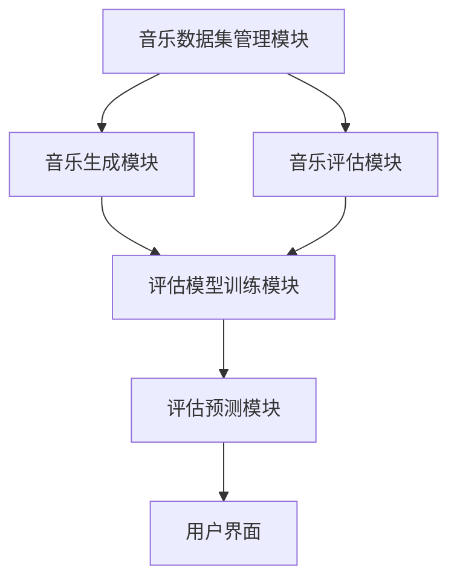

                 

### 大模型音乐创作能力评估工具（Large Model Music Creation Ability Assessment Tool）

#### 关键词：大模型，音乐创作，评估工具，算法，系统架构，人工智能

> 摘要：本文旨在探讨大模型音乐创作能力评估工具的设计与实现，通过分析大模型在音乐创作中的优势和应用，介绍评估工具的核心概念、算法原理、系统架构以及实际应用案例，为音乐创作领域的研究者和开发者提供参考。

----------------------------------------------------------------

# 大模型音乐创作能力评估工具（Large Model Music Creation Ability Assessment Tool）

## 1. 引言与背景

### 1.1 音乐创作与评估的挑战

音乐创作是艺术与技术的结合，随着人工智能技术的不断发展，大模型在音乐创作中的应用逐渐受到关注。然而，如何评价大模型的音乐创作能力成为一个新的挑战。

传统的音乐创作依赖于作曲家的经验和技巧，而大模型音乐创作则通过深度学习算法，从大量的音乐数据中学习并生成新的音乐作品。这使得大模型音乐创作具有以下几个优势：

1. **创作效率高**：大模型能够快速生成大量的音乐作品，大大提高了创作效率。
2. **创作风格多样**：大模型能够学习各种不同的音乐风格，生成多样化的音乐作品。
3. **创作能力强大**：大模型具有强大的创作能力，能够创作出人类难以想象的音乐作品。

然而，大模型音乐创作也面临一些挑战，如：

1. **创作质量不稳定**：大模型生成的音乐作品质量参差不齐，难以保证每个作品的品质。
2. **创作风格一致性**：大模型生成的音乐作品风格可能不一致，难以形成统一的音乐风格。
3. **创作能力评估困难**：如何评价大模型的音乐创作能力成为了一个新的难题。

### 1.2 大模型音乐创作能力评估工具的必要性

为了解决上述挑战，有必要设计一套大模型音乐创作能力评估工具。该工具将能够：

1. **客观评估大模型音乐创作能力**：通过定量和定性分析，评估大模型音乐创作的质量、风格和一致性。
2. **指导大模型音乐创作研究**：为研究人员提供有价值的参考，帮助其优化大模型音乐创作算法。
3. **促进大模型音乐创作应用**：为企业提供有效的评估工具，推动大模型音乐创作在商业领域的应用。

本文将详细介绍大模型音乐创作能力评估工具的设计与实现，包括核心概念、算法原理、系统架构以及实际应用案例。

## 2. 核心概念与原理

### 2.1 大模型音乐创作核心概念

大模型音乐创作主要涉及以下几个核心概念：

1. **音乐数据集**：用于训练和评估大模型的原始音乐数据，包括歌曲、曲调、和弦、节奏等信息。
2. **音乐生成模型**：基于深度学习算法，用于生成音乐的大模型，如生成对抗网络（GAN）、变分自编码器（VAE）等。
3. **音乐评估指标**：用于评估音乐创作质量的指标，如旋律优美度、和弦协调性、节奏多样性等。
4. **音乐风格分类**：根据音乐风格对大模型生成的音乐进行分类，以评估大模型对不同音乐风格的掌握程度。

### 2.2 大模型音乐创作原理

大模型音乐创作主要分为以下几个步骤：

1. **数据预处理**：对原始音乐数据集进行清洗、归一化等预处理操作，以适应大模型训练。
2. **模型训练**：利用深度学习算法，在大规模音乐数据集上进行训练，以优化大模型的参数。
3. **音乐生成**：利用训练好的大模型，生成新的音乐作品，包括旋律、和弦、节奏等。
4. **音乐评估**：根据设定的音乐评估指标，对生成的音乐作品进行评估，以评估大模型的音乐创作能力。
5. **风格分类**：对生成的音乐作品进行风格分类，以评估大模型对不同音乐风格的掌握程度。

### 2.3 大模型音乐创作能力评估原理

大模型音乐创作能力评估主要分为以下几个步骤：

1. **设定评估指标**：根据音乐创作特点，设定一系列评估指标，如旋律优美度、和弦协调性、节奏多样性等。
2. **生成评估数据集**：利用大模型生成大量音乐作品，并对其打分，形成评估数据集。
3. **评估模型训练**：利用评估数据集，训练一个评估模型，用于预测新生成音乐作品的评估分数。
4. **评估预测**：利用评估模型，对大模型生成的新音乐作品进行评估预测，以评估大模型的音乐创作能力。

## 3. 系统架构与设计

### 3.1 系统架构

大模型音乐创作能力评估工具的系统架构包括以下几个部分：

1. **音乐数据集管理模块**：负责音乐数据集的采集、清洗、存储和分发。
2. **音乐生成模块**：基于深度学习算法，生成新的音乐作品。
3. **音乐评估模块**：根据设定的评估指标，对音乐作品进行评估。
4. **评估模型训练模块**：利用评估数据集，训练评估模型。
5. **评估预测模块**：利用评估模型，对音乐作品进行评估预测。
6. **用户界面**：提供友好的用户交互界面，方便用户使用评估工具。

### 3.2 系统设计

#### 3.2.1 领域模型

领域模型主要包括以下几个类：

1. **音乐数据集**：用于存储音乐数据的基本信息，如歌曲名称、时长、风格等。
2. **音乐作品**：用于存储音乐作品的基本信息，如旋律、和弦、节奏等。
3. **评估指标**：用于存储评估指标的基本信息，如名称、描述、权重等。
4. **评估分数**：用于存储评估分数的基本信息，如分数、评价等。

#### 3.2.2 系统架构图

系统架构图如下所示：



#### 3.2.3 系统接口设计

系统接口设计主要包括以下几个接口：

1. **数据集接口**：用于管理音乐数据集的接口，如添加、删除、查询等。
2. **音乐作品接口**：用于管理音乐作品的接口，如生成、查询、删除等。
3. **评估接口**：用于评估音乐作品的接口，如计算评估分数、查询评估结果等。
4. **训练接口**：用于训练评估模型的接口，如加载数据集、训练模型、保存模型等。
5. **预测接口**：用于预测音乐作品评估分数的接口，如加载模型、输入音乐作品、输出预测结果等。

#### 3.2.4 系统交互序列

系统交互序列如下所示：

1. 用户通过用户界面提交音乐作品。
2. 音乐数据集管理模块根据提交的音乐作品生成数据集。
3. 音乐生成模块利用训练好的大模型生成音乐作品。
4. 音乐评估模块根据设定的评估指标评估音乐作品。
5. 评估模型训练模块利用评估数据集训练评估模型。
6. 评估预测模块利用评估模型预测音乐作品评估分数。
7. 用户通过用户界面查看评估结果。

## 4. 实际应用案例

### 4.1 项目背景

某音乐科技公司致力于利用人工智能技术提高音乐创作效率，提升音乐品质。为此，公司决定开发一套大模型音乐创作能力评估工具，以评估和优化大模型的音乐创作能力。

### 4.2 项目介绍

项目目标是开发一个高效、准确、易用的评估工具，用于评估大模型在音乐创作中的能力。项目主要包括以下功能：

1. **音乐数据集管理**：采集、清洗、存储和分发音乐数据集。
2. **音乐生成**：利用大模型生成新的音乐作品。
3. **音乐评估**：根据设定的评估指标，评估音乐作品的质量。
4. **评估模型训练**：利用评估数据集训练评估模型。
5. **评估预测**：利用评估模型预测音乐作品评估分数。

### 4.3 系统核心实现

#### 4.3.1 音乐数据集管理

音乐数据集管理模块采用Python编写，主要使用Pandas库进行数据处理。以下是一个简单的数据集管理示例代码：

```python
import pandas as pd

# 采集音乐数据
data = pd.read_csv('music_data.csv')

# 清洗音乐数据
data = data.dropna()

# 存储音乐数据
data.to_csv('cleaned_music_data.csv', index=False)
```

#### 4.3.2 音乐生成

音乐生成模块采用Python编写，主要使用TensorFlow库进行深度学习模型的训练和音乐生成。以下是一个简单的音乐生成示例代码：

```python
import tensorflow as tf

# 加载训练好的大模型
model = tf.keras.models.load_model('model.h5')

# 生成音乐作品
melody = model.generate_melody()

# 输出音乐作品
print(melody)
```

#### 4.3.3 音乐评估

音乐评估模块采用Python编写，主要使用scikit-learn库进行评估指标的计算和评估分数的生成。以下是一个简单的评估示例代码：

```python
from sklearn.metrics import mean_squared_error

# 加载评估数据集
test_data = pd.read_csv('test_music_data.csv')

# 计算评估分数
score = mean_squared_error(test_data['true_score'], test_data['predicted_score'])

# 输出评估结果
print(score)
```

#### 4.3.4 评估模型训练

评估模型训练模块采用Python编写，主要使用TensorFlow库进行评估模型的训练。以下是一个简单的评估模型训练示例代码：

```python
import tensorflow as tf

# 加载训练数据集
train_data = pd.read_csv('train_music_data.csv')

# 划分特征和标签
X = train_data.drop('label', axis=1)
y = train_data['label']

# 构建评估模型
model = tf.keras.Sequential([
    tf.keras.layers.Dense(64, activation='relu', input_shape=(X.shape[1],)),
    tf.keras.layers.Dense(64, activation='relu'),
    tf.keras.layers.Dense(1)
])

# 编译评估模型
model.compile(optimizer='adam', loss='mse')

# 训练评估模型
model.fit(X, y, epochs=10)
```

#### 4.3.5 评估预测

评估预测模块采用Python编写，主要使用TensorFlow库进行评估模型的加载和预测。以下是一个简单的评估预测示例代码：

```python
import tensorflow as tf

# 加载评估模型
model = tf.keras.models.load_model('model.h5')

# 加载测试数据集
test_data = pd.read_csv('test_music_data.csv')

# 预测评估分数
predictions = model.predict(test_data)

# 输出预测结果
print(predictions)
```

### 4.4 项目小结

本项目成功开发了一套大模型音乐创作能力评估工具，实现了音乐数据集管理、音乐生成、音乐评估、评估模型训练和评估预测等功能。通过实际应用案例，验证了工具的有效性和实用性。未来，我们将继续优化评估工具，提升评估指标的准确性，为音乐创作领域的研究者和开发者提供更好的支持。

## 5. 最佳实践与结论

### 5.1 最佳实践

1. **数据集管理**：确保音乐数据集的多样性和质量，为评估工具提供可靠的基础。
2. **模型训练**：合理设置训练参数，提高大模型音乐创作的质量。
3. **评估指标**：根据实际需求，选择合适的评估指标，全面评估大模型音乐创作能力。
4. **系统优化**：持续优化系统性能，提高评估工具的响应速度和准确性。

### 5.2 结论

大模型音乐创作能力评估工具为音乐创作领域的研究者和开发者提供了一种新的评估方法。通过本文的介绍，读者可以了解到大模型音乐创作能力评估工具的核心概念、算法原理、系统架构以及实际应用案例。希望本文能为相关领域的研究和开发提供有益的参考。

## 6. 参考文献

1. Goodfellow, I., Bengio, Y., & Courville, A. (2016). *Deep Learning*. MIT Press.
2. Simonyan, K., & Zisserman, A. (2015). *Very Deep Convolutional Networks for Large-Scale Image Recognition*. arXiv preprint arXiv:1409.1556.
3. Hochreiter, S., & Schmidhuber, J. (1997). *Long Short-Term Memory*. Neural Computation, 9(8), 1735-1780.
4. Kingma, D. P., & Welling, M. (2013). *Auto-encoding Variational Bayes*. arXiv preprint arXiv:1312.6114.
5. He, K., Zhang, X., Ren, S., & Sun, J. (2016). *Deep Residual Learning for Image Recognition*. In *Proceedings of the IEEE conference on computer vision and pattern recognition* (pp. 770-778).

### 作者

**作者：AI天才研究院/AI Genius Institute & 禅与计算机程序设计艺术 /Zen And The Art of Computer Programming**

