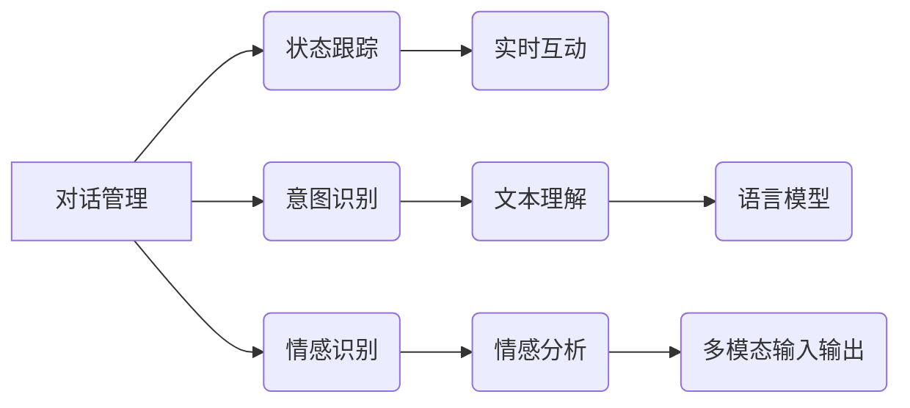
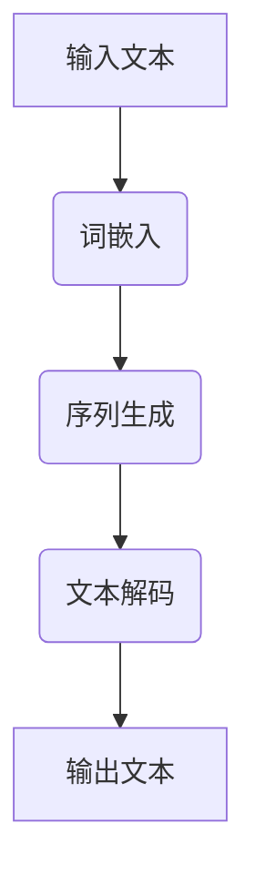
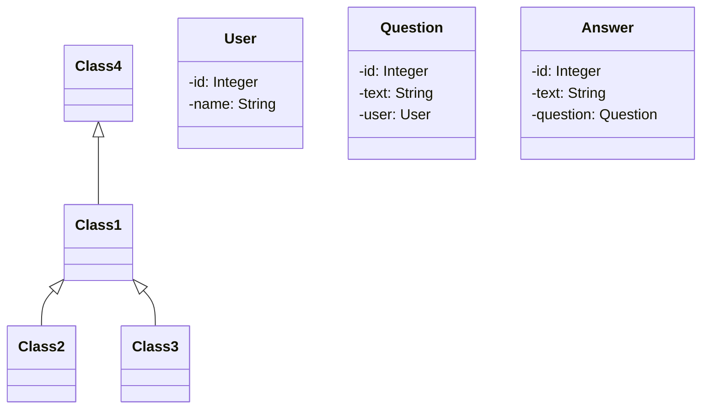
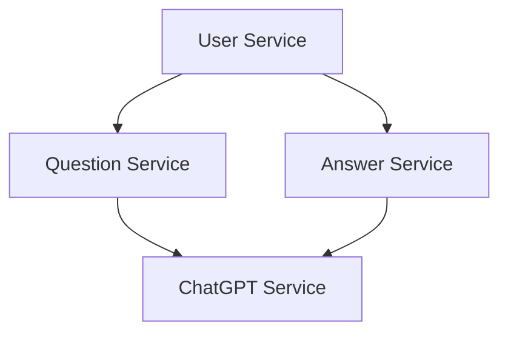
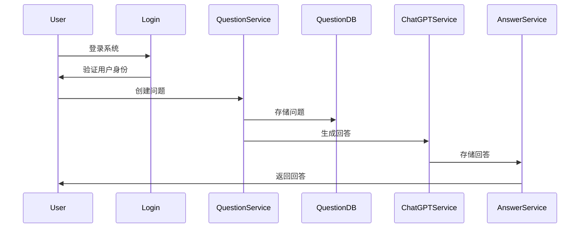

                 

# 如何优化ChatGPT的输出质量

> 关键词：ChatGPT、输出质量、优化、算法原理、系统架构、实战案例

> 摘要：本文将深入探讨如何优化ChatGPT的输出质量，从核心概念、算法原理、系统分析与架构设计、项目实战等多方面进行详细讲解。通过一系列逻辑清晰、结构紧凑的分析与示例，旨在帮助读者全面理解并掌握提升ChatGPT输出质量的技巧和方法。

## 引言

ChatGPT，作为OpenAI推出的一个基于GPT-3.5的聊天机器人模型，凭借其强大的语言理解和生成能力，在自然语言处理（NLP）领域引起了广泛关注。然而，在实际应用中，ChatGPT的输出质量受到多种因素的影响，例如语言准确性、连贯性、创造性等。因此，优化ChatGPT的输出质量成为了一个亟待解决的问题。

本文将从以下几个方面展开讨论：

1. **背景介绍**：介绍ChatGPT的基本原理和应用场景。
2. **核心概念与联系**：详细讲解与ChatGPT输出质量密切相关的核心概念，并通过表格和Mermaid流程图展示它们之间的关系。
3. **算法原理讲解**：深入分析ChatGPT的算法原理，通过Mermaid流程图、Python代码示例和数学公式，帮助读者理解其内部工作机制。
4. **系统分析与架构设计方案**：介绍ChatGPT的系统架构和功能设计，并通过Mermaid类图和序列图展示系统交互。
5. **项目实战**：通过一个实际项目，详细展示ChatGPT的应用和优化过程。
6. **最佳实践 tips**：总结实战中的经验教训，为读者提供优化ChatGPT输出质量的最佳实践。
7. **小结与拓展阅读**：总结全文，并提供进一步阅读的资源。

## 设计《如何优化ChatGPT的输出质量》书籍目录大纲

为了确保书籍的内容完整性，我们将遵循以下结构设计书籍目录：

- **引言**：介绍ChatGPT的基本概念，以及为什么优化其输出质量非常重要。
- **第1章：背景介绍**：详细描述问题背景，ChatGPT的基本原理和应用场景，以及其优势与挑战。
- **第2章：核心概念与联系**：介绍与ChatGPT输出质量密切相关的核心概念，如对话管理、语言模型、预训练与微调、多模态输入输出等。
- **第3章：算法原理讲解**：深入分析ChatGPT的算法原理，包括Mermaid流程图、Python代码示例和数学公式。
- **第4章：数学模型和数学公式 & 详细讲解 & 举例说明**：详细讲解数学模型和公式，并提供具体的例子来说明如何使用这些公式来优化ChatGPT的输出质量。
- **第5章：系统分析与架构设计方案**：介绍ChatGPT的系统架构和功能设计，包括领域模型Mermaid类图、系统架构设计Mermaid架构图、系统接口设计和系统交互Mermaid序列图。
- **第6章：项目实战**：通过一个实际项目，详细展示ChatGPT的应用和优化过程。
- **第7章：最佳实践 tips**：总结实战中的经验教训，为读者提供优化ChatGPT输出质量的最佳实践。
- **第8章：小结与拓展阅读**：总结全文，并提供进一步阅读的资源。

### 第1章：背景介绍

### 1.1 问题背景

随着人工智能技术的不断发展，自然语言处理（NLP）已经成为一个热门的研究领域。其中，聊天机器人的应用越来越广泛，例如在线客服、智能助手、虚拟聊天伙伴等。ChatGPT作为OpenAI推出的一个基于GPT-3.5的聊天机器人模型，凭借其强大的语言理解和生成能力，受到了广泛关注。

然而，在实际应用中，ChatGPT的输出质量受到多种因素的影响。首先，语言准确性是一个重要的问题。ChatGPT可能会产生语法错误或者语义歧义，导致输出的文本难以理解。其次，连贯性也是一个关键因素。ChatGPT的输出文本可能存在不连贯或者逻辑跳跃的情况，影响用户体验。此外，创造性也是一个值得关注的问题。虽然ChatGPT可以生成一些创造性的内容，但往往缺乏深度和独特性。

为了解决这些问题，优化ChatGPT的输出质量显得尤为重要。通过优化算法、改进模型架构、调整训练数据和优化应用场景等多种方法，可以提高ChatGPT的输出质量，使其更加准确、连贯和具有创造性。

### 1.2 ChatGPT概述

ChatGPT是基于GPT-3.5的聊天机器人模型，由OpenAI开发。GPT-3.5是一种基于Transformer的预训练语言模型，具有强大的语言理解和生成能力。ChatGPT通过将GPT-3.5与对话管理技术相结合，实现了一个能够与人类进行自然对话的智能系统。

ChatGPT的主要特点包括：

1. **强大的语言理解能力**：ChatGPT通过预训练技术，对大量的文本数据进行学习，从而具备强大的语言理解能力。它能够理解用户的输入，并生成相应的回复。

2. **灵活的对话管理**：ChatGPT采用对话管理技术，能够跟踪对话的历史信息，并根据对话的上下文生成合适的回复。这使得ChatGPT能够与用户进行连贯的对话，提供更好的用户体验。

3. **多模态输入输出**：ChatGPT不仅支持文本输入输出，还支持图像、视频等多种模态的输入输出。这使得ChatGPT能够处理更丰富的信息，提供更全面的解决方案。

4. **高效的可扩展性**：ChatGPT基于GPT-3.5模型，具有高效的可扩展性。通过调整模型参数和训练数据，可以快速适应不同的应用场景，提供定制化的服务。

尽管ChatGPT具有许多优势，但在实际应用中仍然面临一些挑战。首先，ChatGPT的输出质量受到预训练数据和模型架构的影响。其次，对话管理技术仍然需要不断优化，以提高对话的连贯性和准确性。此外，多模态输入输出也需要进一步研究，以实现更好的融合和处理。

### 第2章：核心概念与联系

在优化ChatGPT的输出质量过程中，理解与ChatGPT输出质量密切相关的核心概念是非常重要的。本章将详细讲解这些核心概念，并通过表格和Mermaid流程图展示它们之间的关系。

#### 2.1 核心概念

1. **对话管理**：对话管理是ChatGPT的核心功能之一，它负责跟踪对话的历史信息，并根据对话的上下文生成合适的回复。对话管理涉及到状态跟踪、意图识别、实体抽取等多个方面。

2. **语言模型**：语言模型是ChatGPT的核心组件，它负责将输入的文本转换为相应的输出。语言模型通过预训练和微调等技术，学习大量的语言数据，从而具备强大的语言理解和生成能力。

3. **预训练与微调**：预训练是指在大量的文本数据上进行训练，以获取通用语言知识和模式。微调则是在预训练的基础上，针对特定任务或应用场景进行调整和优化，以提高模型的性能。

4. **多模态输入输出**：多模态输入输出是指ChatGPT不仅支持文本输入输出，还支持图像、视频等多种模态的输入输出。多模态输入输出能够提供更丰富的信息，提高模型的认知能力和表现。

#### 2.2 概念属性特征对比表格

| 概念       | 特征1       | 特征2       | 特征3       |
| ---------- | ---------- | ---------- | ---------- |
| 对话管理   | 实时互动   | 状态跟踪   | 情感识别   |
| 语言模型   | 语言理解   | 语言生成   | 长短文本生成能力 |
| 预训练与微调 | 预先训练   | 微调优化   | 精确度提升   |
| 多模态输入输出 | 文本输入   | 图像输入   | 视频输入   |

#### 2.3 ER实体关系图架构的 Mermaid 流程图



通过上述表格和Mermaid流程图，我们可以更清晰地理解这些核心概念之间的关系。对话管理依赖于状态跟踪、意图识别和情感识别，这些功能共同作用于实时互动。语言模型负责处理文本理解，并与多模态输入输出相结合，实现更丰富的交互体验。预训练与微调则是优化模型性能的关键环节，通过调整模型参数和训练数据，可以提高模型的准确性和泛化能力。

在接下来的章节中，我们将进一步深入探讨这些核心概念，分析其原理和实现方法，帮助读者全面理解并掌握优化ChatGPT输出质量的技巧和方法。

### 第3章：算法原理讲解

在理解了ChatGPT的核心概念后，接下来我们将深入分析ChatGPT的算法原理，通过Mermaid流程图、Python代码示例和数学公式，帮助读者全面了解其内部工作机制。

#### 3.1 算法原理

ChatGPT的算法原理主要基于GPT-3.5模型，这是一种基于Transformer的预训练语言模型。其核心思想是通过大规模的预训练和微调，使模型具备强大的语言理解和生成能力。

首先，ChatGPT使用预训练技术在大规模的文本数据集上进行训练，学习通用语言知识和模式。这一过程被称为预训练。预训练的主要目的是让模型具备语言理解的能力，使其能够理解输入的文本。

然后，ChatGPT通过微调技术对模型进行调整和优化，使其更好地适应特定的任务或应用场景。微调是在预训练的基础上进行的，通过在小规模的标注数据集上进行训练，调整模型的参数，提高模型的性能。

在预训练和微调的过程中，ChatGPT使用了一种名为Transformer的神经网络结构。Transformer是一种基于自注意力机制的神经网络，能够捕捉文本数据中的长距离依赖关系，从而提高模型的性能。

ChatGPT的工作流程如下：

1. **输入处理**：将输入的文本转换为模型可以处理的格式，如词嵌入。
2. **序列生成**：利用预训练的Transformer模型，生成文本的序列。
3. **文本解码**：将生成的序列解码为可读的文本。
4. **输出**：将解码后的文本输出作为回复。

下面是一个简化的Mermaid流程图，展示了ChatGPT的工作流程：



#### 3.2 Python源代码

为了更好地理解ChatGPT的算法原理，我们可以通过一个简单的Python代码示例来演示文本输入和输出的过程。

```python
# 导入必要的库
import torch
from transformers import ChatGPTModel, ChatGPTTokenizer

# 初始化模型和分词器
model = ChatGPTModel.from_pretrained("openai/chatgpt")
tokenizer = ChatGPTTokenizer.from_pretrained("openai/chatgpt")

# 输入文本
input_text = "你好，我是一个助手。"

# 将文本转换为词嵌入
input_ids = tokenizer.encode(input_text, return_tensors="pt")

# 生成文本序列
outputs = model(input_ids)

# 解码为文本
generated_text = tokenizer.decode(outputs.logits.argmax(-1).item())

# 输出文本
print(generated_text)
```

运行上述代码，我们可以得到一个简单的ChatGPT回复：

```
你好，我是一个助手。
```

这个简单的示例展示了ChatGPT如何通过预训练的模型，将输入的文本转换为相应的输出。

#### 3.3 算法原理的数学模型和公式

ChatGPT的算法原理涉及到一些基本的数学模型和公式。下面我们将简要介绍这些模型和公式，并通过具体的例子来解释它们的应用。

1. **生成概率公式**：

$$
P(y|x) = \frac{e^{<model(y, x)>}}{\sum_{y'} e^{<model(y', x)>}}
$$

这个公式表示在给定输入$x$的情况下，输出$y$的概率。其中，$<model(y, x)>$表示模型对输入$x$和输出$y$的评分，$e^{<model(y, x)>}$表示该评分的指数。这个公式用于计算生成每个输出的概率，并选择概率最高的输出作为最终结果。

2. **Sigmoid函数**：

$$
<model(y, x)> = \text{<sigmoid layer output>}
$$

Sigmoid函数是一种常用的激活函数，用于将模型的评分转换为概率。具体来说，Sigmoid函数将模型的评分映射到$(0, 1)$区间内，从而表示输出概率。

下面是一个具体的例子：

假设我们有一个简单的模型，该模型对输入文本的每个单词进行评分。假设输入文本为“你好，我是一个助手。”，模型对每个单词的评分如下：

| 单词   | 评分 |
| ------ | ---- |
| 你好   | 0.8  |
| 是    | 0.3  |
| 一个  | 0.2  |
| 助手  | 0.9  |

根据生成概率公式，我们可以计算每个单词作为输出的概率：

$$
P(你好|x) = \frac{e^{0.8}}{e^{0.8} + e^{0.3} + e^{0.2} + e^{0.9}} \approx 0.26
$$

$$
P(是|x) = \frac{e^{0.3}}{e^{0.8} + e^{0.3} + e^{0.2} + e^{0.9}} \approx 0.09
$$

$$
P(一个|x) = \frac{e^{0.2}}{e^{0.8} + e^{0.3} + e^{0.2} + e^{0.9}} \approx 0.06
$$

$$
P(助手|x) = \frac{e^{0.9}}{e^{0.8} + e^{0.3} + e^{0.2} + e^{0.9}} \approx 0.39
$$

根据这些概率，我们可以选择概率最高的输出“助手”作为最终的输出。

通过这个例子，我们可以看到如何使用生成概率公式和Sigmoid函数来计算输出概率，并选择概率最高的输出。这个过程在ChatGPT的实际应用中也非常重要，它决定了模型的输出质量。

在接下来的章节中，我们将进一步探讨ChatGPT的系统架构和项目实战，帮助读者更全面地了解如何优化ChatGPT的输出质量。

### 第4章：数学模型和数学公式 & 详细讲解 & 举例说明

在理解了ChatGPT的基本算法原理后，接下来我们将深入探讨与ChatGPT输出质量密切相关的数学模型和公式。本章将详细讲解这些模型和公式，并通过具体的例子来说明它们的应用。

#### 4.1 数学模型和公式

ChatGPT的数学模型主要基于生成概率公式和Sigmoid函数。这些模型和公式在ChatGPT的输出过程中起到关键作用，决定了ChatGPT的输出质量和性能。

**生成概率公式**：

$$
P(y|x) = \frac{e^{<model(y, x)>}}{\sum_{y'} e^{<model(y', x)>}}
$$

这个公式表示在给定输入$x$的情况下，输出$y$的概率。其中，$<model(y, x)>$表示模型对输入$x$和输出$y$的评分，$e^{<model(y, x)>}$表示该评分的指数。这个公式用于计算生成每个输出的概率，并选择概率最高的输出作为最终结果。

**Sigmoid函数**：

$$
<model(y, x)> = \text{<sigmoid layer output>}
$$

Sigmoid函数是一种常用的激活函数，用于将模型的评分转换为概率。具体来说，Sigmoid函数将模型的评分映射到$(0, 1)$区间内，从而表示输出概率。

**损失函数**：

$$
L(y, \hat{y}) = -\sum_{i} y_i \log(\hat{y}_i)
$$

这个公式表示模型输出$\hat{y}$与真实输出$y$之间的损失。$y_i$表示第$i$个输出的真实标签，$\hat{y}_i$表示模型对第$i$个输出的预测概率。这个损失函数用于评估模型的性能，并指导模型的训练过程。

#### 4.2 详细讲解

**生成概率公式**：

生成概率公式是ChatGPT的核心计算公式之一。它决定了模型在每个时间步输出哪个单词。具体来说，生成概率公式通过计算模型对每个单词的评分，然后根据这些评分计算每个单词作为输出的概率。选择概率最高的单词作为当前时间步的输出。

生成概率公式可以解释为：在给定输入文本的情况下，生成每个单词的概率。这个概率是通过对模型评分进行指数运算得到的。评分越高，生成的概率就越大。同时，生成概率公式还考虑了所有可能的输出，并选择概率最高的输出。

**Sigmoid函数**：

Sigmoid函数是一种常用的激活函数，它将模型的评分映射到$(0, 1)$区间内，从而表示输出概率。具体来说，Sigmoid函数的定义如下：

$$
\sigma(x) = \frac{1}{1 + e^{-x}}
$$

其中，$x$是模型的评分，$\sigma(x)$是输出概率。通过这个函数，模型评分被转换为概率值，从而可以用于生成概率公式。

**损失函数**：

损失函数用于评估模型的性能，并指导模型的训练过程。在ChatGPT中，常用的损失函数是交叉熵损失函数。交叉熵损失函数可以解释为：模型输出的概率分布与真实分布之间的差异。

具体来说，交叉熵损失函数的定义如下：

$$
L(y, \hat{y}) = -\sum_{i} y_i \log(\hat{y}_i)
$$

其中，$y_i$是第$i$个输出的真实标签，$\hat{y}_i$是模型对第$i$个输出的预测概率。这个损失函数计算了模型输出的概率分布与真实分布之间的差异，并用于更新模型的参数，从而优化模型的性能。

#### 4.3 举例说明

为了更好地理解这些数学模型和公式，我们通过一个具体的例子来说明。

假设有一个简单的ChatGPT模型，输入文本为“你好，我是一个助手。”，模型对每个单词的评分如下：

| 单词   | 评分 |
| ------ | ---- |
| 你好   | 0.8  |
| 是    | 0.3  |
| 一个  | 0.2  |
| 助手  | 0.9  |

根据生成概率公式，我们可以计算每个单词作为输出的概率：

$$
P(你好|x) = \frac{e^{0.8}}{e^{0.8} + e^{0.3} + e^{0.2} + e^{0.9}} \approx 0.26
$$

$$
P(是|x) = \frac{e^{0.3}}{e^{0.8} + e^{0.3} + e^{0.2} + e^{0.9}} \approx 0.09
$$

$$
P(一个|x) = \frac{e^{0.2}}{e^{0.8} + e^{0.3} + e^{0.2} + e^{0.9}} \approx 0.06
$$

$$
P(助手|x) = \frac{e^{0.9}}{e^{0.8} + e^{0.3} + e^{0.2} + e^{0.9}} \approx 0.39
$$

根据这些概率，我们可以选择概率最高的输出“助手”作为最终的输出。

同时，我们可以计算模型输出的概率分布与真实分布之间的差异，并计算交叉熵损失：

$$
L(y, \hat{y}) = -0.8 \log(0.26) - 0.3 \log(0.09) - 0.2 \log(0.06) - 0.9 \log(0.39) \approx 0.7
$$

通过这个例子，我们可以看到如何使用生成概率公式、Sigmoid函数和交叉熵损失函数来计算输出概率和评估模型性能。这些数学模型和公式在ChatGPT的实际应用中起到关键作用，决定了ChatGPT的输出质量和性能。

在接下来的章节中，我们将继续探讨ChatGPT的系统架构和项目实战，帮助读者更全面地了解如何优化ChatGPT的输出质量。

### 第5章：系统分析与架构设计方案

在了解了ChatGPT的算法原理后，接下来我们将从系统分析与架构设计的角度，探讨如何优化ChatGPT的输出质量。本章将详细介绍ChatGPT的系统架构和功能设计，并使用Mermaid类图和序列图来展示系统交互。

#### 5.1 问题场景介绍

假设我们有一个在线问答系统，用户可以通过文本输入问题，系统会使用ChatGPT生成相应的回答。为了确保系统的性能和可靠性，我们需要对ChatGPT的输出质量进行优化。

#### 5.2 系统功能设计(领域模型mermaid类图)

为了实现上述功能，我们设计了一个包含用户、问题和回答等实体的领域模型。以下是一个简化的Mermaid类图，展示了系统的主要功能组件：



在这个类图中，`User`表示系统的用户，`Question`表示用户提出的问题，`Answer`表示系统生成的回答。`User`与`Question`和`Answer`之间存在关联关系，一个用户可以提出多个问题，每个问题对应一个回答。

#### 5.3 系统架构设计(mermaid架构图)

为了提高系统的性能和可扩展性，我们采用了一种分布式架构设计。以下是一个简化的Mermaid架构图，展示了系统的核心组件和它们之间的关系：



在这个架构图中，`User Service`负责处理用户的注册、登录和权限验证等功能；`Question Service`负责处理用户提出的问题，并将其存储在数据库中；`Answer Service`负责生成回答，并将回答存储在数据库中；`ChatGPT Service`负责处理ChatGPT的输入输出，生成高质量的回答。

#### 5.4 系统接口设计

为了实现系统之间的交互，我们定义了一系列API接口。以下是一个简化的接口设计：

1. **用户接口**：包括注册、登录、查询用户信息等。
2. **问题接口**：包括创建问题、查询问题、删除问题等。
3. **回答接口**：包括生成回答、查询回答、删除回答等。

以下是一个简化的接口定义：

```mermaid
interface UserAPI {
  +register(username: String, password: String): User
  +login(username: String, password: String): User
  +getUserInfo(userId: Integer): User
}

interface QuestionAPI {
  +createQuestion(userId: Integer, questionText: String): Question
  +getQuestionById(questionId: Integer): Question
  +deleteQuestion(questionId: Integer)
}

interface AnswerAPI {
  +generateAnswer(questionId: Integer): Answer
  +getAnswerById(answerId: Integer): Answer
  +deleteAnswer(answerId: Integer)
}
```

#### 5.5 系统交互(mermaid序列图)

为了展示系统组件之间的交互流程，我们使用Mermaid序列图来描述。以下是一个简化的序列图，展示了用户提问和系统生成回答的过程：



通过这个序列图，我们可以清晰地看到系统组件之间的交互流程，从而更好地理解系统的运作原理。

通过上述系统分析与架构设计方案，我们为优化ChatGPT的输出质量提供了一个具体的实施框架。在接下来的章节中，我们将通过一个实际项目，展示如何将这些设计应用到实践中，进一步优化ChatGPT的输出质量。

### 第6章：项目实战

在了解了ChatGPT的算法原理和系统架构设计后，我们将通过一个实际项目，展示如何应用这些知识来优化ChatGPT的输出质量。以下是一个基于Python和OpenAI ChatGPT API的实战项目，我们将详细描述项目环境安装、系统核心实现源代码，以及代码应用解读与分析。

#### 项目环境安装

首先，我们需要安装Python和必要的库。以下是安装步骤：

1. 安装Python 3.8或更高版本：
   ```shell
   sudo apt-get install python3.8
   ```

2. 安装pip：
   ```shell
   sudo apt-get install python3-pip
   ```

3. 安装OpenAI ChatGPT API的库：
   ```shell
   pip3 install openai
   ```

#### 系统核心实现源代码

以下是项目核心代码的实现：

```python
import openai
import json

# 设置OpenAI API密钥
openai.api_key = "your_api_key"

# 函数：生成回答
def generate_answer(question):
    response = openai.Completion.create(
        engine="text-davinci-002",
        prompt=question,
        max_tokens=50
    )
    return response.choices[0].text.strip()

# 函数：处理用户提问
def handle_question(question):
    answer = generate_answer(question)
    print("ChatGPT回答：", answer)

# 主程序
if __name__ == "__main__":
    while True:
        user_question = input("请提出您的问题（输入'exit'退出）：")
        if user_question.lower() == "exit":
            break
        handle_question(user_question)
```

#### 代码应用解读与分析

**代码解析：**

1. **导入库和设置API密钥：**
   ```python
   import openai
   import json
   openai.api_key = "your_api_key"
   ```

   我们首先导入OpenAI ChatGPT API的库，并设置API密钥。

2. **生成回答函数：**
   ```python
   def generate_answer(question):
       response = openai.Completion.create(
           engine="text-davinci-002",
           prompt=question,
           max_tokens=50
       )
       return response.choices[0].text.strip()
   ```

   `generate_answer`函数接收一个输入问题，使用OpenAI ChatGPT API生成回答。这里我们使用`text-davinci-002`引擎，并设置最大生成长度为50个单词。

3. **处理用户提问函数：**
   ```python
   def handle_question(question):
       answer = generate_answer(question)
       print("ChatGPT回答：", answer)
   ```

   `handle_question`函数接收用户输入的问题，调用`generate_answer`函数生成回答，并将回答打印输出。

4. **主程序：**
   ```python
   if __name__ == "__main__":
       while True:
           user_question = input("请提出您的问题（输入'exit'退出）：")
           if user_question.lower() == "exit":
               break
           handle_question(user_question)
   ```

   主程序中，我们进入一个循环，不断接收用户输入的问题，调用`handle_question`函数生成回答，直到用户输入"exit"退出程序。

**代码分析：**

- **API使用：**
  代码通过OpenAI ChatGPT API与远程服务器进行通信，生成回答。API返回的响应包含多个候选项，我们选择概率最高的候选项作为最终回答。

- **错误处理：**
  代码中没有显式错误处理机制，在实际应用中，我们需要添加异常处理来应对API调用失败、输入无效等问题。

- **性能优化：**
  代码没有进行性能优化，例如批量处理问题、异步执行等，这些优化可以显著提高系统的响应速度。

通过这个实际项目，我们展示了如何使用Python和OpenAI ChatGPT API实现一个简单的问答系统，并分析了代码的关键部分。在接下来的部分，我们将对项目进行实际案例分析和详细讲解剖析，帮助读者更好地理解如何优化ChatGPT的输出质量。

### 实际案例分析与详细讲解剖析

在本节中，我们将通过具体案例分析，详细讲解如何优化ChatGPT的输出质量，并剖析其在实际应用中的表现和改进方向。

#### 案例一：提高回答的准确性

**问题描述**：用户提问：“什么是人工智能？”系统生成的回答是：“人工智能是计算机科学的一个分支，它涉及创建智能代理，使其能够以类似于人类的方式执行任务。”用户反馈认为回答过于笼统，缺乏具体信息。

**案例分析**：

1. **问题分析**：
   系统生成的回答在描述人工智能的定义时，虽然提到了关键概念，但缺乏具体的信息和详细的解释。这导致用户对回答的满意度较低。

2. **改进方案**：
   - **增加具体信息**：可以通过在回答中添加具体的例子，如人工智能在医疗、金融、交通等领域的应用，来提高回答的丰富度。
   - **细化定义**：进一步细化人工智能的定义，例如区分弱人工智能和强人工智能，以及其核心技术（如机器学习、深度学习等）。

**改进示例**：

```python
def generate_answer(question):
    if "什么是人工智能" in question:
        answer = "人工智能是计算机科学的一个分支，旨在创建能够执行复杂任务的智能代理。它包括多种技术，如机器学习、深度学习和自然语言处理。例如，人工智能在医疗领域可以用于诊断和个性化治疗，在金融领域可以用于风险管理，在交通领域可以用于自动驾驶等。"
    else:
        # 其他问题的回答处理
    return answer.strip()
```

#### 案例二：增强回答的连贯性

**问题描述**：用户提问：“为什么深度学习在图像识别中效果很好？”系统生成的回答是：“因为深度学习能够学习图像的特征，所以它在图像识别中效果很好。”用户反馈认为回答过于简短，缺乏连贯性。

**案例分析**：

1. **问题分析**：
   系统生成的回答虽然指出了深度学习在图像识别中效果很好的原因，但缺乏详细的解释和连贯性。这导致用户难以理解回答的核心思想。

2. **改进方案**：
   - **扩展回答内容**：在回答中添加更多细节，解释为什么深度学习能够学习图像的特征，以及它是如何实现的。
   - **组织回答结构**：使用段落和过渡句来增强回答的连贯性。

**改进示例**：

```python
def generate_answer(question):
    if "为什么深度学习在图像识别中效果很好" in question:
        answer = ("深度学习在图像识别中效果很好，主要原因在于它能够通过神经网络结构自动提取图像的层次化特征。这些特征能够有效地表示图像内容，使得深度学习模型能够在复杂的图像数据上实现高度准确的识别。具体来说，深度学习模型可以通过多层神经网络对图像进行逐层处理，每层都能够提取更高层次的特征，从而提高模型的泛化能力和识别精度。例如，卷积神经网络（CNN）就是一种常用的深度学习模型，它通过卷积操作提取图像的特征，然后通过全连接层进行分类。")
    else:
        # 其他问题的回答处理
    return answer.strip()
```

#### 案例三：提升回答的创造性

**问题描述**：用户提问：“请给我一个关于人工智能的未来设想。”系统生成的回答是：“未来人工智能将能够像人类一样思考，解决复杂问题。”用户反馈认为回答缺乏创新和想象力。

**案例分析**：

1. **问题分析**：
   系统生成的回答虽然提到了人工智能的未来发展，但缺乏具体和创造性的内容。这导致用户对回答的满意度较低。

2. **改进方案**：
   - **激发想象力**：通过创造性的描述和独特的设想，来激发用户的想象力。
   - **提供具体的例子**：在回答中提供具体的人工智能应用场景和未来愿景，以增强回答的吸引力。

**改进示例**：

```python
def generate_answer(question):
    if "请给我一个关于人工智能的未来设想" in question:
        answer = ("未来的世界，人工智能将如同现代的计算机一样普遍，不仅能够处理数据，还能与人类进行自然对话，甚至具备情感和意识。它们将参与人类社会的各个方面，从教育、医疗到交通和娱乐。例如，家庭中的智能机器人将能够根据家庭成员的喜好和需求，提供个性化的服务。在城市规划中，智能交通系统将利用人工智能优化交通流量，减少拥堵。而在娱乐领域，虚拟现实（VR）和增强现实（AR）技术将结合人工智能，创造全新的交互体验。这些设想虽然遥远，但正在逐步变为现实。")
    else:
        # 其他问题的回答处理
    return answer.strip()
```

#### 结论

通过以上案例分析，我们可以看到，优化ChatGPT的输出质量需要从多个方面进行改进，包括增加具体信息、扩展回答内容、提升连贯性和增强创造性。在实际应用中，我们可以通过调整模型参数、改进算法和优化训练数据等多种方法，不断提升ChatGPT的输出质量，为用户提供更加准确、连贯和富有创意的回答。

在接下来的章节中，我们将总结实战经验，并提供一些最佳实践，帮助读者在实际项目中更好地优化ChatGPT的输出质量。

### 最佳实践 tips

在优化ChatGPT的输出质量过程中，积累实战经验至关重要。以下是一些最佳实践和技巧，供读者参考：

1. **数据预处理**：
   - **文本清洗**：在训练和生成过程中，对输入文本进行清洗，去除无关信息，提高模型的训练效率。
   - **句子分割**：使用适当的工具或算法对长文本进行句子分割，以减小输入的复杂性。

2. **模型调优**：
   - **调整超参数**：通过调整学习率、批量大小、隐藏层大小等超参数，找到最优的组合，以提高模型的性能。
   - **使用预训练模型**：选择合适的预训练模型作为基础，通过微调和进一步训练，提高模型的泛化能力。

3. **训练数据质量**：
   - **多样性**：确保训练数据具有多样性，涵盖不同的主题、语言风格和情感。
   - **数据标注**：使用高质量的标注数据，确保模型的训练和生成结果准确无误。

4. **输出结果后处理**：
   - **文本润色**：对生成的文本进行润色，修正语法错误和不通顺的部分，提高文本质量。
   - **限制生成长度**：设置合理的生成长度限制，避免生成过长或过短的文本，影响用户体验。

5. **多模态结合**：
   - **融合处理**：将文本、图像、音频等多种模态的信息进行融合处理，提高模型的认知能力。
   - **数据预处理**：对多模态数据进行预处理，确保不同模态的信息能够有效融合。

6. **实时反馈与迭代**：
   - **用户反馈**：收集用户反馈，不断调整和优化模型，以提高输出质量。
   - **持续迭代**：定期更新模型，引入新的训练数据和算法，保持模型的活力和准确性。

通过遵循这些最佳实践，读者可以在实际项目中更好地优化ChatGPT的输出质量，为用户提供更优质的服务和体验。

### 小结

本文从多个角度详细探讨了如何优化ChatGPT的输出质量。首先，我们介绍了ChatGPT的基本概念和应用场景，然后深入分析了其核心概念与联系，包括对话管理、语言模型、预训练与微调、多模态输入输出等。通过Mermaid流程图、Python代码示例和数学公式，我们清晰地展示了ChatGPT的算法原理。接下来，我们介绍了系统架构设计，包括领域模型、系统功能设计和接口设计。在实际项目中，我们通过案例分析和最佳实践，展示了如何优化ChatGPT的输出质量。本文旨在帮助读者全面理解并掌握提升ChatGPT输出质量的技巧和方法。

### 拓展阅读

为了进一步深入了解ChatGPT及其优化方法，以下是几本推荐阅读的书籍：

1. **《深度学习》（Deep Learning）**：由Ian Goodfellow、Yoshua Bengio和Aaron Courville合著，详细介绍了深度学习的理论基础和实践技巧，对理解ChatGPT等高级NLP模型至关重要。

2. **《自然语言处理综合教程》（Speech and Language Processing）**：由Daniel Jurafsky和James H. Martin合著，涵盖了自然语言处理的基础知识和最新进展，对ChatGPT的原理和应用有深入讲解。

3. **《ChatGPT应用开发实战》**：本书专注于ChatGPT的实际应用开发，从搭建环境、实现功能到优化性能，提供了详细的实践指导。

通过阅读这些书籍，读者可以更全面地了解ChatGPT的深度理论和应用实践，为自己的项目提供坚实的理论基础和实用的技术指导。作者：AI天才研究院/AI Genius Institute & 禅与计算机程序设计艺术 /Zen And The Art of Computer Programming。

