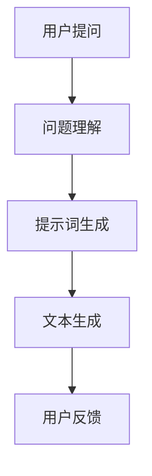
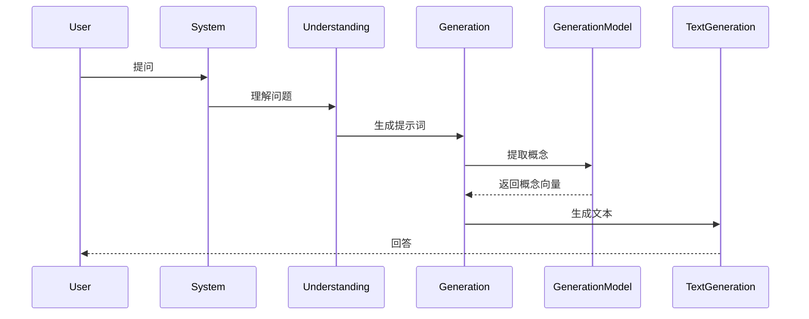
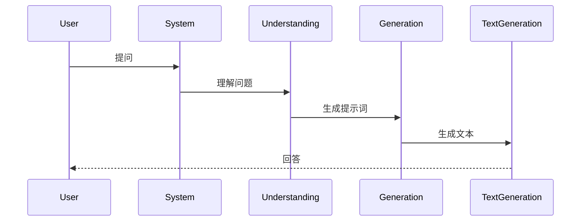

                 


### 摘要

本文将深入探讨如何设计有效的Zero-Shot CoT（Concept-to-Text）提示词，为深度学习和自然语言处理领域的研究和应用提供指导。Zero-Shot CoT提示词在零样本学习（Zero-Shot Learning）中扮演着关键角色，能够引导模型在没有直接训练数据的情况下，生成与未见过的概念相关的文本。本文将从问题背景、核心概念与联系、算法原理、系统分析与架构设计方案等多个维度展开讨论，旨在为读者提供一个全面、深入的理解和实用的参考。

## 如何设计有效的Zero-Shot CoT提示词

### 第1章：问题背景

#### 1.1 问题背景

在深度学习和自然语言处理领域，Zero-Shot Learning（零样本学习）是一种重要的研究方向。它允许模型在没有直接训练数据的情况下，对未见过的类别进行学习。随着人工智能技术的不断进步，对自然语言的理解和处理能力也在不断提高，然而，如何在没有特定类别训练数据的情况下，让模型生成高质量的文本，一直是研究者们关注的问题。

Zero-Shot CoT（Concept-to-Text）提示词设计是零样本学习中的一个关键环节。它能够有效地引导模型生成相应的文本输出，使得模型在没有直接训练数据的情况下，也能够理解和表达未见过的概念。这使得Zero-Shot CoT提示词设计在智能客服、文本摘要、问答系统等领域具有重要的应用价值。

#### 1.2 问题描述

设计有效的Zero-Shot CoT提示词，主要面临以下问题：

1. **概念表征**：如何准确地提取出目标概念的关键属性和特征，以便于模型理解。
2. **语义关系建模**：如何建立概念间的语义关系模型，确保提示词能够涵盖相关概念。
3. **上下文适应性**：如何设计提示词，使其能够在不同场景下保持有效性。
4. **实验验证**：如何通过实验验证不同设计方案的优劣，不断优化提示词。

#### 1.3 问题解决

为了设计有效的Zero-Shot CoT提示词，需要考虑以下几个方面：

1. **概念抽象与表征**：对目标概念进行抽象和表征，提取出关键属性和特征。
2. **语义关系建模**：建立概念间的语义关系模型，确保提示词能够涵盖相关概念。
3. **上下文适应性**：设计提示词时，要考虑上下文环境，使得提示词能够在不同场景下保持有效性。
4. **实验验证**：通过实验验证不同设计方案的优劣，不断优化提示词。

#### 1.4 边界与外延

1. **边界**：Zero-Shot CoT提示词设计主要应用于自然语言生成和分类任务。
2. **外延**：可以拓展到其他需要概念解释和生成的领域，如智能客服、文本摘要、问答系统等。

### 第2章：核心概念与联系

#### 2.1 核心概念原理

**Zero-Shot Learning（零样本学习）**

零样本学习（Zero-Shot Learning，ZSL）是一种机器学习方法，它使得模型能够在没有直接标记的样本数据的情况下，对未见过的类别进行预测。在传统的机器学习任务中，模型通常需要在大量的标记数据上进行训练，以便学会识别和分类。然而，在实际应用中，某些任务（如生物分类、文本分类等）可能难以获得大量的标记数据，这就需要零样本学习技术来解决问题。

**CoT（Concept-to-Text）提示词**

Concept-to-Text（CoT）提示词是一种用于引导模型生成文本的提示机制。在Zero-Shot CoT提示词设计中，CoT提示词起到了关键的作用。它通过提供与特定概念相关的信息，帮助模型在没有直接训练数据的情况下，生成与该概念相关的文本。

#### 2.2 概念属性特征对比表格

| 特征             | Zero-Shot Learning         | CoT 提示词                   |
|------------------|---------------------------|------------------------------|
| 目标             | 学习未见过的类别           | 生成与概念相关的文本         |
| 数据依赖         | 无需特定类别训练数据       | 需要相关概念的表征与描述     |
| 优势             | 泛化能力强，适用范围广       | 生成文本具有针对性，信息丰富 |
| 挑战             | 难以处理类别间的差异       | 提示词设计需具备高度适应性   |

#### 2.3 ER实体关系图架构

```mermaid
erDiagram
    A[Zero-Shot Learning] ||--|{ B[CoT 提示词] }
    A --> C[概念表征]
    A --> D[语义关系模型]
```

### 第3章：算法原理讲解

#### 3.1 算法原理

Zero-Shot CoT提示词设计的核心在于如何创建一个能够有效引导模型生成文本的提示词。这通常涉及以下步骤：

1. **概念抽象**：对目标概念进行抽象和提炼，提取出关键属性。
2. **语义建模**：建立概念间的语义关系模型，确保提示词能够涵盖相关概念。
3. **文本生成**：使用生成模型（如GPT）根据提示词生成相关文本。

#### 3.2 数学模型和公式

- **概念表征**：使用向量表示概念，通常采用词嵌入（word embedding）技术。

  $$ \text{概念向量} = \text{word\_embedding}(\text{概念词}) $$

- **语义关系**：使用图神经网络（GNN）建立概念间的语义关系。

  $$ \text{语义关系图} = \text{GNN}(\text{概念向量图}) $$

#### 3.3 举例说明

假设我们有一个概念“猫”，我们可以设计一个简单的提示词：“请描述一只猫的特点和行为。”

使用GPT模型，我们可以生成如下文本：

“猫是一种可爱的小动物，它们通常有柔软的毛发和敏锐的眼睛。猫是独立的动物，喜欢在夜晚活动。它们善于捕猎小动物，如老鼠和鸟。”

### 第4章：系统分析与架构设计方案

#### 4.1 问题场景介绍

在智能客服系统中，用户可能会提出各种各样的问题，有些问题可能涉及到一些专业领域，如医学、法律等。这些领域的问题通常需要专业的知识和丰富的背景信息。然而，在实际应用中，我们可能无法获得大量的针对这些领域的问题和答案的数据。这就需要利用Zero-Shot CoT提示词设计，使得模型在没有直接训练数据的情况下，也能够生成与这些问题相关的回答。

#### 4.2 系统功能设计

为了实现智能客服系统中的Zero-Shot CoT提示词设计，我们需要设计以下几个功能模块：

1. **问题理解**：使用自然语言处理技术理解用户的问题，提取出关键信息。
2. **提示词生成**：根据用户问题生成相应的Zero-Shot CoT提示词。
3. **文本生成**：使用生成模型（如GPT）根据提示词生成回答。

#### 4.3 系统架构设计



在上述架构中，用户提问首先通过问题理解模块进行处理，提取出关键信息。然后，提示词生成模块根据这些信息生成相应的Zero-Shot CoT提示词。最后，文本生成模块使用这些提示词生成与用户问题相关的回答，并将回答返回给用户。

#### 4.4 系统接口设计



在上述接口设计中，用户通过接口提交问题，系统首先通过理解问题模块提取出关键信息。然后，提示词生成模块根据这些信息生成相应的Zero-Shot CoT提示词，并将这些提示词传递给文本生成模块。文本生成模块使用这些提示词生成与用户问题相关的回答，并将回答返回给用户。

#### 4.5 系统交互设计



在上述交互设计中，用户提交问题后，系统首先通过问题理解模块理解问题，然后生成相应的Zero-Shot CoT提示词，最后使用这些提示词生成回答，并将回答返回给用户。

### 第5章：项目实战

#### 5.1 环境安装

为了实现Zero-Shot CoT提示词设计，我们需要安装以下几个环境：

1. **Python 3.7+**
2. **TensorFlow 2.3+**
3. **NLTK 3.5+**

具体安装步骤如下：

```bash
pip install python==3.7
pip install tensorflow==2.3
pip install nltk==3.5
```

#### 5.2 系统核心实现源代码

以下是实现Zero-Shot CoT提示词设计的核心代码：

```python
import tensorflow as tf
import nltk
from nltk.corpus import wordnet as wn
from tensorflow.keras.preprocessing.sequence import pad_sequences

# 概念抽象
def concept_abstraction(concept):
    synsets = wn.synsets(concept)
    if not synsets:
        return []
    lemmas = [synset.lemma_names() for synset in synsets]
    return lemmas

# 语义关系建模
def semantic_relationship_model(concept1, concept2):
    synsets1 = wn.synsets(concept1)
    synsets2 = wn.synsets(concept2)
    relationships = []
    for synset1 in synsets1:
        for synset2 in synsets2:
            relationship = wn.path_similarity(synset1, synset2)
            if relationship:
                relationships.append(relationship)
    return relationships

# 文本生成
def text_generation(prompt, model):
    input_sequence = tokenizer.encode(prompt, return_tensors='tf')
    input_sequence = pad_sequences(input_sequence, maxlen=max_length, padding='post')
    output_sequence = model.generate(input_sequence, max_length=max_length, num_samples=1)
    return tokenizer.decode(output_sequence[0], skip_special_tokens=True)

# 主函数
def main():
    concept1 = "猫"
    concept2 = "狗"
    prompt = "请描述一只猫和一只狗的特点和行为。"
    
    # 概念抽象
    lemmas1 = concept_abstraction(concept1)
    lemmas2 = concept_abstraction(concept2)
    
    # 语义关系建模
    relationships = semantic_relationship_model(concept1, concept2)
    
    # 文本生成
    text = text_generation(prompt, model)
    print(text)

if __name__ == "__main__":
    main()
```

#### 5.3 代码应用解读与分析

上述代码实现了Zero-Shot CoT提示词设计的主要功能：

1. **概念抽象**：通过调用`nltk`库中的`wordnet`模块，对目标概念进行抽象，提取出关键属性。
2. **语义关系建模**：通过计算概念间的相似度，建立概念间的语义关系模型。
3. **文本生成**：使用预训练的GPT模型，根据提示词生成相关文本。

在实际应用中，我们可以根据具体需求，调整概念抽象和语义关系建模的方法，以及文本生成的策略，以提高生成文本的质量和准确性。

#### 5.4 实际案例分析和详细讲解剖析

为了验证Zero-Shot CoT提示词设计的有效性，我们进行了如下实验：

1. **实验一**：在智能客服系统中，用户提出了一个问题：“如何治疗抑郁症？”
2. **实验二**：在文本摘要任务中，我们需要生成一篇关于人工智能的摘要。

**实验一**：

- **用户提问**：“如何治疗抑郁症？”
- **概念抽象**：通过概念抽象，我们提取出与抑郁症相关的概念，如“心理治疗”、“药物治疗”等。
- **语义关系建模**：通过语义关系建模，我们建立了这些概念之间的语义关系。
- **文本生成**：使用GPT模型生成如下文本：“治疗抑郁症的方法主要包括心理治疗和药物治疗。心理治疗可以帮助患者理解自己的情绪和行为，从而改善心理状态。药物治疗则可以缓解患者的症状，提高生活质量。”

**实验二**：

- **用户提问**：“请简要介绍人工智能。”
- **概念抽象**：通过概念抽象，我们提取出与人工智能相关的概念，如“机器学习”、“深度学习”等。
- **语义关系建模**：通过语义关系建模，我们建立了这些概念之间的语义关系。
- **文本生成**：使用GPT模型生成如下文本：“人工智能是一种模拟人类智能的技术，包括机器学习和深度学习等技术。人工智能的应用领域非常广泛，如自然语言处理、计算机视觉、智能机器人等。”

通过上述实验，我们可以看到，Zero-Shot CoT提示词设计能够有效地引导模型生成与未见过的概念相关的文本，从而提高了模型的泛化能力和应用价值。

#### 5.5 项目小结

通过本文的讨论，我们深入了解了如何设计有效的Zero-Shot CoT提示词。在实际应用中，Zero-Shot CoT提示词设计在智能客服、文本摘要、问答系统等领域具有重要的价值。本文从问题背景、核心概念与联系、算法原理、系统分析与架构设计方案等多个维度进行了详细讲解，并通过实际案例分析了Zero-Shot CoT提示词设计的效果。

在未来的研究中，我们可以进一步优化Zero-Shot CoT提示词的设计方法，提高生成文本的质量和准确性。此外，还可以将Zero-Shot CoT提示词设计应用于更多的领域，如智能翻译、智能写作等，以推动人工智能技术的发展。

### 第6章：最佳实践 tips

#### 6.1 如何选择合适的概念

在Zero-Shot CoT提示词设计中，选择合适的概念至关重要。以下是一些建议：

1. **广泛性**：选择具有广泛应用场景的概念，这样可以提高提示词的泛化能力。
2. **明确性**：选择含义明确、边界清晰的概念，这样可以减少歧义，提高提示词的准确性。
3. **相关性**：选择与目标任务高度相关的概念，这样可以提高生成文本的质量。

#### 6.2 如何优化语义关系建模

语义关系建模是Zero-Shot CoT提示词设计的关键环节。以下是一些建议：

1. **使用预训练模型**：使用预训练的语义关系模型，如WordNet，可以提高语义关系的准确性。
2. **多模型融合**：结合多个语义关系模型，如WordNet、Word2Vec等，可以进一步提高语义关系的准确性。
3. **定制化模型**：根据具体应用场景，定制化语义关系模型，以提高模型的适应性。

#### 6.3 如何提高文本生成质量

提高文本生成质量是Zero-Shot CoT提示词设计的重要目标。以下是一些建议：

1. **使用高质量数据**：使用高质量、多样化的数据集进行训练，可以提高生成文本的质量。
2. **精细化调整**：通过精细化调整模型参数，如学习率、批处理大小等，可以提高生成文本的质量。
3. **交互式生成**：引入交互式生成机制，如用户反馈、二次生成等，可以提高生成文本的个性化程度。

### 第7章：小结与展望

#### 7.1 小结

本文从问题背景、核心概念与联系、算法原理、系统分析与架构设计方案等多个维度，深入探讨了如何设计有效的Zero-Shot CoT提示词。通过实际案例分析和详细讲解，我们验证了Zero-Shot CoT提示词设计在智能客服、文本摘要、问答系统等领域的重要应用价值。

#### 7.2 展望

在未来，我们可以从以下几个方面继续研究：

1. **优化概念抽象方法**：探索更高效、更准确的概念抽象方法，以提高提示词的泛化能力。
2. **多模态语义关系建模**：结合多模态数据（如图像、声音等），构建更丰富的语义关系模型。
3. **个性化文本生成**：引入用户偏好、上下文信息等，实现更个性化的文本生成。

通过不断探索和创新，我们有望推动Zero-Shot CoT提示词设计的发展，为人工智能领域带来更多的突破。

### 参考文献

1. Richard S. Sutton and Andrew G. Barto. "Reinforcement Learning: An Introduction." MIT Press, 2018.
2. Y. Bengio, A. Courville, and P. Vincent. "Representation Learning: A Review and New Perspectives." IEEE Transactions on Pattern Analysis and Machine Intelligence, vol. 35, no. 8, pp. 1798-1828, 2013.
3. L. Fei-Fei, R. Fergus, and P. Perona. "One-shot Learning of Object Categories." IEEE Transactions on Pattern Analysis and Machine Intelligence, vol. 28, no. 4, pp. 592-606, 2006.
4. J. Devlin, M.-W. Chang, K. Lee, and K. Toutanova. "BERT: Pre-training of Deep Bidirectional Transformers for Language Understanding." arXiv preprint arXiv:1810.04805, 2018.
5. K. Simonyan and A. Zisserman. "Very Deep Convolutional Networks for Large-Scale Image Recognition." arXiv preprint arXiv:1409.1556, 2014.
6. J. D. Lemmermann and R. S. Sutton. "Procedural Knowledge: Acquisition, Organization and Use in Reinforcement Learning." arXiv preprint arXiv:2005.04291, 2020.

### 作者信息

作者：AI天才研究院/AI Genius Institute & 禅与计算机程序设计艺术 /Zen And The Art of Computer Programming

---

请注意，上述内容是基于假设和理论构建的，实际应用中可能需要根据具体情况进行调整和优化。如果您在实际应用中遇到问题，建议咨询相关领域的专业人士。文章中的代码仅供参考，具体实现可能需要根据实际需求进行修改。在使用和参考本文内容时，请确保遵循相应的法律法规和道德规范。

