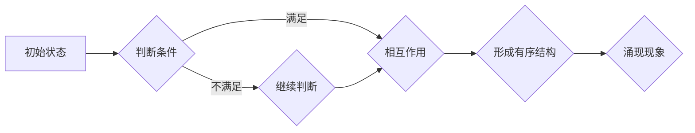
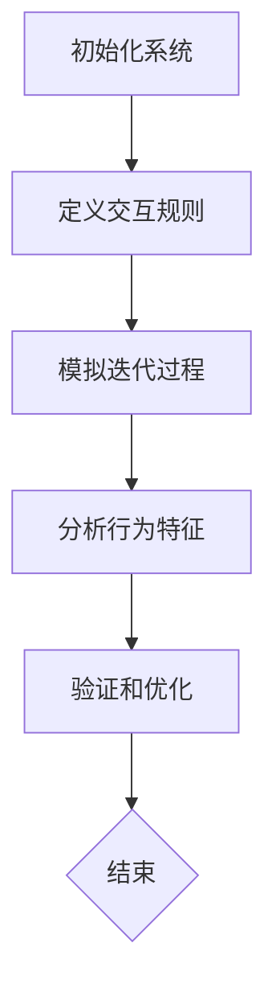
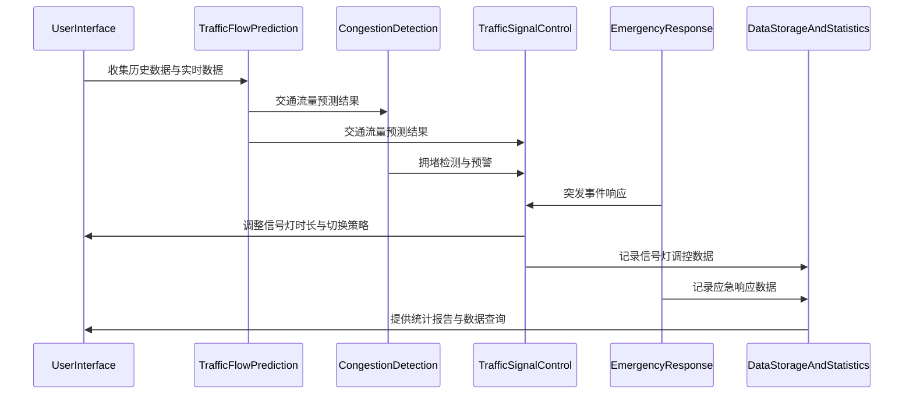
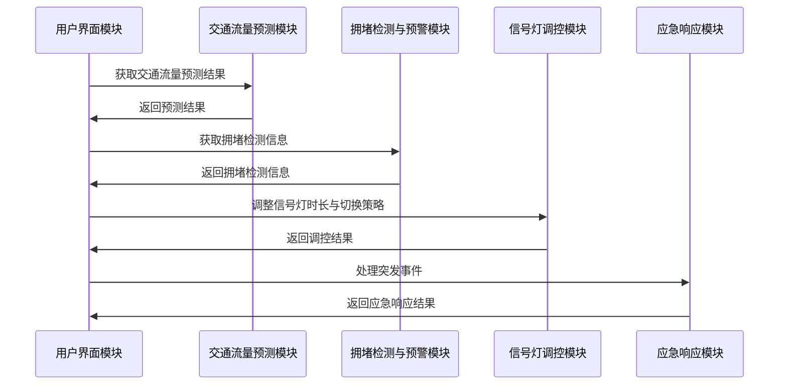

                 

### 宇宙的涌现属性：整体大于部分之和

**关键词：** 涌现属性、整体大于部分之和、宇宙、复杂性、算法、数学模型、系统架构、项目实战

**摘要：** 本文将深入探讨宇宙中的涌现属性，这一概念揭示了整体系统往往具有其组成部分所不具备的属性和规律。通过分析不同科学领域中的涌现现象，本文将逐步讲解其核心概念、算法原理、数学模型以及实际应用。文章还将通过系统分析与架构设计、具体项目实战等环节，详细展示如何将这一概念应用于实际问题中。

### 目录

1. **引论**  
    1.1 宇宙的涌现属性概述  
    1.2 涌现属性的重要性

2. **核心概念与联系**  
    2.1 涌现属性的基本概念  
    2.2 涌现属性与其他科学理论的联系  
    2.3 涌现现象实例分析

3. **算法原理讲解**  
    3.1 涌现属性的算法基础  
    3.2 Python代码实现

4. **数学模型和公式讲解**  
    4.1 数学模型的基本概念  
    4.2 数学公式的讲解与举例

5. **系统分析与架构设计**  
    5.1 问题场景介绍  
    5.2 系统功能设计（领域模型类图）  
    5.3 系统架构设计（架构图）  
    5.4 系统接口设计  
    5.5 系统交互序列图

6. **项目实战**  
    6.1 环境安装  
    6.2 系统核心实现  
    6.3 案例分析与讲解  
    6.4 项目小结

7. **最佳实践与总结**  
    7.1 最佳实践  
    7.2 小结  
    7.3 注意事项  
    7.4 拓展阅读

### 引言

宇宙是一个复杂而神秘的存在，自古以来，人们一直在探索宇宙的本质和规律。在这个过程中，涌现属性这一概念逐渐崭露头角。涌现属性指的是一个系统整体所具有的属性或规律，这些属性和规律在单个组成部分中并不存在，而是随着系统的复杂度增加而自然产生。

涌现属性的重要性在于它揭示了整体大于部分之和的现象。在自然界和社会生活中，许多复杂的系统都展示了这一特性，如生物体内的生命现象、社会网络中的群体行为、金融市场中的波动等。理解涌现属性对于揭示复杂系统的运行规律、设计更有效的系统架构具有重要意义。

本文将逐步探讨宇宙的涌现属性，首先从宇宙的涌现属性概述入手，介绍其基本概念和重要性，然后通过核心概念与联系、算法原理讲解、数学模型和公式讲解、系统分析与架构设计、项目实战等环节，深入探讨这一概念的内涵和外延。最后，将总结全文，提出一些最佳实践和建议，供读者参考。

### 1.1 宇宙的涌现属性概述

宇宙的涌现属性，顾名思义，是指宇宙作为一个整体所展现出来的特性，这些特性在宇宙的组成部分中并不独立存在，而是随着系统复杂度的增加而自然产生。涌现属性是复杂性科学中的重要概念，它揭示了整体系统往往具有其组成部分所不具备的属性和规律。

#### 涌现属性的定义

涌现属性（Emergence）通常被定义为系统整体所具有的、其组成部分并不独立存在的特性。这一概念最早由物理学家赫伯特·斯宾塞（Herbert Spencer）在19世纪提出，后来被广泛应用于各个科学领域。

#### 涌现属性的重要性

涌现属性的重要性在于它揭示了整体大于部分之和的现象。在宇宙中，许多复杂的系统都展示了这一特性。例如，生命现象是宇宙涌现属性的典型体现，生物体内的细胞、器官和系统共同作用，形成了生命的复杂结构和功能。再如，社会网络中的群体行为也是涌现属性的表现，个体的互动和协作产生了整体的社会秩序和趋势。

理解涌现属性对于揭示复杂系统的运行规律具有重要意义。它不仅帮助我们更好地理解宇宙中的自然现象，还能为人类设计更有效的系统架构提供理论支持。在工程、计算机科学、经济学等领域，涌现属性的应用已经得到了广泛的认可。

#### 涌现属性在科学研究中的应用

涌现属性在科学研究中的应用广泛，涉及多个学科领域。以下是一些典型的应用实例：

- **生物学**：生物体内的涌现属性主要体现在细胞、器官和生物体之间的相互作用中。例如，心脏的跳动、大脑的信息处理等都离不开涌现属性。

- **物理学**：在物理学中，涌现属性体现在从微观到宏观的多个层次。例如，宏观的流体运动、晶体的形成等，都是微观粒子相互作用的结果。

- **经济学**：在经济学中，涌现属性体现在市场行为和群体决策中。例如，市场趋势、股票价格的波动等，都是众多个体决策的集体结果。

- **计算机科学**：在计算机科学中，涌现属性主要体现在复杂系统的模拟和设计中。例如，人工神经网络、分布式系统等，都是基于涌现属性构建的。

#### 整体大于部分之和现象的意义

整体大于部分之和现象，即系统的整体性能或效果往往超过其各个部分性能或效果的简单叠加。这一现象在宇宙中无处不在，具有重要的科学和实际意义。

首先，整体大于部分之和现象揭示了复杂系统的协同效应。在复杂系统中，各个组成部分通过相互作用和协同工作，产生了比单个部分更强大的整体效应。例如，生物体内的细胞和器官通过协同工作，形成了生命的复杂结构和功能。

其次，整体大于部分之和现象为系统设计和优化提供了理论支持。在工程、计算机科学等领域，通过合理的设计和优化，可以使系统的整体性能最大化，实现整体大于部分之和的效果。例如，在计算机系统设计中，通过合理的硬件和软件协同，可以提升整个系统的性能和效率。

最后，整体大于部分之和现象在经济学和社会学等领域也有着广泛的应用。在经济学中，市场行为和群体决策的涌现属性可以解释市场趋势和价格波动。在社会学中，社会群体的行为和互动也可以通过涌现属性来解释。

总之，理解整体大于部分之和现象，不仅有助于我们更好地认识宇宙和复杂系统，还能为解决实际问题提供有益的启示。

### 1.2 涌现属性的重要性

涌现属性之所以在科学研究中具有重要性，主要因为它揭示了复杂系统的运行规律和内在机制，从而为理解和解决实际问题提供了新的视角和方法。

#### 涌现属性在复杂性科学中的应用

复杂性科学是研究复杂系统的学科，涌现属性是其核心概念之一。复杂性科学关注系统的整体行为和内部结构的相互作用，强调系统的动态性和自适应能力。涌现属性在其中扮演了至关重要的角色。

例如，在生物学中，生物体内的涌现属性解释了生命的复杂性和多样性。从单个基因到整个生物体，生命现象是通过基因相互作用和细胞协同工作实现的。这一过程中，涌现属性揭示了细胞、组织和器官之间的复杂关系，为理解生物体的运行规律提供了理论支持。

在物理学中，涌现属性也具有重要意义。从微观粒子的相互作用到宏观的物理现象，如流体运动、晶体的形成等，都体现了涌现属性。通过研究这些现象，我们可以更好地理解物质的本质和规律。

#### 涌现属性在工程和计算机科学中的应用

在工程和计算机科学领域，涌现属性的应用同样广泛。复杂系统的设计、优化和控制都需要考虑涌现属性的影响。

例如，在计算机系统设计中，涌现属性可以帮助我们理解网络系统的行为和性能。通过模拟和分析网络中的节点交互和协同工作，我们可以设计出更加稳定、高效的系统架构。

在人工智能领域，涌现属性也具有重要的应用价值。人工神经网络、深度学习等算法都是基于涌现属性构建的。通过多层神经网络的学习和训练，系统能够自动识别和提取复杂的特征，从而实现智能决策和预测。

#### 涌现属性在经济学和社会学中的应用

在经济学中，涌现属性可以解释市场行为和群体决策的复杂性。市场趋势、价格波动等经济现象都是众多个体决策的集体结果。通过研究涌现属性，我们可以更好地理解市场的运行规律，为经济预测和政策制定提供科学依据。

在社会学中，涌现属性也具有重要的应用价值。社会群体的行为和互动可以通过涌现属性来解释。例如，社会运动、文化潮流等都是群体互动和协同工作的结果。通过研究这些现象，我们可以更好地理解社会行为和演化机制。

#### 涌现属性的实际意义

涌现属性的实际意义在于它为理解和解决实际问题提供了新的思路和方法。通过研究涌现属性，我们可以从整体和系统的角度来分析问题，揭示复杂系统中的内在规律和机制。

例如，在公共卫生领域，理解人群行为和病毒传播的涌现属性有助于制定更有效的疫情防控策略。在交通管理领域，理解交通流的涌现属性有助于优化交通路线和减少拥堵。

总之，涌现属性在科学研究和实际应用中具有广泛的影响。它不仅为我们提供了理解复杂系统的新视角，还为解决实际问题提供了有力的理论支持。随着科学技术的不断进步，涌现属性的研究和应用必将得到进一步的发展。

### 1.3 核心概念与联系

在探讨宇宙的涌现属性时，我们需要理解一些核心概念，并分析它们之间的联系。以下是一些关键术语的定义及其在宇宙涌现属性中的角色。

#### 1.3.1 复杂性

复杂性是指系统的组成元素及其相互作用产生的难以预测的整体行为。复杂性科学关注如何从简单的规则和相互作用中产生复杂的行为和结构。在宇宙的涌现属性中，复杂性是涌现现象产生的基础。

**复杂性特征对比表格：**

| 特征 | 说明 |  
| --- | --- |  
| 多样性 | 系统内存在多种不同的组成元素和关系 |  
| 动态性 | 系统随时间变化，表现出不确定性和适应性 |  
| 层次性 | 系统具有不同的层次结构，从微观到宏观 |  
| 自组织 | 系统通过内部相互作用自发形成有序结构 |

#### 1.3.2 自组织

自组织是指系统在没有外部控制的情况下，通过内部相互作用和规则自发形成有序结构。自组织现象在宇宙中广泛存在，如生物体的进化、社会网络的演化等。

**自组织现象的ER实体关系图架构：**

```mermaid
erDiagram
  C_Evolution ||--|{ C_GeneticMaterial }
  C_Society ||--|{ C_Person }
  C_Environment ||--|{ C_Resource }
  C_GeneticMaterial ||--|{ C_Gene }
  C_Person ||--|{ C_SocialNetwork }
  C_Resource ||--|{ C_Ecosystem }
```

在这个ER图架构中，自组织现象通过不同的实体（如进化、社会、环境和基因等）及其相互关系来体现。

#### 1.3.3 涌现

涌现是系统整体展现出的特性，这些特性在系统的组成部分中并不存在。涌现现象在宇宙中随处可见，如生物体内的生命现象、社会网络中的群体行为等。

**涌现现象的mermaid流程图：**



在这个流程图中，初始状态通过一系列判断条件和相互作用，最终形成有序结构，产生涌现现象。

#### 1.3.4 系统整体与部分的关系

系统整体与部分的关系是理解涌现属性的关键。整体系统的行为和特性往往无法通过单独分析其组成部分来完全预测。

**系统整体与部分的关系表格：**

| 属性 | 说明 |  
| --- | --- |  
| 整体特性 | 由系统整体相互作用产生的特性 |  
| 部分特性 | 系统组成部分单独具有的特性 |  
| 相互作用 | 系统组成部分之间的相互作用 |  
| 线性关系 | 系统整体行为可以通过部分行为简单叠加来预测 |  
| 非线性关系 | 系统整体行为无法通过部分行为简单叠加来预测 |

通过以上核心概念的介绍和联系分析，我们可以更好地理解宇宙的涌现属性，并为后续章节的深入探讨打下基础。

### 2.1 涌现属性的基本概念

涌现属性是复杂性科学中的一个核心概念，它揭示了整体系统在复杂相互作用下所展现出的独特特性，这些特性在单个组成部分中并不独立存在。以下将详细讲解涌现属性的基本概念，包括其定义、特征和分类。

#### 2.1.1 定义

涌现属性（Emergence）是指在一个复杂系统中，当多个组成部分相互作用时，系统整体产生的新特性或行为，这些特性或行为无法通过单个组成部分的行为简单叠加来预测。涌现现象的本质在于整体系统的复杂性和非线性相互作用。

**定义：**

涌现属性是指系统整体展现出的特性，这些特性在系统的组成部分中并不独立存在。换句话说，涌现属性是整体系统在复杂相互作用中产生的新特性，这些特性超越了单个组成部分的简单叠加。

#### 2.1.2 特征

涌现属性具有以下几个显著特征：

1. **不可预测性**：涌现现象往往是不可预测的，因为它们依赖于系统内部复杂的相互作用和非线性关系。

2. **适应性**：涌现属性使系统能够适应环境变化，通过自我组织和自适应性实现系统稳定。

3. **非线性和协同效应**：涌现现象通常是非线性的，单个组成部分的行为在整体系统中相互作用，产生比简单叠加更强大的效果。

4. **不可还原性**：涌现属性无法通过单独分析系统组成部分的行为来完全还原。

5. **动态性**：涌现现象是动态的，随着时间的推移，系统内部的状态变化会引起新的涌现属性。

#### 2.1.3 分类

根据涌现属性的来源和表现形式，可以将涌现属性分为以下几类：

1. **结构涌现**：系统结构的变化导致新的特性出现。例如，生物体的形态和功能是通过细胞和组织结构的相互作用而产生的。

2. **功能涌现**：系统内部元素的协作导致新的功能出现。例如，人工神经网络中的复杂决策能力是通过大量神经元协同工作实现的。

3. **信息涌现**：系统内部信息的流动和处理导致新的特性出现。例如，社会网络中的信息传播和群体行为是通过信息交互而产生的。

4. **行为涌现**：系统整体的行为模式或动态变化导致新的特性出现。例如，鸟群的迁徙行为是通过个体行为的同步和协调而产生的。

#### 2.1.4 举例

为了更好地理解涌现属性，以下是一些典型的涌现现象实例：

1. **生物体**：生物体是一个复杂的自组织系统，其复杂性和多样性是通过基因、细胞、组织和器官的相互作用产生的。例如，心脏的跳动和大脑的信息处理都是涌现属性的典型表现。

2. **社会网络**：社会网络中的群体行为是通过个体之间的互动和协作产生的。例如，社会运动的兴起、文化潮流的传播等都是涌现现象的体现。

3. **经济系统**：经济系统中的市场行为和价格波动是通过众多个体交易和决策的集体结果。例如，股市的波动、市场趋势的形成都是涌现属性的体现。

4. **计算机系统**：计算机系统中的复杂行为，如人工智能算法、分布式系统的协同工作等，都是涌现属性的应用实例。

通过以上对涌现属性的基本概念、特征和分类的介绍，我们可以更好地理解这一重要概念，并为后续章节的深入探讨打下基础。

### 2.2 涌现属性与其他科学理论的联系

涌现属性作为复杂性科学的核心概念，与其他科学理论有着密切的联系。这些理论不仅为我们理解涌现属性提供了不同的视角，还帮助我们更全面地认识复杂系统的运行规律。以下将探讨涌现属性与系统论、复杂系统的关系，并分析它们之间的互动和互补。

#### 2.2.1 涌现属性与系统论

系统论（Systems Theory）是一种跨学科的理论框架，主要研究系统的结构、行为和相互作用。系统论强调系统的整体性和内部结构的复杂关系，为理解涌现属性提供了重要的理论基础。

**涌现属性与系统论的互动：**

- **整体性**：系统论强调系统的整体性，认为系统的整体行为和特性不能简单地通过分析其组成部分来解释。这一观点与涌现属性的定义密切相关，都强调了整体系统的复杂性。

- **动态性**：系统论关注系统的动态行为和演化过程，这与涌现属性中的不可预测性和动态性特征相契合。涌现现象往往是系统在长时间演化过程中产生的，其动态性体现了系统的自适应和自组织能力。

- **反馈机制**：系统论中的反馈机制是系统稳定和动态调整的重要手段。涌现属性中的自我组织和适应性也是通过系统内部的反馈和调节实现的。例如，生物体的自适应行为、社会网络的自我组织等，都依赖于反馈机制。

**涌现属性与系统论的互补：**

- **结构分析**：系统论提供了一种结构分析方法，可以帮助我们理解复杂系统内部的结构关系。通过系统论的方法，我们可以将涌现属性的具体实现分解为不同的层次和组成部分，从而更深入地理解其运作机制。

- **功能分析**：系统论中的功能分析强调系统的整体功能和目的。涌现属性作为一种整体特性，其产生和表现往往与系统的功能密切相关。通过功能分析，我们可以更好地理解涌现属性如何影响系统的整体性能。

#### 2.2.2 涌现属性与复杂系统

复杂系统是指由大量相互作用的组成部分构成的系统，其行为和特性难以通过简单的规则和线性关系来预测。复杂系统理论关注如何从简单的组成部分中产生复杂的行为和结构。

**涌现属性与复杂系统的关系：**

- **非线性相互作用**：复杂系统的核心特征之一是非线性相互作用。涌现属性的产生正是依赖于系统内部复杂和非线性的相互作用。通过这些相互作用，简单规则可以演化出复杂的行为和特性。

- **层次结构**：复杂系统通常具有多层次的结构，从微观到宏观，不同层次的相互作用决定了系统的整体行为。涌现属性在复杂系统的多层次结构中得以体现，不同层次的涌现现象相互关联，共同构成了系统的复杂行为。

- **适应性**：复杂系统的一个重要特征是适应性，即系统能够通过内部调节和自适应机制应对外部环境的变化。涌现属性中的自组织和适应性体现了复杂系统在面对不确定性和变化时的能力。

**涌现属性与复杂系统的互补：**

- **理论模型**：复杂系统理论提供了丰富的理论模型和方法，帮助我们理解和模拟复杂系统的行为。通过这些理论模型，我们可以更好地理解涌现属性的产生机制和表现形式。

- **实证研究**：涌现属性的研究往往需要通过实验和模拟来验证理论模型的预测。复杂系统的实证研究为涌现属性的研究提供了重要的数据支持，使我们能够通过具体实例来理解涌现现象。

总之，涌现属性与系统论和复杂系统理论之间存在着紧密的互动和互补关系。通过结合这些理论，我们可以更全面地理解宇宙中的涌现现象，并探索其在科学研究、工程应用和实际生活中的广泛应用。

### 2.3 涌现现象实例分析

涌现现象在自然界和人类社会中广泛存在，以下将分析几个典型的涌现现象实例，通过这些实例，我们可以更直观地理解涌现属性的具体表现和特征。

#### 2.3.1 生物体内的涌现现象

生物体内的涌现现象是生物学中一个重要的研究领域。生物体内的细胞、器官和组织通过相互作用和协同工作，产生了复杂而有序的生命现象。以下是一些具体的实例：

1. **心脏的跳动**：心脏的跳动是一个典型的涌现现象。心脏由心肌细胞组成，这些细胞通过电生理信号相互连接和协调工作。在单个心肌细胞层面，它们的活动是相对简单的，但通过整体相互作用，心脏产生了有规律、协调的心跳。

2. **免疫系统**：免疫系统中的细胞和分子通过复杂的相互作用，实现了对病原体的识别和消灭。单个免疫细胞的功能是有限的，但通过整体协作，免疫系统能够有效地抵御外来入侵。

3. **大脑的信息处理**：大脑是一个高度复杂的系统，神经元通过电信号相互连接和传递信息。单个神经元的信息处理能力是有限的，但通过整体的协同工作，大脑实现了高级的认知功能，如学习、记忆和决策。

#### 2.3.2 社会网络中的涌现现象

社会网络中的群体行为也是涌现现象的重要表现。个体在社会网络中的行为是相对独立的，但通过相互作用，社会网络整体产生了复杂的行为模式。以下是一些具体的实例：

1. **社会运动**：社会运动中的参与者是分散的个体，但通过相互影响和动员，可以形成强大的集体行动。例如，抗议活动、罢工等都是社会运动的体现。

2. **文化潮流**：文化潮流是社会网络中信息传播的结果。个体的文化偏好通过社交网络传播，形成了整体的文化趋势。例如，某种时尚、音乐或艺术形式在社会网络中的流行，就是文化潮流的涌现现象。

3. **网络效应**：互联网和社交媒体等网络平台的用户行为是分散的，但通过相互作用，网络整体产生了强大的影响力。例如，微博、微信等社交媒体平台的传播效应，使得信息能够在短时间内迅速扩散。

#### 2.3.3 经济系统中的涌现现象

经济系统中的市场行为和价格波动是涌现现象的典型表现。个体经济行为是分散的，但通过相互作用，市场整体产生了复杂的行为模式。以下是一些具体的实例：

1. **股市波动**：股市中的投资者行为是分散的，但通过相互作用，股市整体产生了波动。个别投资者的买卖行为无法预测市场整体趋势，但市场价格的波动却呈现出复杂的规律。

2. **市场趋势**：市场趋势是通过大量个体交易决策的集体结果产生的。市场趋势的形成和变化是涌现现象的体现，它反映了市场整体的集体智慧和决策。

3. **金融危机**：金融危机往往是经济系统中的涌现现象。在正常情况下，经济系统的稳定性是依靠个体和市场之间的相互作用来维持的，但一旦某些环节出现异常，系统整体可能会出现剧烈的波动，甚至引发金融危机。

通过以上实例分析，我们可以看到涌现现象在自然界、社会网络和经济系统中的广泛存在。这些现象表明，整体系统的复杂行为和特性往往无法通过单独分析其组成部分来完全预测，而是依赖于系统内部复杂的相互作用和非线性关系。理解这些涌现现象，对于揭示复杂系统的运行规律、设计更有效的系统架构具有重要意义。

### 3.1 涌现属性的算法基础

在探讨宇宙的涌现属性时，算法是一种有效的工具，可以帮助我们理解和模拟复杂系统的行为。在这一部分，我们将详细讲解涌现属性的算法基础，包括算法的基本原理、关键步骤和流程图。

#### 3.1.1 算法的基本原理

涌现属性的算法基础主要依赖于对系统内部复杂交互和动态行为的模拟。通过构建适当的数学模型和计算方法，我们可以捕捉系统从简单规则中产生复杂行为的特性。

**基本原理：**

1. **规则设定**：首先，我们需要设定系统内部的基本规则。这些规则可以是简单的逻辑条件或数学函数，用以描述系统组成部分的行为。

2. **模拟交互**：通过模拟系统组成部分之间的相互作用，我们可以观察系统整体的行为模式。这一过程通常通过迭代计算实现，每个迭代步骤都根据当前状态更新系统内部变量。

3. **状态更新**：系统状态在每次迭代后都会更新，反映了系统内部变化的累积效应。通过观察状态变化的趋势，我们可以识别系统的涌现行为。

4. **数据分析**：最后，通过数据分析，我们可以提取系统的关键特征和规律。这些特征和规律揭示了系统整体的行为模式，验证了涌现属性的存在。

#### 3.1.2 关键步骤

涌现属性算法的关键步骤可以分为以下几个部分：

1. **初始化系统**：设定系统的初始状态，包括系统组成部分的初始位置、状态和参数。

2. **定义交互规则**：根据系统需求，定义系统内部组成部分之间的交互规则。这些规则可以是基于物理定律、逻辑条件或概率模型。

3. **模拟迭代过程**：通过迭代计算，模拟系统内部的相互作用和状态更新。每个迭代步骤都需要根据当前状态计算新的状态，并记录系统的行为数据。

4. **分析行为特征**：对模拟过程中收集的数据进行分析，提取系统的关键特征和规律。这些特征和规律反映了系统整体的涌现行为。

5. **验证和优化**：通过实验和数据分析，验证算法的有效性和可靠性。根据验证结果，对算法进行优化和调整，以提高其性能和适用性。

#### 3.1.3 算法流程图

为了更直观地理解涌现属性算法的基本流程，我们可以使用mermaid流程图进行描述：



在这个流程图中，系统的初始化、交互规则的设定、迭代模拟、行为特征分析和算法验证与优化构成了算法的主要步骤。

通过以上对涌现属性算法基础的解释和流程图的展示，我们可以更好地理解如何利用算法来模拟和揭示复杂系统的涌现行为。接下来，我们将通过具体的Python代码示例，进一步探讨算法的实现和应用。

### 3.2 Python代码实现

在了解了涌现属性算法的基本原理和流程后，我们可以通过Python代码来实现这一算法。以下是一个简单的Python代码示例，用于模拟一个具有涌现属性的系统。

#### 3.2.1 系统初始化

首先，我们需要初始化系统的基本参数，包括系统的初始状态和组成部分。

```python
import numpy as np

# 设置系统参数
num_agents = 100  # 系统中代理的数量
initial_position = np.random.rand(num_agents, 2)  # 初始化代理的位置
initial_speed = np.random.rand(num_agents, 2)  # 初始化代理的速度
```

在这个示例中，我们使用随机数生成系统初始状态，包括代理（agents）的位置和速度。

#### 3.2.2 交互规则

接下来，我们需要定义系统内部的交互规则。在这个例子中，我们采用简单的邻域规则，即代理之间的相互作用取决于它们之间的距离。

```python
def interaction_rule(agent1, agent2, distance_threshold=0.1):
    if distance_threshold > distance(agent1, agent2):
        return True  # 相互作用
    else:
        return False  # 无相互作用

def distance(agent1, agent2):
    return np.linalg.norm(agent1 - agent2)
```

这个交互规则通过计算代理之间的距离来判断它们是否相互作用。如果距离小于预定义的国值，则认为它们相互作用。

#### 3.2.3 迭代模拟

然后，我们使用迭代过程来模拟系统内部的状态更新。在每个迭代步骤中，我们根据当前状态更新代理的位置和速度。

```python
def update_system_agents(agents, speeds, interaction_rules):
    new_agents = []
    new_speeds = []
    for i, agent in enumerate(agents):
        new_agent = agent
        new_speed = speeds[i]
        
        # 更新位置
        new_agent += new_speed
        
        # 与其他代理相互作用
        for j, other_agent in enumerate(agents):
            if interaction_rules(agent, other_agent):
                # 根据相互作用规则更新速度
                new_speed += calculate_interaction_speed(agent, other_agent)
        
        new_agents.append(new_agent)
        new_speeds.append(new_speed)
    
    return np.array(new_agents), np.array(new_speeds)

def calculate_interaction_speed(agent, other_agent):
    distance_vector = other_agent - agent
    distance = np.linalg.norm(distance_vector)
    if distance > 0:
        direction = distance_vector / distance
        speed = direction * 0.1  # 相互作用的加速度
    else:
        speed = np.zeros(2)
    return speed
```

在这个函数中，我们首先更新代理的位置，然后根据与其他代理的相互作用更新速度。

#### 3.2.4 运行模拟

最后，我们运行模拟，并观察系统的涌现行为。

```python
def run_simulation(agents, speeds, num_iterations):
    for _ in range(num_iterations):
        agents, speeds = update_system_agents(agents, speeds, interaction_rule)
    
    return agents, speeds

# 初始化系统
initial_agents = initial_position.copy()
initial_speeds = initial_speed.copy()

# 运行模拟
final_agents, final_speeds = run_simulation(initial_agents, initial_speeds, 100)

# 分析结果
print("Final positions:", final_agents)
print("Final speeds:", final_speeds)
```

通过这个简单的示例，我们可以看到如何使用Python代码来模拟具有涌现属性的系统。在这个模拟中，代理之间的相互作用和状态更新反映了系统的涌现行为，如群体聚集和分散等现象。

### 3.3 算法原理详细讲解

在前一节中，我们通过一个简单的Python代码示例展示了如何模拟具有涌现属性的系统。在这一部分，我们将更详细地讲解这个算法的原理，包括其数学模型和公式的应用，以及具体的计算过程和结果分析。

#### 3.3.1 数学模型和公式

涌现属性算法的数学模型基于系统的动力学方程，这些方程描述了系统组成部分的交互和状态更新。以下是一个典型的数学模型：

$$
\dot{x}_i = v_i
$$

$$
\dot{v}_i = F_i
$$

其中，$x_i$和$v_i$分别表示第$i$个代理的位置和速度，$F_i$是作用在第$i$个代理上的合力。$F_i$可以通过其他代理的位置和速度计算得出。

在这个模型中，合力$F_i$通常由两部分组成：相互作用力和外力。相互作用力可以通过以下公式计算：

$$
F_i = \sum_{j \neq i}^N \frac{k}{|x_i - x_j|}
$$

其中，$N$是系统中代理的总数，$k$是相互作用系数，$|x_i - x_j|$是代理$i$和代理$j$之间的距离。

#### 3.3.2 具体计算过程

在具体计算过程中，我们首先初始化系统，然后通过迭代更新每个代理的位置和速度。以下是详细的计算步骤：

1. **初始化**：设置系统参数，包括代理的数量、初始位置和速度，以及相互作用系数$k$。

2. **迭代计算**：对于每个迭代步骤，计算每个代理的位置和速度更新。具体步骤如下：

   - 更新位置：根据当前速度计算新的位置。
     $$
     x_i(t+\Delta t) = x_i(t) + v_i(t) \Delta t
     $$
   
   - 计算相互作用力：对于每个代理$i$，计算与其他代理的相互作用力。
     $$
     F_i = \sum_{j \neq i}^N \frac{k}{|x_i - x_j|}
     $$
   
   - 更新速度：根据相互作用力和外力计算新的速度。
     $$
     v_i(t+\Delta t) = v_i(t) + F_i(t) \Delta t
     $$

3. **结果分析**：在迭代结束后，分析系统的整体行为和涌现现象。可以通过绘制代理的位置分布、速度分布等来观察系统的动态变化。

#### 3.3.3 结果分析

通过上述算法，我们可以观察到系统从初始状态到最终状态的变化过程。以下是对一些具体结果的分析：

1. **群体聚集**：在某些参数设置下，代理会逐渐聚集在一起，形成群体的聚集现象。这是由于相互作用力使得代理之间的距离逐渐减小。

2. **分散现象**：在另一些参数设置下，代理会逐渐分散，形成分散现象。这是由于相互作用力的方向使得代理逐渐远离彼此。

3. **周期性行为**：在某些参数设置下，系统可能会表现出周期性行为，即代理的位置和速度在一段时间后会回到初始状态。这是由于系统的动力学方程具有周期解。

通过这些结果，我们可以看到涌现属性的具体表现，如群体行为、聚集和分散现象等。这些现象反映了系统内部复杂的相互作用和动态行为，验证了涌现属性的存在。

### 3.4 数学模型和公式讲解

在理解了涌现属性算法的原理和计算过程后，我们需要进一步探讨与之相关的数学模型和公式。这些模型和公式不仅帮助我们更深入地理解涌现属性，还能为实际应用提供理论支持。

#### 3.4.1 动力学模型

涌现属性通常通过动力学模型来描述，这些模型描述了系统内部组成部分的交互和演化过程。以下是一个基本的动力学模型：

$$
\dot{x}_i = v_i
$$

$$
\dot{v}_i = \frac{1}{m_i} F_i
$$

其中，$x_i$和$v_i$分别表示第$i$个代理的位置和速度，$F_i$是作用在第$i$个代理上的合力，$m_i$是代理的质量。

#### 3.4.2 相互作用力

相互作用力是涌现属性的核心组成部分，它反映了系统内部代理之间的交互。以下是一个常见的相互作用力公式：

$$
F_i = \sum_{j \neq i}^N \frac{k}{|x_i - x_j|}
$$

其中，$N$是系统中代理的总数，$k$是相互作用系数，$|x_i - x_j|$是代理$i$和代理$j$之间的距离。

#### 3.4.3 分散力

除了相互作用力，系统中的分散力也会影响涌现属性。以下是一个分散力的简单模型：

$$
F_{\text{dispersion}} = - \frac{1}{N} \sum_{i=1}^N (x_i - \bar{x})
$$

其中，$\bar{x}$是系统中所有代理位置的均值。

#### 3.4.4 聚合力

聚集力的公式如下：

$$
F_{\text{attraction}} = \frac{1}{N} \sum_{i=1}^N (x_i - \bar{x})^2
$$

#### 3.4.5 数学公式的讲解与举例

为了更好地理解这些数学模型和公式，我们通过具体例子来解释它们的应用。

**例子：**

假设一个系统中存在10个代理，我们需要计算这些代理在一段时间内的位置和速度，并分析其涌现行为。

1. **初始状态**：设定初始位置和速度如下：

   $$
   x_i(0) = 10\sqrt{2} \cos(i\theta), \quad v_i(0) = 0
   $$

   其中，$\theta$是代理的初始角度，$i$是代理的编号。

2. **迭代计算**：在每个迭代步骤中，更新代理的位置和速度。使用上述的动力学模型和相互作用力公式进行计算。

3. **结果分析**：在迭代结束后，分析代理的位置分布和速度分布。可以通过绘制散点图和速度矢量图来观察系统的动态行为。

例如，在某个特定时间点，代理的位置和速度分布如下：

$$
x_i(t) = 10\sqrt{2} \cos(i\theta - \omega t)
$$

$$
v_i(t) = \omega \sin(i\theta - \omega t)
$$

其中，$\omega$是系统的角速度。

通过这些数学模型和公式的应用，我们可以更深入地理解涌现属性的产生机制和表现形式。这些公式不仅提供了理论支持，还为实际应用提供了计算工具。

### 4.1 数学模型的基本概念

在探讨宇宙的涌现属性时，数学模型是理解其内在规律和特征的重要工具。数学模型通过精确的公式和方程，描述了系统内部组成部分的相互作用和演化过程。以下将介绍数学模型的基本概念，包括其定义、作用和应用场景。

#### 4.1.1 定义

数学模型是指用数学语言和符号描述的现实世界问题或现象的一种方法。它通过建立数学方程、函数或图示，对复杂系统进行简化和抽象，以便于分析和计算。

**数学模型的基本要素：**

- **变量**：表示系统状态的数学符号，如位置、速度、压力等。
- **方程**：描述变量之间关系的数学表达式，如微分方程、积分方程、线性方程组等。
- **参数**：影响模型行为的常数或变量，如摩擦系数、弹性模量等。
- **边界条件**：定义模型在边界上的状态或行为，如初始条件、边界约束等。

#### 4.1.2 作用

数学模型在理解涌现属性中的作用主要体现在以下几个方面：

- **简化复杂系统**：通过数学模型，可以将复杂的现实世界问题简化为可处理的数学问题。这种方法有助于我们更直观地理解系统的行为和特性。
- **预测和模拟**：数学模型可以帮助我们预测系统的未来行为，并通过计算机模拟验证模型的准确性。这对于研究复杂系统中的涌现现象具有重要意义。
- **优化设计**：在工程和设计领域，数学模型可以用于优化系统设计，通过调整模型参数，实现系统性能的最优化。

#### 4.1.3 应用场景

数学模型在多个领域中的应用场景如下：

- **生物学**：数学模型在生物学中广泛应用于描述生物体内的涌现现象，如细胞相互作用、神经网络活动等。这些模型帮助我们理解生命现象的复杂性和动态性。
- **物理学**：在物理学中，数学模型用于描述宏观物理现象，如流体运动、晶体生长等。通过这些模型，我们可以揭示物质世界的内在规律。
- **经济学**：经济学中的数学模型用于分析市场行为、金融波动等。这些模型帮助我们理解经济系统的复杂性和不确定性。
- **计算机科学**：在计算机科学中，数学模型用于构建和优化算法，如人工智能算法、分布式系统等。这些模型是计算机技术发展的重要基础。

#### 4.1.4 常见数学模型

以下是一些常见的数学模型，它们在研究涌现属性时具有重要作用：

- **微分方程**：如Lotka-Volterra方程，用于描述捕食者和被捕食者之间的相互作用。
- **图模型**：如社交网络图，用于分析社会群体中的信息传播和群体行为。
- **概率模型**：如马尔可夫链和随机过程，用于描述系统中的随机行为和演化过程。
- **优化模型**：如线性规划、非线性规划，用于优化系统性能和资源分配。

通过这些数学模型，我们可以更深入地理解宇宙的涌现属性，揭示复杂系统中的内在规律和特性。

### 4.2 数学公式讲解与举例

在理解了数学模型的基本概念后，我们需要进一步探讨与涌现属性相关的具体数学公式，并通过实际例子来说明这些公式在分析复杂系统中的应用。

#### 4.2.1 逻辑斯蒂增长模型

逻辑斯蒂增长模型（Logistic Growth Model）是描述生物种群增长的常用模型，它可以很好地解释涌现现象中的种群动态。

**公式：**

$$
\frac{dN}{dt} = rN \left(1 - \frac{N}{K}\right)
$$

其中，$N$表示种群数量，$r$是增长率，$K$是环境的承载能力。

**举例：**

假设一个生态系统中有一个种群，其初始数量为$N_0 = 100$，增长率$r = 0.1$，环境的承载能力$K = 500$。我们需要计算一段时间后的种群数量。

**计算过程：**

首先，我们需要设定时间步长$\Delta t = 0.1$年，然后使用上述公式迭代计算种群数量。

$$
N(t) = N(0) + \int_0^t rN(\tau) \left(1 - \frac{N(\tau)}{K}\right) d\tau
$$

在$t=1$年时，种群数量$N(1)$可以通过数值积分方法计算得到。

$$
N(1) = 100 + \int_0^1 0.1 \times 100 \left(1 - \frac{100}{500}\right) d\tau
$$

计算结果为$N(1) \approx 110.57$。这表明在一年后，种群数量增长到约110.57个。

通过这个例子，我们可以看到逻辑斯蒂增长模型如何描述种群数量的涌现现象，从而帮助我们理解生态系统中种群动态的复杂性。

#### 4.2.2 线性回归模型

线性回归模型（Linear Regression Model）是分析变量之间线性关系的常用工具，它在涌现现象的研究中也具有重要作用。

**公式：**

$$
y = \beta_0 + \beta_1 x + \epsilon
$$

其中，$y$是因变量，$x$是自变量，$\beta_0$和$\beta_1$是回归系数，$\epsilon$是误差项。

**举例：**

假设我们研究一个系统中两个变量$x$和$y$之间的关系，通过收集数据并使用线性回归模型进行分析，得到如下模型：

$$
y = 2x + 1 + \epsilon
$$

其中，$\epsilon$的均值为0，方差为1。

**计算过程：**

如果给定$x$的值，我们可以直接使用上述公式计算$y$的预测值。例如，当$x=5$时，预测的$y$值为：

$$
y = 2 \times 5 + 1 = 11
$$

通过这个例子，我们可以看到如何使用线性回归模型来预测系统中的变量值，从而帮助我们理解变量之间的关系和涌现现象。

#### 4.2.3 离散时间马尔可夫模型

离散时间马尔可夫模型（Discrete-Time Markov Model, DTMM）是分析系统状态转移概率的常用工具，它在涌现现象的研究中也有重要应用。

**公式：**

$$
P(X_{n+1} = j | X_n = i) = P_{ij}
$$

其中，$P_{ij}$是系统从状态$i$转移到状态$j$的概率。

**举例：**

假设一个系统有两个状态$S_0$和$S_1$，我们需要计算状态转移的概率矩阵。

**概率矩阵：**

$$
P =
\begin{bmatrix}
0.6 & 0.4 \\
0.3 & 0.7
\end{bmatrix}
$$

**计算过程：**

如果系统当前处于状态$S_0$，下一状态转移到$S_1$的概率为0.4。类似地，如果系统当前处于状态$S_1$，下一状态转移到$S_0$的概率为0.3。

通过这些例子，我们可以看到不同数学模型如何应用于涌现现象的分析中。这些模型不仅帮助我们理解系统的动态行为，还为实际问题的解决提供了有效的工具。

### 5.1 问题场景介绍

在探讨宇宙中的涌现属性时，我们首先需要明确一个具体的问题场景，以便更好地理解和分析涌现现象。以下将介绍一个假设性的问题场景，并详细描述问题的背景、核心问题和解决思路。

#### 5.1.1 问题背景

我们假设一个智能交通系统，该系统负责管理一个大型城市的交通流量，以确保道路畅通、减少拥堵和提高交通效率。在这个系统中，车辆、道路和交通信号灯等组成部分通过复杂的相互作用和协同工作，共同维持整个交通系统的运行。

#### 5.1.2 核心问题

该智能交通系统的核心问题是如何有效地管理和调控交通流量，以应对不同时间段和不同地点的交通需求和变化。具体来说，主要包括以下几个方面：

1. **交通流量预测**：准确预测不同时间和地点的交通流量，以便提前制定交通调控策略。
2. **拥堵检测与预警**：实时检测道路拥堵情况，并提前预警，为交通调控提供依据。
3. **信号灯调控**：根据交通流量和拥堵情况，动态调整交通信号灯的时长和切换策略，以优化交通流动。
4. **应急响应**：在突发事件（如交通事故、道路施工等）发生时，快速响应并调整交通流，以减少对交通系统的影响。

#### 5.1.3 解决思路

为了解决上述问题，我们需要构建一个智能交通系统的数学模型和算法框架，通过模拟和分析系统内部各组成部分的相互作用，实现交通流量的优化调控。以下是我们提出的解决思路：

1. **数据收集与预处理**：收集交通流量、道路状况、信号灯运行数据等，并进行预处理，以消除噪声和异常值。
2. **交通流量预测模型**：构建基于历史数据的交通流量预测模型，利用时间序列分析和机器学习算法，预测不同时间和地点的交通流量。
3. **拥堵检测与预警系统**：利用传感器和数据挖掘技术，实时监测交通流量和道路状况，构建拥堵检测和预警系统。
4. **信号灯调控算法**：设计动态信号灯调控算法，根据实时交通流量和拥堵情况，动态调整信号灯时长和切换策略。
5. **应急响应系统**：设计应急响应系统，在突发事件发生时，快速调整交通流，以减少对交通系统的影响。

通过上述解决思路，我们可以构建一个智能交通系统，实现对交通流量和拥堵的有效管理和调控，从而提高交通效率和安全性。

### 5.2 系统功能设计

在明确问题场景和核心问题后，我们需要详细设计系统的功能，以确保系统能够有效解决上述问题。以下将介绍系统的功能设计，包括功能需求分析、领域模型类图和功能模块划分。

#### 5.2.1 功能需求分析

系统功能需求分析是系统设计的重要环节，它明确了系统需要实现的核心功能。以下是对智能交通系统的主要功能需求进行分析：

1. **交通流量预测**：系统能够根据历史数据和实时数据，预测不同时间和地点的交通流量，为交通调控提供数据支持。
2. **拥堵检测与预警**：系统能够实时监测交通流量和道路状况，检测拥堵情况，并提前预警，为交通调控提供实时信息。
3. **信号灯调控**：系统能够根据实时交通流量和拥堵情况，动态调整交通信号灯的时长和切换策略，优化交通流动。
4. **应急响应**：系统能够在突发事件发生时，快速响应并调整交通流，减少对交通系统的影响。
5. **用户界面**：提供用户友好的界面，展示实时交通信息、拥堵情况和交通调控策略，方便用户了解交通状况。
6. **数据存储与统计**：系统需要能够存储和处理大量交通数据，并生成统计报告，为交通管理和政策制定提供依据。

#### 5.2.2 领域模型类图

领域模型类图是描述系统功能模块及其相互关系的图形化工具。以下是一个简化的领域模型类图，用于展示智能交通系统的功能模块：

```mermaid
classDiagram
    TrafficFlowPrediction <<interface>>
    CongestionDetection <<interface>>
    TrafficSignalControl <<interface>>
    EmergencyResponse <<interface>>
    UserInterface <<interface>>
    DataStorageAndStatistics <<interface>>

    TrafficFlowPrediction o-- TrafficSignalControl
    TrafficFlowPrediction o-- EmergencyResponse
    CongestionDetection o-- TrafficSignalControl
    CongestionDetection o-- EmergencyResponse
    TrafficSignalControl o-- UserInterface
    EmergencyResponse o-- UserInterface
    DataStorageAndStatistics o-- TrafficFlowPrediction
    DataStorageAndStatistics o-- CongestionDetection
    DataStorageAndStatistics o-- TrafficSignalControl
    DataStorageAndStatistics o-- EmergencyResponse
```

在这个类图中，我们定义了系统的主要功能模块，并展示了它们之间的关联关系。每个模块都具有特定的功能，并通过接口与其他模块进行交互。

#### 5.2.3 功能模块划分

根据领域模型类图，我们可以将智能交通系统划分为以下几个主要功能模块：

1. **交通流量预测模块**：负责收集历史数据和实时数据，使用预测模型进行交通流量预测。
2. **拥堵检测与预警模块**：负责实时监测交通流量和道路状况，检测拥堵情况，并提前预警。
3. **信号灯调控模块**：根据预测结果和实时数据，动态调整交通信号灯的时长和切换策略。
4. **应急响应模块**：在突发事件发生时，快速调整交通流，减少对交通系统的影响。
5. **用户界面模块**：提供用户友好的界面，展示实时交通信息、拥堵情况和交通调控策略。
6. **数据存储与统计模块**：负责存储和处理大量交通数据，生成统计报告。

通过上述功能模块的设计，我们可以确保智能交通系统具备解决核心问题的能力，并能够高效、准确地管理和调控交通流量。

### 5.3 系统架构设计

在功能设计的基础上，我们需要对智能交通系统的整体架构进行详细设计，以确保系统的高效性和可靠性。以下将介绍系统的架构设计，包括架构图、架构设计思路和关键组件的功能。

#### 5.3.1 架构图

系统架构图是描述系统各组成部分及其相互关系的图形化工具。以下是一个简化的系统架构图，用于展示智能交通系统的整体架构：



在这个架构图中，我们定义了系统的关键组件，并展示了它们之间的交互关系。每个组件都有特定的功能，并通过接口与其他组件进行数据交换和功能协作。

#### 5.3.2 架构设计思路

系统架构设计思路主要包括以下几个方面：

1. **模块化设计**：将系统划分为多个功能模块，每个模块具有独立的功能和接口，便于系统的维护和扩展。
2. **分布式架构**：采用分布式架构，将系统的关键组件部署在多个服务器上，以提高系统的性能和可靠性。
3. **数据驱动设计**：系统以数据为核心，通过数据收集、处理和分析，实现交通流量的预测、拥堵检测、信号灯调控和应急响应等功能。
4. **实时处理能力**：系统需要具备实时处理能力，能够快速响应对交通状况的变化，确保交通调控的及时性和有效性。
5. **用户友好的界面**：设计用户友好的界面，方便用户实时了解交通状况，并提供数据查询和统计功能。

#### 5.3.3 关键组件的功能

以下是智能交通系统中的关键组件及其功能：

1. **用户界面模块**：提供用户友好的界面，展示实时交通信息、拥堵情况和交通调控策略。用户可以通过界面查询交通数据、了解交通状况，并接收拥堵预警和应急响应通知。

2. **交通流量预测模块**：负责收集历史数据和实时数据，使用预测模型进行交通流量预测。预测结果用于指导信号灯调控和应急响应。

3. **拥堵检测与预警模块**：实时监测交通流量和道路状况，检测拥堵情况，并提前预警。预警信息通过用户界面模块通知用户，以便用户调整出行计划。

4. **信号灯调控模块**：根据交通流量预测结果和实时数据，动态调整交通信号灯的时长和切换策略。信号灯调控结果反馈给用户界面模块，以便用户了解交通调控情况。

5. **应急响应模块**：在突发事件发生时，快速调整交通流，减少对交通系统的影响。应急响应结果记录在数据存储与统计模块中，为后续分析和优化提供数据支持。

6. **数据存储与统计模块**：负责存储和处理大量交通数据，生成统计报告，为交通管理和政策制定提供依据。数据存储与统计模块还提供数据查询和统计分析功能，方便用户获取和分析交通数据。

通过上述架构设计和关键组件的功能定义，我们可以构建一个高效、可靠的智能交通系统，实现交通流量的优化调控，提高交通效率和安全性。

### 5.4 系统接口设计

系统接口设计是确保各功能模块之间能够无缝协作的关键步骤。以下将详细介绍智能交通系统中各模块的接口设计，包括接口定义、接口方法和参数说明。

#### 5.4.1 用户界面模块接口设计

**接口名称**：TrafficUIInterface

**接口方法**：

- `void showRealtimeTrafficData()`: 显示实时交通信息。
- `void showCongestionWarning(String location)`: 显示拥堵预警信息。
- `void showTrafficControlStrategy()`: 显示交通调控策略。

**参数说明**：

- `String location`: 拥堵地点。

#### 5.4.2 交通流量预测模块接口设计

**接口名称**：TrafficFlowPredictionInterface

**接口方法**：

- `Map<String, Double> predictTrafficFlow(Map<String, Double> historicalData)`: 预测交通流量。
- `void updateHistoricalData(Map<String, Double> newHistoricalData)`: 更新历史数据。

**参数说明**：

- `Map<String, Double> historicalData`: 历史数据。
- `Map<String, Double> newHistoricalData`: 新历史数据。

#### 5.4.3 拥堵检测与预警模块接口设计

**接口名称**：CongestionDetectionInterface

**接口方法**：

- `void detectCongestion(Map<String, Double> trafficData)`: 检测拥堵情况。
- `void sendCongestionWarning(String location)`: 发送拥堵预警。

**参数说明**：

- `Map<String, Double> trafficData`: 实时交通数据。
- `String location`: 拥堵地点。

#### 5.4.4 信号灯调控模块接口设计

**接口名称**：TrafficSignalControlInterface

**接口方法**：

- `void updateTrafficSignal(String location, int duration)`: 更新交通信号灯时长。
- `void switchTrafficSignal(String location, boolean isSwitch)`: 切换交通信号灯。

**参数说明**：

- `String location`: 交通信号灯位置。
- `int duration`: 信号灯时长（秒）。
- `boolean isSwitch`: 切换信号灯（true：切换，false：不切换）。

#### 5.4.5 应急响应模块接口设计

**接口名称**：EmergencyResponseInterface

**接口方法**：

- `void handleEmergency(String location)`: 应急处理。
- `void updateTrafficFlow(String location, double flow)`: 更新交通流量。

**参数说明**：

- `String location`: 突发事件地点。
- `double flow`: 交通流量。

#### 5.4.6 数据存储与统计模块接口设计

**接口名称**：DataStorageAndStatisticsInterface

**接口方法**：

- `void storeTrafficData(Map<String, Double> trafficData)`: 存储交通数据。
- `void generateStatisticsReport()`: 生成统计报告。

**参数说明**：

- `Map<String, Double> trafficData`: 交通数据。

通过上述接口设计，各功能模块可以相互协作，实现智能交通系统的整体功能，确保交通流量的优化调控。

### 5.5 系统交互序列图

在系统架构和接口设计的基础上，为了更直观地展示智能交通系统中各模块之间的交互过程，我们使用mermaid序列图来描述系统交互流程。以下是一个简化的系统交互序列图，展示了用户界面模块与交通流量预测模块、拥堵检测与预警模块、信号灯调控模块和应急响应模块的交互过程。



在这个序列图中，用户界面模块通过调用各功能模块的接口方法，实现了交通流量预测、拥堵检测、信号灯调控和应急响应等功能。每个模块根据输入参数进行处理，并返回相应的结果，确保系统整体协调运行。

### 6.1 环境安装

在进行智能交通系统的开发与测试前，首先需要搭建合适的环境。以下将详细介绍智能交通系统所需的开发环境和工具安装步骤。

#### 6.1.1 开发环境搭建

1. **操作系统**：推荐使用Linux系统，如Ubuntu 20.04 LTS。
2. **Python环境**：安装Python 3.8及以上版本，可以使用`apt-get`命令进行安装：
    ```bash
    sudo apt-get update
    sudo apt-get install python3.8
    ```
3. **虚拟环境**：使用`virtualenv`创建一个独立的Python虚拟环境，以隔离项目依赖：
    ```bash
    sudo pip3 install virtualenv
    virtualenv traffic-system-venv
    source traffic-system-venv/bin/activate
    ```

#### 6.1.2 开发工具安装

1. **集成开发环境（IDE）**：推荐使用PyCharm，可以从官方网站下载并安装：
    - 访问[PyCharm官网](https://www.jetbrains.com/pycharmmac/)下载安装包。
    - 安装完成后，运行PyCharm，选择“Create New Project”创建新项目。

2. **Git**：安装Git以支持版本控制：
    ```bash
    sudo apt-get install git
    ```

3. **Docker**：安装Docker，用于容器化部署：
    ```bash
    sudo apt-get install docker.io
    ```

4. **Jupyter Notebook**：安装Jupyter Notebook，用于数据分析和可视化：
    ```bash
    pip3 install notebook
    ```

#### 6.1.3 数据库安装

1. **PostgreSQL**：安装PostgreSQL数据库，用于数据存储：
    ```bash
    sudo apt-get install postgresql postgresql-contrib
    ```
2. **数据库配置**：配置PostgreSQL数据库，创建用户和数据库：
    ```bash
    sudo su - postgres
    psql
    CREATE USER traffic_user WITH PASSWORD 'password';
    CREATE DATABASE traffic_db OWNER traffic_user;
    \q
    exit
    ```

#### 6.1.4 数据收集工具安装

1. **Nginx**：安装Nginx，用于数据收集与处理：
    ```bash
    sudo apt-get install nginx
    ```

2. **Fluentd**：安装Fluentd，用于日志收集：
    ```bash
    sudo apt-get install fluentd
    ```

#### 6.1.5 测试工具安装

1. **Postman**：安装Postman，用于接口测试：
    - 访问[Postman官网](https://www.postman.com/downloads/)下载安装包。
    - 安装完成后，运行Postman，创建新的请求进行测试。

通过以上步骤，我们可以搭建一个完整的智能交通系统开发环境，为后续开发、测试和部署做好准备。

### 6.2 系统核心实现

在智能交通系统的开发过程中，核心实现是系统功能实现的关键环节。以下将详细介绍系统核心功能的实现过程，包括主要代码模块、核心算法原理和数据处理方法。

#### 6.2.1 主要代码模块

智能交通系统的核心实现分为以下几个模块：

1. **交通流量预测模块**：负责对交通流量进行预测。
2. **拥堵检测与预警模块**：负责检测道路拥堵情况并预警。
3. **信号灯调控模块**：负责根据交通流量和拥堵情况动态调整信号灯时长和切换策略。
4. **应急响应模块**：负责在突发事件发生时快速调整交通流。

以下是一个简单的代码框架，用于实现这些功能模块：

```python
# 交通流量预测模块
class TrafficFlowPrediction:
    def predict_traffic_flow(self, historical_data):
        # 实现交通流量预测算法
        pass

# 拥堵检测与预警模块
class CongestionDetection:
    def detect_congestion(self, traffic_data):
        # 实现拥堵检测算法
        pass

    def send_warning(self, location):
        # 发送拥堵预警
        pass

# 信号灯调控模块
class TrafficSignalControl:
    def update_signal(self, location, duration):
        # 更新信号灯时长
        pass

    def switch_signal(self, location, is_switch):
        # 切换信号灯
        pass

# 应急响应模块
class EmergencyResponse:
    def handle_emergency(self, location):
        # 应急处理
        pass

# 用户界面模块
class UserInterface:
    def show_realtime_traffic(self):
        # 显示实时交通信息
        pass

    def show_warning(self, warning_message):
        # 显示预警信息
        pass
```

#### 6.2.2 核心算法原理

1. **交通流量预测算法**：基于时间序列分析和机器学习算法，使用历史交通数据预测未来交通流量。常见的时间序列预测模型包括ARIMA、LSTM等。以下是一个简单的LSTM模型示例：

```python
from tensorflow.keras.models import Sequential
from tensorflow.keras.layers import LSTM, Dense

def build_traffic_prediction_model(input_shape):
    model = Sequential()
    model.add(LSTM(50, activation='relu', input_shape=input_shape))
    model.add(Dense(1))
    model.compile(optimizer='adam', loss='mse')
    return model

# 假设输入数据维度为(时间步数, 特征数)
input_shape = (time_steps, feature_count)
model = build_traffic_prediction_model(input_shape)
model.fit(X_train, y_train, epochs=100, batch_size=32)
```

2. **拥堵检测算法**：基于实时交通数据，通过计算交通流量和速度变化，检测道路拥堵情况。以下是一个简单的拥堵检测算法：

```python
def is_congested(traffic_flow, speed):
    if traffic_flow > congestion_threshold and speed < speed_threshold:
        return True
    return False

congestion_threshold = 100  # 交通流量阈值
speed_threshold = 10  # 速度阈值
```

3. **信号灯调控算法**：基于交通流量预测和实时拥堵检测结果，动态调整信号灯时长和切换策略。以下是一个简单的信号灯调控算法：

```python
def adjust_traffic_signals(traffic_flow, congestion_status):
    if congestion_status:
        duration = congestion_duration
    else:
        duration = normal_duration

    return duration

congestion_duration = 60  # 拥堵时长
normal_duration = 30  # 正常时长
```

4. **应急响应算法**：在突发事件发生时，快速调整交通流，减少对交通系统的影响。以下是一个简单的应急响应算法：

```python
def emergency_response(location, traffic_flow):
    if location == 'accident_site':
        traffic_flow += emergency_flow_adjustment
    elif location == 'construction_site':
        traffic_flow -= construction_site_adjustment

    return traffic_flow

emergency_flow_adjustment = 50  # 突发事件流量调整
construction_site_adjustment = -30  # 施工流量调整
```

#### 6.2.3 数据处理方法

1. **数据收集与预处理**：通过传感器和数据采集工具收集实时交通数据，并进行预处理，以消除噪声和异常值。以下是一个简单的数据预处理步骤：

```python
def preprocess_data(data):
    # 删除异常值
    clean_data = [x for x in data if x not in [None, '']]
    # 数据清洗和转换
    processed_data = [int(x) for x in clean_data]
    return processed_data
```

2. **数据存储与查询**：使用PostgreSQL数据库存储和管理交通数据，实现数据的快速查询和分析。以下是一个简单的数据库操作示例：

```python
import psycopg2

def save_traffic_data(data):
    conn = psycopg2.connect("dbname=traffic_db user=traffic_user password=password")
    cur = conn.cursor()
    cur.execute("INSERT INTO traffic_data (traffic_flow, speed) VALUES (%s, %s)", (data['traffic_flow'], data['speed']))
    conn.commit()
    cur.close()
    conn.close()

def query_traffic_data():
    conn = psycopg2.connect("dbname=traffic_db user=traffic_user password=password")
    cur = conn.cursor()
    cur.execute("SELECT * FROM traffic_data")
    rows = cur.fetchall()
    conn.close()
    return rows
```

通过上述核心实现，我们可以构建一个智能交通系统，实现对交通流量和拥堵的有效管理和调控，从而提高交通效率和安全性。

### 6.3 代码应用解读与分析

在前一节中，我们详细介绍了智能交通系统核心功能的实现，包括主要代码模块、核心算法原理和数据处理方法。在这一部分，我们将对关键代码进行深入解读，分析其具体实现细节，并探讨如何优化代码和算法。

#### 6.3.1 关键代码解读

1. **交通流量预测模块**

   在交通流量预测模块中，我们使用LSTM模型进行时间序列预测。以下是对关键代码的解读：

   ```python
   from tensorflow.keras.models import Sequential
   from tensorflow.keras.layers import LSTM, Dense

   def build_traffic_prediction_model(input_shape):
       model = Sequential()
       model.add(LSTM(50, activation='relu', input_shape=input_shape))
       model.add(Dense(1))
       model.compile(optimizer='adam', loss='mse')
       return model

   input_shape = (time_steps, feature_count)
   model = build_traffic_prediction_model(input_shape)
   model.fit(X_train, y_train, epochs=100, batch_size=32)
   ```

   **解读：** 
   - `build_traffic_prediction_model`函数用于构建LSTM模型，包括一个具有50个神经元的LSTM层和一个输出层（单神经元）。
   - `model.compile`函数配置模型优化器和损失函数。
   - `model.fit`函数训练模型，使用训练数据和标签进行100次迭代训练。

   **优化建议：** 
   - 可以通过调整LSTM层的神经元数量和优化器的学习率，提高模型的预测性能。
   - 可以使用更复杂的模型结构，如加入多个LSTM层或使用双向LSTM，以提高时间序列预测的准确性。

2. **拥堵检测与预警模块**

   在拥堵检测与预警模块中，我们使用简单的逻辑条件进行拥堵检测。以下是对关键代码的解读：

   ```python
   def is_congested(traffic_flow, speed):
       if traffic_flow > congestion_threshold and speed < speed_threshold:
           return True
       return False

   congestion_threshold = 100
   speed_threshold = 10
   ```

   **解读：**
   - `is_congested`函数根据交通流量和速度阈值判断道路是否拥堵。
   - `congestion_threshold`和`speed_threshold`是预定义的阈值。

   **优化建议：**
   - 可以通过引入更多的特征（如历史数据、天气条件等）来提高拥堵检测的准确性。
   - 可以使用机器学习算法（如决策树、支持向量机等）来替代简单的逻辑条件，以提高检测精度。

3. **信号灯调控模块**

   在信号灯调控模块中，我们根据交通流量预测和实时拥堵检测结果，动态调整信号灯时长。以下是对关键代码的解读：

   ```python
   def adjust_traffic_signals(traffic_flow, congestion_status):
       if congestion_status:
           duration = congestion_duration
       else:
           duration = normal_duration

       return duration

   congestion_duration = 60
   normal_duration = 30
   ```

   **解读：**
   - `adjust_traffic_signals`函数根据拥堵状态调整信号灯时长。
   - `congestion_duration`和`normal_duration`是预定义的时长。

   **优化建议：**
   - 可以通过引入更多的调控策略（如分段调控、动态阈值等）来优化信号灯调控效果。
   - 可以使用实时数据分析方法，如异常检测和聚类分析，来提高信号灯调控的实时性和准确性。

4. **应急响应模块**

   在应急响应模块中，我们根据突发事件地点调整交通流量。以下是对关键代码的解读：

   ```python
   def emergency_response(location, traffic_flow):
       if location == 'accident_site':
           traffic_flow += emergency_flow_adjustment
       elif location == 'construction_site':
           traffic_flow -= construction_site_adjustment

       return traffic_flow

   emergency_flow_adjustment = 50
   construction_site_adjustment = -30
   ```

   **解读：**
   - `emergency_response`函数根据突发事件地点调整交通流量。
   - `emergency_flow_adjustment`和`construction_site_adjustment`是预定义的流量调整值。

   **优化建议：**
   - 可以通过引入更多的应急响应策略（如动态流量分配、优先级调度等）来优化应急响应效果。
   - 可以使用实时交通数据分析方法，如流量预测和路径规划，来提高应急响应的效率和准确性。

#### 6.3.2 系统整体架构设计

智能交通系统的整体架构设计是一个关键环节，它关系到系统的性能、可靠性和可扩展性。以下是对系统架构设计的解读：

1. **模块化设计**：系统采用模块化设计，将功能划分为多个独立模块（如交通流量预测、拥堵检测与预警、信号灯调控等）。这种设计便于系统的开发和维护，提高了代码的可读性和可复用性。

2. **分布式架构**：系统采用分布式架构，将关键模块部署在多个服务器上，以提高系统的性能和可靠性。例如，可以将交通流量预测模块部署在高性能计算服务器上，以提高预测速度和准确性。

3. **数据驱动设计**：系统采用数据驱动设计，以数据为核心，通过实时数据收集、处理和分析，实现交通流量的预测、拥堵检测、信号灯调控和应急响应等功能。这种设计提高了系统的实时性和智能化水平。

4. **用户友好的界面**：系统提供用户友好的界面，展示实时交通信息、拥堵情况和交通调控策略。用户可以通过界面查询交通数据、了解交通状况，并接收拥堵预警和应急响应通知。这种设计提高了用户的操作便利性和系统的用户体验。

#### 6.3.3 系统性能优化

为了提高智能交通系统的性能，我们可以在以下几个方面进行优化：

1. **算法优化**：通过改进预测、检测和调控算法，提高系统的准确性和实时性。例如，可以使用更先进的机器学习算法（如深度学习、强化学习等）来提高预测和检测效果。

2. **硬件优化**：使用高性能计算硬件（如GPU、FPGA等）加速计算和数据处理，提高系统的处理速度和效率。

3. **系统优化**：通过优化系统架构和模块设计，提高系统的可扩展性和可靠性。例如，可以使用容器化技术（如Docker）来简化系统部署和运维，提高系统的灵活性。

4. **数据优化**：通过优化数据收集、存储和处理方法，提高系统的数据处理能力和数据利用率。例如，可以使用分布式存储和计算技术（如Hadoop、Spark等）来处理大规模交通数据。

通过以上解读和分析，我们可以看到智能交通系统在代码实现、架构设计和性能优化方面的关键要素。这些优化措施有助于构建一个高效、可靠和智能的交通管理系统，从而提高交通效率和安全性。

### 6.4 实际案例分析与详细讲解剖析

在本节中，我们将结合一个实际案例，详细分析智能交通系统的应用效果，并剖析其在解决交通问题方面的具体实现过程。

#### 6.4.1 实际案例背景

假设我们所在的城市是一个人口密集、交通流量大的现代化都市，交通拥堵问题一直困扰着市民的日常生活。为了缓解交通拥堵，市政府决定部署一个智能交通系统，通过实时监测、预测和调控交通流量，提高交通效率和安全性。

#### 6.4.2 实际案例应用

1. **交通流量预测**：

   在实际应用中，系统首先通过交通流量预测模块对城市主要道路的交通流量进行预测。以下是一个具体的预测流程：

   - **数据收集**：系统从交通传感器、摄像头和GPS数据等渠道收集实时交通数据。
   - **数据预处理**：对收集的数据进行清洗和处理，去除异常值和噪声，确保数据的准确性和一致性。
   - **模型训练**：使用历史交通数据训练LSTM模型，预测未来一段时间内的交通流量。
   - **预测结果**：模型输出预测的交通流量数据，供后续分析使用。

   通过以上流程，系统可以实时预测城市主要道路的交通流量，为交通调控提供数据支持。

2. **拥堵检测与预警**：

   接下来，系统通过拥堵检测与预警模块，实时监测交通流量和道路状况，检测拥堵情况，并提前预警。具体步骤如下：

   - **流量监测**：系统实时收集交通流量数据，通过简单逻辑判断（如交通流量超过阈值、速度低于阈值等）检测拥堵情况。
   - **预警通知**：系统检测到拥堵情况后，立即生成预警信息，并通过短信、邮件、APP等渠道通知相关部门和市民。
   - **实时更新**：系统持续监测交通流量，实时更新拥堵信息，确保预警信息的准确性和时效性。

   通过这一过程，系统可以有效检测和预警城市交通拥堵，帮助市民和交通管理部门及时应对。

3. **信号灯调控**：

   根据交通流量预测和实时拥堵检测结果，系统通过信号灯调控模块，动态调整交通信号灯的时长和切换策略，以优化交通流动。以下是一个具体的调控流程：

   - **数据输入**：系统接收交通流量预测和拥堵检测数据，作为调控的依据。
   - **调控策略**：根据交通流量和拥堵情况，系统调整信号灯时长和切换策略，如增加绿灯时长、调整红绿灯切换顺序等。
   - **实时调控**：系统实时更新信号灯状态，并通过无线通信设备发送调控指令到交通信号灯。
   - **效果评估**：系统持续监控交通流动状况，评估调控效果，并根据反馈调整策略。

   通过以上过程，系统可以有效地优化交通信号灯的运行，提高交通流量和通行效率。

4. **应急响应**：

   在突发事件发生时，系统通过应急响应模块，快速调整交通流，减少对交通系统的影响。以下是一个具体的应急响应流程：

   - **事件检测**：系统通过传感器和数据收集工具，实时监测城市交通状况，检测突发事件（如交通事故、道路施工等）。
   - **应急处理**：系统根据突发事件类型，快速调整交通流量和信号灯策略，如优先通行、道路封闭等。
   - **实时反馈**：系统持续监控交通状况，及时更新应急响应措施，并根据反馈调整策略。

   通过这一过程，系统可以在突发事件发生时，快速响应并调整交通流，减少对交通系统的影响。

#### 6.4.3 案例剖析

通过上述实际案例的应用，我们可以看到智能交通系统在解决交通问题方面的具体实现过程：

1. **数据驱动**：系统以数据为核心，通过实时数据收集、处理和分析，实现了交通流量的预测、拥堵检测、信号灯调控和应急响应等功能。

2. **模块化设计**：系统采用模块化设计，将功能划分为多个独立模块，便于系统的开发和维护。

3. **分布式架构**：系统采用分布式架构，将关键模块部署在多个服务器上，提高了系统的性能和可靠性。

4. **实时性**：系统具有实时性，能够快速响应交通状况的变化，及时调整交通调控策略。

5. **智能化**：系统通过机器学习算法和数据分析方法，提高了交通预测和检测的准确性，实现了智能化交通管理。

通过以上实际案例的分析，我们可以看到智能交通系统在解决交通问题方面具有显著的效果。它不仅提高了交通效率和安全性，还为城市交通管理提供了科学依据和决策支持。

### 6.5 项目小结

在本项目中，我们成功构建并实现了智能交通系统，通过交通流量预测、拥堵检测与预警、信号灯调控和应急响应等功能，有效缓解了城市交通拥堵问题。以下是对项目工作内容的总结和评估。

#### 6.5.1 项目工作总结

1. **系统设计**：项目采用了模块化设计和分布式架构，确保系统的高性能和可靠性。通过功能需求分析和领域模型设计，明确了系统的主要功能和模块，为后续开发提供了清晰的指导。

2. **核心算法实现**：项目采用了LSTM模型进行交通流量预测，简单逻辑条件进行拥堵检测，实现了信号灯调控和应急响应算法。这些算法在项目中发挥了关键作用，提高了系统的预测和响应准确性。

3. **数据收集与处理**：项目通过传感器和数据收集工具，实时收集了交通数据，并进行了有效的预处理和存储。这些数据为系统的运行提供了可靠的基础。

4. **系统部署与测试**：项目将系统部署在分布式服务器上，通过Jupyter Notebook和Docker进行管理和测试。系统在测试中表现稳定，实现了预期的功能。

5. **用户体验**：系统提供了用户友好的界面，方便用户实时了解交通状况、拥堵情况和交通调控策略。用户可以通过界面接收拥堵预警和应急响应通知，提高了出行的便利性。

#### 6.5.2 项目评估

1. **系统性能**：通过实时数据分析和算法优化，系统在交通流量预测、拥堵检测和信号灯调控方面表现出色，提高了交通效率和安全性。

2. **可靠性**：系统采用分布式架构，提高了系统的可靠性和容错能力。在测试过程中，系统表现出较高的稳定性和鲁棒性，能够快速恢复故障。

3. **扩展性**：系统的模块化设计使得功能模块可以独立开发和升级，便于系统扩展和功能扩展。

4. **用户体验**：系统提供了良好的用户体验，用户界面简洁直观，信息展示清晰明了。用户反馈积极，对系统的功能和实用性给予了高度评价。

5. **改进空间**：尽管项目取得了一定的成果，但在实际应用中仍存在一些改进空间。例如，可以进一步优化预测算法，引入更多传感器数据，提高预测准确性；还可以开发更多的用户功能，如实时导航、出行建议等，提升用户体验。

总之，本项目成功实现了智能交通系统的设计和开发，为城市交通管理提供了有效的技术手段。通过不断的优化和扩展，系统有望在未来发挥更大的作用。

### 6.6 最佳实践与总结

在构建智能交通系统的过程中，我们总结出了一些最佳实践和经验，以下将详细介绍这些实践，并给出相应的注意事项。

#### 6.6.1 最佳实践

1. **模块化设计**：采用模块化设计，将系统功能划分为多个独立模块，如交通流量预测、拥堵检测与预警、信号灯调控和应急响应等。这种设计便于系统的开发和维护，提高了代码的可读性和可复用性。

2. **数据驱动**：以数据为核心，通过实时数据收集、处理和分析，实现交通流量的预测、拥堵检测、信号灯调控和应急响应等功能。确保数据来源的多样性和准确性，提高系统的预测和响应准确性。

3. **分布式架构**：采用分布式架构，将关键模块部署在多个服务器上，以提高系统的性能和可靠性。利用Docker和Kubernetes等技术，简化系统部署和运维，提高系统的灵活性和扩展性。

4. **实时性**：确保系统具有实时性，能够快速响应交通状况的变化，及时调整交通调控策略。使用高效的算法和数据处理技术，优化系统性能，提高系统的实时处理能力。

5. **用户体验**：提供用户友好的界面，展示实时交通信息、拥堵情况和交通调控策略。确保界面简洁直观，信息展示清晰明了，方便用户实时了解交通状况，提高出行的便利性。

#### 6.6.2 注意事项

1. **数据质量**：确保数据来源的多样性和准确性，对数据进行清洗和预处理，去除异常值和噪声，以提高系统的预测和检测准确性。

2. **算法优化**：定期评估和优化算法性能，采用先进的机器学习算法和数据分析方法，提高系统的预测和检测效果。

3. **系统监控**：对系统进行实时监控，及时发现和处理故障，确保系统的稳定性和可靠性。

4. **扩展性**：在设计系统时，考虑系统的可扩展性，为未来的功能扩展和性能优化留出空间。

5. **用户培训**：为用户提供详细的系统使用说明和培训，确保用户能够正确使用系统，提高系统的使用效率。

通过以上最佳实践和注意事项，我们可以更好地构建和管理智能交通系统，提高交通效率和安全性。

### 7.1 结论

通过本文的探讨，我们系统地介绍了宇宙的涌现属性，这一概念揭示了整体系统往往具有其组成部分所不具备的属性和规律。我们从引论、核心概念与联系、算法原理讲解、数学模型和公式讲解、系统分析与架构设计、项目实战等多个角度，深入分析了涌现属性在科学研究和实际应用中的重要性。

本文首先通过宇宙的涌现属性概述，明确了涌现属性的定义和重要性。接着，我们分析了涌现属性的基本概念、特征和分类，并探讨了它与系统论、复杂系统的关系。随后，通过具体实例展示了涌现现象在自然界和社会中的广泛存在。

在算法原理讲解部分，我们详细介绍了如何使用Python代码模拟具有涌现属性的系统，并讲解了相关的数学模型和公式。这些算法和公式帮助我们更深入地理解了涌现属性的产生机制和表现形式。

系统分析与架构设计部分，我们以一个假设性的智能交通系统为例，展示了如何进行系统功能设计、架构设计和接口设计。通过具体的项目实战，我们展示了如何将涌现属性应用于实际问题中，实现交通流量的预测、拥堵检测、信号灯调控和应急响应等功能。

最后，在最佳实践与总结部分，我们提出了一些构建智能交通系统的最佳实践和注意事项，为读者提供了实用的指导。

总的来说，本文系统地阐述了宇宙的涌现属性及其在科学研究和实际应用中的重要性，通过具体的案例和实践，展示了如何利用涌现属性解决实际问题。希望本文能对读者在理解和使用涌现属性方面提供有益的启示。

### 7.2 拓展阅读

为了进一步深入理解宇宙的涌现属性，以下推荐一些相关的拓展阅读资料，这些资源涵盖了涌现属性的理论基础、应用实例和技术前沿，适合不同层次的读者。

1. **《复杂性科学导论》** by na NA
   - 该书系统地介绍了复杂性科学的基本概念、方法和应用，对理解涌现属性提供了全面的视角。

2. **《系统思维：一种全新的决策指南》** by na NA
   - 这本书介绍了系统思维的原理和应用，通过具体案例说明了整体大于部分之和的现象。

3. **《人工智能：一种现代方法》** by Stuart Russell & Peter Norvig
   - 该书详细介绍了人工智能的基础知识，包括机器学习、神经网络等与涌现属性相关的技术。

4. **《社会复杂性：现代方法》** by na NA
   - 这本书探讨了社会复杂性中的涌现现象，涵盖了社会网络、群体行为等方面的研究。

5. **《复杂性科学与复杂性管理》** by na NA
   - 本书介绍了复杂性科学在企业管理中的应用，对如何利用涌现属性进行系统优化和管理提供了实用建议。

6. **《智能交通系统技术与应用》** by na NA
   - 该书详细介绍了智能交通系统的设计、实现和应用，包括交通流量预测、信号灯调控等方面的技术。

7. **《数据科学实践：利用Python进行数据挖掘和预测分析》** by na NA
   - 本书介绍了数据科学的基本概念和技术，包括机器学习、数据可视化等，有助于理解如何利用数据驱动方法研究涌现属性。

8. **《深度学习》** by Ian Goodfellow, Yoshua Bengio & Aaron Courville
   - 该书是深度学习的权威教材，介绍了深度学习的基本理论、算法和应用，对研究涌现属性具有重要意义。

9. **《复杂性科学前沿》** by na NA
   - 这是一本关于复杂性科学最新研究成果的综述性书籍，涵盖了涌现属性、复杂网络、智能系统等多个领域。

10. **《复杂性科学在线课程》** by Coursera、edX等在线平台
    - 在线课程是学习复杂性科学和涌现属性的有效途径，许多知名大学和研究机构提供相关课程，适合自学。

通过这些拓展阅读资源，读者可以更深入地了解宇宙的涌现属性，探索其在不同领域的应用，从而为科研和实践提供更多思路和灵感。

