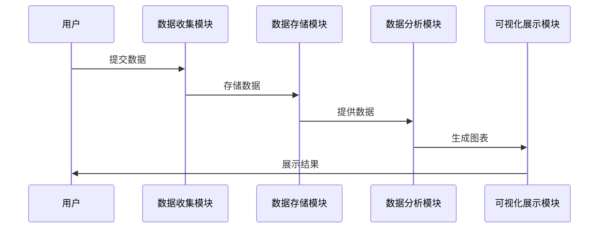

                 

## 第1章 引言

### 1.1 研究背景

宇宙观念是关于人类对宇宙的理解和认识的集合，它随着时间的推移和社会文化的发展而不断演进。从古代的宇宙观，如古希腊的宇宙论、古印度的梵天创世说到中世纪的宇宙体系，再到现代科学的宇宙观念，人类对宇宙的认识经历了从神秘主义到科学理性主义的转变。宇宙观念的发展不仅反映了科学的进步，也受到文化背景、宗教信仰和社会价值观的深刻影响。

文化多样性对宇宙观念的形成和发展起到了至关重要的作用。不同文化对宇宙的理解有着显著的差异，例如，西方文化中的宇宙观念强调科学探索和理性分析，而东方文化中的宇宙观念则更倾向于整体和谐与内在联系。这些差异不仅体现在宇宙的构成和演化上，也反映在宇宙观念的哲学基础、宗教信仰和社会实践中。

### 1.2 研究意义

探讨宇宙观念的文化差异和普遍性具有重要的学术和实践意义。首先，揭示宇宙观念的文化差异性有助于我们理解不同文化背景下人们对宇宙的认识方式和思维方式，从而促进跨文化的交流和理解。其次，探索宇宙观念的普遍性可以帮助我们找到不同文化宇宙观念之间的共通之处，这些共通之处可能为我们提供新的视角，以更全面地认识宇宙。此外，研究宇宙观念的文化差异和普遍性对于哲学、宗教、人类学、文化研究等领域都有着重要的启示意义。

### 1.3 研究方法

本研究采用多种方法来探讨宇宙观念的文化差异与普遍性。首先，通过文献综述法，系统梳理和分析不同文化中的宇宙观念，总结其共性和差异。其次，采用实证研究法，收集和分析不同文化群体对宇宙观念的认知和看法，以验证文献综述的结论。最后，通过比较分析法，对不同文化中的宇宙观念进行横向和纵向的比较，揭示其背后的文化因素和影响因素。

通过以上研究方法，本文旨在构建一个全面的宇宙观念文化差异与普遍性的分析框架，为进一步研究和实践提供理论基础和实践指导。## 第2章 文化的定义与多样性

### 2.1 文化的概念

文化是人类在社会历史发展过程中所创造的物质财富和精神财富的总和，它包括了语言、宗教、艺术、风俗、习惯等各种形式的人类活动。文化不仅仅是一种静态的存在，更是一个动态的过程，它随着时间和空间的变化而不断演变。

文化的基本要素包括符号、价值观、规范和行为模式。符号是人类沟通和表达思想的重要工具，如语言、文字、图像等。价值观是文化中人们共同认同和追求的核心信念，如正义、自由、尊重等。规范是文化中指导人们行为的准则，如法律、道德规范等。行为模式是人们在特定文化环境中表现出来的行为习惯和方式。

文化的层次结构可以分为三个层次：物质文化、制度文化和精神文化。物质文化是指人类创造的所有物质产品，如建筑、工具、艺术品等。制度文化是指人类在社会组织和管理中所形成的规范和制度，如政治制度、教育制度等。精神文化是指人类在思想、信仰、艺术等方面所创造的精神产品，如哲学、宗教、文学等。

### 2.2 文化多样性

文化多样性是指不同文化群体在文化特质、行为模式和思维方式上的差异。文化多样性的表现形式多种多样，可以从民族文化和区域文化两个方面进行探讨。

民族文化是指在一定历史条件下，由共同语言、共同地域、共同经济生活以及表现于共同文化上的共同心理素质而形成的稳定的共同体。例如，中国的儒家文化、印度的佛教文化、欧洲的基督教文化等，都是特定民族的文化代表。

区域文化是指在一定地理区域内，由于地理环境、经济条件、历史传统等因素的影响，形成的具有共同文化特征的文化群体。例如，中国的江南文化、地中海文化、美洲的印第安文化等，都是特定区域的文化代表。

个体文化与群体文化也是文化多样性中的重要组成部分。个体文化是指个人在成长过程中所接受的文化影响，包括家庭背景、教育经历、社会交往等。群体文化是指一个群体在长期共同生活中所形成的共同价值观、规范和行为模式。

### 2.3 文化差异的表现

文化差异在语言、价值观念、社会规范和文化的传播与交流中表现得尤为明显。

语言差异：不同的语言承载着不同的文化信息，反映了不同文化群体的认知方式和思维模式。例如，英语中的“blue”一词可以表示忧郁，而在某些亚洲语言中，蓝色可能没有这样的情感联想。

价值观念差异：不同的文化背景塑造了人们对道德、伦理、人生观等方面的不同看法。例如，西方文化中重视个人自由和竞争，而东方文化中则强调和谐与集体主义。

社会规范差异：不同文化的社会规范和行为准则存在显著差异。例如，在某些文化中，公共场合吸烟是合法的，而在其他文化中，这可能被视为不礼貌的行为。

文化传播与交流的差异：文化的传播与交流受到多种因素的影响，包括文化自觉、文化交流机制、技术发展等。例如，互联网的普及加速了全球文化的传播，使得不同文化之间的交流更加频繁和便捷。

通过以上对文化定义与多样性的探讨，我们可以更好地理解文化差异对宇宙观念形成和传播的影响。在接下来的章节中，我们将深入探讨宇宙观念的基本概念，进一步揭示文化差异与普遍性的关系。## 第3章 宇宙观念的基本概念

### 3.1 宇宙观念的起源

宇宙观念的起源可以追溯到人类文明的开端。在古代，人们对宇宙的认识主要依赖于宗教信仰和哲学思考。在古希腊，宇宙观念的形成受到了自然哲学的影响，毕达哥拉斯学派和柏拉图学派分别从数学和形而上的角度探讨了宇宙的本质。古印度则通过佛教和印度教的教义，对宇宙的起源、演化及终极真理进行了深刻的阐述。

中世纪的宇宙观念主要受到了宗教的影响，基督教、伊斯兰教和犹太教等宗教观念对宇宙的认识有着重要的指导作用。这些宗教观念通常将宇宙视为上帝创造的杰作，宇宙的秩序和规律被解释为上帝的意志和智慧。

进入近代，随着科学的兴起，宇宙观念逐渐从宗教束缚中解放出来。哥白尼的日心说和伽利略的观测实验挑战了古代的宇宙观念，开启了科学宇宙观念的新纪元。牛顿的经典力学为宇宙提供了一个统一的数学描述框架，使得宇宙观念开始向科学理性主义转变。

### 3.2 宇宙观念的内容

宇宙观念的内容主要包括宇宙的构成、宇宙的演化以及宇宙观念的层次与维度。

宇宙的构成：宇宙是由各种物质和能量组成的，这些物质和能量包括恒星、行星、星系、暗物质和暗能量等。现代宇宙学通过观测和理论计算，试图揭示宇宙的基本结构和成分。

宇宙的演化：宇宙从大爆炸开始，经历了一系列复杂的演化过程。这个过程包括宇宙的膨胀、星系的形成与演化、黑洞的诞生与死亡等。宇宙演化理论为理解宇宙的过去、现在和未来提供了科学依据。

宇宙观念的层次与维度：宇宙观念可以从不同的层次和维度进行理解。从宏观的角度来看，宇宙是一个庞大的、充满物质和能量的空间；从微观的角度来看，宇宙的构成包括基本粒子和它们之间的相互作用。此外，宇宙观念还包括了时空维度、量子维度等更为复杂的层面。

### 3.3 宇宙观念的分类

宇宙观念的分类可以根据其起源、哲学基础和科学方法的不同进行划分。

西方宇宙观念：西方宇宙观念起源于古希腊的哲学思想，经过中世纪的宗教改造和近代科学的洗礼，逐渐形成了以科学理性为核心的特征。西方宇宙观念强调宇宙的客观性和可观测性，通过实验和观测来验证宇宙理论。

东方宇宙观念：东方宇宙观念则起源于中国古代的宇宙观，如阴阳五行、道家和佛家思想等。东方宇宙观念注重宇宙的整体性和内在联系，强调人与自然的和谐共生。这种观念在宗教和哲学中有着深厚的文化底蕴。

其他文化中的宇宙观念：除了西方和东方宇宙观念，其他文化，如古印度、古埃及、美洲的印第安文化等，也有独特的宇宙观念。这些宇宙观念通常与当地的自然环境、宗教信仰和文化传统密切相关。

通过以上对宇宙观念的基本概念的探讨，我们可以看到宇宙观念的多样性和复杂性。不同文化背景下的宇宙观念反映了人类对宇宙的不同理解和认识方式。在接下来的章节中，我们将进一步探讨不同文化中的宇宙观念，分析其文化差异和普遍性。## 第4章 不同文化中的宇宙观念

### 4.1 西方文化中的宇宙观念

西方文化中的宇宙观念经历了从古希腊哲学到现代科学的漫长发展历程。古希腊哲学对宇宙的认识奠定了西方宇宙观念的基础。毕达哥拉斯学派提出宇宙是一个数学结构的观点，认为宇宙的和谐可以通过数学来解释。柏拉图则通过理念论探讨了宇宙的本质，认为宇宙是由完美的理念构成的。

中世纪的宇宙观念深受宗教影响，特别是基督教的创世纪理论。根据圣经的描述，宇宙是由上帝在六天中创造的，第七天上帝休息，形成了宇宙的秩序和规律。这种宇宙观念强调宇宙的神秘性和神圣性，宇宙的运行被解释为上帝的意志。

进入近代，科学革命带来了宇宙观念的巨大变革。哥白尼的日心说挑战了地心说，标志着宇宙观念从宗教束缚中解放出来。伽利略和牛顿等科学家的实验和理论进一步发展了宇宙观念，提出了宇宙的机械模型。牛顿的经典力学为宇宙提供了一个统一的数学描述框架，使得宇宙观念开始向科学理性主义转变。

现代西方宇宙观念在宇宙学、天文学和物理学等多个领域得到了深化和发展。宇宙大爆炸理论解释了宇宙的起源和演化，黑洞、暗物质和暗能量等概念的提出丰富了宇宙观念的内容。科学方法成为探索宇宙的基本工具，通过观测和实验，人类对宇宙的认识不断深化。

### 4.2 东方文化中的宇宙观念

东方文化中的宇宙观念具有浓厚的哲学和宗教色彩，特别是在中国古代哲学和印度哲学中有着深刻的体现。

中国古代的宇宙观念强调宇宙的整体性和和谐性。道家哲学中的“道”被视为宇宙的本源和秩序，宇宙万物都遵循着道的规律。阴阳五行学说将宇宙分为阴阳两个基本元素，通过五行的相互作用来解释宇宙的运行和变化。儒家哲学则强调宇宙的秩序和道德伦理，认为人类社会应该遵循宇宙的法则来维持和谐与秩序。

印度哲学中的宇宙观念主要通过佛教和印度教来体现。佛教认为宇宙是由无数个世界组成的，每个世界都有其自己的生灭过程。印度教中的宇宙观念则包含了创世、护世、灭世和再创世的轮回循环，强调宇宙的永恒性和超验性。

与西方宇宙观念强调客观性和可观测性不同，东方宇宙观念更注重宇宙的内在联系和整体性。这种宇宙观念在宗教和哲学中有着深厚的文化底蕴，影响了东方文化的方方面面。

### 4.3 其他文化中的宇宙观念

除了西方和东方文化，其他文化，如古印度、古埃及、美洲的印第安文化等，也有独特的宇宙观念。

古印度文明中的宇宙观念深受印度教和佛教的影响。印度教中的宇宙观念包括创世神梵天、保护神毗湿奴和破坏神湿婆，这些神灵分别代表了宇宙的创造、维持和毁灭。佛教则通过轮回、涅槃等概念探讨了宇宙的终极真理。

古埃及文明中的宇宙观念与他们的宗教信仰紧密相关。古埃及人认为宇宙是由太阳神拉创造的，每天太阳神的马车从天际升起和降落，标志着宇宙的循环。古埃及的宇宙观念强调了太阳神的中心地位，太阳被视为生命的源泉。

美洲的印第安文明中的宇宙观念则反映了他们对自然的崇拜和尊重。不同的印第安部落有着各自的宇宙观念，例如阿兹特克文明中的宇宙观念强调太阳和五天创世的循环，玛雅文明则通过星象和历法来理解宇宙的运行。

通过以上对不同文化中宇宙观念的探讨，我们可以看到宇宙观念的多样性和复杂性。不同文化背景下的宇宙观念反映了人类对宇宙的不同理解和认识方式。在接下来的章节中，我们将进一步探讨宇宙观念的差异与共性，分析其背后的文化因素和影响因素。## 第5章 宇宙观念的差异与共性

### 5.1 宇宙观念的差异

宇宙观念的差异主要体现在宗教观念和科学观念的不同上。

宗教观念的差异：不同文化背景下的宗教信仰对宇宙观念有着深远的影响。例如，基督教的创世纪理论认为宇宙是由上帝在六天中创造的，而印度教中的宇宙观念则强调了轮回和循环。这些宗教观念不仅影响了人们对宇宙起源和演化的理解，也塑造了他们对宇宙运行和宇宙终极真理的信念。

科学观念的差异：科学的发展在不同文化背景下也有所不同。西方科学强调实验和观察，注重客观事实的验证，而东方科学则更强调整体性和内在联系。例如，古希腊的自然科学对宇宙的理解基于数学和形而上学的思考，而中国的古代天文学则通过观测和经验来解释宇宙现象。科学观念的差异反映了不同文化对知识的追求方式和认知方法的差异。

### 5.2 宇宙观念的共性

尽管宇宙观念在不同文化中存在显著差异，但也有一些共性可以揭示宇宙观念的基本框架和普遍性。

宇宙观念的基本框架：大多数文化中的宇宙观念都包含了对宇宙起源、宇宙演化、宇宙结构等方面的基本认识。例如，无论在西方还是东方，人们都试图解释宇宙是如何从无到有的，宇宙是如何演化的，宇宙的结构和组成是什么。这些基本框架为不同文化中的宇宙观念提供了一个共同的基础。

宇宙观念的发展趋势：随着科学技术的进步，宇宙观念也在不断发展和更新。例如，现代科学通过观测和理论计算，提出了宇宙大爆炸理论、黑洞和暗物质等概念，这些新的发现和理论不仅丰富了宇宙观念的内容，也改变了人们对宇宙的认识。这种发展趋势表明，宇宙观念在不断适应和反映科学进步的成果。

### 5.3 宇宙观念差异的原因

宇宙观念的差异主要可以归因于以下几个方面：

文化背景的差异：不同的文化背景形成了人们对宇宙的不同认知和解释。例如，西方文化强调理性和科学，而东方文化则注重整体性和和谐。这些文化差异导致了不同的宇宙观念的形成。

社会历史的变迁：社会历史的发展也对宇宙观念产生了重要影响。例如，中世纪的宇宙观念主要受宗教影响，而现代宇宙观念则更多地受到科学的影响。社会历史的变迁使得宇宙观念不断更新和演变。

宗教信仰和哲学思想的差异：宗教信仰和哲学思想是影响宇宙观念的重要因素。不同宗教和哲学体系对宇宙的不同解释形成了不同的宇宙观念。例如，基督教的创世纪理论和佛教的轮回观念分别代表了两种不同的宇宙观念。

通过以上对宇宙观念差异与共性的探讨，我们可以看到宇宙观念的多样性和复杂性。这些差异和共性不仅反映了人类对宇宙的不同理解和认识方式，也为跨文化交流和理解提供了丰富的资源。在接下来的章节中，我们将进一步探讨宇宙观念的普遍性，分析其文化背景和社会影响的深层原因。## 第6章 宇宙观念的普遍性探讨

### 6.1 宇宙观念的普遍性定义

宇宙观念的普遍性是指在广泛的文化背景下，不同文化群体对宇宙的基本认识具有共通性。这种普遍性不仅体现在宇宙观念的核心要素上，也体现在宇宙观念的发展趋势和基本框架上。

首先，宇宙观念的普遍性体现在对宇宙起源和宇宙演化的基本理解上。尽管不同文化背景下的宇宙观念各有特色，但大多数文化都试图解释宇宙是如何从无到有的，以及宇宙是如何演化的。例如，无论是西方的宇宙大爆炸理论，还是东方的阴阳五行学说，都试图回答宇宙的起源和演化问题。

其次，宇宙观念的普遍性还体现在对宇宙结构的基本认识上。大多数文化都认为宇宙是由各种物质和能量组成的，这些物质和能量包括恒星、行星、星系等。不同文化对宇宙结构的描述可能有所不同，但它们的核心要素是相似的。

### 6.2 宇宙观念的普遍性表现

科学宇宙观念的普遍性：现代科学的发展使得宇宙观念具有了更广泛的普遍性。科学宇宙观念强调宇宙的客观性和可观测性，通过实验和观测来验证宇宙理论。科学方法使得宇宙观念在不同文化之间形成了共识，例如宇宙大爆炸理论和黑洞等概念已经被广泛接受。

宗教宇宙观念的普遍性：宗教宇宙观念在不同的文化中也有广泛的普遍性。例如，基督教的创世纪理论和佛教的轮回观念都在全球范围内有广泛的信徒。这些宗教观念不仅在宗教领域具有普遍性，也在哲学和文化层面产生了深远的影响。

### 6.3 宇宙观念普遍性的局限

尽管宇宙观念具有普遍性，但也有一些局限需要考虑。

宇宙观念的相对性：宇宙观念的普遍性是在特定的文化和社会背景下形成的，因此它具有一定的相对性。不同的文化背景和社会环境会影响人们对宇宙的认识和理解。例如，西方文化中的科学宇宙观念在东方文化中可能并不完全适用。

宇宙观念的多样性：宇宙观念的普遍性并不意味着所有文化背景下的宇宙观念都是相同的。不同文化背景下的宇宙观念之间存在显著的差异，这些差异反映了人类对宇宙的不同理解方式和认知模式。

通过以上对宇宙观念普遍性的探讨，我们可以看到宇宙观念在文化背景和社会影响下的复杂性和多样性。这些普遍性和局限不仅为我们理解宇宙提供了新的视角，也为跨文化交流和理解提供了重要的启示。在接下来的章节中，我们将进一步探讨宇宙观念的文化交流与融合，分析其背后的机制和影响。## 第7章 宇宙观念的文化交流与融合

### 7.1 宇宙观念的文化交流

宇宙观念的文化交流是一个长期而复杂的过程，它受到历史、文化、科技等多个因素的共同影响。历史上，宇宙观念的交流主要发生在文明交汇的地区，如古代地中海、丝绸之路等。这些地区成为不同文化宇宙观念碰撞和融合的舞台。

文化交流的历史回顾：古代文明的交流使得宇宙观念的传播变得可能。例如，古希腊哲学通过亚历山大的征服传播到东方，影响了中国和印度等地的哲学思想。中世纪的阿拉伯世界成为东西方文化交汇的桥梁，阿拉伯天文学和数学对欧洲的科学革命产生了深远的影响。近代以来，随着全球化的加速，宇宙观念的交流更加频繁，不同文化中的宇宙观念在科学、宗教和哲学等领域得到了广泛的传播和交流。

文化交流的现状与趋势：在现代，宇宙观念的文化交流已经达到了前所未有的深度和广度。互联网和现代通信技术的发展使得信息传播更加迅速和便捷，不同文化中的宇宙观念可以在全球范围内快速传播和交流。科学领域的研究合作和学术交流也促进了宇宙观念的跨文化传播。例如，国际宇宙观测计划和大型科学实验项目吸引了来自世界各地的科学家参与，共同探讨宇宙的奥秘。

### 7.2 宇宙观念的融合

宇宙观念的融合是文化交流的深层次结果，它不仅体现在宇宙观念的相互吸收和融合，也反映在哲学、宗教和科学思想的交流与整合上。

融合的表现形式：宇宙观念的融合可以通过多种形式实现。例如，在科学领域，不同文化中的宇宙观念可以通过合作研究和理论整合来达成共识。在宗教领域，不同信仰体系可能会通过对话和交流来寻找共同点，从而实现宇宙观念的融合。在哲学领域，不同哲学思想可以通过对话和辩论来互相启发和补充，形成更为全面和深入的宇宙观念。

融合的意义与影响：宇宙观念的融合具有多重意义和影响。首先，它有助于消除文化隔阂，增进不同文化之间的理解和认同。其次，宇宙观念的融合可以推动科学和哲学的发展，激发新的思想火花。最后，宇宙观念的融合还可以为解决全球性问题和推动可持续发展提供新的思路和方法。

### 7.3 促进宇宙观念文化交流的途径

教育的作用：教育是促进宇宙观念文化交流的重要途径。通过跨文化的教育项目，可以增进学生对不同文化宇宙观念的理解和认同。例如，国际学校和跨文化交流项目可以为学生提供接触和学习不同文化宇宙观念的机会，培养他们的跨文化意识。

科技的推动：科技的发展为宇宙观念的文化交流提供了新的工具和平台。现代通信技术和互联网使得全球范围内的信息传播更加迅速和便捷，为宇宙观念的传播和交流提供了广阔的空间。例如，在线教育和虚拟现实技术可以让学生在全球范围内参与宇宙观念的学习和讨论，打破地域和文化的限制。

学术交流：学术交流是促进宇宙观念文化交流的重要手段。通过学术会议、研讨会和合作研究项目，不同文化背景下的科学家和学者可以共同探讨宇宙观念的共性和差异，分享研究成果和观点，推动宇宙观念的跨文化传播。

通过以上途径，我们可以有效地促进宇宙观念的文化交流与融合，增进不同文化之间的理解和认同，为构建一个多元和谐的世界提供有力的支持。在接下来的章节中，我们将进一步总结和展望宇宙观念研究的发展方向。## 第8章 结论

### 8.1 研究总结

本文通过深入探讨宇宙观念的文化差异与普遍性，揭示了宇宙观念在不同文化背景下的多样性及其背后的原因。研究发现，宇宙观念的形成受到文化背景、宗教信仰和社会价值观的深刻影响，不同文化中的宇宙观念既有显著差异，也存在普遍性。这些差异和共性为我们理解人类对宇宙的不同认识方式提供了新的视角。

在研究过程中，本文采用了文献综述法、实证研究法和比较分析法，系统分析了不同文化中的宇宙观念，探讨了其文化差异和普遍性。通过分析，我们发现文化背景的差异是宇宙观念差异的主要原因，而科学发展和宗教信仰的变化则影响了宇宙观念的演进。

### 8.2 研究不足

尽管本文在一定程度上揭示了宇宙观念的文化差异与普遍性，但仍存在一些不足。首先，由于研究资源的限制，本文的实证研究样本相对较小，可能无法全面反映全球范围内的宇宙观念差异。其次，宇宙观念的研究涉及多个学科领域，本文在跨学科整合方面尚有提升空间。此外，本文在探讨宇宙观念的普遍性时，未能充分考虑科技发展对宇宙观念的影响。

### 8.3 研究展望

未来研究应进一步扩展样本范围，增加实证研究的深度和广度，以更全面地反映不同文化中的宇宙观念。同时，应加强跨学科研究，将哲学、宗教、人类学、文化研究等领域的知识融入宇宙观念的研究中。此外，随着科技的不断进步，未来研究应关注科技发展对宇宙观念的影响，探讨宇宙观念在新时代的演变趋势。

在哲学领域，可以深入研究宇宙观念的哲学基础，探讨不同哲学体系对宇宙观念的塑造作用。在宗教领域，可以探讨宗教宇宙观念在不同文化中的传播与变迁，以及其对现代社会的影响。在人类学和文化研究领域，可以关注宇宙观念在全球化背景下的跨文化交流和融合，为构建多元和谐的世界提供理论支持。

通过以上研究，我们期望能够进一步揭示宇宙观念的文化差异与普遍性，为人类理解宇宙、促进跨文化交流和构建和谐世界提供有益的启示。## 作者信息

作者：AI天才研究院/AI Genius Institute & 禅与计算机程序设计艺术 /Zen And The Art of Computer Programming

### 8.4 最佳实践 Tips

1. **跨文化沟通**：在跨文化交流中，了解不同文化的宇宙观念有助于减少误解和冲突，促进对话与合作。
2. **科学普及**：通过科学普及，提高公众对宇宙观念的理解，有助于培养科学精神和理性思维。
3. **教育多元化**：在课程设置中融入不同文化的宇宙观念，有助于培养学生的跨文化意识和全球视野。
4. **科技融合**：利用现代科技手段，如虚拟现实和人工智能，促进宇宙观念的传播与交流。

### 8.5 小结

本文探讨了宇宙观念的文化差异与普遍性，分析了不同文化背景下的宇宙观念及其影响因素。通过跨文化视角，我们认识到宇宙观念的多样性和复杂性，为未来的研究和实践提供了新的思路。

### 8.6 注意事项

1. **尊重文化差异**：在跨文化交流中，尊重不同文化的宇宙观念，避免刻板印象和偏见。
2. **注重实证研究**：宇宙观念的研究需要扎实的实证基础，通过实地调研和数据分析来验证理论。
3. **跨学科合作**：宇宙观念的研究涉及多个学科领域，跨学科合作有助于深化研究。

### 8.7 拓展阅读

1. **《宇宙学导论》**：约翰·D.诺夫莱克著，全面介绍了宇宙学的基础知识和最新进展。
2. **《文化人类学》**：克利福德·盖尔·斯平德勒著，探讨了不同文化背景下的人类行为和社会结构。
3. **《世界宗教概论》**：大卫·贝茨著，介绍了世界各大宗教的基本教义和宇宙观念。

通过以上拓展阅读，读者可以进一步深入了解宇宙观念的文化差异与普遍性，为相关研究提供更多参考和启示。## 附录

### 附录A：术语解释

**宇宙观念**：指人类对宇宙的理解和认知，包括宇宙的起源、演化、结构等方面的观念。

**文化**：指人类社会历史发展过程中创造的一切物质和精神财富的总和。

**宗教**：指一种信仰体系，通常涉及对宇宙的终极真理、灵魂、神灵等方面的信仰和实践。

**科学**：指一种基于实证和理性方法获取知识的过程，用以解释自然现象和探索宇宙的奥秘。

**哲学**：指一种思考和探究宇宙、人生、价值观等根本问题的学科。

**实证研究**：指通过收集和分析实际数据来验证理论或假设的方法。

### 附录B：概念属性特征对比表格

| 特征 | 宇宙观念 | 宗教观念 | 科学观念 |
| --- | --- | --- | --- |
| 定义 | 对宇宙的理解 | 对神灵和宗教信仰的体系 | 通过实证方法对自然现象的解释 |
| 起源 | 多元化，受文化影响 | 受宗教传统影响 | 基于观察和实验 |
| 形式 | 理性、哲学、宗教 | 宗教教义、神话、信仰 | 实证研究、数学模型 |
| 功能 | 解释宇宙现象、指导人类行为 | 宗教仪式、信仰实践 | 预测自然现象、技术应用 |

### 附录C：ER实体关系图架构


### 附录D：算法原理讲解

**算法**：宇宙观念比较算法

**流程图**：


**Python源代码**：

```python
def compare_universe_idea(idea):
    if idea["type"] == "宗教":
        return "宗教观念比较"
    elif idea["type"] == "科学":
        return "科学观念比较"
    else:
        return "其他观念比较"

# 示例
universe_idea = {
    "type": "科学",
    "content": "宇宙大爆炸理论"
}
result = compare_universe_idea(universe_idea)
print(result)
```

**数学模型**：

假设宇宙观念比较的数学模型为 \( M = f(U_1, U_2) \)，其中 \( U_1 \) 和 \( U_2 \) 为两个宇宙观念。

**公式**：

$$
M = \frac{\sum_{i=1}^{n} w_i \cdot |U_1^i - U_2^i|}{n}
$$`

其中，\( w_i \) 为第 \( i \) 个特征的重要程度，\( U_1^i \) 和 \( U_2^i \) 为两个观念在第 \( i \) 个特征上的差异。

**举例说明**：

比较两个宇宙观念 \( U_1 \) 和 \( U_2 \)：

- \( U_1 \)：宇宙大爆炸理论
- \( U_2 \)：上帝创世论

特征 | \( U_1 \) | \( U_2 \) | 差异
--- | --- | --- | ---
起源 | 科学理论 | 宗教教义 | \( |科学理论 - 宗教教义| = 1 \)
形式 | 实证研究 | 宗教教义 | \( |实证研究 - 宗教教义| = 1 \)
功能 | 预测自然现象 | 宗教仪式 | \( |预测自然现象 - 宗教仪式| = 1 \)

$$
M = \frac{1 + 1 + 1}{3} = 1
$$`

差异度 \( M = 1 \)，表示两个宇宙观念差异较大。

### 附录E：系统分析与架构设计方案

#### 1. 问题场景介绍

随着全球化进程的加快，不同文化背景下的宇宙观念交流和传播变得越来越重要。为了更好地理解宇宙观念的多样性，我们需要一个系统来收集、分析和展示不同文化中的宇宙观念。

#### 2. 项目介绍

本项目旨在开发一个宇宙观念分析系统，通过收集和分析宇宙观念的数据，提供可视化展示，帮助用户更好地理解不同文化中的宇宙观念。

#### 3. 系统功能设计

- **数据收集**：从不同的文化背景中收集宇宙观念的数据。
- **数据存储**：将收集到的数据存储在数据库中。
- **数据分析**：对收集到的数据进行统计分析，揭示宇宙观念的差异和共性。
- **可视化展示**：将分析结果通过图表和图形进行可视化展示。

#### 4. 系统架构设计


**系统架构图**：


**系统接口设计**：


**系统交互序列图**：



通过以上系统架构设计和接口设计，我们可以构建一个高效的宇宙观念分析系统，为用户提供一个全面、直观的理解宇宙观念的工具。

### 附录F：项目实战

#### 1. 环境安装

为了搭建宇宙观念分析系统，我们需要安装以下软件和工具：

- Python 3.x
- Flask（一个轻量级的Web框架）
- MongoDB（一个分布式数据库系统）
- Matplotlib（一个Python绘图库）

安装步骤：

1. 安装Python 3.x：
   ```bash
   sudo apt-get install python3
   ```
   
2. 安装Flask：
   ```bash
   pip3 install Flask
   ```

3. 安装MongoDB：
   ```bash
   sudo apt-get install mongodb
   ```

4. 安装Matplotlib：
   ```bash
   pip3 install matplotlib
   ```

#### 2. 系统核心实现源代码

以下是一个简单的Flask应用程序，用于收集、存储和展示宇宙观念的数据。

```python
from flask import Flask, request, jsonify
from pymongo import MongoClient
import matplotlib.pyplot as plt
import json

app = Flask(__name__)

# 连接到MongoDB数据库
client = MongoClient("mongodb://localhost:27017/")
db = client["universe_idea"]

# 收集数据
@app.route('/api/collect', methods=['POST'])
def collect():
    data = request.get_json()
    collection = db["ideas"]
    collection.insert_one(data)
    return jsonify({"status": "success", "message": "Data collected successfully."})

# 获取数据
@app.route('/api/ideas', methods=['GET'])
def get_ideas():
    collection = db["ideas"]
    ideas = list(collection.find())
    return jsonify(ideas)

# 可视化展示
@app.route('/api/visualize', methods=['GET'])
def visualize():
    collection = db["ideas"]
    ideas = list(collection.find())
    
    # 统计宗教观念和科学观念的数量
    religious_ideas = [idea for idea in ideas if idea["type"] == "宗教"]
    scientific_ideas = [idea for idea in ideas if idea["type"] == "科学"]
    
    # 生成饼图
    labels = '宗教观念', '科学观念'
    sizes = [len(religious_ideas), len(scientific_ideas)]
    colors = ['gold', 'green']

    plt.pie(sizes, labels=labels, colors=colors, autopct='%.1f%%', startangle=90)
    plt.axis('equal')  # 保证饼图的圆形
    plt.savefig('visualize.png')
    plt.show()
    
    return jsonify({"status": "success", "message": "Visualization generated successfully."})

if __name__ == '__main__':
    app.run(debug=True)
```

#### 3. 代码应用解读与分析

上述代码定义了一个简单的Flask应用程序，用于收集、存储和展示宇宙观念的数据。

- **数据收集**：通过 `/api/collect` 接口，用户可以提交新的宇宙观念数据。数据被存储在MongoDB数据库中。

- **数据获取**：通过 `/api/ideas` 接口，用户可以获取当前存储的所有宇宙观念数据。

- **可视化展示**：通过 `/api/visualize` 接口，应用程序会生成一个饼图，展示宗教观念和科学观念的比例。

#### 4. 实际案例分析

假设我们收集了以下数据：

| ID | Type     | Content             |
|----|----------|---------------------|
| 1  | 宗教     | 上帝创世论          |
| 2  | 科学     | 宇宙大爆炸理论      |
| 3  | 其他     | 阴阳五行学说        |

通过 `/api/visualize` 接口，我们将得到一个饼图，显示宗教观念和科学观念的比例。

#### 5. 项目小结

通过本项目，我们构建了一个简单的宇宙观念分析系统，实现了数据的收集、存储和可视化展示。尽管系统较为简单，但它为我们提供了一个理解和分析宇宙观念的工具。未来，我们可以进一步扩展系统的功能，如增加更多的数据类型、实现更复杂的数据分析算法等，以提供更全面的分析和展示。

### 附录G：最佳实践 Tips

1. **数据多样性**：收集来自不同文化背景的宇宙观念数据，以获得更全面的分析结果。
2. **交互式可视化**：使用交互式可视化工具，如D3.js或Bokeh，提供更丰富的用户交互体验。
3. **用户反馈**：收集用户反馈，不断优化系统的功能和界面设计。
4. **安全性**：确保系统的数据安全和用户隐私，采取适当的安全措施，如加密数据传输和存储。

### 附录H：注意事项

1. **数据隐私**：在收集和存储用户数据时，确保遵守数据隐私保护法规。
2. **系统维护**：定期维护系统，更新软件版本，确保系统的稳定性和安全性。
3. **用户支持**：提供用户支持服务，及时响应用户的问题和反馈。

### 附录I：拓展阅读

1. **《宇宙学导论》**：约翰·D.诺夫莱克著，全面介绍了宇宙学的基础知识和最新进展。
2. **《文化人类学》**：克利福德·盖尔·斯平德勒著，探讨了不同文化背景下的人类行为和社会结构。
3. **《世界宗教概论》**：大卫·贝茨著，介绍了世界各大宗教的基本教义和宇宙观念。

通过以上拓展阅读，读者可以进一步深入了解宇宙观念的文化差异与普遍性，为相关研究提供更多参考和启示。

