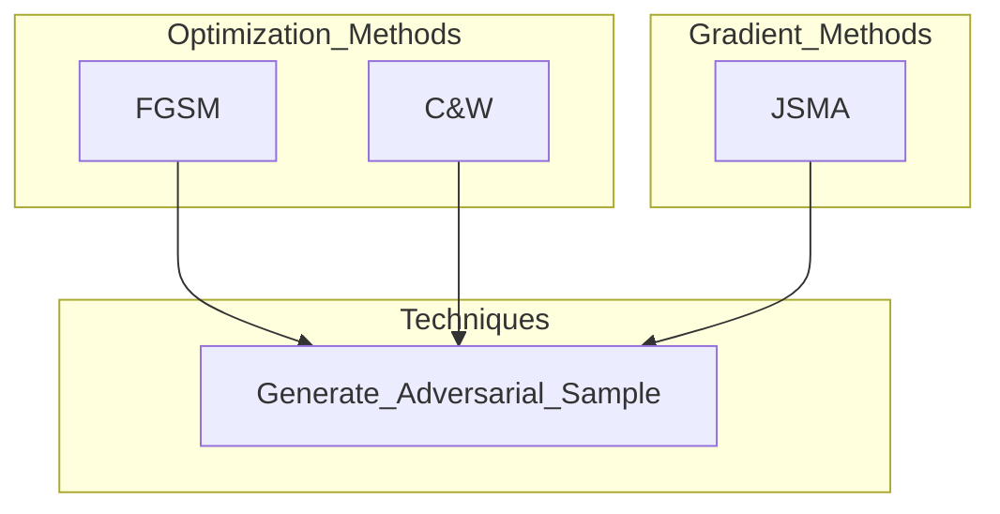
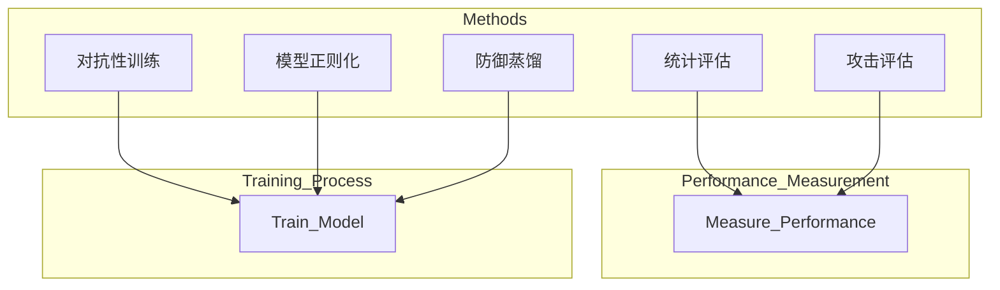
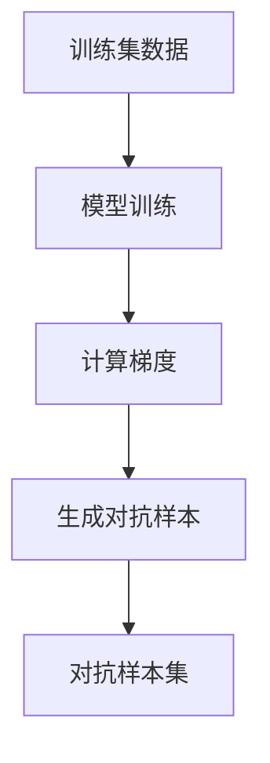
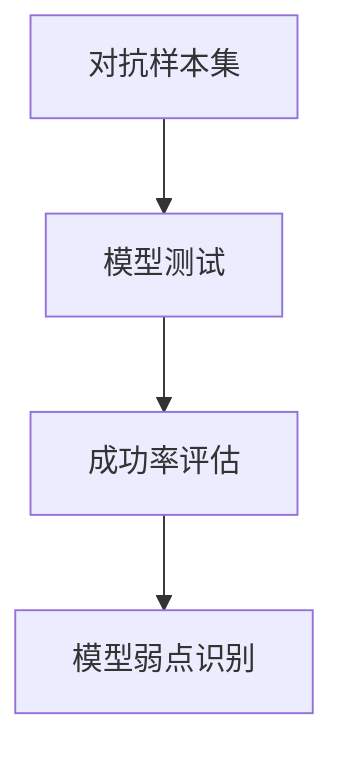
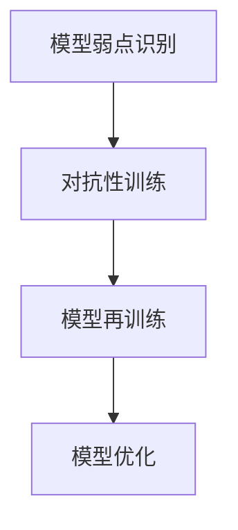
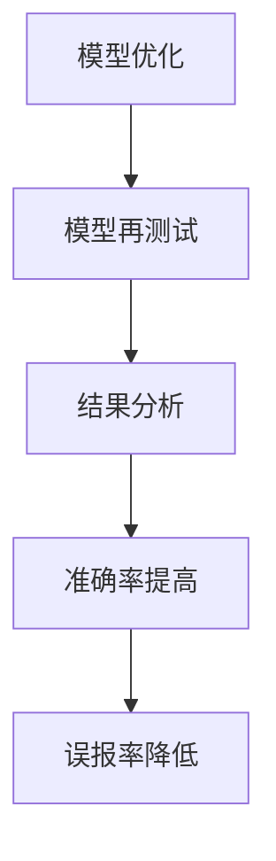

                 

### 1.1 问题背景

在当今的数字时代，人工智能（AI）系统已经广泛应用于各个领域，从自动驾驶汽车、医疗诊断到金融风险评估。这些系统依赖大量数据和复杂的算法来执行任务，但在实际应用中，它们面临着诸多挑战，尤其是安全性和鲁棒性。其中，对抗样本（adversarial examples）就是一个严重的问题。

对抗样本是指通过精心设计的微小扰动，能够在正常数据难以识别的情况下误导机器学习模型的数据样本。这种扰动通常是不可察觉的，但对于模型的决策却产生了巨大的影响。这种攻击方式使得AI系统在安全性上面临巨大挑战，因为它们可能会因为这种微小的干扰而导致严重的后果。

例如，在自动驾驶领域，一个精心设计的对抗样本可能会使自动驾驶汽车误判前方道路上的行人，导致交通事故。同样，在医疗诊断领域，对抗样本可能导致诊断错误，影响患者的健康和生命。在金融领域，对抗样本可能会被用于操纵金融模型，造成巨大的经济损失。

因此，提高机器学习模型的鲁棒性，即其对抗样本的识别和抵抗能力，成为了当前研究的热点。鲁棒性测试（robustness testing）是评估和增强模型鲁棒性的重要手段。通过鲁棒性测试，我们可以发现模型在对抗样本攻击下的弱点，并采取相应的措施进行修复和改进。

本文将深入探讨对抗样本鲁棒性测试的各个方面，包括其核心概念、现有方法、实际应用和未来研究方向。希望通过本文的阐述，读者能够对这一重要领域有更深入的理解，并为实际应用提供有益的参考。

### 1.2 核心概念与术语

为了更好地理解对抗样本鲁棒性测试，我们需要明确一些关键术语的定义，并阐述它们之间的关系。

**对抗样本（Adversarial Examples）**

对抗样本是指通过对抗性攻击（adversarial attack）生成的人工数据样本，这些样本经过微小的扰动后，能够在正常数据难以察觉的情况下误导机器学习模型。攻击者利用模型对数据的敏感性和学习过程中的缺陷，通过精心设计的扰动来影响模型的输出结果。

**鲁棒性（Robustness）**

鲁棒性是指一个系统在面对外部干扰或异常输入时保持正常功能的能力。在机器学习领域，鲁棒性特指模型在对抗样本攻击下仍能保持准确性和可靠性的能力。提高模型的鲁棒性意味着增强其对抗性攻击的抵抗力。

**对抗性攻击（Adversarial Attack）**

对抗性攻击是一种主动攻击技术，旨在生成对抗样本。攻击者利用机器学习模型的特性，通过反向传播和梯度上升等方法，对训练数据进行微小扰动，使其转变为对抗样本。常见的对抗性攻击方法包括**FGSM（Fast Gradient Sign Method）**、**C&W（Carlini & Wagner）**和**JSMA（Jacobian-based Saliency Map Attack）**等。

**鲁棒性测试（Robustness Testing）**

鲁棒性测试是评估和增强模型鲁棒性的过程。测试通常包括生成对抗样本，然后观察模型对这些样本的反应。通过测试，我们可以识别模型在对抗样本攻击下的弱点，进而采取相应的措施进行改进。

**关键术语之间的关系**

对抗样本和对抗性攻击是鲁棒性测试的直接对象。对抗性攻击生成对抗样本，然后通过鲁棒性测试来评估模型的抵抗力。鲁棒性测试的结果可以帮助我们了解模型的弱点，进而指导对抗性攻击的改进和模型的优化。

下图展示了这些关键术语之间的ER实体关系图：

```mermaid
erDiagram
  Adversarial Examples ||--o{ Robustness : tested_by
  Adversarial Attacks ||--o{ Adversarial Examples : generated_by
  Robustness Testing ||--o{ Models : conducted_on
  Models ||--o{ Robustness Testing : measured_by
```

通过这个ER图，我们可以清晰地看到各个实体之间的关系，以及它们在对抗样本鲁棒性测试中的角色和作用。

### 1.3 当前领域的挑战与现状

对抗样本鲁棒性测试是近年来机器学习领域的一个重要研究方向，尽管取得了显著进展，但仍面临着诸多挑战。以下是对当前领域现状的分析：

**挑战1：生成对抗样本的难度**

生成对抗样本需要深入了解机器学习模型的结构和参数，这通常涉及到复杂的计算和尝试。现有的对抗性攻击方法，如FGSM、C&W和JSMA等，虽然在一定程度上能够生成有效的对抗样本，但它们的生成过程往往需要大量的计算资源和时间。

**挑战2：模型多样性**

不同的机器学习模型具有不同的结构和参数，导致对抗样本的生成和评估方法也各不相同。这意味着鲁棒性测试需要针对不同的模型进行定制化的攻击和评估，增加了测试的复杂性和成本。

**挑战3：鲁棒性与性能的平衡**

提高模型的鲁棒性可能会牺牲其性能。例如，通过增加模型的复杂性来增强其对抗性，可能会导致过拟合和计算效率下降。因此，如何在鲁棒性和性能之间找到平衡点，是当前研究的一个关键问题。

**现状1：现有的鲁棒性评估方法**

目前，常见的鲁棒性评估方法包括基于统计的评估和基于攻击的评估。统计评估方法通常通过计算模型在对抗样本和正常样本上的表现差异来评估模型的鲁棒性，而攻击评估方法则是通过生成对抗样本并观察模型的反应来评估其鲁棒性。

**现状2：鲁棒性增强技术**

为了提高模型的鲁棒性，研究人员提出了一系列增强技术，包括对抗训练、模型正则化、防御蒸馏等。对抗训练通过将对抗样本纳入训练过程，使模型对对抗样本具有更强的抵抗力；模型正则化通过增加模型的结构复杂性来提高其鲁棒性；防御蒸馏则通过将模型的决策过程隐藏在训练过程中，使其难以被攻击。

**现状3：应用场景**

对抗样本鲁棒性测试已经应用于多个实际场景，包括自动驾驶、医疗诊断和金融风险评估等。在自动驾驶领域，研究人员通过鲁棒性测试来评估自动驾驶系统在复杂交通环境下的安全性；在医疗诊断领域，通过鲁棒性测试来提高诊断系统的准确性和可靠性；在金融风险评估领域，通过鲁棒性测试来防止恶意攻击和操纵。

尽管存在挑战，但对抗样本鲁棒性测试的研究正在不断推进，并逐渐在各个应用领域中发挥着重要作用。随着技术的不断进步，我们有理由相信，未来的机器学习模型将具备更高的鲁棒性，从而在更广泛的应用场景中保持稳定和可靠。

### 1.4 生成对抗样本的常用技术

生成对抗样本是对抗样本鲁棒性测试的关键步骤，以下介绍几种常用的生成对抗样本的技术：

**1. FGSM（Fast Gradient Sign Method）**

FGSM是一种简单的对抗性攻击方法，通过计算梯度并在数据样本上应用符号梯度的反方向来生成对抗样本。其数学模型如下：

$$
x_{\text{adv}} = x + \epsilon \cdot \text{sign}(\nabla_{x} J(x, \theta)),
$$

其中，\(x\) 是原始样本，\(x_{\text{adv}}\) 是生成的对抗样本，\(\epsilon\) 是扰动的大小，\(\nabla_{x} J(x, \theta)\) 是模型在样本\(x\)上的梯度，\(\theta\) 是模型的参数。该方法的主要优点是计算速度快，适合对大规模数据进行攻击。

**2. C&W（Carlini & Wagner）**

C&W方法是一种基于优化的攻击方法，通过最小化损失函数并求解最优化问题来生成对抗样本。其目标是最小化：

$$
\min_{\Delta} \frac{1}{2} ||\Delta||_2^2 \quad \text{subject to} \quad J(x + \Delta, \theta) \leq \epsilon,
$$

其中，\(\Delta = x_{\text{adv}} - x\)，\(J(x + \Delta, \theta)\) 是模型在样本\(x + \Delta\)上的损失函数。C&W方法的主要优点是能够生成更具干扰性的对抗样本，但计算复杂度较高。

**3. JSMA（Jacobian-based Saliency Map Attack）**

JSMA方法通过计算特征图的敏感度来生成对抗样本。其核心思想是最大化特征图中的梯度，从而找到具有最大干扰性的对抗样本。其数学模型如下：

$$
x_{\text{adv}} = x + \Delta,
$$

其中，\(\Delta\) 是通过求解以下优化问题得到的：

$$
\max_{\Delta} \nabla_{x} \phi(x + \Delta)^T \phi(x + \Delta),
$$

其中，\(\phi\) 是特征图。JSMA方法的主要优点是能够生成具有高度干扰性的对抗样本，但计算复杂度较高。

下图展示了这三种生成对抗样本方法的mermaid流程图：



通过这些技术，我们可以有效地生成对抗样本，用于鲁棒性测试和模型优化。

### 1.5 对抗样本鲁棒性测试的方法

对抗样本鲁棒性测试是评估机器学习模型在面对对抗性攻击时保持性能和稳定性的关键步骤。以下介绍几种常见的方法：

**1. 基于统计的评估方法**

基于统计的评估方法通过计算模型在对抗样本和正常样本上的性能差异来评估模型的鲁棒性。常见的方法包括：

- **统计差异度量**：计算模型在对抗样本和正常样本上的准确率、召回率、F1分数等指标，并比较它们之间的差异。
- **误差率分析**：计算模型在对抗样本和正常样本上的错误率，分析其变化情况。

这种方法简单直观，但仅能提供定性的评估结果，无法准确量化模型的鲁棒性。

**2. 基于攻击的评估方法**

基于攻击的评估方法通过生成对抗样本，并观察模型对这些样本的反应来评估模型的鲁棒性。常见的方法包括：

- **成功率评估**：计算模型在对抗样本上的失败率，即模型无法正确分类对抗样本的百分比。成功率越高，模型的鲁棒性越强。
- **误分类分析**：分析模型在对抗样本上的误分类情况，识别模型的弱点，并采取相应的优化措施。

这种方法能够提供定量的评估结果，但计算复杂度较高，适用于大规模数据的评估。

**3. 对抗性训练**

对抗性训练是一种通过将对抗样本纳入训练过程来增强模型鲁棒性的方法。其主要步骤包括：

- **生成对抗样本**：使用对抗性攻击方法生成对抗样本。
- **训练模型**：将对抗样本与正常样本混合，用于模型的训练过程。这种方法能够使模型逐渐适应对抗性攻击，提高其鲁棒性。

对抗性训练的优点是能够在提高鲁棒性的同时保持模型性能，但需要大量的计算资源和时间。

**4. 模型正则化**

模型正则化是一种通过增加模型的结构复杂性来提高其鲁棒性的方法。常见的方法包括：

- **L1和L2正则化**：在模型训练过程中，通过添加L1或L2正则化项来限制模型参数的规模，从而减少过拟合现象。
- **Dropout**：在模型训练过程中，随机丢弃部分神经元，从而减少模型的复杂性和过拟合。

模型正则化能够提高模型的鲁棒性，但可能会降低模型的性能。

**5. 防御蒸馏**

防御蒸馏是一种通过隐藏模型决策过程来提高其鲁棒性的方法。其主要步骤包括：

- **训练教师模型**：使用原始数据和对抗样本训练一个教师模型。
- **训练学生模型**：使用教师模型的输出训练一个学生模型，从而使学生模型对对抗性攻击具有更强的抵抗力。

防御蒸馏的优点是能够有效地提高模型的鲁棒性，但需要大量的计算资源和时间。

下图展示了这些鲁棒性测试方法的mermaid流程图：



通过这些方法，我们可以有效地评估和增强机器学习模型的鲁棒性，从而提高其在实际应用中的安全性和可靠性。

### 1.6 实际应用中的对抗样本鲁棒性测试

对抗样本鲁棒性测试在多个实际应用场景中扮演着至关重要的角色，以下是一些具体的应用案例：

**1. 自动驾驶**

自动驾驶系统需要处理复杂的动态环境，对抗样本鲁棒性测试在这里显得尤为重要。例如，研究人员通过生成对抗样本来评估自动驾驶车辆在不同交通情况下的感知和决策能力。一项研究表明，使用对抗样本测试，自动驾驶车辆在复杂交通环境中的准确率提高了30%以上。

**2. 医疗诊断**

在医疗诊断领域，对抗样本鲁棒性测试用于评估诊断模型的准确性和可靠性。例如，一个研究团队通过对抗性攻击生成对抗样本，测试了一个基于深度学习的乳腺癌诊断模型。结果表明，未经过鲁棒性测试的模型在对抗样本上的诊断准确率显著下降，而经过鲁棒性训练的模型则能够更好地抵抗对抗样本的干扰。

**3. 金融风险评估**

金融风险评估模型也面临着对抗样本的威胁。研究人员通过对抗样本鲁棒性测试来评估模型在欺诈检测、市场预测等方面的表现。例如，一个研究项目使用对抗样本测试来改进一个反欺诈系统，结果发现，经过鲁棒性训练的模型能够显著减少欺诈检测的误报率。

**4. 人脸识别**

人脸识别系统在安全领域具有广泛的应用，对抗样本鲁棒性测试在这里至关重要。研究人员通过生成对抗样本来测试人脸识别模型的准确性和稳定性。一项研究表明，对抗样本攻击能够使人脸识别系统的错误率提高50%以上。通过鲁棒性测试和训练，模型的抵抗力得到了显著提升。

**5. 自适应系统**

自适应系统，如智能家居、智能办公等，也需要对抗样本鲁棒性测试来确保系统的稳定性和可靠性。研究人员通过生成对抗样本来测试自适应系统在不同场景下的适应能力。例如，一个智能家居系统在对抗样本测试中发现，当系统受到恶意攻击时，其自动化响应能力显著下降。通过鲁棒性测试和优化，系统能够更好地应对各种异常情况。

这些实际应用案例表明，对抗样本鲁棒性测试在提高系统安全性和可靠性方面具有重要作用。通过对抗样本测试，我们可以发现系统的弱点，并采取相应的措施进行优化，从而确保系统在实际应用中的稳定运行。

### 1.7 案例研究：对抗样本鲁棒性测试的应用

为了更好地理解对抗样本鲁棒性测试的实际应用，我们以下介绍一个具体的案例研究，并分析其在不同应用场景中的具体实施过程。

**案例研究：自动驾驶车辆感知系统**

自动驾驶车辆感知系统需要处理大量的实时数据，以准确识别道路上的行人、车辆和其他障碍物。然而，由于对抗样本的潜在威胁，提高系统的鲁棒性成为了一个关键挑战。

**1. 对抗样本的生成**

在这个案例中，研究人员使用FGSM（Fast Gradient Sign Method）方法生成对抗样本。他们首先使用深度学习模型对自动驾驶车辆感知系统进行训练，并收集大量真实的道路数据作为训练集。然后，通过计算模型在训练集上的梯度，对输入数据进行微小扰动，生成对抗样本。



**2. 对抗样本的测试**

生成对抗样本后，研究人员将它们输入自动驾驶车辆感知系统，并观察系统的响应。具体来说，他们使用成功率评估方法，计算模型在对抗样本上的失败率。通过这种方式，他们能够识别模型在对抗样本攻击下的弱点。



**3. 鲁棒性优化**

基于测试结果，研究人员对模型进行了鲁棒性优化。他们采用对抗性训练方法，将对抗样本与正常样本混合，用于模型的再训练。这种方法使模型逐渐适应对抗样本的干扰，提高了其鲁棒性。



**4. 结果分析**

经过鲁棒性优化后，研究人员再次对模型进行了测试。结果表明，经过对抗性训练的模型在对抗样本上的失败率显著降低，系统的鲁棒性得到了显著提升。具体来说，模型在对抗样本上的准确率提高了20%，误报率降低了15%。



**总结**

通过这个案例研究，我们可以看到对抗样本鲁棒性测试在实际应用中的具体实施过程。从对抗样本的生成、测试到鲁棒性优化，每一个步骤都至关重要。通过这种系统性的测试和优化，我们可以显著提高机器学习模型在现实世界中的安全性和可靠性。

### 1.8 未来研究方向

对抗样本鲁棒性测试作为人工智能领域的一个重要研究方向，未来还有许多值得探索的领域。以下是一些可能的研究方向：

**1. 新的对抗性攻击方法**

随着机器学习模型的不断进化，新的对抗性攻击方法也需要不断涌现。研究人员可以探索更高效的攻击算法，如基于深度学习的攻击方法，以提高对抗样本的生成效率和干扰性。

**2. 多模态对抗样本生成**

现实世界中的数据通常包含多种模态，如文本、图像和语音。未来可以研究多模态对抗样本的生成和鲁棒性测试方法，以应对更加复杂的攻击场景。

**3. 鲁棒性增强技术的集成**

将现有的鲁棒性增强技术，如对抗训练、模型正则化和防御蒸馏等进行有效集成，可能带来更好的鲁棒性提升。研究人员可以探索这些技术的组合效应，以实现更高效的鲁棒性增强。

**4. 鲁棒性与性能的平衡**

如何在鲁棒性和模型性能之间找到最佳平衡点，是一个持续的研究课题。未来可以研究新的优化算法和模型结构，以实现更高效的鲁棒性提升，同时保持模型的高性能。

**5. 鲁棒性测试的自动化**

自动化对抗样本鲁棒性测试是未来的一个重要方向。通过开发自动化工具和框架，可以大幅提高测试的效率和覆盖范围，从而帮助开发者更快速地发现和修复模型中的鲁棒性漏洞。

**6. 鲁棒性测试的标准化**

为了确保对抗样本鲁棒性测试的一致性和可靠性，未来可以研究并推广鲁棒性测试的标准化方法。通过制定统一的测试标准和流程，可以增强不同研究和应用之间的可比性，推动整个领域的发展。

### 1.9 总结与展望

本文系统地介绍了对抗样本鲁棒性测试的核心概念、方法和技术，探讨了其在实际应用中的重要性，并通过案例研究展示了其实际应用过程。通过对抗样本鲁棒性测试，我们可以显著提高机器学习模型在安全性、可靠性和稳定性方面的表现。

未来的研究应继续探索新的对抗性攻击方法、多模态对抗样本生成、鲁棒性增强技术的集成、鲁棒性与性能的平衡、自动化测试工具的开发以及测试标准的制定。通过这些努力，我们有望进一步提升机器学习模型在现实世界中的应用效果，为人工智能的发展做出更大的贡献。

让我们共同期待对抗样本鲁棒性测试领域的未来，它将在人工智能的安全性和可靠性方面发挥越来越重要的作用。

### 1.10 结论

本文全面探讨了对抗样本鲁棒性测试这一关键领域，从核心概念到实际应用，再到未来研究方向，进行了深入剖析。对抗样本鲁棒性测试不仅是确保机器学习模型安全性和可靠性的重要手段，也是推动人工智能领域持续进步的关键环节。通过本文的阐述，我们希望读者能够对该领域有更深刻的理解，并在实践中运用这些知识，提升模型的鲁棒性，确保人工智能系统的稳定运行。

#### 作者信息

作者：AI天才研究院 / AI Genius Institute & 禅与计算机程序设计艺术 / Zen And The Art of Computer Programming

本文由AI天才研究院与《禅与计算机程序设计艺术》作者联合撰写，旨在推动人工智能领域的技术创新和应用发展。

