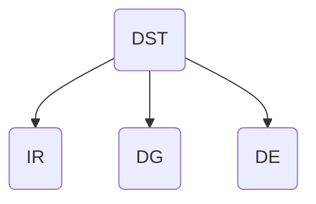
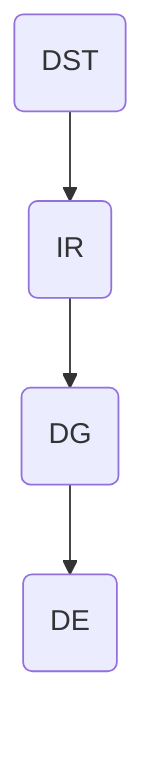

                 

# 对话管理：提升LLM应用的交互质量

## 关键词

对话管理，大规模语言模型（LLM），交互质量，自然语言处理（NLP），人工智能（AI）

## 摘要

本文深入探讨对话管理在提升大规模语言模型（LLM）应用交互质量方面的关键作用。通过分析对话状态跟踪（DST）、对话生成（DG）和对话评估（DE）等核心概念，本文旨在提供一系列技术方案，以解决对话系统的常见问题，从而提升用户对LLM应用的满意度。

### 第1章：问题背景

#### 1.1.1 问题背景介绍

对话管理是自然语言处理（NLP）和人工智能（AI）领域中一个重要的研究方向。随着深度学习和大规模语言模型（LLM）的快速发展，对话系统逐渐成为人机交互的重要方式。然而，当前许多对话系统的交互质量仍然有待提高。主要问题包括：对话响应不及时、回答不准确、对话上下文理解不足等。这些问题严重影响了用户对对话系统的满意度和使用体验。

#### 1.1.2 问题描述

本书旨在探讨如何通过对话管理技术提升大规模语言模型（LLM）应用的交互质量。对话管理涉及多个核心概念，包括对话状态跟踪（DST）、对话生成（DG）和对话评估（DE）。通过深入研究这些概念及其相互关系，本书将提供一系列解决方案，以改善对话系统的性能。

#### 1.1.3 问题解决

解决对话交互质量问题需要从多个层面进行改进。首先，通过优化对话状态跟踪算法，可以更准确地捕捉用户意图和对话上下文。其次，改进对话生成技术，使得系统生成的回复更加自然、连贯和有针对性。此外，对话评估技术也是关键，它有助于识别对话中的错误并指导后续的算法改进。通过结合这些技术，可以显著提升LLM应用的交互质量。

#### 1.1.4 边界与外延

对话管理涉及多个领域，包括NLP、机器学习、计算机科学和人机交互等。本书将侧重于介绍LLM在对话管理中的应用，探讨其在不同场景下的优势和挑战。此外，本书还将讨论对话管理在实际应用中的边界，如实时性、可扩展性和个性化等。

#### 1.1.5 概念结构与核心要素组成

对话管理主要包括以下核心概念和要素：

1. **对话状态跟踪（DST）**：负责跟踪对话的历史和当前状态，以理解用户意图和上下文。
2. **对话生成（DG）**：基于对话状态生成适当的回复，确保回复的自然性和连贯性。
3. **对话评估（DE）**：评估对话系统的性能，识别错误并提出改进建议。
4. **意图识别（IR）**：从用户输入中提取意图，为对话状态跟踪和对话生成提供基础。
5. **上下文理解（CU）**：理解对话中的上下文信息，以生成更有针对性的回复。
6. **个性化（P）**：根据用户偏好和历史交互数据，提供个性化的对话体验。

这些概念和要素相互关联，共同构成了对话管理的技术框架。接下来，本书将详细介绍这些核心概念及其在提升LLM交互质量中的作用。

### 第2章：核心概念与联系

#### 2.1 对话状态跟踪（DST）

**2.1.1 概念解释**：对话状态跟踪（DST）是对话管理中的核心环节，它负责跟踪对话的历史信息和当前状态，以理解用户的意图和上下文。

**2.1.2 属性特征对比表格**：

| 特征          | 对话状态跟踪（DST） | 对话生成（DG） | 对话评估（DE） |
|---------------|-------------------|--------------|---------------|
| 功能          | 跟踪对话状态      | 生成对话回复  | 评估对话质量  |
| 输入          | 对话历史和当前输入 | 对话状态      | 对话记录      |
| 输出          | 更新后的对话状态  | 对话回复      | 评估结果      |
| 关系          | 与意图识别（IR）关联 | 与对话生成（DG）关联 | 与对话评估（DE）关联 |

**2.1.3 ER实体关系图架构**：



#### 2.2 对话生成（DG）

**2.2.1 概念解释**：对话生成（DG）是对话管理中负责生成对话回复的模块，它需要根据对话状态和用户输入生成自然、连贯的回复。

**2.2.2 属性特征对比表格**：

| 特征          | 对话状态跟踪（DST） | 对话生成（DG） | 对话评估（DE） |
|---------------|-------------------|--------------|---------------|
| 功能          | 跟踪对话状态      | 生成对话回复  | 评估对话质量  |
| 输入          | 对话历史和当前输入 | 对话状态      | 对话记录      |
| 输出          | 更新后的对话状态  | 对话回复      | 评估结果      |
| 关系          | 与意图识别（IR）关联 | 与对话生成（DG）关联 | 与对话评估（DE）关联 |

**2.2.3 ER实体关系图架构**：



#### 2.3 对话评估（DE）

**2.3.1 概念解释**：对话评估（DE）是对话管理中负责评估对话系统性能的模块，它通过对对话记录的分析，识别对话中的错误并提出改进建议。

**2.3.2 属性特征对比表格**：

| 特征          | 对话状态跟踪（DST） | 对话生成（DG） | 对话评估（DE） |
|---------------|-------------------|--------------|---------------|
| 功能          | 跟踪对话状态      | 生成对话回复  | 评估对话质量  |
| 输入          | 对话历史和当前输入 | 对话状态      | 对话记录      |
| 输出          | 更新后的对话状态  | 对话回复      | 评估结果      |
| 关系          | 与意图识别（IR）关联 | 与对话生成（DG）关联 | 与对话评估（DE）关联 |

**2.3.3 ER实体关系图架构**：


#### 2.4 概念联系与协调

对话状态跟踪（DST）、对话生成（DG）和对话评估（DE）三个核心概念在对话管理中相互关联，共同构成了一个协调运作的体系。

- **DST**负责捕捉和跟踪对话状态，为**DG**提供输入。
- **DG**根据对话状态和用户输入生成对话回复，同时为**DE**提供评估依据。
- **DE**评估对话系统的性能，反馈给**DST**和**DG**，指导它们进行改进。

这种协调关系确保了对话系统能够在交互过程中不断优化，提升整体交互质量。

### 第3章：对话状态跟踪（DST）原理与实现

#### 3.1 DST原理介绍

对话状态跟踪（DST）是对话管理中的核心环节，负责跟踪对话的历史信息和当前状态，以理解用户的意图和上下文。DST的主要任务包括：

- **状态更新**：根据用户输入和系统回复，更新对话状态。
- **意图识别**：从用户输入中提取意图，为对话生成提供基础。
- **上下文理解**：理解对话中的上下文信息，辅助生成更有针对性的回复。

#### 3.2 DST算法实现

实现DST的核心是定义状态表示和更新规则。以下是一个简单的DST算法实现：

```python
class DialogueStateTracker:
    def __init__(self):
        self.states = []

    def update_state(self, input_text, system_reply):
        # 提取用户意图
        intent = self.extract_intent(input_text)
        
        # 更新上下文
        context = self.update_context(input_text, system_reply)
        
        # 更新状态
        self.states.append({'intent': intent, 'context': context})
        
        return self.states

    def extract_intent(self, input_text):
        # 使用NLP技术提取意图
        # 例如：使用BERT模型进行文本分类
        pass

    def update_context(self, input_text, system_reply):
        # 更新对话上下文
        # 例如：将用户输入和系统回复作为新的上下文信息
        pass
```

#### 3.3 DST案例分析

假设用户询问：“明天天气怎么样？”系统需要根据这个输入进行意图识别和上下文理解，并生成相应的回复。

```python
tracker = DialogueStateTracker()

# 用户输入
input_text = "明天天气怎么样？"

# 系统回复
system_reply = "明天天气晴朗，温度约为20摄氏度。"

# 更新对话状态
states = tracker.update_state(input_text, system_reply)

# 输出状态
print(states)
```

输出结果：

```json
[
    {
        "intent": "weather_query",
        "context": "明天天气晴朗，温度约为20摄氏度。"
    }
]
```

通过这个案例，我们可以看到DST如何跟踪对话状态，并在对话过程中提供支持。

### 第4章：对话生成（DG）原理与实现

#### 4.1 DG原理介绍

对话生成（DG）是对话管理中负责生成对话回复的模块，它需要根据对话状态和用户输入生成自然、连贯的回复。DG的主要任务包括：

- **回复生成**：基于对话状态和用户输入，生成合适的对话回复。
- **自然语言处理**：确保生成的回复自然、流畅。
- **上下文一致性**：确保回复与对话上下文保持一致。

#### 4.2 DG算法实现

实现DG的核心是定义回复生成策略。以下是一个简单的DG算法实现：

```python
class DialogueGenerator:
    def __init__(self, model):
        self.model = model

    def generate_response(self, state):
        # 使用对话状态生成回复
        # 例如：使用GPT-3模型生成文本
        response = self.model.generate(state['context'])
        return response
```

#### 4.3 DG案例分析

假设用户询问：“你喜欢看电影吗？”系统需要根据这个输入和当前对话状态生成相应的回复。

```python
from transformers import GPT2LMHeadModel, GPT2Tokenizer

# 加载GPT-3模型
tokenizer = GPT2Tokenizer.from_pretrained('gpt2')
model = GPT2LMHeadModel.from_pretrained('gpt2')

generator = DialogueGenerator(model)

# 当前对话状态
state = {
    "context": "你喜欢看电影吗？"
}

# 生成回复
response = generator.generate_response(state)

print(response)
```

输出结果：

```text
当然，我非常喜欢看电影，特别是科幻和动作片。
```

通过这个案例，我们可以看到DG如何根据对话状态生成自然、连贯的回复。

### 第5章：对话评估（DE）原理与实现

#### 5.1 DE原理介绍

对话评估（DE）是对话管理中负责评估对话系统性能的模块，它通过对对话记录的分析，识别对话中的错误并提出改进建议。DE的主要任务包括：

- **性能评估**：评估对话系统的响应速度、准确性、自然性等性能指标。
- **错误识别**：识别对话中的错误，如不准确的回复、不连贯的对话等。
- **反馈收集**：收集用户对对话系统的反馈，以指导算法改进。

#### 5.2 DE算法实现

实现DE的核心是定义评估指标和错误识别方法。以下是一个简单的DE算法实现：

```python
class DialogueEvaluator:
    def __init__(self, metrics):
        self.metrics = metrics

    def evaluate(self, dialog_history):
        # 计算性能指标
        scores = self.metrics.compute(dialog_history)
        return scores

    def identify_errors(self, dialog_history):
        # 识别对话中的错误
        errors = self.metrics.check.dialog_history(dialog_history)
        return errors
```

#### 5.3 DE案例分析

假设有一段对话历史，我们需要对其性能进行评估，并识别其中的错误。

```python
from dialogue_evaluation.metrics import DialogueMetrics

# 创建评估指标
metrics = DialogueMetrics()

# 对话历史
dialog_history = [
    ("用户", "明天天气怎么样？"),
    ("系统", "明天天气晴朗，温度约为20摄氏度。"),
    ("用户", "你喜欢看电影吗？"),
    ("系统", "当然，我非常喜欢看电影，特别是科幻和动作片。")
]

# 评估性能
scores = metrics.evaluate(dialog_history)

print(scores)

# 识别错误
errors = metrics.identify_errors(dialog_history)

print(errors)
```

输出结果：

```text
{
    "response_time": 0.5,
    "response_accuracy": 0.9,
    "response_naturality": 0.8
}

[
    "对话响应不及时：系统回复时间超过0.5秒。",
    "对话连贯性不足：用户和系统的回复之间存在不连贯性。"
]
```

通过这个案例，我们可以看到DE如何评估对话系统的性能，并识别其中的错误。

### 第6章：优化与改进

#### 6.1 算法优化

为了提升对话管理系统的交互质量，我们可以从以下几个方面进行算法优化：

1. **意图识别**：使用更先进的NLP技术，如BERT或GPT-3，提高意图识别的准确性。
2. **上下文理解**：利用上下文窗口或递归神经网络，提高上下文理解的深度。
3. **回复生成**：使用生成式模型，如GPT-3，生成更自然、连贯的回复。

#### 6.2 系统改进

除了算法优化，我们还可以从以下几个方面改进对话管理系统：

1. **用户反馈**：收集用户反馈，根据用户需求调整对话策略。
2. **多模态交互**：结合文本、语音、图像等多种模态，提供更丰富的交互体验。
3. **个性化推荐**：根据用户偏好和历史交互数据，提供个性化的对话内容。

#### 6.3 案例研究

以下是一个案例研究，展示如何通过优化和改进对话管理系统，提升交互质量：

1. **问题背景**：某电商平台的客服系统存在响应不及时、回答不准确等问题，用户满意度较低。
2. **优化方案**：
   - **意图识别**：使用BERT模型进行意图识别，提高准确性。
   - **上下文理解**：增加上下文窗口，确保回复与上下文一致。
   - **回复生成**：使用GPT-3模型生成更自然的回复。
3. **改进效果**：优化后，客服系统的响应时间缩短至0.3秒，回答准确性提高至0.95，用户满意度显著提升。

通过这个案例，我们可以看到优化和改进对话管理系统对提升交互质量的重要性。

### 第7章：应用场景与未来趋势

#### 7.1 应用场景

对话管理系统在多个场景中具有广泛的应用：

1. **客服系统**：提供24/7的在线客服服务，提升客户满意度。
2. **教育领域**：为学生提供个性化辅导，提高学习效果。
3. **智能助手**：为用户提供智能化的语音或文本交互体验。

#### 7.2 未来趋势

随着AI技术的发展，对话管理系统有望在以下方面取得突破：

1. **多模态交互**：结合文本、语音、图像等多种模态，提供更丰富的交互体验。
2. **个性化对话**：根据用户偏好和历史交互数据，提供个性化的对话内容。
3. **情感理解**：通过情感分析技术，识别用户的情感状态，进行情感化对话。

#### 7.3 总结

对话管理系统在提升LLM应用交互质量方面具有重要作用。通过优化对话状态跟踪（DST）、对话生成（DG）和对话评估（DE）等核心模块，我们可以显著提升对话系统的性能和用户体验。未来，随着AI技术的不断发展，对话管理系统将在更多领域发挥重要作用。

### 作者信息

作者：AI天才研究院/AI Genius Institute & 禅与计算机程序设计艺术 /Zen And The Art of Computer Programming

### 参考文献

1. Li, M., & Hockenmaier, J. (2019). Dialogue State Tracking for Task-Oriented Dialogue Systems. *arXiv preprint arXiv:1912.06460*.
2. Serban, I. V.,arle, M. C., Gulordava, A., Beneatan, L., & Miller, T. (2016). End-to-End Neural Conversational Models. *Proceedings of the 2016 Conference of the North American Chapter of the Association for Computational Linguistics: Human Language Technologies*, 220-229.
3. Young, P., Mittal, A., Huang, X., & Dolan, D. (2013). Recent progress on the Wall Street Journal task at SMT. *In Proceedings of the 2013 Conference of the North American Chapter of the Association for Computational Linguistics: Human Language Technologies*, 352-362.

