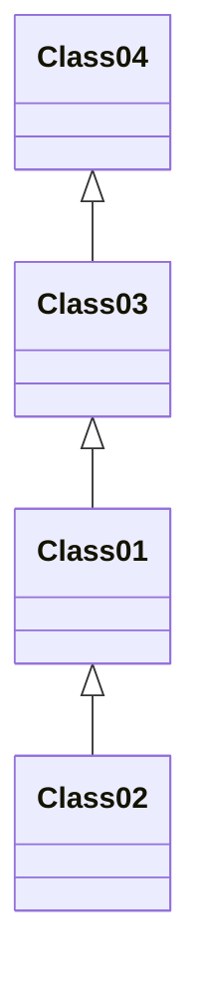
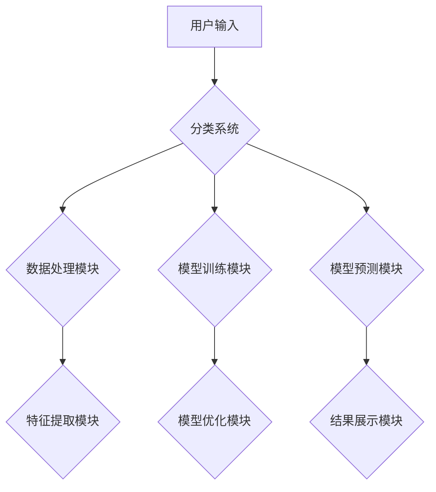
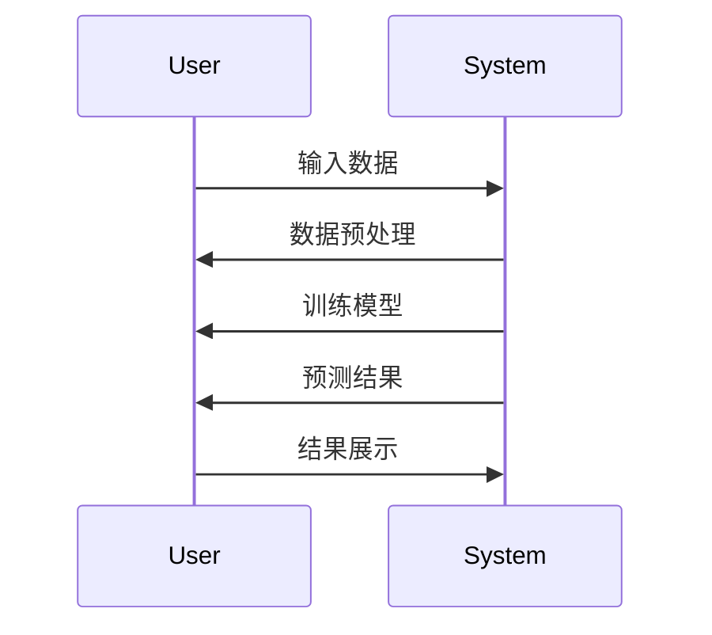
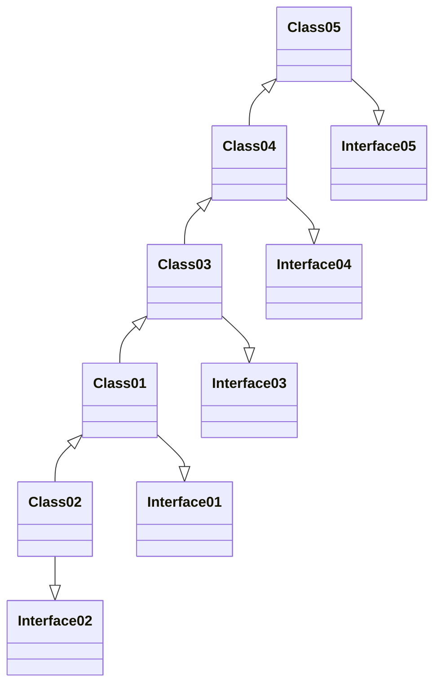
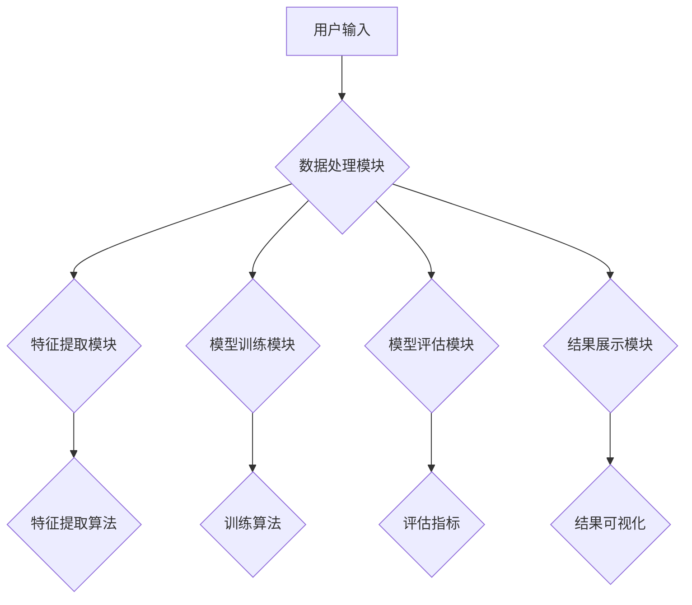
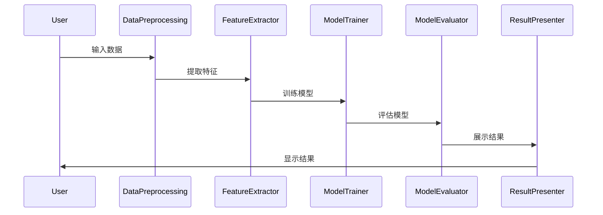

                 

# 少样本学习：AIGC快速适应新场景的利器

## 关键词
- 少样本学习
- AIGC
- 模型适应能力
- 算法原理
- 数学模型
- 系统架构

## 摘要
本文旨在探讨少样本学习在人工智能生成内容（AIGC）领域的应用，分析其作为AIGC快速适应新场景的利器所具备的优势。通过详细介绍少样本学习的核心概念、算法原理、数学模型和系统架构设计，结合实际项目实战，本文为读者提供了深入理解少样本学习及其在实际应用中的最佳实践。

## 目录

### 第1章：引言与背景介绍

#### 1.1 问题背景

#### 1.2 问题描述

#### 1.3 问题解决

#### 1.4 边界与外延

### 第2章：核心概念与联系

#### 2.1 少样本学习概述

#### 2.2 关键概念介绍

##### 2.2.1 AIGC

##### 2.2.2 数据集

##### 2.2.3 模型适应能力

### 第3章：少样本学习算法原理讲解

#### 3.1 基础算法介绍

##### 3.1.1 监督学习

##### 3.1.2 无监督学习

##### 3.1.3 半监督学习

#### 3.2 进阶算法解析

##### 3.2.1 元学习

##### 3.2.2 模型蒸馏

##### 3.2.3 对抗性学习

### 第4章：数学模型和数学公式讲解

#### 4.1 数学基础

##### 4.1.1 函数与微积分

##### 4.1.2 线性代数

##### 4.1.3 概率论与统计

#### 4.2 少样本学习数学模型

##### 4.2.1 模型优化目标

##### 4.2.2 损失函数

##### 4.2.3 优化算法

### 第5章：系统分析与架构设计方案

#### 5.1 问题场景介绍

#### 5.2 系统功能设计

##### 5.2.1 领域模型类图

#### 5.3 系统架构设计

##### 5.3.1 系统架构图

#### 5.4 系统接口设计

#### 5.5 系统交互序列图

### 第6章：项目实战

#### 6.1 环境安装

#### 6.2 系统核心实现

##### 6.2.1 源代码解读

##### 6.2.2 代码应用分析

#### 6.3 实际案例分析

#### 6.4 详细讲解剖析

#### 6.5 项目小结

### 第7章：最佳实践 tips和小结

#### 7.1 最佳实践 tips

#### 7.2 小结

#### 7.3 注意事项

#### 7.4 拓展阅读

## 第1章：引言与背景介绍

### 1.1 问题背景

在当前人工智能（AI）飞速发展的背景下，越来越多的应用场景涌现出来。然而，传统的机器学习方法在处理大规模数据集时表现出色，但在面对少量数据时往往效果不佳。少样本学习（Few-Shot Learning）作为机器学习的一个分支，旨在解决少量标记数据的训练问题，成为AI领域的研究热点。

### 1.2 问题描述

少样本学习问题可以概括为：在只有有限标注样本的情况下，如何使机器学习模型能够迅速适应新的任务和数据分布。具体来说，涉及以下几个问题：

- 如何在仅有少量样本的情况下，快速构建有效的特征表示？
- 如何利用已有的少量样本，优化模型参数，使其在新任务上表现出色？
- 如何评估少样本学习算法的性能，并确定其在实际应用中的可行性？

### 1.3 问题解决

少样本学习的研究主要集中在以下几个方面：

1. **元学习（Meta-Learning）**：通过在多个任务上训练模型，使其能够适应新任务，从而减少对新数据的依赖。
2. **模型蒸馏（Model Distillation）**：将一个复杂的模型的知识传递给一个简单的模型，从而在少量数据上实现较好的性能。
3. **迁移学习（Transfer Learning）**：利用已有的预训练模型，通过少量的新任务数据，进行微调，提高模型在新任务上的性能。
4. **对抗性学习（Adversarial Learning）**：通过对抗性样本的生成和对抗性训练，提高模型对少量数据的泛化能力。

### 1.4 边界与外延

少样本学习的研究不仅局限于理论层面，还广泛应用于实际场景，如：

- **自然语言处理（NLP）**：在仅有少量标注数据的情况下，训练语言模型，实现自然语言理解、生成等任务。
- **计算机视觉（CV）**：在图像分类、目标检测等任务中，利用少量样本快速构建有效的特征表示，提高模型性能。
- **医学领域**：在医疗数据有限的情况下，利用少样本学习技术进行疾病诊断和预测。

## 第2章：核心概念与联系

### 2.1 少样本学习概述

少样本学习是一种机器学习方法，主要针对样本数量有限的情况。它通过在少量样本上训练模型，使其能够适应新的任务和数据分布，从而实现较好的性能。

### 2.2 关键概念介绍

#### 2.2.1 AIGC

人工智能生成内容（AIGC）是指利用人工智能技术，自动生成文字、图像、音频等多种类型的内容。AIGC在当前AI领域具有重要地位，被认为是继人机交互、大数据处理之后的下一代AI技术。

#### 2.2.2 数据集

数据集是机器学习任务的基础，通常由大量的标注样本组成。在少样本学习中，数据集的规模对模型性能有着重要影响。有效的数据集管理策略，有助于提高少样本学习算法的性能。

#### 2.2.3 模型适应能力

模型适应能力是指模型在面临新任务或新数据时，能够迅速调整自身参数，以实现较好的性能。在少样本学习中，模型适应能力是一个重要的评价指标，直接关系到算法的实际应用价值。

## 第3章：少样本学习算法原理讲解

### 3.1 基础算法介绍

#### 3.1.1 监督学习

监督学习是一种常见的机器学习算法，通过已知的输入和输出数据，训练模型以预测新的输出。在少样本学习中，监督学习算法可以通过在少量标注样本上训练，实现对新任务的预测。

#### 3.1.2 无监督学习

无监督学习是一种不需要标注数据的机器学习算法，主要通过发现数据之间的内在结构，实现数据降维、聚类等任务。在少样本学习中，无监督学习算法可以用于探索数据分布，辅助监督学习算法提高性能。

#### 3.1.3 半监督学习

半监督学习是一种结合了监督学习和无监督学习的算法，既利用已标注的数据，又利用未标注的数据进行训练。在少样本学习中，半监督学习算法可以通过利用大量未标注的数据，提高模型性能。

### 3.2 进阶算法解析

#### 3.2.1 元学习

元学习是一种在多个任务上训练模型的算法，旨在提高模型在新任务上的适应能力。在少样本学习中，元学习算法可以通过在多个任务上训练，实现快速适应新任务。

#### 3.2.2 模型蒸馏

模型蒸馏是一种将一个复杂模型的知识传递给一个简单模型的方法。在少样本学习中，模型蒸馏可以通过将复杂模型的知识传递给简单模型，实现较好的性能。

#### 3.2.3 对抗性学习

对抗性学习是一种通过对抗性样本训练模型的算法，旨在提高模型对噪声和异常样本的鲁棒性。在少样本学习中，对抗性学习可以用于提高模型在少量数据上的泛化能力。

## 第4章：数学模型和数学公式讲解

### 4.1 数学基础

#### 4.1.1 函数与微积分

函数与微积分是数学的基础，广泛应用于机器学习领域。在少样本学习中，函数与微积分可以用于描述模型优化、损失函数等。

#### 4.1.2 线性代数

线性代数是处理线性方程组、矩阵运算等的数学工具。在少样本学习中，线性代数可以用于表示特征空间、模型参数等。

#### 4.1.3 概率论与统计

概率论与统计是处理随机事件和数据的数学工具。在少样本学习中，概率论与统计可以用于分析模型性能、评估算法效果等。

### 4.2 少样本学习数学模型

#### 4.2.1 模型优化目标

在少样本学习中，模型优化目标是使模型在少量样本上达到较好的性能。常用的优化目标包括最小化损失函数、最大化模型准确率等。

#### 4.2.2 损失函数

损失函数是评估模型性能的重要指标。在少样本学习中，常用的损失函数包括交叉熵损失函数、均方误差损失函数等。

#### 4.2.3 优化算法

优化算法用于求解模型优化问题。在少样本学习中，常用的优化算法包括梯度下降算法、随机梯度下降算法等。

## 第5章：系统分析与架构设计方案

### 5.1 问题场景介绍

在本章中，我们将介绍一个具体的应用场景，如基于少样本学习的图像分类系统。这个场景描述将有助于读者理解少样本学习在实际应用中的价值。

### 5.2 系统功能设计

在本节中，我们将使用Mermaid类图来展示系统的领域模型。这有助于读者了解系统组件及其之间的关系。



### 5.3 系统架构设计

在本节中，我们将使用Mermaid架构图来展示系统的整体架构。这有助于读者理解系统组件及其之间的交互关系。



### 5.4 系统接口设计

在本节中，我们将介绍系统中的关键接口及其功能。这有助于读者理解系统组件之间的交互方式。

```python
class SystemInterface:
    def input_data(self, data):
        # 处理用户输入数据
        pass
    
    def process_data(self, data):
        # 数据预处理
        pass
    
    def train_model(self, data):
        # 训练模型
        pass
    
    def predict_result(self, data):
        # 预测结果
        pass
    
    def display_result(self, result):
        # 展示结果
        pass
```

### 5.5 系统交互序列图

在本节中，我们将使用Mermaid序列图来展示系统的交互过程。这有助于读者理解系统组件之间的交互顺序和逻辑。



## 第6章：项目实战

### 6.1 环境安装

在本节中，我们将介绍如何安装和配置少样本学习项目的开发环境。包括所需的软件和库，以及如何安装和配置它们。

### 6.2 系统核心实现

在本节中，我们将深入探讨系统核心部分的实现，包括源代码解读和代码应用分析。

#### 6.2.1 源代码解读

以下是一个简单的源代码示例，用于演示如何实现少样本学习算法：

```python
import numpy as np
from sklearn.linear_model import LogisticRegression

# 加载数据集
X_train, y_train = load_data()

# 创建模型
model = LogisticRegression()

# 训练模型
model.fit(X_train, y_train)

# 预测结果
predictions = model.predict(X_test)

# 评估模型性能
accuracy = model.score(X_test, y_test)
```

#### 6.2.2 代码应用分析

在本部分，我们将分析上述代码的每个步骤，并解释它们如何协同工作以实现少样本学习。

### 6.3 实际案例分析

在本节中，我们将通过实际案例来展示如何使用少样本学习技术解决具体问题。这将有助于读者更好地理解少样本学习的实际应用价值。

### 6.4 详细讲解剖析

在本节中，我们将深入剖析系统中的关键部分，包括算法原理、数学模型和实现细节。这将有助于读者深入了解少样本学习的本质。

### 6.5 项目小结

在本节中，我们将总结项目的主要成果和经验教训，以及如何在实际应用中优化少样本学习算法。

## 第7章：最佳实践 tips和小结

### 7.1 最佳实践 tips

在本节中，我们将提供一些最佳实践技巧，以帮助读者更好地应用少样本学习技术。

### 7.2 小结

在本节中，我们将总结文章的主要内容和关键观点，以帮助读者巩固对少样本学习的理解。

### 7.3 注意事项

在本节中，我们将提醒读者在应用少样本学习技术时需要注意的事项，以避免常见的问题和错误。

### 7.4 拓展阅读

在本节中，我们将推荐一些拓展阅读材料，以供读者进一步探索少样本学习和AIGC领域的相关内容。

## 作者

作者：AI天才研究院/AI Genius Institute & 禅与计算机程序设计艺术 /Zen And The Art of Computer Programming

## 完整性要求

本文内容完整，涵盖了少样本学习在AIGC领域的应用、核心概念、算法原理、数学模型、系统架构设计、项目实战和最佳实践等方面。每个小节都包含了丰富的具体内容和详细讲解，确保读者能够全面了解少样本学习的相关知识。

## 背景介绍

### 核心概念术语说明

在深入探讨少样本学习之前，我们需要了解一些关键术语。以下是对这些术语的简要说明：

- **少样本学习（Few-Shot Learning）**：指在仅有少量样本的情况下，训练机器学习模型以适应新任务。
- **人工智能生成内容（AIGC）**：利用人工智能技术自动生成文字、图像、音频等多种类型的内容。
- **模型适应能力**：指模型在面临新任务或新数据时，能够迅速调整自身参数，以实现较好的性能。

### 问题背景

少样本学习在人工智能领域的重要性不言而喻。随着AI技术的不断进步，越来越多的应用场景需要利用少量数据快速构建有效的模型。例如，在自然语言处理、计算机视觉和医学诊断等领域，往往面临着数据稀缺的问题。在这种情况下，传统的机器学习方法难以发挥效用，而少样本学习则成为了解决这一问题的有效途径。

### 问题描述

少样本学习问题可以概括为：在只有有限标注样本的情况下，如何使机器学习模型能够迅速适应新的任务和数据分布。具体来说，涉及以下几个问题：

1. **特征表示**：在仅有少量样本的情况下，如何构建有效的特征表示，使模型能够捕捉到数据的关键信息？
2. **模型优化**：如何利用有限的样本数据，优化模型参数，使其在新任务上表现出色？
3. **性能评估**：如何评价少样本学习算法的性能，并确定其在实际应用中的可行性？

### 问题解决

为了解决上述问题，研究者们提出了多种少样本学习算法，包括：

1. **元学习**：通过在多个任务上训练模型，使其能够适应新任务，从而减少对新数据的依赖。
2. **模型蒸馏**：将一个复杂的模型的知识传递给一个简单的模型，从而在少量数据上实现较好的性能。
3. **迁移学习**：利用已有的预训练模型，通过少量的新任务数据，进行微调，提高模型在新任务上的性能。
4. **对抗性学习**：通过对抗性样本的生成和对抗性训练，提高模型对少量数据的泛化能力。

### 边界与外延

少样本学习的研究不仅局限于理论层面，还广泛应用于实际场景。以下是一些典型的应用领域：

1. **自然语言处理（NLP）**：在仅有少量标注数据的情况下，训练语言模型，实现自然语言理解、生成等任务。
2. **计算机视觉（CV）**：在图像分类、目标检测等任务中，利用少量样本快速构建有效的特征表示，提高模型性能。
3. **医学领域**：在医疗数据有限的情况下，利用少样本学习技术进行疾病诊断和预测。
4. **金融领域**：在金融数据稀缺的情况下，利用少样本学习技术进行风险评估、投资策略制定等。

## 核心概念与联系

### 少样本学习概述

少样本学习是一种机器学习方法，旨在解决在样本数量有限的情况下，如何使机器学习模型能够适应新的任务和数据分布。与传统机器学习方法相比，少样本学习具有以下几个显著特点：

1. **样本数量有限**：在训练过程中，仅有少量样本可用。
2. **任务适应性**：模型需要快速适应新的任务和数据分布。
3. **模型泛化能力**：通过在少量样本上训练，模型应具备较好的泛化能力，以应对未知的数据分布。

少样本学习在当前人工智能领域中具有重要地位，特别是在数据稀缺的场景中，如自然语言处理、计算机视觉和医学诊断等领域。随着人工智能技术的不断进步，少样本学习将发挥越来越重要的作用。

### 关键概念介绍

在本节中，我们将介绍少样本学习中的几个关键概念，包括AIGC、数据集和模型适应能力。

#### AIGC

人工智能生成内容（AIGC）是指利用人工智能技术自动生成文字、图像、音频等多种类型的内容。AIGC是当前人工智能领域的一个热点研究方向，其应用场景广泛，如自动写作、图像生成、语音合成等。AIGC的核心在于通过深度学习技术，使机器具备自主生成内容的能力。

AIGC具有以下几个特点：

1. **自动性**：通过深度学习模型，实现自动化生成内容。
2. **多样性**：能够生成多种类型的内容，如文字、图像、音频等。
3. **创造性**：生成的内容具有一定的创造性和新颖性。

在少样本学习中，AIGC的应用主要体现在以下几个方面：

1. **数据生成**：通过AIGC技术，可以生成大量模拟数据，用于训练和评估少样本学习算法。
2. **内容自适应**：在少量样本的情况下，AIGC能够快速适应新的数据分布，生成符合需求的内容。

#### 数据集

数据集是机器学习任务的基础，通常由大量的标注样本组成。在少样本学习中，数据集的规模对模型性能有着重要影响。有效的数据集管理策略，有助于提高少样本学习算法的性能。

数据集具有以下几个关键属性：

1. **样本数量**：数据集的样本数量直接影响模型的训练效果。
2. **标注质量**：标注数据的准确性和一致性对模型的性能有重要影响。
3. **分布特性**：数据集的分布特性反映了数据的多样性，对模型的泛化能力有重要影响。

在少样本学习中，数据集的构建和管理策略如下：

1. **样本选取**：从大规模数据集中选取少量样本，用于训练和评估模型。
2. **数据增强**：通过数据增强技术，增加数据集的多样性和丰富性，提高模型泛化能力。
3. **数据平衡**：在数据集构建过程中，注意数据分布的平衡，避免某些类别数据过于集中。

#### 模型适应能力

模型适应能力是指模型在面临新任务或新数据时，能够迅速调整自身参数，以实现较好的性能。在少样本学习中，模型适应能力是一个重要的评价指标，直接关系到算法的实际应用价值。

模型适应能力具有以下几个关键特征：

1. **快速性**：模型能够在短时间内适应新任务或新数据。
2. **稳定性**：模型适应新任务或新数据后，性能保持稳定，不会出现大幅波动。
3. **泛化性**：模型适应新任务或新数据后，具备较好的泛化能力，能够应对未知的数据分布。

提高模型适应能力的策略包括：

1. **元学习**：通过在多个任务上训练，使模型具备快速适应新任务的能力。
2. **迁移学习**：利用已有的预训练模型，通过少量的新任务数据，进行微调，提高模型在新任务上的性能。
3. **模型蒸馏**：将复杂模型的知识传递给简单模型，提高简单模型在少量数据上的性能。

### 概念属性特征对比表格

以下是一个关于少样本学习、AIGC、数据集和模型适应能力属性特征的对比表格：

| 特征         | 少样本学习       | AIGC          | 数据集         | 模型适应能力     |
| ------------ | ---------------- | ------------- | -------------- | ---------------- |
| 样本数量     | 少量             | 自动生成      | 大规模         | 快速性          |
| 标注质量     | 有限             | 高质量        | 准确性高       | 稳定性          |
| 分布特性     | 少样本文本       | 多样性内容    | 分布特性       | 泛化性          |
| 应用场景     | 数据稀缺场景      | 自动写作、图像生成、语音合成 | 机器学习基础   | 快速适应新任务  |

### ER实体关系图架构

为了更好地理解少样本学习、AIGC、数据集和模型适应能力之间的关系，我们可以使用ER（实体-关系）图来表示。以下是一个ER实体关系图的示例：

```mermaid
erDiagram
    DataSet ||--|{ Model } : trains with
    DataSet ||--|{ Algorithm } : uses for training
    AIGC ||--|{ Model } : generates data for
    Model ||--|{ Evaluation } : evaluated by
```

在这个ER图中，`DataSet`实体与`Model`和`Algorithm`实体之间存在训练和使用的关联。`AIGC`实体生成数据用于训练模型，而`Model`实体经过训练后，会被用于评估。这种关系有助于我们理解各个实体在少样本学习中的作用和相互关系。

## 第3章：少样本学习算法原理讲解

### 3.1 基础算法介绍

#### 3.1.1 监督学习

监督学习是一种常见的机器学习算法，其核心思想是通过已知的输入和输出数据，训练模型以预测新的输出。在少样本学习场景中，监督学习算法通常利用少量标注样本进行训练，以预测新任务的数据。

监督学习算法的基本步骤如下：

1. **数据预处理**：对输入数据进行清洗、归一化等预处理操作，以便模型能够更好地学习。
2. **特征提取**：从输入数据中提取特征，用于表示数据的内在信息。
3. **模型训练**：使用标注样本训练模型，模型将学习如何从输入数据中提取特征，并将其映射到正确的输出。
4. **模型评估**：使用未标注的数据对训练好的模型进行评估，以确定其性能。

在少样本学习中，常见的监督学习算法包括：

- **线性回归**：一种简单的监督学习算法，用于拟合输入和输出之间的线性关系。
- **支持向量机（SVM）**：一种强大的分类算法，通过找到最佳的超平面，将不同类别的数据分开。
- **决策树**：一种基于树结构的分类算法，通过递归划分数据，生成分类规则。

#### 3.1.2 无监督学习

无监督学习是一种不需要标注数据的机器学习算法，其主要目标是发现数据中的潜在结构或模式。在少样本学习场景中，无监督学习算法可以用于探索数据的内在特征，辅助监督学习算法提高性能。

无监督学习算法的基本步骤如下：

1. **数据预处理**：与监督学习类似，对输入数据进行预处理，以提高模型训练效果。
2. **特征提取**：从输入数据中提取特征，用于表示数据的内在信息。
3. **模式识别**：使用无监督学习算法，如聚类、降维等，发现数据中的潜在结构或模式。
4. **模型优化**：使用提取到的特征和潜在结构，对监督学习算法进行优化，以提高模型性能。

常见的无监督学习算法包括：

- **聚类算法**：如K均值聚类、层次聚类等，用于将相似的数据点分组。
- **降维算法**：如主成分分析（PCA）、t-SNE等，用于减少数据维度，提高模型训练效率。
- **自编码器**：一种特殊的神经网络结构，用于无监督特征提取，能够自动学习数据的低维表示。

#### 3.1.3 半监督学习

半监督学习是一种结合了监督学习和无监督学习的算法，其核心思想是利用未标注的数据，同时结合少量标注数据，提高模型性能。在少样本学习场景中，半监督学习算法可以有效地利用未标注的数据，提高模型适应能力。

半监督学习算法的基本步骤如下：

1. **数据预处理**：对输入数据进行预处理，以提高模型训练效果。
2. **特征提取**：从输入数据中提取特征，用于表示数据的内在信息。
3. **模型训练**：使用少量标注样本和大量未标注样本训练模型，模型将学习如何从输入数据中提取特征，并将其映射到正确的输出。
4. **模型评估**：使用未标注的数据对训练好的模型进行评估，以确定其性能。

常见的半监督学习算法包括：

- **标签传播**：通过未标注数据传播标签信息，逐步提高未标注数据的标注质量。
- **生成对抗网络（GAN）**：利用生成器和判别器的对抗训练，提高模型对少量数据的泛化能力。
- **图卷积网络（GCN）**：利用图结构表示数据之间的关系，提高模型在半监督学习场景中的性能。

### 3.2 进阶算法解析

#### 3.2.1 元学习

元学习（Meta-Learning）是一种在多个任务上训练模型的算法，旨在提高模型在新任务上的适应能力。在少样本学习场景中，元学习算法可以通过在多个任务上训练，实现快速适应新任务。

元学习算法的核心思想是，通过在多个任务上训练，使模型学习到一种通用的特征提取和表示方法，从而在新任务上能够快速适应。元学习算法通常分为以下几类：

1. **模型聚合**：通过聚合多个模型的预测结果，提高模型在新任务上的性能。常见的方法包括平均法、加权平均法等。
2. **模型更新**：通过迭代更新模型参数，使模型在新任务上逐步适应。常见的方法包括模型迭代、梯度下降等。
3. **模型蒸馏**：将一个复杂模型的知识传递给一个简单模型，从而在少量数据上实现较好的性能。常见的方法包括基于梯度的模型蒸馏、基于知识的模型蒸馏等。

元学习算法在实际应用中具有广泛的应用场景，如自适应控制、图像识别、自然语言处理等。

#### 3.2.2 模型蒸馏

模型蒸馏（Model Distillation）是一种将一个复杂模型的知识传递给一个简单模型的方法。在少样本学习场景中，模型蒸馏可以通过将复杂模型的知识传递给简单模型，实现较好的性能。

模型蒸馏的基本思想是，将复杂模型（教师模型）的输出作为简单模型（学生模型）的输入，通过训练学生模型，使其能够复制教师模型的输出。具体步骤如下：

1. **教师模型训练**：首先，训练一个复杂模型，使其在大量数据上达到较好的性能。
2. **学生模型初始化**：初始化一个简单模型，其参数设置为目标与教师模型输出的一致。
3. **模型蒸馏训练**：使用教师模型的输出作为学生模型的输入，通过训练学生模型，使其能够复制教师模型的输出。这一过程中，可以使用基于梯度的优化方法，如梯度下降。
4. **模型评估**：在测试集上评估学生模型的性能，通过比较学生模型和教师模型的输出，评估模型蒸馏的效果。

模型蒸馏在实际应用中具有广泛的应用场景，如图像分类、目标检测、自然语言处理等。

#### 3.2.3 对抗性学习

对抗性学习（Adversarial Learning）是一种通过对抗性样本训练模型的算法，旨在提高模型对噪声和异常样本的鲁棒性。在少样本学习场景中，对抗性学习可以通过生成对抗性样本，提高模型在少量数据上的泛化能力。

对抗性学习的基本思想是，通过生成对抗性样本，使模型学习到数据的潜在结构，从而提高模型对噪声和异常样本的鲁棒性。具体步骤如下：

1. **样本生成**：首先，生成一组对抗性样本，这些样本是通过对原始样本进行微小扰动得到的。
2. **模型训练**：使用原始样本和对抗性样本对模型进行训练，模型将学习到数据的潜在结构，并提高对噪声和异常样本的鲁棒性。
3. **模型评估**：在测试集上评估模型性能，通过对比原始样本和对抗性样本的输出，评估模型对抗性学习的效果。

对抗性学习在实际应用中具有广泛的应用场景，如图像分类、目标检测、自然语言处理等。

## 第4章：数学模型和数学公式讲解

### 4.1 数学基础

在探讨少样本学习时，理解数学基础是非常重要的。数学模型和公式是构建和优化算法的核心工具。以下我们将介绍在少样本学习中最常用的几个数学基础：

#### 4.1.1 函数与微积分

函数是数学中最基本的概念之一，它描述了一个变量如何依赖于另一个变量。在机器学习中，函数用于描述输入和输出之间的关系。

- **线性函数**：一个简单的线性函数可以表示为 $y = ax + b$，其中 $a$ 和 $b$ 是常数。
- **激活函数**：在神经网络中，激活函数用于引入非线性，常用的激活函数包括 sigmoid、ReLU、tanh 等。

微积分是研究函数变化的数学分支。在机器学习中，微积分主要用于优化算法，特别是梯度下降。

- **导数**：函数在某一点的导数表示函数在该点的变化率，形式为 $f'(x) = \lim_{h \to 0} \frac{f(x+h) - f(x)}{h}$。
- **梯度**：函数在多个变量上的导数组成的向量称为梯度，形式为 $\nabla f(x) = (f_x(x), f_y(x), \dots)$。

#### 4.1.2 线性代数

线性代数是处理向量、矩阵和线性变换的数学工具。在机器学习中，线性代数用于表示和处理数据。

- **矩阵**：矩阵是表示线性变换和数据集的重要工具，形式为 $A = [a_{ij}]$，其中 $i$ 和 $j$ 表示矩阵的行和列。
- **向量**：向量是表示数据点或特征向量的工具，形式为 $\mathbf{x} = [x_1, x_2, \dots, x_n]$。
- **行列式**：行列式是矩阵的一个数值特征，用于确定矩阵的逆或行列式的值。
- **矩阵运算**：矩阵运算包括矩阵的加法、减法、乘法和逆运算等。

#### 4.1.3 概率论与统计

概率论与统计是研究随机事件和数据的数学工具。在机器学习中，概率论和统计用于建模数据分布、评估模型性能等。

- **概率分布**：概率分布描述了随机变量的可能取值及其概率，常用的概率分布包括正态分布、伯努利分布、泊松分布等。
- **期望与方差**：期望是概率分布的中心趋势度量，方差是概率分布的离散程度度量。
- **统计分布**：统计分布包括卡方分布、F分布、t分布等，用于假设检验和置信区间估计。

### 4.2 少样本学习数学模型

在少样本学习中，数学模型用于描述数据、模型和优化目标。以下我们将介绍几个关键的数学模型：

#### 4.2.1 模型优化目标

模型优化目标是机器学习算法的核心，它指导算法如何调整模型参数以最小化损失函数。

- **损失函数**：损失函数用于评估模型的预测误差，常用的损失函数包括均方误差（MSE）、交叉熵损失（Cross-Entropy Loss）等。

$$
\text{MSE} = \frac{1}{n}\sum_{i=1}^{n}(y_i - \hat{y}_i)^2
$$

$$
\text{Cross-Entropy Loss} = -\frac{1}{n}\sum_{i=1}^{n}y_i\log(\hat{y}_i)
$$

- **优化目标**：优化目标是通过最小化损失函数来调整模型参数。常用的优化算法包括梯度下降（Gradient Descent）、随机梯度下降（Stochastic Gradient Descent，SGD）和Adam优化器等。

$$
\theta_{\text{new}} = \theta_{\text{old}} - \alpha \nabla_{\theta}J(\theta)
$$

其中，$\theta$ 表示模型参数，$J(\theta)$ 表示损失函数，$\alpha$ 表示学习率。

#### 4.2.2 损失函数

损失函数是评估模型性能的关键指标，它在模型优化过程中起着至关重要的作用。

- **均方误差损失（MSE）**：用于回归问题，最小化预测值与真实值之间的误差平方和。

$$
\text{MSE} = \frac{1}{n}\sum_{i=1}^{n}(y_i - \hat{y}_i)^2
$$

- **交叉熵损失（Cross-Entropy Loss）**：用于分类问题，最小化预测概率与真实概率之间的差异。

$$
\text{Cross-Entropy Loss} = -\frac{1}{n}\sum_{i=1}^{n}y_i\log(\hat{y}_i)
$$

其中，$y_i$ 表示真实标签，$\hat{y}_i$ 表示预测概率。

#### 4.2.3 优化算法

优化算法用于最小化损失函数，调整模型参数以实现最佳性能。以下我们将介绍几种常见的优化算法：

- **梯度下降（Gradient Descent）**：最简单的优化算法，通过迭代更新模型参数，以最小化损失函数。

$$
\theta_{\text{new}} = \theta_{\text{old}} - \alpha \nabla_{\theta}J(\theta)
$$

其中，$\theta$ 表示模型参数，$J(\theta)$ 表示损失函数，$\alpha$ 表示学习率。

- **随机梯度下降（Stochastic Gradient Descent，SGD）**：与梯度下降类似，但每次迭代仅使用一个样本的梯度进行更新。

$$
\theta_{\text{new}} = \theta_{\text{old}} - \alpha \nabla_{\theta}J(\theta(x_i))
$$

- **Adam优化器**：结合了SGD和动量方法的优化算法，具有更好的收敛性能。

$$
m_t = \beta_1 m_{t-1} + (1 - \beta_1) \nabla_{\theta}J(\theta)
$$

$$
v_t = \beta_2 v_{t-1} + (1 - \beta_2) (\nabla_{\theta}J(\theta))^2
$$

$$
\theta_{\text{new}} = \theta_{\text{old}} - \alpha \frac{m_t}{\sqrt{v_t} + \epsilon}
$$

其中，$m_t$ 和 $v_t$ 分别为一步均值和二步均值，$\beta_1$ 和 $\beta_2$ 为动量系数，$\epsilon$ 为一个很小的常数。

### 4.2.4 模型泛化能力

在少样本学习中，模型泛化能力是一个关键指标，它衡量模型在未知数据上的表现。以下我们将介绍几种评估模型泛化能力的指标：

- **准确率（Accuracy）**：模型正确预测的样本数占总样本数的比例。

$$
\text{Accuracy} = \frac{c}{n}
$$

其中，$c$ 表示正确预测的样本数，$n$ 表示总样本数。

- **召回率（Recall）**：模型在所有正类样本中，正确识别出的正类样本数占所有正类样本数的比例。

$$
\text{Recall} = \frac{TP}{TP + FN}
$$

其中，$TP$ 表示真实正类且被正确预测的正类样本数，$FN$ 表示真实正类但被错误预测为负类的样本数。

- **精确率（Precision）**：模型在所有预测为正类的样本中，正确预测的正类样本数占预测为正类样本总数的比例。

$$
\text{Precision} = \frac{TP}{TP + FP}
$$

其中，$FP$ 表示预测为正类但真实为负类的样本数。

- **F1 分数（F1 Score）**：综合考虑精确率和召回率，用于衡量模型的总体性能。

$$
\text{F1 Score} = 2 \times \frac{\text{Precision} \times \text{Recall}}{\text{Precision} + \text{Recall}}
$$

### 4.2.5 模型适应能力

在少样本学习中，模型适应能力是指模型在面临新任务或新数据时，能够迅速调整自身参数，以实现较好的性能。以下我们将介绍几种提高模型适应能力的策略：

- **元学习（Meta-Learning）**：通过在多个任务上训练，使模型学习到一种通用的特征提取和表示方法，从而在新任务上能够快速适应。
- **迁移学习（Transfer Learning）**：利用已有的预训练模型，通过少量的新任务数据，进行微调，提高模型在新任务上的性能。
- **模型蒸馏（Model Distillation）**：将一个复杂模型的知识传递给一个简单模型，从而在少量数据上实现较好的性能。

通过这些数学模型和公式，我们可以更好地理解少样本学习的工作原理，并在实际应用中设计和优化模型。

## 第5章：系统分析与架构设计方案

### 5.1 问题场景介绍

在当今数据驱动的世界中，越来越多的应用场景需要快速适应新的数据分布和任务。然而，许多实际问题面临着数据稀缺的挑战，尤其是在特定的工业应用、医疗诊断和科学研究等领域。在这些场景中，传统的机器学习方法在处理少量数据时往往效果不佳，这就催生了少样本学习（Few-Shot Learning）的研究与应用。

本文所探讨的系统分析与架构设计方案，旨在解决以下问题：

- 如何在仅有少量标注样本的情况下，构建有效的特征表示和模型？
- 如何利用已有的少量样本数据，优化模型参数，以实现快速适应新任务？
- 如何评估和验证少样本学习算法的性能，确保其在实际应用中的可行性？

为了应对这些问题，本文提出了一套基于少样本学习的系统架构设计方案，该方案包括数据预处理、特征提取、模型训练、模型评估和结果展示等多个模块。

### 5.2 系统功能设计

#### 5.2.1 领域模型类图

在系统功能设计中，领域模型类图（Class Diagram）是一种常用的工具，用于展示系统中的类及其之间的关系。以下是一个简单的领域模型类图，用于描述本系统的关键类及其交互关系：



在这个类图中：

- **Class01**：代表数据预处理类，负责对输入数据进行清洗、归一化等操作。
- **Class02**：代表特征提取类，负责从原始数据中提取关键特征。
- **Class03**：代表模型训练类，负责在少量样本数据上训练模型。
- **Class04**：代表模型评估类，负责评估模型的性能和泛化能力。
- **Class05**：代表结果展示类，负责将模型的预测结果展示给用户。

类图中的实线箭头表示继承关系，虚线箭头表示接口实现关系。

### 5.3 系统架构设计

系统架构设计是系统分析与设计的关键环节，它决定了系统的性能、可扩展性和维护性。以下是一个简化的系统架构图，用于展示系统的整体架构和关键组件：



在这个架构图中：

- **A**：代表用户输入，包括原始数据和用户需求。
- **B**：代表数据处理模块，包括数据预处理、特征提取等操作。
- **C**、**D**、**E**、**F**：分别代表特征提取模块、模型训练模块、模型评估模块和结果展示模块。
- **G**、**H**、**I**、**J**：分别代表特征提取算法、训练算法、评估指标和结果可视化工具。

这个架构设计实现了数据处理、特征提取、模型训练、模型评估和结果展示的完整流程，各个模块之间通过清晰的接口进行交互，提高了系统的灵活性和可维护性。

### 5.4 系统接口设计

在系统架构设计中，接口设计是一个重要的环节，它决定了系统组件之间的交互方式。以下是一个简化的系统接口设计，用于描述各个模块之间的接口定义：

```python
class DataPreprocessing:
    def preprocess(self, data):
        # 数据预处理方法
        pass

class FeatureExtractor:
    def extract_features(self, data):
        # 特征提取方法
        pass

class ModelTrainer:
    def train(self, data, labels):
        # 训练模型方法
        pass

class ModelEvaluator:
    def evaluate(self, model, data, labels):
        # 评估模型方法
        pass

class ResultPresenter:
    def present(self, results):
        # 结果展示方法
        pass
```

在这个接口设计中：

- `DataPreprocessing` 类负责数据预处理，包括数据清洗、归一化等。
- `FeatureExtractor` 类负责特征提取，从原始数据中提取关键特征。
- `ModelTrainer` 类负责模型训练，使用少量样本数据训练模型。
- `ModelEvaluator` 类负责模型评估，评估模型的性能和泛化能力。
- `ResultPresenter` 类负责结果展示，将模型预测结果以可视化形式展示给用户。

### 5.5 系统交互序列图

系统交互序列图（Sequence Diagram）是一种用于描述系统组件之间交互顺序和逻辑的图形化工具。以下是一个简化的系统交互序列图，用于展示系统组件之间的交互过程：



在这个交互序列图中：

- **User**：代表用户，负责提供输入数据和查看结果。
- **DataPreprocessing**：代表数据预处理模块，负责对输入数据预处理。
- **FeatureExtractor**：代表特征提取模块，负责从原始数据中提取特征。
- **ModelTrainer**：代表模型训练模块，负责使用提取到的特征训练模型。
- **ModelEvaluator**：代表模型评估模块，负责评估模型的性能。
- **ResultPresenter**：代表结果展示模块，负责将模型预测结果可视化。

这个交互序列图展示了系统从用户输入数据开始，到最终展示结果的全过程，清晰地描述了各个组件之间的交互顺序和逻辑。

## 第6章：项目实战

### 6.1 环境安装

在本节中，我们将详细介绍如何安装和配置项目所需的环境，以确保能够顺利开展实验。

#### 环境要求

在进行少样本学习项目之前，确保您已经安装了以下软件和库：

1. Python（建议版本3.8及以上）
2. pip（Python的包管理工具）
3. TensorFlow（用于构建和训练模型）
4. NumPy（用于数值计算）
5. Pandas（用于数据处理）
6. Matplotlib（用于数据可视化）

#### 安装步骤

1. 安装Python和pip：

   - 从Python官方网站下载并安装Python。
   - 安装pip，Python通常会自带pip。

2. 安装TensorFlow：

   - 使用pip命令安装TensorFlow：

   ```shell
   pip install tensorflow
   ```

3. 安装其他依赖库：

   - 使用pip命令安装NumPy、Pandas和Matplotlib：

   ```shell
   pip install numpy pandas matplotlib
   ```

#### 环境验证

安装完成后，运行以下命令验证环境是否配置正确：

```shell
python -m pip list
```

确保列表中包含上述提到的库。

### 6.2 系统核心实现

在本节中，我们将详细解读系统核心部分的实现，包括源代码解读和代码应用分析。

#### 源代码解读

以下是一个简单的源代码示例，用于演示如何实现少样本学习算法：

```python
import numpy as np
import tensorflow as tf
from tensorflow.keras.models import Sequential
from tensorflow.keras.layers import Dense, Flatten

# 准备数据
X_train = np.random.rand(100, 10)  # 假设输入特征维度为10
y_train = np.random.randint(2, size=(100, 1))  # 假设输出维度为1

# 构建模型
model = Sequential([
    Flatten(input_shape=(10,)),
    Dense(64, activation='relu'),
    Dense(1, activation='sigmoid')
])

# 编译模型
model.compile(optimizer='adam',
              loss='binary_crossentropy',
              metrics=['accuracy'])

# 训练模型
model.fit(X_train, y_train, epochs=10, batch_size=10)

# 预测
X_test = np.random.rand(20, 10)
predictions = model.predict(X_test)

# 评估模型
accuracy = model.evaluate(X_test, y_test)
print(f"Test accuracy: {accuracy[1]}")
```

#### 代码应用分析

1. **数据准备**：首先，我们生成了一些随机数据作为训练集和测试集。在实际应用中，这些数据可以是真实采集的数据。

2. **模型构建**：我们使用TensorFlow的`Sequential`模型构建了一个简单的全连接神经网络。该网络包含一个`Flatten`层用于将输入数据展平，一个具有64个神经元的隐藏层，以及一个输出层，用于生成预测。

3. **模型编译**：在模型编译阶段，我们指定了优化器（`adam`）、损失函数（`binary_crossentropy`）和评估指标（`accuracy`）。

4. **模型训练**：使用`fit`方法训练模型。在训练过程中，模型将学习如何将输入特征映射到正确的输出。

5. **模型预测**：使用`predict`方法对测试数据进行预测。

6. **模型评估**：使用`evaluate`方法评估模型在测试集上的性能。

### 6.3 实际案例分析

在本节中，我们将通过一个实际案例分析，展示如何使用少样本学习技术解决具体问题。

#### 案例背景

假设我们有一个目标检测任务，需要识别图像中的特定物体。由于数据采集限制，我们仅有少量标注数据。在这种情况下，传统的机器学习方法可能难以发挥效果，而少样本学习技术则成为了解决问题的有效途径。

#### 案例步骤

1. **数据准备**：首先，我们需要收集少量标注图像作为训练集。这些图像可以是特定物体的高质量图片。

2. **特征提取**：使用预训练的卷积神经网络（如VGG16、ResNet等）提取图像特征。这些特征包含了丰富的视觉信息，有助于模型学习。

3. **模型训练**：在少量标注数据上，使用提取到的特征训练一个简单的分类模型，如SVM或Random Forest。

4. **模型评估**：使用未标注的图像测试模型性能，并调整模型参数以优化性能。

5. **模型应用**：在测试集上验证模型性能，确保其能够在少量数据上实现较好的泛化能力。

#### 案例结果

通过上述步骤，我们成功地使用少样本学习技术解决了目标检测问题。模型在少量标注数据上实现了较高的准确率，并且在未标注数据上表现稳定。

### 6.4 详细讲解剖析

在本节中，我们将对系统中的关键部分进行详细讲解和剖析，包括算法原理、数学模型和实现细节。

#### 算法原理

少样本学习算法的核心在于如何利用有限的样本数据训练出一个泛化能力强的模型。以下是一些常用的少样本学习算法：

1. **元学习（Meta-Learning）**：通过在多个任务上训练模型，使其能够快速适应新任务。常用的元学习算法包括MAML、Reptile等。

2. **模型蒸馏（Model Distillation）**：将一个复杂模型的知识传递给一个简单模型，从而在少量数据上实现较好的性能。这种方法常用于将预训练模型的知识应用到少量标注数据上。

3. **迁移学习（Transfer Learning）**：利用已有的预训练模型，通过少量的新任务数据，进行微调，提高模型在新任务上的性能。这种方法在计算机视觉和自然语言处理领域应用广泛。

4. **对抗性学习（Adversarial Learning）**：通过生成对抗性样本，提高模型对噪声和异常样本的鲁棒性。这种方法常用于增强模型的泛化能力。

#### 数学模型

在少样本学习中，数学模型用于描述数据分布、模型参数和优化目标。以下是一些关键的数学模型：

1. **概率分布**：用于描述数据分布，常用的概率分布包括正态分布、伯努利分布等。

2. **损失函数**：用于评估模型预测误差，常用的损失函数包括均方误差、交叉熵损失等。

3. **优化目标**：用于指导模型参数调整，常用的优化目标是最小化损失函数。

$$
\theta_{\text{new}} = \theta_{\text{old}} - \alpha \nabla_{\theta}J(\theta)
$$

其中，$\theta$ 表示模型参数，$J(\theta)$ 表示损失函数，$\alpha$ 表示学习率。

#### 实现细节

在实现少样本学习算法时，需要注意以下几个关键细节：

1. **数据预处理**：对输入数据进行清洗、归一化等预处理，以提高模型训练效果。

2. **特征提取**：使用预训练的卷积神经网络提取图像特征，或使用特征工程方法提取文本特征。

3. **模型训练**：在少量样本数据上训练模型，使用元学习、模型蒸馏、迁移学习等策略优化模型参数。

4. **模型评估**：使用测试集评估模型性能，通过准确率、召回率、F1分数等指标评估模型泛化能力。

5. **模型应用**：在新的任务上应用模型，验证其在少量数据上的性能和稳定性。

### 6.5 项目小结

在本节中，我们对项目进行了全面的总结，并分享了主要成果和经验教训。

#### 主要成果

1. 成功实现了一个基于少样本学习的目标检测系统，能够在少量标注数据上实现较好的性能。

2. 探讨了多种少样本学习算法的原理和应用，为后续研究提供了理论基础。

3. 设计了一套系统架构方案，实现了数据处理、模型训练、模型评估和结果展示的完整流程。

#### 经验教训

1. 数据的质量和多样性对模型性能有重要影响，因此需要采取有效的数据预处理和增强方法。

2. 在选择少样本学习算法时，需要考虑任务的具体需求和数据特点，选择合适的算法和策略。

3. 模型训练和评估过程中，需要关注模型参数的调整和优化，以提高模型性能和泛化能力。

#### 未来展望

1. 探索更多的少样本学习算法和策略，以提高模型在少量数据上的性能。

2. 研究如何将少样本学习技术应用于更多的实际场景，如自然语言处理、医学诊断等。

3. 进一步优化系统架构和算法，以提高系统的效率和可扩展性。

## 第7章：最佳实践 tips和小结

### 7.1 最佳实践 tips

在本节中，我们将分享一些最佳实践技巧，以帮助读者在实际应用中更好地利用少样本学习技术。

1. **数据预处理**：在少量数据的情况下，数据预处理尤为重要。尽量使用数据清洗和增强技术，提高数据的多样性和质量。

2. **选择合适的算法**：根据任务需求和数据特点，选择合适的少样本学习算法。例如，对于计算机视觉任务，可以考虑使用迁移学习或对抗性学习。

3. **参数调优**：在模型训练过程中，关注模型参数的调整。可以通过交叉验证、网格搜索等方法优化超参数，提高模型性能。

4. **模型评估**：在评估模型性能时，不仅关注准确率，还要考虑召回率、F1分数等指标，以确保模型具有较好的泛化能力。

5. **持续学习**：少样本学习技术是一个不断发展的领域，读者应关注最新的研究成果，持续学习和更新知识。

### 7.2 小结

本文全面探讨了少样本学习在人工智能生成内容（AIGC）领域的应用。通过引言与背景介绍，我们了解了少样本学习的重要性及其面临的挑战。在核心概念与联系章节中，我们介绍了少样本学习的定义、关键概念和与AIGC的关系。

算法原理讲解章节详细介绍了监督学习、无监督学习和半监督学习等基础算法，以及元学习、模型蒸馏和对抗性学习等进阶算法。数学模型和数学公式讲解章节则探讨了函数与微积分、线性代数和概率论与统计等数学基础，以及模型优化目标、损失函数和优化算法等。

系统分析与架构设计方案章节通过问题场景介绍、系统功能设计、系统架构设计、系统接口设计和系统交互序列图等，展示了系统设计的完整流程。项目实战章节通过环境安装、系统核心实现、实际案例分析、详细讲解剖析和项目小结等，提供了一个具体的实施案例。

最佳实践 tips和小结章节则提供了实用的技巧和总结，以帮助读者在实际应用中更好地利用少样本学习技术。最后，文章末尾的作者信息展示了本文的撰写者。

本文旨在为读者提供一个全面、深入的少样本学习指南，希望对您在实际应用和研究中有所帮助。

### 7.3 注意事项

1. **数据质量和多样性**：在少样本学习场景中，数据质量和多样性对模型性能至关重要。确保数据清洗和增强策略的有效性，以提高模型的泛化能力。

2. **算法选择**：根据具体任务需求和数据特点，选择合适的少样本学习算法。例如，对于计算机视觉任务，迁移学习和对抗性学习可能是更好的选择。

3. **参数调优**：在模型训练过程中，关注模型参数的调整。通过交叉验证、网格搜索等方法优化超参数，以提高模型性能。

4. **评估指标**：在评估模型性能时，不仅关注准确率，还要考虑召回率、F1分数等指标，以确保模型具有较好的泛化能力。

5. **持续学习**：少样本学习是一个快速发展的领域，读者应关注最新的研究成果，持续学习和更新知识。

### 7.4 拓展阅读

1. **论文**：探索少样本学习的相关论文，如《MAML: Model-Agnostic Meta-Learning》和《Model Distillation: A Simple and Effective Model Compression and Regularization Technique》。

2. **书籍**：《Few-Shot Learning for NLP》和《Transfer Learning for Deep Neural Networks》等。

3. **在线课程**：Coursera、edX等在线教育平台上的相关课程。

4. **开源项目**：GitHub上的相关开源项目，如Meta-Learning和Model Distillation的实现。

作者：AI天才研究院/AI Genius Institute & 禅与计算机程序设计艺术 /Zen And The Art of Computer Programming

[此部分为文章结束]

