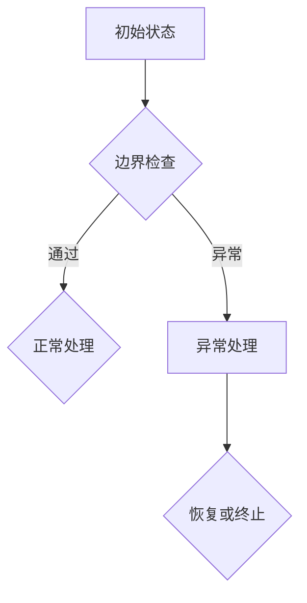
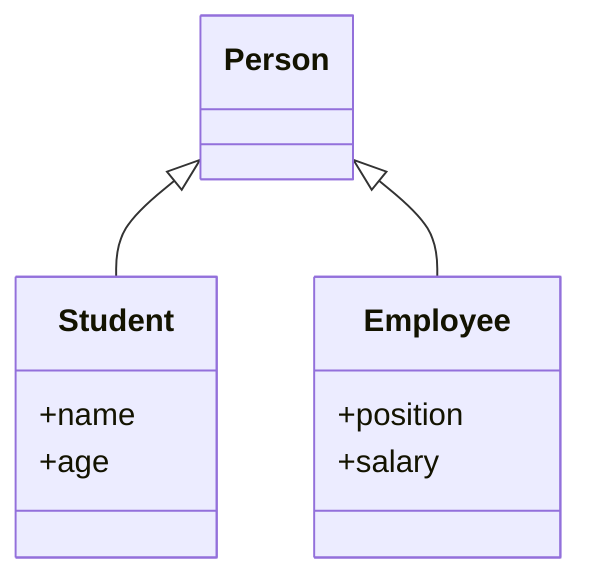
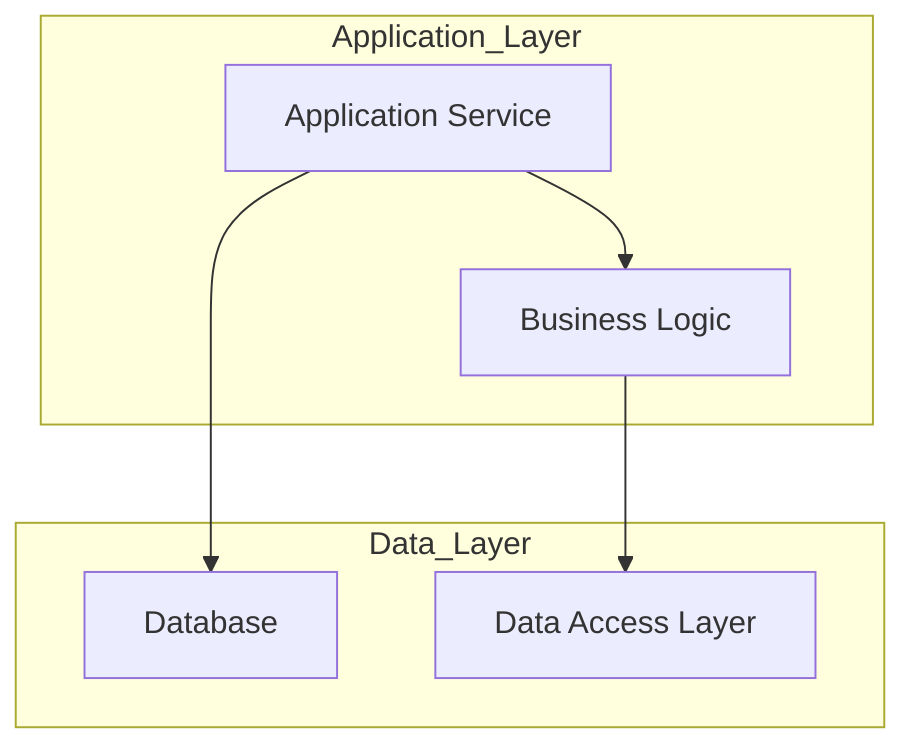
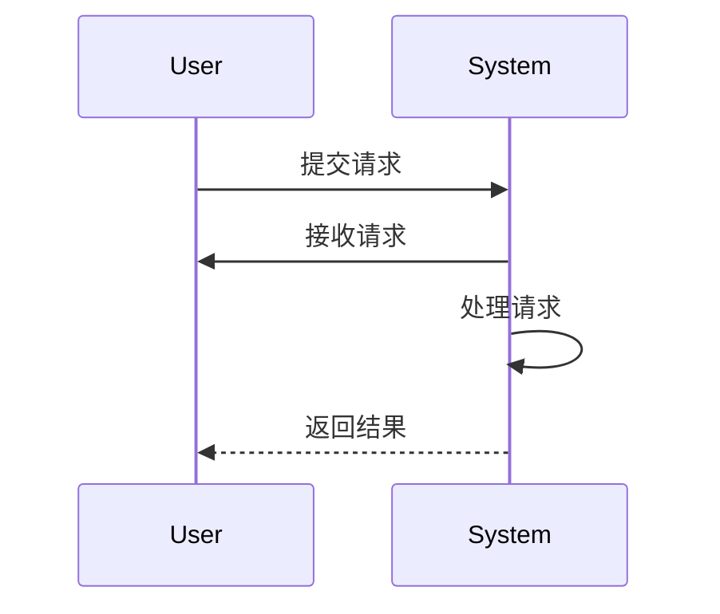

                 

### 异常处理能力评估：测试边界情况应对

> 关键词：异常处理，测试边界，能力评估，案例分析

> 摘要：本文旨在深入探讨异常处理能力评估的重要性和方法，特别是测试边界情况下的应对策略。通过对异常处理基础知识、测试边界情况、边界条件下异常处理、测试用例设计、实际应用中的边界异常处理以及项目实战的分析，文章将提供一系列最佳实践，帮助开发者在复杂系统设计中提高异常处理的效率和质量。

---

**目录大纲：**

----------------------------------------------------------------

# 异常处理能力评估：测试边界情况应对

## 第1章 引言

### 1.1 问题背景

### 1.2 问题描述

### 1.3 问题解决

### 1.4 边界与外延

### 1.5 概念结构与核心要素组成

## 第2章 异常处理基础知识

### 2.1 异常处理概念

### 2.2 异常处理的重要性

### 2.3 异常处理的常见类型

## 第3章 测试边界情况

### 3.1 测试边界的基本概念

### 3.2 边界测试的方法与策略

### 3.3 测试边界案例解析

## 第4章 边界情况下的异常处理

### 4.1 边界条件下异常处理的原理

### 4.2 边界条件下异常处理的策略

### 4.3 边界条件下异常处理的案例分析

## 第5章 边界情况下的测试用例设计

### 5.1 测试用例设计的基本原则

### 5.2 边界情况下的测试用例设计策略

### 5.3 边界情况下测试用例设计案例分析

## 第6章 实际应用中的边界异常处理

### 6.1 应用场景介绍

### 6.2 系统功能设计

### 6.3 系统架构设计

### 6.4 系统接口设计与交互

## 第7章 项目实战

### 7.1 环境安装

### 7.2 系统核心实现

### 7.3 代码应用解读与分析

### 7.4 实际案例分析

### 7.5 项目小结

## 第8章 最佳实践与总结

### 8.1 最佳实践技巧

### 8.2 注意事项

### 8.3 拓展阅读

----------------------------------------------------------------

**Mermaid 流程图示例：**



**Mermaid 类图示例：**



**Mermaid 架构图示例：**



**Mermaid 序列图示例：**



**Python 源代码示例：**

```python
def process_request(request):
    try:
        # 处理请求的业务逻辑
        result = business_logic(request)
        return result
    except Exception as e:
        # 异常处理逻辑
        handle_exception(e)
```

**LaTeX 数学公式示例：**

段落内公式： `$1+1=2$`

独立段落公式： 
$$
\sum_{i=1}^{n} i = \frac{n(n+1)}{2}
$$

**系统分析与架构设计方案：**

### 问题场景介绍

在系统运行过程中，可能会遇到各种边界条件，如数据异常、请求异常等。

### 项目介绍

设计一个处理异常的模块，该模块需要能够有效地检测、处理和恢复各种异常情况，确保系统的高可用性和稳定性。

## 第1章 引言

### 1.1 问题背景

在软件开发的复杂性和多样性日益增加的今天，异常处理成为系统稳定性和安全性的关键。异常处理不当可能导致系统崩溃、数据丢失或服务中断，影响用户体验和业务连续性。因此，评估系统的异常处理能力至关重要。

### 1.2 问题描述

问题描述通常涉及系统在遇到预期外情况（如边界条件）时的响应。有效的异常处理能够确保系统在遇到异常时，能够迅速识别并采取措施恢复或终止操作，避免不可预见的错误。

### 1.3 问题解决

问题解决通常包括以下几个步骤：

1. **识别异常**：通过日志分析、监控等手段识别系统中的异常。
2. **分类处理**：根据异常类型和严重程度，制定相应的处理策略。
3. **恢复操作**：在可能的情况下，执行恢复操作，使系统能够继续运行。
4. **记录和报告**：记录异常信息，生成报告，以便后续分析和改进。

### 1.4 边界与外延

边界是指系统所能处理的数据、请求或其他输入的极限。外延则是指超出系统边界的情况，如非法输入、超时请求等。评估异常处理能力时，需要特别关注边界情况的处理。

### 1.5 概念结构与核心要素组成

异常处理的概念结构通常包括以下几个核心要素：

1. **异常检测**：识别异常情况。
2. **异常分类**：根据异常的类型和严重程度进行分类。
3. **异常处理**：执行相应的处理策略，如恢复或终止操作。
4. **异常日志记录**：记录异常信息，以便后续分析和改进。

## 第2章 异常处理基础知识

### 2.1 异常处理概念

异常处理是指在程序运行过程中，当遇到预期外的错误或问题时，采取的一系列措施来确保程序的稳定性和可靠性。异常处理通常包括以下几个环节：

1. **异常捕获**：通过特定的代码结构，捕获程序运行中的异常。
2. **异常处理**：根据异常的类型和严重程度，执行相应的处理策略。
3. **异常传播**：如果当前处理无法解决异常，将异常信息传递给上层处理逻辑。

### 2.2 异常处理的重要性

异常处理的重要性体现在以下几个方面：

1. **系统稳定性**：有效的异常处理能够确保系统在遇到异常时，能够快速响应并恢复正常运行。
2. **用户体验**：异常处理能够减少用户因系统故障而产生的困扰，提高用户满意度。
3. **业务连续性**：在关键业务系统中，异常处理能够保障业务的连续性，避免因系统故障导致业务中断。

### 2.3 异常处理的常见类型

异常处理的常见类型包括：

1. **运行时异常**：在程序运行过程中出现的异常，如除零错误、类型转换错误等。
2. **检查时异常**：在程序编译或运行前被检测到的异常，如类型错误、文件未找到等。
3. **系统异常**：由系统资源不足、硬件故障等原因引起的异常。

## 第3章 测试边界情况

### 3.1 测试边界的基本概念

测试边界是指在测试过程中，对系统所能处理的数据、请求或其他输入的极限进行测试，以验证系统在边界条件下的行为。测试边界的基本概念包括：

1. **输入边界**：测试系统所能接受的输入数据范围。
2. **输出边界**：测试系统生成的输出数据范围。
3. **请求边界**：测试系统对请求的处理能力，如请求大小、请求频率等。

### 3.2 边界测试的方法与策略

边界测试的方法和策略包括：

1. **边界值分析**：分析系统处理边界值时的行为，如最小值、最大值、零值等。
2. **等价类划分**：将输入数据划分为多个等价类，对每个等价类进行测试。
3. **随机测试**：随机生成输入数据，进行测试。

### 3.3 测试边界案例解析

案例解析将通过对具体场景的测试边界分析，展示如何识别和处理边界情况。

## 第4章 边界情况下的异常处理

### 4.1 边界条件下异常处理的原理

边界条件下异常处理的原理包括：

1. **异常检测**：在系统处理边界条件时，检测可能出现的异常。
2. **异常分类**：根据异常的类型和严重程度，分类处理。
3. **异常恢复**：在可能的情况下，执行恢复操作，使系统能够继续运行。

### 4.2 边界条件下异常处理的策略

边界条件下异常处理的策略包括：

1. **快速响应**：在检测到异常时，迅速采取行动。
2. **日志记录**：记录异常信息，以便后续分析和改进。
3. **恢复操作**：在可能的情况下，执行恢复操作，使系统能够继续运行。

### 4.3 边界条件下异常处理的案例分析

通过对具体案例的分析，展示如何在实际场景中处理边界条件下的异常。

## 第5章 边界情况下的测试用例设计

### 5.1 测试用例设计的基本原则

测试用例设计的基本原则包括：

1. **全面性**：覆盖系统功能的各个方面。
2. **有效性**：确保测试用例能够有效识别系统的异常。
3. **可维护性**：测试用例应易于维护和更新。

### 5.2 边界情况下的测试用例设计策略

边界情况下的测试用例设计策略包括：

1. **边界值测试**：设计包含边界值的测试用例。
2. **等价类划分**：根据边界条件划分等价类。
3. **随机测试**：随机生成测试用例。

### 5.3 边界情况下测试用例设计案例分析

通过对具体案例的分析，展示如何设计边界情况下的测试用例。

## 第6章 实际应用中的边界异常处理

### 6.1 应用场景介绍

介绍实际应用场景，如电子商务系统、金融系统等，分析这些系统在边界条件下的异常处理需求。

### 6.2 系统功能设计

设计系统功能，包括数据处理、请求处理等，展示如何应对边界条件。

### 6.3 系统架构设计

介绍系统架构设计，包括数据层、业务逻辑层、应用层等，展示如何集成异常处理。

### 6.4 系统接口设计与交互

设计系统接口和交互，展示如何在接口层处理边界条件。

## 第7章 项目实战

### 7.1 环境安装

介绍环境安装过程，包括开发环境、测试环境等。

### 7.2 系统核心实现

实现系统核心功能，包括数据处理、请求处理等。

### 7.3 代码应用解读与分析

解读系统代码，分析异常处理实现。

### 7.4 实际案例分析

分析实际案例，展示如何处理边界条件。

### 7.5 项目小结

总结项目经验和教训。

## 第8章 最佳实践与总结

### 8.1 最佳实践技巧

总结最佳实践技巧，如边界测试策略、异常处理策略等。

### 8.2 注意事项

列出注意事项，如边界值的选择、异常日志的记录等。

### 8.3 拓展阅读

推荐相关阅读材料，如技术书籍、论文等。

---

通过上述结构化的内容，我们将逐步深入探讨异常处理能力评估的关键要素，包括基础知识、测试边界情况、边界条件下的异常处理和测试用例设计。随后，通过实际应用和项目实战，我们将提供具体的解决方案和最佳实践。最后，文章将以总结和注意事项结束，帮助读者巩固所学知识并应用于实际工作中。

