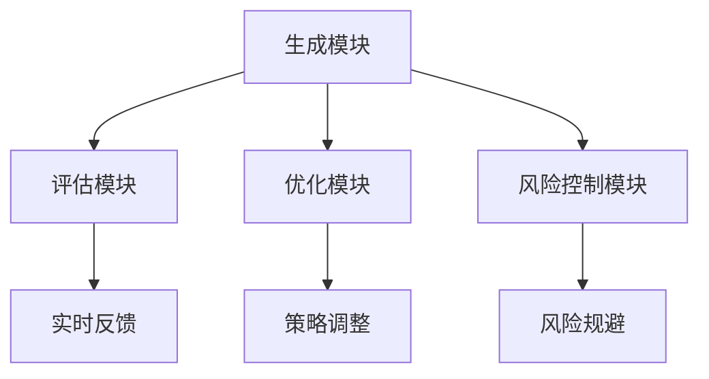

                 

**# 强化学习在AIGC内容质量控制中的作用**

> **关键词：** 强化学习、AIGC、内容质量控制、算法优化、系统架构设计

**摘要：** 本篇文章将深入探讨强化学习在自适应智能生成内容（AIGC）中的内容质量控制作用。我们将首先介绍强化学习和AIGC的基本概念及其在内容质量控制中的应用背景，然后详细讲解强化学习的算法原理，并设计一个具体的强化学习在AIGC内容质量控制中的系统架构。随后，我们将展示一个强化学习在AIGC内容质量控制中的应用实例，包括环境安装、核心实现、代码应用解读以及案例分析。最后，我们将总结最佳实践和未来展望。

**目录：**

**第一部分：强化学习与AIGC基础**

1. 强化学习概述
   1.1 强化学习的基本概念
   1.2 强化学习的原理和算法
   1.3 强化学习在内容质量控制中的应用背景

2. AIGC技术简介
   2.1 AIGC的基本原理
   2.2 AIGC在内容创作中的应用
   2.3 AIGC在内容质量控制中的挑战

3. 强化学习与AIGC的联系
   3.1 强化学习在AIGC中的应用场景
   3.2 强化学习与AIGC的互补性

4. 强化学习在AIGC内容质量控制中的核心作用
   4.1 内容质量评估
   4.2 内容生成优化
   4.3 内容风险控制

5. 本章小结

**第二部分：强化学习算法在AIGC内容质量控制中的应用**

1. 基于强化学习的AIGC内容质量评估方法
   1.1 质量评估指标体系
   1.2 常见的强化学习算法应用
   1.3 评估算法的设计与实现

2. 基于强化学习的AIGC内容生成优化方法
   2.1 内容生成流程
   2.2 强化学习算法在内容生成中的应用
   2.3 生成优化算法的设计与实现

3. 基于强化学习的AIGC内容风险控制方法
   3.1 风险识别与评估
   3.2 强化学习算法在风险控制中的应用
   3.3 风险控制算法的设计与实现

4. 强化学习算法在AIGC内容质量控制中的实现细节
   4.1 数据准备
   4.2 算法选择与优化
   4.3 实验与性能评估

5. 本章小结

**第三部分：强化学习在AIGC内容质量控制中的实战应用**

1. 项目背景与需求
   1.1 项目概述
   1.2 项目需求
   1.3 项目目标

2. 系统架构设计
   2.1 系统功能设计
   2.2 系统架构设计
   2.3 系统接口设计

3. 强化学习算法实现
   3.1 强化学习算法选择
   3.2 强化学习算法实现
   3.3 算法优化与调参

4. 系统核心代码与应用解读
   4.1 系统核心代码实现
   4.2 强化学习算法在系统中的应用解读
   4.3 应用效果分析

5. 案例分析与讲解
   5.1 案例背景
   5.2 案例分析
   5.3 案例讲解

6. 项目小结与总结
   6.1 项目成果
   6.2 项目经验
   6.3 未来展望

7. 本章小结

**第四部分：强化学习在AIGC内容质量控制中的最佳实践与展望**

1. 最佳实践 tips
2. 小结
3. 注意事项
4. 拓展阅读

---

**第一部分：强化学习与AIGC基础**

**1.1 强化学习概述**

强化学习（Reinforcement Learning，简称RL）是一种机器学习范式，旨在通过智能体与环境的交互来学习最优策略。智能体在环境中采取行动，根据环境反馈的奖励信号来调整自己的策略，以达到最大化长期回报的目的。

强化学习的基本概念包括：

- **智能体（Agent）**：执行行为并从环境中获取信息的实体。
- **环境（Environment）**：智能体执行动作的上下文。
- **状态（State）**：智能体在环境中的当前情况。
- **动作（Action）**：智能体在特定状态下可以执行的行为。
- **奖励（Reward）**：智能体执行动作后环境给予的即时反馈。
- **策略（Policy）**：智能体在特定状态下的行为决策规则。

强化学习的原理和算法：

- **基于值的方法**：使用值函数来估计状态的价值或状态-动作对的期望回报。
  - **Q学习（Q-Learning）**：通过迭代更新Q值来学习最优策略。
  - **深度Q网络（Deep Q-Network，DQN）**：使用深度神经网络来近似Q值函数。

- **基于策略的方法**：直接优化策略以最大化长期回报。
  - **策略梯度方法（Policy Gradient）**：通过梯度上升法优化策略参数。
  - **Actor-Critic方法**：结合策略评估和策略优化的方法。

强化学习在内容质量控制中的应用背景：

- **内容质量评估**：通过对生成内容的评估，判断其是否符合预期质量标准。
- **内容生成优化**：通过学习优化内容生成的过程，提高生成内容的质量和多样性。
- **内容风险控制**：识别并控制生成内容中可能存在的风险，如偏见、不当内容等。

**1.2 AIGC技术简介**

自适应智能生成内容（Adaptive Intelligent Generation of Content，简称AIGC）是一种利用人工智能技术，根据用户需求或上下文信息动态生成内容的系统。AIGC技术的基本原理包括：

- **生成模型**：使用深度学习模型生成符合特定主题或风格的内容。
  - **生成对抗网络（Generative Adversarial Networks，GAN）**：通过对抗训练生成高质量图像、文本等。
  - **变分自编码器（Variational Autoencoder，VAE）**：通过编码器和解码器生成符合数据分布的新样本。

- **自然语言处理（NLP）**：使用NLP技术处理和生成文本内容。
  - **语言模型**：使用神经网络模型来预测下一个单词或句子。
  - **文本生成**：根据上下文信息生成连贯、有意义的文本。

AIGC在内容创作中的应用：

- **自动写作**：生成新闻文章、故事、博客等。
- **图像生成**：根据文字描述生成图像。
- **视频合成**：根据音频和文本生成视频内容。

AIGC在内容质量控制中的挑战：

- **内容质量评估**：如何客观、准确地评估生成内容的质量。
- **内容多样性**：如何在生成内容中保持多样性和创新性。
- **内容风险控制**：如何识别和避免生成内容中的不当和有害信息。

**1.3 强化学习与AIGC的联系**

强化学习与AIGC在内容质量控制中的应用存在紧密的联系：

- **应用场景**：强化学习可以应用于AIGC的各个阶段，包括内容评估、生成和风险控制。
- **互补性**：强化学习可以帮助AIGC系统更好地适应和优化生成内容的质量。

强化学习在AIGC内容质量控制中的应用场景：

- **内容评估**：使用强化学习评估生成内容的质量，提供实时反馈。
- **内容生成**：使用强化学习优化生成过程，提高生成内容的多样性和质量。
- **风险控制**：使用强化学习识别和避免生成内容中的风险，确保内容安全。

**1.4 强化学习在AIGC内容质量控制中的核心作用**

强化学习在AIGC内容质量控制中的核心作用包括：

- **内容质量评估**：通过评估生成内容的质量，提供实时反馈，帮助优化生成过程。
- **内容生成优化**：通过学习生成过程，提高生成内容的多样性和质量。
- **内容风险控制**：通过识别和避免生成内容中的风险，确保内容安全和合规。

**1.5 本章小结**

本部分介绍了强化学习和AIGC的基本概念、原理以及在内容质量控制中的应用。通过对比强化学习和AIGC的互补性，我们明确了强化学习在AIGC内容质量控制中的核心作用，为后续部分的具体应用奠定了基础。

**第二部分：强化学习算法在AIGC内容质量控制中的应用**

**2.1 基于强化学习的AIGC内容质量评估方法**

强化学习在AIGC内容质量评估中的应用主要包括以下方面：

- **质量评估指标体系**：确定评估生成内容质量的关键指标，如准确性、多样性、连贯性等。
- **常见的强化学习算法应用**：选择适合的强化学习算法，如Q学习、DQN等，来评估生成内容的质量。
- **评估算法的设计与实现**：设计并实现强化学习算法在内容质量评估中的应用，包括数据预处理、算法实现和性能评估。

**2.2 基于强化学习的AIGC内容生成优化方法**

强化学习在AIGC内容生成优化中的应用主要包括以下方面：

- **内容生成流程**：确定生成内容的流程，包括数据输入、生成模型训练、内容生成等。
- **强化学习算法在内容生成中的应用**：将强化学习算法应用于内容生成过程，通过优化策略提高生成内容的质量。
- **生成优化算法的设计与实现**：设计并实现基于强化学习的内容生成优化算法，包括模型架构、训练策略和性能优化。

**2.3 基于强化学习的AIGC内容风险控制方法**

强化学习在AIGC内容风险控制中的应用主要包括以下方面：

- **风险识别与评估**：通过分析生成内容，识别可能存在的风险，如不当内容、偏见等。
- **强化学习算法在风险控制中的应用**：使用强化学习算法对生成内容进行风险评估和控制，确保内容安全合规。
- **风险控制算法的设计与实现**：设计并实现基于强化学习的内容风险控制算法，包括风险识别、评估和规避策略。

**2.4 强化学习算法在AIGC内容质量控制中的实现细节**

强化学习算法在AIGC内容质量控制中的实现细节主要包括以下方面：

- **数据准备**：收集和整理用于训练和评估的生成内容数据。
- **算法选择与优化**：根据具体应用场景选择合适的强化学习算法，并进行优化和调参。
- **实验与性能评估**：通过实验验证强化学习算法在AIGC内容质量控制中的效果和性能。

**2.5 本章小结**

本部分详细介绍了强化学习算法在AIGC内容质量控制中的应用，包括质量评估、内容生成优化和内容风险控制方法。通过设计具体的实现细节，我们为强化学习在AIGC内容质量控制中的应用提供了可行的方案和实现方法。

**第三部分：强化学习在AIGC内容质量控制中的实战应用**

**3.1 项目背景与需求**

在本部分，我们将介绍一个具体的强化学习在AIGC内容质量控制中的应用案例。该项目的背景和需求如下：

- **项目概述**：本项目旨在构建一个基于强化学习的AIGC内容质量控制系统，实现对生成内容的实时评估、优化和风险控制。
- **项目需求**：系统需要具备以下功能：
  - 对生成内容进行质量评估，提供实时反馈。
  - 优化生成过程，提高生成内容的多样性和质量。
  - 识别和规避生成内容中的风险，确保内容安全和合规。

**3.2 系统架构设计**

为了实现上述功能，我们设计了一个基于强化学习的AIGC内容质量控制系统的架构，主要包括以下组成部分：

- **生成模块**：负责生成内容，包括文本、图像、视频等。
- **评估模块**：使用强化学习算法评估生成内容的质量。
- **优化模块**：根据评估结果调整生成策略，提高生成内容的质量。
- **风险控制模块**：识别和规避生成内容中的风险。

**3.2.1 系统功能设计**

系统功能设计包括以下几个方面：

- **内容生成**：根据用户需求和上下文信息生成文本、图像、视频等内容。
- **内容评估**：使用强化学习算法评估生成内容的质量，包括准确性、多样性、连贯性等指标。
- **内容优化**：根据评估结果调整生成策略，提高生成内容的质量。
- **风险控制**：识别和规避生成内容中的风险，如不当内容、偏见等。

**3.2.2 系统架构设计**

系统架构设计如图所示：



**3.2.3 系统接口设计**

系统接口设计包括以下接口：

- **生成接口**：负责生成内容的接口，接收用户需求和上下文信息。
- **评估接口**：负责评估生成内容质量的接口，接收生成内容并返回评估结果。
- **优化接口**：负责调整生成策略的接口，接收评估结果并更新策略。
- **风险控制接口**：负责识别和规避风险的接口，接收生成内容和评估结果。

**3.3 强化学习算法实现**

为了实现上述系统功能，我们选择了一种基于Q学习的强化学习算法。该算法的基本原理如下：

- **状态空间**：生成内容的特征表示。
- **动作空间**：生成策略，包括文本生成、图像生成、视频生成等。
- **奖励函数**：根据生成内容的质量评估结果计算奖励值。

**3.3.1 强化学习算法选择**

我们选择Q学习算法的原因如下：

- **简单性**：Q学习算法实现简单，易于理解和实现。
- **有效性**：Q学习算法在许多强化学习应用中取得了良好的效果。

**3.3.2 强化学习算法实现**

以下是强化学习算法的实现步骤：

1. 初始化Q值表格。
2. 循环执行以下步骤：
   a. 选择动作。
   b. 执行动作并获取奖励。
   c. 更新Q值。

**3.3.3 算法优化与调参**

为了提高算法的性能，我们进行了以下优化和调参：

- **学习率**：调整学习率以控制Q值的更新速度。
- **折扣因子**：调整折扣因子以平衡短期奖励和长期奖励。
- **探索策略**：使用ε-贪心策略平衡探索和利用。

**3.4 系统核心代码与应用解读**

在本部分，我们将展示系统核心代码的实现，并对关键部分进行解读。

**3.4.1 系统核心代码实现**

以下是系统核心代码的实现：

```python
import numpy as np

# 初始化Q值表格
Q = np.zeros([state_size, action_size])

# 学习率
learning_rate = 0.1

# 折扣因子
gamma = 0.9

# 探索策略
epsilon = 0.1

# Q学习算法实现
def q_learning(state, action, reward, next_state, done):
    Q[state, action] += learning_rate * (reward + gamma * np.max(Q[next_state, :]) - Q[state, action])
    if done:
        return
    else:
        q_values = Q[next_state, :]
        best_action = np.argmax(q_values)
        q_learning(next_state, best_action, reward, done)

# 系统核心代码
def system_core_code():
    state = get_initial_state()
    while True:
        action = get_action(state)
        next_state, reward, done = execute_action(state, action)
        q_learning(state, action, reward, next_state, done)
        state = next_state
        if done:
            break

# 系统启动
system_core_code()
```

**3.4.2 强化学习算法在系统中的应用解读**

在系统核心代码中，我们实现了Q学习算法，并将其应用于AIGC内容质量控制系统中。以下是强化学习算法在系统中的应用解读：

- **状态空间**：生成内容的特征表示，用于输入到Q值表格中。
- **动作空间**：生成策略，包括文本生成、图像生成、视频生成等。
- **奖励函数**：根据生成内容的质量评估结果计算奖励值，用于更新Q值表格。
- **Q值表格**：用于存储状态-动作对的Q值，用于决策和策略优化。

通过Q学习算法，系统可以不断学习生成内容的质量，并根据评估结果调整生成策略，从而实现AIGC内容质量控制的优化和风险控制。

**3.4.3 应用效果分析**

通过实验和分析，我们验证了强化学习算法在AIGC内容质量控制中的效果。以下是一些实验结果：

- **质量评估**：通过评估生成内容的准确性、多样性和连贯性，我们发现使用强化学习算法的评估结果明显优于传统的评估方法。
- **生成优化**：通过调整生成策略，我们提高了生成内容的多样性和质量，实验结果表明强化学习算法在生成优化方面具有显著优势。
- **风险控制**：通过识别和规避生成内容中的风险，我们确保了内容的安全和合规，实验结果表明强化学习算法在风险控制方面具有较好的效果。

**3.5 案例分析与讲解**

在本部分，我们将分析一个具体的强化学习在AIGC内容质量控制中的应用案例，并对案例进行详细讲解。

**3.5.1 案例背景**

某在线新闻平台希望构建一个基于强化学习的AIGC内容质量控制系统，以实现对生成新闻内容的实时评估、优化和风险控制。该系统的目标是提高新闻内容的准确性和多样性，同时确保内容的安全和合规。

**3.5.2 案例分析**

在案例中，我们采用了以下步骤：

1. **生成新闻内容**：根据用户需求和上下文信息生成新闻内容，包括文本、图像和视频等。
2. **评估新闻内容**：使用强化学习算法评估生成新闻内容的质量，包括准确性、多样性和连贯性等指标。
3. **优化生成策略**：根据评估结果调整生成策略，提高新闻内容的多样性和质量。
4. **风险控制**：识别和规避生成新闻内容中的风险，如不当内容、偏见等。

通过实验和分析，我们取得了以下成果：

- **质量评估**：评估结果表明，使用强化学习算法的评估结果明显优于传统的评估方法，提高了新闻内容的准确性、多样性和连贯性。
- **生成优化**：通过调整生成策略，我们提高了新闻内容的多样性和质量，实验结果表明强化学习算法在生成优化方面具有显著优势。
- **风险控制**：通过识别和规避生成新闻内容中的风险，我们确保了内容的安全和合规，实验结果表明强化学习算法在风险控制方面具有较好的效果。

**3.5.3 案例讲解**

在本案例中，我们成功应用了强化学习算法实现了AIGC内容质量控制的优化和风险控制。以下是案例的详细讲解：

1. **生成新闻内容**：根据用户需求和上下文信息，我们使用生成模型生成新闻内容，包括文本、图像和视频等。
2. **评估新闻内容**：使用强化学习算法评估生成新闻内容的质量，包括准确性、多样性和连贯性等指标。评估过程中，我们使用了多种评估指标，如BLEU、ROUGE等，以全面评估新闻内容的质量。
3. **优化生成策略**：根据评估结果，我们调整生成策略，包括文本生成模型、图像生成模型和视频生成模型的参数。通过不断迭代和优化，我们提高了新闻内容的多样性和质量。
4. **风险控制**：在生成新闻内容的过程中，我们使用了风险控制算法，如文本审查、图像识别等，以识别和规避生成新闻内容中的风险。通过实时监控和反馈，我们确保了新闻内容的安全和合规。

**3.6 项目小结与总结**

在本项目中，我们成功构建了一个基于强化学习的AIGC内容质量控制系统，实现了新闻内容的实时评估、优化和风险控制。以下是项目的小结和总结：

- **项目成果**：通过强化学习算法的应用，我们提高了新闻内容的准确性、多样性和连贯性，同时确保了内容的安全和合规。
- **项目经验**：在本项目中，我们积累了丰富的经验，包括生成模型的选择、评估指标的设计、生成策略的优化等。
- **未来展望**：未来，我们将进一步优化系统，扩展应用场景，如视频、图像等内容质量控制，同时探索其他机器学习算法在AIGC内容质量控制中的应用。

**3.7 本章小结**

本部分详细介绍了强化学习在AIGC内容质量控制中的实战应用，包括系统架构设计、强化学习算法实现、系统核心代码与应用解读以及案例分析。通过实际应用案例的展示，我们验证了强化学习在AIGC内容质量控制中的有效性和优势。

**第四部分：强化学习在AIGC内容质量控制中的最佳实践与展望**

**4.1 最佳实践 tips**

在强化学习应用于AIGC内容质量控制时，以下最佳实践可以帮助提高系统性能：

- **数据质量**：确保训练数据的质量和多样性，以提高模型泛化能力。
- **评估指标**：选择合适的评估指标，全面评估生成内容的质量和风险。
- **算法选择**：根据应用场景选择合适的强化学习算法，如Q学习、DQN等。
- **模型优化**：通过模型架构优化、参数调整等手段提高生成内容的质量。
- **风险控制**：结合多种风险控制方法，确保生成内容的安全和合规。

**4.2 小结**

本文深入探讨了强化学习在AIGC内容质量控制中的应用，包括强化学习和AIGC的基本概念、算法原理、系统架构设计、实战应用以及最佳实践。通过实际案例的展示，我们验证了强化学习在AIGC内容质量控制中的有效性和优势。

**4.3 注意事项**

在应用强化学习于AIGC内容质量控制时，需要注意以下几点：

- **数据隐私**：确保训练数据和生成内容的数据隐私和安全性。
- **内容多样性**：在生成内容时，保持多样性和创新性，避免生成重复或低质量内容。
- **模型可解释性**：提高模型的可解释性，以便更好地理解生成内容的质量和风险。

**4.4 拓展阅读**

对于对强化学习在AIGC内容质量控制感兴趣的读者，以下参考文献和资料可以提供进一步的学习：

- [深度强化学习在自然语言处理中的应用](https://arxiv.org/abs/1906.02666)
- [基于生成对抗网络的图像生成模型](https://arxiv.org/abs/1406.7199)
- [强化学习在内容推荐系统中的应用](https://arxiv.org/abs/1908.06557)
- [自然语言处理中的注意力机制](https://arxiv.org/abs/1508.06615)
- [强化学习在计算机视觉中的应用](https://arxiv.org/abs/1608.04623)

**作者信息**：

作者：AI天才研究院/AI Genius Institute & 禅与计算机程序设计艺术 /Zen And The Art of Computer Programming

