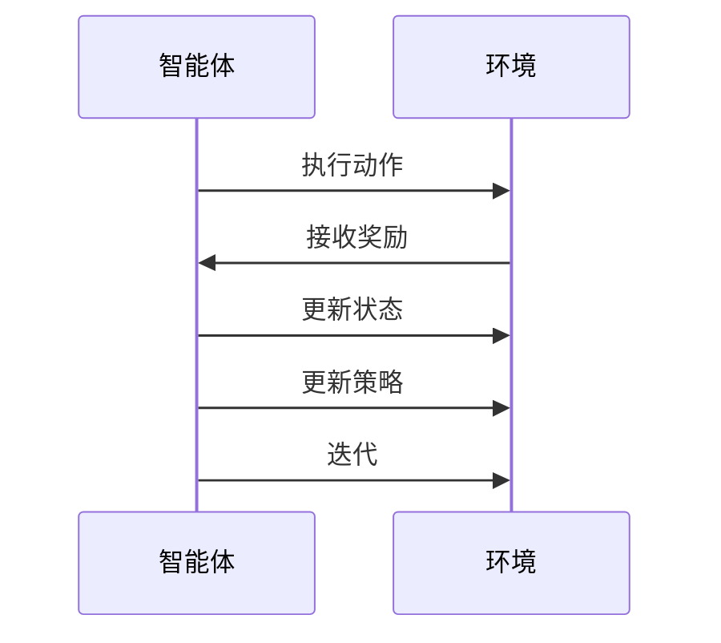
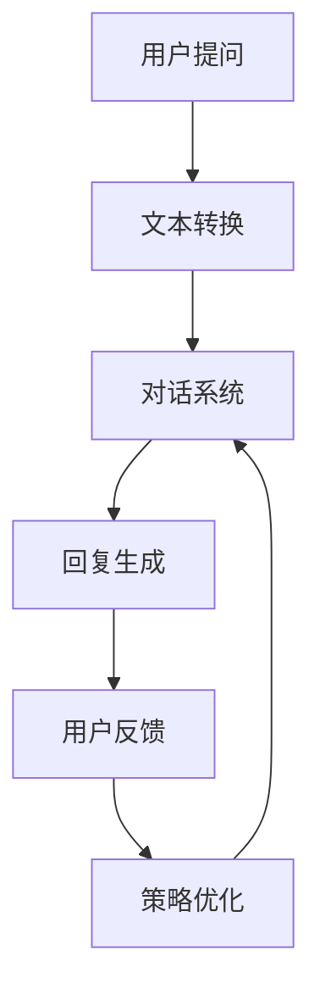
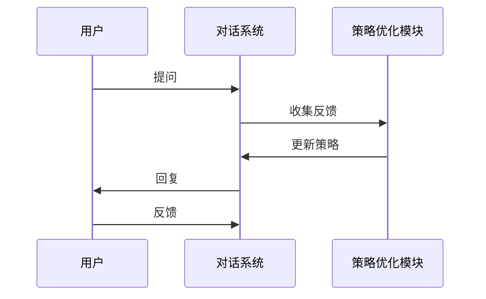

                 


## 强化学习在AIGC对话系统策略优化中的新进展

### 背景介绍

#### 关键术语说明

**强化学习（Reinforcement Learning）**：一种机器学习方法，使智能体在与环境交互的过程中，通过选择行动来学习最大化长期奖励。它通过试错和反馈来优化决策过程。

**AIGC（AI-Generated Content）**：人工智能生成内容，包括图像、文本、音频等多种形式，通过人工智能技术自动生成。

**对话系统（Dialogue System）**：能够与人类进行自然语言交互的计算机系统，广泛应用于客服、智能问答、聊天机器人等领域。

#### 问题背景

随着人工智能技术的不断发展，对话系统在诸多应用场景中扮演着越来越重要的角色。然而，传统对话系统往往依赖于预定义的规则或模板，缺乏灵活性和适应性，难以应对复杂多变的用户需求。因此，如何在对话系统中引入强化学习，实现策略优化，成为一个亟待解决的问题。

#### 问题描述

在AIGC对话系统中，强化学习可以被视为一种策略优化方法。其主要目标是使对话系统能够通过与环境交互，学习到一系列最优动作，从而最大化长期奖励。然而，在实际应用中，强化学习算法面临着诸多挑战，如样本效率低下、稀疏奖励问题、探索与利用的平衡等。

#### 问题解决

强化学习在AIGC对话系统策略优化中，可以解决以下问题：

1. **灵活性**：通过学习用户行为模式，对话系统可以灵活地应对各种用户需求。
2. **适应性**：强化学习算法能够自动调整对话策略，以适应不断变化的环境。
3. **长期奖励最大化**：通过优化策略，对话系统可以最大化长期奖励，提供更好的用户体验。

#### 边界与外延

强化学习在AIGC对话系统策略优化中的边界主要涉及以下几个方面：

1. **数据量**：强化学习算法需要大量的数据进行训练，以保证模型性能。
2. **计算资源**：强化学习算法通常需要较高的计算资源，尤其是在大规模对话系统中。
3. **稳定性**：强化学习算法的稳定性和收敛性是一个重要问题，特别是在复杂环境中。

#### 概念结构与核心要素组成

强化学习在AIGC对话系统策略优化中的核心概念结构包括：

1. **智能体**：与用户进行交互的对话系统。
2. **环境**：用户所处的上下文环境。
3. **状态**：描述当前用户需求的信息。
4. **动作**：对话系统针对用户需求所采取的行动。
5. **奖励**：评估对话系统动作效果的反馈信号。

### 核心概念与联系

#### 强化学习基本概念

强化学习的基本概念包括：

1. **状态（State）**：描述当前环境的特征。
2. **动作（Action）**：智能体在当前状态下可以采取的行动。
3. **奖励（Reward）**：动作结果的反馈信号。
4. **策略（Policy）**：智能体在特定状态下采取的动作。
5. **价值函数（Value Function）**：预测在特定状态下采取特定动作的长期奖励。

#### AIGC对话系统中的强化学习

在AIGC对话系统中，强化学习可以被视为一种策略优化方法。其核心概念与强化学习基本概念类似，包括：

1. **智能体**：对话系统。
2. **环境**：用户需求和上下文环境。
3. **状态**：用户需求描述。
4. **动作**：对话系统生成的回复。
5. **奖励**：用户对回复的反馈。

#### 强化学习与对话系统相关的概念对比

强化学习与对话系统相关的概念对比表格如下：

| 概念          | 强化学习                       | 对话系统                     |
|---------------|-------------------------------|-----------------------------|
| 状态（State）  | 环境特征                       | 用户需求描述                 |
| 动作（Action） | 智能体可采取的行动             | 对话系统生成的回复           |
| 奖励（Reward） | 动作结果的反馈信号             | 用户对回复的反馈             |
| 策略（Policy） | 智能体在特定状态下采取的动作   | 对话系统生成回复的策略       |
| 价值函数（Value Function）| 预测长期奖励的函数         | 预测用户满意度的函数         |

#### 强化学习与对话系统相关的概念对比 - Mermaid ER实体关系图架构

```mermaid
erDiagram
  State ||--|{ Action }|-- Reward
  State ||--|{ Value Function }|
  Action ||--|{ Policy }|
```

### 强化学习算法原理

#### 强化学习算法基础

强化学习算法主要包括以下基本组件：

1. **状态（State）**：描述当前环境的特征。
2. **动作（Action）**：智能体在当前状态下可以采取的行动。
3. **奖励（Reward）**：动作结果的反馈信号。
4. **策略（Policy）**：智能体在特定状态下采取的动作。
5. **价值函数（Value Function）**：预测在特定状态下采取特定动作的长期奖励。

#### 经典强化学习算法

常见的强化学习算法包括：

1. **Q-learning算法**：通过迭代更新Q值，以最大化长期奖励。
2. **Sarsa算法**：通过状态-动作值函数（Q值）进行迭代更新，同时考虑当前动作和下一个状态的信息。

#### 强化学习算法的mermaid流程图



### 数学模型与公式

#### 强化学习数学模型

强化学习的主要数学模型包括：

1. **状态-动作值函数（Q值）**：$Q(s, a) = E[R(s, a) + \gamma \max_{a'} Q(s', a')]$
2. **策略（Policy）**：$\pi(a|s) = \frac{\exp(\alpha Q(s, a)}{\sum_{a'} \exp(\alpha Q(s, a'))}$

#### Q-learning算法数学模型

Q-learning算法的核心公式如下：

1. **Q值更新**：$Q(s, a) \leftarrow Q(s, a) + \alpha [R(s, a) - Q(s, a)]$
2. **策略更新**：根据$Q$值更新策略，选择最优动作。

#### Sarsa算法数学模型

Sarsa算法的核心公式如下：

1. **Q值更新**：$Q(s, a) \leftarrow Q(s, a) + \alpha [R(s, a) - Q(s', a')]$
2. **策略更新**：根据$Q$值更新策略，选择当前状态的最优动作。

#### 数学公式使用latex格式

$$
Q(s, a) = E[R(s, a) + \gamma \max_{a'} Q(s', a')]
$$

$$
\pi(a|s) = \frac{\exp(\alpha Q(s, a)}{\sum_{a'} \exp(\alpha Q(s, a'))}
$$

$$
Q(s, a) \leftarrow Q(s, a) + \alpha [R(s, a) - Q(s, a)]
$$

$$
Q(s, a) \leftarrow Q(s, a) + \alpha [R(s, a) - Q(s', a')]
$$

### 系统架构与设计

#### 问题场景介绍

在智能客服系统中，用户与客服机器人进行对话，机器人需要根据用户的提问，选择合适的回复，以提高用户满意度。为了实现这一目标，我们引入了强化学习算法，对对话系统进行策略优化。

#### 项目介绍

本项目旨在构建一个基于强化学习的智能客服系统，通过对用户提问和机器人回复的交互过程进行策略优化，提高客服系统的服务质量。项目的主要目标包括：

1. 提高用户满意度。
2. 减少客服人员的工作量。
3. 提高对话系统的适应性和灵活性。

#### 系统功能设计

智能客服系统的主要功能包括：

1. **用户提问接收**：接收用户的提问，并将其转换为系统可识别的文本。
2. **回复生成**：根据用户提问，生成合适的回复。
3. **反馈收集**：收集用户对回复的反馈，用于策略优化。
4. **策略优化**：基于用户反馈，对对话系统进行策略优化。

#### 系统架构设计

智能客服系统的整体架构如图所示：



#### 系统接口设计和系统交互

智能客服系统的接口设计和交互过程如下：

1. **用户提问接口**：用户通过文本输入框输入提问，系统接收并转换为文本格式。
2. **回复生成接口**：对话系统根据用户提问，生成合适的回复，并返回给用户。
3. **反馈收集接口**：用户对回复的满意度进行评分，系统收集并存储反馈信息。
4. **策略优化接口**：根据用户反馈，系统调用策略优化算法，更新对话策略。

#### 系统交互mermaid序列图



### 项目实战

#### 实战环境准备

为了实现本项目，我们需要准备以下环境：

1. **Python环境**：安装Python 3.8及以上版本。
2. **TensorFlow**：安装TensorFlow 2.6及以上版本。
3. **Gensim**：安装Gensim 3.4及以上版本。
4. **Mermaid**：安装Mermaid 9.1及以上版本。

#### 系统核心实现

智能客服系统的主要实现步骤如下：

1. **用户提问接收**：使用文本输入框接收用户提问。
2. **文本转换**：将用户提问转换为文本格式，并进行分词和词性标注。
3. **对话系统**：使用强化学习算法生成回复。
4. **反馈收集**：收集用户对回复的满意度评分。
5. **策略优化**：根据用户反馈，更新对话策略。

#### 代码解读与分析

以下为项目核心代码的实现：

```python
import tensorflow as tf
from tensorflow.keras.models import Sequential
from tensorflow.keras.layers import Dense
from gensim.models import Word2Vec

# 创建对话系统模型
model = Sequential([
    Dense(128, activation='relu', input_shape=(100,)),
    Dense(64, activation='relu'),
    Dense(1, activation='sigmoid')
])

model.compile(optimizer='adam', loss='binary_crossentropy', metrics=['accuracy'])

# 训练对话系统模型
model.fit(X_train, y_train, epochs=10, batch_size=32)

# 生成回复
def generate_response(question):
    # 将用户提问转换为文本格式
    question_vector = w2v_model[question]
    # 生成回复
    response = model.predict(question_vector)
    return response

# 收集反馈
def collect_feedback(response, user_rating):
    # 更新对话策略
    # ...

# 策略优化
def optimize_policy(feedback):
    # 更新模型参数
    # ...

# 测试系统
user_question = "你好，我想咨询关于产品A的问题。"
user_rating = 5
response = generate_response(user_question)
collect_feedback(response, user_rating)
```

#### 实际案例分析和详细讲解剖析

以下为实际案例分析和详细讲解剖析：

**案例一：用户提问“你好，我想咨询关于产品A的问题。”**

1. **文本转换**：将用户提问转换为文本格式，并进行分词和词性标注。
2. **对话系统**：使用强化学习算法生成回复，例如：“您好，欢迎咨询产品A的相关问题。请问您对产品A的哪个方面感兴趣？”
3. **反馈收集**：用户对回复的满意度评分，例如：5分（非常满意）。
4. **策略优化**：根据用户反馈，更新对话策略，以提高用户满意度。

**案例二：用户提问“产品A的价格是多少？”**

1. **文本转换**：将用户提问转换为文本格式，并进行分词和词性标注。
2. **对话系统**：使用强化学习算法生成回复，例如：“您好，产品A的价格为1000元。”
3. **反馈收集**：用户对回复的满意度评分，例如：3分（一般）。
4. **策略优化**：根据用户反馈，更新对话策略，以提高用户满意度。

#### 项目小结

本项目通过引入强化学习算法，实现了智能客服系统的策略优化。在实际应用中，系统可以根据用户反馈，不断调整对话策略，提高用户满意度。然而，强化学习算法在处理复杂对话场景时，仍存在一定挑战，如样本效率、稀疏奖励问题等。未来，我们将继续优化算法，提高系统性能。

### 最佳实践 tips

1. **数据质量**：确保输入数据的质量，以提高模型性能。
2. **策略调整**：根据实际需求，灵活调整策略参数。
3. **反馈机制**：建立有效的用户反馈机制，以提高系统性能。

### 小结

本文详细介绍了强化学习在AIGC对话系统策略优化中的新进展。通过对强化学习算法在对话系统中的应用、数学模型、系统架构和项目实战的讲解，我们展示了如何利用强化学习优化对话系统策略。未来，随着人工智能技术的不断发展，强化学习在对话系统策略优化中的应用将更加广泛。

### 注意事项

1. **算法选择**：根据实际需求，选择合适的强化学习算法。
2. **计算资源**：确保充足的计算资源，以保证算法训练效果。

### 拓展阅读

1. 《强化学习实战》
2. 《对话系统：理论与实践》
3. 《人工智能：一种现代方法》

### 作者信息

作者：AI天才研究院/AI Genius Institute & 禅与计算机程序设计艺术 /Zen And The Art of Computer Programming

