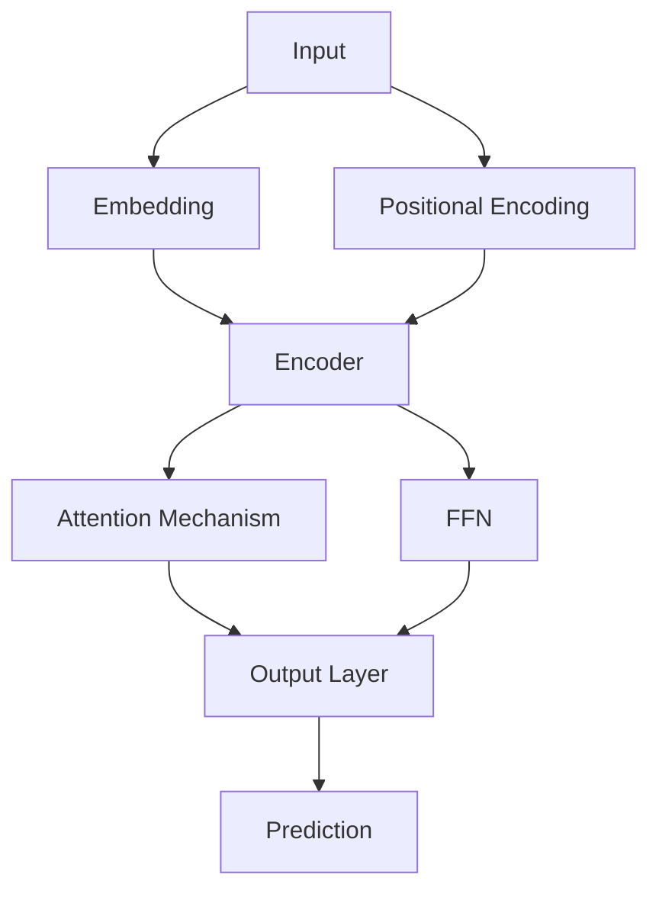

                 

# 快速响应市场变化：LLM应用的竞争优势

> 关键词：市场变化、LLM、自然语言处理、文本生成、竞争优势

> 摘要：本文将探讨在快速响应市场变化的过程中，大型语言模型（LLM）的应用如何为企业带来竞争优势。通过对LLM的基本概念、原理、应用场景以及实际业务案例的深入分析，文章将揭示LLM在提升企业灵活性和创新能力方面的潜在价值。

## 引言

在当今全球化的商业环境中，企业面临的市场变化速度前所未有。消费者行为、市场趋势和竞争策略都在快速演变，企业必须具备迅速适应和响应这些变化的能力。为了在这个动态的市场中保持竞争力，企业需要寻找创新的技术解决方案，以提高市场响应速度、优化业务流程和增强客户体验。本文将重点讨论大型语言模型（LLM）在这一过程中的应用及其竞争优势。

### 第一部分: 引言

## 第1章：问题背景

### 1.1. 时代背景：市场变化趋势

当前的市场环境充满了不确定性。随着互联网和移动设备的普及，消费者能够更快地获取信息和商品选择，他们的需求变得更加多样化和个性化。此外，全球化带来了更多的竞争者，市场上的新兴公司以创新的商业模式和产品迅速崛起，迫使传统企业不断调整战略以保持市场地位。

### 1.2. 问题描述：企业面临的挑战

在这种快速变化的市场环境中，企业面临以下挑战：

- **市场需求的快速变化**：消费者需求不断变化，企业需要迅速调整产品和服务以满足这些需求。
- **竞争压力**：市场上的竞争日益激烈，企业需要持续创新以保持领先地位。
- **成本控制**：在市场竞争中，企业必须降低成本，提高效率，以保持盈利。

### 1.3. 问题解决：LLM的作用

LLM作为一种强大的自然语言处理技术，可以帮助企业解决上述问题。它具有以下作用：

- **文本生成**：LLM能够快速生成各种文本内容，如产品描述、营销文案等，帮助企业迅速响应市场需求。
- **自然语言理解**：LLM可以分析大量文本数据，提取关键信息，为企业提供决策支持。
- **自动化客户服务**：通过聊天机器人等技术，LLM可以提供高效、自动化的客户服务，提高客户满意度。

### 1.4. 边界与外延：LLM的应用领域

LLM的应用领域非常广泛，包括但不限于以下行业：

- **电子商务**：用于产品推荐、商品搜索优化等。
- **金融行业**：用于风险评估、投资建议等。
- **医疗健康**：用于病历分析、疾病预测等。
- **教育领域**：用于自动批改作业、智能问答等。

### 1.5. 核心概念：LLM的原理与分类

LLM的核心原理是通过大量文本数据的训练，建立语言模型，以实现文本生成、理解和分析。根据训练数据和模型结构的不同，LLM可以分为以下几类：

- **生成式模型**：如生成式对抗网络（GAN）。
- **解码器-编码器模型**：如BERT、GPT等。
- **自回归模型**：如Transformer。

## 第二部分: LLM基础理论

### 第2章：核心概念与联系

### 2.1. LLM的定义与特点

LLM（Large Language Model）是一种基于深度学习的自然语言处理模型，其特点包括：

- **参数规模巨大**：LLM的训练参数数量通常在数十亿到千亿级别。
- **文本生成能力强**：LLM可以生成各种类型的文本内容，如文章、对话等。
- **理解与解释能力强**：LLM可以对文本进行深入的理解和解释。

### 2.2. LLM的原理解析

LLM的训练过程主要包括以下步骤：

- **数据收集与预处理**：收集大量的文本数据，并进行预处理，如分词、去噪等。
- **模型训练**：使用预处理的文本数据，对LLM进行训练。
- **模型评估与优化**：评估模型的性能，并进行优化。

### 2.3. LLM的分类与比较

LLM可以分为以下几类：

- **生成式模型**：如生成式对抗网络（GAN）。
- **解码器-编码器模型**：如BERT、GPT等。
- **自回归模型**：如Transformer。

## 第三部分: LLM应用场景

### 第3章：文本生成

### 3.1. 文本生成概述

文本生成是LLM的重要应用之一，它可以生成各种文本内容，如文章、新闻、对话等。文本生成技术可以帮助企业快速创建内容，提高工作效率。

### 3.2. 生成式对抗网络（GAN）

生成式对抗网络（GAN）是一种基于博弈理论的生成模型。它由生成器和判别器组成，生成器生成数据，判别器判断生成数据是否真实。通过不断训练，生成器可以生成越来越逼真的数据。

### 3.3. 文本生成模型原理

文本生成模型通常基于自回归模型，如Transformer。自回归模型通过预测下一个单词或字符来生成文本。模型的输入是前面的文本序列，输出是下一个单词或字符。

### 3.4. 文本生成案例解析

一个文本生成的案例是生成新闻文章。企业可以使用LLM生成新闻文章，以快速响应市场事件，提高内容营销的效果。

## 第四部分: LLM在实际业务中的应用

### 第4章：电商行业

### 5.1. 电商行业概述

电商行业是一个快速发展的行业，企业需要不断适应市场的变化。LLM在电商行业的应用可以帮助企业提高市场响应速度和客户满意度。

### 5.2. 产品推荐

产品推荐是电商行业的一个重要功能。LLM可以通过分析用户行为数据和产品信息，为用户提供个性化的产品推荐。

### 5.3. 商品搜索优化

LLM可以帮助优化商品搜索功能，提高搜索结果的准确性和相关性。

### 5.4. 客户服务自动化

通过聊天机器人等技术，LLM可以实现自动化客户服务，提高客户满意度和服务效率。

## 第五部分: LLM的竞争优势

### 第6章：竞争优势分析

### 6.1. LLM在市场中的优势

LLM在市场中的优势包括：

- **快速响应市场需求**：LLM可以快速生成文本内容，帮助企业迅速响应市场需求。
- **提高效率**：LLM可以帮助自动化业务流程，提高工作效率。
- **增强创新能力**：LLM可以帮助企业分析大量数据，发现新的商机和市场趋势。

### 6.2. 企业应用案例解析

通过案例解析，我们可以看到LLM在电商、金融、医疗等行业的具体应用，以及如何帮助企业实现竞争优势。

### 6.3. LLM对企业运营的优化

LLM可以帮助企业优化运营，包括：

- **客户服务**：通过聊天机器人提供高效、自动化的客户服务。
- **市场分析**：通过分析大量文本数据，提取关键信息，为企业提供决策支持。

### 6.4. LLM的未来发展趋势

随着技术的不断发展，LLM在未来将继续在多个行业中发挥重要作用，为企业带来更多竞争优势。

## 第8章：最佳实践与总结

### 8.1. 最佳实践 tips

企业应用LLM时，需要注意以下几点最佳实践：

- **数据质量**：确保训练数据的质量和多样性，以提高模型的效果。
- **模型优化**：定期对模型进行优化和更新，以适应不断变化的市场需求。
- **人才培养**：培养专业的数据科学家和自然语言处理专家，以充分利用LLM的潜力。

### 8.2. 小结与展望

本文通过对LLM的基本概念、原理、应用场景和竞争优势的深入分析，展示了LLM在快速响应市场变化中的重要作用。随着技术的不断进步，LLM将在更多行业中发挥关键作用，为企业带来持续的创新和竞争优势。

### 8.3. 注意事项

企业在应用LLM时，需要注意以下几点：

- **数据隐私**：确保数据处理符合相关法律法规，保护用户隐私。
- **模型解释性**：提高模型的解释性，以增强用户信任。
- **技术更新**：及时跟踪技术发展趋势，不断更新和优化模型。

### 8.4. 拓展阅读

对于希望深入了解LLM的企业和个人，以下资源提供了更多有价值的信息：

- **《深度学习自然语言处理》**：吴恩达著，详细介绍了自然语言处理的基本概念和技术。
- **《大规模语言模型的训练与应用》**：作者张华，介绍了大规模语言模型的基本原理和应用案例。
- **《自然语言处理实践》**：作者李航，提供了自然语言处理领域的一系列实战案例。

# 作者

作者：AI天才研究院/AI Genius Institute & 禅与计算机程序设计艺术 /Zen And The Art of Computer Programming

[返回目录](#目录大纲) <EM>本文内容版权所有，未经许可，严禁转载。</EM> ## 详细阐述LLM的原理与数学模型

### 2.4. LLM的数学模型与公式

大型语言模型（LLM）的数学模型是理解其工作原理的核心。LLM通常基于自回归模型，如Transformer和BERT，这些模型使用复杂的数学公式来捕捉文本中的依赖关系和语义信息。

#### 自回归模型的基本原理

自回归模型是一种预测模型，它通过观察当前输入来预测未来的值。在自然语言处理中，这意味着模型会根据已经看到的单词或字符序列来预测下一个单词或字符。

#### Transformer模型

Transformer模型是自回归模型的一个典型代表，它由多个自注意力层和前馈网络组成。以下是Transformer模型的基本数学模型：

1. **自注意力机制**：
   $$ 
   \text{Attention}(Q, K, V) = \text{softmax}\left(\frac{QK^T}{\sqrt{d_k}}\right)V 
   $$
   - $Q$、$K$ 和 $V$ 分别是查询（Query）、键（Key）和值（Value）向量。
   - $d_k$ 是键向量的维度。
   - $\text{softmax}$ 函数用于计算每个键的重要性得分。

2. **多头注意力**：
   $$ 
   \text{MultiHead}(Q, K, V) = \text{Concat}(\text{head}_1, \text{head}_2, ..., \text{head}_h)W^O 
   $$
   - $h$ 是头数。
   - $W^O$ 是输出权重。
   - 每个头都是自注意力机制的独立实例。

3. **前馈神经网络**：
   $$ 
   \text{FFN}(x) = \max(0, xW_1 + b_1)W_2 + b_2 
   $$
   - $W_1$ 和 $W_2$ 是前馈神经网络的权重。
   - $b_1$ 和 $b_2$ 是偏置。

#### BERT模型

BERT（Bidirectional Encoder Representations from Transformers）模型是另一个流行的LLM，它结合了Transformer的自注意力机制和双向编码器。

1. **嵌入层**：
   $$ 
   \text{Embedding}(x) = W_Ex + b_E 
   $$
   - $x$ 是输入序列。
   - $W_E$ 是嵌入矩阵。
   - $b_E$ 是偏置。

2. **位置编码**：
   $$ 
   \text{Positional Encoding}(x) = PE_{(pos)} 
   $$
   - $PE_{(pos)}$ 是位置编码向量。

3. **Transformer编码器**：
   - BERT使用多个Transformer编码器层，每层包含自注意力机制和前馈神经网络。

#### 数学模型与公式示例

假设我们有一个句子 "The quick brown fox jumps over the lazy dog"，我们可以用BERT模型来生成下一个词。BERT模型的输入是当前已经看到的词的嵌入和位置编码，输出是下一个词的概率分布。

- **输入**：
  $$ 
  \text{Input} = [CLS] \text{The} \text{quick} \text{brown} \text{fox} \text{jumps} \text{over} \text{the} \text{lazy} \text{dog} [SEP] 
  $$
- **嵌入与位置编码**：
  $$ 
  \text{Embedding} + \text{Positional Encoding} 
  $$
- **编码器输出**：
  $$ 
  \text{Encoder Output} = \text{Transformer Encoder}(\text{Embedding} + \text{Positional Encoding}) 
  $$
- **输出层**：
  $$ 
  \text{Output} = \text{Softmax}(\text{Encoder Output}W_O + b_O) 
  $$
- **预测**：
  $$ 
  \text{Prediction} = \text{argmax}(\text{Output}) 
  $$

#### LLM的实体关系图架构

为了更好地理解LLM的组成部分，我们可以使用Mermaid语言绘制一个实体关系图。

在这个图中，输入（A）经过嵌入（B）和位置编码（C），然后传递给编码器（D）。编码器（D）通过自注意力机制（E）和前馈神经网络（F）进行处理，最终通过输出层（G）生成概率分布，用于预测（H）。

通过这种详细的数学模型和实体关系图架构的描述，我们可以更深入地理解LLM的工作原理，为接下来的应用场景提供理论基础。

## 3. LLM在实际业务中的应用

### 第4章：电商行业

电商行业是一个高度依赖数据和技术创新的领域。随着消费者行为的复杂化和市场竞争的加剧，电商企业需要利用先进的技术手段来提升用户体验、优化运营流程和增加收入。在本节中，我们将探讨LLM在电商行业中的具体应用，包括产品推荐、商品搜索优化和客户服务自动化等方面。

#### 4.1. 电商行业概述

电商行业正经历着快速的变化和发展。消费者不仅关注商品的质量和价格，还重视购物体验和个性化服务。为了满足这些需求，电商企业需要通过技术手段来提升运营效率，优化用户互动，并实现精准营销。

#### 4.2. 产品推荐

产品推荐是电商行业的一个重要功能，它可以帮助企业提高销售额和用户满意度。LLM在产品推荐中的应用主要体现在以下几个方面：

- **个性化推荐**：通过分析用户的购物历史和行为数据，LLM可以生成个性化的产品推荐，提高推荐的相关性和准确性。
- **上下文感知推荐**：LLM可以理解用户的上下文信息，如浏览历史、搜索关键词等，从而提供更加精准的推荐。
- **冷启动问题**：对于新用户，LLM可以通过分析其社交网络和行为数据来预测其兴趣，为其提供初始推荐。

#### 4.3. 商品搜索优化

商品搜索优化是提高用户体验和转化率的关键。LLM在商品搜索优化中的应用包括：

- **搜索结果相关性**：LLM可以帮助提高搜索结果的相关性，通过理解用户的查询意图，提供更加准确的搜索结果。
- **搜索结果排序**：LLM可以分析商品的属性和用户偏好，优化搜索结果的排序，提高用户满意度。
- **自动补全**：LLM可以实现智能搜索补全功能，通过预测用户可能的搜索词，提供自动补全建议。

#### 4.4. 客户服务自动化

自动化客户服务是提升客户满意度和运营效率的有效手段。LLM在客户服务自动化中的应用包括：

- **聊天机器人**：通过训练LLM模型，可以创建智能聊天机器人，为用户提供24/7的在线支持。
- **FAQ自动回答**：LLM可以自动回答常见的客户问题，减少人工客服的工作量。
- **情感分析**：LLM可以分析客户的情感，提供个性化的服务和建议，提升客户体验。

### 4.5. 文本分类与情感分析

文本分类和情感分析是LLM在电商行业中另一个重要的应用领域：

- **文本分类**：LLM可以帮助企业对用户评论、商品描述等进行分类，识别用户反馈的关键信息。
- **情感分析**：通过情感分析，企业可以了解用户的情感倾向，改进产品和服务，提高用户满意度。

### 案例解析：某电商平台的LLM应用

为了更好地理解LLM在电商行业中的应用，我们来看一个实际案例。某大型电商平台通过部署LLM，实现了以下几方面的优化：

- **个性化推荐**：平台使用LLM分析用户的购物历史和行为数据，生成个性化的推荐列表。结果显示，个性化推荐显著提高了用户的点击率和转化率。
- **商品搜索优化**：通过LLM优化搜索结果的相关性和排序，用户在搜索商品时能够更快地找到所需产品，提高了搜索体验。
- **客户服务自动化**：平台部署了智能聊天机器人，使用LLM进行对话生成和情感分析，有效提高了客户服务效率，并降低了运营成本。

### 结论

LLM在电商行业中的应用为电商平台提供了强大的工具，帮助其在快速变化的市场环境中保持竞争力。通过个性化推荐、商品搜索优化、客户服务自动化等功能，LLM不仅提高了用户体验，还提升了企业的运营效率和盈利能力。随着LLM技术的不断发展和应用，电商行业将迎来更多创新和机遇。

### 第5章：金融行业

#### 6.1. 金融行业概述

金融行业是一个高度复杂和动态变化的领域，涉及广泛的业务范围，包括银行、证券、保险、投资等。金融市场的快速变化和日益复杂的监管环境对金融机构提出了巨大的挑战。在此背景下，利用先进的技术手段，如LLM，来提高业务效率、降低风险和增强客户体验变得尤为重要。

#### 6.2. 风险评估

在金融行业中，风险评估是一个核心环节，涉及对市场风险、信用风险、操作风险等的评估和管理。LLM在风险评估中的应用主要体现在以下几个方面：

- **市场风险预测**：LLM可以通过分析大量的历史市场数据，利用机器学习算法预测市场趋势，帮助金融机构及时调整投资策略，降低市场风险。
- **信用风险评估**：LLM可以分析客户的信用历史、行为数据等，预测客户的信用风险，为金融机构的贷款审批提供辅助决策。
- **操作风险分析**：通过分析操作日志和交易数据，LLM可以识别潜在的操作风险，提供预警和建议，从而降低操作风险。

#### 6.3. 投资建议

投资建议是金融行业中的一个重要服务，旨在帮助投资者做出明智的投资决策。LLM在投资建议中的应用包括：

- **量化投资策略**：LLM可以分析市场数据、经济指标和公司基本面，为投资者提供量化投资策略，提高投资回报率。
- **趋势分析**：通过分析历史数据和市场趋势，LLM可以为投资者提供市场走势分析，帮助其判断买入或卖出的时机。
- **资产配置**：LLM可以根据投资者的风险偏好和财务目标，提供个性化的资产配置建议，优化投资组合。

#### 6.4. 财务报表分析

财务报表分析是金融行业中的一个关键环节，涉及对企业的财务状况、经营成果和现金流量等的分析。LLM在财务报表分析中的应用包括：

- **财务数据提取**：LLM可以通过自然语言处理技术，从大量的财务报表中提取关键数据，如收入、利润、现金流等。
- **异常检测**：通过分析财务数据，LLM可以检测出潜在的财务异常，如欺诈行为或财务造假，为金融机构提供预警。
- **趋势分析**：LLM可以分析企业的财务数据趋势，预测未来的财务状况，为金融机构提供决策支持。

### 案例解析：某金融机构的LLM应用

为了更好地理解LLM在金融行业的应用，我们来看一个实际案例。某大型金融机构通过部署LLM，实现了以下几方面的优化：

- **风险评估**：金融机构使用LLM对市场风险和信用风险进行预测和评估，提高了风险管理的准确性和效率。
- **投资建议**：LLM为金融机构提供了量化投资策略和市场趋势分析，帮助投资者做出了更明智的投资决策。
- **财务报表分析**：LLM从大量的财务报表中提取关键数据，进行了异常检测和趋势分析，为金融机构提供了重要的决策支持。

### 结论

LLM在金融行业的应用为金融机构提供了强大的工具，帮助其在复杂多变的市场环境中提高业务效率、降低风险和增强客户体验。通过市场风险预测、投资建议和财务报表分析等功能，LLM不仅提高了金融机构的运营效率，还增强了其竞争力。随着LLM技术的不断发展和应用，金融行业将迎来更多创新和机遇。

## 第五部分: LLM的竞争优势

### 第7章：竞争优势分析

在现代商业环境中，快速响应市场变化是企业成功的关键。大型语言模型（LLM）凭借其强大的文本生成和理解能力，为企业提供了显著的竞争优势。以下将深入分析LLM在市场中的优势、实际应用案例以及对企业运营的优化。

### 7.1. LLM在市场中的优势

LLM在市场中的优势主要体现在以下几个方面：

- **快速响应市场需求**：LLM能够快速生成各种文本内容，如产品描述、营销文案等，帮助企业迅速适应市场变化。
- **提高业务效率**：通过自动化流程，如自动化客户服务和自动化财务报表分析，LLM可以显著提高业务效率，减少人工成本。
- **增强数据分析能力**：LLM可以处理和分析大量的文本数据，提取关键信息，为企业提供深刻的洞察和决策支持。
- **个性化用户体验**：通过分析用户数据，LLM可以提供个性化的产品推荐和服务，提高用户满意度和忠诚度。

### 7.2. 企业应用案例解析

以下是一些企业应用LLM的成功案例：

- **案例1：电商平台**：某电商平台利用LLM进行产品推荐和商品搜索优化，显著提高了用户的点击率和转化率，实现了销售额的显著增长。
- **案例2：金融机构**：某金融机构使用LLM进行风险评估和投资建议，提高了风险管理能力和投资回报率，增强了市场竞争力。
- **案例3：医疗健康**：某医疗健康机构利用LLM进行病历分析和疾病预测，提高了诊断准确性和患者护理质量。

### 7.3. LLM对企业运营的优化

LLM在优化企业运营方面具有显著优势：

- **自动化流程**：通过聊天机器人等应用，LLM可以自动化客户服务流程，提高响应速度和服务质量。
- **数据分析**：LLM可以处理大量的文本数据，提取有用信息，为企业提供深入的洞察和决策支持。
- **个性化服务**：LLM可以根据用户数据提供个性化推荐和服务，提高客户满意度和忠诚度。
- **创新产品**：LLM可以帮助企业快速生成新产品描述和营销文案，促进产品创新和市场拓展。

### 7.4. LLM的未来发展趋势

随着技术的不断进步，LLM在未来将继续在多个行业中发挥重要作用，为企业带来更多竞争优势。以下是一些未来发展趋势：

- **更强大的文本生成能力**：随着模型的参数规模和计算能力的提升，LLM将生成更加逼真和多样化的文本内容。
- **更广泛的应用场景**：LLM将在金融、医疗、教育等多个行业中得到更广泛的应用，推动行业创新和发展。
- **跨模态融合**：LLM将与其他人工智能技术（如图像识别、语音识别等）融合，实现跨模态的智能交互和数据处理。

### 结论

大型语言模型（LLM）凭借其强大的文本生成和理解能力，为企业提供了显著的竞争优势。通过快速响应市场需求、提高业务效率和增强数据分析能力，LLM帮助企业更好地适应市场变化，提升运营效率和客户满意度。随着技术的不断进步，LLM将在未来继续发挥重要作用，为企业带来更多创新和机遇。

### 第8章：最佳实践与总结

#### 8.1. 最佳实践 tips

在应用LLM时，以下是一些最佳实践建议：

1. **数据质量**：确保训练数据的质量和多样性，以提高模型的效果。
2. **模型优化**：定期对模型进行优化和更新，以适应不断变化的市场需求。
3. **人才培养**：培养专业的数据科学家和自然语言处理专家，以充分利用LLM的潜力。

#### 8.2. 小结与展望

本文通过对LLM的基本概念、原理、应用场景和竞争优势的深入分析，展示了LLM在快速响应市场变化中的重要作用。随着技术的不断进步，LLM将在更多行业中发挥关键作用，为企业带来持续的创新和竞争优势。

#### 8.3. 注意事项

企业在应用LLM时，需要注意以下几点：

1. **数据隐私**：确保数据处理符合相关法律法规，保护用户隐私。
2. **模型解释性**：提高模型的解释性，以增强用户信任。
3. **技术更新**：及时跟踪技术发展趋势，不断更新和优化模型。

#### 8.4. 拓展阅读

对于希望深入了解LLM的企业和个人，以下资源提供了更多有价值的信息：

1. **《深度学习自然语言处理》**：吴恩达著，详细介绍了自然语言处理的基本概念和技术。
2. **《大规模语言模型的训练与应用》**：作者张华，介绍了大规模语言模型的基本原理和应用案例。
3. **《自然语言处理实践》**：作者李航，提供了自然语言处理领域的一系列实战案例。

### 总结

大型语言模型（LLM）作为一种强大的自然语言处理技术，在快速响应市场变化中发挥着重要作用。通过文本生成、自然语言理解和自动化服务等功能，LLM帮助企业提高运营效率、优化业务流程和增强客户体验。随着技术的不断进步，LLM将在更多行业中得到广泛应用，为企业带来持续的创新和竞争优势。

### 作者

作者：AI天才研究院/AI Genius Institute & 禅与计算机程序设计艺术 /Zen And The Art of Computer Programming

[返回目录](#目录大纲) <EM>本文内容版权所有，未经许可，严禁转载。</EM> 

