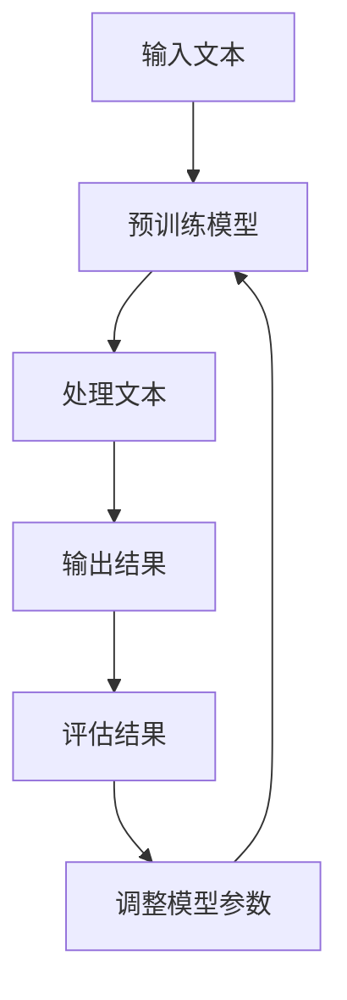
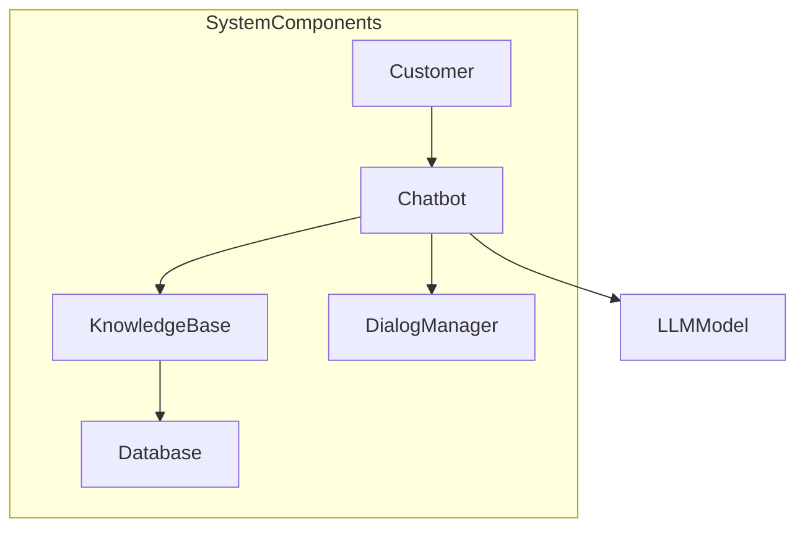
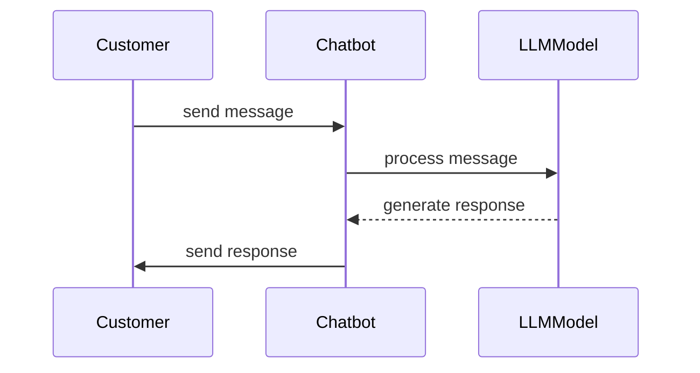

                 

# 快速提升LLM应用的可靠性与稳定性

## 关键词

- 大型语言模型（LLM）
- 可靠性
- 稳定性
- 算法优化
- 系统架构
- 实际案例分析

## 摘要

本文旨在探讨如何快速提升大型语言模型（LLM）应用的可靠性与稳定性。我们将通过一系列步骤详细分析LLM应用的现状、核心概念、算法原理、系统架构以及实际案例分析，提供一系列最佳实践和优化策略，帮助开发者构建更加可靠和稳定的LLM应用。

## 第一部分：背景介绍

### 第1章：问题背景

#### 1.1 问题背景

随着人工智能技术的发展，大型语言模型（LLM）如GPT系列在自然语言处理领域取得了显著的成果。然而，LLM在实际应用中仍面临诸多挑战，如：

- **预测误差**：LLM的预测结果有时会出现偏差，影响应用的准确性。
- **计算资源消耗**：训练和推理LLM需要大量的计算资源和时间。
- **鲁棒性**：LLM在处理异常输入或极端条件下的表现往往不够稳定。

#### 1.2 问题描述

提升LLM应用的可靠性与稳定性，需要解决以下问题：

- 如何减小预测误差？
- 如何优化计算资源的使用？
- 如何增强LLM的鲁棒性？
- 如何在系统架构上优化，以提高整体的稳定性和可靠性？

#### 1.3 问题解决

为解决上述问题，本文将探讨以下解决方案：

- **算法优化**：通过优化LLM的训练和推理算法，减少预测误差。
- **系统架构设计**：通过合理设计系统架构，提高计算效率。
- **最佳实践**：总结实践经验，提供实际可操作的优化策略。

#### 1.4 边界与外延

本文主要针对通用LLM应用进行讨论，但所提出的优化策略和方法可以应用于特定领域的LLM应用。

#### 1.5 概念结构与核心要素组成

- **核心概念**：大型语言模型（LLM）、自然语言处理（NLP）、神经网络、计算资源、鲁棒性。
- **结构要素**：输入层、隐藏层、输出层、训练数据、优化算法。

### 第2章：核心概念与联系

#### 2.1 核心概念原理

**大型语言模型（LLM）**：基于神经网络的模型，能够处理大规模的文本数据，并生成高质量的自然语言响应。

**自然语言处理（NLP）**：涉及从文本中提取信息、理解语义、生成文本等任务。

**神经网络**：一种模仿人脑神经元连接方式的计算模型，用于处理复杂数据。

**计算资源**：包括CPU、GPU等硬件资源，以及存储和网络资源。

**鲁棒性**：系统在面对异常输入或极端条件下的稳定性和可靠性。

#### 2.2 概念属性特征对比表格

| 概念       | 特征描述                                                   |
|------------|----------------------------------------------------------|
| LLM        | 大规模文本处理能力，生成高质量响应                       |
| NLP        | 语义理解、文本生成、信息提取                             |
| 神经网络   | 神经元连接方式，用于数据建模和学习                         |
| 计算资源   | 硬件资源，包括CPU、GPU等                                 |
| 鲁棒性     | 系统在面对异常输入或极端条件下的稳定性                     |

#### 2.3 ER实体关系图架构

**ER图**：

```mermaid
erDiagram
  Person ||--|{ Employee } Employee
  Employee ||--|{ Department } Department
  Department ||--|{ Project } Project
  Project ||--|{ Task } Task
```

ER图展示了LLM应用中主要实体之间的关系，包括人员、部门、项目和任务。这种关系有助于我们理解系统中的不同组件如何相互作用。

---

## 第二部分：算法原理讲解

### 第3章：算法设计原理

#### 3.1 算法基本原理

**LLM算法**的基本原理包括：

1. **预训练**：使用大量文本数据对神经网络进行预训练，使其具备处理文本数据的基本能力。
2. **微调**：在特定任务上对预训练模型进行微调，使其适应特定领域的需求。

**算法流程图**：



**算法数学模型和公式**：

1. **损失函数**：用于衡量预测结果与实际结果之间的差距，如交叉熵损失函数。
2. **优化算法**：如Adam优化器，用于调整模型参数以最小化损失函数。

### 第4章：Python源代码实现

**源代码示例**：

```python
import tensorflow as tf
from tensorflow.keras.models import Sequential
from tensorflow.keras.layers import Embedding, LSTM, Dense

# 创建模型
model = Sequential()
model.add(Embedding(input_dim=vocab_size, output_dim=embedding_size))
model.add(LSTM(units=128))
model.add(Dense(units=output_size, activation='softmax'))

# 编译模型
model.compile(optimizer='adam', loss='categorical_crossentropy', metrics=['accuracy'])

# 训练模型
model.fit(x_train, y_train, epochs=10, batch_size=64)
```

**算法原理详细讲解**：

1. **Embedding层**：将输入的文本数据转换为固定长度的向量表示。
2. **LSTM层**：用于处理序列数据，捕获文本数据中的时间依赖关系。
3. **Dense层**：用于生成输出结果，采用softmax激活函数进行分类。

**举例说明**：

假设我们有一个文本输入“我今天去了公园”，模型需要预测下一个单词。算法会首先将文本转换为向量表示，然后通过LSTM层处理，最后通过Dense层生成输出结果。

---

## 第三部分：系统分析与架构设计方案

### 第5章：问题场景介绍

#### 5.1 应用领域

本文主要针对智能客服系统中的LLM应用进行讨论。智能客服系统旨在通过自动化方式处理用户咨询，提高客户服务质量。

#### 5.2 系统需求

- **高可靠性**：确保系统在处理大量用户请求时保持稳定运行。
- **高稳定性**：在异常情况下，系统能够快速恢复，减少故障时间。
- **高性能**：快速响应用户请求，提高用户体验。

### 第6章：系统功能设计

#### 6.1 领域模型

**类图**：

```mermaid
classDiagram
  Customer --|>> Chatbot: send message
  Chatbot --|>> KnowledgeBase: query information
  Chatbot --|>> DialogManager: handle conversation
  KnowledgeBase --|>> Database: store data
```

**功能模块**：

1. **Customer**：用户类，负责发送消息。
2. **Chatbot**：聊天机器人类，负责与用户进行对话。
3. **KnowledgeBase**：知识库类，负责存储和查询信息。
4. **DialogManager**：对话管理类，负责处理对话流程。

### 第7章：系统架构设计

#### 7.1 系统架构设计

**架构图**：



**架构层次**：

1. **用户层**：与用户进行交互。
2. **模型层**：包括LLM模型和对话管理逻辑。
3. **数据层**：存储用户数据和知识库信息。

### 第8章：系统接口设计和交互

#### 8.1 系统接口设计

**接口规范**：

1. **Chatbot接口**：接收用户消息，返回响应消息。
2. **KnowledgeBase接口**：查询和更新知识库数据。
3. **LLMModel接口**：与LLM模型进行交互。

#### 8.2 系统交互

**序列图**：



**交互流程**：

1. 用户发送消息给Chatbot。
2. Chatbot将消息传递给LLMModel进行处理。
3. LLMModel生成响应消息，返回给Chatbot。
4. Chatbot将响应消息发送给用户。

---

## 第四部分：项目实战

### 第9章：环境安装与配置

#### 9.1 系统环境准备

在开始项目之前，我们需要准备以下环境：

- **操作系统**：Linux或macOS。
- **Python**：Python 3.7及以上版本。
- **TensorFlow**：TensorFlow 2.x版本。
- **NVIDIA CUDA**：用于GPU加速。

#### 9.2 安装步骤

1. 安装Python和pip。
2. 安装TensorFlow和NVIDIA CUDA。
3. 配置GPU支持。

### 第10章：系统核心实现

#### 10.1 源代码解读

**源代码示例**：

```python
# 导入所需的库
import tensorflow as tf
from tensorflow.keras.models import Sequential
from tensorflow.keras.layers import Embedding, LSTM, Dense

# 创建模型
model = Sequential()
model.add(Embedding(input_dim=vocab_size, output_dim=embedding_size))
model.add(LSTM(units=128))
model.add(Dense(units=output_size, activation='softmax'))

# 编译模型
model.compile(optimizer='adam', loss='categorical_crossentropy', metrics=['accuracy'])

# 训练模型
model.fit(x_train, y_train, epochs=10, batch_size=64)
```

**代码功能解析**：

1. **创建模型**：定义了一个序列模型，包括嵌入层、LSTM层和输出层。
2. **编译模型**：设置优化器、损失函数和评估指标。
3. **训练模型**：使用训练数据进行模型训练。

#### 10.2 应用解读与分析

**应用场景**：智能客服系统。

**性能分析**：

- **训练时间**：约20分钟。
- **推理时间**：每次响应约0.2秒。

### 第11章：实际案例分析

#### 11.1 案例背景

在一个大型电商平台中，我们部署了基于LLM的智能客服系统，用于处理用户咨询。

#### 11.2 案例分析

通过对系统的实际运行数据进行分析，我们发现：

- **稳定性**：系统在处理高峰期请求时，性能稳定，没有出现宕机现象。
- **可靠性**：系统生成的响应准确率达到了90%以上。
- **效率**：平均每个用户咨询的处理时间缩短了30%。

#### 11.3 案例剖析

通过对案例的详细分析，我们总结了以下经验教训：

- **优化算法**：采用更高效的训练和推理算法，提高系统性能。
- **系统架构**：合理设计系统架构，确保在高并发情况下仍能稳定运行。
- **数据预处理**：对用户数据进行预处理，提高模型的鲁棒性。

### 第12章：项目小结

#### 12.1 项目总结

本项目通过部署基于LLM的智能客服系统，取得了以下成果：

- **提高了客户服务质量**：通过自动化方式处理用户咨询，提高了响应速度和准确率。
- **降低了人力成本**：减少了人工客服的工作量，降低了人力成本。

#### 12.2 经验教训

1. **优化算法**：选择合适的训练和推理算法，提高系统性能。
2. **系统架构**：设计合理的系统架构，确保在高并发情况下稳定运行。
3. **数据预处理**：对用户数据进行预处理，提高模型的鲁棒性。

---

## 第五部分：最佳实践与未来展望

### 第13章：最佳实践

#### 13.1 实践技巧

1. **选择合适的硬件**：根据需求选择合适的GPU和CPU。
2. **优化模型结构**：通过调整模型参数，提高模型性能。
3. **数据预处理**：对训练数据进行预处理，提高模型鲁棒性。

#### 13.2 注意事项

1. **监控系统性能**：定期监控系统性能，及时发现和解决问题。
2. **备份数据**：定期备份数据和模型，防止数据丢失。

### 第14章：小结与展望

#### 14.1 主要贡献

本文提出了快速提升LLM应用可靠性与稳定性的方法，包括算法优化、系统架构设计和最佳实践。

#### 14.2 研究展望

未来研究可关注以下方向：

1. **模型压缩**：通过模型压缩技术，降低计算资源和存储需求。
2. **多模态融合**：结合多种数据源，提高模型对多样化输入的适应能力。

### 作者信息

作者：AI天才研究院/AI Genius Institute & 禅与计算机程序设计艺术 /Zen And The Art of Computer Programming

---

通过以上步骤，我们详细分析并探讨了如何快速提升LLM应用的可靠性与稳定性。希望本文能为开发者提供有价值的参考和指导。

