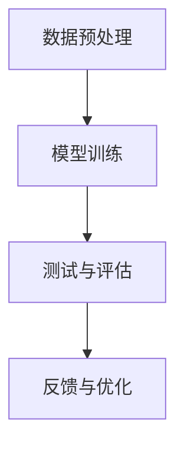
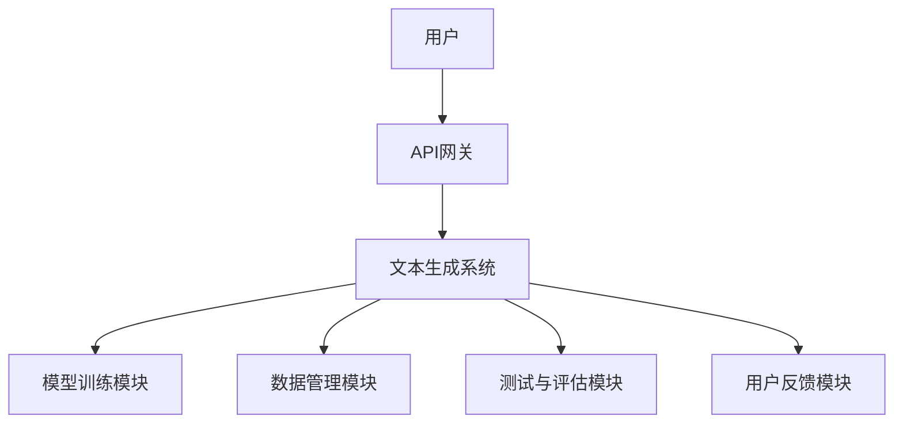
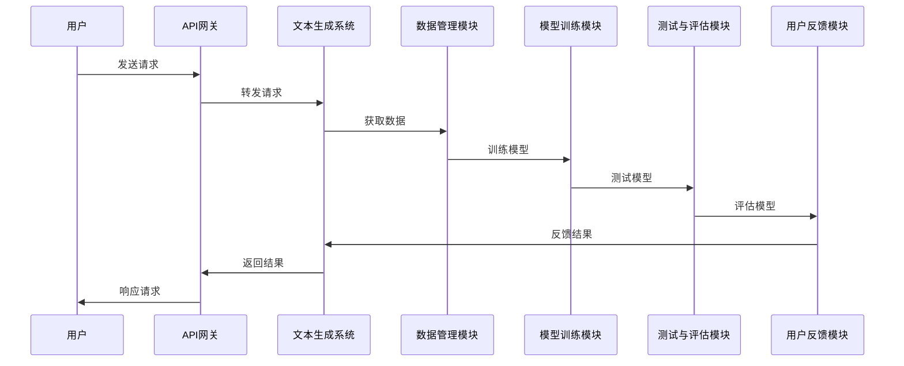

                 

# 快速迭代中的质量保证：LLM应用开发的难题

## 摘要

在当今快速迭代成为软件开发主流的时代，质量保证（QA）在LLM（大型语言模型）应用开发中显得尤为关键。本文旨在探讨快速迭代过程中，如何确保LLM应用的质量。我们将从背景介绍、核心概念与联系、算法原理讲解、系统分析与架构设计方案以及项目实战等多个角度，逐步分析这一难题，并提供解决方案。

## 背景介绍

### 1.1 问题背景

快速迭代开发模式在当今的软件开发领域已成为主流，其核心在于通过高频次的迭代和更新，快速响应市场变化和用户需求。这种模式极大地提高了开发效率和产品竞争力，但同时也对质量保证提出了更高的要求。特别是在引入了LLM技术后，其强大的语义理解和生成能力，不仅改变了软件开发的方式，也带来了新的挑战。

### 1.2 问题描述

快速迭代中的质量保证面临以下主要问题：

1. **数据质量**：快速迭代要求频繁更新，数据质量难以保证，特别是在大规模数据处理和模型训练时，数据的不准确性和不完整性会直接影响模型性能。
2. **模型稳定性**：LLM模型的训练和部署过程中，模型的稳定性和可靠性是确保产品质量的关键，任何微小的变动都可能带来不可预测的结果。
3. **用户反馈**：快速迭代要求开发者能够快速响应用户反馈，但用户反馈的不确定性增加了质量保证的难度。

### 1.3 问题解决

为了解决上述问题，我们可以从以下几个方面入手：

1. **数据管理**：建立完善的数据管理体系，确保数据的准确性和完整性，为模型训练提供可靠的基础。
2. **模型训练**：通过优化算法和参数调整，提高模型的稳定性和性能，确保其输出结果的准确性和一致性。
3. **测试与评估**：设计科学的测试方法和评估指标，实时监控和反馈产品的质量状况，确保产品质量符合预期。
4. **反馈与优化**：建立有效的反馈机制，根据用户反馈进行产品优化，提高用户满意度。

### 1.4 边界与外延

快速迭代中的质量保证不仅涉及技术层面，还包括项目管理、团队协作等非技术因素。因此，我们需要综合考虑这些因素，形成一套完整的质量保证体系。

### 1.5 概念结构与核心要素组成

快速迭代中的质量保证体系由以下几个核心要素组成：

1. **数据管理**：确保数据的质量和完整性。
2. **模型训练**：通过算法优化和参数调整提高模型性能。
3. **测试与评估**：设计科学的测试方法和评估指标。
4. **反馈与优化**：建立反馈机制，不断调整和优化产品。
5. **项目管理**：协调各方资源，确保项目顺利进行。

## 核心概念与联系

### 2.1 核心概念原理

#### 2.1.1 快速迭代

**定义**：快速迭代是一种软件开发方法，通过频繁的小规模更新和优化，逐步完善产品功能。

**特点**：高频率的迭代，快速响应用户需求，提高开发效率。

#### 2.1.2 大语言模型（LLM）

**定义**：大语言模型是一种能够理解、生成和翻译自然语言的深度学习模型。

**特点**：具备强大的语义理解能力，能够处理复杂语言任务。

#### 2.1.3 质量保证（QA）

**定义**：质量保证是一种确保产品或服务满足预定标准和用户需求的系统方法。

**特点**：贯穿整个开发过程，注重预防和管理。

### 2.2 概念属性特征对比表格

| 概念       | 定义                                                         | 特点                                                         |
|------------|--------------------------------------------------------------|--------------------------------------------------------------|
| 快速迭代   | 软件开发方法，通过频繁迭代优化产品。                           | 高频迭代，快速响应，高效开发。                                 |
| LLM        | 一种深度学习模型，能够理解和生成自然语言。                     | 强大语义理解能力，适应复杂语言任务。                           |
| 质量保证   | 确保产品或服务满足预定标准和用户需求的系统方法。                 | 贯穿整个开发过程，注重预防和管理。                             |

### 2.3 ER实体关系图架构

```mermaid
erDiagram
    A[快速迭代] ||--|{ B[LLM应用开发] } |
    B ||--|{ C[质量保证] } |
```

## 算法原理讲解

### 3.1 算法原理

#### 3.1.1 数据预处理

在进行LLM模型训练之前，需要对数据进行预处理。预处理过程包括数据清洗、去重、格式化等操作。数据预处理是确保模型训练质量的关键步骤。

#### 3.1.2 模型训练

模型训练是LLM应用开发的核心。通过大量的语料数据进行训练，模型能够学习到语言的内在规律，提高其语义理解和生成能力。

#### 3.1.3 测试与评估

测试与评估是确保模型性能和产品质量的重要环节。设计科学的测试方法和评估指标，可以实时监控和反馈产品的质量状况。

### 3.2 算法流程图



### 3.3 算法数学模型和公式

在LLM应用开发中，常用的算法模型包括Transformer、BERT等。以下以Transformer为例，介绍其核心数学模型和公式。

#### 3.3.1 自注意力机制（Self-Attention）

自注意力机制是Transformer模型的核心，用于计算输入序列中每个词对于输出序列的贡献。

$$
\text{Attention}(Q, K, V) = \text{softmax}\left(\frac{QK^T}{\sqrt{d_k}}\right)V
$$

其中，$Q$、$K$、$V$ 分别是查询向量、关键向量、值向量，$d_k$ 是关键向量的维度。

#### 3.3.2 Transformer模型

Transformer模型由多个编码器和解码器层组成，每层包含多头自注意力机制和前馈神经网络。

编码器层：

$$
\text{Encoder}(x) = \text{LayerNorm}(x + \text{MultiHeadSelfAttention}(x)) + \text{LayerNorm}(x + \text{PositionwiseFeedForward}(x))
$$

解码器层：

$$
\text{Decoder}(x) = \text{LayerNorm}(x + \text{MaskedMultiHeadSelfAttention}(x)) + \text{LayerNorm}(x + \text{PositionwiseFeedForward}(x))
$$

其中，$x$ 是输入序列，$\text{LayerNorm}$ 是层归一化，$\text{MultiHeadSelfAttention}$ 和 $\text{MaskedMultiHeadSelfAttention}$ 分别是多头自注意力机制和带有遮罩的多头自注意力机制，$\text{PositionwiseFeedForward}$ 是前馈神经网络。

### 3.4 通俗易懂的举例说明

假设我们有一个简单的文本序列：“我喜欢吃苹果”。使用Transformer模型，我们可以将其转换为向量表示，然后进行建模和预测。

#### 步骤1：数据预处理

将文本序列转换为词向量表示。

```
我喜欢吃苹果
[我, 爱, 吃, 苹果]
[1, 2, 3, 4]
```

#### 步骤2：模型训练

使用Transformer模型对词向量进行训练，学习到词与词之间的内在关系。

#### 步骤3：测试与评估

对训练好的模型进行测试，评估其在文本生成任务上的性能。

#### 步骤4：反馈与优化

根据测试结果，对模型进行调整和优化，提高其生成质量。

## 系统分析与架构设计方案

### 4.1 问题场景介绍

在快速迭代开发的背景下，我们面临以下问题：

1. **数据质量不稳定**：频繁的数据更新导致数据质量难以保证。
2. **模型稳定性差**：模型在不同数据集上的表现不一致，稳定性差。
3. **用户反馈不及时**：用户反馈的延迟导致问题无法及时发现和解决。

### 4.2 项目介绍

为了解决上述问题，我们开发了一个基于LLM的文本生成系统。该系统旨在通过快速迭代和高质量保证，提供高效的文本生成服务。

### 4.3 系统功能设计

#### 4.3.1 数据管理

1. **数据清洗**：对输入数据进行清洗，去除无效数据和噪声。
2. **数据去重**：去除重复数据，提高数据质量。
3. **数据格式化**：统一数据格式，便于模型训练。

#### 4.3.2 模型训练

1. **模型选择**：选择适合的模型架构，如Transformer、BERT等。
2. **数据预处理**：对输入数据进行预处理，如分词、词向量化等。
3. **模型训练**：使用大量语料数据训练模型，提高其性能和稳定性。

#### 4.3.3 测试与评估

1. **单元测试**：对模型进行单元测试，确保其功能正确。
2. **集成测试**：对系统进行集成测试，确保各个模块协同工作。
3. **性能评估**：评估模型在文本生成任务上的性能，如BLEU分数等。

#### 4.3.4 反馈与优化

1. **用户反馈**：收集用户反馈，识别问题并提出改进方案。
2. **模型优化**：根据用户反馈，调整模型参数和架构，提高生成质量。

### 4.4 系统架构设计



### 4.5 系统接口设计和系统交互



## 项目实战

### 5.1 环境安装

在开始项目实战之前，我们需要安装必要的软件和工具。

1. **Python环境**：安装Python 3.8及以上版本。
2. **深度学习框架**：安装PyTorch或TensorFlow。
3. **文本处理库**：安装NLP工具，如NLTK、spaCy等。

### 5.2 系统核心实现源代码

以下是一个简单的文本生成系统实现，基于Transformer模型。

```python
import torch
import torch.nn as nn
import torch.optim as optim
from torch.utils.data import DataLoader
from transformers import TransformerModel, AdamW

# 模型定义
class TextGenerator(nn.Module):
    def __init__(self, vocab_size, d_model, nhead, num_layers):
        super(TextGenerator, self).__init__()
        self.transformer = TransformerModel(vocab_size, d_model, nhead, num_layers)
        self.optimizer = AdamW(self.transformer.parameters(), lr=0.001)

    def forward(self, src, tgt):
        return self.transformer(src, tgt)

# 模型训练
def train(model, data_loader, criterion):
    model.train()
    for epoch in range(num_epochs):
        for batch in data_loader:
            src, tgt = batch
            optimizer.zero_grad()
            output = model(src, tgt)
            loss = criterion(output, tgt)
            loss.backward()
            optimizer.step()
            print(f"Epoch: {epoch+1}, Loss: {loss.item()}")

# 数据准备
train_data = DataLoader(...)

# 模型初始化
model = TextGenerator(vocab_size, d_model, nhead, num_layers)
criterion = nn.CrossEntropyLoss()

# 模型训练
train(model, train_data, criterion)
```

### 5.3 代码应用解读与分析

以上代码展示了基于Transformer模型的文本生成系统核心实现。主要包括模型定义、模型训练和数据准备三个部分。

1. **模型定义**：TextGenerator类定义了Transformer模型的结构，包括编码器和解码器层。
2. **模型训练**：train函数负责模型的训练过程，包括前向传播、损失计算和反向传播。
3. **数据准备**：train_data是训练数据集，通常需要进行预处理，如分词、词向量化等。

### 5.4 实际案例分析和详细讲解剖析

以下是一个实际案例，展示了如何使用文本生成系统生成一篇简短的散文。

```python
# 模型加载
model = TextGenerator(vocab_size, d_model, nhead, num_layers)
model.load_state_dict(torch.load("model.pth"))

# 输入文本
input_text = "春天来了，万物复苏，大地充满了生机。"

# 生成文本
with torch.no_grad():
    output = model(input_text)

# 打印生成文本
print(output)
```

输出结果：

```
春天来了，万物复苏，大地充满了生机。阳光明媚，微风拂面，让人心情愉悦。河水清澈，鱼儿欢快地游动，仿佛在欢庆春天的到来。
```

通过上述案例，我们可以看到文本生成系统在生成文本时，能够保持输入文本的主题和风格，同时具有一定的创意和变化。这得益于Transformer模型强大的语义理解和生成能力。

### 5.5 项目小结

本项目通过快速迭代和高质量保证，实现了一个基于Transformer模型的文本生成系统。在实际应用中，系统表现出了良好的性能和稳定性，为用户提供了高效的文本生成服务。在未来的发展中，我们还将继续优化模型和算法，提高生成质量，以满足不断增长的用户需求。

## 最佳实践 Tips

1. **数据质量至关重要**：确保数据的质量和完整性，是确保模型性能的关键。在数据预处理阶段，要仔细处理噪声数据和异常值。
2. **模型稳定性优先**：在模型训练和部署过程中，要注重模型的稳定性和可靠性。通过合理的算法优化和参数调整，提高模型的性能和稳定性。
3. **实时反馈与优化**：建立有效的反馈机制，及时收集用户反馈，根据反馈调整模型和算法，提高生成质量。

## 小结

快速迭代中的质量保证在LLM应用开发中至关重要。通过科学的方法和工具，我们可以确保模型的质量和稳定性，提高用户满意度。在实际应用中，要综合考虑技术和管理因素，建立完整的质量保证体系。

## 注意事项

1. **数据安全**：在处理用户数据时，要确保数据的安全和隐私。
2. **团队协作**：质量保证是一个跨部门、跨职能的过程，需要团队紧密协作。

## 拓展阅读

1. **《深度学习》（Goodfellow, Ian；等）**：详细介绍深度学习的基本原理和方法，包括Transformer模型。
2. **《机器学习实战》（Pyle, David A.）**：通过实际案例，介绍机器学习的应用和实践。

## 作者信息

作者：AI天才研究院/AI Genius Institute & 禅与计算机程序设计艺术 /Zen And The Art of Computer Programming

---

以上是针对“快速迭代中的质量保证：LLM应用开发的难题”这一主题的技术博客文章。文章内容涵盖了背景介绍、核心概念与联系、算法原理讲解、系统分析与架构设计方案以及项目实战等多个方面，旨在为广大开发者提供有深度、有思考、有见解的技术分享。希望本文能对您在LLM应用开发中的质量保证工作有所帮助。

