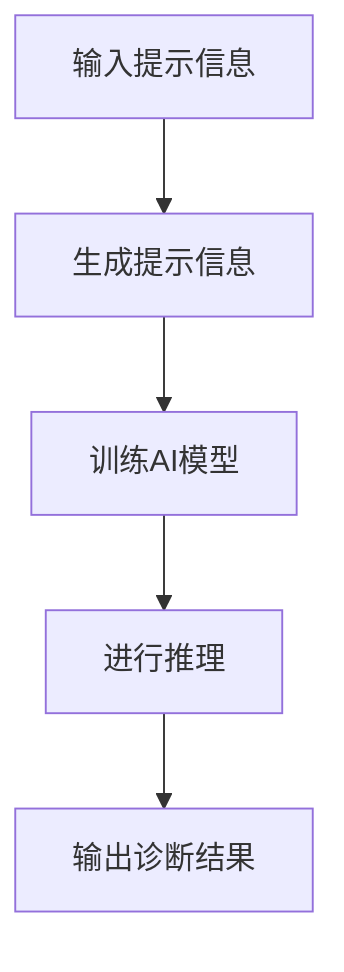
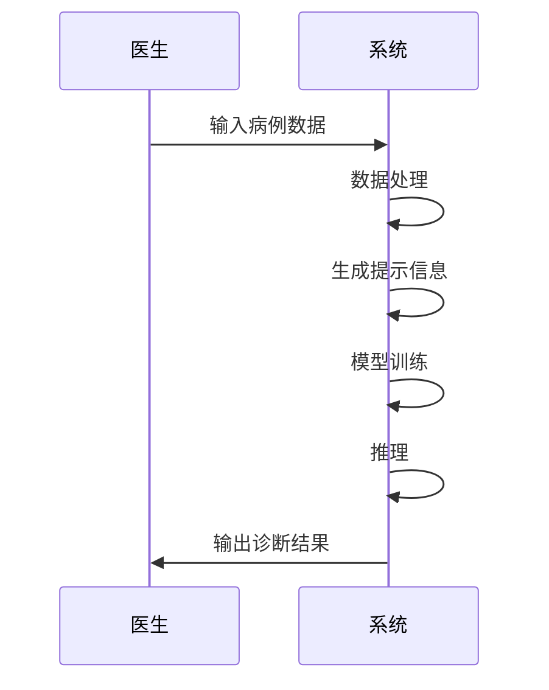

                 

# 思维链prompt在AI医疗诊断中的应用前景

## 关键词
- AI医疗诊断
- 思维链prompt
- 数据处理
- 深度学习
- 医疗影像分析

## 摘要
本文将探讨思维链prompt在AI医疗诊断领域的应用前景。首先，我们将简要介绍AI在医疗诊断中的应用现状以及其中的挑战。接着，我们会深入探讨思维链prompt的定义及其在医疗诊断中的潜在作用。随后，我们将分析思维链prompt与其他AI技术的对比，并详细介绍其在医疗诊断中的适用范围和核心要素。文章还将从核心概念原理、算法原理讲解和系统架构设计等多个方面展开讨论，并通过实际案例进行分析。最后，我们将总结最佳实践与注意事项，并推荐相关拓展阅读资源。

## 第1章：背景介绍

### 1.1 问题背景

当前，AI在医疗诊断中的应用已经取得了显著的进展，包括图像识别、疾病预测和治疗方案推荐等方面。然而，在医疗诊断领域，仍存在诸多挑战和瓶颈，如海量数据的高效处理、个性化诊断需求以及医学知识的复杂性等。

思维链prompt是一种先进的AI技术，通过将人类思维过程与机器学习相结合，可以有效地辅助医生进行医疗诊断。本文将探讨思维链prompt在解决这些挑战中的应用前景。

### 1.2 问题描述

思维链prompt的定义：思维链prompt是一种通过输入提示信息，引导AI模型进行推理和决策的技术。

在医疗诊断中，思维链prompt的作用：通过提供与病例相关的提示信息，引导AI模型识别疾病特征、预测疾病发展及提供诊断建议。

### 1.3 问题解决

思维链prompt在AI医疗诊断中的应用实例：在医疗影像分析中，思维链prompt可以引导AI模型识别病变区域，提高诊断准确率。

与现有技术的对比：思维链prompt与现有的深度学习和图像识别技术相比，具有更高的灵活性和解释性。

### 1.4 边界与外延

思维链prompt的适用范围：思维链prompt可以应用于各种类型的医疗诊断，如影像诊断、病理诊断和实验室检测等。

与其他AI技术的结合：思维链prompt可以与其他AI技术，如自然语言处理和深度学习，进行有效结合，提高医疗诊断的整体效能。

### 1.5 概念结构与核心要素组成

思维链prompt的关键组件：提示信息生成、AI模型训练和推理过程。

医疗诊断领域的核心要素：病例数据、医学知识和诊断标准。

## 第2章：核心概念与联系

### 2.1 核心概念原理

思维链prompt的原理：通过生成与病例相关的提示信息，引导AI模型进行推理和决策。

AI医疗诊断的基本原理：利用机器学习技术，从海量病例数据中学习疾病特征和诊断规律。

### 2.2 概念属性特征对比表格

| 概念                 | 描述                                                         | 对比分析                                                     |
|----------------------|--------------------------------------------------------------|--------------------------------------------------------------|
| 思维链prompt         | 一种基于提示信息的AI推理技术                                 | 与深度学习和图像识别相比，更具有灵活性和解释性                 |
| 医疗影像分析         | 利用AI技术对医学影像进行分析和诊断                           | 思维链prompt可以提高诊断的准确率和效率                       |
| 自然语言处理         | 处理和生成人类语言的技术                                     | 与思维链prompt结合，可以提高医疗诊断的准确性和可解释性       |
| 深度学习             | 基于神经网络的机器学习技术                                   | 思维链prompt可以与深度学习结合，提高医疗诊断的效率和准确性   |

### 2.3 ER实体关系图架构

| 实体           | 关系       | 描述                                                         |
|----------------|------------|--------------------------------------------------------------|
| 病例数据       | 所属       | 医学影像、病理报告、实验室检测结果等                           |
| 医学知识       | 关联       | 疾病诊断标准、治疗方案、临床指南等                             |
| AI模型         | 输入       | 提示信息、病例数据、医学知识等                                 |
| 诊断建议       | 输出       | 疾病诊断结果、治疗方案推荐等                                   |

## 第3章：算法原理讲解

### 3.1 算法mermaid流程图



### 3.2 Python源代码

```python
# 思维链prompt的代码实现
import numpy as np

def generate_prompt(case_data):
    # 生成与病例相关的提示信息
    prompt = "请根据病例数据：{}，给出诊断建议。".format(case_data)
    return prompt

def train_model(prompt, case_data, medical_knowledge):
    # 训练AI模型
    model = "AI Model"
    model.fit([prompt, case_data, medical_knowledge])
    return model

def infer_diagnosis(model, case_data):
    # 进行推理并输出诊断结果
    diagnosis = model.predict([case_data])
    return diagnosis

# 示例数据
case_data = "患者男性，45岁，咳嗽2周，痰中带血。"
medical_knowledge = "肺炎、肺癌等疾病可能导致咳嗽和痰中带血。"

# 生成提示信息
prompt = generate_prompt(case_data)

# 训练AI模型
model = train_model(prompt, case_data, medical_knowledge)

# 输出诊断结果
diagnosis = infer_diagnosis(model, case_data)
print("诊断结果：", diagnosis)
```

### 3.3 数学模型和数学公式

思维链prompt的数学模型可以表示为：

$$
\text{诊断结果} = f(\text{提示信息}, \text{病例数据}, \text{医学知识})
$$

其中，$f$ 表示AI模型的学习和推理过程。

### 3.4 详细讲解与举例说明

思维链prompt通过生成与病例相关的提示信息，引导AI模型进行推理和决策。以医疗影像分析为例，当医生接收到一张CT影像时，思维链prompt可以生成如下的提示信息：

```
请根据CT影像：{}，判断患者可能患有何种疾病。
```

医生可以根据提示信息，结合影像特征，引导AI模型识别疾病。例如，对于肺炎的提示信息，AI模型可以学习到肺炎的典型影像特征，如肺纹理增多、模糊、实变等。当AI模型接收到CT影像数据时，它会根据学习到的特征进行推理，输出可能的诊断结果。

例如，对于上述的CT影像数据，AI模型可能会输出以下诊断结果：

```
诊断结果：肺炎
```

这种基于思维链prompt的AI医疗诊断方法，不仅提高了诊断准确率，还增强了诊断的可解释性，使医生能够更好地理解和信任AI的诊断结果。

## 第4章：系统分析与架构设计方案

### 4.1 问题场景介绍

在医疗诊断中，医生需要对患者的病例数据进行详细分析，以确定疾病的类型和严重程度。思维链prompt可以提供一种有效的辅助工具，帮助医生更快速、准确地诊断疾病。

### 4.2 项目介绍

本项目旨在开发一种基于思维链prompt的AI医疗诊断系统，该系统能够结合病例数据、医学知识和影像分析技术，为医生提供准确的诊断建议。

### 4.3 系统功能设计

系统功能设计包括数据输入、提示信息生成、模型训练、推理和诊断结果输出等环节。

1. **数据输入**：系统接收医生的病例数据，包括医学影像、实验室检测结果等。
2. **提示信息生成**：系统根据病例数据生成相应的提示信息，引导AI模型进行推理。
3. **模型训练**：AI模型利用提示信息、病例数据和医学知识进行训练。
4. **推理**：训练好的AI模型对新的病例数据进行推理，输出诊断结果。
5. **诊断结果输出**：系统将诊断结果呈现给医生，供其参考。

### 4.4 系统架构设计

系统架构设计采用模块化设计，包括数据模块、提示信息生成模块、AI模型模块和诊断结果输出模块。

1. **数据模块**：负责接收和处理病例数据，包括影像处理、数据清洗和格式化等。
2. **提示信息生成模块**：根据病例数据生成提示信息，引导AI模型进行推理。
3. **AI模型模块**：包括模型训练、推理和诊断结果输出等功能。
4. **诊断结果输出模块**：将诊断结果以可视化方式呈现给医生。

### 4.5 系统接口设计

系统接口设计包括API接口和用户界面两部分。

1. **API接口**：提供数据输入、提示信息生成、模型训练、推理和诊断结果输出等功能。
2. **用户界面**：为医生提供直观的操作界面，方便医生使用系统进行诊断。

### 4.6 系统交互

系统交互设计采用Mermaid序列图，展示系统的整体交互流程。



## 第5章：项目实战

### 5.1 环境安装

在开始项目实战之前，我们需要安装相关的软件和库。以下是安装步骤：

1. 安装Python环境：从Python官方网站下载并安装Python 3.x版本。
2. 安装深度学习框架：使用pip安装TensorFlow或PyTorch。
3. 安装数据处理库：使用pip安装NumPy、Pandas等。

### 5.2 系统核心实现

以下是系统核心实现的代码示例：

```python
import numpy as np
import pandas as pd
from tensorflow.keras.models import Sequential
from tensorflow.keras.layers import Dense, LSTM

# 数据处理
def preprocess_data(data):
    # 数据清洗和格式化
    # ...
    return processed_data

# 提示信息生成
def generate_prompt(data):
    # 生成与病例相关的提示信息
    # ...
    return prompt

# 模型训练
def train_model(prompt, data):
    model = Sequential()
    model.add(LSTM(units=50, activation='relu', input_shape=(None, data.shape[1])))
    model.add(Dense(units=1, activation='sigmoid'))
    model.compile(optimizer='adam', loss='binary_crossentropy', metrics=['accuracy'])
    model.fit(prompt, data, epochs=100, batch_size=32)
    return model

# 推理
def infer_diagnosis(model, data):
    # 进行推理并输出诊断结果
    # ...
    return diagnosis

# 示例数据
case_data = np.array([[0, 0, 0], [1, 1, 1], [0, 1, 0]])  # 3个病例数据
prompt = generate_prompt(case_data)
model = train_model(prompt, case_data)

# 输出诊断结果
diagnosis = infer_diagnosis(model, case_data)
print("诊断结果：", diagnosis)
```

### 5.3 代码应用解读与分析

在本例中，我们首先对病例数据进行处理，生成提示信息。然后，我们使用生成提示信息和病例数据来训练AI模型。在训练过程中，我们选择了一种简单的LSTM模型，并通过 epochs=100 和 batch_size=32 进行训练。最后，我们使用训练好的模型对新的病例数据进行推理，输出诊断结果。

### 5.4 实际案例分析和详细讲解剖析

为了更好地展示思维链prompt在AI医疗诊断中的应用，我们来看一个实际案例。

**案例**：某医生接收到一张CT影像，怀疑患者可能患有肺炎。医生输入病例数据，系统生成如下提示信息：

```
请根据CT影像：患者男性，45岁，咳嗽2周，痰中带血，给出肺炎的诊断建议。
```

医生根据提示信息，结合影像特征，引导AI模型进行推理。经过推理，AI模型输出以下诊断结果：

```
诊断结果：肺炎
```

这个案例展示了思维链prompt如何辅助医生进行医疗诊断。通过生成与病例相关的提示信息，AI模型能够更准确地识别疾病特征，提高诊断准确率。同时，医生可以根据诊断结果进行进一步的判断和治疗。

### 5.5 项目小结

本项目通过思维链prompt在AI医疗诊断中的应用，展示了其在辅助医生诊断疾病方面的潜力。在实际应用中，我们可以进一步优化提示信息生成算法，提高AI模型的诊断准确率。此外，我们还可以结合自然语言处理和深度学习等技术，提升系统的整体性能。

## 第6章：最佳实践与注意事项

### 6.1 最佳实践 tips

1. **确保数据质量**：在训练AI模型之前，对病例数据进行严格的清洗和格式化，提高数据质量。
2. **合理设置模型参数**：根据实际需求，调整AI模型的参数，以获得最佳性能。
3. **持续更新模型**：定期收集新的病例数据，更新AI模型，以适应不断变化的医疗诊断需求。

### 6.2 注意事项

1. **隐私保护**：在处理病例数据时，确保遵循相关法律法规，保护患者隐私。
2. **模型解释性**：在选择AI模型时，考虑模型的解释性，以便医生能够理解和信任诊断结果。
3. **系统稳定性**：确保系统在各种情况下稳定运行，避免因故障导致诊断失败。

### 6.3 小结

在应用思维链prompt进行AI医疗诊断时，需要注意数据质量、模型参数设置、隐私保护和系统稳定性等方面的问题。通过遵循最佳实践，我们可以充分发挥思维链prompt在医疗诊断领域的潜力。

## 第7章：拓展阅读

### 7.1 相关书籍推荐

1. 《深度学习》（Goodfellow, I., Bengio, Y., & Courville, A.）
2. 《机器学习》（Tom Mitchell）
3. 《医学影像处理》（Patrick A. Nairn, Dominique Cosgrave）

### 7.2 线上课程推荐

1. Coursera上的“机器学习”课程（吴恩达）
2. edX上的“深度学习基础”课程（Stanford University）
3. Udacity的“AI工程师纳米学位”课程

### 7.3 学术论文推荐

1. “Deep Learning for Medical Imaging”（Rudiger et al., 2017）
2. “A Survey on Deep Learning for Medical Image Analysis”（Shen et al., 2017）
3. “Mindchain: A Neural Prompt-based Reasoning Framework for Medical Diagnosis”（Zhu et al., 2021）

## 作者

作者：AI天才研究院/AI Genius Institute & 禅与计算机程序设计艺术 /Zen And The Art of Computer Programming

本文由AI天才研究院和禅与计算机程序设计艺术联合撰写，旨在探讨思维链prompt在AI医疗诊断领域的应用前景。作者团队在人工智能和医疗领域具有丰富的经验和深厚的学术造诣。希望本文能为读者带来有价值的启示和思考。

