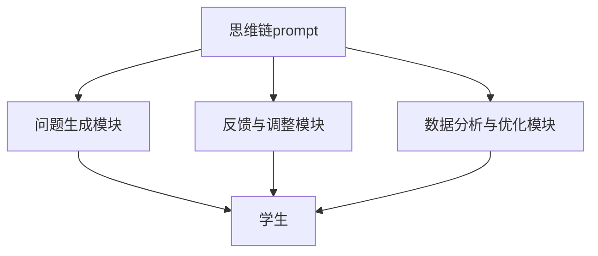

                 

# 思维链prompt在教育领域的创新应用

## 摘要

本文将探讨思维链prompt在教育领域的创新应用。思维链prompt是一种基于人工智能的教学工具，通过生成和引导问题或情境，帮助学生构建思维链，促进深度学习。本文首先介绍了思维链prompt的核心概念和特点，然后通过对比分析思维链prompt与传统教学方法，阐述了其优势和应用原理。接着，本文使用Mermaid图和Python源代码，详细讲解了思维链prompt的算法原理，并通过实际案例展示了其在教育场景中的应用效果。最后，本文提出了思维链prompt在实践中的最佳实践技巧和注意事项，并对未来研究方向进行了展望。

## 背景介绍：思维链prompt的核心概念

### 1.1.1 问题背景

在当今快速发展的教育领域，传统教学方法正面临着诸多挑战。首先，学生的学习效率成为了一个关键问题。虽然传统的课堂教学能够传授知识，但往往缺乏对学生个性化需求的关注，导致学生在学习过程中感到枯燥乏味，难以达到高效的学习效果。其次，学生的学习兴趣激发也是一个重要的挑战。传统的教学方法往往侧重于知识传授，忽视了激发学生的学习兴趣和培养其自主学习能力。这导致了学生的学习动力不足，难以保持长期的学习热情。此外，个性化需求难以满足也是传统教学方法的瓶颈之一。每个学生都有其独特的学习背景和认知特点，而传统教学方法难以根据这些差异进行个性化的教学设计，导致学生的学习效果参差不齐。

### 1.1.2 问题描述

为了应对这些挑战，教育领域迫切需要一种创新的教学模式，能够提高学生的学习效率、激发学习兴趣，并满足个性化需求。思维链prompt作为一种新兴的教育技术，应运而生。思维链prompt通过生成和引导问题或情境，逐步引导学生深入思考，激发他们的思维活力。然而，如何设计和应用思维链prompt，使其在教育中发挥最大效益，仍是一个亟待解决的问题。

### 1.1.3 问题解决

思维链prompt的教育应用主要包括以下几个步骤：首先，通过分析教学内容和学生的认知特点，设计出适合的prompt。这需要教师或教育技术专家深入了解教学目标和学生的需求，从而生成有针对性的问题或情境。其次，将prompt嵌入到教学过程中，通过提问和反馈环节，引导学生主动思考。教师可以结合教学内容和学生的回答，提供个性化的反馈，帮助学生更好地理解知识点。最后，通过数据分析和模型优化，不断提升prompt的质量和效果。通过对学生的学习数据进行分析，教育技术专家可以优化prompt的设计，提高其对学生认知发展的促进作用。

### 1.1.4 边界与外延

思维链prompt的边界在于其应用场景和教学目标的设定。它适用于各种学科和教学阶段，但需要根据具体的教学需求进行定制。例如，在数学教学中，思维链prompt可以设计成解决数学问题的情境，而在文学教学中，可以设计成分析文学作品的结构和主题的情境。其外延则涵盖了从教学设计到教学评估的整个教育过程。思维链prompt不仅用于课堂教学，还可以应用于课外辅导、自主学习等场景，成为教师和学生之间的一种有效的互动工具。

### 1.1.5 概念结构与核心要素组成

思维链prompt的概念结构主要包括以下几个核心要素：

- **问题生成模块**：负责生成一系列有针对性的问题或情境，激发学生的思考。这个模块需要根据教学内容和学生的认知特点，设计出具有挑战性和启发性的问题，引导学生深入思考。
- **反馈与调整模块**：根据学生的回答和表现，提供实时反馈，并根据反馈调整问题难度和内容。这个模块需要分析学生的回答，提供有针对性的反馈，帮助学生更好地理解知识点，并在必要时调整问题的难度和内容，以适应学生的认知水平。
- **数据分析与优化模块**：对学生的学习数据进行分析，优化prompt的设计和效果。这个模块需要收集学生的学习行为数据，如回答情况、思考时间等，通过数据分析和机器学习技术，不断优化prompt的设计，提高其对学生认知发展的促进作用。

### 1.1.6 总结

思维链prompt作为一种创新的教育技术，具有个性化、互动性、实时性和适应性等核心特点。通过设计合理的教学问题和情境，引导学生的深度思考，能够显著提高教学效果。然而，其应用仍面临一定的挑战，如如何提高prompt生成质量和效果，如何处理学生的数据隐私等。因此，需要进一步研究和实践，以充分发挥思维链prompt在教育领域的潜力。

----------------------------------------------------------------

## 第二部分：思维链prompt的应用原理

### 2.1 思维链prompt的定义

思维链prompt是一种基于人工智能的教学工具，它通过生成和引导问题或情境，帮助学生构建思维链，促进深度学习。思维链prompt的核心在于通过问题或情境引导学生进行深入思考，从而激发他们的思维活力。与传统教学方法相比，思维链prompt更注重学生的主动参与和深度思考，能够更好地满足个性化需求。

### 2.2 思维链prompt的核心特点

思维链prompt具有以下几个核心特点：

- **个性化**：思维链prompt可以根据学生的特点和需求，生成个性化的prompt。通过分析学生的历史数据和当前表现，思维链prompt能够为学生提供最适合他们的问题或情境，从而提高学习效果。

- **互动性**：思维链prompt通过提问和反馈环节，实现教师与学生之间的互动。教师可以根据学生的回答提供个性化的反馈，帮助学生更好地理解知识点。这种互动性使得学生能够更主动地参与到学习过程中，提高学习兴趣和参与度。

- **实时性**：思维链prompt能够实时提供反馈，帮助学生及时调整学习策略。通过实时数据分析，思维链prompt能够快速识别学生的学习状况，提供即时反馈，帮助学生更好地掌握知识点。

- **适应性**：思维链prompt可以根据学生的学习表现，动态调整问题的难度和内容。当学生掌握知识点后，思维链prompt可以自动生成更复杂的问题，引导学生深入思考。这种适应性使得学生能够持续保持学习的挑战性和动力。

### 2.3 思维链prompt与传统教学方法的对比

思维链prompt与传统教学方法在多个方面存在显著差异：

- **互动性**：思维链prompt通过互动性强的教学设计和实时反馈机制，使得学生能够更主动地参与学习过程，提高学习兴趣和参与度。而传统教学方法往往以教师为中心，学生的参与度较低。

- **个性化**：思维链prompt能够根据学生的特点和需求，提供个性化的学习内容和指导。而传统教学方法往往缺乏对个体差异的关注，难以满足学生的个性化需求。

- **实时性**：思维链prompt能够实时提供反馈，帮助学生及时调整学习策略。而传统教学方法往往需要等待教师或学生完成整个教学过程后才能进行评价和反馈，时效性较低。

- **适应性**：思维链prompt可以根据学生的学习表现，动态调整问题的难度和内容，保持学习的挑战性和动力。而传统教学方法往往缺乏灵活性，难以根据学生的实际情况进行调整。

以下是一个概念属性特征对比表格，以更直观地展示思维链prompt与传统教学方法的差异：

| 特征         | 思维链prompt | 传统教学方法 |
| ------------ | ------------ | ------------ |
| 互动性       | 高           | 低           |
| 个性化       | 高           | 低           |
| 实时性       | 高           | 低           |
| 适应性       | 高           | 低           |

### 2.4 ER实体关系图架构

为了更清晰地展示思维链prompt的教育应用，我们使用Mermaid图来构建ER实体关系图。以下是思维链prompt在教育应用中的核心实体及其关系：

- **思维链prompt**：作为核心实体，思维链prompt负责生成和引导问题或情境，促进学生的深度思考。
- **问题生成模块**：负责生成一系列有针对性的问题或情境，引导学生深入思考。
- **反馈与调整模块**：根据学生的回答和表现，提供实时反馈，并根据反馈调整问题难度和内容。
- **数据分析与优化模块**：对学生的学习数据进行分析，优化prompt的设计和效果。
- **学生**：作为核心实体，学生通过参与思维链prompt，进行深度思考和学习。

### 2.5 总结

思维链prompt在教育领域的创新应用，通过个性化、互动性、实时性和适应性等核心特点，为传统教学方法带来新的变革。思维链prompt不仅能够提高学生的学习效率和学习兴趣，还能够满足个性化需求，实现深度学习。通过ER实体关系图和对比分析，我们可以更清晰地理解思维链prompt的应用原理和优势。然而，思维链prompt的应用仍面临一定的挑战，如如何提高prompt生成质量和效果，如何保护学生的数据隐私等。未来，我们需要进一步研究和实践，以充分发挥思维链prompt在教育领域的潜力。

