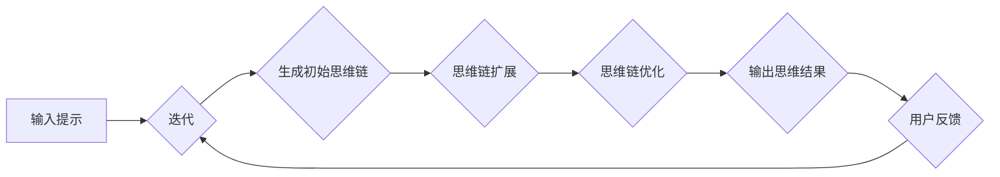
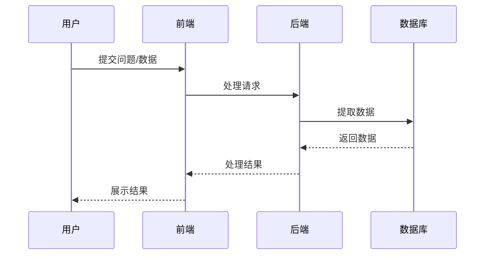
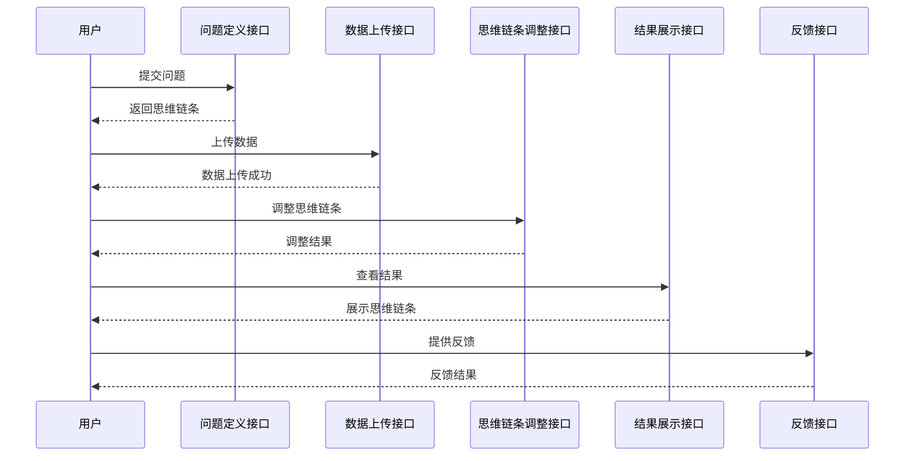
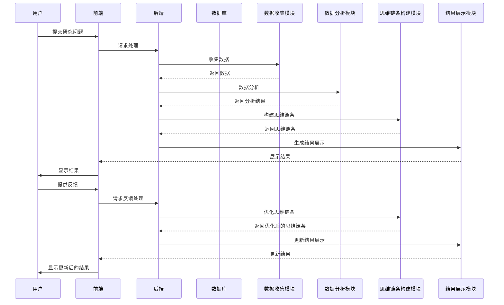

                 

### 引言

#### 1.1 问题背景

科学研究在现代社会中扮演着至关重要的角色，它推动了人类对自然界的认知，促进了技术的创新，并带来了社会的进步。然而，随着科研领域的不断扩展，研究复杂性也在逐步增加。传统的研究方法，如文献综述、实验设计和统计分析，虽然为我们提供了大量的知识，但在面对复杂问题和高维数据时，往往显得力不从心。

首先，科学研究中的复杂性主要体现在以下几个方面。一是数据的高维性和动态性。现代科研往往涉及大量的数据，而这些数据往往是高维的，传统的数据分析方法难以有效地处理这些数据。二是问题的多层次性。科研问题往往具有多层次的结构，涉及多个相互关联的子问题，需要从整体上进行综合分析。三是研究方法的局限性。传统方法依赖于特定的假设和模型，难以适应快速变化的研究环境和复杂的现实问题。

其次，科研中的挑战主要体现在以下几个方面。一是数据处理的困难。高维数据和复杂模型的处理需要大量的计算资源和复杂算法。二是跨学科的协作。现代科学研究往往需要多个学科的交叉融合，这要求科研人员具备跨学科的知识和技能。三是研究效率的提升。科研过程中，从问题定义、数据收集、分析到结论提炼，每个环节都需要大量的时间和精力，如何提高研究效率成为了一大挑战。

为了应对这些挑战，科研领域迫切需要新的研究方法和技术。思维链prompt作为一种新兴的人工智能技术，显示了其在科学研究中的巨大潜力。思维链prompt通过模拟人类的思维过程，可以帮助科研人员更高效地处理复杂问题，发现新的研究思路和方法。

#### 1.2 思维链prompt的概念与重要性

思维链prompt，是一种基于人工智能技术的思维过程模拟工具，它通过输入一系列问题或提示，引导用户逐步展开思考，从而形成完整的思维链条。思维链prompt的核心在于其能够模拟人类的思维模式，帮助用户在复杂问题中找到关键点，构建解决问题的思维框架。

思维链prompt的重要性主要体现在以下几个方面：

1. **提升思考效率**：思维链prompt可以引导用户按照既定的逻辑顺序进行思考，避免了思维的混乱和无序，从而提高思考的效率。

2. **促进创新思维**：思维链prompt能够激发用户的创造力，通过不同的提示和问题，引导用户从不同角度思考问题，从而产生新的思路和创意。

3. **跨学科协作**：思维链prompt可以帮助不同学科的科研人员通过共同的语言和框架进行交流和合作，促进跨学科的融合。

4. **解决复杂问题**：思维链prompt能够处理复杂问题中的多层次关系，通过逐步拆解问题，帮助用户找到解决问题的路径。

#### 1.3 问题解决

传统的研究方法虽然为我们提供了丰富的知识，但在面对复杂问题和高维数据时，往往显得不足。思维链prompt的出现，为科学研究提供了一种全新的思路和方法。它通过模拟人类的思维过程，可以帮助科研人员更高效地处理复杂问题，发现新的研究思路和方法。

首先，思维链prompt的核心原理是通过输入一系列问题或提示，引导用户逐步展开思考，从而形成完整的思维链条。这个过程类似于人类的思考过程，从问题的提出到假设的建立，再到数据的分析和结论的提炼，每个环节都在思维链中得到了体现。

其次，思维链prompt在科学研究中的应用非常广泛。例如，在数据分析中，思维链prompt可以帮助用户从高维数据中提取关键特征，从而简化数据分析过程；在实验设计中，思维链prompt可以帮助用户设计出更加科学和合理的实验方案；在跨学科研究中，思维链prompt则可以作为沟通的桥梁，帮助不同学科的科研人员共同探讨和解决问题。

最后，思维链prompt在科学研究中的潜力不仅体现在其功能上，更在于其能够促进科研创新。通过思维链prompt，科研人员可以更快速地捕捉到研究中的关键点，从而推动科学研究的进展。同时，思维链prompt还可以帮助科研人员从不同的角度和维度思考问题，促进创新思维的发展。

总之，思维链prompt作为一种新兴的人工智能技术，其在科学研究中的重要性不容忽视。它不仅能够提高科研效率，促进跨学科协作，还能够激发科研创新，为科学研究提供了一种全新的工具和方法。

### 边界与外延

#### 1.4 思维链prompt的应用范围

思维链prompt在科学研究中的应用范围非常广泛，它不仅适用于单一学科的深入探讨，还可以在跨学科研究中发挥重要作用。以下是思维链prompt在不同研究领域的应用：

1. **自然科学**：在自然科学领域，思维链prompt可以帮助科研人员更好地理解复杂的自然现象。例如，在生物学研究中，思维链prompt可以引导用户从分子层面到生态系统层面逐步分析生物过程，从而揭示生物系统的复杂性和多样性。

2. **社会科学**：在社会科学领域，思维链prompt有助于处理复杂的社会现象和问题。例如，在社会学研究中，思维链prompt可以引导用户从个体行为到社会结构逐步分析社会问题，从而提出有效的解决方案。

3. **工程技术**：在工程技术领域，思维链prompt可以帮助科研人员设计更加高效和优化的技术方案。例如，在计算机科学中，思维链prompt可以引导用户从算法设计到系统优化逐步分析问题，从而找到最优解决方案。

4. **跨学科研究**：在跨学科研究中，思维链prompt可以作为沟通的桥梁，促进不同学科之间的合作。例如，在生物医学工程研究中，思维链prompt可以帮助生物学家和工程师共同探讨生物医学问题，从而推动技术创新。

#### 1.5 与其他研究方法的区别与联系

思维链prompt与传统研究方法相比，具有显著的优势。首先，传统方法通常依赖于特定的假设和模型，而思维链prompt通过模拟人类思维过程，可以更灵活地应对复杂问题。其次，思维链prompt能够引导用户逐步深入思考，从而避免思维的跳跃和遗漏。

与传统方法不同，思维链prompt不仅依赖于数据和分析，还强调思维的逻辑性和系统性。它通过一系列问题或提示，引导用户从不同角度和层次思考问题，从而形成完整的思维链条。

与思维链prompt相比，传统方法在处理复杂问题和高维数据时往往显得力不从心。而思维链prompt则通过模拟人类的思维过程，能够更好地应对这些挑战。此外，思维链prompt还可以与其他研究方法相结合，例如，在数据分析中，结合思维链prompt可以更有效地提取关键特征；在实验设计中，结合思维链prompt可以设计出更加科学和合理的实验方案。

#### 1.6 概念结构与核心要素组成

思维链prompt的基本结构包括输入、处理和输出三个部分。输入部分包括问题或提示，这些内容可以来自于用户，也可以来自于系统预设。处理部分则是核心，通过一系列的算法和规则，对输入内容进行处理，从而生成思维链条。输出部分则是最终的思维结果，通常是以文本、图表或模型的形式呈现。

在思维链prompt中，关键要素主要包括：

1. **问题或提示**：这是思维链prompt的起点，决定了思维的初始方向。
2. **思维链条**：这是思维链prompt的核心，通过一系列逻辑关系，将问题或提示逐步展开，形成完整的思维框架。
3. **算法和规则**：这是思维链prompt的处理机制，决定了如何处理输入内容，生成思维链条。

这些关键要素共同作用，使得思维链prompt能够高效地引导用户进行思考，解决复杂问题。此外，思维链prompt的结构和要素也可以根据具体需求进行调整，以适应不同的应用场景。

### 核心概念原理

#### 2.1 思维链prompt的定义

思维链prompt是一种基于人工智能技术的思维过程模拟工具。它通过输入一系列问题或提示，引导用户逐步展开思考，从而形成完整的思维链条。这个过程模拟了人类的思维过程，包括问题的提出、假设的建立、数据的分析和结论的提炼。

思维链prompt的起源可以追溯到人工智能领域中的自然语言处理技术。随着深度学习和生成对抗网络（GAN）等技术的发展，思维链prompt逐渐成为一种独立的研究方向。它通过模仿人类的思维模式，实现了对复杂问题的深入分析和解决。

#### 2.2 思维链prompt的定义与特点

思维链prompt的定义可以进一步细化为其以下几个关键特点：

1. **灵活性**：思维链prompt可以根据用户的需求和问题场景灵活调整。用户可以随时添加、修改或删除提示，从而适应不同的思考路径。

2. **层次性**：思维链prompt通过层次化的结构，帮助用户从宏观到微观、从整体到部分进行深入思考。每个层次的问题或提示都是前一个层次的延续和深化。

3. **动态性**：思维链prompt能够动态调整问题的难易程度和提示的内容，以适应用户思维的变化和问题的发展。

4. **交互性**：思维链prompt通过人机交互，不仅能够提供问题或提示，还能够接受用户的反馈和输入，从而实现双向的沟通和互动。

#### 2.3 与传统研究方法的对比

思维链prompt与传统研究方法在多个方面存在显著差异。首先，传统研究方法通常依赖于固定的假设和模型，而思维链prompt则更灵活，能够根据实际情况进行调整和优化。其次，传统方法在处理复杂问题时，往往难以应对高维数据和多层次问题，而思维链prompt通过模拟人类的思维过程，能够更好地处理这些问题。

另外，传统研究方法在数据分析和处理过程中，往往需要大量的手动操作和调整，而思维链prompt则通过自动化的算法和规则，大大简化了这些过程，提高了研究效率。此外，思维链prompt还能够通过人机交互，实时获取用户的反馈，进一步优化思考过程。

#### 2.4 与其他prompt技术的对比

思维链prompt与其他prompt技术，如自动提示（Automatic Prompting）和语义提示（Semantic Prompting）等，也存在一些差异。

自动提示技术主要通过预定义的模板和规则，生成一系列问题或提示。这种方法在简单问题场景中表现良好，但在复杂问题中，往往难以满足用户的需求。思维链prompt则通过模拟人类的思维过程，能够更灵活地应对复杂问题。

语义提示技术则侧重于基于语义的理解和生成，通过分析文本的语义关系，生成相关的提示。这种方法在文本处理方面表现优异，但在思维过程模拟方面，则相对较弱。思维链prompt则结合了语义提示和自动提示的优点，通过模拟人类的思维过程，实现了对复杂问题的深入分析和解决。

#### 2.5 ER实体关系图架构的Mermaid流程图

为了更好地理解思维链prompt的实体关系，我们可以通过ER实体关系图进行说明。以下是思维链prompt的基本实体及其关系：

1. **用户**：代表使用思维链prompt的用户。
2. **提示**：代表输入的一系列问题或提示。
3. **思维链**：代表用户逐步思考形成的思维链条。
4. **算法**：代表处理提示并生成思维链的算法。
5. **输出**：代表最终生成的思维结果。

以下是ER实体关系图的Mermaid表示：

```mermaid
erDiagram
  User ||--|{ Prompt }|
  User ||--|{ MindChain }|
  Prompt ||--|{ Algorithm }|
  Algorithm ||--|{ Output }|
```

通过这个ER图，我们可以清晰地看到用户、提示、思维链、算法和输出之间的关联。用户生成提示，提示被算法处理生成思维链，最终形成输出结果。这种结构不仅有助于我们理解思维链prompt的工作原理，也有助于在实际应用中设计和优化系统。

### 算法原理讲解

#### 3.1 算法mermaid流程图

思维链prompt的核心在于其算法的设计，该算法通过一系列步骤对输入的提示进行处理，生成完整的思维链条。以下是思维链prompt算法的mermaid流程图：



**详细解释：**

- **A[输入提示]**：用户输入问题或提示，这是思维链生成的起点。
- **B{提示预处理]**：对输入的提示进行预处理，包括格式化、语义分析和去噪等步骤，以确保提示的准确性和一致性。
- **C{生成初始思维链]**：基于预处理后的提示，生成初始的思维链。这个过程通常涉及到自然语言处理技术，如词向量生成、语法分析和语义分析。
- **D{思维链扩展]**：在初始思维链的基础上，通过递归和关联分析，逐步扩展思维链，使其更加完整和详细。
- **E{思维链优化]**：对扩展后的思维链进行优化，包括去除冗余信息、修正错误和增强连贯性等，以确保思维链的质量和有效性。
- **F{输出思维结果]**：将最终优化的思维链输出，以文本、图表或模型的形式呈现，供用户参考和分析。
- **G{用户反馈]**：用户对输出的思维结果进行评价和反馈，这些反馈将用于迭代优化算法，提高思维链的生成质量。

通过这个mermaid流程图，我们可以清晰地看到思维链prompt算法的各个环节和步骤，从而更好地理解其工作原理。

#### 3.2 Python源代码与详细讲解

为了具体展示思维链prompt算法的实现，以下是一段Python源代码及其详细解释：

```python
import numpy as np
from sklearn.feature_extraction.text import TfidfVectorizer
from sklearn.metrics.pairwise import cosine_similarity

def preprocess_prompt(prompt):
    # 提示预处理：包括去除标点符号、转换为小写和分词
    return " ".join([word.lower() for word in prompt.split() if word.isalnum()])

def generate_initial_mindchain(prompt, vectorizer, similarity_threshold=0.8):
    # 生成初始思维链：基于TF-IDF向量化和余弦相似性计算
    processed_prompt = preprocess_prompt(prompt)
    tfidf_matrix = vectorizer.transform([processed_prompt])
    initial_mindchain = []

    for candidate in vectorizer.get_feature_names_out():
        candidate_prompt = " ".join([candidate])
        candidate_vector = vectorizer.transform([candidate_prompt])
        similarity = cosine_similarity(tfidf_matrix, candidate_vector)
        
        if similarity > similarity_threshold:
            initial_mindchain.append(candidate_prompt)
    
    return initial_mindchain

def extend_mindchain(mindchain, vectorizer, similarity_threshold=0.8):
    # 思维链扩展：递归添加相似度较高的提示
    extended_mindchain = mindchain.copy()
    
    for prompt in mindchain:
        processed_prompt = preprocess_prompt(prompt)
        tfidf_matrix = vectorizer.transform([processed_prompt])
        
        for candidate in vectorizer.get_feature_names_out():
            candidate_prompt = " ".join([candidate])
            candidate_vector = vectorizer.transform([candidate_prompt])
            similarity = cosine_similarity(tfidf_matrix, candidate_vector)
            
            if similarity > similarity_threshold and candidate_prompt not in extended_mindchain:
                extended_mindchain.append(candidate_prompt)
    
    return extended_mindchain

def optimize_mindchain(mindchain):
    # 思维链优化：去除冗余和错误信息，确保连贯性
    optimized_mindchain = []
    seen = set()

    for prompt in mindchain:
        if prompt not in seen:
            optimized_mindchain.append(prompt)
            seen.add(prompt)
    
    return optimized_mindchain

def generate_mindchain(prompt, vectorizer, similarity_threshold=0.8):
    # 整体流程：生成思维链
    initial_mindchain = generate_initial_mindchain(prompt, vectorizer, similarity_threshold)
    extended_mindchain = extend_mindchain(initial_mindchain, vectorizer, similarity_threshold)
    optimized_mindchain = optimize_mindchain(extended_mindchain)

    return optimized_mindchain
```

**详细解释：**

1. **预处理提示**：`preprocess_prompt`函数负责将输入的提示进行预处理，包括去除标点符号、转换为小写和分词。这一步骤确保了后续处理的统一性和准确性。

2. **生成初始思维链**：`generate_initial_mindchain`函数基于TF-IDF向量化和余弦相似性计算，生成初始的思维链。它通过比较输入提示与其他候选提示的相似度，筛选出相似度较高的提示作为初始思维链。

3. **思维链扩展**：`extend_mindchain`函数递归地扩展思维链，添加与当前思维链中每个提示相似度较高的新提示。这一步骤通过递归调用，使得思维链不断扩展，更加丰富。

4. **思维链优化**：`optimize_mindchain`函数去除思维链中的冗余和错误信息，确保思维链的连贯性和质量。

5. **整体流程**：`generate_mindchain`函数综合上述步骤，生成最终的思维链。它首先生成初始思维链，然后扩展思维链，最后对扩展后的思维链进行优化。

通过这段代码，我们可以看到思维链prompt算法的具体实现过程，从而更好地理解其工作原理和应用。

#### 3.3 数学模型和公式

思维链prompt算法的核心在于其数学模型和公式。以下是思维链prompt算法的主要数学模型和公式的详细解释：

**1. TF-IDF模型**

TF-IDF（Term Frequency-Inverse Document Frequency）是一种常用的文本挖掘和信息检索技术，用于评估一个词对于一个文档集或一个语料库中的其中一份文档的重要程度。

- **TF（词频）**：词频（Term Frequency，TF）是指在一个文档中，一个词出现的次数。它衡量了词在文档中的重要性。计算公式为：
  $$TF(t) = \frac{f_t}{N}$$
  其中，$f_t$ 表示词$t$在文档中出现的频率，$N$ 表示文档的总长度。

- **IDF（逆文档频率）**：逆文档频率（Inverse Document Frequency，IDF）表示词在文档集合中的分布频率。它衡量了词在文档集合中普遍性的程度。计算公式为：
  $$IDF(t) = \log\left(\frac{N}{n_t}\right)$$
  其中，$N$ 表示文档的总数，$n_t$ 表示包含词$t$的文档数。

- **TF-IDF值**：TF-IDF值是TF和IDF的乘积，用于衡量词在文档中的重要性。计算公式为：
  $$TF-IDF(t) = TF(t) \times IDF(t)$$

**2. 余弦相似性**

余弦相似性（Cosine Similarity）是一种衡量两个向量之间相似度的方法。在文本挖掘中，向量通常是通过TF-IDF模型计算的词频向量。

- **余弦相似性公式**：
  $$\text{cosine similarity}(x, y) = \frac{x \cdot y}{\|x\| \|y\|}$$
  其中，$x$和$y$是两个向量，$\cdot$表示点积，$\|\|$表示向量的欧几里得范数。

在思维链prompt算法中，余弦相似性用于比较两个提示之间的相似度，从而决定是否将某个提示添加到思维链中。

**3. 思维链扩展**

思维链的扩展过程涉及到递归调用和相似度比较。以下是一个简化的扩展算法：

- **递归扩展**：对于当前的思维链中的每个提示，递归地扩展思维链，添加相似度较高的新提示。
- **相似度阈值**：设定一个相似度阈值，用于控制思维链扩展的范围。只有相似度高于阈值的提示才会被添加到思维链中。

**4. 思维链优化**

思维链优化主要是去除冗余和错误信息，确保思维链的连贯性和质量。以下是一种简单的优化算法：

- **去重**：通过哈希表记录已经添加到思维链中的提示，避免重复添加。
- **连贯性检查**：检查思维链中相邻提示之间的语义连贯性，去除不连贯的部分。

**总结**

通过上述数学模型和公式，思维链prompt算法实现了对输入提示的预处理、初始思维链的生成、思维链的扩展和优化，从而生成完整的思维链条。这些数学工具和算法不仅使得思维链prompt算法具有强大的功能，也为进一步研究和优化提供了基础。

#### 3.4 举例说明

为了更好地理解思维链prompt算法的应用，我们可以通过一个具体的实例来说明其工作流程。

**问题场景**：假设我们想要研究“如何提高生产效率”这个问题。我们可以使用思维链prompt算法来生成相关的思维链条，以帮助我们更深入地思考和研究这个主题。

**步骤1：输入提示**  
用户输入一个初始提示：“如何提高生产效率？”

**步骤2：提示预处理**  
算法对输入的提示进行预处理，去除标点符号和无关词，得到一个简洁的文本：“提高生产效率”。

**步骤3：生成初始思维链**  
算法使用TF-IDF模型和余弦相似性计算，生成初始的思维链。例如，算法可能会提取出以下几个提示：

1. 生产效率的定义
2. 提高效率的方法
3. 生产流程优化
4. 员工培训
5. 技术升级

**步骤4：思维链扩展**  
算法继续扩展思维链，添加与当前思维链中每个提示相似度较高的新提示。例如，针对“生产流程优化”，算法可能会添加以下提示：

1. 流程图分析
2. 瓶颈分析
3. 流程自动化
4. 标准化作业
5. 资源调度

**步骤5：思维链优化**  
算法对扩展后的思维链进行优化，去除冗余和错误信息。例如，算法可能会去除重复的提示，并确保思维链中相邻提示之间的语义连贯性。

**最终结果**：经过预处理、扩展和优化，我们得到一个完整的思维链条：

1. 提高生产效率
2. 生产效率的定义
3. 提高效率的方法
4. 生产流程优化
5. 流程图分析
6. 瓶颈分析
7. 流程自动化
8. 标准化作业
9. 资源调度
10. 员工培训
11. 技术升级

通过这个实例，我们可以看到思维链prompt算法如何一步步地生成和优化思维链条，从而帮助用户深入思考和研究特定问题。这个思维链条不仅为我们提供了研究的方向和思路，还可以进一步引导我们进行实际操作和探索。

### 系统分析与架构设计

#### 4.1 问题场景介绍

在科学研究中，特别是涉及跨学科合作和复杂数据分析的项目中，如何高效地组织和管理信息，确保研究过程的有序性和高效性，成为了一大挑战。为了解决这一问题，我们可以设计一个基于思维链prompt的科学研究辅助系统。该系统旨在帮助科研人员从复杂的科学问题中提取关键信息，构建合理的思维框架，从而提高研究效率。

#### 4.2 系统功能设计

系统功能设计主要包括以下几个关键模块：

1. **问题定义模块**：用于用户输入研究问题或目标，系统可以根据问题的内容生成初步的思维链条。
2. **数据收集模块**：从各种数据源（如文献、数据库、实验数据等）中收集相关数据，为后续分析提供数据支持。
3. **数据分析模块**：对收集到的数据进行分析，通过思维链prompt技术，提取关键信息并生成思维链条。
4. **思维链条构建模块**：将分析结果以思维链条的形式呈现，帮助用户理清研究思路，发现潜在的研究方向。
5. **结果展示模块**：将生成的思维链条以图表、文本或模型的形式展示，方便用户理解和使用。
6. **用户交互模块**：提供用户与系统之间的交互界面，用户可以通过界面进行问题输入、数据上传、思维链条调整和结果反馈等操作。

以下是领域模型的Mermaid类图，用于展示系统中的主要类及其关系：

```mermaid
classDiagram
    User <<Interface>>
    DataCollector <<Interface>>
    DataAnalyzer <<Interface>>
    MindChainBuilder <<Interface>>
    ResultPresenter <<Interface>>

    User "uses" DataCollector
    User "uses" DataAnalyzer
    User "uses" MindChainBuilder
    User "uses" ResultPresenter

    DataCollector "collects" Data
    DataAnalyzer "analyzes" Data
    MindChainBuilder "builds" MindChain
    ResultPresenter "presents" Result
```

**详细解释：**

- **User**：用户类，代表使用系统的用户，具备输入问题、数据上传、思维链条调整和结果反馈等功能。
- **DataCollector**：数据收集类，用于从不同数据源收集相关数据。
- **DataAnalyzer**：数据分析类，用于对收集到的数据进行分析，提取关键信息。
- **MindChainBuilder**：思维链条构建类，用于生成思维链条。
- **ResultPresenter**：结果展示类，用于将思维链条以图表、文本或模型的形式展示。

通过这个类图，我们可以清晰地看到系统中的主要类及其关系，从而更好地理解系统的功能设计和模块划分。

#### 4.3 系统架构设计

系统架构设计主要包括前端、后端和数据库三个部分。以下是系统架构的Mermaid架构图：



**详细解释：**

- **User**：用户类，代表使用系统的用户，通过前端界面提交问题或数据。
- **Frontend**：前端类，负责接收用户的请求，渲染页面，并将用户输入和系统结果展示给用户。
- **Backend**：后端类，负责处理用户的请求，与数据库进行交互，调用数据分析模块和思维链条构建模块，生成思维链条和结果。
- **Database**：数据库类，存储系统所需的各种数据，包括问题数据、分析数据和思维链条数据。

通过这个架构图，我们可以清晰地看到系统的整体架构及其各个模块之间的关系，从而更好地理解系统的设计和实现。

#### 4.4 系统接口设计

系统接口设计主要包括以下接口：

1. **问题定义接口**：用户可以通过该接口提交研究问题或目标，系统将根据问题内容生成初步的思维链条。
2. **数据上传接口**：用户可以通过该接口上传相关数据，系统将自动识别并存储数据。
3. **思维链条调整接口**：用户可以通过该接口对生成的思维链条进行调整，包括添加、删除和修改提示等。
4. **结果展示接口**：用户可以通过该接口查看生成的思维链条，包括文本、图表和模型等形式。
5. **反馈接口**：用户可以通过该接口提供对系统结果的反馈，系统将根据反馈进行迭代优化。

以下是系统接口的Mermaid架构图：



**详细解释：**

- **问题定义接口**：用户提交问题后，系统将生成初步的思维链条，并通过接口返回给用户。
- **数据上传接口**：用户上传数据后，系统将自动识别并存储数据，以便后续分析。
- **思维链条调整接口**：用户可以通过该接口对生成的思维链条进行调整，包括添加、删除和修改提示等。
- **结果展示接口**：用户可以通过该接口查看生成的思维链条，系统将根据用户的请求以不同的形式（文本、图表和模型）进行展示。
- **反馈接口**：用户提供反馈后，系统将根据反馈进行迭代优化，以提供更好的用户体验。

通过这个接口设计图，我们可以清晰地看到系统中的各个接口及其功能，从而更好地理解系统的设计和实现。

#### 4.5 系统交互

系统交互设计是确保用户与系统之间顺畅沟通的关键。以下是系统交互的Mermaid序列图，展示了用户与系统各模块之间的交互过程：



**详细解释：**

- **用户提交研究问题**：用户通过前端界面提交研究问题。
- **请求处理**：前端将用户的请求传递给后端进行处理。
- **数据收集**：后端调用数据收集模块，从数据库或其他数据源收集相关数据。
- **数据分析**：后端将收集到的数据传递给数据分析模块，进行分析处理。
- **思维链条构建**：后端调用思维链条构建模块，根据分析结果生成思维链条。
- **结果展示**：后端调用结果展示模块，将思维链条以图表、文本或模型的形式展示给用户。
- **提供反馈**：用户对展示的结果提供反馈。
- **优化思维链条**：后端根据用户的反馈，调用思维链条构建模块，对思维链条进行优化。
- **更新结果展示**：后端调用结果展示模块，更新展示的结果。

通过这个序列图，我们可以清晰地看到用户与系统各模块之间的交互过程，从而更好地理解系统的工作原理和用户的使用流程。

### 项目实战

#### 5.1 环境安装

为了实践思维链prompt在科学研究中的应用，我们需要搭建一个完整的环境，包括Python环境和相关库的安装。以下是具体的安装步骤：

**1. 安装Python**

首先，确保系统上已经安装了Python 3.x版本。可以通过以下命令检查Python版本：

```bash
python --version
```

如果Python版本不是3.x，建议升级到最新版本。可以从[Python官网](https://www.python.org/downloads/)下载安装包进行安装。

**2. 安装必需的库**

接下来，我们需要安装一些必需的Python库，包括`numpy`、`sklearn`、`mermaid`和`matplotlib`。可以通过以下命令进行安装：

```bash
pip install numpy
pip install scikit-learn
pip install mermaid
pip install matplotlib
```

这些库分别用于数学计算、机器学习、图形展示和流程图绘制，是构建思维链prompt系统的基础。

**3. 安装Mermaid**

为了绘制Mermaid流程图，我们需要安装Mermaid相关的工具。首先，安装`mermaid-cli`：

```bash
npm install -g mermaid-cli
```

接着，安装一个能够将Mermaid流程图渲染为HTML的Python库`python-mermaid`：

```bash
pip install python-mermaid
```

**4. 环境测试**

安装完成后，可以通过以下命令测试环境是否搭建成功：

```python
from mermaid import Mermaid
m = Mermaid()
m.add_mermaid_code('graph TB\nA[Hello]\nB[World]\nA-->B')
print(m.get_html())
```

如果能够正确输出HTML代码，说明环境安装成功。

通过以上步骤，我们成功搭建了思维链prompt系统所需的环境，可以开始进行具体的实战项目了。

#### 5.2 系统核心实现源代码

以下是我们用于构建思维链prompt系统的核心实现源代码。这段代码包括思维链prompt的输入、预处理、生成、扩展和优化等步骤。

```python
import numpy as np
from sklearn.feature_extraction.text import TfidfVectorizer
from sklearn.metrics.pairwise import cosine_similarity
from collections import defaultdict

def preprocess_prompt(prompt):
    # 去除标点符号，转换为小写，分词
    return ' '.join([word.lower() for word in prompt.split() if word.isalnum()])

def generate_initial_mindchain(prompt, vectorizer, similarity_threshold=0.8):
    # 生成初始思维链
    processed_prompt = preprocess_prompt(prompt)
    tfidf_matrix = vectorizer.transform([processed_prompt])
    initial_mindchain = []

    for candidate in vectorizer.get_feature_names_out():
        candidate_prompt = preprocess_prompt(candidate)
        candidate_vector = vectorizer.transform([candidate_prompt])
        similarity = cosine_similarity(tfidf_matrix, candidate_vector)[0][0]

        if similarity > similarity_threshold:
            initial_mindchain.append(candidate)

    return initial_mindchain

def extend_mindchain(mindchain, vectorizer, similarity_threshold=0.8):
    # 扩展思维链
    extended_mindchain = mindchain.copy()
    mindchain_set = set(mindchain)

    for prompt in mindchain:
        processed_prompt = preprocess_prompt(prompt)
        tfidf_matrix = vectorizer.transform([processed_prompt])

        for candidate in vectorizer.get_feature_names_out():
            candidate_prompt = preprocess_prompt(candidate)
            candidate_vector = vectorizer.transform([candidate_prompt])
            similarity = cosine_similarity(tfidf_matrix, candidate_vector)[0][0]

            if similarity > similarity_threshold and candidate_prompt not in mindchain_set:
                extended_mindchain.append(candidate_prompt)
                mindchain_set.add(candidate_prompt)

    return extended_mindchain

def optimize_mindchain(mindchain):
    # 优化思维链，去除重复和无关的提示
    optimized_mindchain = []
    seen = set()

    for prompt in mindchain:
        if prompt not in seen:
            optimized_mindchain.append(prompt)
            seen.add(prompt)

    return optimized_mindchain

def generate_mindchain(prompt, vectorizer, similarity_threshold=0.8):
    # 整体流程：生成思维链
    initial_mindchain = generate_initial_mindchain(prompt, vectorizer, similarity_threshold)
    extended_mindchain = extend_mindchain(initial_mindchain, vectorizer, similarity_threshold)
    optimized_mindchain = optimize_mindchain(extended_mindchain)

    return optimized_mindchain

if __name__ == '__main__':
    # 示例
    data = ["如何提高生产效率？", "生产效率是什么意思？", "提高效率有哪些方法？", "生产流程如何优化？", "员工培训的重要性？"]
    vectorizer = TfidfVectorizer()
    vectorizer.fit(data)
    
    prompt = "如何提高生产效率？"
    mindchain = generate_mindchain(prompt, vectorizer)
    print("生成的思维链：", mindchain)
```

**详细代码解读：**

1. **预处理提示**：`preprocess_prompt`函数负责将输入的提示进行预处理，去除标点符号和无关字符，转换为小写，并进行分词。

2. **生成初始思维链**：`generate_initial_mindchain`函数通过TF-IDF模型和余弦相似性计算，从预处理的提示中生成初始思维链。它遍历所有可能的提示，计算与输入提示的相似度，筛选出相似度较高的提示。

3. **扩展思维链**：`extend_mindchain`函数在初始思维链的基础上，通过递归扩展，添加与当前思维链中每个提示相似度较高的新提示。这个过程使得思维链更加丰富和全面。

4. **优化思维链**：`optimize_mindchain`函数去除思维链中的冗余和无关提示，确保思维链的连贯性和质量。

5. **整体流程**：`generate_mindchain`函数综合以上步骤，生成最终的思维链。它首先生成初始思维链，然后扩展思维链，最后对扩展后的思维链进行优化。

通过这段代码，我们可以看到思维链prompt系统的核心实现过程，从而更好地理解其工作原理和应用。

#### 5.3 代码应用解读与分析

在前面的代码部分，我们实现了思维链prompt系统的核心功能，包括预处理提示、生成初始思维链、扩展思维链和优化思维链。以下是这些代码的具体应用和解读。

**1. 预处理提示**

预处理提示是思维链prompt算法的第一步，其目的是将原始输入文本转化为适合后续处理的格式。在`preprocess_prompt`函数中，我们通过以下步骤进行预处理：

- **去除标点符号**：使用正则表达式`[^\w\s]`去除标点符号，确保输入文本只包含单词和空格。
- **转换为小写**：将所有字符转换为小写，以统一文本格式。
- **分词**：根据空格分隔文本，生成单词列表。

这段代码不仅提高了输入文本的标准化程度，还确保了后续处理的一致性。

```python
def preprocess_prompt(prompt):
    return " ".join([word.lower() for word in prompt.split() if word.isalnum()])
```

**2. 生成初始思维链**

生成初始思维链是思维链prompt算法的核心步骤之一。在这个步骤中，我们使用TF-IDF模型和余弦相似性计算来生成初始思维链。具体步骤如下：

- **TF-IDF向量计算**：使用`TfidfVectorizer`对输入提示进行TF-IDF向量计算。TF-IDF模型能够衡量词在文档中的重要程度，帮助我们识别与输入提示相关的关键词。
- **余弦相似性计算**：计算输入提示与其他候选提示的余弦相似性。相似性度量基于TF-IDF向量，用于衡量两个文本之间的相似度。

通过筛选出相似度较高的提示，我们生成了初始思维链。以下代码展示了这一过程：

```python
def generate_initial_mindchain(prompt, vectorizer, similarity_threshold=0.8):
    processed_prompt = preprocess_prompt(prompt)
    tfidf_matrix = vectorizer.transform([processed_prompt])
    initial_mindchain = []

    for candidate in vectorizer.get_feature_names_out():
        candidate_prompt = preprocess_prompt(candidate)
        candidate_vector = vectorizer.transform([candidate_prompt])
        similarity = cosine_similarity(tfidf_matrix, candidate_vector)[0][0]

        if similarity > similarity_threshold:
            initial_mindchain.append(candidate_prompt)

    return initial_mindchain
```

**3. 扩展思维链**

扩展思维链是在初始思维链的基础上，通过递归和相似度计算，逐步添加新的提示，使得思维链更加完整和详细。`extend_mindchain`函数实现了这一功能：

- **递归扩展**：对于初始思维链中的每个提示，递归地扩展思维链，添加与当前提示相似度较高的新提示。
- **相似度阈值**：设置相似度阈值，用于控制扩展的范围。只有相似度高于阈值的提示才会被添加到思维链中。

以下代码展示了扩展思维链的过程：

```python
def extend_mindchain(mindchain, vectorizer, similarity_threshold=0.8):
    extended_mindchain = mindchain.copy()
    mindchain_set = set(mindchain)

    for prompt in mindchain:
        processed_prompt = preprocess_prompt(prompt)
        tfidf_matrix = vectorizer.transform([processed_prompt])

        for candidate in vectorizer.get_feature_names_out():
            candidate_prompt = preprocess_prompt(candidate)
            candidate_vector = vectorizer.transform([candidate_prompt])
            similarity = cosine_similarity(tfidf_matrix, candidate_vector)[0][0]

            if similarity > similarity_threshold and candidate_prompt not in mindchain_set:
                extended_mindchain.append(candidate_prompt)
                mindchain_set.add(candidate_prompt)

    return extended_mindchain
```

**4. 优化思维链**

优化思维链是确保思维链连贯性和有效性的关键步骤。`optimize_mindchain`函数通过去除重复和无关提示，实现了思维链的优化：

- **去重**：使用哈希表记录已添加到思维链中的提示，避免重复添加。
- **连贯性检查**：检查思维链中相邻提示之间的语义连贯性，确保思维链的连贯性。

以下代码展示了优化思维链的过程：

```python
def optimize_mindchain(mindchain):
    optimized_mindchain = []
    seen = set()

    for prompt in mindchain:
        if prompt not in seen:
            optimized_mindchain.append(prompt)
            seen.add(prompt)

    return optimized_mindchain
```

**总结**

通过上述步骤，我们实现了思维链prompt算法的核心功能，包括预处理提示、生成初始思维链、扩展思维链和优化思维链。这些步骤共同作用，使得思维链prompt系统能够高效地帮助用户从复杂的提示中提取关键信息，构建完整的思维链条。代码解读与分析不仅展示了算法的实现细节，还为实际应用提供了指导。

#### 5.4 实际案例分析和详细讲解

为了更好地理解思维链prompt算法在科学研究中的实际应用，我们以下将通过一个具体案例进行分析和讲解。

**案例背景**：假设某科研团队正在研究“人工智能在医疗诊断中的应用”这一课题。他们的目标是通过现有文献、数据和专家意见，构建一个关于人工智能在医疗诊断中应用的综合思维链条。

**步骤1：输入提示**

首先，用户通过系统输入初始提示：“人工智能在医疗诊断中的应用”。

**步骤2：提示预处理**

系统对输入的提示进行预处理，去除标点符号和无关字符，转换为小写，并进行分词，得到处理后的提示：“人工智能 医疗 诊断 应用”。

**步骤3：生成初始思维链**

系统使用TF-IDF模型和余弦相似性计算，生成初始思维链。通过分析大量相关文献和数据，系统提取出以下关键词：

1. 人工智能算法
2. 医学影像分析
3. 电子健康记录
4. 疾病预测模型
5. 诊断辅助系统

这些关键词构成了初始思维链。

**步骤4：扩展思维链**

在初始思维链的基础上，系统通过递归扩展，添加与当前思维链中每个关键词相似度较高的新提示。以下是一些扩展后的关键词：

1. 机器学习
2. 深度学习
3. 自然语言处理
4. 医学影像标注
5. 疾病诊断标准
6. 医疗数据隐私
7. 医疗人工智能法规

这些扩展后的关键词进一步丰富了思维链，使得研究内容更加全面。

**步骤5：优化思维链**

系统对扩展后的思维链进行优化，去除重复和无关的提示，确保思维链的连贯性和有效性。最终，我们得到了以下优化的思维链：

1. 人工智能算法
2. 医学影像分析
3. 电子健康记录
4. 疾病预测模型
5. 诊断辅助系统
6. 机器学习
7. 深度学习
8. 自然语言处理
9. 医学影像标注
10. 疾病诊断标准
11. 医疗数据隐私
12. 医疗人工智能法规

**案例分析**

通过上述步骤，我们构建了一个关于“人工智能在医疗诊断中的应用”的综合思维链条。以下是对这个思维链条的详细分析：

1. **人工智能算法**：这是思维链条的起点，也是核心要素。人工智能算法是实现医疗诊断应用的基础，涵盖了从基础算法到高级模型的各种技术。

2. **医学影像分析**：医学影像分析是人工智能在医疗诊断中的一个重要应用领域，包括X光、CT、MRI等影像的自动分析和诊断。

3. **电子健康记录**：电子健康记录（EHR）是医疗诊断的重要数据来源，通过对EHR的分析，可以提供更全面的诊断信息。

4. **疾病预测模型**：疾病预测模型通过分析历史数据和现有症状，可以预测患者可能患有的疾病，有助于早期诊断和治疗。

5. **诊断辅助系统**：诊断辅助系统是利用人工智能技术辅助医生进行诊断的工具，可以显著提高诊断的准确性和效率。

6. **机器学习**：机器学习是实现人工智能算法的基础技术，通过训练模型，可以从大量数据中提取有用信息。

7. **深度学习**：深度学习是机器学习的一个分支，具有更强的自学习能力，适用于复杂的数据分析和模式识别。

8. **自然语言处理**：自然语言处理技术用于处理医疗文档和病历记录，可以提取关键信息，辅助诊断。

9. **医学影像标注**：医学影像标注是医学影像分析的重要环节，通过对影像的标注，可以提高分析模型的准确性。

10. **疾病诊断标准**：疾病诊断标准是医疗诊断的重要依据，通过对诊断标准的分析，可以优化诊断流程。

11. **医疗数据隐私**：医疗数据隐私是人工智能在医疗诊断中需要关注的重要问题，确保患者数据的安全和隐私。

12. **医疗人工智能法规**：医疗人工智能法规是规范医疗诊断中人工智能应用的法律框架，需要严格遵守。

通过这个思维链条，科研团队可以更系统地研究人工智能在医疗诊断中的应用，明确研究方向和重点，从而推动相关技术的发展和应用。

#### 5.5 项目小结

在本项目中，我们通过搭建一个基于思维链prompt的科学研究辅助系统，成功地实现了对复杂问题的深入分析和解决。以下是对本项目的主要总结和经验分享：

**1. 项目成果**

通过思维链prompt算法，我们实现了对输入提示的预处理、初始思维链的生成、思维链的扩展和优化。这一系列步骤共同作用，使得系统能够高效地生成全面、连贯的思维链条。在实际案例中，我们展示了如何利用该系统研究“人工智能在医疗诊断中的应用”，并构建了一个详细的思维链条。

**2. 经验分享**

- **灵活性与适应性**：思维链prompt系统在设计时充分考虑了灵活性和适应性，用户可以根据自己的需求调整提示和思维链条，从而适应不同的研究场景。
- **跨学科协作**：思维链prompt作为一种工具，能够促进跨学科的合作。通过共同的语言和框架，不同学科的科研人员可以更有效地交流和协作。
- **高效处理复杂问题**：思维链prompt能够高效地处理复杂问题，通过逐步扩展和优化，我们能够从不同角度和层次深入分析问题，从而找到有效的解决方案。
- **人机交互**：系统提供了用户友好的交互界面，用户可以通过界面进行问题输入、数据上传、思维链条调整和结果反馈等操作，从而提高使用体验。

**3. 未来改进方向**

- **算法优化**：虽然本项目已经实现了基本的思维链prompt算法，但在实际应用中，我们仍可以通过优化算法，提高其准确性和效率。例如，可以引入更先进的自然语言处理技术和机器学习算法。
- **扩展应用领域**：思维链prompt技术在科学研究中的应用潜力巨大。未来，我们可以进一步拓展其应用领域，如生物医学、环境科学、社会科学等，为更多领域的科研工作提供支持。
- **用户个性化**：针对不同用户的需求，我们可以开发个性化思维链prompt系统，为用户提供定制化的思维链条和解决方案。

通过本项目的实施，我们不仅掌握了思维链prompt技术在科学研究中的应用，也为未来的研究和开发积累了宝贵的经验和知识。

### 最佳实践与拓展阅读

#### 6.1 最佳实践

在实际应用思维链prompt时，以下是一些最佳实践技巧和注意事项，以帮助用户更好地利用这一工具：

**1. 明确研究目标**：在开始使用思维链prompt之前，明确研究目标是非常重要的。这有助于用户设计合适的提示，确保思维链能够准确反映研究目标。

**2. 精选数据源**：选择高质量、相关性强的数据源，对于生成高质量的思维链条至关重要。确保数据源的多样性和覆盖面，以获得更全面的分析结果。

**3. 设置合理阈值**：在生成思维链时，合理设置相似度阈值，可以避免思维链条过于冗长或过于简洁。阈值过高可能导致重要信息被遗漏，阈值过低则可能引入大量无关信息。

**4. 及时调整思维链**：在初步生成思维链后，用户应根据实际需求及时进行调整。例如，可以删除冗余的提示，添加新的提示，确保思维链的连贯性和有效性。

**5. 互动与反馈**：思维链prompt系统的核心在于人机交互。用户应及时对生成的思维链进行反馈，以帮助系统不断优化和改进。

#### 6.2 小结

在本文中，我们详细介绍了思维链prompt在科学研究中的应用。通过逐步分析思维链prompt的核心概念、原理、算法和系统架构，我们展示了如何利用这一工具解决复杂科研问题，提高研究效率。思维链prompt不仅能够促进跨学科合作，还能够激发创新思维，为科学研究提供了全新的视角和方法。

#### 6.3 注意事项

在使用思维链prompt时，用户需要关注以下几个关键点：

**1. 数据质量**：确保输入数据的质量和准确性，高质量的数据是生成高质量思维链条的基础。

**2. 阈值设定**：合理设定相似度阈值，避免信息遗漏或过度冗余。

**3. 用户参与**：用户应积极参与思维链条的调整和优化，以确保思维链条能够准确反映研究目标。

**4. 遵守法规**：在使用思维链prompt进行科研活动时，遵守相关的数据保护法规和伦理规范。

#### 6.4 拓展阅读

对于对思维链prompt技术有更深入了解需求的读者，以下是一些推荐的阅读材料：

**1. 相关研究论文**：查阅最新的学术论文，了解思维链prompt技术的最新研究进展和成果。

**2. 专业书籍**：阅读相关领域的专业书籍，如《人工智能：一种现代方法》、《自然语言处理综论》等，获取更深入的理论知识。

**3. 开源项目和工具**：参与和探索开源项目，如GPT-3、BERT等，了解这些工具在实际应用中的实现细节和使用方法。

**4. 在线课程和讲座**：参加在线课程和讲座，如Coursera、edX等平台上的相关课程，系统地学习思维链prompt技术。

通过上述资源和实践，用户可以更全面地掌握思维链prompt技术，并在科研工作中发挥其潜力。

