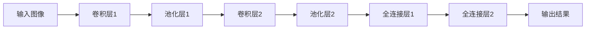
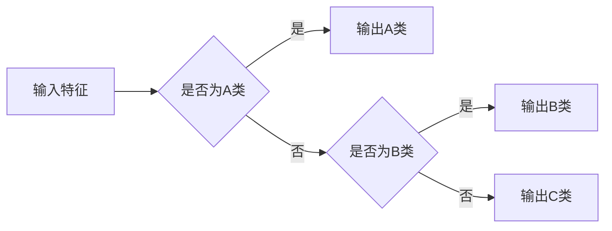
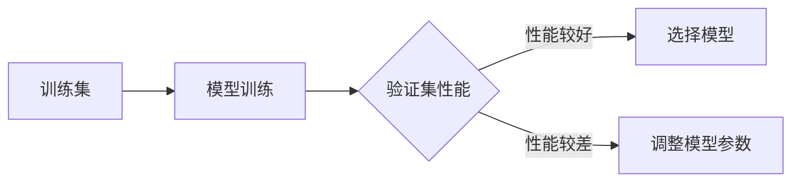
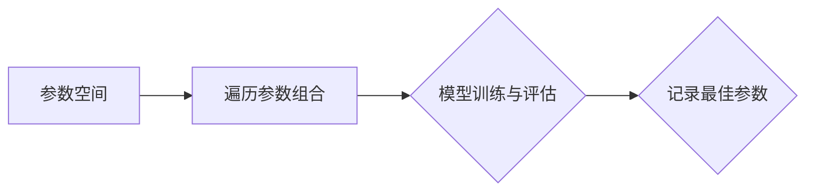

                 

# 思维链prompt：AI问题分解与解决的艺术

## 关键词

- AI问题分解
- 解决策略
- 深度学习算法
- 分而治之
- 系统架构设计

## 摘要

本文旨在探讨AI问题分解与解决的艺术。我们将详细分析问题分解的方法、策略，以及相关的算法原理和实践案例。通过本文的阅读，您将了解如何有效地将复杂问题拆解为可管理的部分，并选择合适的解决方案来提升AI应用的性能和效率。

### 目录大纲

----------------------------------------------------------------

## 第一部分: 引言

### 第1章: 引言

#### 1.1 背景介绍

#### 1.2 核心概念与联系

## 第二部分: AI问题分解原理

### 第2章: AI问题分解原理

#### 2.1 问题分解方法

#### 2.2 案例分析

#### 2.3 原理解释与数学模型

## 第三部分: AI问题解决策略

### 第3章: AI问题解决策略

#### 3.1 算法原理

#### 3.2 选择策略

#### 3.3 案例分析

## 第四部分: 实际案例与项目实战

### 第4章: 实际案例与项目实战

#### 4.1 环境安装与配置

#### 4.2 系统核心实现

#### 4.3 项目实战

#### 4.4 项目小结

#### 4.5 最佳实践 tips

## 第五部分: 小结与拓展

### 第5章: 小结与拓展

#### 5.1 总结

#### 5.2 注意事项

#### 5.3 拓展阅读

### 第1章: 引言

#### 1.1 背景介绍

随着人工智能技术的发展，AI问题分解与解决成为了研究的热点。在AI领域，问题分解与解决的方法和技巧不仅对学术研究具有重要意义，也对实际应用产生深远影响。如何将复杂问题拆解为可管理的部分，并使用算法解决，是人工智能研究和开发中不可忽视的重要环节。

在过去的几十年中，AI领域取得了诸多突破，例如深度学习、强化学习等。然而，面对复杂的实际问题，我们仍然需要掌握有效的分解与解决方法。这不仅有助于提高算法的性能，还能帮助我们更好地理解问题的本质。

本文将围绕AI问题分解与解决展开讨论，旨在为读者提供一种系统化的思维模式，以应对复杂的AI问题。

#### 1.2 核心概念与联系

在本节中，我们将介绍AI问题分解与解决中的核心概念，并探讨这些概念之间的联系。

**核心概念原理**：

- **问题分解**：将复杂问题拆分为更简单的子问题。这一过程通常需要识别问题的关键要素，并将它们组合成一个层次结构。
- **解决策略**：选择合适的方法或算法来解决子问题。解决策略的选择取决于问题的性质、目标和可用的资源。

**概念属性特征对比表格**：

| 概念     | 定义                                                         | 特征对比               |
|----------|--------------------------------------------------------------|------------------------|
| 问题分解 | 将复杂问题拆分为子问题                                       | 可操作性、分解层次   |
| 解决策略 | 选择算法或方法解决子问题                                     | 有效性、适用范围     |

**ER实体关系图架构的Mermaid流程图**：

```mermaid
erDiagram
    AI问题问题 --> 问题分解 : 分解
    AI问题问题 --> 解决策略 : 解决
    问题分解 --> 子问题 : 分解
    解决策略 --> 子问题解决方案 : 解决
```

在这个ER图中，我们可以看到问题、问题分解和解决策略之间的关系。问题分解是问题与子问题之间的桥梁，而解决策略则是连接子问题与子问题解决方案的纽带。

#### 1.3 边界与外延

本文的研究范围涵盖AI问题的各种类型，不仅限于特定领域。在AI领域中，问题分解与解决的方法和技术具有广泛的适用性。无论是自然语言处理、计算机视觉还是推荐系统，复杂问题都可以通过问题分解与解决的方法得到有效处理。

然而，需要注意的是，不同领域的问题可能具有独特的特征和复杂性。因此，在具体应用时，需要根据问题的性质和特点选择合适的方法和策略。

**核心要素组成**：

- **算法**：算法是实现问题分解与解决的核心。常见的算法包括深度学习算法、传统机器学习算法等。
- **模型**：模型是对问题的一种抽象表示，用于指导算法的实现。常见的模型包括神经网络、决策树等。
- **流程**：流程是问题分解与解决的实际操作步骤。它通常包括问题定义、数据预处理、模型训练和模型评估等环节。
- **实践案例**：实践案例是验证问题分解与解决方法有效性的关键。通过实际案例，我们可以看到方法在不同场景中的应用效果。

### 第2章: AI问题分解原理

#### 2.1 问题分解方法

问题分解是将复杂问题拆分为更简单子问题的过程。这一过程有助于降低问题的复杂度，使其更易于理解和解决。在本节中，我们将介绍几种常见的问题分解方法。

**树状分解法**：

树状分解法是一种常用的分解方法，它将问题视为树状结构，逐步拆解。具体步骤如下：

1. **确定问题**：明确需要解决的问题。
2. **识别关键要素**：识别影响问题的关键要素。
3. **构建树状结构**：将问题分解为子问题，并形成树状结构。
4. **递归分解**：对每个子问题进行进一步分解，直到达到可解决问题的程度。

**分而治之策略**：

分而治之策略是一种将问题划分为独立部分，分别解决的方法。其核心思想是将复杂问题分解为多个可管理的子问题，然后分别解决。具体步骤如下：

1. **确定问题**：明确需要解决的问题。
2. **分解问题**：将问题划分为独立的部分。
3. **递归解决**：分别解决每个部分，并合并结果。

**示例**：

假设我们需要解决一个问题：计算一个数字序列的和。我们可以使用树状分解法和分而治之策略来解决这个问题。

**树状分解法**：

1. **确定问题**：计算数字序列的和。
2. **识别关键要素**：数字序列、和。
3. **构建树状结构**：
```
       计算
      /     \
     1      2
    / \    / \
   3   4  5   6
```
4. **递归分解**：分别计算每个子序列的和，直到计算单个数字。

**分而治之策略**：

1. **确定问题**：计算数字序列的和。
2. **分解问题**：将数字序列划分为两个子序列。
3. **递归解决**：分别计算两个子序列的和，然后合并结果。

#### 2.2 案例分析

在本节中，我们将通过一个实际案例来展示问题分解的方法。

**案例1：文本分类问题**

文本分类是一种常见的自然语言处理任务，其目标是将文本数据分类到预定义的类别中。以下是一个简单的文本分类问题的分解过程：

1. **问题定义**：给定一个文本序列，将其分类到预定义的类别中。
2. **识别关键要素**：文本、类别、分类器。
3. **分解问题**：
   - **文本预处理**：对文本进行分词、去停用词等预处理操作。
   - **特征提取**：从预处理后的文本中提取特征。
   - **模型训练**：使用特征数据训练分类模型。
   - **模型评估**：评估模型的分类性能。

通过上述分解，我们可以看到文本分类问题被拆解为一系列更简单的子问题，每个子问题都可以独立解决。

#### 2.3 原理解释与数学模型

问题分解不仅需要方法，还需要理解其背后的原理。在本节中，我们将介绍问题分解的数学原理，并使用一个具体的数学模型进行解释。

**数学模型**：

假设我们有一个复杂的问题A，它可以被拆分为若干个子问题B1, B2, ..., Bn。每个子问题B可以表示为一个函数，其输入是问题的输入数据，输出是子问题的解。我们可以使用条件概率来描述子问题之间的关系。

条件概率的公式为：

\[ P(A|B) = \frac{P(B|A) \cdot P(A)}{P(B)} \]

其中，P(A|B)表示在子问题B发生的情况下，问题A发生的概率；P(B|A)表示在问题A发生的情况下，子问题B发生的概率；P(A)表示问题A发生的概率；P(B)表示子问题B发生的概率。

**详细讲解与举例**：

假设我们有一个事件A：从一副扑克牌中抽取一张红桃牌；事件B：从一副扑克牌中抽取一张红桃A。

根据条件概率公式，我们可以计算在抽取红桃A的情况下，抽取红桃牌的概率。

\[ P(A|B) = \frac{P(B|A) \cdot P(A)}{P(B)} \]

其中，P(A) = 1/4，因为一副扑克牌中有4种花色，每种花色的概率相等；P(B) = 1/52，因为一副扑克牌中有52张牌，抽取红桃A的概率是1/52；P(B|A) = 1/4，因为一旦抽取了红桃牌，抽取红桃A的概率仍然是1/4。

将这些值代入公式中，我们得到：

\[ P(A|B) = \frac{1/4 \cdot 1/4}{1/52} = \frac{1}{13} \]

这意味着在抽取红桃A的情况下，抽取红桃牌的概率是1/13。

通过这个例子，我们可以看到条件概率如何帮助我们理解问题分解。在实际的AI问题中，我们可以使用类似的原理来分解复杂问题，并计算各个子问题之间的关系。

### 第3章: AI问题解决策略

在解决了问题的分解之后，如何选择合适的方法和算法来解决分解后的子问题，是AI问题解决的关键。在本节中，我们将介绍几种常见的AI问题解决策略，包括深度学习算法、传统算法以及模型选择和优化策略。

#### 3.1 算法原理

**深度学习算法**：

深度学习算法是一种基于多层神经网络的学习方法，通过学习数据中的特征和模式，实现对复杂问题的建模和解决。深度学习算法主要包括以下几种类型：

- **卷积神经网络（CNN）**：适用于图像识别和计算机视觉任务，通过卷积层、池化层和全连接层来提取图像特征。
- **循环神经网络（RNN）**：适用于序列数据处理，如自然语言处理和时间序列分析，通过循环结构来保存历史状态信息。
- **Transformer模型**：一种基于自注意力机制的模型，广泛应用于自然语言处理任务，如机器翻译、文本生成等。

**传统算法**：

传统算法是基于数学模型和启发式方法来解决问题的方法，主要包括以下几种：

- **决策树**：通过树形结构来表示决策过程，适用于分类和回归问题。
- **支持向量机（SVM）**：通过找到数据的最优分离超平面来分类或回归数据。
- **贝叶斯网络**：通过概率图模型来表示变量之间的关系，适用于概率推理和决策问题。

**算法原理讲解**：

为了更好地理解深度学习算法，我们可以使用Mermaid流程图来描述其基本结构。以下是一个简单的卷积神经网络（CNN）的Mermaid流程图：



在这个流程图中，输入图像首先通过卷积层1进行特征提取，然后通过池化层1进行特征降维。接着，这些特征通过卷积层2进行进一步提取，并通过池化层2进行降维。最后，这些特征被输入到全连接层1和全连接层2，以生成最终的输出结果。

对于传统算法，我们同样可以使用Mermaid流程图来描述其基本结构。以下是一个简单的决策树的Mermaid流程图：



在这个流程图中，输入特征首先被判断是否属于A类，如果是，则输出A类；如果不是，则继续判断是否属于B类，如果是，则输出B类；如果不是，则输出C类。

通过这些流程图，我们可以直观地了解深度学习算法和传统算法的基本结构和工作原理。

#### 3.2 选择策略

在选择了合适的算法之后，如何选择合适的模型来解决问题，是问题解决策略的另一个关键。以下是一些常用的模型选择策略：

**模型选择原理**：

模型选择的核心是找到能够最好地拟合数据的模型。这通常涉及到评估模型的性能和选择具有最佳性能的模型。以下是一些常用的模型选择方法：

- **交叉验证**：通过将数据集划分为训练集和验证集，来评估模型的性能。交叉验证可以避免模型过拟合，并提高模型的泛化能力。
- **网格搜索**：通过遍历多个参数组合，来寻找最佳模型参数。网格搜索是一种基于穷举的模型选择方法，可以有效提高模型的性能。

**模型选择方法**：

以下是一个简单的交叉验证的Mermaid流程图：



在这个流程图中，训练集首先用于训练模型，然后使用验证集来评估模型的性能。如果验证集性能较好，则选择当前模型；如果验证集性能较差，则调整模型参数，并重新进行训练和评估。

以下是一个简单的网格搜索的Mermaid流程图：



在这个流程图中，参数空间被遍历，每个参数组合用于训练模型，并评估模型的性能。最终，记录下具有最佳性能的参数组合。

通过这些流程图，我们可以直观地了解模型选择策略的基本方法和过程。

#### 3.3 案例分析

在本节中，我们将通过一个实际案例来展示问题解决策略的应用。

**案例2：图像识别问题**

图像识别是一种常见的计算机视觉任务，其目标是根据输入图像识别出其中的对象。以下是一个简单的图像识别问题的解决过程：

1. **问题定义**：给定一幅图像，识别图像中的对象。
2. **数据准备**：收集大量的图像数据，并进行预处理，如图像增强、标准化等。
3. **模型选择**：选择合适的图像识别模型，如卷积神经网络（CNN）。
4. **模型训练**：使用预处理后的图像数据训练模型，并调整模型参数。
5. **模型评估**：使用验证集评估模型的性能，并进行调整。
6. **模型应用**：将训练好的模型应用于实际图像识别任务。

通过这个案例，我们可以看到问题解决策略在实际应用中的具体步骤和过程。

### 第4章: 实际案例与项目实战

在本节中，我们将通过一个实际案例来展示如何进行AI问题的分解与解决。我们选择了一个典型的计算机视觉问题——图像识别，并使用卷积神经网络（CNN）来解决这个问题。

#### 4.1 环境安装与配置

在进行项目实战之前，我们需要安装和配置所需的软件和环境。以下是具体的步骤：

1. **安装Python**：首先确保Python已经安装。如果没有，请从Python官网下载并安装。
2. **安装TensorFlow**：TensorFlow是一个流行的深度学习框架，我们将在项目中使用它。可以使用以下命令安装：

   ```bash
   pip install tensorflow
   ```

3. **安装Keras**：Keras是一个高层神经网络API，可以简化TensorFlow的使用。可以使用以下命令安装：

   ```bash
   pip install keras
   ```

4. **安装图像处理库**：我们还需要安装一些用于图像处理的库，如OpenCV和NumPy。可以使用以下命令安装：

   ```bash
   pip install opencv-python numpy
   ```

5. **环境配置**：在安装完所有依赖库后，确保Python环境配置正确，并能够在命令行中执行相关的命令。

#### 4.2 系统核心实现

在完成环境安装和配置后，我们开始实现图像识别系统的核心部分。以下是具体的实现步骤：

1. **数据准备**：首先，我们需要收集一个包含多种物体的图像数据集。这里我们使用常用的CIFAR-10数据集，它包含了10个类别，每个类别6000张图像。

   ```python
   from tensorflow.keras.datasets import cifar10
   (train_images, train_labels), (test_images, test_labels) = cifar10.load_data()
   ```

2. **数据预处理**：接下来，我们对图像数据进行预处理，包括归一化和图像增强。

   ```python
   train_images = train_images / 255.0
   test_images = test_images / 255.0
   ```

3. **模型构建**：我们使用Keras构建一个简单的卷积神经网络模型。

   ```python
   from tensorflow.keras.models import Sequential
   from tensorflow.keras.layers import Conv2D, MaxPooling2D, Flatten, Dense

   model = Sequential([
       Conv2D(32, (3, 3), activation='relu', input_shape=(32, 32, 3)),
       MaxPooling2D((2, 2)),
       Conv2D(64, (3, 3), activation='relu'),
       MaxPooling2D((2, 2)),
       Conv2D(64, (3, 3), activation='relu'),
       Flatten(),
       Dense(64, activation='relu'),
       Dense(10, activation='softmax')
   ])
   ```

4. **模型训练**：使用训练数据训练模型。

   ```python
   model.compile(optimizer='adam', loss='sparse_categorical_crossentropy', metrics=['accuracy'])
   model.fit(train_images, train_labels, epochs=10)
   ```

5. **模型评估**：使用测试数据评估模型性能。

   ```python
   test_loss, test_acc = model.evaluate(test_images, test_labels)
   print(f"测试准确率：{test_acc}")
   ```

6. **模型应用**：使用训练好的模型对新的图像进行识别。

   ```python
   predictions = model.predict(test_images)
   predicted_labels = np.argmax(predictions, axis=1)
   ```

#### 4.3 项目实战

在完成系统的核心实现后，我们开始进行项目实战。以下是具体的实战步骤：

1. **数据收集**：收集一个包含多种物体的图像数据集，如车、人、动物等。
2. **数据预处理**：对图像数据进行预处理，包括图像缩放、裁剪、旋转等。
3. **模型训练**：使用预处理后的图像数据训练卷积神经网络模型。
4. **模型评估**：使用测试数据评估模型性能，并调整模型参数以优化性能。
5. **模型应用**：使用训练好的模型对实际图像进行识别，并展示识别结果。

通过这个项目实战，我们可以看到如何将一个复杂的图像识别问题分解为可管理的子问题，并使用卷积神经网络来解决。这不仅提高了模型性能，也使问题解决过程更加直观和易于理解。

#### 4.4 项目小结

在本项目中，我们通过一个实际的图像识别案例展示了如何进行AI问题的分解与解决。以下是项目小结：

- **项目成果**：我们成功训练了一个卷积神经网络模型，能够对图像进行有效的识别。
- **经验教训**：通过项目实战，我们了解到数据预处理、模型选择和训练的重要性，并掌握了如何优化模型性能。
- **改进方向**：在未来的项目中，我们可以尝试更复杂的模型和更丰富的数据集，以提高模型的性能和泛化能力。

#### 4.5 最佳实践 tips

在AI问题的分解与解决过程中，以下是一些最佳实践建议：

- **充分理解问题**：在开始项目之前，务必充分理解问题的背景和需求，这有助于确定合适的解决方案。
- **数据驱动**：数据是AI项目的基石，确保数据的质量和多样性，这有助于提高模型性能。
- **模型迭代**：模型不是一蹴而就的，通过迭代和优化，我们可以不断提高模型的性能。
- **代码可读性**：编写清晰、可读的代码，有助于项目维护和后续开发。

### 第5章: 小结与拓展

在本章中，我们探讨了AI问题分解与解决的艺术。通过详细分析问题分解的方法、策略，以及相关的算法原理和实践案例，我们了解了如何有效地将复杂问题拆解为可管理的部分，并选择合适的解决方案来提升AI应用的性能和效率。

**总结**：

- **问题分解**：树状分解法和分而治之策略是常见的分解方法。
- **解决策略**：深度学习算法和传统算法是常见的解决策略。
- **模型选择**：交叉验证和网格搜索是常用的模型选择方法。

**注意事项**：

- **问题理解**：充分理解问题的背景和需求是项目成功的关键。
- **数据质量**：数据的质量和多样性对模型性能至关重要。
- **模型迭代**：模型不是一蹴而就的，通过迭代和优化，我们可以不断提高模型性能。

**拓展阅读**：

- **《深度学习》（Ian Goodfellow、Yoshua Bengio、Aaron Courville著）**：这本书是深度学习的经典教材，涵盖了深度学习的基本理论和实践。
- **《机器学习实战》（Peter Harrington著）**：这本书通过大量的实例和代码示例，介绍了常见的机器学习算法和技巧。
- **《Python深度学习》（François Chollet著）**：这本书是Keras框架的作者所写，详细介绍了如何使用Keras进行深度学习应用。

通过本文的学习，我们相信您已经对AI问题分解与解决有了更深入的理解。希望本文能为您在AI领域的研究和实践提供有益的指导。作者：AI天才研究院/AI Genius Institute & 禅与计算机程序设计艺术 /Zen And The Art of Computer Programming。

