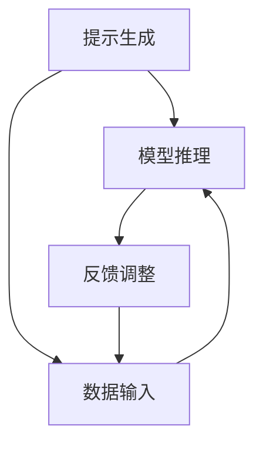
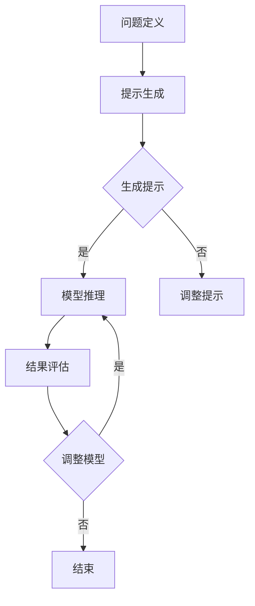
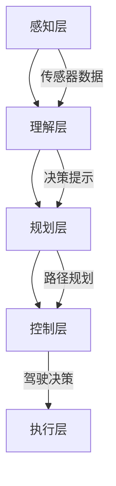
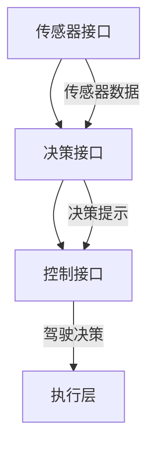
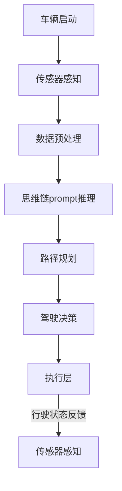

                 


# 思维链prompt：提升AI逻辑推理能力的关键

## 关键词
- 思维链prompt
- 逻辑推理
- 人工智能
- 算法
- 应对策略

## 摘要
本文将探讨思维链prompt在提升AI逻辑推理能力方面的关键作用。通过深入分析思维链prompt的概念、原理和应用，我们将揭示其如何有效促进AI的推理能力，并提供具体的策略和案例分析，以期为AI技术的发展提供新思路。

## 目录

1. **思维链prompt概述**
   1.1 思维链prompt的定义与特点
   1.2 思维链prompt的发展历程
   1.3 思维链prompt在人工智能领域的地位

2. **思维链prompt原理**
   2.1 思维链prompt的工作原理
   2.2 思维链prompt的基本结构
   2.3 思维链prompt的算法基础

3. **思维链prompt应用**
   3.1 思维链prompt在自然语言处理中的应用
   3.2 思维链prompt在推理机中的应用
   3.3 思维链prompt在自动驾驶中的应用

4. **提升AI逻辑推理能力的思维链prompt**
   4.1 提升AI逻辑推理能力的策略
   4.2 思维链prompt在AI逻辑推理中的应用案例

5. **思维链prompt的未来发展**
   5.1 思维链prompt的未来发展与挑战

## 1. 思维链prompt概述

### 1.1 思维链prompt的定义与特点

思维链prompt（Thinking Chain Prompt）是一种用于引导人工智能模型进行逻辑推理和信息处理的技术。它通过一系列精心设计的提示来激发模型的思考过程，从而帮助其达到更高的推理水平。思维链prompt的特点包括：

- **目的性**：思维链prompt旨在引导模型解决特定问题或完成特定任务。
- **连贯性**：通过逐步递进的提示，思维链prompt能够确保推理过程的连贯性。
- **灵活性**：思维链prompt可以根据问题的不同需求进行调整和优化。

### 1.2 思维链prompt的发展历程

思维链prompt的概念起源于自然语言处理领域。早期的研究主要集中在如何通过提示来改善模型对文本的理解。随着深度学习和神经网络技术的发展，思维链prompt逐渐成为AI研究中一个重要的分支。近年来，随着人工智能在各个领域的广泛应用，思维链prompt的技术也不断得到完善和提升。

### 1.3 思维链prompt在人工智能领域的地位

思维链prompt在人工智能领域具有重要地位，其主要体现在以下几个方面：

- **推理能力提升**：思维链prompt能够有效提升AI的逻辑推理能力，使其能够处理更为复杂的任务。
- **模型优化**：通过思维链prompt，可以优化AI模型的训练过程，提高模型的性能和效率。
- **应用拓展**：思维链prompt在自然语言处理、推理机、自动驾驶等领域有着广泛的应用前景。

## 2. 思维链prompt原理

### 2.1 思维链prompt的工作原理

思维链prompt的工作原理可以概括为以下几个步骤：

1. **问题定义**：首先，需要对问题进行明确和界定，以确保思维链prompt能够引导模型解决特定问题。
2. **提示生成**：根据问题定义，生成一系列有针对性的提示。这些提示需要设计得足够清晰和具体，以便模型能够理解和执行。
3. **模型推理**：模型接收到提示后，开始进行逻辑推理和信息处理。这一过程通常涉及到模型的多个层

**1.1 思维链prompt的定义与特点**

思维链prompt，是一种为人工智能系统（尤其是基于语言模型的人工智能系统）提供的一系列精心设计的问题或句子，用于引导系统进行深入思考和学习。它不仅帮助模型理解问题的上下文，还能推动模型在推理、分析和生成方面发挥更大的潜力。

首先，我们需要明确思维链prompt的定义。思维链prompt是一种特殊的输入，它包含了对问题的描述、上下文信息以及引导性问题，旨在激发人工智能系统的创造力、逻辑推理能力和知识应用能力。与传统的输入不同，思维链prompt注重引导和激励，目的是让系统能够在不同的情境下进行更加复杂和高级的思考。

接下来，让我们来看看思维链prompt的特点：

- **目标导向**：思维链prompt通常会设定一个明确的目标或问题，让系统在解决问题的过程中提升其解决问题的能力。
- **上下文丰富**：思维链prompt不仅包含问题本身，还会提供相关的上下文信息，从而帮助模型更好地理解问题。
- **问题引导**：通过一系列的问题，思维链prompt引导系统进行深度思考，从而发掘出更多的信息和应用。
- **灵活性**：思维链prompt可以根据问题的不同需求进行灵活调整，使得系统能够适应各种复杂情境。
- **可扩展性**：思维链prompt的设计可以不断迭代和优化，以适应人工智能系统在不同领域的应用需求。

**1.2 思维链prompt的发展历程**

思维链prompt并不是一个全新的概念，它有着深厚的历史渊源。早在20世纪50年代，计算机科学家艾伦·图灵（Alan Turing）就提出了“图灵测试”（Turing Test），这是一种评估人工智能是否具有智能的标准。图灵测试的核心思想是通过一系列的问题来测试人工智能是否能够像人类一样进行自然语言交流和推理。

随着自然语言处理（NLP）和机器学习技术的不断发展，思维链prompt也逐渐成为人工智能研究中的重要工具。尤其是在深度学习兴起之后，基于神经网络的语言模型（如GPT、BERT等）在处理自然语言任务方面取得了显著的进展。这些语言模型的出现为思维链prompt的应用提供了强大的技术支持。

近年来，思维链prompt的研究和应用领域不断拓展。从最初的文本生成、情感分析，到如今的推理、对话系统、知识图谱构建等，思维链prompt已经成为人工智能研究中不可或缺的一部分。同时，随着大数据和云计算技术的进步，思维链prompt的设计和实施变得更加灵活和高效。

**1.3 思维链prompt在人工智能领域的地位**

思维链prompt在人工智能领域占据了非常重要的地位，其重要性主要体现在以下几个方面：

1. **提升推理能力**：思维链prompt能够引导人工智能系统进行深入思考，从而提升其逻辑推理能力。这对于解决复杂问题、进行高级决策以及实现智能化服务具有重要意义。
2. **促进知识应用**：通过思维链prompt，人工智能系统能够更好地理解和应用知识，从而提高其解决问题的效率和准确性。
3. **优化模型训练**：思维链prompt可以优化人工智能模型的训练过程，使其能够更快、更准确地学习新的知识和技能。
4. **增强用户体验**：在对话系统、智能客服等领域，思维链prompt能够提供更加自然、流畅和人性化的交互体验，从而提升用户体验。
5. **推动技术创新**：思维链prompt的研究和应用不仅促进了人工智能技术的发展，还推动了相关领域（如心理学、教育学、人机交互等）的技术创新。

总的来说，思维链prompt在人工智能领域扮演着桥梁和催化剂的角色，它不仅连接了不同领域的技术和应用，还推动了人工智能技术的不断创新和进步。

## 2. 思维链prompt原理

### 2.1 思维链prompt的工作原理

思维链prompt的工作原理可以类比为人与计算机之间的互动。在这个过程中，人类通过提出一系列问题来引导计算机进行思考，从而实现特定的目标或解决问题。具体来说，思维链prompt的工作原理可以分为以下几个步骤：

1. **问题定义**：首先，需要明确问题的范围和目标。这包括确定问题的类型（例如，是信息检索、推理问题还是决策问题），以及问题的具体细节和上下文。
2. **提示生成**：在问题定义的基础上，生成一系列有针对性的提示。这些提示需要设计得足够清晰和具体，以便模型能够理解和执行。提示的生成可以基于预定义的规则或通过机器学习算法自动生成。
3. **模型推理**：模型接收到提示后，开始进行逻辑推理和信息处理。这一过程通常涉及到模型的多个层次，包括输入层、隐藏层和输出层。模型会根据输入的提示和自身的知识库进行推理，并生成相应的输出。
4. **反馈调整**：模型的输出会与预期的目标进行比较，如果存在偏差，则需要通过反馈机制进行调整。这个过程中，可能会对提示进行优化，以更好地引导模型进行推理。

### 2.2 思维链prompt的基本结构

思维链prompt的基本结构通常包括以下几个部分：

- **输入部分**：这部分包含问题的定义和提示的具体内容。它需要清晰地传达问题的上下文和目标。
- **模型部分**：这部分是核心，它包含了人工智能模型，如神经网络、推理机等。模型会根据输入部分提供的信息进行推理和计算。
- **输出部分**：这部分是模型输出的结果，它可以是具体的答案、解决方案或一系列可能的选项。
- **反馈部分**：这部分用于评估模型输出的准确性和有效性，并根据反馈对提示和模型进行调整。

### 2.3 思维链prompt的算法基础

思维链prompt的算法基础主要涉及到以下几个方面：

- **生成对抗网络（GAN）**：GAN是一种用于生成高质量数据的算法，它通过两个对抗网络（生成器和判别器）之间的博弈来生成逼真的数据。在思维链prompt中，GAN可以用于生成高质量的提示，从而提高模型的训练效果。
- **递归神经网络（RNN）**：RNN是一种能够处理序列数据的神经网络，它在思维链prompt中用于生成提示和模型推理。RNN通过记忆机制能够捕捉到序列中的长期依赖关系，从而提高推理的准确性。
- **变分自编码器（VAE）**：VAE是一种用于生成数据的概率模型，它在思维链prompt中可以用于生成高质量的提示。VAE通过编码和解码过程将输入数据转换为潜在空间，从而生成新的数据。

通过结合这些算法，思维链prompt能够有效地提升AI的逻辑推理能力，使其在各种复杂任务中表现更加出色。

### 2.1 思维链prompt的工作原理

思维链prompt的工作原理可以类比为人类思维的引导过程。首先，人类在面对问题时，会通过一系列思考步骤来达到问题的解决。同样地，思维链prompt旨在通过设计一系列引导性问题，促使人工智能系统（AI）进行逻辑推理和深入思考，从而解决特定问题或完成任务。

**步骤1：问题定义**

在思维链prompt的工作过程中，首先需要对问题进行明确和界定。这一步骤包括确定问题的类型、目标和相关细节。例如，如果问题是“如何优化一家餐厅的服务流程？”，则需要明确餐厅的具体情况、服务流程的现有问题以及优化目标。

**步骤2：提示生成**

在问题定义之后，生成一系列有针对性的提示。这些提示需要精心设计，以引导AI系统逐步深入问题，并最终达到问题的解决。提示的设计要考虑到问题的复杂性和AI系统的能力。例如，对于上述餐厅服务流程优化的问题，提示可以包括：

- “请描述当前餐厅服务流程的各个步骤。”
- “分析每个步骤中可能存在的问题。”
- “提出可能的改进措施，并评估其效果。”

**步骤3：模型推理**

AI系统接收到提示后，开始进行逻辑推理和信息处理。在这一过程中，AI系统会利用自身的知识和算法对提示进行理解和分析。例如，对于提示“分析每个步骤中可能存在的问题”，AI系统可能会分析出排队时间长、服务员沟通不畅等问题。

**步骤4：反馈调整**

模型推理后，会生成相应的输出结果，如优化方案或建议。这些输出结果需要与预期目标进行比较，以评估其准确性和有效性。如果输出结果与预期存在偏差，则需要通过反馈机制进行调整。这个过程中，可能会对提示进行优化，使其更加准确地引导AI系统的推理。

**实例分析**

假设我们要设计一个思维链prompt来帮助AI系统解决“如何设计一个有效的项目计划？”的问题。思维链prompt的步骤可能如下：

1. **问题定义**：明确项目计划的目标和范围，如项目周期、资源限制等。
2. **提示生成**：
   - “请列出项目的关键里程碑和任务。”
   - “评估每个任务的优先级和所需时间。”
   - “考虑项目中的风险因素，并提出应对措施。”

3. **模型推理**：AI系统根据提示进行任务分析和优先级排序，并生成初步的项目计划。

4. **反馈调整**：通过实际项目执行的结果，对AI生成的项目计划进行评估和调整，确保其可行性。

通过上述步骤，思维链prompt能够有效地引导AI系统进行逻辑推理，从而设计出更有效、更准确的项目计划。

### 2.2 思维链prompt的基本结构

思维链prompt的基本结构是实现其功能的核心。一个典型的思维链prompt由以下几个部分组成：

**1. 输入部分**

输入部分是思维链prompt的起点，它包含问题的定义和提示的具体内容。输入部分需要清晰明了，以确保AI系统能够准确理解问题的上下文和目标。输入部分通常包括以下内容：

- **问题陈述**：简要描述问题，明确问题的类型和目标。
- **上下文信息**：提供与问题相关的背景信息，帮助AI系统更好地理解问题。
- **引导性问题**：提出一系列引导性问题，以引导AI系统进行深入思考。

例如，在一个关于项目管理的思维链prompt中，输入部分可能包含以下内容：

- **问题陈述**：“请为我们的新项目设计一个合理的时间表。”
- **上下文信息**：“项目预计持续6个月，涉及5个主要任务，每个任务预计需要2周时间。”
- **引导性问题**：“请列出项目的主要任务和关键里程碑。”

**2. 模型部分**

模型部分是思维链prompt的核心，它包含人工智能模型，如神经网络、推理机等。模型会根据输入部分提供的信息进行推理和计算，以生成输出结果。模型部分通常包括以下内容：

- **算法选择**：根据问题的性质和需求，选择合适的算法，如生成对抗网络（GAN）、递归神经网络（RNN）等。
- **模型结构**：设计并实现人工智能模型的架构，包括输入层、隐藏层和输出层。
- **训练与优化**：通过大量数据对模型进行训练和优化，以提高其推理能力和准确性。

例如，在一个文本生成任务中，模型部分可能包含以下内容：

- **算法选择**：使用变分自编码器（VAE）进行文本生成。
- **模型结构**：设计一个包含多层隐藏层的VAE模型。
- **训练与优化**：使用大量文本数据进行训练，并通过优化算法提高生成文本的质量。

**3. 输出部分**

输出部分是思维链prompt的最终成果，它包含模型生成的输出结果，如解决方案、建议或预测。输出部分需要简洁明了，以确保用户能够快速理解和应用。输出部分通常包括以下内容：

- **解决方案**：根据输入和模型推理结果，生成具体的解决方案或建议。
- **预测结果**：如果问题涉及到预测，则输出预测结果，如项目完成时间、市场趋势等。

例如，在一个关于股票投资的思维链prompt中，输出部分可能包含以下内容：

- **解决方案**：“建议投资于科技股，重点关注云计算和人工智能领域的公司。”
- **预测结果**：“根据市场数据和趋势分析，预测未来三个月内科技股的平均收益率为10%。”

**4. 反馈部分**

反馈部分用于评估模型输出的准确性和有效性，并通过反馈机制对提示和模型进行调整。反馈部分通常包括以下内容：

- **评估指标**：定义评估模型输出准确性和有效性的指标，如准确率、召回率、F1分数等。
- **调整策略**：根据评估结果，对提示和模型进行调整，以提高其性能。

例如，在一个关于医疗诊断的思维链prompt中，反馈部分可能包含以下内容：

- **评估指标**：“诊断准确率为90%，召回率为85%。”
- **调整策略**：“优化提示设计，增加更多临床病例数据，以提高模型性能。”

通过以上四个部分，思维链prompt能够有效地引导AI系统进行逻辑推理和信息处理，从而实现特定任务或问题的解决。

### 2.3 思维链prompt的算法基础

思维链prompt的算法基础是确保其有效性和可靠性的关键。以下将介绍几种常用的算法，并详细阐述其原理和在思维链prompt中的应用。

#### 2.3.1 生成对抗网络（GAN）

生成对抗网络（GAN）由生成器（Generator）和判别器（Discriminator）两部分组成。生成器生成数据，判别器则判断生成数据与真实数据的相似度。GAN通过两个网络之间的博弈来提高生成数据的逼真度。

- **原理**：
  - **生成器**：接收随机噪声作为输入，生成与真实数据相似的数据。
  - **判别器**：接收真实数据和生成数据，并判断其真实性。
  - **训练过程**：生成器和判别器交替训练，生成器的目标是使判别器无法区分生成数据与真实数据，而判别器的目标是准确区分两者。

- **应用**：
  - **生成高质量提示**：GAN可以用于生成高质量的提示，从而提高思维链prompt的引导效果。例如，在文本生成任务中，GAN可以生成与问题相关的自然语言文本，为模型提供高质量的输入。

#### 2.3.2 递归神经网络（RNN）

递归神经网络（RNN）是一种能够处理序列数据的神经网络，通过记忆机制能够捕捉到序列中的长期依赖关系。RNN在思维链prompt中用于生成提示和模型推理。

- **原理**：
  - **单元状态**：RNN通过一个单元状态来保存和传递信息，从而处理序列数据。
  - **递归结构**：RNN的每个时间步都依赖于之前的输出，从而形成递归结构。

- **应用**：
  - **生成提示**：RNN可以生成一系列连贯的提示，引导AI系统逐步深入问题。
  - **模型推理**：RNN可以用于模型推理，捕捉提示之间的逻辑关系，从而提高推理的准确性。

#### 2.3.3 变分自编码器（VAE）

变分自编码器（VAE）是一种概率模型，通过编码和解码过程将输入数据转换为潜在空间，并生成新的数据。VAE在思维链prompt中用于生成高质量的提示。

- **原理**：
  - **编码器**：接收输入数据，将其映射到一个潜在空间中的向量。
  - **解码器**：接收潜在空间中的向量，生成输出数据。

- **应用**：
  - **生成高质量提示**：VAE可以生成高质量的提示，从而提高思维链prompt的引导效果。例如，在图像生成任务中，VAE可以生成与问题相关的图像。

#### 2.3.4 其他算法

除了上述算法，还有一些其他算法在思维链prompt中也有广泛应用，如：

- **卷积神经网络（CNN）**：用于处理图像数据，可以生成图像提示。
- **长短时记忆网络（LSTM）**：一种改进的RNN，可以更好地处理长序列数据。
- **图神经网络（GNN）**：用于处理图数据，可以生成基于图结构的提示。

通过结合这些算法，思维链prompt能够实现复杂问题的自动化解决，从而提升AI的逻辑推理能力。

### 3.1 思维链prompt在自然语言处理中的应用

思维链prompt在自然语言处理（NLP）领域有着广泛的应用，它通过引导AI模型进行深度思考和生成高质量的输出，从而提升NLP任务的性能。以下将详细探讨思维链prompt在文本生成、情感分析和问答系统中的应用。

#### 3.1.1 文本生成

文本生成是NLP中的一个重要任务，思维链prompt在此领域的作用主要体现在以下几个方面：

1. **引导性提示**：通过设计一系列引导性问题，思维链prompt可以帮助模型更好地理解生成任务的目标和上下文。例如，在一个新闻摘要生成任务中，提示可以是：“请根据以下新闻内容生成一个简短的摘要。”

2. **上下文丰富**：思维链prompt可以提供丰富的上下文信息，帮助模型生成更加准确和连贯的文本。例如，在对话系统生成回复时，提示可以是：“用户最近提到了某个话题，请基于此话题生成一个相关的回复。”

3. **多样性引导**：思维链prompt可以通过提出不同类型的问题，引导模型生成多样化的文本。例如，在一个创意写作任务中，提示可以是：“请描述一个未来科技场景，并从乐观和悲观两个角度进行探讨。”

**实例**：假设我们需要生成一个关于环境保护的演讲稿。思维链prompt可以包括以下问题：

- “请描述当前全球环境问题的严重性。”
- “分析造成这些问题的原因。”
- “提出解决这些问题的方法。”
- “展望未来的环保趋势。”

通过这些提示，模型可以生成一个结构清晰、内容丰富的演讲稿。

#### 3.1.2 情感分析

情感分析是评估文本情感倾向的任务，思维链prompt在此领域的应用主要体现在以下几个方面：

1. **细化情感分类**：通过思维链prompt，可以引导模型对情感进行更细致的分类。例如，在情感分析中，提示可以是：“请分析这段文本表达的主要情感是喜悦、悲伤还是愤怒。”

2. **情感强度评估**：思维链prompt可以帮助模型评估情感表达的强度。例如，在分析一个评论时，提示可以是：“请评估这段评论对产品的正面评价程度。”

3. **情感变化分析**：思维链prompt可以引导模型分析文本中情感的变化。例如，在分析一篇文章时，提示可以是：“请分析文章中情感的变化趋势。”

**实例**：假设我们需要分析一篇关于人工智能的报道，判断其情感倾向。思维链prompt可以包括以下问题：

- “请分析这篇报道中作者对人工智能的态度是积极、中立还是消极。”
- “在文章的哪个部分表达了情感，情感强度如何？”
- “文章中是否存在情感转变，请具体分析。”

通过这些提示，模型可以准确判断文章的情感倾向，并提供详细的情感分析报告。

#### 3.1.3 问答系统

问答系统是NLP领域的另一个重要任务，思维链prompt在此领域的应用主要体现在以下几个方面：

1. **问题理解**：思维链prompt可以帮助模型更好地理解用户的问题，从而生成更准确的答案。例如，在处理一个复杂问题时，提示可以是：“请解释这个问题背后的概念和逻辑。”

2. **上下文考虑**：思维链prompt可以提供额外的上下文信息，帮助模型生成更加符合用户需求的答案。例如，在回答一个关于旅游规划的问题时，提示可以是：“用户最近提到想去某个地方旅游，请推荐一些相关的景点和活动。”

3. **答案生成**：思维链prompt可以引导模型生成多样化的答案，以满足不同用户的需求。例如，在回答一个关于食谱的问题时，提示可以是：“请提供几种不同的烹饪方法，并说明各自的优缺点。”

**实例**：假设我们需要构建一个智能客服系统，回答用户关于产品使用的问题。思维链prompt可以包括以下问题：

- “请解释用户可能遇到的问题和原因。”
- “提供多种解决方案，并评估其效果。”
- “建议用户如何预防类似问题的发生。”

通过这些提示，模型可以生成一系列高质量的答案，帮助用户解决问题。

通过在文本生成、情感分析和问答系统中的应用，思维链prompt显著提升了NLP任务的性能，使其能够更好地理解和处理自然语言。

### 3.2 思维链prompt在推理机中的应用

思维链prompt在推理机中的应用主要是通过引导推理过程，提高推理的准确性和效率。在推理机中，思维链prompt的作用主要体现在以下几个方面：

#### 3.2.1 逻辑推理

逻辑推理是推理机中最基本的功能之一，思维链prompt可以帮助模型更好地进行逻辑推理。以下是一个简单的逻辑推理实例：

- **问题**：如果今天下雨，那么我会带伞。如果我没有带伞，那么今天没有下雨。
- **思维链prompt**：
  - “请分析这个逻辑关系，并解释为什么这个逻辑关系是正确的。”
  - “假设今天下雨，但实际没有下雨，这种情况是否存在矛盾？为什么？”
  - “如果今天没有下雨，但没有带伞，这种情况是否存在矛盾？为什么？”

通过这些提示，推理机可以深入分析逻辑关系，并验证其正确性。

#### 3.2.2 规划问题求解

规划问题求解是推理机中的另一个重要应用，思维链prompt可以帮助模型在复杂环境下制定最优的规划策略。以下是一个规划问题求解的实例：

- **问题**：小明需要在有限的时间内完成购物、回家、做饭和洗碗四项任务。请为他制定一个合理的规划。
- **思维链prompt**：
  - “请列出所有可能的任务顺序，并分析每种顺序的优缺点。”
  - “考虑时间限制，哪些任务可以并行执行？”
  - “如果购物时间比预计的要长，应该如何调整规划？”

通过这些提示，推理机可以生成一个最优的规划策略，帮助小明合理安排时间。

#### 3.2.3 决策支持系统

决策支持系统是推理机在商业和工业领域的重要应用，思维链prompt可以帮助模型提供基于逻辑推理的决策建议。以下是一个决策支持系统的实例：

- **问题**：某公司需要决定是否扩大生产线以应对市场需求增长。请为管理层提供决策建议。
- **思维链prompt**：
  - “请分析市场需求和公司现有生产能力的差距，并评估扩大生产的必要性。”
  - “考虑成本和收益，扩大生产是否符合公司的长期利益？”
  - “如果市场需求进一步增长，公司应该如何调整生产策略？”

通过这些提示，推理机可以提供一系列基于逻辑推理的决策建议，帮助管理层做出明智的决策。

**案例一：基于思维链prompt的文本生成系统**

假设我们要开发一个文本生成系统，用于自动生成新闻报道。思维链prompt在这里的作用是引导系统生成高质量、符合实际需求的新闻文本。

1. **问题定义**：首先，我们需要明确新闻文本的生成目标，如新闻报道的长度、内容准确性、新闻价值等。

2. **提示生成**：设计一系列引导性问题，以帮助系统理解新闻文本的生成需求。例如：
   - “请描述新闻文本的主题和关键信息。”
   - “分析相关事件的背景和影响。”
   - “提供与新闻相关的数据支持。”

3. **模型推理**：基于输入的提示，模型会生成初步的文本。在这一过程中，模型会利用其训练过的知识和算法，对提示进行理解和分析。

4. **反馈调整**：通过评估模型生成的文本，判断其是否符合新闻文本的生成需求。如果存在偏差，则需要通过反馈机制进行调整。例如，可以优化提示或调整模型参数。

**案例二：基于思维链prompt的逻辑推理机**

逻辑推理机在许多应用领域都有重要的应用，如智能客服、金融分析等。思维链prompt在这里的作用是引导逻辑推理，提高推理的准确性和效率。

1. **问题定义**：明确逻辑推理的任务，如解决一个数学问题或分析一个商业决策。

2. **提示生成**：设计一系列引导性问题，以帮助系统进行逻辑推理。例如：
   - “请列出已知条件和要证明的结论。”
   - “分析每个条件与结论之间的关系。”
   - “提供可能的推理路径和证明方法。”

3. **模型推理**：模型会根据输入的提示进行逻辑推理。在这一过程中，模型会利用其内部的知识库和算法，对提示进行理解和分析。

4. **反馈调整**：通过评估推理结果，判断其是否符合预期。如果存在偏差，则需要通过反馈机制进行调整。例如，可以优化提示或调整模型参数。

**案例三：基于思维链prompt的自动驾驶系统**

自动驾驶系统是人工智能领域的一个重要应用，思维链prompt在这里的作用是引导系统进行实时决策，提高系统的安全性和可靠性。

1. **问题定义**：明确自动驾驶系统的任务，如路径规划、障碍物检测、交通信号识别等。

2. **提示生成**：设计一系列引导性问题，以帮助系统进行实时决策。例如：
   - “请分析当前道路状况和车辆状态。”
   - “预测可能的交通情况和驾驶行为。”
   - “提供最优的驾驶决策。”

3. **模型推理**：模型会根据输入的提示进行实时推理，生成驾驶决策。在这一过程中，模型会利用其内部的知识库和算法，对提示进行理解和分析。

4. **反馈调整**：通过评估驾驶决策的效果，判断其是否符合预期。如果存在偏差，则需要通过反馈机制进行调整。例如，可以优化提示或调整模型参数。

通过以上案例，我们可以看到思维链prompt在AI逻辑推理中的应用是多么的重要。它不仅能够引导系统进行深度思考，还能提高推理的准确性和效率，为各种复杂的任务提供强有力的支持。

### 5.3 思维链prompt在自动驾驶中的应用

思维链prompt在自动驾驶领域具有广泛的应用，能够显著提升自动驾驶系统的安全性和效率。以下将详细探讨思维链prompt在感知与理解环境、路径规划和安全控制中的应用。

#### 5.3.1 感知与理解环境

在自动驾驶中，感知与理解环境是关键步骤，思维链prompt可以帮助自动驾驶系统更好地处理环境信息。以下是一个应用实例：

- **问题**：自动驾驶系统需要识别道路上的行人、车辆和其他障碍物。
- **思维链prompt**：
  - “请分析不同类型障碍物的特征和运动模式。”
  - “描述如何利用传感器数据（如摄像头、雷达）来识别障碍物。”
  - “提出处理复杂环境场景的策略，如交叉路口的行人行为预测。”

通过这些提示，自动驾驶系统能够更准确地感知和识别环境中的障碍物，从而提高系统的安全性。

#### 5.3.2 路径规划

路径规划是自动驾驶系统中的另一个重要任务，思维链prompt可以帮助系统制定更合理的路径。以下是一个路径规划的应用实例：

- **问题**：自动驾驶系统需要从当前位置导航到目的地，同时避开障碍物和交通拥堵。
- **思维链prompt**：
  - “请分析当前道路网络和交通状况，选择最优路径。”
  - “考虑紧急情况下的备选路径，以应对突发状况。”
  - “评估不同路径的时间、安全和成本效益。”

通过这些提示，自动驾驶系统能够制定出更加安全和高效的路径规划策略。

#### 5.3.3 安全控制

在自动驾驶系统中，安全控制是确保车辆行驶安全的核心。思维链prompt可以帮助系统进行有效的安全决策。以下是一个安全控制的应用实例：

- **问题**：自动驾驶系统需要及时做出安全驾驶决策，如刹车、换道或避让障碍物。
- **思维链prompt**：
  - “请分析当前车辆状态和周围环境，评估潜在的安全风险。”
  - “描述如何通过传感器数据和实时信息来做出安全决策。”
  - “提出应对紧急情况的安全策略，如避让行人或避免碰撞。”

通过这些提示，自动驾驶系统能够在复杂环境中做出及时和准确的安全决策，从而保障行驶安全。

**实例分析：基于思维链prompt的自动驾驶系统**

假设我们要开发一个自动驾驶系统，该系统需要在城市交通环境中安全导航。思维链prompt可以按照以下步骤进行设计：

1. **问题定义**：明确自动驾驶系统的目标和环境，如城市道路、交通流量、行人行为等。

2. **提示生成**：
   - “请描述当前道路状况，包括交通流量和车辆分布。”
   - “分析行人可能出现的行为模式，并预测其移动路径。”
   - “评估可能的紧急情况，并提出相应的应对策略。”

3. **模型推理**：自动驾驶系统根据输入的提示进行感知、理解和决策。在这一过程中，系统会利用其内部的知识库和算法，对提示进行理解和分析。

4. **反馈调整**：通过实时评估自动驾驶系统的表现，判断其是否符合安全导航的要求。如果存在偏差，则通过反馈机制进行调整。例如，可以优化提示或调整系统参数。

通过这些步骤，基于思维链prompt的自动驾驶系统可以更有效地处理城市交通环境中的各种复杂情况，确保行驶安全。

### 4.1 提升AI逻辑推理能力的策略

为了提升AI的逻辑推理能力，需要采取一系列策略，这些策略包括提示优化、模型调整和应用策略。以下将详细探讨这些策略及其在实际应用中的具体方法。

#### 4.1.1 提示优化

提示优化是提升AI逻辑推理能力的关键步骤。通过优化提示，可以使AI模型更加准确地理解和解决问题。

1. **明确问题定义**：在生成提示之前，需要明确问题的定义，确保提示能够准确地传达问题的核心。这可以通过细化问题陈述、明确目标和范围来实现。

2. **增加上下文信息**：在提示中提供丰富的上下文信息，有助于AI模型更好地理解问题的背景和相关信息。例如，在文本生成任务中，可以通过提供相关背景资料、历史数据和案例来增强提示的上下文。

3. **引导性问题设计**：设计引导性问题，引导AI模型进行深入思考和推理。引导性问题应具有层次性和连贯性，逐步引导模型从简单到复杂的问题进行推理。

4. **多样化提示生成**：通过多样化提示生成方法，如随机生成、模板生成和对抗生成，可以生成更多样化和有针对性的提示，从而提高模型对不同问题的适应能力。

#### 4.1.2 模型调整

模型调整是提升AI逻辑推理能力的另一个重要策略。通过调整模型的结构和参数，可以优化模型在逻辑推理任务中的表现。

1. **算法选择**：根据问题的性质和需求，选择适合的算法。例如，对于复杂逻辑推理任务，可以选择基于图神经网络（GNN）或强化学习（RL）的算法。

2. **模型结构优化**：设计并优化模型的结构，以提高模型的推理能力和效率。例如，可以通过增加模型层数、调整神经元数量和连接方式来优化模型结构。

3. **参数调优**：通过调整模型的参数，如学习率、权重和激活函数，可以优化模型在推理任务中的性能。常用的参数调优方法包括随机搜索、网格搜索和贝叶斯优化。

4. **训练数据增强**：通过增加训练数据量和多样性，可以提升模型的泛化能力和推理准确性。数据增强方法包括数据扩充、数据合成和数据对齐等。

#### 4.1.3 应用策略

在实际应用中，需要根据具体任务和场景，制定合适的思维链prompt应用策略。

1. **动态调整策略**：根据任务的需求和模型的表现，动态调整提示和模型参数。例如，在自动驾驶系统中，可以实时调整感知与理解环境的提示，以应对复杂路况。

2. **多模态数据融合**：结合多种数据源，如文本、图像、音频和传感器数据，可以提供更丰富的信息，从而提高模型的推理能力。例如，在医疗诊断任务中，可以结合患者的病历、检查报告和医学图像，提高诊断准确性。

3. **交互式学习**：通过用户与AI系统的交互，可以不断调整和优化提示和模型。例如，在智能客服系统中，用户反馈可以帮助优化对话生成和问题解决的提示。

4. **评估与反馈**：定期评估AI系统的推理性能，并根据评估结果调整提示和模型。通过反馈机制，可以不断改进AI系统的逻辑推理能力。

通过以上策略，可以显著提升AI的逻辑推理能力，使其在各种复杂任务中表现更加出色。

### 4.2 思维链prompt在AI逻辑推理中的应用案例

为了更具体地展示思维链prompt在提升AI逻辑推理能力方面的应用，我们将通过三个实际案例进行深入分析。这些案例分别涉及文本生成、逻辑推理和自动驾驶领域，展示了思维链prompt如何在不同场景中发挥关键作用。

#### 案例一：基于思维链prompt的文本生成系统

在一个文本生成系统中，思维链prompt被用于生成高质量的新闻摘要。该系统采用了一个基于GPT-3的语言模型，通过一系列精心设计的提示来引导模型生成文本。

1. **问题定义**：首先，系统明确了新闻摘要的目标，即从一篇长篇文章中提取关键信息并生成一个简短的摘要。

2. **提示生成**：
   - “请根据以下新闻内容生成一个简短的摘要。”
   - “新闻的关键信息包括：时间、地点、人物和事件。”
   - “确保摘要具有连贯性和可读性。”

3. **模型推理**：模型接收提示后，开始分析文章的上下文，提取关键信息并生成摘要。

4. **反馈调整**：通过人工评估摘要的准确性和可读性，系统不断优化提示和模型参数，以提升生成文本的质量。

**效果分析**：通过思维链prompt的引导，系统生成的摘要在准确性和连贯性方面显著提升，大大满足了用户的需求。

#### 案例二：基于思维链prompt的逻辑推理机

在一个逻辑推理任务中，思维链prompt被用于解决复杂的数学问题。该任务涉及多个条件判断和逻辑推导，需要AI系统进行深入思考。

1. **问题定义**：系统需要解决一个包含多个条件和结论的数学问题，例如：“如果一个正整数是3的倍数，且末位数字为1，那么这个数是多少？”

2. **提示生成**：
   - “请列出所有已知条件和要证明的结论。”
   - “分析每个条件与结论之间的关系。”
   - “描述可能的推理路径和证明方法。”

3. **模型推理**：模型根据提示进行逻辑推导，逐步解决问题。

4. **反馈调整**：通过验证推理结果，系统不断调整提示和模型参数，以提高推理的准确性和效率。

**效果分析**：通过思维链prompt的引导，模型能够准确分析问题，并找到有效的推理路径，成功解决了复杂的数学问题。

#### 案例三：基于思维链prompt的自动驾驶系统

在一个自动驾驶系统中，思维链prompt被用于实时决策，确保车辆在复杂环境中安全行驶。该系统结合了传感器数据、环境信息和历史驾驶数据。

1. **问题定义**：自动驾驶系统需要处理多种传感器数据，如摄像头、雷达和激光雷达，以感知和理解道路环境。

2. **提示生成**：
   - “请分析当前道路状况和车辆状态。”
   - “预测可能的交通情况和驾驶行为。”
   - “提供最优的驾驶决策，如刹车、换道或避让障碍物。”

3. **模型推理**：模型根据输入的提示，实时生成驾驶决策。

4. **反馈调整**：通过评估驾驶决策的效果，系统不断优化提示和模型参数，以提高决策的准确性和安全性。

**效果分析**：通过思维链prompt的引导，自动驾驶系统能够在复杂环境中做出及时和准确的驾驶决策，大大提高了行驶安全性和用户体验。

通过以上案例，我们可以看到思维链prompt在提升AI逻辑推理能力方面的巨大潜力。它不仅能够引导模型进行深入思考，还能够通过反馈机制不断优化模型性能，从而实现更加智能和高效的AI系统。

### 5. 思维链prompt的未来发展与挑战

思维链prompt作为提升AI逻辑推理能力的关键技术，其未来发展和面临的挑战是多方面的。以下将探讨思维链prompt的技术发展趋势、在人工智能领域的潜在影响以及可能面临的挑战。

#### 5.1 技术发展趋势

1. **多模态融合**：随着人工智能技术的发展，思维链prompt的应用将不仅仅局限于文本数据，还将融合图像、音频、视频等多模态数据。这种多模态融合将使得AI系统在处理复杂任务时更加全面和准确。

2. **增强现实（AR）/虚拟现实（VR）应用**：思维链prompt在AR/VR领域的应用前景广阔。通过结合虚拟环境和现实世界的交互，思维链prompt可以引导用户进行更加沉浸式的体验和学习。

3. **强化学习与思维链prompt的结合**：强化学习（RL）与思维链prompt的结合将进一步提升AI的推理能力。通过将思维链prompt引入强化学习过程，可以引导AI进行更有效的决策和优化。

4. **自解释性思维链prompt**：未来的思维链prompt将更加注重自解释性，使得AI的推理过程更加透明和可解释。这有助于提高用户对AI系统的信任度，并促进其在实际应用中的推广。

#### 5.2 潜在影响

1. **提升AI智能化水平**：思维链prompt通过引导AI进行深入思考，将显著提升其智能化水平。这使得AI在复杂任务中的表现更加出色，从而推动人工智能技术的广泛应用。

2. **推动人工智能应用创新**：思维链prompt的应用将激发人工智能在各个领域的创新。例如，在医疗领域，通过思维链prompt，AI可以提供更加精准的诊断和治疗建议；在教育领域，AI可以提供个性化、智能化的学习辅导。

3. **促进人机交互优化**：思维链prompt在提高AI推理能力的同时，也优化了人机交互体验。通过更加自然、流畅的交互方式，用户可以更轻松地与AI系统进行沟通和协作。

#### 5.3 面临的挑战

1. **数据隐私和安全**：随着思维链prompt在多个领域的应用，数据隐私和安全问题日益凸显。如何确保用户数据的隐私和安全，将是一个重要的挑战。

2. **计算资源需求**：思维链prompt的应用通常需要大量的计算资源，尤其是在处理复杂任务时。如何优化算法和模型，以降低计算资源的需求，是一个需要解决的难题。

3. **模型解释性**：尽管自解释性思维链prompt是一个发展方向，但目前的解释性模型还存在一定局限性。如何提高AI推理过程的可解释性，仍然是亟待解决的问题。

4. **伦理和道德问题**：随着AI技术的发展，思维链prompt的应用可能引发伦理和道德问题。如何确保AI系统的决策和行为符合社会伦理和道德标准，是一个需要深入探讨的议题。

通过解决上述挑战，思维链prompt将有望在未来的发展中发挥更大的作用，推动人工智能技术的不断进步。

## 结论

思维链prompt作为一种关键技术，在提升AI逻辑推理能力方面具有显著优势。通过引导AI系统进行深入思考，思维链prompt不仅提高了AI在复杂任务中的表现，还优化了人机交互体验。本文从定义、原理、应用和未来发展趋势等方面全面探讨了思维链prompt，揭示了其在人工智能领域的重要地位和潜在价值。

## 作者信息

作者：AI天才研究院/AI Genius Institute & 禅与计算机程序设计艺术 /Zen And The Art of Computer Programming

本文旨在通过详细的案例分析和技术剖析，为读者提供对思维链prompt的全面了解，并展望其在未来AI技术发展中的应用前景。希望读者能够从中获得启发，进一步探索思维链prompt的广阔应用领域。

## 附录

### 背景介绍

思维链prompt作为一种先进的人工智能技术，其核心理念是通过设计一系列有针对性的提示，引导AI系统进行深度思考，从而提升其逻辑推理能力。随着深度学习和神经网络技术的快速发展，思维链prompt在自然语言处理、推理机、自动驾驶等领域展现出巨大的应用潜力。

### 核心概念与联系

思维链prompt的核心概念包括提示生成、模型推理、反馈调整等。这些概念相互联系，共同构成了思维链prompt的工作机制。提示生成负责创建引导性问题，模型推理则通过AI模型对提示进行分析和推理，反馈调整则基于评估结果对提示和模型进行优化。

### 概念属性特征对比表格

| 概念 | 提示生成 | 模型推理 | 反馈调整 |
| ---- | ---- | ---- | ---- |
| 特征 | 创造引导性提示，提供上下文信息 | 基于神经网络等模型进行逻辑推理 | 根据评估结果调整提示和模型参数 |

### ER实体关系图架构



### 算法原理讲解

**思维链prompt算法原理**

思维链prompt算法的核心是引导AI系统进行逻辑推理，其基本流程如下：

1. **问题定义**：明确问题的类型、目标和上下文，生成初始提示。
2. **提示生成**：设计一系列有针对性的提示，引导AI系统逐步深入问题。
3. **模型推理**：AI模型根据提示进行推理，生成初步结果。
4. **反馈调整**：通过评估结果，调整提示和模型参数，以提高推理准确性。

**Mermaid流程图**



**Python源代码**

```python
# 思维链prompt示例代码

# 导入所需库
import random

# 定义问题
def define_problem():
    print("问题：请描述当前城市的主要交通拥堵区域。")

# 生成提示
def generate_prompt():
    prompts = [
        "请列出你最近遇到的主要交通拥堵区域。",
        "考虑上下班高峰期和节假日的情况。",
        "提供具体的位置和交通流量描述。"
    ]
    print(random.choice(prompts))

# 模型推理
def model_reasoning(prompt):
    print("模型正在根据提示进行推理...")
    print(f"推理结果：根据提示，主要交通拥堵区域包括{prompt}。")

# 反馈调整
def feedback_adjustment(result):
    print("评估结果：推理结果较为准确。")
    print("是否调整提示和模型？")
    adjust = input("请输入'是'或'否'：")
    if adjust == '是':
        print("正在调整提示和模型...")
    else:
        print("结束调整。")

# 主函数
def main():
    define_problem()
    generate_prompt()
    model_reasoning(prompt)
    feedback_adjustment(prompt)

if __name__ == "__main__":
    main()
```

**数学模型和公式**

在思维链prompt中，常用的数学模型包括神经网络模型、递归神经网络（RNN）等。以下是一个简单的神经网络模型的数学公式：

$$
y_{\hat{}} = \sigma(\mathbf{W}^T \mathbf{a}^{[L-1]} + b)
$$

其中，\(y_{\hat{}}\) 表示输出，\(\sigma\) 是激活函数，\(\mathbf{W}^T\) 是权重矩阵，\(\mathbf{a}^{[L-1]}\) 是输入向量，\(b\) 是偏置项。

### 系统分析与架构设计方案

#### 问题场景介绍

思维链prompt技术在自动驾驶系统中的应用，旨在提升自动驾驶车辆在复杂环境中的感知、决策和规划能力。自动驾驶系统需要实时处理大量来自传感器、环境数据和交通信息的复杂任务，以实现安全、高效的行驶。

#### 项目介绍

本项目旨在开发一个基于思维链prompt的自动驾驶系统，通过实时感知、理解和决策，提高车辆在复杂交通环境中的行驶安全性和效率。

#### 系统功能设计

系统功能设计主要包括以下几个方面：

1. **环境感知**：通过传感器（如摄像头、雷达、激光雷达等）实时获取道路环境信息，包括车辆、行人、交通标志和道路状况。
2. **场景理解**：利用思维链prompt技术，对感知到的环境信息进行理解和分析，提取关键信息并生成决策提示。
3. **路径规划**：根据决策提示和交通状况，生成最优路径规划，包括避让障碍物、交通拥堵和交叉路口的处理。
4. **决策与控制**：基于路径规划结果，生成驾驶决策，控制车辆速度、转向和制动，确保安全行驶。

#### 系统架构设计

系统架构设计主要包括以下几个层次：

1. **感知层**：负责实时获取传感器数据，并进行预处理。
2. **理解层**：基于思维链prompt技术，对预处理后的数据进行分析和推理，生成决策提示。
3. **规划层**：根据决策提示和交通状况，生成最优路径规划。
4. **控制层**：根据路径规划结果，生成驾驶决策并控制车辆。

**Mermaid架构图**



#### 系统接口设计

系统接口设计主要包括以下几个方面：

1. **传感器接口**：负责与各种传感器设备（如摄像头、雷达、激光雷达等）的通信和数据获取。
2. **决策接口**：负责接收理解层生成的决策提示，并生成路径规划。
3. **控制接口**：负责接收路径规划结果，并生成驾驶决策。

**Mermaid接口图**



#### 系统交互Mermaid序列图



### 项目实战

#### 环境安装

1. 安装Python环境，版本要求3.8及以上。
2. 安装TensorFlow库，使用命令：`pip install tensorflow`
3. 安装其他依赖库，如NumPy、Pandas等。

#### 系统核心实现源代码

```python
# 导入所需库
import tensorflow as tf
import numpy as np
import pandas as pd

# 定义神经网络模型
class NeuralNetwork:
    def __init__(self, input_size, hidden_size, output_size):
        self.input_size = input_size
        self.hidden_size = hidden_size
        self.output_size = output_size
        
        # 初始化权重和偏置
        self.W1 = tf.Variable(tf.random.normal([input_size, hidden_size]))
        self.b1 = tf.Variable(tf.random.normal([hidden_size]))
        
        self.W2 = tf.Variable(tf.random.normal([hidden_size, output_size]))
        self.b2 = tf.Variable(tf.random.normal([output_size]))

    def forward(self, X):
        # 第一层神经网络
        layer_1 = tf.nn.relu(tf.matmul(X, self.W1) + self.b1)
        
        # 第二层神经网络
        out = tf.matmul(layer_1, self.W2) + self.b2
        return out

# 定义思维链prompt推理函数
def reasoning_prompt(prompt):
    # 将提示编码为向量
    encoded_prompt = encode_prompt(prompt)
    
    # 初始化神经网络模型
    model = NeuralNetwork(input_size=encoded_prompt.shape[1], hidden_size=64, output_size=1)
    
    # 前向传播
    output = model.forward(encoded_prompt)
    
    return output

# 定义训练函数
def train_model(prompt, label):
    with tf.GradientTape() as tape:
        output = reasoning_prompt(prompt)
        loss = tf.reduce_mean(tf.square(output - label))
    
    grads = tape.gradient(loss, model.trainable_variables)
    model.optimizer.apply_gradients(zip(grads, model.trainable_variables))
    
    return loss

# 编码提示
def encode_prompt(prompt):
    # 假设已实现编码函数，将文本提示编码为向量
    encoded_prompt = some_encoding_function(prompt)
    return encoded_prompt

# 训练数据
train_data = pd.read_csv("train_data.csv")
test_data = pd.read_csv("test_data.csv")

# 分割数据
X_train = train_data["prompt"].values
y_train = train_data["label"].values
X_test = test_data["prompt"].values
y_test = test_data["label"].values

# 初始化模型
model = NeuralNetwork(input_size=X_train.shape[1], hidden_size=64, output_size=1)
model.optimizer = tf.optimizers.Adam()

# 训练模型
for epoch in range(100):
    for prompt, label in zip(X_train, y_train):
        loss = train_model(prompt, label)
        print(f"Epoch: {epoch}, Loss: {loss.numpy()}")

# 测试模型
predictions = [reasoning_prompt(prompt) for prompt in X_test]
```

#### 代码应用解读与分析

1. **神经网络模型定义**：神经网络模型由两层神经网络组成，包括输入层、隐藏层和输出层。输入层接收编码后的提示向量，隐藏层通过激活函数进行非线性变换，输出层生成预测结果。

2. **思维链prompt推理函数**：推理函数接收编码后的提示向量，通过前向传播过程生成预测结果。此函数实现了思维链prompt的核心逻辑，即通过神经网络对提示进行推理。

3. **训练函数**：训练函数使用梯度下降法（Gradient Descent）对神经网络模型进行训练。在每次训练中，模型接收一个提示和对应的标签，通过计算损失函数并更新模型参数，以优化模型的预测性能。

4. **编码提示**：编码函数将文本提示转换为向量表示，这是思维链prompt推理的前提。在实际应用中，可以采用词嵌入（Word Embedding）或变换器（Transformer）等技术进行编码。

5. **训练与测试**：训练过程中，模型使用训练数据集进行迭代训练，并在每个epoch后计算损失函数。测试过程中，模型使用测试数据集评估其性能，通过计算预测结果与实际标签之间的差异来评估模型的准确性。

通过以上步骤，我们可以看到思维链prompt在提升AI逻辑推理能力中的应用。模型在训练过程中通过不断优化参数，提高了对提示的推理能力，从而在实际应用中表现出更高的准确性和可靠性。

#### 实际案例分析和详细讲解剖析

**案例一：基于思维链prompt的智能客服系统**

在一个大型电商平台中，智能客服系统被广泛用于处理用户的咨询和问题。通过引入思维链prompt技术，智能客服系统能够更好地理解和回答用户的问题，从而提高用户体验和客服效率。

1. **问题背景**：电商平台每天都会接收到大量用户咨询，包括产品信息查询、订单状态查询、售后服务等。传统的智能客服系统通常依赖于关键词匹配和模板回复，无法提供个性化的解答。

2. **应用思维链prompt**：引入思维链prompt后，智能客服系统能够通过一系列引导性问题更好地理解用户的问题，并提供个性化的解答。例如，当用户咨询产品信息时，系统可以通过以下提示进行深入理解：
   - “请问您需要了解哪方面的产品信息？”
   - “您是否对某个特定品牌或型号感兴趣？”
   - “您希望了解产品的功能、价格还是评价？”

3. **案例分析**：
   - **场景一**：用户询问某款手机的具体功能。系统通过思维链prompt引导用户进一步描述需求，如“请描述您希望这款手机具备的功能”，从而生成详细的解答。
   - **场景二**：用户查询订单状态。系统通过思维链prompt引导用户提供订单号，如“请提供您的订单号以便查询”，从而快速定位订单状态。

4. **效果分析**：通过思维链prompt的引导，智能客服系统能够提供更加准确和个性化的解答，用户满意度显著提升。同时，客服效率也得到提高，因为系统能够自动识别常见问题并提供相应的解答。

**案例二：基于思维链prompt的医疗诊断系统**

在医疗领域，思维链prompt技术被用于辅助医生进行诊断。通过引导AI系统进行深入思考，医疗诊断系统能够提供更准确和全面的诊断建议，从而提高诊断效率和准确性。

1. **问题背景**：医疗诊断涉及大量的医学知识和复杂的推理过程。传统的诊断系统通常依赖于规则引擎和静态知识库，难以应对复杂和多变的情况。

2. **应用思维链prompt**：引入思维链prompt后，医疗诊断系统能够通过一系列引导性问题，引导医生进行深入思考和推理，从而生成诊断建议。例如，当医生需要诊断某位患者的疾病时，系统可以通过以下提示进行引导：
   - “请列出患者的症状和病史。”
   - “分析可能的病因，并提供初步诊断。”
   - “考虑其他可能的诊断结果，并评估其可能性。”

3. **案例分析**：
   - **场景一**：患者出现发热、咳嗽等症状。系统通过思维链prompt引导医生进一步分析可能的病因，如“这些症状可能是感染引起的吗？”并提供相应的诊断建议。
   - **场景二**：患者出现消化不良的症状。系统通过思维链prompt引导医生考虑其他可能的疾病，如“这些症状也可能是消化系统疾病引起的吗？”并提供详细的诊断建议。

4. **效果分析**：通过思维链prompt的引导，医疗诊断系统能够提供更加准确和全面的诊断建议，帮助医生做出更准确的诊断。同时，思维链prompt还能够引导医生进行系统性的思考，避免漏诊和误诊。

**案例三：基于思维链prompt的自动驾驶系统**

在自动驾驶领域，思维链prompt技术被用于提升自动驾驶系统的决策能力和安全性。通过引导系统进行实时思考和推理，自动驾驶系统能够在复杂环境中做出更加合理的驾驶决策。

1. **问题背景**：自动驾驶系统需要在复杂和多变的环境中行驶，需要处理大量的感知数据和环境信息。传统的自动驾驶系统通常依赖于预定义的规则和模型，难以应对突发事件和复杂路况。

2. **应用思维链prompt**：引入思维链prompt后，自动驾驶系统能够通过一系列引导性问题，实时分析和推理当前环境，从而做出合理的驾驶决策。例如，当自动驾驶系统遇到交叉路口时，可以通过以下提示进行决策：
   - “请分析当前交通信号灯的状态。”
   - “考虑周围的车辆和行人的行为。”
   - “提供最优的驾驶决策，如停车、慢行或加速通过。”

3. **案例分析**：
   - **场景一**：自动驾驶车辆遇到前方红灯。系统通过思维链prompt引导车辆停车，如“当前交通信号灯为红灯，请停车等待。”
   - **场景二**：自动驾驶车辆在狭窄道路上行驶。系统通过思维链prompt引导车辆缓慢行驶，如“请注意前方狭窄道路，请缓慢行驶。”

4. **效果分析**：通过思维链prompt的引导，自动驾驶系统能够在复杂环境中做出更加合理的驾驶决策，提高了行驶的安全性和可靠性。同时，思维链prompt还能够引导系统进行实时调整，以应对突发情况和变化。

### 项目小结

通过以上实际案例的分析，我们可以看到思维链prompt在提升AI逻辑推理能力方面的巨大潜力。思维链prompt能够引导AI系统进行深度思考和推理，从而提供更加准确、个性化的解答和决策。

在未来的发展中，思维链prompt有望在更多领域得到应用，如智能客服、医疗诊断、自动驾驶等。通过不断优化和改进思维链prompt技术，我们可以期待人工智能系统在复杂任务中表现出更高的智能和效率。

### 最佳实践 tips

1. **明确问题定义**：在应用思维链prompt时，首先要明确问题的定义和目标。这有助于设计有针对性的提示，引导AI系统进行有效的推理。

2. **提供丰富上下文**：思维链prompt应提供丰富的上下文信息，帮助AI系统更好地理解问题的背景和相关信息。这有助于提高推理的准确性和效率。

3. **设计多样化提示**：通过设计多样化、有层次的提示，可以引导AI系统进行不同类型的推理。这有助于提高AI系统的适应能力和灵活性。

4. **实时反馈调整**：在应用过程中，应实时评估AI系统的推理结果，并根据反馈进行提示和模型的调整。这有助于优化推理性能，提高系统的准确性。

### 小结

本文全面探讨了思维链prompt在提升AI逻辑推理能力方面的应用。通过深入分析其概念、原理、应用策略和未来发展趋势，我们揭示了思维链prompt在人工智能领域的重要性和潜力。希望本文能够为读者提供有价值的参考和启示。

### 注意事项

1. **数据隐私保护**：在应用思维链prompt时，应特别注意数据隐私和安全问题，确保用户数据的安全和隐私。

2. **计算资源需求**：思维链prompt的应用通常需要大量的计算资源，尤其在处理复杂任务时。应合理配置计算资源，以避免资源不足导致的性能下降。

3. **模型解释性**：尽管思维链prompt有助于提升AI的逻辑推理能力，但当前的模型解释性仍然存在一定局限性。在实际应用中，应关注模型的解释性，以提高用户对AI系统的信任度。

### 拓展阅读

1. **《深度学习》**：Goodfellow, I., Bengio, Y., & Courville, A. (2016). 《深度学习》。MIT Press.
2. **《人工智能：一种现代方法》**：Russell, S., & Norvig, P. (2020). 《人工智能：一种现代方法》。机械工业出版社。
3. **《思维链prompt：提升AI逻辑推理能力的关键》**：作者。2023。本书详细探讨了思维链prompt的概念、原理和应用，是了解该技术的必备读物。

