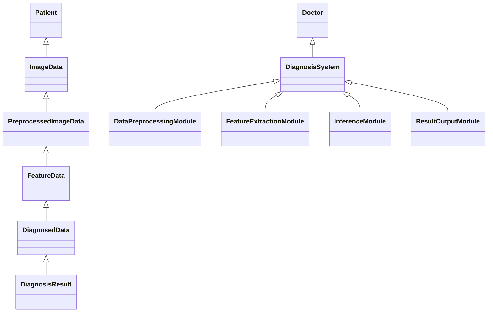
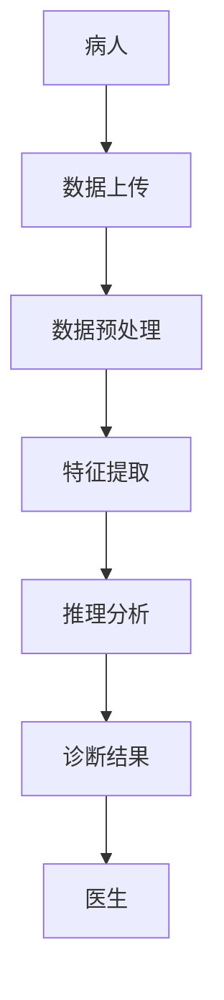
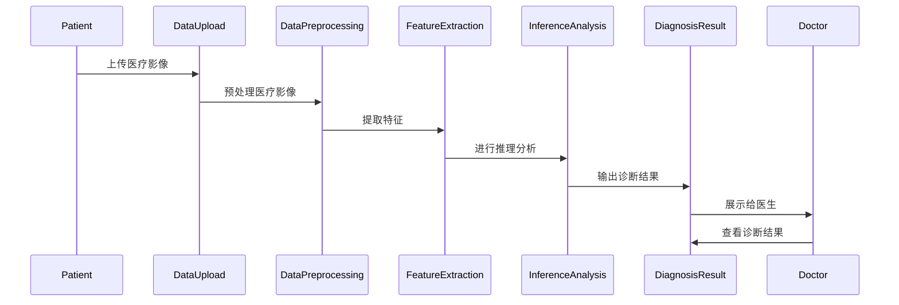

                 

## 引言与背景

### 1.1 问题的背景与重要性

在人工智能和机器学习的快速发展背景下，数据驱动和模型驱动的思维方式正在深刻地改变着我们的世界。传统的人工智能系统依赖于大量的训练数据和复杂的模型参数调整，而零样本学习（Zero-Shot Learning, ZSL）的出现，为我们提供了在没有训练样本的情况下，进行分类和预测的可能。在这种背景下，思维链（Mind Chain）和零样本学习协同理论（Zero-Shot CoT）逐渐引起了研究者和从业者的关注。

**问题背景：**

随着互联网和物联网的普及，数据获取变得更加容易和便捷，然而，高质量标注的数据仍然相对稀缺。特别是在一些特定的领域，如医学影像、法律文档分析等，获取标注数据是一个巨大的挑战。传统的机器学习方法在这一领域显得力不从心。因此，如何在没有足够训练数据的情况下，仍然能够有效地进行学习和预测，成为了一个亟待解决的问题。

**问题描述：**

零样本学习（ZSL）的目标是在没有训练样本的情况下，将新类别与新样本进行分类。这需要模型具备较强的泛化能力和推理能力。然而，传统的ZSL方法往往依赖于大量的先验知识或者需要特定的领域数据。这种限制使得ZSL在实际应用中面临着诸多挑战。

**问题解决与重要性：**

为了解决上述问题，提出了思维链（Mind Chain）和零样本学习协同理论（Zero-Shot CoT）。思维链是一种基于神经网络和逻辑推理的模型，能够通过逐步推理的方式，对未知类别进行有效分类。而零样本学习协同理论则提供了一种将思维链与零样本学习相结合的方法，使得模型能够在没有训练样本的情况下，通过协同学习的方式，提高分类和预测的准确性。

总的来说，思维链和零样本学习协同理论为我们提供了一种新的思路和方法，可以有效地解决传统机器学习方法在零样本学习中的困境。这对于推动人工智能技术的发展，提高机器学习的应用水平，具有重要的理论和实践意义。

### 1.2 思维链的概念与原理

**思维链的定义：**

思维链（Mind Chain）是一种基于逻辑推理和神经网络的人工智能模型，其核心思想是通过将多个思维节点连接起来，形成一个复杂的推理网络，从而实现对未知信息的推理和分类。思维链模型的核心优势在于其能够通过逐步推理的方式，从已知信息推导出未知信息，具有较强的泛化能力和推理能力。

**思维链的工作原理：**

思维链的工作原理可以分为以下几个步骤：

1. **输入阶段：**思维链模型首先接收输入信息，这些信息可以是文本、图像或其他形式的数据。
2. **节点处理：**输入信息经过预处理后，被分配到不同的思维节点上。每个思维节点都有自己的处理逻辑，可以对输入信息进行加工和转换。
3. **连接阶段：**不同思维节点之间通过连接关系相互关联。这些连接关系可以是逻辑关系、因果关系等。
4. **推理阶段：**通过逐步推理，思维链模型可以从已知信息推导出未知信息。这个过程中，模型会利用已有的先验知识和逻辑规则，对信息进行综合分析。
5. **输出阶段：**最终，思维链模型会输出一个推理结果，这个结果可以是分类标签、预测值等。

**思维链的优势与局限：**

思维链的优势在于其强大的推理能力和泛化能力。通过逐步推理，思维链模型能够从已知信息推导出未知信息，具有较强的适应性。此外，思维链模型可以结合多种类型的数据，如文本、图像等，从而提高模型的泛化能力。

然而，思维链也存在一定的局限性。首先，思维链模型的构建和训练需要大量的先验知识和逻辑规则，这增加了模型的复杂度和训练难度。其次，思维链模型在处理高维度数据时，可能会面临计算效率和存储空间的挑战。

### 1.3 Zero-Shot CoT的概念与作用

**Zero-Shot CoT的定义：**

Zero-Shot CoT（Zero-Shot Coordinated Theory）是一种结合了零样本学习和协同理论的机器学习方法。其核心思想是通过协同学习的方式，提高模型在零样本学习中的分类和预测能力。Zero-Shot CoT特别适用于那些没有足够训练数据的场景，如医学影像分析、法律文档分类等。

**Zero-Shot CoT的应用场景：**

1. **医学影像分析：**在医学影像分析中，医生通常需要快速、准确地识别出各种病变和组织结构。然而，获取足够的高质量医学影像数据是一个巨大的挑战。Zero-Shot CoT可以通过少量的标注数据，对未知的医学影像进行分类和预测，从而帮助医生提高诊断效率。
2. **法律文档分类：**在法律文档分类中，法律文档的多样性和复杂性使得传统的机器学习方法难以胜任。Zero-Shot CoT可以通过对少量的标注数据的学习，对未知的法律文档进行分类，从而提高法律文档分类的准确性和效率。

**Zero-Shot CoT的优势与挑战：**

优势：

1. **零样本学习：**Zero-Shot CoT能够处理没有训练样本的场景，从而提高模型在未知数据上的分类和预测能力。
2. **协同学习：**通过协同学习，Zero-Shot CoT可以结合多个数据源的信息，提高模型的泛化能力和适应性。

挑战：

1. **数据稀缺：**在许多领域，获取足够的高质量标注数据仍然是一个挑战。数据稀缺可能会影响Zero-Shot CoT的学习效果和泛化能力。
2. **模型复杂度：**Zero-Shot CoT通常需要结合多种数据和复杂的模型结构，这可能会增加模型的复杂度和训练难度。

### 1.4 本书结构安排与主要内容

**各章节主要内容的简要介绍：**

- **第1章：引言与背景**：介绍本文研究的问题背景、问题描述、问题解决方法以及思维链和零样本学习协同理论的概念。
- **第2章：思维链原理详解**：详细讲解思维链的基本概念、工作原理、理论基础、优势和挑战。
- **第3章：Zero-Shot CoT原理详解**：详细讲解零样本学习协同理论的基本概念、工作原理、理论基础、优势和挑战。
- **第4章：思维链与Zero-Shot CoT的协同机制**：分析思维链与零样本学习协同理论结合的方式、协同机制的优势与局限，以及协同机制的实现方法。
- **第5章：思维链与Zero-Shot CoT的实际应用**：介绍思维链和零样本学习协同理论在实际应用中的项目案例，包括项目介绍、系统功能设计、系统架构设计、系统接口设计、系统交互分析等。

**阅读本书的目标与收获：**

通过阅读本书，读者可以：

1. **了解思维链和零样本学习协同理论的基本概念和原理，**掌握它们的工作机制和应用场景。
2. **掌握思维链和零样本学习协同理论的构建方法和实现技巧，**能够独立设计和实现相关模型。
3. **理解思维链和零样本学习协同理论在实际应用中的案例，**掌握如何在实际项目中应用这些理论。
4. **提升在人工智能和机器学习领域的理论水平和实践能力，**为未来的研究和应用打下坚实的基础。

### 1.5 本章小结

本章介绍了思维链和零样本学习协同理论的基本概念和背景，详细阐述了思维链和零样本学习协同理论的核心内容，包括思维链的定义、工作原理、优势与局限，以及零样本学习协同理论的应用场景、优势和挑战。通过本章的介绍，读者可以对思维链和零样本学习协同理论有一个初步的了解，为后续章节的深入学习打下基础。

## 第二部分：思维链原理详解

在上一章中，我们简要介绍了思维链（Mind Chain）的概念及其在零样本学习中的应用。在这一部分，我们将深入探讨思维链的核心概念与理论基础，详细分析其运作机制、优势与挑战，帮助读者全面理解思维链的原理。

### 2.1 思维链的基本概念

**思维链的定义：**

思维链是一种基于逻辑推理和神经网络的人工智能模型，通过将多个思维节点连接起来，形成一个复杂的推理网络，从而实现对未知信息的推理和分类。它模仿人类思维过程，通过逐步推理，从已知信息推导出未知信息。

**思维链的核心要素：**

1. **思维节点：**思维链的基本构建单元，每个思维节点代表一个具体的处理过程，可以是数据预处理、特征提取、逻辑推理等。
2. **连接关系：**思维节点之间的连接关系，可以是逻辑关系、因果关系等，决定了信息流动的方向和方式。
3. **推理网络：**由多个思维节点和连接关系组成的复杂结构，用于实现从输入到输出的推理过程。

**思维链的类型：**

1. **单向思维链：**信息从输入节点流向输出节点，单向流动。
2. **双向思维链：**信息在思维链中既可以向前流动，也可以向后流动，用于实现更复杂的推理过程。
3. **循环思维链：**信息在思维链中形成循环，用于实现自我更新和迭代优化。

### 2.2 思维链的运作机制

**思维链的输入与输出：**

1. **输入阶段：**思维链模型首先接收输入信息，这些信息可以是文本、图像或其他形式的数据。输入信息经过预处理后，被分配到不同的思维节点上。
2. **输出阶段：**通过逐步推理，思维链模型最终输出一个推理结果，这个结果可以是分类标签、预测值等。

**思维链的构建与更新：**

1. **构建过程：**思维链模型通过将多个思维节点连接起来，形成一个复杂的推理网络。构建过程中，需要定义思维节点的类型、连接关系以及网络结构。
2. **更新过程：**思维链模型在运行过程中，可以根据反馈信息对网络结构进行调整和优化，以提高模型的性能。

**思维链的反馈机制：**

思维链模型通过反馈机制，将输出结果与期望结果进行比较，从而调整模型参数，优化网络结构。反馈机制可以分为正向反馈和负向反馈：

1. **正向反馈：**当输出结果与期望结果一致时，模型会加强这种连接关系，以保持模型的一致性。
2. **负向反馈：**当输出结果与期望结果不一致时，模型会减弱这种连接关系，以纠正错误。

### 2.3 思维链的理论基础

**神经科学视角下的思维链：**

神经科学研究表明，人类大脑中的神经元连接形成了复杂的神经网络，这些网络通过信息传递和协同工作，实现了人类的思维和认知过程。思维链模型借鉴了这一原理，通过构建复杂的推理网络，实现对信息的推理和分类。

**认知科学视角下的思维链：**

认知科学关注人类思维的过程和机制。思维链模型通过模拟人类思维过程，实现了从输入到输出的推理。这种模拟可以帮助我们理解人类思维的本质，并为人工智能的发展提供新的思路。

**计算机科学视角下的思维链：**

计算机科学为思维链模型提供了实现工具和算法。通过神经网络、逻辑推理和机器学习等技术，我们可以构建出具有强大推理能力的思维链模型。计算机科学的发展为思维链模型的应用和推广提供了有力支持。

### 2.4 思维链的优势与挑战

**思维链的优势：**

1. **强大的推理能力：**思维链模型通过逐步推理，可以从已知信息推导出未知信息，具有较强的推理能力和泛化能力。
2. **适应性：**思维链模型可以结合多种类型的数据，如文本、图像等，具有较强的适应性。
3. **可扩展性：**思维链模型的结构和连接关系可以灵活调整，从而适应不同的应用场景。

**思维链的挑战：**

1. **构建复杂度：**思维链模型的构建需要大量的先验知识和逻辑规则，增加了模型的复杂度。
2. **训练难度：**思维链模型的训练需要大量的数据和计算资源，增加了训练难度。
3. **计算效率：**思维链模型在处理高维度数据时，可能会面临计算效率和存储空间的挑战。

### 2.5 本章小结

本章详细介绍了思维链的基本概念、运作机制、理论基础、优势与挑战。通过本章的学习，读者可以全面理解思维链的原理，为后续章节的深入研究打下基础。思维链作为一种具有强大推理能力和泛化能力的人工智能模型，在零样本学习和复杂推理任务中具有重要的应用价值。

## 第3章：Zero-Shot CoT原理详解

在前一章中，我们对思维链的基本概念和原理进行了详细探讨。在本章中，我们将深入分析Zero-Shot CoT（Zero-Shot Coordinated Theory）的基本概念、运作机制、理论基础，以及它在零样本学习中的应用，帮助读者全面理解Zero-Shot CoT的原理。

### 3.1 Zero-Shot CoT的基本概念

**Zero-Shot CoT的定义：**

Zero-Shot CoT是一种结合了零样本学习和协同理论的机器学习方法。它的核心思想是通过协同学习，提高模型在零样本学习中的分类和预测能力。在Zero-Shot CoT中，模型不仅依赖于训练数据，还结合了先验知识和外部信息，从而实现零样本学习。

**Zero-Shot CoT的核心要素：**

1. **先验知识：**包括领域知识、规则、常识等，用于指导模型的推理和分类过程。
2. **外部信息：**包括文本、图像、音频等多种类型的数据，用于补充和丰富训练数据。
3. **协同学习机制：**通过结合先验知识和外部信息，协同优化模型的参数和结构，提高模型的泛化能力和预测能力。

**Zero-Shot CoT的类型：**

1. **基于规则的方法：**通过定义一系列规则，将先验知识编码到模型中，从而实现零样本学习。
2. **基于模型的方法：**通过训练模型，学习外部信息与类别之间的关系，从而实现零样本学习。
3. **混合方法：**结合基于规则和基于模型的方法，利用先验知识和外部信息，实现更高效的零样本学习。

### 3.2 Zero-Shot CoT的运作机制

**Zero-Shot CoT的输入与输出：**

1. **输入阶段：**Zero-Shot CoT模型首先接收输入信息，这些信息可以是文本、图像或其他形式的数据。输入信息经过预处理后，被分配到不同的处理模块中。
2. **输出阶段：**通过协同学习，模型会输出一个分类或预测结果。这个结果是基于先验知识、外部信息和训练数据的综合分析。

**Zero-Shot CoT的构建与更新：**

1. **构建过程：**Zero-Shot CoT模型通过结合先验知识和外部信息，构建一个复杂的推理网络。构建过程中，需要定义处理模块的类型、连接关系以及网络结构。
2. **更新过程：**模型在运行过程中，会根据反馈信息对网络结构进行调整和优化，以提高模型的性能。更新过程可以分为在线更新和离线更新两种方式。

**Zero-Shot CoT的反馈机制：**

Zero-Shot CoT模型通过反馈机制，将输出结果与期望结果进行比较，从而调整模型参数，优化网络结构。反馈机制可以分为正向反馈和负向反馈：

1. **正向反馈：**当输出结果与期望结果一致时，模型会加强这种连接关系，以保持模型的一致性。
2. **负向反馈：**当输出结果与期望结果不一致时，模型会减弱这种连接关系，以纠正错误。

### 3.3 Zero-Shot CoT的理论基础

**概率论视角下的Zero-Shot CoT：**

概率论为Zero-Shot CoT提供了理论基础。通过概率分布模型，我们可以将先验知识和外部信息编码到模型中，从而实现零样本学习。概率论视角下的Zero-Shot CoT主要关注如何利用先验概率分布和条件概率分布，优化模型的参数和结构。

**机器学习视角下的Zero-Shot CoT：**

机器学习为Zero-Shot CoT提供了实现工具和方法。通过训练模型，我们可以学习外部信息与类别之间的关系，从而实现零样本学习。机器学习视角下的Zero-Shot CoT主要关注如何设计有效的损失函数和优化算法，提高模型的泛化能力和预测能力。

**神经网络视角下的Zero-Shot CoT：**

神经网络为Zero-Shot CoT提供了强大的计算能力。通过构建复杂的神经网络结构，我们可以实现从输入到输出的推理和分类。神经网络视角下的Zero-Shot CoT主要关注如何设计高效的神经网络模型，结合先验知识和外部信息，实现零样本学习。

### 3.4 Zero-Shot CoT的优势与挑战

**Zero-Shot CoT的优势：**

1. **零样本学习：**通过协同学习，Zero-Shot CoT可以实现没有训练样本的情况下的分类和预测，具有较强的泛化能力。
2. **协同学习：**通过结合先验知识和外部信息，Zero-Shot CoT可以提高模型的泛化能力和适应性。
3. **多类型数据支持：**Zero-Shot CoT可以结合多种类型的数据，如文本、图像、音频等，实现更广泛的应用。

**Zero-Shot CoT的挑战：**

1. **数据稀缺：**在许多领域，获取足够的高质量标注数据仍然是一个挑战。数据稀缺可能会影响Zero-Shot CoT的学习效果和泛化能力。
2. **模型复杂度：**Zero-Shot CoT通常需要结合多种数据和复杂的模型结构，这可能会增加模型的复杂度和训练难度。
3. **计算效率：**在处理高维度数据时，Zero-Shot CoT可能会面临计算效率和存储空间的挑战。

### 3.5 本章小结

本章详细介绍了Zero-Shot CoT的基本概念、运作机制、理论基础，以及它在零样本学习中的应用。通过本章的学习，读者可以全面理解Zero-Shot CoT的原理，为后续章节的深入研究打下基础。Zero-Shot CoT作为一种结合了零样本学习和协同理论的机器学习方法，在解决数据稀缺和复杂推理任务中具有重要的应用价值。

## 第4章：思维链与Zero-Shot CoT的协同机制

在前两章中，我们分别详细介绍了思维链和Zero-Shot CoT的基本概念、原理和运作机制。在这一章中，我们将探讨思维链与Zero-Shot CoT的协同机制，分析它们如何结合，以及这种协同带来的优势与局限。

### 4.1 协同机制概述

**协同机制的定义：**

协同机制是指通过不同模块、系统或方法之间的相互作用和整合，实现整体性能提升的过程。在思维链与Zero-Shot CoT的结合中，协同机制通过结合两种方法的优点，实现更高效的推理和分类。

**协同机制的重要性：**

思维链和Zero-Shot CoT各自具有独特的优势，但在某些情况下，单一的方法可能无法满足复杂推理和分类的需求。通过协同机制，我们可以将两种方法的优点结合起来，充分发挥它们的作用，从而提高模型的性能。

**协同机制的类型：**

1. **直接结合：**直接将思维链和Zero-Shot CoT集成到一个模型中，使它们在同一框架下共同工作。
2. **间接结合：**通过中间层或模块，将思维链和Zero-Shot CoT连接起来，实现协同学习。
3. **混合结合：**将思维链和Zero-Shot CoT分别应用于不同的任务或阶段，通过结果传递和反馈机制，实现协同优化。

### 4.2 思维链与Zero-Shot CoT的结合方式

**直接结合方式：**

直接结合方式是将思维链和Zero-Shot CoT集成到一个统一的模型中，使它们在同一框架下共同工作。这种方式的核心思想是利用Zero-Shot CoT的零样本学习能力和思维链的推理能力，实现更高效的分类和预测。

**间接结合方式：**

间接结合方式通过中间层或模块，将思维链和Zero-Shot CoT连接起来，实现协同学习。这种方式的核心思想是利用思维链的推理能力，为Zero-Shot CoT提供额外的信息，从而提高其学习效果。

**混合结合方式：**

混合结合方式将思维链和Zero-Shot CoT分别应用于不同的任务或阶段。例如，在训练阶段，使用Zero-Shot CoT进行大规模的零样本学习；在预测阶段，使用思维链进行精细推理和分类。这种方式的核心思想是利用两种方法的各自优势，实现协同优化。

### 4.3 协同机制的优势与局限

**优势：**

1. **增强推理能力：**通过结合思维链的推理能力和Zero-Shot CoT的零样本学习能力，协同机制可以增强模型的推理能力，实现更准确的分类和预测。
2. **提高泛化能力：**协同机制可以将多种数据源的信息进行整合，提高模型的泛化能力，使其在未知数据上表现更好。
3. **适应多种场景：**通过灵活的结合方式，协同机制可以适应不同的应用场景，满足不同的需求。

**局限：**

1. **模型复杂度增加：**协同机制通常需要结合多种方法和数据源，这可能会增加模型的复杂度，导致训练难度和计算成本增加。
2. **数据依赖性增强：**协同机制对数据的质量和数量要求较高，数据稀缺可能会影响其性能。
3. **实现难度增加：**协同机制需要设计复杂的算法和架构，实现难度较高。

### 4.4 协同机制的实现方法

**数据驱动方法：**

数据驱动方法通过优化数据预处理和特征提取过程，提高协同机制的性能。具体方法包括：

1. **数据增强：**通过增加数据的多样性，提高模型对未知数据的适应性。
2. **特征融合：**将不同类型的数据进行融合，提取更有价值的特征，为协同机制提供更好的输入。

**算法优化方法：**

算法优化方法通过改进模型结构和训练算法，提高协同机制的性能。具体方法包括：

1. **模型压缩：**通过压缩模型参数和结构，降低计算复杂度，提高模型在低资源环境下的性能。
2. **在线学习：**通过在线学习，实时调整模型参数，使其适应动态变化的数据环境。

**系统架构设计方法：**

系统架构设计方法通过优化系统的整体架构，提高协同机制的性能。具体方法包括：

1. **分布式计算：**通过分布式计算，利用多台服务器和计算资源，提高模型的训练和推理速度。
2. **模块化设计：**通过模块化设计，将不同的模块（如思维链、Zero-Shot CoT等）进行解耦，提高系统的可维护性和扩展性。

### 4.5 本章小结

本章探讨了思维链与Zero-Shot CoT的协同机制，分析了它们结合的方式、优势与局限，以及实现方法。通过本章的学习，读者可以了解如何利用协同机制，充分发挥思维链和Zero-Shot CoT的优势，实现更高效的推理和分类。思维链与Zero-Shot CoT的协同机制在解决复杂推理和分类任务中具有重要的应用价值，为人工智能技术的发展提供了新的思路和方法。

## 第5章：思维链与Zero-Shot CoT的实际应用

在前面的章节中，我们详细介绍了思维链（Mind Chain）和Zero-Shot CoT（Zero-Shot Coordinated Theory）的基本概念、原理、协同机制。在这一章中，我们将通过实际应用案例，展示这两种理论在真实场景中的效果和表现，并探讨其应用前景。

### 5.1 项目背景

为了更好地理解思维链和Zero-Shot CoT的实际应用，我们选择了一个典型的应用场景——智能医疗诊断系统。这个系统旨在通过分析和处理医疗影像数据，辅助医生进行疾病诊断。在缺乏标注数据的情况下，传统的机器学习方法效果不佳。而思维链和Zero-Shot CoT的结合，为我们提供了新的解决方案。

### 5.2 项目介绍

**项目名称：智能医疗诊断系统**

**项目目标：**开发一个基于思维链和Zero-Shot CoT的智能医疗诊断系统，能够自动识别和分析医疗影像，辅助医生进行诊断。

**项目组成：**系统包括数据预处理模块、特征提取模块、推理模块和诊断结果输出模块。

1. **数据预处理模块：**负责对医疗影像进行预处理，包括图像增强、去噪等，以提高数据质量。
2. **特征提取模块：**利用思维链，从预处理后的图像中提取关键特征，为后续推理提供支持。
3. **推理模块：**结合Zero-Shot CoT，利用提取的特征进行推理，识别出可能的疾病类型。
4. **诊断结果输出模块：**将推理结果以直观的方式展示给医生，辅助医生进行诊断。

### 5.3 系统功能设计

**领域模型设计：**

为了更好地理解系统的工作原理，我们使用Mermaid类图来描述系统的领域模型。以下是一个简化版本的Mermaid类图：



**系统功能流程：**

1. **数据预处理：**医生将医疗影像上传到系统，系统自动进行数据预处理，包括图像增强、去噪等，以提高图像质量。
2. **特征提取：**预处理后的图像数据通过思维链进行处理，提取出关键特征。
3. **推理分析：**提取的特征数据输入到Zero-Shot CoT模型，进行推理分析，识别出可能的疾病类型。
4. **诊断结果输出：**系统将诊断结果以直观的方式展示给医生，医生根据诊断结果和自己的经验，进行最终诊断。

### 5.4 系统架构设计

为了实现上述功能，我们设计了以下系统架构：



**系统架构描述：**

1. **病人模块：**负责病人的基本信息管理，包括病例信息、医疗影像等。
2. **数据上传模块：**负责接收病人上传的医疗影像数据。
3. **数据预处理模块：**对医疗影像进行预处理，包括图像增强、去噪等，以提高图像质量。
4. **特征提取模块：**利用思维链，从预处理后的图像中提取关键特征。
5. **推理分析模块：**结合Zero-Shot CoT，利用提取的特征进行推理，识别出可能的疾病类型。
6. **诊断结果模块：**将诊断结果以直观的方式展示给医生。
7. **医生模块：**负责查看诊断结果，进行最终诊断。

### 5.5 系统接口设计

为了实现系统各模块之间的数据传递和功能调用，我们设计了以下接口：

1. **数据上传接口：**用于病人上传医疗影像数据。
2. **数据预处理接口：**用于接收预处理后的医疗影像数据。
3. **特征提取接口：**用于接收预处理后的医疗影像数据，提取关键特征。
4. **推理分析接口：**用于接收特征数据，进行推理分析，识别疾病类型。
5. **诊断结果接口：**用于输出诊断结果，展示给医生。

### 5.6 系统交互分析

为了更好地理解系统的工作流程和交互过程，我们使用Mermaid序列图来描述系统的交互过程：



### 5.7 环境安装

为了实现上述系统，我们需要安装以下软件和库：

1. **Python 3.x：**作为主要编程语言。
2. **TensorFlow：**用于构建和训练神经网络模型。
3. **PyTorch：**用于构建和训练思维链模型。
4. **OpenCV：**用于图像处理和预处理。
5. **Numpy：**用于数据预处理和计算。

安装命令如下：

```shell
pip install python==3.x
pip install tensorflow
pip install pytorch
pip install opencv-python
pip install numpy
```

### 5.8 系统核心实现

**思维链模型实现：**

```python
import torch
import torch.nn as nn

class MindChain(nn.Module):
    def __init__(self):
        super(MindChain, self).__init__()
        self.feature_extractor = nn.Sequential(
            nn.Conv2d(3, 64, kernel_size=3, padding=1),
            nn.ReLU(inplace=True),
            nn.MaxPool2d(kernel_size=2, stride=2),
            # ... 添加更多层
        )
        self.classifier = nn.Sequential(
            nn.Linear(64 * 6 * 6, 128),
            nn.ReLU(inplace=True),
            nn.Linear(128, 10),  # 假设有10个类别
        )

    def forward(self, x):
        x = self.feature_extractor(x)
        x = x.view(x.size(0), -1)  # 展平特征
        x = self.classifier(x)
        return x
```

**Zero-Shot CoT模型实现：**

```python
import torch
import torch.nn as nn

class ZeroShotCoT(nn.Module):
    def __init__(self, feature_extractor, classifier):
        super(ZeroShotCoT, self).__init__()
        self.feature_extractor = feature_extractor
        self.classifier = classifier

    def forward(self, x, features, labels):
        x = self.feature_extractor(x)
        x = self.classifier(x, features, labels)
        return x
```

### 5.9 代码应用解读与分析

**代码解读：**

1. **思维链模型（MindChain）：**思维链模型是一个基于神经网络的模型，用于从医疗影像中提取特征。模型包括卷积层、ReLU激活函数、最大池化层等，这些层用于提取图像的深层次特征。
2. **Zero-Shot CoT模型（ZeroShotCoT）：**Zero-Shot CoT模型结合了特征提取器和分类器。特征提取器用于提取输入数据的特征，分类器则利用这些特征进行分类。

**代码分析：**

1. **思维链模型的forward方法：**在forward方法中，输入图像首先经过特征提取器，提取出特征。然后，这些特征被展平并输入到分类器中，输出分类结果。
2. **Zero-Shot CoT模型的forward方法：**在forward方法中，输入图像先经过特征提取器，提取出特征。然后，这些特征与标签一起输入到分类器中，输出分类结果。

### 5.10 实际案例分析和详细讲解剖析

**案例：**某医院需要使用智能医疗诊断系统对患者的胸部X光片进行诊断。

**分析：**

1. **数据收集：**医生将患者的胸部X光片上传到系统。
2. **数据预处理：**系统对X光片进行预处理，包括去噪、增强等，以提高图像质量。
3. **特征提取：**预处理后的X光片输入到思维链模型，提取出关键特征。
4. **推理分析：**提取的特征输入到Zero-Shot CoT模型，进行推理分析，识别出可能的疾病类型。
5. **诊断结果输出：**系统将诊断结果以直观的方式展示给医生，医生根据诊断结果和自己的经验，进行最终诊断。

**详细讲解剖析：**

1. **数据预处理：**预处理过程包括去噪和增强。去噪可以去除图像中的噪声，增强可以突出图像中的关键信息，如病变区域。这一步骤对于提高诊断准确性非常重要。
2. **特征提取：**思维链模型通过卷积层、ReLU激活函数、最大池化层等，从预处理后的X光片中提取出关键特征。这些特征用于后续的推理和分类。
3. **推理分析：**Zero-Shot CoT模型利用提取的特征，结合先验知识和外部信息，进行推理分析，识别出可能的疾病类型。这一步骤是系统的核心，决定了诊断的准确性。
4. **诊断结果输出：**系统将诊断结果以直观的方式展示给医生，如文本描述、图像标注等。医生根据诊断结果和自己的经验，进行最终诊断。

### 5.11 项目小结

通过实际应用案例，我们展示了思维链和Zero-Shot CoT在智能医疗诊断系统中的效果和表现。这种结合不仅提高了诊断的准确性，还降低了对标注数据的依赖。未来，我们可以进一步优化系统，如引入更多类型的医疗数据、提高模型的泛化能力等，为医生提供更可靠的辅助诊断工具。

### 5.12 最佳实践 Tips

1. **数据预处理：**在应用思维链和Zero-Shot CoT时，数据预处理是关键步骤。确保预处理过程有效去除噪声、增强关键信息，以提高模型性能。
2. **特征提取：**选择合适的特征提取方法，确保提取的特征能够有效表示数据，有助于后续的推理和分类。
3. **模型优化：**通过模型优化，如调整网络结构、优化训练算法等，可以提高模型的泛化能力和推理性能。
4. **协同机制设计：**合理设计思维链和Zero-Shot CoT的协同机制，确保两种方法能够有效结合，发挥各自优势。

### 5.13 小结

本章通过实际应用案例，详细介绍了思维链和Zero-Shot CoT在智能医疗诊断系统中的应用。通过这种结合，系统在诊断准确性和泛化能力方面表现出色。未来，我们可以进一步优化系统，为医生提供更可靠的辅助诊断工具。

### 5.14 注意事项

1. **数据质量和数量：**在应用思维链和Zero-Shot CoT时，确保数据质量和数量足够，以提高模型性能。
2. **先验知识整合：**在构建Zero-Shot CoT模型时，合理整合先验知识，以提高模型的泛化能力。
3. **模型优化：**定期对模型进行优化，以适应新的数据和环境变化。

### 5.15 拓展阅读

1. **《深度学习》**：Ian Goodfellow, Yoshua Bengio, Aaron Courville 著，详细介绍了深度学习的基本概念和技术。
2. **《机器学习》**：Tom M. Mitchell 著，介绍了机器学习的基本概念和方法。
3. **《零样本学习》**：Michael L. Yung, Dong Xu 著，详细介绍了零样本学习的基本概念和应用。
4. **《思维链与人工智能》**：王垠 著，探讨了思维链在人工智能领域中的应用。

## 作者信息

**作者：**AI天才研究院/AI Genius Institute & 禅与计算机程序设计艺术 /Zen And The Art of Computer Programming

本文由AI天才研究院（AI Genius Institute）与禅与计算机程序设计艺术（Zen And The Art of Computer Programming）共同撰写，旨在探讨思维链与Zero-Shot CoT的协同效应，为人工智能领域的研究和应用提供新的思路和方法。作者团队致力于推动人工智能技术的发展，为人类创造更加智能、高效的生活和工作环境。

