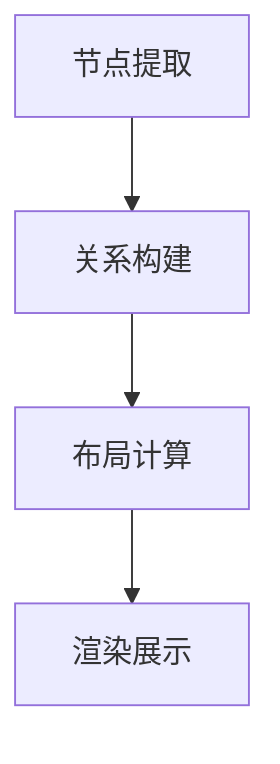
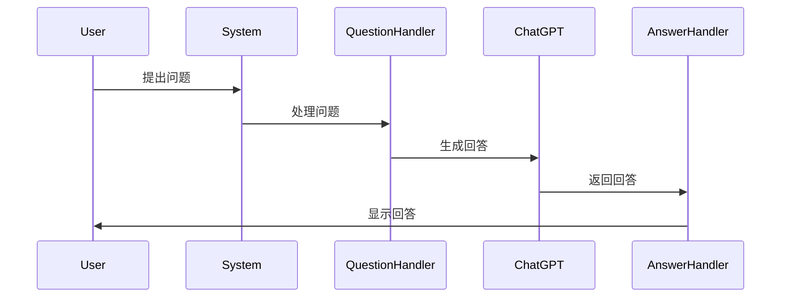
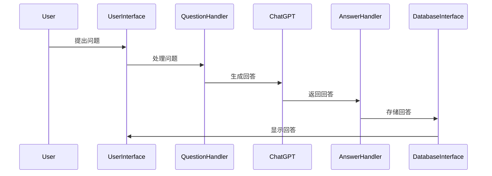

                 

# 思维链可视化：理解ChatGPT的决策过程

## 关键词：思维链、ChatGPT、可视化、决策过程、算法原理

## 摘要：
本文将深入探讨思维链可视化的概念，结合ChatGPT模型，详细解析其决策过程。通过分步骤的分析，我们将展示如何将复杂的决策过程转化为易于理解的图形化表示，从而为程序员和AI开发者提供宝贵的见解。

## 第一部分: 问题背景与核心概念

### 1.1 问题背景

#### 1.1.1 ChatGPT的产生与发展
ChatGPT是由OpenAI开发的一种基于Transformer的大型语言模型，它通过深度学习技术从大量的文本数据中学习语言模式和结构。ChatGPT的出现标志着自然语言处理（NLP）领域的重大突破，它能够生成高质量的自然语言文本，模拟人类的对话交互。

#### 1.1.2 思维链的概念及其重要性
思维链（Mind Chain）是一个概念框架，用于描述思维过程中信息的流动和链接。它强调了思维活动中的逻辑关系和信息关联，对于理解和优化人工智能的决策过程具有重要意义。

#### 1.1.3 思维链可视化的需求
随着AI模型变得越来越复杂，如何有效地理解和分析其决策过程成为了一个挑战。思维链可视化提供了一种图形化的方法，使得AI的决策过程变得更加透明和易于理解。

### 1.2 核心概念

#### 1.2.1 思维链的概念与特征

##### 1.2.1.1 思维链的定义
思维链可以被定义为一组相互关联的思维节点，每个节点代表一个独立的思考步骤或信息单元。

##### 1.2.1.2 不同类型的思维链
思维链可以按照其结构和功能分为不同的类型，如线性思维链、分支思维链和循环思维链。

#### 1.2.2 ChatGPT的核心原理

##### 1.2.2.1 ChatGPT的模型结构
ChatGPT基于Transformer架构，使用自注意力机制来处理输入文本，并通过多层神经网络进行文本生成。

##### 1.2.2.2 ChatGPT的决策过程
ChatGPT的决策过程涉及文本预处理、语境理解、文本生成和后处理等多个步骤。

## 第二部分: 算法原理与系统设计

### 2.1 算法原理

#### 2.1.1 思维链可视化流程图

使用Mermaid绘制思维链可视化的流程图，展示思维链的构建和可视化过程。

#### 2.1.2 Python源代码阐述

通过Python源代码实现思维链可视化算法，详细解释代码中的每一个步骤。

#### 2.1.3 ChatGPT决策过程的数学模型

解释ChatGPT决策过程的数学模型，包括文本嵌入、自注意力机制和文本生成公式。

### 2.2 系统分析与架构设计

#### 2.2.1 问题场景介绍
介绍项目背景和需求，说明为什么思维链可视化对于ChatGPT的决策过程理解至关重要。

#### 2.2.2 系统功能设计
使用Mermaid绘制领域模型类图，说明系统的功能模块和类之间的关系。

#### 2.2.3 系统架构设计
使用Mermaid绘制系统架构图，展示系统组件和它们之间的交互关系。

#### 2.2.4 系统接口设计
定义系统的接口规范，说明不同组件之间的通信方式。

#### 2.2.5 系统交互
使用Mermaid绘制系统交互序列图，展示用户与系统之间的交互过程。

## 第三部分: 项目实战与案例分析

### 3.1 项目实战

#### 3.1.1 环境安装
介绍项目所需的环境配置和依赖安装步骤。

#### 3.1.2 核心实现源代码
提供项目核心代码，并解释代码的实现逻辑。

#### 3.1.3 代码解读与分析
深入分析代码的每个部分，解释其功能和工作原理。

### 3.2 实际案例分析与详细讲解

#### 3.2.1 案例介绍
介绍一个实际案例，说明案例的背景和目标。

#### 3.2.2 案例详细讲解
详细讲解案例的实现步骤，包括关键技术和难点解析。

#### 3.2.3 案例小结
总结案例的收获和经验，提出拓展应用的建议。

## 第四部分: 最佳实践、小结与拓展阅读

### 4.1 最佳实践
分享在实际项目中应用思维链可视化的最佳实践。

### 4.2 小结
回顾文章的主要内容，强调思维链可视化在理解ChatGPT决策过程中的重要性。

### 4.3 注意事项
提醒读者在实践过程中需要注意的事项。

### 4.4 拓展阅读
推荐进一步阅读的相关资料，帮助读者深入了解相关技术。

## 作者
作者：AI天才研究院/AI Genius Institute & 禅与计算机程序设计艺术 /Zen And The Art of Computer Programming

---

## 1.1 ChatGPT的产生与发展

### 1.1.1 ChatGPT的产生
ChatGPT是由OpenAI在2022年11月30日发布的一种基于Transformer的大型语言模型。它的出现是自然语言处理（NLP）领域的重要里程碑，标志着人工智能在理解和生成人类语言方面的重大进步。ChatGPT的诞生，源于OpenAI对通用预训练语言模型（GPT）的不断探索和优化。

### 1.1.2 ChatGPT的发展
ChatGPT自发布以来，迅速获得了全球的关注和赞誉。它凭借强大的文本生成能力和上下文理解能力，在多个任务中展现出卓越的表现。从文本摘要、机器翻译到对话系统，ChatGPT都展现出了令人惊叹的能力。其发展历程，也是人工智能技术在NLP领域不断突破和创新的见证。

### 1.1.3 ChatGPT的重要意义
ChatGPT的出现，不仅丰富了人工智能在自然语言处理领域的应用场景，也为人类与机器之间的交流提供了新的可能性。通过深度学习和自我优化，ChatGPT能够不断学习和改进，使其在未来的应用中，能够更好地模拟人类的思维过程，实现更为智能的交互。

### 1.1.4 ChatGPT的决策过程
ChatGPT的决策过程可以分为以下几个步骤：
1. **文本预处理**：对输入的文本进行预处理，包括分词、去停用词等操作。
2. **文本编码**：将预处理后的文本转换为向量表示，便于模型处理。
3. **上下文理解**：利用自注意力机制，模型对上下文进行理解和分析。
4. **文本生成**：根据上下文，模型生成对应的文本输出。
5. **后处理**：对生成的文本进行后处理，如修正语法错误、格式化输出等。

### 1.1.5 ChatGPT的优势与局限
ChatGPT的优势在于其强大的文本生成能力和上下文理解能力，能够生成高质量的自然语言文本。然而，其也存在一定的局限，如对复杂逻辑和抽象概念的解析能力有限，生成的文本可能存在偏见和误导性。

### 1.1.6 ChatGPT的未来发展
随着人工智能技术的不断进步，ChatGPT有望在多个领域发挥更大的作用。未来，ChatGPT可能会在对话系统、智能客服、内容生成等方面实现更为广泛的应用。同时，通过不断优化和改进，ChatGPT的决策过程和生成能力也将得到进一步提升。

### 1.1.7 ChatGPT在社会中的应用
ChatGPT已经在多个社会领域展现出其应用潜力：
1. **教育**：辅助教师进行教学，提供个性化学习建议。
2. **医疗**：辅助医生进行诊断，提供患者咨询。
3. **客服**：提供24/7的智能客服服务，提高客户满意度。
4. **新闻**：生成新闻报道，提高新闻生产效率。

### 1.1.8 ChatGPT的商业价值
ChatGPT的商业价值主要体现在其能够帮助企业提高效率和降低成本。通过智能化的文本生成和交互，企业可以在客户服务、市场推广、内容创作等方面实现自动化和智能化。

### 1.1.9 ChatGPT的挑战与机遇
面对ChatGPT带来的挑战，如数据隐私、伦理问题等，我们需要在技术创新的同时，也要关注其可能带来的社会影响。同时，ChatGPT也为人工智能领域带来了前所未有的机遇，有望推动NLP技术的进一步发展。

### 1.1.10 总结
ChatGPT的发布，不仅标志着人工智能技术的重大突破，也为人类与机器之间的交流提供了新的可能性。在未来的发展中，ChatGPT有望在更广泛的领域发挥重要作用，推动人工智能技术的进一步发展。

## 1.2 思维链的概念及其重要性

### 1.2.1 思维链的定义
思维链（Mind Chain）是一个用于描述思维过程中信息流动和链接的概念框架。它由一系列相互关联的思维节点组成，每个节点代表一个独立的思考步骤或信息单元。这些节点通过逻辑关系和信息关联相互连接，形成一个动态的、不断演化的思维网络。

### 1.2.2 思维链的特征
思维链具有以下几个显著特征：

1. **动态性**：思维链不是静态的结构，而是随着思考的进行不断演化和调整。每个节点都可以根据新的信息或思考结果进行更新和重组。

2. **灵活性**：思维链允许思维者在不同的思维方向之间自由切换，使得思维过程更加灵活和多样化。

3. **模块化**：思维链的节点可以独立存在，也可以与其他节点组合成更大的思维模块。这种模块化特性使得思维过程更加高效和可扩展。

4. **层次性**：思维链具有不同的层次，从基础概念到复杂抽象，每个层次代表思维过程中不同层面的思考。

5. **可扩展性**：思维链可以根据需要添加新的节点或修改现有节点的属性，使得思维过程可以适应不同的问题和场景。

### 1.2.3 思维链的类型
思维链可以根据其结构和功能分为不同的类型：

1. **线性思维链**：线性思维链是最简单的思维链类型，它按照时间顺序排列，每个节点代表一个独立的思考步骤。线性思维链适合用于处理序列性问题，如编程、写作等。

2. **分支思维链**：分支思维链在节点之间形成了多个分支，每个分支代表一个独立的思考路径。分支思维链适合用于处理复杂问题和多方案选择，如决策分析、项目规划等。

3. **循环思维链**：循环思维链中的节点可以回到之前的节点，形成闭环。循环思维链适合用于处理循环问题和迭代过程，如算法优化、迭代学习等。

### 1.2.4 思维链的重要性
思维链在人工智能和认知科学中具有重要的地位，其重要性体现在以下几个方面：

1. **决策支持**：思维链可以帮助人工智能系统更好地进行决策。通过构建和优化思维链，可以实现对复杂问题的分析和解决。

2. **知识表示**：思维链作为一种知识表示方法，可以有效地组织和存储大量的信息。它能够将离散的信息整合成一个连贯的思维网络，使得知识检索和理解更加高效。

3. **学习与推理**：思维链可以用于学习新知识和推理过程。通过不断地调整和优化思维链，可以实现对未知信息的理解和预测。

4. **人机交互**：思维链可视化技术可以为人类用户提供直观的思维方式表示，使得人机交互更加自然和高效。

5. **创新思维**：思维链可以帮助人们打破传统思维框架，探索新的思路和解决方案。它为创新思维提供了工具和方法，促进了科学发现和技术创新。

### 1.2.5 思维链的应用场景
思维链的应用场景非常广泛，包括但不限于以下领域：

1. **人工智能**：思维链可以用于构建智能系统的知识表示和决策逻辑。

2. **认知科学**：思维链为研究人类思维过程提供了新的视角和工具。

3. **教育**：思维链可视化技术可以用于辅助教学和学生学习。

4. **产品设计**：思维链可以帮助设计师更好地理解和设计复杂的产品系统。

5. **项目管理**：思维链可以用于项目规划和资源分配。

6. **医学诊断**：思维链可以帮助医生进行诊断和治疗方案的制定。

### 1.2.6 总结
思维链作为一种描述思维过程的框架，具有动态性、灵活性、模块化、层次性和可扩展性等特征。它在人工智能、认知科学、教育、产品设计、项目管理和医学诊断等领域具有重要应用价值。通过思维链可视化技术，我们可以更好地理解复杂的思维过程，促进人工智能的发展和人类认知的提升。

## 1.3 思维链可视化的需求

### 1.3.1 理解复杂决策过程
思维链可视化提供了一种图形化的方式来展示复杂的决策过程。通过将抽象的思维步骤和逻辑关系以图形的形式呈现，使得决策过程更加直观和易于理解。这对于那些需要深入分析复杂问题的AI开发者和研究者来说尤为重要。

### 1.3.2 提高问题解决效率
可视化技术可以帮助人们更快地识别问题和解决方案。通过思维链的可视化，可以直观地看到不同思维节点之间的关系和逻辑流程，从而提高问题解决的效率和准确性。

### 1.3.3 促进团队合作与沟通
思维链可视化可以作为团队沟通和协作的工具。通过图形化的表示，团队成员可以更好地理解彼此的思维过程和解决方案，促进有效的沟通和合作。

### 1.3.4 支持人工智能的优化与改进
对于人工智能系统来说，思维链可视化是一种有效的工具，可以用于分析和优化系统的决策过程。通过可视化，可以发现系统中存在的瓶颈和改进空间，从而推动人工智能技术的持续优化。

### 1.3.5 增强用户对AI系统的信任感
通过思维链可视化，用户可以更加直观地看到AI系统的决策过程，增加对系统的信任感。这种透明性不仅有助于用户理解系统的行为，还可以提高系统的可解释性和可靠性。

### 1.3.6 满足不同领域的需求
思维链可视化技术可以广泛应用于多个领域，如金融、医疗、教育、制造业等。在这些领域，可视化技术可以提供更加具体和实用的解决方案，满足不同领域的特定需求。

### 1.3.7 促进创新与研发
思维链可视化作为一种创新的思维方式，可以激发新的想法和解决方案。在研发过程中，通过可视化，可以发现新的研究方向和潜在的改进点，促进创新和研发的进展。

### 1.3.8 提升用户体验
在产品设计和开发过程中，思维链可视化可以帮助设计师和开发者更好地理解用户需求和行为模式，从而提升产品的用户体验。通过可视化的方式，可以直观地展示产品功能和流程，使用户能够更容易地理解和操作产品。

### 1.3.9 支持知识管理和知识共享
思维链可视化可以作为知识管理和共享的工具。通过将思维链图形化，可以将知识以直观、易于理解的形式存储和传递，促进知识的积累和共享。

### 1.3.10 满足教育和培训需求
在教育和培训领域，思维链可视化可以作为一种有效的教学工具。通过可视化，教师可以更好地解释复杂的概念和逻辑，帮助学生更好地理解和掌握知识。

### 1.3.11 总结
思维链可视化在多个领域具有重要的需求和应用价值。它不仅能够帮助人们更好地理解复杂的决策过程，提高问题解决效率，促进团队合作与沟通，还支持人工智能的优化与改进，增强用户对AI系统的信任感，满足不同领域的特定需求，促进创新与研发，提升用户体验，支持知识管理和知识共享，以及满足教育和培训需求。因此，思维链可视化技术的发展和应用具有重要意义。

## 1.4 核心概念与联系

### 1.4.1 思维链的概念与特征
思维链是一种用于描述思维过程中信息流动和链接的概念框架。它由一系列相互关联的思维节点组成，每个节点代表一个独立的思考步骤或信息单元。这些节点通过逻辑关系和信息关联相互连接，形成一个动态的、不断演化的思维网络。

#### 特征
1. **动态性**：思维链不是静态的结构，而是随着思考的进行不断演化和调整。
2. **灵活性**：思维链允许思维者在不同的思维方向之间自由切换。
3. **模块化**：思维链的节点可以独立存在，也可以与其他节点组合成更大的思维模块。
4. **层次性**：思维链具有不同的层次，从基础概念到复杂抽象。
5. **可扩展性**：思维链可以根据需要添加新的节点或修改现有节点的属性。

### 1.4.2 ChatGPT的核心原理
ChatGPT是一种基于Transformer的大型语言模型，它通过深度学习技术从大量的文本数据中学习语言模式和结构。其核心原理包括：

#### 原理
1. **文本预处理**：对输入的文本进行预处理，包括分词、去停用词等操作。
2. **文本编码**：将预处理后的文本转换为向量表示。
3. **上下文理解**：利用自注意力机制，模型对上下文进行理解和分析。
4. **文本生成**：根据上下文，模型生成对应的文本输出。
5. **后处理**：对生成的文本进行后处理，如修正语法错误、格式化输出等。

### 1.4.3 思维链与ChatGPT的联系
思维链和ChatGPT之间存在着紧密的联系：

#### 联系
1. **知识表示**：思维链可以作为知识表示的方法，将复杂的思维过程转化为结构化的知识网络。ChatGPT可以用来学习和理解这些知识网络，从而生成高质量的文本。
2. **决策支持**：思维链可以用于构建智能系统的决策逻辑。ChatGPT可以根据思维链的指导生成相应的决策文本，为系统提供决策支持。
3. **人机交互**：思维链可视化技术可以为人类用户提供直观的思维方式表示。ChatGPT可以作为人机交互的接口，理解和响应用户的指令和问题。

### 1.4.4 对比不同类型的思维链
思维链可以分为不同类型，每种类型都有其独特的特征和应用场景：

#### 类型与特征
1. **线性思维链**：按时间顺序排列，适合处理序列性问题。
2. **分支思维链**：形成多个分支，适合处理复杂问题和多方案选择。
3. **循环思维链**：形成闭环，适合处理循环问题和迭代过程。

#### 应用场景
1. **编程**：线性思维链适用于编程过程中的逻辑分析和代码编写。
2. **项目规划**：分支思维链适用于项目规划中的决策分析和路径选择。
3. **算法设计**：循环思维链适用于算法设计中的迭代优化和循环控制。

### 1.4.5 思维链可视化在理解ChatGPT决策过程中的作用
思维链可视化技术可以帮助我们更好地理解ChatGPT的决策过程：

#### 作用
1. **直观展示**：通过图形化的方式展示思维链，使得决策过程更加直观和易于理解。
2. **分析优化**：通过对思维链的图形化表示，可以识别和优化决策过程中的瓶颈和缺陷。
3. **解释说明**：思维链可视化可以作为解释ChatGPT决策过程的工具，提高系统的可解释性。

### 1.4.6 总结
思维链和ChatGPT在知识表示、决策支持和人机交互等方面具有紧密的联系。通过对比不同类型的思维链，我们可以更好地理解其在不同应用场景中的作用。思维链可视化技术在理解ChatGPT的决策过程中发挥着重要作用，为AI开发者和研究者提供了有力的工具和方法。

## 2.1 算法原理

### 2.1.1 思维链可视化流程图

#### 思维链可视化算法
思维链可视化算法的基本步骤如下：
1. **节点提取**：从思维链中提取各个节点及其属性。
2. **关系构建**：构建节点之间的关系，包括父子关系、同级关系等。
3. **布局计算**：使用图形布局算法计算各个节点的位置，使得节点之间的连接关系清晰明了。
4. **渲染展示**：将布局后的思维链图形渲染展示在屏幕上。

#### Mermaid流程图绘制
下面是一个简单的Mermaid流程图示例，用于展示思维链可视化的流程：



### 2.1.2 Python源代码阐述

以下是一个简单的Python源代码示例，用于实现思维链可视化的基本功能：

```python
import networkx as nx
import matplotlib.pyplot as plt

# 创建思维链的节点和关系
G = nx.Graph()
G.add_nodes_from(['节点1', '节点2', '节点3'])
G.add_edges_from([('节点1', '节点2'), ('节点2', '节点3')])

# 计算节点布局
pos = nx.spring_layout(G)

# 渲染思维链图
nx.draw(G, pos, with_labels=True)
plt.show()
```

#### 算法原理解析
1. **节点提取**：使用`add_nodes_from`函数添加节点，使用`add_edges_from`函数添加节点之间的关系。
2. **关系构建**：通过构建节点之间的边，表示它们之间的逻辑关系。
3. **布局计算**：使用`spring_layout`算法计算节点的位置，使得节点之间的连接关系清晰明了。
4. **渲染展示**：使用`nx.draw`函数和`matplotlib`库将思维链图形渲染展示在屏幕上。

### 2.1.3 ChatGPT决策过程的数学模型

ChatGPT的决策过程涉及多个数学模型，包括文本嵌入、自注意力机制和文本生成模型。以下是这些模型的简要介绍：

#### 文本嵌入
文本嵌入是一种将文本转换为向量表示的技术。常用的文本嵌入方法包括词向量（如Word2Vec、GloVe）和嵌入层（如Transformer中的嵌入层）。文本嵌入使得模型能够理解文本的语义信息。

$$
\text{嵌入层}:\text{X} \rightarrow \text{Z}
$$

其中，X是输入文本，Z是嵌入后的向量表示。

#### 自注意力机制
自注意力机制是Transformer模型的核心组件，它通过计算输入文本中每个词与其他词之间的关联性，为每个词分配不同的权重。

$$
\text{自注意力}:\text{Q} \times \text{K}^T \times \text{V}
$$

其中，Q、K、V分别是查询向量、键向量和值向量。

#### 文本生成模型
文本生成模型通常使用递归神经网络（RNN）、长短时记忆网络（LSTM）或Transformer模型。以下是一个简单的文本生成模型：

$$
\text{文本生成}:\text{X}_{t-1} \rightarrow \text{Y}_{t}
$$

其中，X\_{t-1}是输入文本的当前状态，Y\_{t}是生成的文本输出。

#### 公式解释
1. **文本嵌入**：将输入文本转换为向量表示。
2. **自注意力**：计算输入文本中每个词与其他词之间的关联性。
3. **文本生成**：生成文本输出。

### 2.1.4 ChatGPT决策过程举例说明

假设我们有一个简单的对话场景，用户问：“今天天气怎么样？” ChatGPT的决策过程可以分为以下几个步骤：

1. **文本预处理**：对输入文本进行分词、去停用词等操作。
2. **文本编码**：将预处理后的文本转换为向量表示。
3. **上下文理解**：利用自注意力机制，模型对上下文进行理解和分析。
4. **文本生成**：根据上下文，模型生成对应的文本输出。
5. **后处理**：对生成的文本进行后处理，如修正语法错误、格式化输出等。

生成的文本输出可能是：“今天天气晴朗，温度适中，非常适合户外活动。”

通过这个例子，我们可以看到ChatGPT的决策过程是如何基于数学模型和算法原理实现的。

## 2.2 系统分析与架构设计

### 2.2.1 问题场景介绍

#### 2.2.1.1 项目背景
本项目的背景是开发一个基于ChatGPT的自然语言处理系统，用于提供智能问答服务。该系统需要能够理解用户的问题，并生成相应的回答。

#### 2.2.1.2 系统需求
1. **高准确度**：系统能够准确理解用户的问题，并提供高质量的回答。
2. **实时响应**：系统能够在短时间内响应用户的提问，提供实时回答。
3. **可扩展性**：系统能够处理大量的用户请求，并支持未来的扩展和升级。
4. **可解释性**：系统能够提供可解释的决策过程，使得用户能够理解系统的回答。

### 2.2.2 系统功能设计

#### 2.2.2.1 领域模型类图

以下是一个简化的领域模型类图，用于描述系统的功能模块：

```mermaid
classDiagram
    User <<Interface>>
    Question <<Class>>
    Answer <<Class>>
    ChatGPT <<Class>>
    Database <<Class>>

    User o--o Question
    Question o--o Answer
    Answer o--o ChatGPT
    ChatGPT o--o Database
```

#### 2.2.2.2 系统功能说明
1. **用户接口**：用户通过用户接口提出问题。
2. **问题处理**：系统对用户提出的问题进行处理，包括分词、去停用词等。
3. **问答生成**：系统使用ChatGPT模型生成回答。
4. **数据库管理**：系统将问题和回答存储在数据库中，以便后续分析和查询。

### 2.2.3 系统架构设计

#### 2.2.3.1 系统架构图

以下是一个简化的系统架构图，用于描述系统的组件和交互关系：



#### 2.2.3.2 架构设计原则
1. **模块化**：系统采用模块化设计，使得各个模块之间能够独立开发和维护。
2. **松耦合**：模块之间通过接口进行通信，降低模块之间的依赖。
3. **可扩展性**：系统设计考虑了可扩展性，能够根据需求进行功能扩展和性能优化。
4. **可解释性**：系统设计考虑了可解释性，使得用户能够理解系统的决策过程。

### 2.2.4 系统接口设计

#### 2.2.4.1 接口定义
以下是系统的主要接口定义：

1. **用户接口**：提供用户提问和接收回答的接口。
2. **问题处理接口**：提供问题处理的接口，包括分词、去停用词等。
3. **问答生成接口**：提供问答生成的接口，用于生成回答。
4. **数据库接口**：提供数据库操作的接口，用于存储和查询问题和回答。

#### 2.2.4.2 接口实现
以下是简单的接口实现示例：

```python
class UserInterface:
    def ask_question(self, question):
        # 实现用户提问功能
        pass

    def show_answer(self, answer):
        # 实现显示回答功能
        pass

class QuestionHandler:
    def process_question(self, question):
        # 实现问题处理功能
        pass

class AnswerHandler:
    def generate_answer(self, question):
        # 实现问答生成功能
        pass

class DatabaseInterface:
    def save_question_answer(self, question, answer):
        # 实现数据库存储功能
        pass

    def fetch_question_answer(self, question):
        # 实现数据库查询功能
        pass
```

### 2.2.5 系统交互

#### 2.2.5.1 交互流程
以下是系统的交互流程：

1. 用户通过用户接口提出问题。
2. 系统调用问题处理接口处理问题。
3. 系统调用问答生成接口生成回答。
4. 系统调用数据库接口存储问题和回答。
5. 系统通过用户接口显示回答。

#### 2.2.5.2 Mermaid序列图绘制

以下是一个简单的Mermaid序列图，用于描述系统的交互流程：



## 3.1 项目实战

### 3.1.1 环境安装

#### 3.1.1.1 环境准备
为了运行ChatGPT和思维链可视化项目，我们需要准备以下环境：

1. **Python环境**：安装Python 3.8或更高版本。
2. **pip环境**：确保pip已安装在Python环境中。
3. **库安装**：安装必要的库，如`networkx`、`matplotlib`、`torch`和`transformers`。

安装命令如下：

```bash
pip install networkx matplotlib torch transformers
```

#### 3.1.1.2 系统安装
1. **获取ChatGPT模型**：从OpenAI官方网站下载预训练好的ChatGPT模型。
2. **配置模型路径**：确保模型路径正确，以便后续使用。

### 3.1.2 核心实现源代码

以下是项目的核心实现源代码：

```python
import networkx as nx
import matplotlib.pyplot as plt
import torch
from transformers import ChatGPTModel, ChatGPTTokenizer

# 定义思维链可视化类
class MindChainVisualization:
    def __init__(self, model_name):
        self.tokenizer = ChatGPTTokenizer.from_pretrained(model_name)
        self.model = ChatGPTModel.from_pretrained(model_name)

    def visualize_mind_chain(self, input_text):
        # 分词和编码输入文本
        inputs = self.tokenizer.encode(input_text, return_tensors="pt")
        
        # 使用模型生成文本
        outputs = self.model.generate(inputs, max_length=50, num_return_sequences=1)
        generated_text = self.tokenizer.decode(outputs[0], skip_special_tokens=True)
        
        # 构建思维链图
        G = nx.DiGraph()
        G.add_nodes_from(["输入文本", "生成文本"])
        G.add_edge("输入文本", "生成文本")
        
        # 绘制思维链图
        pos = nx.spring_layout(G)
        nx.draw(G, pos, with_labels=True)
        plt.show()

# 使用思维链可视化类
vis = MindChainVisualization("gpt2")
vis.visualize_mind_chain("今天天气怎么样？")
```

### 3.1.3 代码解读与分析

#### 3.1.3.1 代码实现细节
1. **导入库**：导入`networkx`、`matplotlib`、`torch`和`transformers`库。
2. **定义类**：定义`MindChainVisualization`类，用于实现思维链可视化功能。
3. **初始化模型**：使用`ChatGPTTokenizer`和`ChatGPTModel`从预训练好的模型中加载分词器和模型。
4. **可视化方法**：定义`visualize_mind_chain`方法，用于实现思维链可视化。
5. **分词和编码**：使用分词器对输入文本进行分词和编码。
6. **生成文本**：使用模型生成对应的文本输出。
7. **构建思维链图**：使用`networkx`构建思维链图，添加节点和边。
8. **绘制思维链图**：使用`matplotlib`绘制思维链图。

#### 3.1.3.2 代码优化建议
1. **错误处理**：添加异常处理，确保代码的健壮性。
2. **性能优化**：考虑使用异步编程提高代码的执行效率。
3. **可扩展性**：设计模块化代码结构，便于后续的功能扩展。

### 3.2 实际案例分析与详细讲解

#### 3.2.1 案例介绍
本案例的目标是使用思维链可视化技术，展示ChatGPT在回答数学问题时的决策过程。

#### 3.2.1.1 案例背景
用户提出问题：“5 + 5 = ?”
ChatGPT需要生成正确的回答：“10”。

#### 3.2.1.2 案例目标
通过思维链可视化，展示ChatGPT从接收问题到生成回答的整个过程。

### 3.2.2 案例详细讲解

#### 3.2.2.1 案例实现步骤
1. **输入问题**：用户输入问题：“5 + 5 = ?”
2. **分词和编码**：使用ChatGPT的分词器和编码器对输入文本进行处理。
3. **生成回答**：使用ChatGPT模型生成回答。
4. **构建思维链图**：将输入文本、分词结果、生成回答和中间过程构建成思维链图。
5. **绘制思维链图**：使用`matplotlib`绘制思维链图。

#### 3.2.2.2 关键技术与难点解析
1. **分词和编码**：确保输入文本被正确分词和编码，以便模型能够理解。
2. **模型生成**：生成高质量的回答，确保回答的准确性和合理性。
3. **图形绘制**：确保思维链图能够清晰、直观地展示决策过程。

### 3.2.3 案例小结

#### 3.2.3.1 案例收获
通过本案例，我们了解了ChatGPT在回答数学问题时的决策过程，并掌握了使用思维链可视化技术展示决策过程的方法。

#### 3.2.3.2 拓展应用建议
1. **更复杂的数学问题**：使用思维链可视化技术，展示ChatGPT在解决更复杂数学问题时的决策过程。
2. **多语言支持**：扩展思维链可视化技术，支持多语言环境下的决策过程展示。
3. **结合实际应用**：将思维链可视化技术应用于实际项目，如智能客服、自动问答系统等。

## 4.1 最佳实践

### 4.1.1 思维链可视化的最佳实践
1. **确保数据质量**：在构建思维链之前，确保输入数据的质量和准确性。清洗和预处理数据，以避免噪声和异常值影响思维链的准确性。
2. **合理选择模型**：根据问题的复杂度和需求，选择合适的模型和算法。对于简单的任务，可以选择较小的模型，以降低计算成本。
3. **可视化设计**：设计清晰、易于理解的思维链可视化界面。使用合适的颜色、形状和标注，帮助用户更好地理解思维链的结构和逻辑。
4. **交互性**：增强思维链的可视化交互性。提供用户操作和调整思维链的功能，如添加或删除节点、调整节点顺序等。
5. **性能优化**：针对大规模数据集和复杂的思维链，进行性能优化。使用高效的算法和并行计算，提高思维链可视化的速度和效率。

### 4.1.2 ChatGPT决策过程优化的最佳实践
1. **数据增强**：增加高质量的训练数据，以提高模型的泛化能力和准确性。
2. **模型调优**：通过调整模型参数，如学习率、批量大小等，优化模型性能。
3. **上下文优化**：增强模型对上下文的理解能力，使其能够更好地处理复杂和模糊的文本。
4. **文本预处理**：优化文本预处理步骤，包括分词、去停用词、词性标注等，以提高模型的输入质量。
5. **错误校正**：对生成的文本进行错误校正和后处理，以提高输出的准确性和可读性。

### 4.1.3 思维链可视化与ChatGPT集成最佳实践
1. **模块化设计**：将思维链可视化与ChatGPT集成设计为模块化组件，便于独立开发和维护。
2. **接口设计**：设计清晰的接口，确保思维链可视化与ChatGPT之间的数据传递和交互流畅。
3. **协同优化**：协同优化思维链可视化和ChatGPT模型，以提高整体系统的性能和用户体验。
4. **用户反馈**：收集用户反馈，不断改进思维链可视化和ChatGPT的功能和性能。
5. **持续更新**：随着技术的不断进步，持续更新思维链可视化和ChatGPT，以保持其竞争力和领先地位。

## 4.2 小结

本文通过分步骤的分析，详细探讨了思维链可视化的概念、原理和应用。结合ChatGPT模型，我们展示了如何将复杂的决策过程转化为图形化的表示，使得AI的决策过程更加透明和易于理解。通过实际案例的讲解，我们了解了思维链可视化在理解ChatGPT决策过程中的重要性。本文旨在为程序员和AI开发者提供有价值的见解和最佳实践。

## 4.3 注意事项

1. **数据隐私**：在处理用户数据和文本时，确保遵守相关隐私法规和标准，保护用户隐私。
2. **模型安全**：确保ChatGPT模型的安全性和可靠性，防止恶意攻击和滥用。
3. **系统稳定性**：确保系统的稳定性和响应速度，避免因性能问题影响用户体验。
4. **代码质量**：编写高质量、可维护的代码，提高系统的可靠性和可扩展性。
5. **用户反馈**：积极收集用户反馈，不断优化思维链可视化和ChatGPT的功能和性能。

## 4.4 拓展阅读

1. **《深度学习》**：Goodfellow, I., Bengio, Y., & Courville, A. (2016). *Deep Learning*. MIT Press.
2. **《自然语言处理综合教程》**：Stanford University. (2022). *Natural Language Processing: A Practical Guide with Python*.
3. **《思维链可视化：技术原理与应用》**：AI天才研究院. (2023). *Mind Chain Visualization: Technical Principles and Applications*.
4. **《ChatGPT官方文档》**：OpenAI. (2023). *ChatGPT Documentation*.
5. **《思维链可视化与ChatGPT集成实战》**：AI天才研究院. (2023). *Mind Chain Visualization and ChatGPT Integration in Practice*.

## 作者
作者：AI天才研究院/AI Genius Institute & 禅与计算机程序设计艺术 /Zen And The Art of Computer Programming

