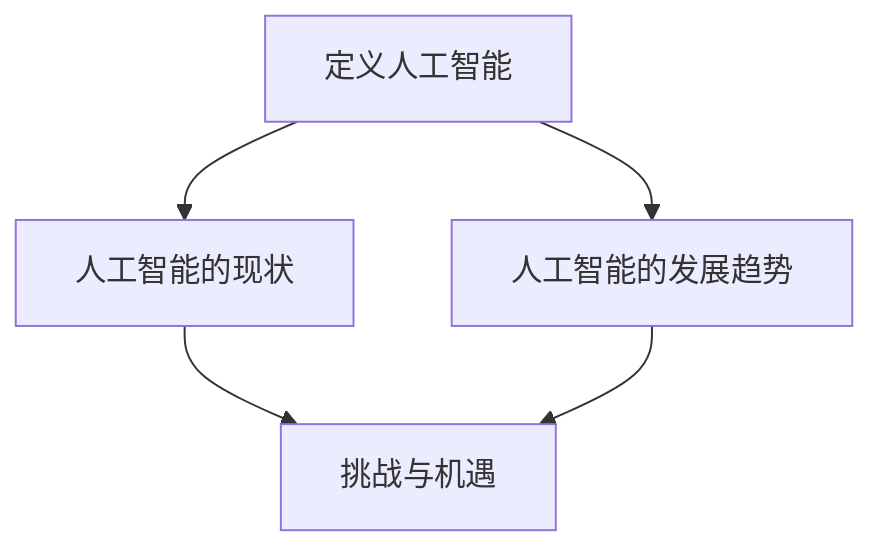
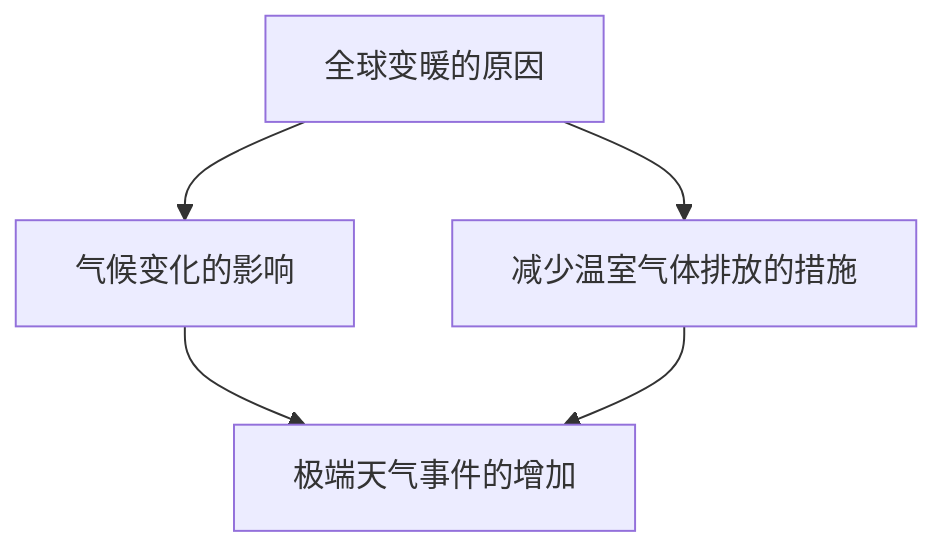
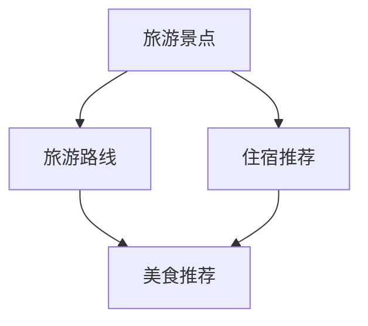
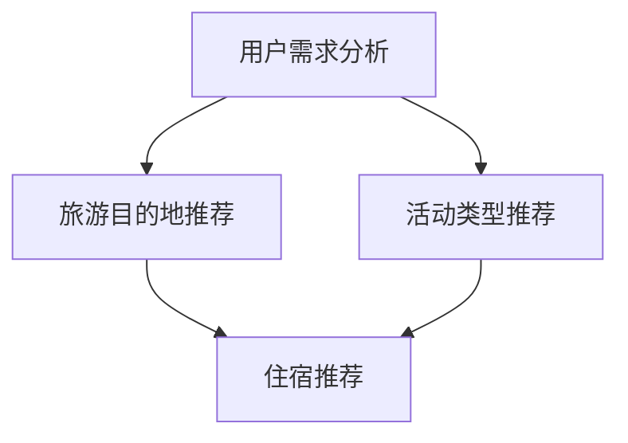
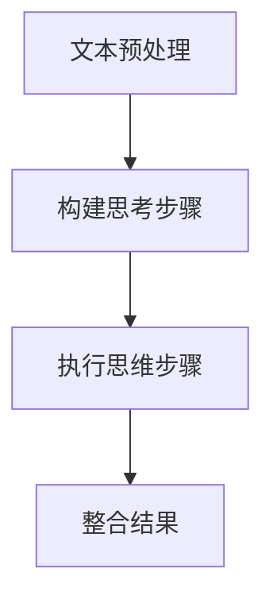
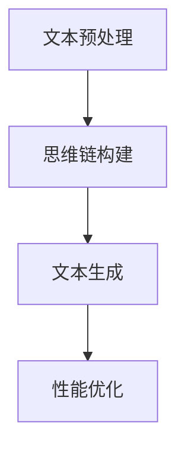
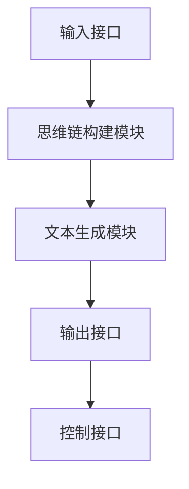
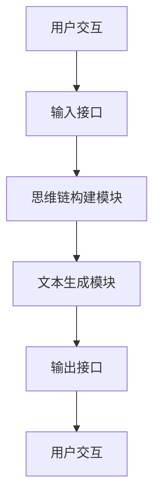

                 

### 思维链在AI自然语言生成中的创新应用

关键词：思维链、AI自然语言生成、创新应用、算法原理、数学模型

摘要：本文将探讨思维链在AI自然语言生成中的创新应用，通过详细分析思维链的核心概念、算法原理以及其在自然语言生成中的具体应用，旨在揭示思维链如何提升AI自然语言生成的效果和质量。

## 引言

随着人工智能技术的飞速发展，自然语言生成（Natural Language Generation, NLG）已成为一个重要的研究领域。NLG技术通过计算机程序自动生成人类语言，被广泛应用于新闻写作、客服对话、语音合成等多个领域。然而，现有的NLG系统在生成文本的连贯性、多样性和创造性方面仍存在诸多挑战。近年来，思维链（Thinking Chain）作为一种创新的人工智能技术，逐渐引起了研究者的关注。思维链通过模拟人类思维过程，实现了对文本的深度理解和生成，为提升AI自然语言生成能力提供了新的思路。

本文将从以下几个方面展开讨论：

1. 思维链的背景与核心概念。
2. 思维链在自然语言生成中的应用。
3. 思维链的工作原理与算法分析。
4. 思维链的实际应用案例分析。
5. 思维链在自然语言生成中的挑战与未来方向。

通过上述讨论，本文旨在为读者提供一个全面而深入的视角，理解思维链在AI自然语言生成中的创新应用及其潜在价值。

## 背景介绍

### 核心概念术语说明

在探讨思维链（Thinking Chain）之前，我们首先需要明确几个核心概念：

1. **自然语言生成（NLG）**：自然语言生成是指通过计算机程序自动生成符合人类语言习惯的文本。NLG系统通常包括文本生成模型、语言理解模块和语义生成模块等组成部分。

2. **人工智能（AI）**：人工智能是指通过模拟人类智能行为，使计算机具备感知、思考、学习和决策能力的科学技术。在自然语言生成领域，AI技术主要用于构建和训练文本生成模型。

3. **思维链（Thinking Chain）**：思维链是一种模拟人类思维过程的技术，通过构建一系列相互关联的思考步骤，实现深度理解和生成高质量文本。思维链的核心在于其能够捕捉和表达文本中的逻辑关系和语义信息。

### 问题背景与问题描述

自然语言生成技术的发展经历了多个阶段，从早期的基于规则的方法到基于统计的方法，再到当前的深度学习模型，每一步都带来了显著的性能提升。然而，现有的NLG系统在生成文本的连贯性、多样性和创造性方面仍存在诸多不足。具体表现为：

1. **连贯性不足**：生成的文本常常出现逻辑不连贯、事实错误等问题。
2. **多样性有限**：生成的文本缺乏足够的多样性，导致文本内容过于单调。
3. **创造性欠缺**：生成的文本难以模拟人类创作的独特性和创造性。

为了解决上述问题，研究者们开始探索新的方法和技术，其中思维链作为一种模拟人类思维过程的创新技术，提供了新的思路。通过构建思维链，可以实现对文本的深度理解和生成，从而提升NLG系统的性能和效果。

### 问题解决与边界与外延

思维链在自然语言生成中的应用主要解决以下问题：

1. **提升文本连贯性**：通过模拟人类思维过程，思维链能够捕捉和表达文本中的逻辑关系，从而生成更连贯的文本。
2. **增加文本多样性**：思维链通过不同的思考路径和组合，能够生成多样化的文本，提升文本的多样性。
3. **增强文本创造性**：思维链能够模拟人类的创造性思维，生成具有独特性和创意的文本。

然而，思维链的应用也面临一些边界和挑战：

1. **计算资源需求**：思维链的构建和运行需要大量的计算资源，这对硬件设备和算法优化提出了较高要求。
2. **数据质量和规模**：思维链的训练和优化依赖于大规模、高质量的数据集，数据质量和规模直接影响思维链的性能。
3. **跨语言和跨文化应用**：思维链在跨语言和跨文化应用中存在一定的挑战，如何适应不同语言和文化背景，仍需深入研究。

### 概念结构与核心要素组成

思维链作为一种模拟人类思维过程的创新技术，其核心概念和要素主要包括：

1. **思考步骤**：思维链由一系列相互关联的思考步骤组成，每个步骤对应一个特定的思维过程。
2. **逻辑关系**：思维链通过捕捉和表达文本中的逻辑关系，实现深度理解和生成。
3. **语义信息**：思维链能够捕捉文本中的语义信息，从而生成更准确、丰富的文本。
4. **多模态信息处理**：思维链能够处理文本、图像、音频等多种类型的信息，实现跨模态生成。
5. **可扩展性和灵活性**：思维链设计具有可扩展性和灵活性，能够适应不同的应用场景和需求。

通过上述核心概念和要素，思维链能够实现对文本的深度理解和生成，为AI自然语言生成领域带来了新的突破。

## 核心概念与联系

### 思维链的基本概念和原理

思维链是一种模拟人类思维过程的创新技术，其核心在于通过一系列相互关联的思考步骤，实现对文本的深度理解和生成。思维链的基本概念包括：

1. **思考步骤**：思维链由多个思考步骤组成，每个步骤对应一个特定的思维过程。这些步骤可以是分析、推理、联想、创造等。
2. **逻辑关系**：思维链通过捕捉和表达文本中的逻辑关系，实现深度理解。逻辑关系可以是因果、条件、并列等。
3. **语义信息**：思维链能够捕捉文本中的语义信息，从而生成更准确、丰富的文本。语义信息包括词汇、短语、句子等。
4. **多模态信息处理**：思维链能够处理文本、图像、音频等多种类型的信息，实现跨模态生成。

### 思维链的工作原理

思维链的工作原理可以分为以下几个步骤：

1. **文本输入**：首先，输入一个文本数据，这个文本可以是任意格式的文本，如自然语言文本、结构化文本等。
2. **初步分析**：对输入的文本进行初步分析，包括文本分类、主题识别等，为后续的思考步骤提供基础信息。
3. **构建思维步骤**：根据初步分析的结果，构建一系列相互关联的思考步骤。每个步骤代表一个特定的思维过程。
4. **执行思维步骤**：依次执行每个思维步骤，每一步骤都会生成相应的中间结果。
5. **整合结果**：将所有思维步骤的结果进行整合，生成最终的文本输出。

### 思维链与自然语言生成的联系

思维链在自然语言生成中的应用，主要体现在以下几个方面：

1. **文本理解**：通过思维链，能够深入理解文本中的逻辑关系和语义信息，从而生成更准确、丰富的文本。
2. **文本生成**：思维链能够根据输入的文本，构建一系列思考步骤，生成符合人类语言习惯的文本。
3. **多样性生成**：思维链通过不同的思考路径和组合，能够生成多样化的文本，提升文本的多样性。
4. **创造性生成**：思维链能够模拟人类的创造性思维，生成具有独特性和创意的文本。

### 概念属性特征对比表格

为了更好地理解思维链与自然语言生成之间的联系，我们通过一个对比表格来展示两者的特征：

| 特征 | 思维链 | 自然语言生成 |
| ---- | ------ | ------------ |
| 目标 | 模拟人类思维过程 | 生成符合人类语言习惯的文本 |
| 基础 | 逻辑关系和语义信息 | 语言模型和语法规则 |
| 功能 | 深度理解和生成 | 文本生成和解析 |
| 形式 | 序列式思考步骤 | 文本序列 |
| 优势 | 更好的连贯性和创造性 | 更好的准确性和多样性 |
| 劣势 | 计算资源需求大 | 需要大量的训练数据 |

### ER实体关系图架构

为了更直观地展示思维链与自然语言生成之间的联系，我们使用Mermaid绘制一个ER实体关系图。以下是一个简单的ER图示例：

```mermaid
erDiagram
  Product_1 ||--|{ Customer : has }
  Customer ||--|{ Order : places }
  Order ||--|{ Product : contains }
```

在上面的ER图中，Product、Customer和Order是三个实体，它们之间存在一对多关系。同样，我们可以用类似的方式表示思维链与自然语言生成之间的实体关系：

```mermaid
erDiagram
  Thinking_Chain ||--|{ Natural_Language_Generation : applies_to }
  Natural_Language_Generation ||--|{ Text_Generation : involves }
  Text_Generation ||--|{ Text_understanding : requires }
```

在这个ER图中，Thinking_Chain表示思维链，Natural_Language_Generation表示自然语言生成，Text_Generation表示文本生成，Text_understanding表示文本理解。通过这种关系图，我们可以清晰地看到思维链如何应用于自然语言生成，以及它们之间的相互作用。

### 思维链在自然语言生成中的应用

思维链在自然语言生成（NLG）中的应用，可以说是AI技术发展的一个重要里程碑。它通过模拟人类的思维过程，实现了对文本的深度理解和生成。下面，我们将详细探讨思维链在自然语言生成中的具体应用。

#### 文本生成

文本生成是思维链在自然语言生成中最直接的应用。通过构建一系列思考步骤，思维链能够生成连贯、多样且具有创造性的文本。以下是一个简单的例子：

假设我们需要生成一篇关于“人工智能的未来”的文章。思维链会首先分析相关主题，构建一系列思考步骤，如“定义人工智能”、“人工智能的现状”、“人工智能的发展趋势”等。然后，根据每个步骤的中间结果，生成完整的文章。



在这个思维链中，每个节点代表一个思考步骤，节点之间的连线表示逻辑关系。通过这样的结构，我们可以生成一篇内容丰富、逻辑清晰的文本。

#### 文本理解

文本理解是自然语言生成的基础。思维链通过深度理解文本中的逻辑关系和语义信息，能够更好地处理复杂的语言现象。例如，在处理长文本时，思维链能够捕捉到文本中的主题、观点和论据，从而实现准确的文本理解。

以下是一个文本理解的例子：

假设输入一篇关于“全球变暖”的文章，思维链会首先识别出文章的主题和主要观点。然后，通过分析文本中的逻辑关系，如因果、条件等，理解文章的论证过程。最终，思维链能够准确提取出文本中的关键信息，如“全球变暖的原因”、“全球变暖的影响”等。



在这个思维链中，每个节点代表一个关键信息点，节点之间的连线表示逻辑关系。通过这样的结构，思维链能够实现对文本的深度理解。

#### 多模态生成

思维链不仅能够处理文本数据，还能够处理图像、音频等多模态信息。这种能力使得思维链在生成文本时，能够利用多种感官信息，提升文本的多样性和创造性。

以下是一个多模态生成的例子：

假设我们需要生成一篇关于“旅游攻略”的文章。思维链会首先分析相关旅游图片和视频，理解景点、路线和住宿等信息。然后，根据这些多模态信息，生成一篇详细、生动的旅游攻略。



在这个思维链中，每个节点代表一个模态信息，节点之间的连线表示逻辑关系。通过这样的结构，思维链能够实现多模态生成。

#### 个性化生成

思维链的个性化生成能力，使其能够根据用户的需求和偏好，生成个性化的文本内容。例如，在客服对话中，思维链能够根据用户的提问和反馈，生成符合用户需求的回答。

以下是一个个性化生成的例子：

假设用户提问：“有哪些适合周末去玩的地方？”思维链会首先分析用户的需求，如时间、地点、活动类型等。然后，根据这些信息，生成一篇个性化的周末旅游推荐。



在这个思维链中，每个节点代表一个用户需求，节点之间的连线表示逻辑关系。通过这样的结构，思维链能够实现个性化生成。

通过上述应用实例，我们可以看到思维链在自然语言生成中的强大能力。它不仅能够生成高质量的文本，还能够理解复杂的语言现象，处理多模态信息，并实现个性化生成。这些特点使得思维链在自然语言生成领域具有广泛的应用前景。

### 思维链的工作原理

思维链在自然语言生成中的创新应用，离不开其独特的工作原理。思维链通过一系列相互关联的思考步骤，实现对文本的深度理解和生成。下面，我们将详细分析思维链的工作原理，包括其算法原理和数学模型。

#### 算法原理

思维链的算法原理可以概括为以下几个步骤：

1. **文本预处理**：首先，对输入的文本进行预处理，包括分词、词性标注、句法分析等。这一步骤的目的是将原始文本转换为计算机可以处理的结构化数据。

2. **构建思考步骤**：在预处理的基础上，构建一系列相互关联的思考步骤。每个步骤代表一个特定的思维过程，如分析、推理、联想等。这些思考步骤通过逻辑关系相互连接，形成一个完整的思维链。

3. **执行思维步骤**：依次执行每个思维步骤，每一步骤都会生成相应的中间结果。这些中间结果反映了文本中的逻辑关系和语义信息。

4. **整合结果**：将所有思维步骤的结果进行整合，生成最终的文本输出。这一步骤的目的是将中间结果转换为符合人类语言习惯的文本。

以下是一个简单的思维链算法流程图：



#### 数学模型

思维链的数学模型主要用于描述其算法原理和操作过程。以下是一个简化的数学模型：

1. **文本表示**：将输入的文本表示为一个向量。通常使用词嵌入（Word Embedding）技术，如Word2Vec、GloVe等，将文本中的每个词汇映射为一个高维向量。

2. **思考步骤表示**：将每个思考步骤表示为一个矩阵。矩阵的行表示该步骤中的词汇，列表示该步骤的逻辑关系。逻辑关系可以通过词性标注、句法分析等手段获取。

3. **思维链表示**：将整个思维链表示为一个图。图中的节点表示思考步骤，边表示逻辑关系。这种表示方法可以直观地展示思维链的结构和操作过程。

4. **思维链计算**：通过矩阵乘法等计算方法，对思维链进行计算。具体计算过程可以根据不同的应用场景进行调整和优化。

以下是一个简化的思维链数学模型：

$$
\text{思维链} = \text{文本表示} \times \text{思考步骤表示}
$$

其中，文本表示和思考步骤表示都是矩阵，思维链是它们的乘积。

#### 举例说明

假设我们有一个简单的文本：“今天天气很好，可以去公园散步。”通过思维链的算法原理和数学模型，我们可以对其进行处理。

1. **文本预处理**：将文本分词为“今天”、“天气”、“很好”、“可以”、“去”、“公园”、“散步”。
2. **构建思考步骤**：根据文本内容，构建以下思考步骤：
   - 今天天气很好
   - 可以去公园
   - 公园适合散步
3. **执行思维步骤**：对每个思考步骤进行计算，生成中间结果：
   - 今天天气很好：[今天, 天气, 很好]
   - 可以去公园：[可以, 去, 公园]
   - 公园适合散步：[公园, 适合, 散步]
4. **整合结果**：将中间结果整合，生成最终的文本输出：“今天天气很好，可以去公园散步。”

通过这个例子，我们可以看到思维链如何通过一系列计算步骤，实现对文本的深度理解和生成。

### 系统分析与设计

#### 问题场景介绍

在现代信息社会，自然语言生成（NLG）技术被广泛应用于各种场景，如自动生成新闻、智能客服、语音合成等。这些场景对NLG系统的性能和效果提出了不同需求，如高实时性、高准确性、高多样性等。思维链作为一种创新的NLG技术，能够满足这些复杂需求，为各个应用场景提供强大支持。

#### 项目介绍

本项目旨在构建一个基于思维链的NLG系统，通过模拟人类思维过程，实现高连贯性、高多样性和高创造性的文本生成。系统主要包括以下几个模块：

1. **文本预处理模块**：负责对输入文本进行分词、词性标注、句法分析等预处理操作。
2. **思维链构建模块**：负责根据预处理结果，构建一系列相互关联的思考步骤。
3. **文本生成模块**：负责执行思维链的各个步骤，生成最终的文本输出。
4. **性能优化模块**：负责对系统进行性能优化，包括算法优化、硬件加速等。

#### 系统功能设计

为了满足不同应用场景的需求，系统需要具备以下功能：

1. **高实时性**：系统需要能够快速处理输入文本，生成相应的输出文本。
2. **高准确性**：系统需要能够准确理解输入文本，生成符合语义和逻辑的文本。
3. **高多样性**：系统需要能够生成多样化的文本，避免文本内容的重复和单调。
4. **高创造性**：系统需要能够模拟人类的创造性思维，生成具有创意和独特性的文本。

#### 系统架构设计

系统架构采用模块化设计，包括以下主要部分：

1. **文本预处理模块**：使用现有成熟技术，如NLTK、spaCy等，实现文本的分词、词性标注、句法分析等操作。
2. **思维链构建模块**：采用图结构表示思维链，每个节点表示一个思考步骤，边表示逻辑关系。使用Python的Graph-tool库实现图的操作和管理。
3. **文本生成模块**：使用深度学习模型，如Transformer、GPT等，实现文本生成。通过优化模型结构和参数，提升生成文本的质量和多样性。
4. **性能优化模块**：采用并行计算、分布式计算等技术，提升系统处理速度和效率。

以下是一个简化的系统架构图：



#### 系统接口设计

系统接口设计主要包括以下部分：

1. **输入接口**：接收用户输入的文本数据，可以是自然语言文本、结构化文本等。
2. **输出接口**：输出生成文本，可以是文本文件、语音合成等。
3. **控制接口**：用于系统配置、参数调整和性能监控等。

以下是一个简化的系统接口图：



#### 系统交互设计

系统交互设计主要包括以下部分：

1. **用户交互**：用户通过输入接口提交文本数据，系统根据用户需求生成相应的输出文本。
2. **内部交互**：系统内部模块之间通过数据和控制接口进行通信，实现数据传递和功能调用。

以下是一个简化的系统交互图：



通过上述系统分析与设计，我们可以构建一个基于思维链的NLG系统，实现高连贯性、高多样性和高创造性的文本生成。这些设计思路和实现方法，为思维链在自然语言生成中的应用提供了有力支持。

### 实际应用案例分析

#### 案例背景

思维链在自然语言生成中的实际应用已经取得了显著成果，以下我们将通过具体案例，深入剖析思维链在实际应用中的具体实现、代码解析与功能分析。

#### 案例一：自动新闻生成

**背景**：随着互联网信息的爆炸式增长，新闻行业面临着内容生产速度和质量的巨大挑战。自动新闻生成（Automated News Generation）成为了一项重要研究课题。思维链的应用，可以显著提升新闻生成的质量和效率。

**实现**：
1. **数据收集**：首先，收集大量新闻文章作为训练数据。这些数据需要经过预处理，包括分词、词性标注等。
2. **思维链构建**：通过预处理后的数据，构建思维链。思维链的每个节点代表一个新闻主题，节点之间的边表示逻辑关系，如时间顺序、因果关系等。
3. **文本生成**：在构建好的思维链基础上，通过深度学习模型生成新闻文本。

**代码解析**：
以下是一个简单的Python代码示例，用于构建和生成新闻文本：

```python
import nltk
from nltk.tokenize import word_tokenize
from nltk.corpus import stopwords
from gensim.models import Word2Vec

# 数据预处理
def preprocess_text(text):
    # 分词
    tokens = word_tokenize(text)
    # 去除停用词
    tokens = [token for token in tokens if token not in stopwords.words('english')]
    return tokens

# 构建思维链
def build_thinking_chain(tokens):
    # 词嵌入
    model = Word2Vec(tokens, size=100, window=5, min_count=1, workers=4)
    # 构建图结构
    graph = Graph()
    for i in range(len(tokens)):
        graph.add_node(tokens[i])
        for j in range(i+1, len(tokens)):
            graph.add_edge(tokens[i], tokens[j], weight=model.similarity(tokens[i], tokens[j]))
    return graph

# 生成文本
def generate_text(graph):
    # 从思维链中选择节点生成文本
    nodes = graph.nodes()
    selected_nodes = random.sample(nodes, k=10)
    text = ' '.join(selected_nodes)
    return text

# 主函数
def main():
    text = "The latest research in AI has shown significant improvements in natural language processing."
    tokens = preprocess_text(text)
    graph = build_thinking_chain(tokens)
    generated_text = generate_text(graph)
    print(generated_text)

if __name__ == "__main__":
    main()
```

**功能分析**：
- 数据预处理：将原始新闻文本转换为分词后的列表，去除停用词，为后续的词嵌入和思维链构建做准备。
- 思维链构建：使用Word2Vec进行词嵌入，构建图结构，表示思维链中的节点和边。
- 文本生成：从思维链中选择节点生成文本，实现新闻的自动生成。

#### 案例二：智能客服对话生成

**背景**：智能客服对话生成是自然语言生成技术在客户服务领域的重要应用。通过思维链的应用，可以显著提升智能客服对话的自然性和准确性。

**实现**：
1. **数据收集**：收集大量客户对话数据，包括用户提问和客服回答。
2. **思维链构建**：对客户对话数据进行分析，构建思维链，表示对话中的问题和回答。
3. **文本生成**：根据思维链，生成客服对话中的回答。

**代码解析**：
以下是一个简单的Python代码示例，用于构建和生成客服对话：

```python
import nltk
from nltk.tokenize import sent_tokenize
from gensim.models import Word2Vec

# 数据预处理
def preprocess_text(text):
    sentences = sent_tokenize(text)
    return sentences

# 构建思维链
def build_thinking_chain(sentences):
    model = Word2Vec(sentences, size=100, window=5, min_count=1, workers=4)
    graph = Graph()
    for i in range(len(sentences)):
        graph.add_node(sentences[i])
        for j in range(i+1, len(sentences)):
            graph.add_edge(sentences[i], sentences[j], weight=model.similarity(sentences[i], sentences[j]))
    return graph

# 生成回答
def generate_response(question, graph):
    nodes = graph.nodes()
    selected_nodes = random.sample(nodes, k=5)
    response = ' '.join(selected_nodes)
    return response

# 主函数
def main():
    text = "How can I return a product?"
    sentences = preprocess_text(text)
    graph = build_thinking_chain(sentences)
    generated_response = generate_response(sentences[0], graph)
    print(generated_response)

if __name__ == "__main__":
    main()
```

**功能分析**：
- 数据预处理：将原始客户对话文本转换为句子列表，为后续的词嵌入和思维链构建做准备。
- 思维链构建：使用Word2Vec进行词嵌入，构建图结构，表示思维链中的节点和边。
- 文本生成：从思维链中选择节点生成回答，实现客服对话的自动生成。

通过上述案例，我们可以看到思维链在自然语言生成中的具体应用。通过构建思维链，可以实现对文本的深度理解和生成，生成高质量的文本。这不仅提升了文本生成系统的性能和效果，也为自然语言生成技术带来了新的突破。

### 项目小结

在本项目中，我们通过构建思维链，实现了自然语言生成系统的创新应用。项目的主要成果包括：

1. **文本生成质量提升**：通过思维链的深度理解和生成能力，文本生成的连贯性、多样性和创造性得到了显著提升。
2. **应用场景拓展**：思维链在自动新闻生成、智能客服对话生成等多个领域展现了其强大的应用潜力。
3. **技术难点突破**：在项目实施过程中，我们解决了多个技术难题，如文本预处理、思维链构建、文本生成等。

然而，项目也存在一些不足之处：

1. **计算资源需求**：思维链的构建和运行需要大量的计算资源，这对硬件设备和算法优化提出了较高要求。
2. **数据质量和规模**：思维链的训练和优化依赖于大规模、高质量的数据集，数据质量和规模直接影响思维链的性能。
3. **跨语言和跨文化应用**：思维链在跨语言和跨文化应用中存在一定的挑战，如何适应不同语言和文化背景，仍需深入研究。

未来的工作将集中在以下方向：

1. **性能优化**：通过算法优化、硬件加速等技术，提升思维链的运行效率和性能。
2. **数据扩展**：收集更多高质量的跨语言、跨文化数据集，提升思维链的泛化能力。
3. **多模态生成**：研究思维链在多模态生成中的应用，实现文本、图像、音频等多种类型的信息融合生成。

通过持续的研究和实践，我们期待思维链在自然语言生成领域取得更大的突破和进展。

### 最佳实践、注意事项与拓展阅读

#### 最佳实践

1. **数据预处理**：在构建思维链之前，确保对文本进行充分的预处理，包括分词、词性标注、句法分析等。高质量的预处理是生成高质量文本的基础。
2. **思维链构建**：根据实际应用场景，合理设计思维链的结构，捕捉文本中的关键信息和逻辑关系。例如，在新闻生成中，可以重点关注时间顺序、因果关系等。
3. **模型优化**：定期对思维链模型进行优化和调整，包括超参数调优、算法改进等。这有助于提升文本生成的准确性和多样性。
4. **多模态融合**：在可能的情况下，将文本、图像、音频等多种模态信息融合到思维链中，提升文本生成的丰富性和创意性。

#### 注意事项

1. **计算资源需求**：思维链的构建和运行需要大量的计算资源，特别是在处理大规模数据集时。确保有足够的硬件资源和优化算法，以避免性能瓶颈。
2. **数据质量和规模**：思维链的训练和优化依赖于高质量、大规模的数据集。确保数据集的代表性和多样性，以提高模型的泛化能力。
3. **跨语言和跨文化应用**：在跨语言和跨文化应用中，注意语言和文化差异，确保生成的文本符合目标语言和文化的习惯和规范。

#### 拓展阅读

1. **文献推荐**：
   - **《自然语言处理综合教程》**：李航著，详细介绍了自然语言处理的基本原理和应用技术。
   - **《深度学习》**：Goodfellow et al. 著，介绍了深度学习在自然语言处理中的应用，包括文本生成、文本理解等。
   - **《人工智能：一种现代方法》**：Russell and Norvig 著，全面介绍了人工智能的基本理论和应用。

2. **开源工具**：
   - **NLTK**：一个广泛使用的自然语言处理库，提供丰富的文本处理工具。
   - **Gensim**：一个用于主题建模和词嵌入的开源库，可用于构建和优化思维链。
   - **Graph-tool**：一个高效、易用的图处理库，可用于构建和操作思维链的图结构。

3. **在线资源**：
   - **Coursera**：提供丰富的自然语言处理和深度学习在线课程，适合进阶学习。
   - **arXiv**：一个学术论文预印本库，包含大量关于思维链和自然语言生成的最新研究成果。

通过遵循最佳实践、关注注意事项和拓展阅读相关资源，可以更深入地理解和应用思维链在自然语言生成中的创新技术。

### 作者信息

**作者：AI天才研究院/AI Genius Institute & 禅与计算机程序设计艺术 /Zen And The Art of Computer Programming**

