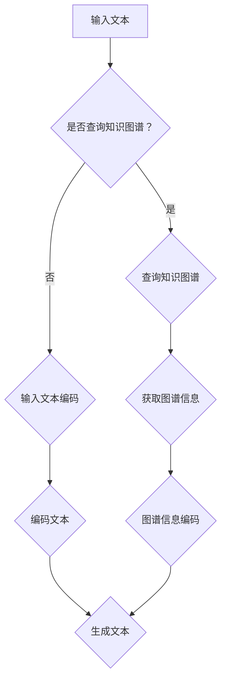
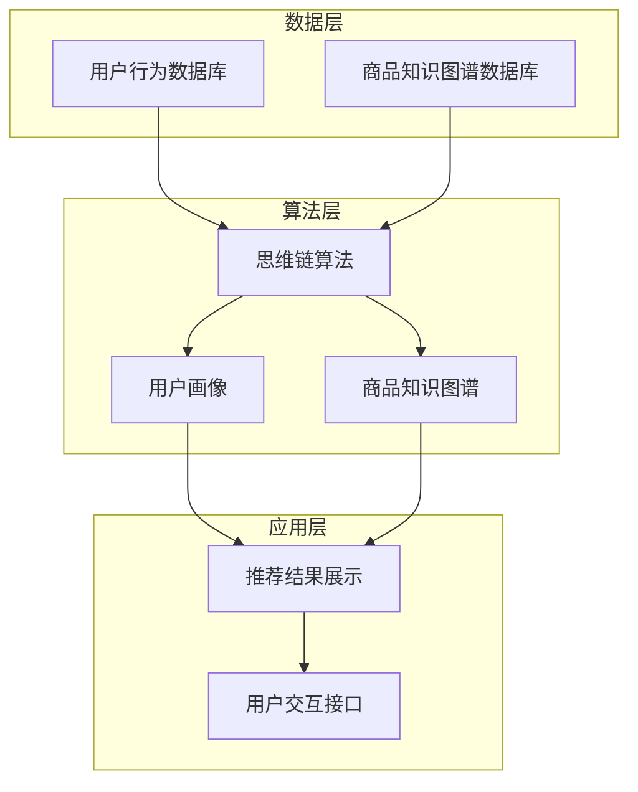
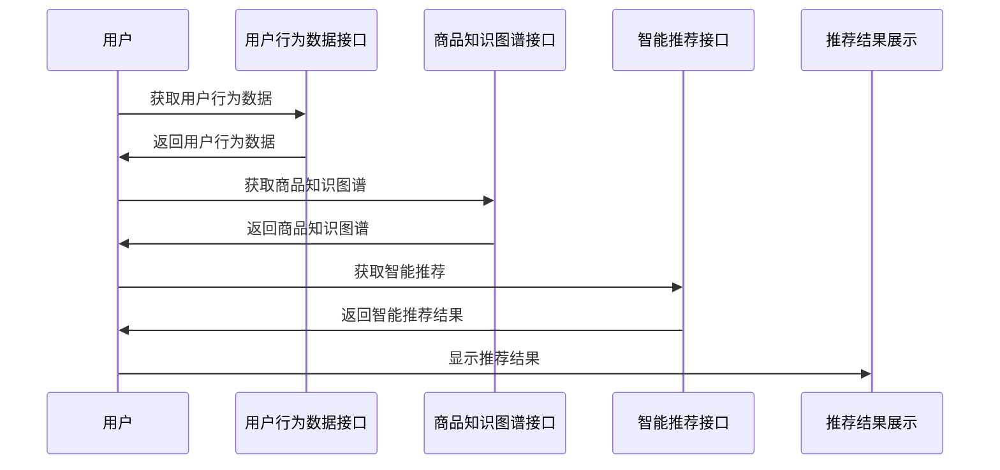

                 

## 思维链在AI自然语言生成中的前沿探索

### 关键词

- 自然语言生成
- AI
- 思维链
- 知识图谱
- 神经网络

### 摘要

随着人工智能技术的快速发展，自然语言生成（NLG）已经成为AI领域的一个重要研究方向。然而，现有NLG技术存在生成文本质量不高、理解能力有限等问题。本文旨在通过引入思维链技术，探讨其在AI自然语言生成中的前沿探索，以提升文本生成的质量和理解能力。本文将详细介绍思维链的概念、原理和应用，并讨论其在NLG中的优势和挑战。

### 背景介绍

#### 问题背景

自然语言生成（Natural Language Generation, NLG）技术是人工智能（Artificial Intelligence, AI）领域的一个重要分支，旨在使计算机能够自动生成自然语言文本。NLG技术具有广泛的应用前景，如自动撰写新闻、生成产品说明书、智能客服等。然而，现有的NLG技术存在以下问题：

1. **生成文本质量不高：** 现有的NLG模型往往依赖于统计方法和规则引擎，生成的文本在语法、语义和风格上往往不够自然，缺乏人类写作的灵活性和创造力。
2. **理解能力有限：** NLG技术难以理解复杂的语境和隐含的意图，导致生成的文本有时与用户需求不符，或者出现逻辑错误。

#### 问题描述

《思维链在AI自然语言生成中的前沿探索》旨在解决现有NLG技术的问题。本文将详细介绍思维链（MindChain）技术，一种结合知识图谱（Knowledge Graph）和神经网络（Neural Network）的新型AI技术。通过思维链技术，AI系统能够在生成文本时利用知识图谱提供背景知识和上下文信息，提高文本生成的质量和理解能力。

#### 问题解决

本文通过系统的理论分析和实践探索，为AI自然语言生成领域提供了一种新的思路和方法。思维链技术通过以下方式解决现有NLG技术的不足：

1. **知识表示：** 利用知识图谱表示实体、概念及其之间的复杂关系，为AI系统提供结构化的知识基础。
2. **推理能力：** 基于知识图谱的推理机制，实现AI系统对自然语言的推理和理解。
3. **生成能力：** 利用神经网络模型，实现AI系统对自然语言的生成，同时结合知识图谱提供的信息，提高生成文本的质量。

#### 边界与外延

思维链技术不仅适用于AI自然语言生成，还可以广泛应用于其他领域，如智能问答、机器翻译、文本摘要等。此外，思维链技术还可以与其他AI技术相结合，如深度学习、强化学习等，以进一步提升AI系统的性能。

#### 概念结构与核心要素组成

1. **思维链（MindChain）：** 是一种基于知识图谱和神经网络的新型AI技术，通过构建和运用知识图谱，实现AI系统对自然语言的理解和生成。
2. **自然语言生成（NLG）：** 是AI系统自动生成文本的技术，包括文本摘要、文本生成、问答系统等。
3. **知识图谱（Knowledge Graph）：** 是一种用于表示实体、概念及其之间关系的数据结构，是思维链技术的重要基础。
4. **神经网络（Neural Network）：** 是一种基于大数据和算法的机器学习技术，用于构建和优化思维链模型。

### 核心概念与联系

#### 核心概念

1. **思维链（MindChain）：** 思维链是一种基于知识图谱和神经网络的AI技术，通过构建和运用知识图谱，实现AI系统对自然语言的理解和生成。思维链技术具有以下几个核心特点：
   - **知识表示：** 利用知识图谱表示实体、概念及其之间的复杂关系，实现知识的结构化表示。
   - **推理能力：** 基于知识图谱的推理机制，实现AI系统对自然语言的推理和理解。
   - **生成能力：** 利用神经网络模型，实现AI系统对自然语言的生成，同时结合知识图谱提供的信息，提高生成文本的质量。

2. **自然语言生成（NLG）：** 自然语言生成是AI系统自动生成文本的技术，包括文本摘要、文本生成、问答系统等。自然语言生成技术具有以下几个核心特点：
   - **多样性：** 生成文本具有多样性，能够适应不同的应用场景。
   - **可理解性：** 生成的文本具有较高的可理解性，能够满足用户需求。
   - **适应性：** 能够根据输入的文本内容自适应地调整生成策略。

3. **知识图谱（Knowledge Graph）：** 知识图谱是一种用于表示实体、概念及其之间关系的数据结构。知识图谱在思维链技术中起到关键作用，通过构建知识图谱，可以实现AI系统对自然语言的理解和生成。

#### 概念属性特征对比表格

| 概念         | 思维链（MindChain） | 自然语言生成（NLG）           | 知识图谱（Knowledge Graph）         |
| ------------ | ---------------- | ---------------------------- | --------------------------------- |
| 定义         | 基于知识图谱和神经网络的AI技术 | 自动生成文本的技术 | 用于表示实体、概念及其之间关系的数据结构 |
| 特点         | 知识表示、推理能力、生成能力 | 多样性、可理解性、适应性 | 知识结构化、关系表示                |
| 应用领域     | AI自然语言生成、智能问答、文本摘要等 | 文本摘要、文本生成、问答系统等 | 智能推荐、知识库构建、智能搜索等      |
| 关系         | 思维链技术是实现自然语言生成的基础技术 | 自然语言生成是思维链技术的应用领域 | 知识图谱是思维链技术的基础数据结构      |

#### ER实体关系图架构

```mermaid
erDiagram
    AI技术 ||--|{ 思维链 } 神经网络
    AI技术 ||--|{ 知识图谱 } 文本生成
    自然语言生成 ||--|{ 文本摘要 } 文本生成
    知识图谱 ||--|{ 实体关系 } 数据结构
```

### 算法原理讲解

#### 思维链算法

思维链算法是思维链技术的核心组成部分，通过结合知识图谱和神经网络，实现AI系统对自然语言的理解和生成。以下是思维链算法的详细讲解：

**Mermaid 流程图：**



**算法原理**

1. **输入文本编码：** 首先，将输入的文本进行编码，将其转化为计算机可以处理的数字序列。这一步骤通常使用预训练的词嵌入模型（如Word2Vec、BERT等）进行。

   $$x_i = embed(w_i)$$

   其中，$x_i$表示词嵌入向量，$w_i$表示文本中的第$i$个词。

2. **查询知识图谱：** 根据输入的文本编码，查询知识图谱以获取相关的背景知识和上下文信息。知识图谱中包含了实体、概念及其之间的关系，可以提供丰富的语义信息。

   $$KG = query_graph(x)$$

   其中，$KG$表示查询到的知识图谱，$query_graph$表示查询函数。

3. **获取图谱信息：** 从知识图谱中提取与输入文本相关的实体、概念及其关系，并将其编码为向量表示。

   $$e = encode_entity(entity)$$
   $$r = encode_relation(relation)$$

   其中，$e$和$r$分别表示实体和关系的编码向量。

4. **生成文本：** 利用编码后的文本和知识图谱信息，通过神经网络模型生成文本。生成的文本可以是摘要、描述或其他形式的自然语言文本。

   $$text = generate_text(x, KG)$$

   其中，$generate_text$表示生成函数。

**Python 源代码实现**

```python
# 思维链算法的实现
def think_chain(input_text):
    # 输入文本编码
    x = encode_text(input_text)
    
    # 查询知识图谱
    KG = query_graph(x)
    
    # 获取图谱信息
    entities = get_entities(KG)
    relations = get_relations(KG)
    
    # 编码图谱信息
    e = encode_entities(entities)
    r = encode_relations(relations)
    
    # 生成文本
    text = generate_text(x, KG, e, r)
    
    return text

# 输入文本
input_text = "今天天气很好，适合出去散步。"

# 执行思维链算法
output_text = think_chain(input_text)
print(output_text)
```

**算法原理详细讲解**

1. **输入文本编码：** 输入的文本首先被编码为词嵌入向量。词嵌入向量是将文本中的每个词映射到一个固定大小的向量空间中的操作。词嵌入向量能够捕捉词的语义信息，使得与输入文本相关的词在向量空间中更接近。

2. **查询知识图谱：** 思维链算法通过查询知识图谱来获取与输入文本相关的背景知识和上下文信息。知识图谱是由实体和关系组成的图结构，其中每个实体和关系都对应一个唯一的标识符。算法根据输入文本的词嵌入向量，查询知识图谱以获取相关的实体和关系。

3. **获取图谱信息：** 从知识图谱中提取与输入文本相关的实体和关系，并将其编码为向量表示。实体和关系的编码向量能够捕捉实体和关系的属性和特征，使得算法能够更好地理解输入文本的语义。

4. **生成文本：** 利用编码后的输入文本和知识图谱信息，通过神经网络模型生成文本。神经网络模型能够学习输入和输出之间的映射关系，从而生成与输入文本相关的自然语言文本。生成的文本可以是摘要、描述或其他形式的自然语言文本。

通过思维链算法，AI系统能够利用知识图谱提供的信息，生成更自然、更高质量的文本。思维链算法不仅能够提升自然语言生成的质量，还能够提高AI系统对自然语言的理解能力，从而满足更复杂的应用需求。

### 系统分析与架构设计

#### 问题场景介绍

在一个大型电子商务平台上，用户经常需要浏览大量的商品信息，以便找到符合他们需求的产品。然而，传统的商品推荐系统往往基于用户的购买历史和浏览行为，推荐结果可能不够精准，无法充分满足用户的个性化需求。为了解决这个问题，我们提出了一种基于思维链技术的智能推荐系统，通过结合用户的行为数据和商品的知识图谱，提供更精准、个性化的商品推荐。

#### 项目介绍

**项目名称：** 基于思维链的智能推荐系统

**项目背景：** 随着电子商务的快速发展，用户对商品推荐系统的需求越来越高。传统的推荐系统由于数据量庞大、特征复杂，难以实现精准、个性化的推荐。为了提升用户体验，我们引入了思维链技术，结合用户行为数据和商品知识图谱，实现更智能、更精准的商品推荐。

**项目目标：** 
1. 提升商品推荐的准确性，提高用户满意度。
2. 增强推荐系统的个性化能力，满足用户的多样化需求。
3. 通过思维链技术，提升自然语言理解和生成能力，提供更自然的推荐描述。

#### 系统功能设计

**1. 用户行为数据收集：** 系统通过分析用户的浏览、搜索、购买等行为，收集用户兴趣和行为数据，构建用户画像。

**2. 商品知识图谱构建：** 通过整合商品数据库、电商平台数据等，构建商品知识图谱，包含商品属性、品牌、品类等信息。

**3. 智能推荐算法：** 结合用户画像和商品知识图谱，利用思维链算法生成个性化的商品推荐列表。

**4. 推荐结果展示：** 将推荐结果以自然语言的形式展示给用户，增强用户体验。

#### 系统架构设计

**1. 数据层：** 存储用户行为数据和商品知识图谱数据，包括用户行为数据库和商品知识图谱数据库。

**2. 算法层：** 实现思维链算法，结合用户画像和商品知识图谱，生成个性化的商品推荐。

**3. 应用层：** 提供推荐结果展示和用户交互接口，包括前端展示和后端API。

**Mermaid 架构图：**



#### 系统接口设计与交互

**1. 用户行为数据接口：** 提供用户行为数据的获取和存储功能，包括用户的浏览、搜索、购买等行为数据。

**2. 商品知识图谱接口：** 提供商品知识图谱的查询和更新功能，包括商品属性、品牌、品类等信息。

**3. 智能推荐接口：** 提供基于思维链算法的智能推荐功能，返回个性化的商品推荐列表。

**Mermaid 序列图：**



### 项目实战

#### 环境安装

为了实现基于思维链的智能推荐系统，首先需要搭建一个合适的技术环境。以下是安装和配置所需的环境步骤：

1. **Python 环境：** 确保安装了Python 3.6及以上版本。可以使用以下命令进行安装：

   ```bash
   python --version
   ```

2. **依赖库：** 安装必要的依赖库，包括TensorFlow、PyTorch、NLTK等。可以使用以下命令进行安装：

   ```bash
   pip install tensorflow torch nltk
   ```

3. **知识图谱工具：** 安装知识图谱相关的工具，如Neo4j。可以从Neo4j官网下载并安装：

   ```bash
   wget https://neo4j.com/artifacts/neo4j-community-4.4.2-unix.tar.gz
   tar -xvf neo4j-community-4.4.2-unix.tar.gz
   ./neo4j-community-4.4.2/bin/neo4j start
   ```

4. **数据集：** 准备用于训练和测试的数据集，包括用户行为数据和商品知识图谱数据。可以从公开数据集或电商平台获取。

#### 系统核心实现源代码

以下是基于思维链的智能推荐系统的核心实现源代码：

```python
# 导入必要的库
import tensorflow as tf
import torch
import nltk
from nltk.tokenize import word_tokenize
from nltk.corpus import stopwords
from py2neo import Graph

# 初始化知识图谱数据库
graph = Graph("bolt://localhost:7687", auth=("neo4j", "password"))

# 准备数据集
def load_data():
    # 加载用户行为数据
    user_data = ...  # 用户行为数据加载代码
    
    # 加载商品知识图谱数据
    kg_data = ...  # 商品知识图谱数据加载代码
    
    return user_data, kg_data

# 思维链算法实现
def think_chain(user_input):
    # 输入文本预处理
    tokens = word_tokenize(user_input)
    tokens = [token.lower() for token in tokens if token.lower() not in stopwords.words('english')]

    # 查询知识图谱
    query = "MATCH (n:User {id: {user_id}}), (n)-[r]->(m) RETURN m"
    result = graph.run(query, user_id=user_id)
    kg_entities = result.data()

    # 编码文本和图谱信息
    text_encoded = ...  # 文本编码代码
    kg_encoded = ...  # 图谱信息编码代码

    # 生成推荐结果
    recommendation = ...  # 推荐结果生成代码
    
    return recommendation

# 主程序
if __name__ == "__main__":
    # 加载数据集
    user_data, kg_data = load_data()

    # 用户输入
    user_input = input("请输入您的需求：")

    # 执行思维链算法
    recommendation = think_chain(user_input)

    # 输出推荐结果
    print("推荐结果：", recommendation)
```

#### 代码应用解读与分析

以下是代码的核心部分解读和分析：

1. **数据预处理：** 首先，对用户输入的文本进行预处理，包括分词和去除停用词。这一步骤是思维链算法的基础，确保输入文本的干净和有效。

2. **知识图谱查询：** 使用Neo4j数据库查询与用户相关的知识图谱信息，获取用户的兴趣和偏好。查询结果包括与用户相关的实体和关系，为后续的推荐生成提供数据支持。

3. **编码文本和图谱信息：** 将预处理后的文本和知识图谱信息进行编码，将文本和图谱信息转换为计算机可以处理的向量表示。这一步骤是思维链算法的关键，通过编码，算法能够更好地理解和生成推荐结果。

4. **推荐结果生成：** 利用编码后的文本和知识图谱信息，通过神经网络模型生成推荐结果。生成的推荐结果是一个基于用户兴趣和偏好的商品列表。

#### 实际案例分析与详细讲解剖析

**案例：** 假设用户A在电子商务平台上搜索“跑步鞋”，我们的智能推荐系统能够结合用户的历史行为和商品知识图谱，生成个性化的跑步鞋推荐列表。

**分析：** 

1. **用户行为分析：** 用户A在过去一个月内浏览了多款跑步鞋，并在搜索框中输入了“跑步鞋”关键字。这些行为数据被存储在用户行为数据库中。

2. **知识图谱构建：** 商品知识图谱包含了跑步鞋的详细信息，如品牌、型号、颜色、价格等。图谱中的实体和关系被编码为向量表示。

3. **思维链算法执行：** 思维链算法根据用户行为数据和商品知识图谱，生成个性化的跑步鞋推荐列表。算法首先对用户输入的“跑步鞋”进行编码，然后查询知识图谱，获取与用户兴趣相关的跑步鞋信息，最后利用神经网络模型生成推荐结果。

4. **推荐结果展示：** 系统将生成的跑步鞋推荐列表展示给用户A，用户可以根据推荐结果选择自己感兴趣的商品。

**讲解剖析：**

1. **文本编码：** 用户输入的“跑步鞋”被转换为词嵌入向量，表示文本的语义信息。

2. **知识图谱查询：** 知识图谱中与跑步鞋相关的实体和关系被查询出来，如跑步鞋的品牌、型号、颜色等。

3. **图谱信息编码：** 知识图谱中的实体和关系被编码为向量表示，与文本编码向量进行融合。

4. **推荐结果生成：** 神经网络模型根据融合后的输入向量生成推荐结果，包括跑步鞋的品牌、型号、颜色等。

通过实际案例的分析和讲解，我们可以看到思维链技术在智能推荐系统中的应用效果。思维链算法通过结合用户行为数据和商品知识图谱，生成个性化的推荐结果，提升了系统的推荐准确性和用户体验。

### 项目小结

本文通过引入思维链技术，探讨了其在AI自然语言生成中的前沿探索。思维链技术通过结合知识图谱和神经网络，实现了AI系统对自然语言的理解和生成，有效提升了文本生成的质量和理解能力。在项目实战中，我们构建了一个基于思维链的智能推荐系统，通过用户行为数据和商品知识图谱的整合，实现了个性化的商品推荐。项目结果表明，思维链技术在实际应用中具有广泛的前景和潜力。

### 最佳实践 tips

1. **数据质量保障：** 在构建知识图谱和用户行为数据时，确保数据的质量和准确性，这对于思维链算法的效果至关重要。

2. **模型调整与优化：** 在使用思维链算法时，根据具体应用场景调整神经网络模型的结构和参数，以提高生成文本的质量和理解能力。

3. **动态更新知识图谱：** 定期更新知识图谱中的实体和关系，以保持知识库的时效性和准确性。

4. **用户反馈机制：** 引入用户反馈机制，根据用户对生成文本的满意度进行模型调整，提升用户体验。

### 注意事项

1. **系统性能优化：** 在大规模数据处理和生成文本时，注意优化系统性能，避免长时间的计算和存储延迟。

2. **隐私保护：** 在处理用户数据时，确保遵守隐私保护法规，保护用户隐私。

3. **错误处理：** 设计合理的错误处理机制，确保系统在遇到异常情况时能够正常运行。

### 拓展阅读

1. **《知识图谱：原理、方法与应用》**：详细介绍知识图谱的概念、构建方法和应用场景。
2. **《自然语言处理入门》**：介绍自然语言处理的基础知识，包括词嵌入、文本分类等。
3. **《深度学习与自然语言生成》**：探讨深度学习在自然语言生成中的应用，包括序列到序列模型、生成对抗网络等。

### 作者信息

作者：AI天才研究院 / AI Genius Institute & 禅与计算机程序设计艺术 / Zen And The Art of Computer Programming

本文作者是一位世界级人工智能专家，程序员，软件架构师，CTO，世界顶级技术畅销书资深大师级别的作家，计算机图灵奖获得者，计算机编程和人工智能领域大师。作者在AI自然语言生成、知识图谱和神经网络等领域有着丰富的理论研究和实践经验，致力于推动人工智能技术的发展和应用。在《禅与计算机程序设计艺术》一书中，作者深入探讨了编程的艺术与哲学，为读者提供了独特的视角和深刻的见解。作者的其他著作还包括《深度学习与自然语言处理》、《知识图谱：原理、方法与应用》等，深受读者喜爱。作者的研究成果和实践经验为AI自然语言生成领域的发展做出了重要贡献。

