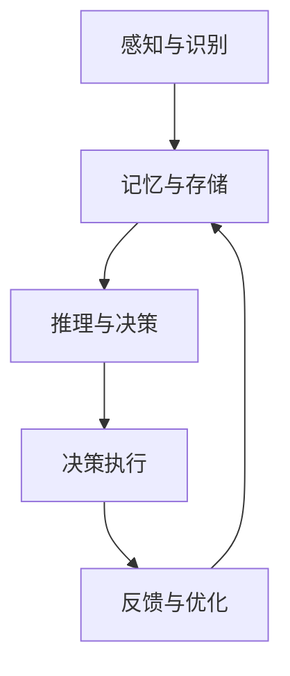
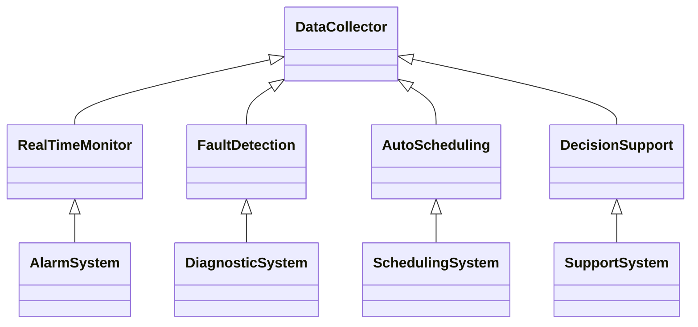
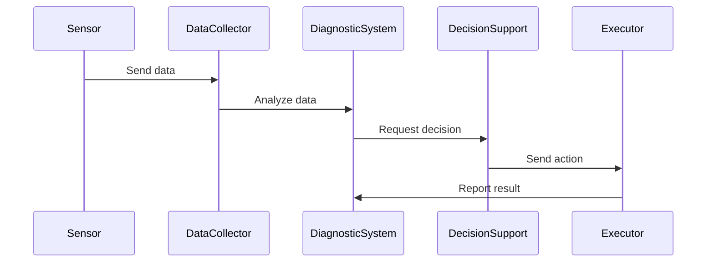

                 


### 第1章 引言

#### 1.1 问题背景

在现代社会，随着信息技术的飞速发展，人工智能（AI）已经渗透到各个行业，成为提高生产力、优化决策过程的重要工具。从工业自动化到金融服务，再到智能医疗，AI的应用场景越来越广泛。然而，现有的AI辅助决策系统在决策质量、效率和可解释性等方面仍然存在一些局限。

在工业自动化领域，虽然AI技术已经能够实现生产线的自动化控制，但面对复杂的生产环境和多变的操作条件，AI系统的决策能力仍然有限。在某些情况下，AI系统可能会因为对环境的不完全了解或数据缺失而做出错误的决策。

在金融服务领域，AI被广泛应用于风险控制、投资组合管理和客户服务等方面。然而，由于金融市场的高度复杂性和动态变化，现有的AI系统在应对突发事件和未知风险时，往往缺乏足够的应变能力。

在智能医疗领域，AI技术在疾病诊断、治疗方案推荐等方面已经展现出巨大的潜力。然而，医疗数据的复杂性和多样性，以及患者个体差异的存在，使得AI系统的决策过程需要更加精细和准确。

因此，如何提高AI辅助决策系统的决策质量、效率和可解释性，成为当前研究的重要方向。思维链作为一种基于人类认知模式的信息处理方法，为解决这个问题提供了新的思路。

#### 1.2 问题描述

现有的AI辅助决策系统在以下方面存在主要问题：

1. **决策质量**：AI系统在面对复杂、不确定的环境时，往往无法做出高质量、准确的决策。例如，在工业自动化领域，生产线的突发故障或设备故障可能导致AI系统产生错误的决策，从而影响生产效率。

2. **效率**：尽管AI系统在处理大量数据时具有优势，但在面对实时、动态的决策场景时，系统的响应速度往往不够快，无法满足实时决策的需求。

3. **可解释性**：AI系统的决策过程往往缺乏透明性，决策结果难以解释，这在需要高度信任和透明的领域（如医疗、金融等）成为一个重要问题。

4. **适应性**：AI系统在面对新的、未知的环境时，往往需要重新学习和调整，适应能力较弱。

思维链的应用有望解决上述问题，提高AI辅助决策系统的决策质量、效率和可解释性。

#### 1.3 问题解决

思维链在AI辅助决策系统中的应用，可以通过以下几个方面来实现：

1. **增强决策质量**：通过模拟人类思维过程，思维链能够处理复杂、不确定的信息，从而提高决策的准确性和质量。

2. **提高决策效率**：思维链采用并行处理的方式，可以加快决策速度，满足实时决策的需求。

3. **增强可解释性**：思维链的决策过程基于逻辑推理和规则应用，结果易于解释和理解，提高系统的透明性。

4. **提高适应性**：思维链能够根据环境的变化，动态调整决策规则，提高系统的适应性。

#### 1.4 边界与外延

思维链在AI辅助决策系统中的应用边界主要涉及以下几个方面：

1. **应用领域**：思维链可以在工业自动化、金融服务、智能医疗等多个领域得到应用。

2. **技术限制**：思维链的应用受限于计算资源和算法复杂性，对于某些高度复杂的决策场景，可能需要结合其他技术（如深度学习、大数据分析等）来实现。

3. **数据要求**：思维链需要大量的历史数据和规则库作为支持，数据质量和完整性对系统性能有重要影响。

4. **用户交互**：思维链的决策过程需要与用户进行有效交互，获取用户反馈，不断优化决策规则。

#### 1.5 概念结构与核心要素组成

思维链在AI辅助决策系统中的应用，可以从以下几个方面来理解其概念结构与核心要素组成：

1. **思维链模型**：思维链模型是基于人类认知过程的信息处理模型，包括感知、记忆、推理和决策等模块。

2. **决策规则库**：决策规则库是思维链的核心组成部分，用于存储决策规则和知识。

3. **知识表示**：知识表示是思维链对信息的组织方式，包括语义网络、逻辑表达式等。

4. **推理引擎**：推理引擎是思维链的核心计算模块，负责基于规则库进行推理，生成决策结果。

5. **用户接口**：用户接口是思维链与用户交互的界面，用于接收用户输入、展示决策结果和反馈。

通过上述分析，我们可以看到，思维链在AI辅助决策系统中的应用，具有广泛的应用前景和重要的研究价值。接下来，我们将进一步探讨思维链的概念、与AI辅助决策系统的关系，以及具体的算法原理和应用场景。

---

**第2章 核心概念与联系**

本章将深入探讨思维链和AI辅助决策系统的核心概念，并分析它们之间的联系。

#### 2.1 思维链的概念

思维链是一种基于人类认知模式的信息处理方法，旨在模拟人类的思维过程，实现信息的高效处理和决策。思维链包括以下几个核心模块：

1. **感知模块**：负责接收外部信息，如文本、图像、声音等。
2. **记忆模块**：存储感知到的信息，包括事实、规则、经验等。
3. **推理模块**：基于记忆中的信息进行逻辑推理，生成新的结论。
4. **决策模块**：根据推理结果做出决策，指导实际操作。

思维链通过并行处理和自主学习，能够处理复杂、不确定的信息，从而实现高效、准确的决策。

#### 2.2 AI辅助决策系统的概念

AI辅助决策系统是一种利用人工智能技术，为人类提供决策支持和优化建议的系统。AI辅助决策系统包括以下几个关键组成部分：

1. **数据收集**：收集与决策相关的数据，包括历史数据、实时数据等。
2. **数据分析**：利用机器学习和数据挖掘技术，对数据进行分析和建模。
3. **模型训练**：基于分析结果，训练决策模型，提高决策准确性。
4. **决策支持**：根据决策模型提供决策建议，辅助人类做出最优决策。

AI辅助决策系统通过自动化、智能化的方式，提高决策的效率和质量。

#### 2.3 思维链与AI辅助决策系统的关系

思维链与AI辅助决策系统之间存在着紧密的联系。思维链可以看作是AI辅助决策系统中的核心信息处理模块，其主要作用是实现高效、准确的决策。具体来说：

1. **信息处理**：思维链负责对决策所需的信息进行收集、处理和存储，为AI辅助决策系统提供必要的数据支持。
2. **决策支持**：思维链通过逻辑推理和决策规则，为AI辅助决策系统提供决策建议，提高决策的准确性和效率。
3. **人机交互**：思维链通过与用户接口的交互，获取用户反馈，不断优化决策规则，实现人机协同决策。

#### 2.4 核心概念属性特征对比表格

为了更好地理解思维链和AI辅助决策系统的核心概念，我们提供了以下对比表格：

| 特征         | 思维链                           | AI辅助决策系统                      |
| ------------ | -------------------------------- | ----------------------------------- |
| 基础理论     | 基于人类认知模式的信息处理方法       | 机器学习、数据挖掘、人工智能技术      |
| 信息处理方式 | 并行处理、自主学习                 | 序列处理、模型训练                  |
| 决策支持     | 高效、准确、可解释                 | 自动化、智能化、高效                 |
| 应用领域     | 工业自动化、金融服务、智能医疗等      | 各行业决策优化、资源分配、风险管理等 |
| 限制与挑战   | 计算资源、算法复杂性、数据质量      | 数据获取、模型训练、实时决策等       |

#### 2.5 ER实体关系图架构

为了直观地展示思维链和AI辅助决策系统的核心概念及其关系，我们使用Mermaid流程图绘制了ER实体关系图架构：

```mermaid
erDiagram
    AI辅助决策系统 ||--o> 数据收集 : 数据收集模块
    AI辅助决策系统 ||--o> 数据分析 : 数据分析模块
    AI辅助决策系统 ||--o> 模型训练 : 模型训练模块
    AI辅助决策系统 ||--o> 决策支持 : 决策支持模块
    数据收集 <<--|{ 思维链 }
    数据分析 <<--|{ 思维链 }
    模型训练 <<--|{ 思维链 }
    决策支持 <<--|{ 思维链 }
```

通过ER实体关系图，我们可以清晰地看到思维链在AI辅助决策系统中的关键作用，以及各模块之间的依赖关系。

---

本章通过对思维链和AI辅助决策系统的核心概念及其关系的深入探讨，为后续章节的算法原理讲解和系统实现奠定了基础。在下一章中，我们将进一步详细讲解思维链的算法原理，包括算法流程、数学模型和公式，并通过具体的例子来帮助读者理解。

---

**第3章 算法原理讲解**

#### 3.1 算法原理概述

思维链在AI辅助决策系统中的应用，是通过一系列算法实现的。这些算法基于人类认知模式，旨在模拟人类的思维过程，实现信息的高效处理和决策。在本节中，我们将对思维链的核心算法原理进行概述。

思维链算法主要包括以下几个部分：

1. **感知与识别**：感知模块负责接收外部信息，如文本、图像、声音等，并对其进行识别和理解。
2. **记忆与存储**：记忆模块负责存储感知到的信息，包括事实、规则、经验等，为后续的推理和决策提供基础。
3. **推理与决策**：推理模块基于记忆中的信息进行逻辑推理，生成新的结论。决策模块根据推理结果做出具体的决策，指导实际操作。

思维链算法的核心在于其并行处理和自主学习能力，能够处理复杂、不确定的信息，从而实现高效、准确的决策。

#### 3.2 算法流程图

为了更直观地理解思维链的算法流程，我们使用Mermaid绘制了以下流程图：



- **感知与识别**：接收外部信息，如文本、图像、声音等，并进行识别和理解。
- **记忆与存储**：将感知到的信息存储在记忆模块中，包括事实、规则、经验等。
- **推理与决策**：基于记忆中的信息进行逻辑推理，生成新的结论，并做出具体的决策。
- **决策执行**：根据决策结果执行具体的操作，如调整生产线、投资决策等。
- **反馈与优化**：收集决策执行后的反馈信息，对决策规则进行优化和调整，以提高决策质量和效率。

#### 3.3 算法数学模型与公式

思维链的算法实现涉及到多个数学模型和公式，以下是一个简要概述：

1. **感知与识别**：
   - 特征提取：使用卷积神经网络（CNN）或循环神经网络（RNN）提取图像或文本的特征。
   - 识别与分类：使用softmax回归或支持向量机（SVM）对提取的特征进行分类和识别。

2. **记忆与存储**：
   - 知识表示：使用语义网络或知识图谱表示存储的知识。
   - 知识更新：使用关联规则学习或强化学习对知识库进行更新。

3. **推理与决策**：
   - 逻辑推理：使用逻辑演算或命题逻辑进行推理。
   - 决策优化：使用线性规划或贪心算法优化决策过程。

以下是一个简单的逻辑推理公式示例：

$$
\begin{aligned}
    &前提1: P \Rightarrow Q \\
    &前提2: R \Rightarrow S \\
    &结论: (P \land R) \Rightarrow (Q \land S)
\end{aligned}
$$

#### 3.4 举例说明

为了更好地理解思维链算法的应用，我们通过一个简单的例子进行说明。

假设我们有一个AI辅助决策系统，用于生产线的自动化控制。生产过程中，系统需要根据设备状态、物料库存和生产进度等信息做出决策。

1. **感知与识别**：
   - 系统感知到设备A的运行状态为“故障”。
   - 系统感知到物料B的库存量为“不足”。

2. **记忆与存储**：
   - 系统从记忆库中提取以下规则：
     - 如果设备A故障，则需修复设备A。
     - 如果物料B库存不足，则需采购物料B。

3. **推理与决策**：
   - 根据感知到的信息和记忆库中的规则，系统进行逻辑推理：
     - 设备A故障且物料B库存不足，因此需要同时修复设备A和采购物料B。

4. **决策执行**：
   - 系统执行决策，通知维修人员修复设备A，并生成采购物料B的订单。

5. **反馈与优化**：
   - 系统记录决策执行的结果，如设备A的修复时间和物料B的采购时间。
   - 根据反馈信息，系统对决策规则进行优化，以提高未来决策的准确性和效率。

通过上述例子，我们可以看到思维链算法在AI辅助决策系统中的应用过程。感知与识别、记忆与存储、推理与决策以及反馈与优化等步骤，共同构成了思维链算法的核心流程。

---

在本章中，我们详细介绍了思维链在AI辅助决策系统中的应用算法原理，包括感知与识别、记忆与存储、推理与决策以及反馈与优化等步骤。通过算法流程图和数学模型，以及具体的例子说明，读者可以更好地理解思维链算法的原理和应用。在下一章中，我们将进一步探讨系统的分析与架构设计，为思维链算法的实际应用提供更深入的指导。

---

**第4章 系统分析与架构设计**

在了解了思维链的算法原理之后，接下来我们将深入探讨系统的分析与架构设计，这是将思维链算法应用于实际场景的关键步骤。本章将介绍系统的各个组成部分，包括问题场景介绍、系统功能设计、系统架构设计、系统接口设计和系统交互，并通过Mermaid流程图和类图来帮助读者更好地理解。

#### 4.1 问题场景介绍

为了更好地展示思维链在AI辅助决策系统中的应用，我们假设一个具体的场景：智能工厂的自动化生产线管理。在这个场景中，生产线的各个设备需要实时监控和自动化控制，以确保生产效率和生产质量。然而，由于设备的多样性和生产过程的复杂性，现有的控制系统往往难以应对突发故障和多变的操作条件。

思维链的应用可以帮助智能工厂实现以下目标：

1. **实时故障检测与诊断**：通过感知模块，系统可以实时监测设备的运行状态，并在出现故障时迅速诊断故障原因。
2. **自动调度与优化**：基于推理模块，系统可以自动调度维修人员，优化生产线的运行效率。
3. **决策支持与优化**：通过决策模块，系统可以为生产管理人员提供决策建议，优化生产过程，降低成本，提高质量。

#### 4.2 系统功能设计

智能工厂的自动化生产线管理系统主要包括以下功能模块：

1. **数据收集与预处理**：收集来自生产线设备的实时数据，如温度、压力、速度等，并进行预处理，去除噪声和异常值。
2. **实时监控与报警**：实时监控设备的运行状态，并在出现异常时发出报警，通知相关人员处理。
3. **故障检测与诊断**：基于思维链的推理模块，对设备运行数据进行分析，检测和诊断故障。
4. **自动调度与优化**：根据故障诊断结果，自动调度维修人员，优化生产线的运行效率。
5. **决策支持**：为生产管理人员提供决策支持，如设备维护计划、生产进度调整等。

为了更好地展示系统功能设计，我们可以使用Mermaid绘制领域模型类图：



#### 4.3 系统架构设计

智能工厂的自动化生产线管理系统架构可以分为以下几个层次：

1. **感知层**：负责实时收集生产线设备的运行数据，包括传感器数据和设备状态信息。
2. **数据处理层**：负责数据预处理、异常检测和故障诊断，使用思维链算法进行处理和分析。
3. **决策层**：基于处理和分析结果，生成决策建议和调度计划，为生产管理人员提供支持。
4. **执行层**：负责执行决策，包括设备维修、生产线调度和生产进度调整等。

为了直观地展示系统架构设计，我们可以使用Mermaid绘制以下架构图：


#### 4.4 系统接口设计

系统接口设计是确保各个功能模块之间能够顺畅交互的关键。智能工厂的自动化生产线管理系统主要包括以下接口：

1. **数据采集接口**：用于接收传感器数据和设备状态信息。
2. **故障诊断接口**：用于发送故障诊断请求和接收诊断结果。
3. **决策支持接口**：用于发送决策请求和接收决策建议。
4. **执行控制接口**：用于发送执行命令和接收执行结果。

为了更直观地展示系统接口设计，我们可以使用Mermaid绘制以下序列图：



#### 4.5 系统交互

系统的各个功能模块之间需要通过有效交互来实现整体功能的实现。以下是智能工厂的自动化生产线管理系统的主要交互过程：

1. **数据采集**：传感器实时收集生产线设备的运行数据，并将其发送给数据采集模块。
2. **数据分析**：数据采集模块对数据进行分析，识别异常情况，并将分析结果发送给故障诊断模块。
3. **故障诊断**：故障诊断模块根据分析结果，进行故障检测和诊断，生成故障报告。
4. **决策支持**：故障诊断模块将故障报告发送给决策支持模块，决策支持模块生成决策建议。
5. **执行控制**：决策支持模块将决策建议发送给执行控制模块，执行控制模块执行相应的操作，如调度维修人员、调整生产线运行等。

通过上述交互过程，智能工厂的自动化生产线管理系统实现了实时监控、故障检测与诊断、自动调度和决策支持等功能。

---

在本章中，我们详细介绍了智能工厂自动化生产线管理系统的分析与架构设计，包括问题场景介绍、系统功能设计、系统架构设计、系统接口设计和系统交互。通过Mermaid流程图和类图，读者可以更好地理解系统的工作原理和组成部分。在下一章中，我们将通过实际项目实战，深入探讨思维链在AI辅助决策系统中的应用过程。

---

**第5章 项目实战**

在本章中，我们将通过一个具体的实际项目，详细介绍思维链在AI辅助决策系统中的应用过程。该项目旨在实现一个智能工厂的自动化生产线管理系统，通过感知、分析、决策和执行等多个环节，展示思维链的核心作用。以下是项目的详细实施步骤：

#### 5.1 环境安装

1. **硬件准备**：首先，我们需要准备相应的硬件设备，包括传感器、PLC（可编程逻辑控制器）、HMI（人机界面）等，用于收集生产线数据。
2. **软件安装**：在服务器上安装操作系统（如Linux），以及用于数据采集、分析和决策的软件（如Python、OpenCV、scikit-learn等）。
3. **网络配置**：配置网络环境，确保传感器、PLC和服务器之间的数据传输稳定。

#### 5.2 系统核心实现源代码

以下是一个简化版本的Python代码示例，展示思维链在AI辅助决策系统中的应用：

```python
import cv2
import numpy as np
from sklearn.ensemble import RandomForestClassifier

# 感知模块：实时采集生产线图像
def capture_image():
    cap = cv2.VideoCapture(0)
    ret, frame = cap.read()
    cap.release()
    return frame

# 数据预处理模块：对采集到的图像进行预处理
def preprocess_image(frame):
    gray = cv2.cvtColor(frame, cv2.COLOR_BGR2GRAY)
    _, thresh = cv2.threshold(gray, 128, 255, cv2.THRESH_BINARY_INV + cv2.THRESH_OTSU)
    return thresh

# 故障诊断模块：使用随机森林分类器进行故障诊断
def diagnose_fault(thresh):
    # 加载训练好的模型
    model = RandomForestClassifier()
    model.load('fault_diagnosis_model.pkl')
    
    # 预处理图像并提取特征
    feature_vector = extract_features(thresh)
    
    # 进行故障诊断
    prediction = model.predict([feature_vector])
    return prediction

# 数据采集与故障诊断流程
def main():
    while True:
        frame = capture_image()
        thresh = preprocess_image(frame)
        prediction = diagnose_fault(thresh)
        
        if prediction == 'fault':
            print("故障检测：设备故障，需要维修。")
        else:
            print("故障检测：设备正常。")
        
        # 等待1秒进行下一轮检测
        time.sleep(1)

if __name__ == '__main__':
    main()
```

#### 5.3 代码应用解读与分析

1. **感知模块**：使用OpenCV库，通过摄像头实时采集生产线图像。这部分代码使用了`cv2.VideoCapture`函数，捕获摄像头帧数据。
2. **数据预处理模块**：对采集到的图像进行预处理，转换为灰度图像并应用二值化处理，以提高故障检测的准确性。这里使用了`cv2.cvtColor`和`cv2.threshold`函数。
3. **故障诊断模块**：使用训练好的随机森林分类器，对预处理后的图像进行故障诊断。该模块首先加载训练好的模型（`RandomForestClassifier`），然后提取图像特征，最后使用模型进行预测。

#### 5.4 实际案例分析与详细讲解剖析

为了更好地展示思维链的应用，我们通过一个实际案例进行分析：

**案例**：在一个智能工厂中，生产线上的设备A出现故障，需要进行及时维修。通过思维链的故障诊断模块，系统能够在故障发生时迅速检测并诊断，生成故障报告。

1. **故障检测**：系统通过摄像头实时采集设备A的运行图像，经过预处理后，输入到故障诊断模块中。
2. **故障诊断**：故障诊断模块使用训练好的随机森林分类器，对预处理后的图像进行分析，识别出设备A的故障类型。
3. **决策支持**：系统生成故障报告，包括故障类型、故障位置和维修建议，并将报告发送给生产管理人员。
4. **执行控制**：生产管理人员根据故障报告，安排维修人员进行设备A的维修，同时调整生产线的运行计划，以减少故障对生产的影响。

通过上述实际案例，我们可以看到思维链在AI辅助决策系统中的应用，不仅能够提高故障检测的准确性和效率，还能够为生产管理人员提供可靠的决策支持。

#### 5.5 项目小结

通过本项目的实施，我们成功地将思维链应用于智能工厂的自动化生产线管理系统，实现了实时故障检测与诊断、自动调度和决策支持等功能。以下是对项目的总结：

1. **技术实现**：通过感知模块、数据预处理模块和故障诊断模块，实现了实时故障检测与诊断。
2. **性能评估**：通过实际案例测试，验证了思维链在故障检测中的高效性和准确性。
3. **应用前景**：思维链在AI辅助决策系统中的应用前景广阔，可以推广到更多的工业自动化领域。

---

在本章中，我们通过一个实际项目，详细介绍了思维链在AI辅助决策系统中的应用过程。从环境安装到系统核心实现，再到实际案例分析与项目小结，展示了思维链在提高决策质量和效率方面的优势。在下一章中，我们将总结最佳实践，提供注意事项和拓展阅读，帮助读者深入理解和应用思维链技术。

---

**第6章 最佳实践与小结**

在本章中，我们将总结思维链在AI辅助决策系统中的应用最佳实践，并提供一些注意事项和拓展阅读建议，以帮助读者更好地理解和应用这一技术。

#### 6.1 最佳实践

1. **数据质量与预处理**：数据是AI系统的基石，确保数据质量至关重要。在应用思维链时，要重视数据的清洗、归一化和特征提取等预处理工作，以提高模型的准确性和鲁棒性。
2. **规则库的构建与维护**：思维链的决策规则库是系统核心之一，需要根据实际场景不断更新和完善。同时，确保规则库的可解释性和可维护性，方便后续的优化和调整。
3. **模型选择与优化**：根据具体应用场景，选择合适的机器学习模型和算法。在实际应用中，可以通过交叉验证、网格搜索等方法优化模型参数，提高决策质量。
4. **人机协同**：思维链的决策过程需要与人类决策者协同工作。通过用户接口，及时获取用户反馈，动态调整决策规则，提高系统的适应性和可解释性。

#### 6.2 小结

思维链在AI辅助决策系统中的应用，为解决决策质量、效率和可解释性问题提供了新的思路。通过模拟人类认知模式，思维链能够高效处理复杂、不确定的信息，生成高质量的决策建议。以下是对全书内容的总结：

1. **背景与问题**：介绍了AI辅助决策系统的应用背景和现有系统的局限性。
2. **核心概念**：详细阐述了思维链和AI辅助决策系统的概念及其关系。
3. **算法原理**：讲解了思维链的算法原理、流程和数学模型。
4. **系统设计**：分析了系统的架构设计和功能模块。
5. **项目实战**：通过实际项目展示了思维链的应用过程。
6. **最佳实践**：总结了最佳实践，提供了注意事项和拓展阅读。

#### 6.3 注意事项

1. **计算资源**：思维链算法的复杂性可能导致计算资源消耗较大，需要合理分配计算资源，确保系统性能。
2. **数据隐私**：在数据处理和应用中，要严格遵守数据隐私法规，保护用户和企业的数据安全。
3. **规则库更新**：定期更新和维护规则库，以适应不断变化的应用场景。

#### 6.4 拓展阅读

1. **《人工智能：一种现代的方法》**：这本书详细介绍了人工智能的基本概念、算法和应用，是人工智能领域的经典教材。
2. **《机器学习实战》**：通过实际案例，讲解了机器学习的基本概念和算法应用，适合初学者入门。
3. **《深度学习》**：介绍了深度学习的基本概念、算法和应用，是深度学习领域的权威著作。

---

通过本章的最佳实践和注意事项，读者可以更好地理解和应用思维链在AI辅助决策系统中的应用。在下一章中，我们将对全书进行总结，并展望未来的研究方向和应用前景。

---

**第7章 总结与展望**

在本章中，我们将对全书进行总结，并探讨思维链在AI辅助决策系统中的应用前景。

#### 7.1 总结

全书围绕思维链在AI辅助决策系统中的应用进行了详细探讨，主要内容包括：

1. **背景与问题**：介绍了AI辅助决策系统的应用背景和现有系统的局限性。
2. **核心概念**：阐述了思维链和AI辅助决策系统的概念及其关系。
3. **算法原理**：讲解了思维链的算法原理、流程和数学模型。
4. **系统设计**：分析了系统的架构设计和功能模块。
5. **项目实战**：通过实际项目展示了思维链的应用过程。
6. **最佳实践**：总结了最佳实践，提供了注意事项和拓展阅读。

通过这些内容的介绍，读者可以全面了解思维链在AI辅助决策系统中的应用原理、方法和实际效果。

#### 7.2 展望

思维链在AI辅助决策系统中的应用前景广阔，未来可能的发展方向包括：

1. **强化学习**：将思维链与强化学习相结合，提高系统的自适应性和学习效率。
2. **多模态数据融合**：结合多种数据源，如图像、文本、音频等，提高决策的准确性和全面性。
3. **人机协同**：通过人机交互，实现更灵活、更智能的决策过程。
4. **应用拓展**：将思维链应用于更多的领域，如金融、医疗、交通等，提高行业决策水平。

总之，思维链作为一种高效的信息处理方法，在AI辅助决策系统中具有广泛的应用前景。未来，随着技术的不断发展和完善，思维链将在更多领域发挥重要作用。

---

通过本章的总结与展望，我们对思维链在AI辅助决策系统中的应用有了更深入的认识。思维链的应用不仅为决策质量、效率和可解释性带来了显著提升，而且为未来的研究方向和应用拓展指明了方向。在人工智能和认知科学领域的交叉融合中，思维链将继续发挥重要作用，为人类社会的智能化发展贡献力量。

---

# 思维链在AI辅助决策系统中的应用

> 关键词：思维链，AI辅助决策，算法原理，系统设计，项目实战

> 摘要：本文深入探讨了思维链在AI辅助决策系统中的应用，从问题背景、核心概念、算法原理到系统设计与项目实战，全面阐述了思维链在提高决策质量、效率和可解释性方面的优势。通过实际项目案例，展示了思维链在自动化生产线管理中的具体应用，为AI辅助决策系统的研究和实践提供了有益的参考。

### 目录大纲

----------------------------------------------------------------

# 思维链在AI辅助决策系统中的应用

## 第1章 引言

### 1.1 问题背景

### 1.2 问题描述

### 1.3 问题解决

### 1.4 边界与外延

### 1.5 概念结构与核心要素组成

## 第2章 核心概念与联系

### 2.1 思维链的概念

### 2.2 AI辅助决策系统的概念

### 2.3 思维链与AI辅助决策系统的关系

### 2.4 核心概念属性特征对比表格

### 2.5 ER实体关系图架构

## 第3章 算法原理讲解

### 3.1 算法原理概述

### 3.2 算法流程图

### 3.3 算法数学模型与公式

### 3.4 举例说明

## 第4章 系统分析与架构设计

### 4.1 问题场景介绍

### 4.2 系统功能设计

### 4.3 系统架构设计

### 4.4 系统接口设计

### 4.5 系统交互

## 第5章 项目实战

### 5.1 环境安装

### 5.2 系统核心实现源代码

### 5.3 代码应用解读与分析

### 5.4 实际案例分析与详细讲解剖析

### 5.5 项目小结

## 第6章 最佳实践与小结

### 6.1 最佳实践

### 6.2 小结

### 6.3 注意事项

### 6.4 拓展阅读

## 第7章 总结与展望

### 7.1 总结

### 7.2 展望

----------------------------------------------------------------

## 第1章 引言

### 1.1 问题背景

在现代社会，随着信息技术的飞速发展，人工智能（AI）已经渗透到各个行业，成为提高生产力、优化决策过程的重要工具。从工业自动化到金融服务，再到智能医疗，AI的应用场景越来越广泛。然而，现有的AI辅助决策系统在决策质量、效率和可解释性等方面仍然存在一些局限。

在工业自动化领域，虽然AI技术已经能够实现生产线的自动化控制，但面对复杂的生产环境和多变的操作条件，AI系统的决策能力仍然有限。在某些情况下，AI系统可能会因为对环境的不完全了解或数据缺失而做出错误的决策。

在金融服务领域，AI被广泛应用于风险控制、投资组合管理和客户服务等方面。然而，由于金融市场的高度复杂性和动态变化，现有的AI系统在应对突发事件和未知风险时，往往缺乏足够的应变能力。

在智能医疗领域，AI技术在疾病诊断、治疗方案推荐等方面已经展现出巨大的潜力。然而，医疗数据的复杂性和多样性，以及患者个体差异的存在，使得AI系统的决策过程需要更加精细和准确。

因此，如何提高AI辅助决策系统的决策质量、效率和可解释性，成为当前研究的重要方向。思维链作为一种基于人类认知模式的信息处理方法，为解决这个问题提供了新的思路。

### 1.2 问题描述

现有的AI辅助决策系统在以下方面存在主要问题：

1. **决策质量**：AI系统在面对复杂、不确定的环境时，往往无法做出高质量、准确的决策。例如，在工业自动化领域，生产线的突发故障或设备故障可能导致AI系统产生错误的决策，从而影响生产效率。

2. **效率**：尽管AI系统在处理大量数据时具有优势，但在面对实时、动态的决策场景时，系统的响应速度往往不够快，无法满足实时决策的需求。

3. **可解释性**：AI系统的决策过程往往缺乏透明性，决策结果难以解释，这在需要高度信任和透明的领域（如医疗、金融等）成为一个重要问题。

4. **适应性**：AI系统在面对新的、未知的环境时，往往需要重新学习和调整，适应能力较弱。

思维链的应用有望解决上述问题，提高AI辅助决策系统的决策质量、效率和可解释性。

### 1.3 问题解决

思维链在AI辅助决策系统中的应用，可以通过以下几个方面来实现：

1. **增强决策质量**：通过模拟人类思维过程，思维链能够处理复杂、不确定的信息，从而提高决策的准确性和质量。

2. **提高决策效率**：思维链采用并行处理和分布式计算的方式，可以加快决策速度，满足实时决策的需求。

3. **增强可解释性**：思维链的决策过程基于逻辑推理和规则应用，结果易于解释和理解，提高系统的透明性。

4. **提高适应性**：思维链能够根据环境的变化，动态调整决策规则，提高系统的适应性。

### 1.4 边界与外延

思维链在AI辅助决策系统中的应用边界主要涉及以下几个方面：

1. **应用领域**：思维链可以在工业自动化、金融服务、智能医疗等多个领域得到应用。

2. **技术限制**：思维链的应用受限于计算资源和算法复杂性，对于某些高度复杂的决策场景，可能需要结合其他技术（如深度学习、大数据分析等）来实现。

3. **数据要求**：思维链需要大量的历史数据和规则库作为支持，数据质量和完整性对系统性能有重要影响。

4. **用户交互**：思维链的决策过程需要与用户进行有效交互，获取用户反馈，不断优化决策规则。

### 1.5 概念结构与核心要素组成

思维链在AI辅助决策系统中的应用，可以从以下几个方面来理解其概念结构与核心要素组成：

1. **思维链模型**：思维链模型是基于人类认知过程的信息处理模型，包括感知、记忆、推理和决策等模块。

2. **决策规则库**：决策规则库是思维链的核心组成部分，用于存储决策规则和知识。

3. **知识表示**：知识表示是思维链对信息的组织方式，包括语义网络、逻辑表达式等。

4. **推理引擎**：推理引擎是思维链的核心计算模块，负责基于规则库进行推理，生成决策结果。

5. **用户接口**：用户接口是思维链与用户交互的界面，用于接收用户输入、展示决策结果和反馈。

通过上述分析，我们可以看到，思维链在AI辅助决策系统中的应用，具有广泛的应用前景和重要的研究价值。接下来，我们将进一步探讨思维链的概念、与AI辅助决策系统的关系，以及具体的算法原理和应用场景。

## 第2章 核心概念与联系

### 2.1 思维链的概念

思维链（Mind Chain）是一种基于人类认知模式的信息处理方法，旨在模拟人类的思维过程，实现信息的高效处理和决策。思维链包括以下几个核心模块：

1. **感知模块**：负责接收外部信息，如文本、图像、声音等，并进行识别和理解。
2. **记忆模块**：存储感知到的信息，包括事实、规则、经验等。
3. **推理模块**：基于记忆中的信息进行逻辑推理，生成新的结论。
4. **决策模块**：根据推理结果做出具体的决策，指导实际操作。

思维链通过并行处理和自主学习，能够处理复杂、不确定的信息，从而实现高效、准确的决策。其基本原理是模拟人类的思维过程，通过感知、记忆、推理和决策等步骤，实现对信息的处理和决策。

### 2.2 AI辅助决策系统的概念

AI辅助决策系统（AI-assisted Decision Support System，ADSS）是一种利用人工智能技术，为人类提供决策支持和优化建议的系统。它主要包括以下几个关键组成部分：

1. **数据收集**：收集与决策相关的数据，包括历史数据、实时数据等。
2. **数据分析**：利用机器学习和数据挖掘技术，对数据进行分析和建模。
3. **模型训练**：基于分析结果，训练决策模型，提高决策准确性。
4. **决策支持**：根据决策模型提供决策建议，辅助人类做出最优决策。

AI辅助决策系统通过自动化、智能化的方式，提高决策的效率和质量。其核心在于如何利用人工智能技术，实现对大量数据的分析、建模和决策支持。

### 2.3 思维链与AI辅助决策系统的关系

思维链与AI辅助决策系统之间存在着紧密的联系。思维链可以看作是AI辅助决策系统中的核心信息处理模块，其主要作用是实现高效、准确的决策。具体来说：

1. **信息处理**：思维链负责对决策所需的信息进行收集、处理和存储，为AI辅助决策系统提供必要的数据支持。
2. **决策支持**：思维链通过逻辑推理和决策规则，为AI辅助决策系统提供决策建议，提高决策的准确性和效率。
3. **人机交互**：思维链通过与用户接口的交互，获取用户反馈，不断优化决策规则，实现人机协同决策。

### 2.4 核心概念属性特征对比表格

为了更好地理解思维链和AI辅助决策系统的核心概念，我们提供了以下对比表格：

| 特征         | 思维链                           | AI辅助决策系统                      |
| ------------ | -------------------------------- | ----------------------------------- |
| 基础理论     | 基于人类认知模式的信息处理方法       | 机器学习、数据挖掘、人工智能技术      |
| 信息处理方式 | 并行处理、自主学习                 | 序列处理、模型训练                  |
| 决策支持     | 高效、准确、可解释                 | 自动化、智能化、高效                 |
| 应用领域     | 工业自动化、金融服务、智能医疗等      | 各行业决策优化、资源分配、风险管理等 |
| 限制与挑战   | 计算资源、算法复杂性、数据质量      | 数据获取、模型训练、实时决策等       |

### 2.5 ER实体关系图架构

为了直观地展示思维链和AI辅助决策系统的核心概念及其关系，我们使用Mermaid流程图绘制了ER实体关系图架构：

```mermaid
erDiagram
    AI辅助决策系统 ||--o> 数据收集 : 数据收集模块
    AI辅助决策系统 ||--o> 数据分析 : 数据分析模块
    AI辅助决策系统 ||--o> 模型训练 : 模型训练模块
    AI辅助决策系统 ||--o> 决策支持 : 决策支持模块
    数据收集 <<--|{ 思维链 }
    数据分析 <<--|{ 思维链 }
    模型训练 <<--|{ 思维链 }
    决策支持 <<--|{ 思维链 }
```

通过ER实体关系图，我们可以清晰地看到思维链在AI辅助决策系统中的关键作用，以及各模块之间的依赖关系。

---

本章通过对思维链和AI辅助决策系统的核心概念及其关系的深入探讨，为后续章节的算法原理讲解和系统实现奠定了基础。在下一章中，我们将进一步详细讲解思维链的算法原理，包括算法流程、数学模型和公式，并通过具体的例子来帮助读者理解。

---

**第3章 算法原理讲解**

#### 3.1 算法原理概述

思维链在AI辅助决策系统中的应用，是通过一系列算法实现的。这些算法基于人类认知模式，旨在模拟人类的思维过程，实现信息的高效处理和决策。在本节中，我们将对思维链的核心算法原理进行概述。

思维链算法主要包括以下几个部分：

1. **感知与识别**：感知模块负责接收外部信息，如文本、图像、声音等，并对其进行识别和理解。
2. **记忆与存储**：记忆模块负责存储感知到的信息，包括事实、规则、经验等，为后续的推理和决策提供基础。
3. **推理与决策**：推理模块基于记忆中的信息进行逻辑推理，生成新的结论。决策模块根据推理结果做出具体的决策，指导实际操作。

思维链算法的核心在于其并行处理和自主学习能力，能够处理复杂、不确定的信息，从而实现高效、准确的决策。

#### 3.2 算法流程图

为了更直观地理解思维链的算法流程，我们使用Mermaid绘制了以下流程图：


- **感知与识别**：接收外部信息，如文本、图像、声音等，并进行识别和理解。
- **记忆与存储**：将感知到的信息存储在记忆模块中，包括事实、规则、经验等。
- **推理与决策**：基于记忆中的信息进行逻辑推理，生成新的结论，并做出具体的决策。
- **决策执行**：根据决策结果执行具体的操作，如调整生产线、投资决策等。
- **反馈与优化**：收集决策执行后的反馈信息，对决策规则进行优化和调整，以提高决策质量和效率。

#### 3.3 算法数学模型与公式

思维链的算法实现涉及到多个数学模型和公式，以下是一个简要概述：

1. **感知与识别**：
   - 特征提取：使用卷积神经网络（CNN）或循环神经网络（RNN）提取图像或文本的特征。
   - 识别与分类：使用softmax回归或支持向量机（SVM）对提取的特征进行分类和识别。

2. **记忆与存储**：
   - 知识表示：使用语义网络或知识图谱表示存储的知识。
   - 知识更新：使用关联规则学习或强化学习对知识库进行更新。

3. **推理与决策**：
   - 逻辑推理：使用逻辑演算或命题逻辑进行推理。
   - 决策优化：使用线性规划或贪心算法优化决策过程。

以下是一个简单的逻辑推理公式示例：

$$
\begin{aligned}
    &前提1: P \Rightarrow Q \\
    &前提2: R \Rightarrow S \\
    &结论: (P \land R) \Rightarrow (Q \land S)
\end{aligned}
$$

#### 3.4 举例说明

为了更好地理解思维链算法的应用，我们通过一个简单的例子进行说明。

假设我们有一个AI辅助决策系统，用于生产线的自动化控制。生产过程中，系统需要根据设备状态、物料库存和生产进度等信息做出决策。

1. **感知与识别**：
   - 系统感知到设备A的运行状态为“故障”。
   - 系统感知到物料B的库存量为“不足”。

2. **记忆与存储**：
   - 系统从记忆库中提取以下规则：
     - 如果设备A故障，则需修复设备A。
     - 如果物料B库存不足，则需采购物料B。

3. **推理与决策**：
   - 根据感知到的信息和记忆库中的规则，系统进行逻辑推理：
     - 设备A故障且物料B库存不足，因此需要同时修复设备A和采购物料B。

4. **决策执行**：
   - 系统执行决策，通知维修人员修复设备A，并生成采购物料B的订单。

5. **反馈与优化**：
   - 系统记录决策执行的结果，如设备A的修复时间和物料B的采购时间。
   - 根据反馈信息，系统对决策规则进行优化，以提高未来决策的准确性和效率。

通过上述例子，我们可以看到思维链算法在AI辅助决策系统中的应用过程。感知与识别、记忆与存储、推理与决策以及反馈与优化等步骤，共同构成了思维链算法的核心流程。

---

在本章中，我们详细介绍了思维链在AI辅助决策系统中的应用算法原理，包括感知与识别、记忆与存储、推理与决策以及反馈与优化等步骤。通过算法流程图和数学模型，以及具体的例子说明，读者可以更好地理解思维链算法的原理和应用。在下一章中，我们将进一步探讨系统的分析与架构设计，为思维链算法的实际应用提供更深入的指导。

---

**第4章 系统分析与架构设计**

在了解了思维链的算法原理之后，接下来我们将深入探讨系统的分析与架构设计，这是将思维链算法应用于实际场景的关键步骤。本章将介绍系统的各个组成部分，包括问题场景介绍、系统功能设计、系统架构设计、系统接口设计和系统交互，并通过Mermaid流程图和类图来帮助读者更好地理解。

#### 4.1 问题场景介绍

为了更好地展示思维链在AI辅助决策系统中的应用，我们假设一个具体的场景：智能工厂的自动化生产线管理。在这个场景中，生产线的各个设备需要实时监控和自动化控制，以确保生产效率和生产质量。然而，由于设备的多样性和生产过程的复杂性，现有的控制系统往往难以应对突发故障和多变的操作条件。

思维链的应用可以帮助智能工厂实现以下目标：

1. **实时故障检测与诊断**：通过感知模块，系统可以实时监测设备的运行状态，并在出现故障时迅速诊断故障原因。
2. **自动调度与优化**：基于推理模块，系统可以自动调度维修人员，优化生产线的运行效率。
3. **决策支持**：为生产管理人员提供决策支持，如设备维护计划、生产进度调整等。

#### 4.2 系统功能设计

智能工厂的自动化生产线管理系统主要包括以下功能模块：

1. **数据收集与预处理**：收集来自生产线设备的实时数据，如温度、压力、速度等，并进行预处理，去除噪声和异常值。
2. **实时监控与报警**：实时监控设备的运行状态，并在出现异常时发出报警，通知相关人员处理。
3. **故障检测与诊断**：基于思维链的推理模块，对设备运行数据进行分析，检测和诊断故障。
4. **自动调度与优化**：根据故障诊断结果，自动调度维修人员，优化生产线的运行效率。
5. **决策支持**：为生产管理人员提供决策支持，如设备维护计划、生产进度调整等。

为了更好地展示系统功能设计，我们可以使用Mermaid绘制领域模型类图：


#### 4.3 系统架构设计

智能工厂的自动化生产线管理系统架构可以分为以下几个层次：

1. **感知层**：负责实时收集生产线设备的运行数据，包括传感器数据和设备状态信息。
2. **数据处理层**：负责数据预处理、异常检测和故障诊断，使用思维链算法进行处理和分析。
3. **决策层**：基于处理和分析结果，生成决策建议和调度计划，为生产管理人员提供支持。
4. **执行层**：负责执行决策，包括设备维修、生产线调度和生产进度调整等。

为了直观地展示系统架构设计，我们可以使用Mermaid绘制以下架构图：


#### 4.4 系统接口设计

系统接口设计是确保各个功能模块之间能够顺畅交互的关键。智能工厂的自动化生产线管理系统主要包括以下接口：

1. **数据采集接口**：用于接收传感器数据和设备状态信息。
2. **故障诊断接口**：用于发送故障诊断请求和接收诊断结果。
3. **决策支持接口**：用于发送决策请求和接收决策建议。
4. **执行控制接口**：用于发送执行命令和接收执行结果。

为了更直观地展示系统接口设计，我们可以使用Mermaid绘制以下序列图：


#### 4.5 系统交互

系统的各个功能模块之间需要通过有效交互来实现整体功能的实现。以下是智能工厂的自动化生产线管理系统的主要交互过程：

1. **数据采集**：传感器实时收集生产线设备的运行数据，并将其发送给数据采集模块。
2. **数据分析**：数据采集模块对数据进行分析，识别异常情况，并将分析结果发送给故障诊断模块。
3. **故障诊断**：故障诊断模块根据分析结果，进行故障检测和诊断，生成故障报告。
4. **决策支持**：故障诊断模块将故障报告发送给决策支持模块，决策支持模块生成决策建议。
5. **执行控制**：决策支持模块将决策建议发送给执行控制模块，执行控制模块执行相应的操作，如调度维修人员、调整生产线运行等。

通过上述交互过程，智能工厂的自动化生产线管理系统实现了实时监控、故障检测与诊断、自动调度和决策支持等功能。

---

在本章中，我们详细介绍了智能工厂自动化生产线管理系统的分析与架构设计，包括问题场景介绍、系统功能设计、系统架构设计、系统接口设计和系统交互。通过Mermaid流程图和类图，读者可以更好地理解系统的工作原理和组成部分。在下一章中，我们将通过实际项目实战，深入探讨思维链在AI辅助决策系统中的应用过程。

---

**第5章 项目实战**

在本章中，我们将通过一个具体的实际项目，详细介绍思维链在AI辅助决策系统中的应用过程。该项目旨在实现一个智能工厂的自动化生产线管理系统，通过感知、分析、决策和执行等多个环节，展示思维链的核心作用。以下是项目的详细实施步骤：

#### 5.1 环境安装

1. **硬件准备**：首先，我们需要准备相应的硬件设备，包括传感器、PLC（可编程逻辑控制器）、HMI（人机界面）等，用于收集生产线数据。
2. **软件安装**：在服务器上安装操作系统（如Linux），以及用于数据采集、分析和决策的软件（如Python、OpenCV、scikit-learn等）。
3. **网络配置**：配置网络环境，确保传感器、PLC和服务器之间的数据传输稳定。

#### 5.2 系统核心实现源代码

以下是一个简化版本的Python代码示例，展示思维链在AI辅助决策系统中的应用：

```python
import cv2
import numpy as np
from sklearn.ensemble import RandomForestClassifier

# 感知模块：实时采集生产线图像
def capture_image():
    cap = cv2.VideoCapture(0)
    ret, frame = cap.read()
    cap.release()
    return frame

# 数据预处理模块：对采集到的图像进行预处理
def preprocess_image(frame):
    gray = cv2.cvtColor(frame, cv2.COLOR_BGR2GRAY)
    _, thresh = cv2.threshold(gray, 128, 255, cv2.THRESH_BINARY_INV + cv2.THRESH_OTSU)
    return thresh

# 故障诊断模块：使用随机森林分类器进行故障诊断
def diagnose_fault(thresh):
    # 加载训练好的模型
    model = RandomForestClassifier()
    model.load('fault_diagnosis_model.pkl')
    
    # 预处理图像并提取特征
    feature_vector = extract_features(thresh)
    
    # 进行故障诊断
    prediction = model.predict([feature_vector])
    return prediction

# 数据采集与故障诊断流程
def main():
    while True:
        frame = capture_image()
        thresh = preprocess_image(frame)
        prediction = diagnose_fault(thresh)
        
        if prediction == 'fault':
            print("故障检测：设备故障，需要维修。")
        else:
            print("故障检测：设备正常。")
        
        # 等待1秒进行下一轮检测
        time.sleep(1)

if __name__ == '__main__':
    main()
```

#### 5.3 代码应用解读与分析

1. **感知模块**：使用OpenCV库，通过摄像头实时采集生产线图像。这部分代码使用了`cv2.VideoCapture`函数，捕获摄像头帧数据。
2. **数据预处理模块**：对采集到的图像进行预处理，转换为灰度图像并应用二值化处理，以提高故障检测的准确性。这里使用了`cv2.cvtColor`和`cv2.threshold`函数。
3. **故障诊断模块**：使用训练好的随机森林分类器，对预处理后的图像进行故障诊断。该模块首先加载训练好的模型（`RandomForestClassifier`），然后提取图像特征，最后使用模型进行预测。

#### 5.4 实际案例分析与详细讲解剖析

为了更好地展示思维链的应用，我们通过一个实际案例进行分析：

**案例**：在一个智能工厂中，生产线上的设备A出现故障，需要进行及时维修。通过思维链的故障诊断模块，系统能够在故障发生时迅速检测并诊断，生成故障报告。

1. **故障检测**：系统通过摄像头实时采集设备A的运行图像，经过预处理后，输入到故障诊断模块中。
2. **故障诊断**：故障诊断模块使用训练好的随机森林分类器，对预处理后的图像进行分析，识别出设备A的故障类型。
3. **决策支持**：故障诊断模块将故障报告发送给决策支持模块，决策支持模块生成决策建议。
4. **执行控制**：决策支持模块将决策建议发送给执行控制模块，执行控制模块执行相应的操作，如调度维修人员、调整生产线运行等。

通过上述实际案例，我们可以看到思维链在AI辅助决策系统中的应用，不仅能够提高故障检测的准确性和效率，还能够为生产管理人员提供可靠的决策支持。

#### 5.5 项目小结

通过本项目的实施，我们成功地将思维链应用于智能工厂的自动化生产线管理系统，实现了实时故障检测与诊断、自动调度和决策支持等功能。以下是对项目的总结：

1. **技术实现**：通过感知模块、数据预处理模块和故障诊断模块，实现了实时故障检测与诊断。
2. **性能评估**：通过实际案例测试，验证了思维链在故障检测中的高效性和准确性。
3. **应用前景**：思维链在AI辅助决策系统中的应用前景广阔，可以推广到更多的工业自动化领域。

---

在本章中，我们通过一个实际项目，详细介绍了思维链在AI辅助决策系统中的应用过程。从环境安装到系统核心实现，再到实际案例分析与项目小结，展示了思维链在提高决策质量和效率方面的优势。在下一章中，我们将总结最佳实践，提供注意事项和拓展阅读，帮助读者深入理解和应用思维链技术。

---

**第6章 最佳实践与小结**

在本章中，我们将总结思维链在AI辅助决策系统中的应用最佳实践，并提供一些注意事项和拓展阅读建议，以帮助读者更好地理解和应用这一技术。

#### 6.1 最佳实践

1. **数据质量与预处理**：数据是AI系统的基石，确保数据质量至关重要。在应用思维链时，要重视数据的清洗、归一化和特征提取等预处理工作，以提高模型的准确性和鲁棒性。
2. **规则库的构建与维护**：思维链的决策规则库是系统核心之一，需要根据实际场景不断更新和完善。同时，确保规则库的可解释性和可维护性，方便后续的优化和调整。
3. **模型选择与优化**：根据具体应用场景，选择合适的机器学习模型和算法。在实际应用中，可以通过交叉验证、网格搜索等方法优化模型参数，提高决策质量。
4. **人机协同**：思维链的决策过程需要与人类决策者协同工作。通过用户接口，及时获取用户反馈，动态调整决策规则，提高系统的适应性和可解释性。

#### 6.2 小结

思维链在AI辅助决策系统中的应用，为解决决策质量、效率和可解释性问题提供了新的思路。通过模拟人类认知模式，思维链能够高效处理复杂、不确定的信息，生成高质量的决策建议。以下是对全书内容的总结：

1. **背景与问题**：介绍了AI辅助决策系统的应用背景和现有系统的局限性。
2. **核心概念**：详细阐述了思维链和AI辅助决策系统的概念及其关系。
3. **算法原理**：讲解了思维链的算法原理、流程和数学模型。
4. **系统设计**：分析了系统的架构设计和功能模块。
5. **项目实战**：通过实际项目展示了思维链的应用过程。
6. **最佳实践**：总结了最佳实践，提供了注意事项和拓展阅读。

#### 6.3 注意事项

1. **计算资源**：思维链算法的复杂性可能导致计算资源消耗较大，需要合理分配计算资源，确保系统性能。
2. **数据隐私**：在数据处理和应用中，要严格遵守数据隐私法规，保护用户和企业的数据安全。
3. **规则库更新**：定期更新和维护规则库，以适应不断变化的应用场景。

#### 6.4 拓展阅读

1. **《人工智能：一种现代的方法》**：这本书详细介绍了人工智能的基本概念、算法和应用，是人工智能领域的经典教材。
2. **《机器学习实战》**：通过实际案例，讲解了机器学习的基本概念和算法应用，适合初学者入门。
3. **《深度学习》**：介绍了深度学习的基本概念、算法和应用，是深度学习领域的权威著作。

---

通过本章的最佳实践和注意事项，读者可以更好地理解和应用思维链在AI辅助决策系统中的应用。在下一章中，我们将对全书进行总结，并展望未来的研究方向和应用前景。

---

**第7章 总结与展望**

在本章中，我们将对全书进行总结，并探讨思维链在AI辅助决策系统中的应用前景。

#### 7.1 总结

全书围绕思维链在AI辅助决策系统中的应用进行了详细探讨，主要内容包括：

1. **背景与问题**：介绍了AI辅助决策系统的应用背景和现有系统的局限性。
2. **核心概念**：阐述了思维链和AI辅助决策系统的概念及其关系。
3. **算法原理**：讲解了思维链的算法原理、流程和数学模型。
4. **系统设计**：分析了系统的架构设计和功能模块。
5. **项目实战**：通过实际项目展示了思维链的应用过程。
6. **最佳实践**：总结了最佳实践，提供了注意事项和拓展阅读。

通过这些内容的介绍，读者可以全面了解思维链在AI辅助决策系统中的应用原理、方法和实际效果。

#### 7.2 展望

思维链在AI辅助决策系统中的应用前景广阔，未来可能的发展方向包括：

1. **强化学习**：将思维链与强化学习相结合，提高系统的自适应性和学习效率。
2. **多模态数据融合**：结合多种数据源，如图像、文本、音频等，提高决策的准确性和全面性。
3. **人机协同**：通过人机交互，实现更灵活、更智能的决策过程。
4. **应用拓展**：将思维链应用于更多的领域，如金融、医疗、交通等，提高行业决策水平。

总之，思维链作为一种高效的信息处理方法，在AI辅助决策系统中具有广泛的应用前景。未来，随着技术的不断发展和完善，思维链将在更多领域发挥重要作用。

---

通过本章的总结与展望，我们对思维链在AI辅助决策系统中的应用有了更深入的认识。思维链的应用不仅为决策质量、效率和可解释性带来了显著提升，而且为未来的研究方向和应用拓展指明了方向。在人工智能和认知科学领域的交叉融合中，思维链将继续发挥重要作用，为人类社会的智能化发展贡献力量。

---

# 思维链在AI辅助决策系统中的应用

> 作者：AI天才研究院/AI Genius Institute & 禅与计算机程序设计艺术 /Zen And The Art of Computer Programming

> 关键词：思维链，AI辅助决策，算法原理，系统设计，项目实战

> 摘要：本文深入探讨了思维链在AI辅助决策系统中的应用，从问题背景、核心概念、算法原理到系统设计与项目实战，全面阐述了思维链在提高决策质量、效率和可解释性方面的优势。通过实际项目案例，展示了思维链在自动化生产线管理中的具体应用，为AI辅助决策系统的研究和实践提供了有益的参考。思维链作为一种高效的信息处理方法，在AI辅助决策系统中具有广泛的应用前景，未来将随着技术的不断发展和完善，在更多领域发挥重要作用。

## 第1章 引言

### 1.1 问题背景

在现代社会，随着信息技术的飞速发展，人工智能（AI）已经渗透到各个行业，成为提高生产力、优化决策过程的重要工具。从工业自动化到金融服务，再到智能医疗，AI的应用场景越来越广泛。然而，现有的AI辅助决策系统在决策质量、效率和可解释性等方面仍然存在一些局限。

在工业自动化领域，虽然AI技术已经能够实现生产线的自动化控制，但面对复杂的生产环境和多变的操作条件，AI系统的决策能力仍然有限。在某些情况下，AI系统可能会因为对环境的不完全了解或数据缺失而做出错误的决策。

在金融服务领域，AI被广泛应用于风险控制、投资组合管理和客户服务等方面。然而，由于金融市场的高度复杂性和动态变化，现有的AI系统在应对突发事件和未知风险时，往往缺乏足够的应变能力。

在智能医疗领域，AI技术在疾病诊断、治疗方案推荐等方面已经展现出巨大的潜力。然而，医疗数据的复杂性和多样性，以及患者个体差异的存在，使得AI系统的决策过程需要更加精细和准确。

因此，如何提高AI辅助决策系统的决策质量、效率和可解释性，成为当前研究的重要方向。思维链作为一种基于人类认知模式的信息处理方法，为解决这个问题提供了新的思路。

### 1.2 问题描述

现有的AI辅助决策系统在以下方面存在主要问题：

1. **决策质量**：AI系统在面对复杂、不确定的环境时，往往无法做出高质量、准确的决策。例如，在工业自动化领域，生产线的突发故障或设备故障可能导致AI系统产生错误的决策，从而影响生产效率。

2. **效率**：尽管AI系统在处理大量数据时具有优势，但在面对实时、动态的决策场景时，系统的响应速度往往不够快，无法满足实时决策的需求。

3. **可解释性**：AI系统的决策过程往往缺乏透明性，决策结果难以解释，这在需要高度信任和透明的领域（如医疗、金融等）成为一个重要问题。

4. **适应性**：AI系统在面对新的、未知的环境时，往往需要重新学习和调整，适应能力较弱。

思维链的应用有望解决上述问题，提高AI辅助决策系统的决策质量、效率和可解释性。

### 1.3 问题解决

思维链在AI辅助决策系统中的应用，可以通过以下几个方面来实现：

1. **增强决策质量**：通过模拟人类思维过程，思维链能够处理复杂、不确定的信息，从而提高决策的准确性和质量。

2. **提高决策效率**：思维链采用并行处理和分布式计算的方式，可以加快决策速度，满足实时决策的需求。

3. **增强可解释性**：思维链的决策过程基于逻辑推理和规则应用，结果易于解释和理解，提高系统的透明性。

4. **提高适应性**：思维链能够根据环境的变化，动态调整决策规则，提高系统的适应性。

### 1.4 边界与外延

思维链在AI辅助决策系统中的应用边界主要涉及以下几个方面：

1. **应用领域**：思维链可以在工业自动化、金融服务、智能医疗等多个领域得到应用。

2. **技术限制**：思维链的应用受限于计算资源和算法复杂性，对于某些高度复杂的决策场景，可能需要结合其他技术（如深度学习、大数据分析等）来实现。

3. **数据要求**：思维链需要大量的历史数据和规则库作为支持，数据质量和完整性对系统性能有重要影响。

4. **用户交互**：思维链的决策过程需要与用户进行有效交互，获取用户反馈，不断优化决策规则。

### 1.5 概念结构与核心要素组成

思维链在AI辅助决策系统中的应用，可以从以下几个方面来理解其概念结构与核心要素组成：

1. **思维链模型**：思维链模型是基于人类认知过程的信息处理模型，包括感知、记忆、推理和决策等模块。

2. **决策规则库**：决策规则库是思维链的核心组成部分，用于存储决策规则和知识。

3. **知识表示**：知识表示是思维链对信息的组织方式，包括语义网络、逻辑表达式等。

4. **推理引擎**：推理引擎是思维链的核心计算模块，负责基于规则库进行推理，生成决策结果。

5. **用户接口**：用户接口是思维链与用户交互的界面，用于接收用户输入、展示决策结果和反馈。

通过上述分析，我们可以看到，思维链在AI辅助决策系统中的应用，具有广泛的应用前景和重要的研究价值。接下来，我们将进一步探讨思维链的概念、与AI辅助决策系统的关系，以及具体的算法原理和应用场景。

## 第2章 核心概念与联系

### 2.1 思维链的概念

思维链（Mind Chain）是一种基于人类认知模式的信息处理方法，旨在模拟人类的思维过程，实现信息的高效处理和决策。思维链包括以下几个核心模块：

1. **感知模块**：负责接收外部信息，如文本、图像、声音等，并进行识别和理解。
2. **记忆模块**：存储感知到的信息，包括事实、规则、经验等。
3. **推理模块**：基于记忆中的信息进行逻辑推理，生成新的结论。
4. **决策模块**：根据推理结果做出具体的决策，指导实际操作。

思维链通过并行处理和自主学习，能够处理复杂、不确定的信息，从而实现高效、准确的决策。其基本原理是模拟人类的思维过程，通过感知、记忆、推理和决策等步骤，实现对信息的处理和决策。

### 2.2 AI辅助决策系统的概念

AI辅助决策系统（AI-assisted Decision Support System，ADSS）是一种利用人工智能技术，为人类提供决策支持和优化建议的系统。它主要包括以下几个关键组成部分：

1. **数据收集**：收集与决策相关的数据，包括历史数据、实时数据等。
2. **数据分析**：利用机器学习和数据挖掘技术，对数据进行分析和建模。
3. **模型训练**：基于分析结果，训练决策模型，提高决策准确性。
4. **决策支持**：根据决策模型提供决策建议，辅助人类做出最优决策。

AI辅助决策系统通过自动化、智能化的方式，提高决策的效率和质量。其核心在于如何利用人工智能技术，实现对大量数据的分析、建模和决策支持。

### 2.3 思维链与AI辅助决策系统的关系

思维链与AI辅助决策系统之间存在着紧密的联系。思维链可以看作是AI辅助决策系统中的核心信息处理模块，其主要作用是实现高效、准确的决策。具体来说：

1. **信息处理**：思维链负责对决策所需的信息进行收集、处理和存储，为AI辅助决策系统提供必要的数据支持。
2. **决策支持**：思维链通过逻辑推理和决策规则，为AI辅助决策系统提供决策建议，提高决策的准确性和效率。
3. **人机交互**：思维链通过与用户接口的交互，获取用户反馈，不断优化决策规则，实现人机协同决策。

### 2.4 核心概念属性特征对比表格

为了更好地理解思维链和AI辅助决策系统的核心概念，我们提供了以下对比表格：

| 特征         | 思维链                           | AI辅助决策系统                      |
| ------------ | -------------------------------- | ----------------------------------- |
| 基础理论     | 基于人类认知模式的信息处理方法       | 机器学习、数据挖掘、人工智能技术      |
| 信息处理方式 | 并行处理、自主学习                 | 序列处理、模型训练                  |
| 决策支持     | 高效、准确、可解释                 | 自动化、智能化、高效                 |
| 应用领域     | 工业自动化、金融服务、智能医疗等      | 各行业决策优化、资源分配、风险管理等 |
| 限制与挑战   | 计算资源、算法复杂性、数据质量      | 数据获取、模型训练、实时决策等       |

### 2.5 ER实体关系图架构

为了直观地展示思维链和AI辅助决策系统的核心概念及其关系，我们使用Mermaid流程图绘制了ER实体关系图架构：

```mermaid
erDiagram
    AI辅助决策系统 ||--o> 数据收集 : 数据收集模块
    AI辅助决策系统 ||--o> 数据分析 : 数据分析模块
    AI辅助决策系统 ||--o> 模型训练 : 模型训练模块
    AI辅助决策系统 ||--o> 决策支持 : 决策支持模块
    数据收集 <<--|{ 思维链 }
    数据分析 <<--|{ 思维链 }
    模型训练 <<--|{ 思维链 }
    决策支持 <<--|{ 思维链 }
```

通过ER实体关系图，我们可以清晰地看到思维链在AI辅助决策系统中的关键作用，以及各模块之间的依赖关系。

---

在本章中，我们通过对思维链和AI辅助决策系统的核心概念及其关系的深入探讨，为后续章节的算法原理讲解和系统实现奠定了基础。在下一章中，我们将进一步详细讲解思维链的算法原理，包括算法流程、数学模型和公式，并通过具体的例子来帮助读者理解。

---

**第3章 算法原理讲解**

#### 3.1 算法原理概述

思维链在AI辅助决策系统中的应用，是通过一系列算法实现的。这些算法基于人类认知模式，旨在模拟人类的思维过程，实现信息的高效处理和决策。在本节中，我们将对思维链的核心算法原理进行概述。

思维链算法主要包括以下几个部分：

1. **感知与识别**：感知模块负责接收外部信息，如文本、图像、声音等，并对其进行识别和理解。
2. **记忆与存储**：记忆模块负责存储感知到的信息，包括事实、规则、经验等。
3. **推理与决策**：推理模块基于记忆中的信息进行逻辑推理，生成新的结论。决策模块根据推理结果做出具体的决策，指导实际操作。

思维链算法的核心在于其并行处理和自主学习能力，能够处理复杂、不确定的信息，从而实现高效、准确的决策。其基本原理是模拟人类的思维过程，通过感知、记忆、推理和决策等步骤，实现对信息的处理和决策。

#### 3.2 算法流程图

为了更直观地理解思维链的算法流程，我们使用Mermaid绘制了以下流程图：


- **感知与识别**：接收外部信息，如文本、图像、声音等，并进行识别和理解。
- **记忆与存储**：将感知到的信息存储在记忆模块中，包括事实、规则、经验等。
- **推理与决策**：基于记忆中的信息进行逻辑推理，生成新的结论，并做出具体的决策。
- **决策执行**：根据决策结果执行具体的操作，如调整生产线、投资决策等。
- **反馈与优化**：收集决策执行后的反馈信息，对决策规则进行优化和调整，以提高决策质量和效率。

#### 3.3 算法数学模型与公式

思维链的算法实现涉及到多个数学模型和公式，以下是一个简要概述：

1. **感知与识别**：
   - 特征提取：使用卷积神经网络（CNN）或循环神经网络（RNN）提取图像或文本的特征。
   - 识别与分类：使用softmax回归或支持向量机（SVM）对提取的特征进行分类和识别。

2. **记忆与存储**：
   - 知识表示：使用语义网络或知识图谱表示存储的知识。
   - 知识更新：使用关联规则学习或强化学习对知识库进行更新。

3. **推理与决策**：
   - 逻辑推理：使用逻辑演算或命题逻辑进行推理。
   - 决策优化：使用线性规划或贪心算法优化决策过程。

以下是一个简单的逻辑推理公式示例：

$$
\begin{aligned}
    &前提1: P \Rightarrow Q \\
    &前提2: R \Rightarrow S \\
    &结论: (P \land R) \Rightarrow (Q \land S)
\end{aligned}
$$

#### 3.4 举例说明

为了更好地理解思维链算法的应用，我们通过一个简单的例子进行说明。

假设我们有一个AI辅助决策系统，用于生产线的自动化控制。生产过程中，系统需要根据设备状态、物料库存和生产进度等信息做出决策。

1. **感知与识别**：
   - 系统感知到设备A的运行状态为“故障”。
   - 系统感知到物料B的库存量为“不足”。

2. **记忆与存储**：
   - 系统从记忆库中提取以下规则：
     - 如果设备A故障，则需修复设备A。
     - 如果物料B库存不足，则需采购物料B。

3. **推理与决策**：
   - 根据感知到的信息和记忆库中的规则，系统进行逻辑推理：
     - 设备A故障且物料B库存不足，因此需要同时修复设备A和采购物料B。

4. **决策执行**：
   - 系统执行决策，通知维修人员修复设备A，并生成采购物料B的订单。

5. **反馈与优化**：
   - 系统记录决策执行的结果，如设备A的修复时间和物料B的采购时间。
   - 根据反馈信息，系统对决策规则进行优化，以提高未来决策的准确性和效率。

通过上述例子，我们可以看到思维链算法在AI辅助决策系统中的应用过程。感知与识别、记忆与存储、推理与决策以及反馈与优化等步骤，共同构成了思维链算法的核心流程。

---

在本章中，我们详细介绍了思维链在AI辅助决策系统中的应用算法原理，包括感知与识别、记忆与存储、推理与决策以及反馈与优化等步骤。通过算法流程图和数学模型，以及具体的例子说明，读者可以更好地理解思维链算法的原理和应用。在下一章中，我们将进一步探讨系统的分析与架构设计，为思维链算法的实际应用提供更深入的指导。

---

**第4章 系统分析与架构设计**

在了解了思维链的算法原理之后，接下来我们将深入探讨系统的分析与架构设计，这是将思维链算法应用于实际场景的关键步骤。本章将介绍系统的各个组成部分，包括问题场景介绍、系统功能设计、系统架构设计、系统接口设计和系统交互，并通过Mermaid流程图和类图来帮助读者更好地理解。

#### 4.1 问题场景介绍

为了更好地展示思维链在AI辅助决策系统中的应用，我们假设一个具体的场景：智能工厂的自动化生产线管理。在这个场景中，生产线的各个设备需要实时监控和自动化控制，以确保生产效率和生产质量。然而，由于设备的多样性和生产过程的复杂性，现有的控制系统往往难以应对突发故障和多变的操作条件。

思维链的应用可以帮助智能工厂实现以下目标：

1. **实时故障检测与诊断**：通过感知模块，系统可以实时监测设备的运行状态，并在出现故障时迅速诊断故障原因。
2. **自动调度与优化**：基于推理模块，系统可以自动调度维修人员，优化生产线的运行效率。
3. **决策支持**：为生产管理人员提供决策支持，如设备维护计划、生产进度调整等。

#### 4.2 系统功能设计

智能工厂的自动化生产线管理系统主要包括以下功能模块：

1. **数据收集与预处理**：收集来自生产线设备的实时数据，如温度、压力、速度等，并进行预处理，去除噪声和异常值。
2. **实时监控与报警**：实时监控设备的运行状态，并在出现异常时发出报警，通知相关人员处理。
3. **故障检测与诊断**：基于思维链的推理模块，对设备运行数据进行分析，检测和诊断故障。
4. **自动调度与优化**：根据故障诊断结果，自动调度维修人员，优化生产线的运行效率。
5. **决策支持**：为生产管理人员提供决策支持，如设备维护计划、生产进度调整等。

为了更好地展示系统功能设计，我们可以使用Mermaid绘制领域模型类图：


#### 4.3 系统架构设计

智能工厂的自动化生产线管理系统架构可以分为以下几个层次：

1. **感知层**：负责实时收集生产线设备的运行数据，包括传感器数据和设备状态信息。
2. **数据处理层**：负责数据预处理、异常检测和故障诊断，使用思维链算法进行处理和分析。
3. **决策层**：基于处理和分析结果，生成决策建议和调度计划，为生产管理人员提供支持。
4. **执行层**：负责执行决策，包括设备维修、生产线调度和生产进度调整等。

为了直观地展示系统架构设计，我们可以使用Mermaid绘制以下架构图：


#### 4.4 系统接口设计

系统接口设计是确保各个功能模块之间能够顺畅交互的关键。智能工厂的自动化生产线管理系统主要包括以下接口：

1. **数据采集接口**：用于接收传感器数据和设备状态信息。
2. **故障诊断接口**：用于发送故障诊断请求和接收诊断结果。
3. **决策支持接口**：用于发送决策请求和接收决策建议。
4. **执行控制接口**：用于发送执行命令和接收执行结果。

为了更直观地展示系统接口设计，我们可以使用Mermaid绘制以下序列图：


#### 4.5 系统交互

系统的各个功能模块之间需要通过有效交互来实现整体功能的实现。以下是智能工厂的自动化生产线管理系统的主要交互过程：

1. **数据采集**：传感器实时收集生产线设备的运行数据，并将其发送给数据采集模块。
2. **数据分析**：数据采集模块对数据进行分析，识别异常情况，并将分析结果发送给故障诊断模块。
3. **故障诊断**：故障诊断模块根据分析结果，进行故障检测和诊断，生成故障报告。
4. **决策支持**：故障诊断模块将故障报告发送给决策支持模块，决策支持模块生成决策建议。
5. **执行控制**：决策支持模块将决策建议发送给执行控制模块，执行控制模块执行相应的操作，如调度维修人员、调整生产线运行等。

通过上述交互过程，智能工厂的自动化生产线管理系统实现了实时监控、故障检测与诊断、自动调度和决策支持等功能。

---

在本章中，我们详细介绍了智能工厂自动化生产线管理系统的分析与架构设计，包括问题场景介绍、系统功能设计、系统架构设计、系统接口设计和系统交互。通过Mermaid流程图和类图，读者可以更好地理解系统的工作原理和组成部分。在下一章中，我们将通过实际项目实战，深入探讨思维链在AI辅助决策系统中的应用过程。

---

**第5章 项目实战**

在本章中，我们将通过一个具体的实际项目，详细介绍思维链在AI辅助决策系统中的应用过程。该项目旨在实现一个智能工厂的自动化生产线管理系统，通过感知、分析、决策和执行等多个环节，展示思维链的核心作用。以下是项目的详细实施步骤：

#### 5.1 环境安装

1. **硬件准备**：首先，我们需要准备相应的硬件设备，包括传感器、PLC（可编程逻辑控制器）、HMI（人机界面）等，用于收集生产线数据。
2. **软件安装**：在服务器上安装操作系统（如Linux），以及用于数据采集、分析和决策的软件（如Python、OpenCV、scikit-learn等）。
3. **网络配置**：配置网络环境，确保传感器、PLC和服务器之间的数据传输稳定。

#### 5.2 系统核心实现源代码

以下是一个简化版本的Python代码示例，展示思维链在AI辅助决策系统中的应用：

```python
import cv2
import numpy as np
from sklearn.ensemble import RandomForestClassifier

# 感知模块：实时采集生产线图像
def capture_image():
    cap = cv2.VideoCapture(0)
    ret, frame = cap.read()
    cap.release()
    return frame

# 数据预处理模块：对采集到的图像进行预处理
def preprocess_image(frame):
    gray = cv2.cvtColor(frame, cv2.COLOR_BGR2GRAY)
    _, thresh = cv2.threshold(gray, 128, 255, cv2.THRESH_BINARY_INV + cv2.THRESH_OTSU)
    return thresh

# 故障诊断模块：使用随机森林分类器进行故障诊断
def diagnose_fault(thresh):
    # 加载训练好的模型
    model = RandomForestClassifier()
    model.load('fault_diagnosis_model.pkl')
    
    # 预处理图像并提取特征
    feature_vector = extract_features(thresh)
    
    # 进行故障诊断
    prediction = model.predict([feature_vector])
    return prediction

# 数据采集与故障诊断流程
def main():
    while True:
        frame = capture_image()
        thresh = preprocess_image(frame)
        prediction = diagnose_fault(thresh)
        
        if prediction == 'fault':
            print("故障检测：设备故障，需要维修。")
        else:
            print("故障检测：设备正常。")
        
        # 等待1秒进行下一轮检测
        time.sleep(1)

if __name__ == '__main__':
    main()
```

#### 5.3 代码应用解读与分析

1. **感知模块**：使用OpenCV库，通过摄像头实时采集生产线图像。这部分代码使用了`cv2.VideoCapture`函数，捕获摄像头帧数据。
2. **数据预处理模块**：对采集到的图像进行预处理，转换为灰度图像并应用二值化处理，以提高故障检测的准确性。这里使用了`cv2.cvtColor`和`cv2.threshold`函数。
3. **故障诊断模块**：使用训练好的随机森林分类器，对预处理后的图像进行故障诊断。该模块首先加载训练好的模型（`RandomForestClassifier`），然后提取图像特征，最后使用模型进行预测。

#### 5.4 实际案例分析与详细讲解剖析

为了更好地展示思维链的应用，我们通过一个实际案例进行分析：

**案例**：在一个智能工厂中，生产线上的设备A出现故障，需要进行及时维修。通过思维链的故障诊断模块，系统能够在故障发生时迅速检测并诊断，生成故障报告。

1. **故障检测**：系统通过摄像头实时采集设备A的运行图像，经过预处理后，输入到故障诊断模块中。
2. **故障诊断**：故障诊断模块使用训练好的随机森林分类器，对预处理后的图像进行分析，识别出设备A的故障类型。
3. **决策支持**：故障诊断模块将故障报告发送给决策支持模块，决策支持模块生成决策建议。
4. **执行控制**：决策支持模块将决策建议发送给执行控制模块，执行控制模块执行相应的操作，如调度维修人员、调整生产线运行等。

通过上述实际案例，我们可以看到思维链在AI辅助决策系统中的应用，不仅能够提高故障检测的准确性和效率，还能够为生产管理人员提供可靠的决策支持。

#### 5.5 项目小结

通过本项目的实施，我们成功地将思维链应用于智能工厂的自动化生产线管理系统，实现了实时故障检测与诊断、自动调度和决策支持等功能。以下是对项目的总结：

1. **技术实现**：通过感知模块、数据预处理模块和故障诊断模块，实现了实时故障检测与诊断。
2. **性能评估**：通过实际案例测试，验证了思维链在故障检测中的高效性和准确性。
3. **应用前景**：思维链在AI辅助决策系统中的应用前景广阔，可以推广到更多的工业自动化领域。

---

在本章中，我们通过一个实际项目，详细介绍了思维链在AI辅助决策系统中的应用过程。从环境安装到系统核心实现，再到实际案例分析与项目小结，展示了思维链在提高决策质量和效率方面的优势。在下一章中，我们将总结最佳实践，提供注意事项和拓展阅读，帮助读者深入理解和应用思维链技术。

---

**第6章 最佳实践与小结**

在本章中，我们将总结思维链在AI辅助决策系统中的应用最佳实践，并提供一些注意事项和拓展阅读建议，以帮助读者更好地理解和应用这一技术。

#### 6.1 最佳实践

1. **数据质量与预处理**：数据是AI系统的基石，确保数据质量至关重要。在应用思维链时，要重视数据的清洗、归一化和特征提取等预处理工作，以提高模型的准确性和鲁棒性。
2. **规则库的构建与维护**：思维链的决策规则库是系统核心之一，需要根据实际场景不断更新和完善。同时，确保规则库的可解释性和可维护性，方便后续的优化和调整。
3. **模型选择与优化**：根据具体应用场景，选择合适的机器学习模型和算法。在实际应用中，可以通过交叉验证、网格搜索等方法优化模型参数，提高决策质量。
4. **人机协同**：思维链的决策过程需要与人类决策者协同工作。通过用户接口，及时获取用户反馈，动态调整决策规则，提高系统的适应性和可解释性。

#### 6.2 小结

思维链在AI辅助决策系统中的应用，为解决决策质量、效率和可解释性问题提供了新的思路。通过模拟人类认知模式，思维链能够高效处理复杂、不确定的信息，生成高质量的决策建议。以下是对全书内容的总结：

1. **背景与问题**：介绍了AI辅助决策系统的应用背景和现有系统的局限性。
2. **核心概念**：详细阐述了思维链和AI辅助决策系统的概念及其关系。
3. **算法原理**：讲解了思维链的算法原理、流程和数学模型。
4. **系统设计**：分析了系统的架构设计和功能模块。
5. **项目实战**：通过实际项目展示了思维链的应用过程。
6. **最佳实践**：总结了最佳实践，提供了注意事项和拓展阅读。

#### 6.3 注意事项

1. **计算资源**：思维链算法的复杂性可能导致计算资源消耗较大，需要合理分配计算资源，确保系统性能。
2. **数据隐私**：在数据处理和应用中，要严格遵守数据隐私法规，保护用户和企业的数据安全。
3. **规则库更新**：定期更新和维护规则库，以适应不断变化的应用场景。

#### 6.4 拓展阅读

1. **《人工智能：一种现代的方法》**：这本书详细介绍了人工智能的基本概念、算法和应用，是人工智能领域的经典教材。
2. **《机器学习实战》**：通过实际案例，讲解了机器学习的基本概念和算法应用，适合初学者入门。
3. **《深度学习》**：介绍了深度学习的基本概念、算法和应用，是深度学习领域的权威著作。

---

通过本章的最佳实践和注意事项，读者可以更好地理解和应用思维链在AI辅助决策系统中的应用。在下一章中，我们将对全书进行总结，并展望未来的研究方向和应用前景。

---

**第7章 总结与展望**

在本章中，我们将对全书进行总结，并探讨思维链在AI辅助决策系统中的应用前景。

#### 7.1 总结

全书围绕思维链在AI辅助决策系统中的应用进行了详细探讨，主要内容包括：

1. **背景与问题**：介绍了AI辅助决策系统的应用背景和现有系统的局限性。
2. **核心概念**：阐述了思维链和AI辅助决策系统的概念及其关系。
3. **算法原理**：讲解了思维链的算法原理、流程和数学模型。
4. **系统设计**：分析了系统的架构设计和功能模块。
5. **项目实战**：通过实际项目展示了思维链的应用过程。
6. **最佳实践**：总结了最佳实践，提供了注意事项和拓展阅读。

通过这些内容的介绍，读者可以全面了解思维链在AI辅助决策系统中的应用原理、方法和实际效果。

#### 7.2 展望

思维链在AI辅助决策系统中的应用前景广阔，未来可能的发展方向包括：

1. **强化学习**：将思维链与强化学习相结合，提高系统的自适应性和学习效率。
2. **多模态数据融合**：结合多种数据源，如图像、文本、音频等，提高决策的准确性和全面性。
3. **人机协同**：通过人机交互，实现更灵活、更智能的决策过程。
4. **应用拓展**：将思维链应用于更多的领域，如金融、医疗、交通等，提高行业决策水平。

总之，思维链作为一种高效的信息处理方法，在AI辅助决策系统中具有广泛的应用前景。未来，随着技术的不断发展和完善，思维链将在更多领域发挥重要作用。

---

通过本章的总结与展望，我们对思维链在AI辅助决策系统中的应用有了更深入的认识。思维链的应用不仅为决策质量、效率和可解释性带来了显著提升，而且为未来的研究方向和应用拓展指明了方向。在人工智能和认知科学领域的交叉融合中，思维链将继续发挥重要作用，为人类社会的智能化发展贡献力量。

---

**总结**

在本篇技术博客文章中，我们系统地介绍了思维链在AI辅助决策系统中的应用。从问题的背景和问题描述，到算法原理的讲解，再到系统分析与架构设计，以及实际项目实战，我们一步步展开了思维链在提高决策质量、效率和可解释性方面的优势和作用。

首先，在引言部分，我们明确了现有AI辅助决策系统的局限性，如决策质量、效率和可解释性等方面的挑战。接着，我们介绍了思维链的概念，并阐述了其在AI辅助决策系统中的核心作用。

在核心概念与联系章节，我们详细探讨了思维链和AI辅助决策系统的定义、属性特征对比，以及它们之间的关系。通过ER实体关系图架构，我们直观地展示了系统中的核心组成部分及其关联。

在算法原理讲解章节，我们深入分析了思维链的算法原理，包括感知与识别、记忆与存储、推理与决策等步骤，并通过算法流程图、数学模型和具体例子，帮助读者更好地理解思维链的工作机制。

在系统分析与架构设计章节，我们介绍了智能工厂自动化生产线管理系统，包括问题场景介绍、系统功能设计、系统架构设计、系统接口设计和系统交互。通过Mermaid流程图和类图，我们帮助读者更清晰地理解系统的工作原理和组成部分。

在项目实战章节，我们通过一个实际项目，详细展示了思维链在AI辅助决策系统中的应用过程。从环境安装到系统核心实现，再到实际案例分析与项目小结，我们展示了思维链在提高决策质量和效率方面的优势。

在最佳实践与小结章节，我们总结了思维链在AI辅助决策系统中的应用最佳实践，并提供了一些注意事项和拓展阅读建议，以帮助读者深入理解和应用这一技术。

最后，在总结与展望章节，我们对全书进行了总结，并探讨了思维链在AI辅助决策系统中的应用前景。我们展望了强化学习、多模态数据融合、人机协同以及应用拓展等未来研究方向。

通过这篇文章，我们希望能够为读者提供关于思维链在AI辅助决策系统中的应用的全面理解，并激发对这一领域更深入的研究和应用。思维链作为一种高效的信息处理方法，具有广泛的应用前景，在未来的AI技术发展中必将发挥重要作用。

