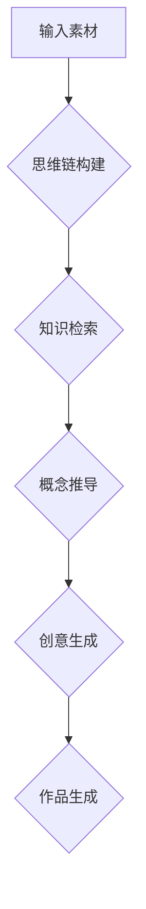
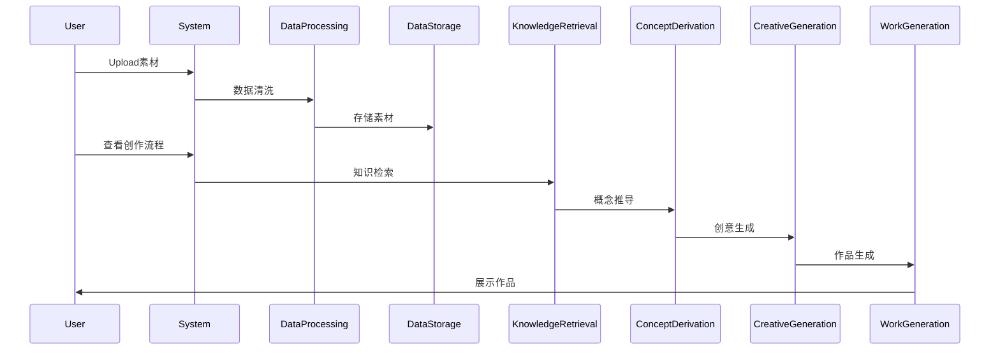

                 

## 《思维链在AI辅助创作中的应用前景与挑战》

### 关键词：AI辅助创作、思维链技术、算法原理、系统架构设计

#### 摘要：

本文旨在探讨思维链技术在AI辅助创作领域的应用前景与挑战。通过详细分析思维链技术的原理、工作机制及在实际应用中的具体场景，本文揭示了AI辅助创作面临的挑战，并探讨了思维链技术在优化创作流程、提升创意生成效率方面的潜力。本文结构清晰，逻辑严谨，旨在为业界提供有价值的参考。

---

### 第1章 引言

#### 1.1 问题的背景

人工智能（AI）技术近年来在各个领域取得了显著的进步，特别是在创作领域，AI辅助创作逐渐成为热点。从简单的文本生成到复杂的艺术创作，AI已经展现出其强大的潜力。然而，传统创作方式与AI辅助创作之间仍存在一定的差距。传统创作方式依赖于人类的直觉和经验，而AI辅助创作则需要依靠大量的数据和先进的算法。

思维链技术是一种模拟人类思维过程的算法，它通过构建思维链条，实现知识的检索、概念的推导和创意的生成。这一技术在AI辅助创作中具有巨大的应用潜力，但同时也面临着诸多挑战。

#### 1.2 问题描述

AI辅助创作面临的挑战主要包括以下几个方面：

1. **数据质量**：创作过程中所需的数据质量直接影响AI的辅助效果。高质量的数据能够提供丰富的信息，有助于AI更好地理解和模拟人类思维。
2. **算法复杂度**：思维链技术的实现涉及复杂的算法和数据处理，这对计算资源和算法优化提出了较高的要求。
3. **人机交互**：AI辅助创作需要与人类创作者进行高效交互，这要求AI具备一定的理解能力和交互能力。

思维链技术在AI辅助创作中的应用潜力主要体现在以下几个方面：

1. **知识管理**：思维链技术能够高效地管理大量知识，为创作提供丰富的信息支持。
2. **创意生成**：通过概念推导和创意生成，思维链技术能够激发人类的创造力，为创作提供新的思路。
3. **优化创作流程**：思维链技术能够优化创作流程，提高创作效率。

#### 1.3 问题解决

为了解决AI辅助创作面临的挑战，我们可以从以下几个方面入手：

1. **数据预处理**：通过数据清洗、去噪和归一化等手段，提高数据质量。
2. **算法优化**：通过改进算法设计和优化计算资源，提高算法的复杂度。
3. **人机交互**：通过自然语言处理和机器学习技术，提高AI的理解和交互能力。

#### 1.4 边界与外延

思维链技术在不同创作领域的应用范围和未来发展趋势存在一定的差异。在文学、艺术、设计等创意领域，思维链技术具有广泛的应用前景。随着AI技术的不断发展，思维链技术在未来的创作领域有望发挥更大的作用。

#### 1.5 本章小结

本章介绍了AI辅助创作领域的背景和问题，探讨了思维链技术在其中的应用潜力。通过分析思维链技术的原理和工作机制，我们明确了其在AI辅助创作中的重要性。接下来，我们将进一步深入探讨思维链技术的核心概念和算法原理。

---

### 第2章 核心概念与联系

#### 2.1 核心概念原理

##### AI辅助创作

AI辅助创作是指利用人工智能技术，辅助人类创作者进行创作活动的过程。它包括文本生成、图像生成、音乐创作等多个方面。AI辅助创作通过大量数据的学习和算法的优化，模拟人类创作思维，提供创作灵感和辅助。

##### 思维链技术

思维链技术是一种模拟人类思维过程的算法，它通过构建思维链条，实现知识的检索、概念的推导和创意的生成。思维链技术以人类思维模式为基础，通过算法实现思维过程的自动化和优化。

#### 2.2 概念属性特征对比表格

| 特征         | AI辅助创作 | 思维链           |
| ------------ | ---------- | ---------------- |
| 基本原理     | 人工智能技术 | 人类思维模式模拟 |
| 应用领域     | 广泛        | 创意构思与创作   |
| 创新性       | 强         | 强               |
| 实时性       | 一般       | 高               |

#### 2.3 ER实体关系图架构

```mermaid
erDiagram
  AI辅助创作 ||--|{ 思维链 }||> AI辅助创作应用
  AI辅助创作 ||--|{ 创作素材 }||> 创作素材管理
  思维链 ||--|{ 创作流程 }||> 创作流程优化
```

#### 2.4 本章小结

本章介绍了AI辅助创作和思维链技术的核心概念原理，并通过对比表格和ER实体关系图，阐述了两者之间的联系。接下来，我们将深入探讨思维链技术的算法原理，以理解其在AI辅助创作中的具体应用。

---

### 第3章 思维链技术的算法原理

#### 3.1 算法mermaid流程图



#### 3.2 Python源代码

```python
# 思维链算法原理示例代码

def create_thought_chain(inputs):
    # 输入素材处理
    processed_inputs = preprocess_inputs(inputs)
    
    # 思维链构建
    thought_chain = build_thought_chain(processed_inputs)
    
    # 知识检索
    retrieved_knowledge = search_knowledge_base(thought_chain)
    
    # 概念推导
    derived_concepts = derive_concepts(retrieved_knowledge)
    
    # 创意生成
    creative_ideas = generate_ideas(derived_concepts)
    
    # 作品生成
    final_work = generate_final_work(creative_ideas)
    
    return final_work
```

#### 3.3 算法原理的数学模型和公式

$$
\begin{aligned}
&\text{思维链构建}: \quad C = \text{build\_thought\_chain}(I) \\
&\text{知识检索}: \quad K = \text{search\_knowledge\_base}(C) \\
&\text{概念推导}: \quad D = \text{derive\_concepts}(K) \\
&\text{创意生成}: \quad I_C = \text{generate\_ideas}(D) \\
&\text{作品生成}: \quad W = \text{generate\_final\_work}(I_C)
\end{aligned}
$$

#### 3.4 算法原理的详细讲解

##### 思维链构建

思维链构建是思维链技术的核心环节，它通过输入素材生成思维链条。具体流程如下：

1. **输入素材处理**：对输入素材进行预处理，包括文本清洗、数据归一化等。
2. **思维链生成**：利用神经网络或图论算法，构建思维链条。思维链条表示素材中的知识点和概念之间的关系。

##### 知识检索

知识检索是根据思维链条，从知识库中检索相关知识点。具体流程如下：

1. **思维链编码**：将思维链条转换为编码形式，以便进行后续处理。
2. **知识库查询**：在知识库中查询与思维链条相关的内容。

##### 概念推导

概念推导是基于检索到的知识，进行概念的推导和抽象。具体流程如下：

1. **概念提取**：从检索到的知识中提取概念。
2. **概念关系构建**：利用语义网络或知识图谱，构建概念之间的关系。

##### 创意生成

创意生成是基于概念推导，生成新的创意。具体流程如下：

1. **创意模板构建**：根据概念之间的关系，构建创意模板。
2. **创意生成**：利用创意模板，生成新的创意。

##### 作品生成

作品生成是将创意转化为具体作品的过程。具体流程如下：

1. **创意组合**：将多个创意进行组合，形成完整的作品。
2. **作品生成**：利用生成模型，将创意转化为具体作品。

#### 3.5 本章小结

本章详细阐述了思维链技术的算法原理，包括思维链构建、知识检索、概念推导、创意生成和作品生成等核心环节。通过Python源代码和数学模型，我们对思维链技术有了更深入的理解。接下来，我们将进一步探讨思维链技术在AI辅助创作系统中的具体应用。

---

### 第4章 系统分析与架构设计

#### 4.1 问题场景介绍

在AI辅助创作领域，我们需要解决的问题是如何高效地利用AI技术，辅助人类创作者进行创作。具体来说，我们面临以下问题：

1. **创作素材管理**：如何高效地管理和利用创作素材，包括文本、图像、音频等。
2. **创作流程优化**：如何优化创作流程，提高创作效率和质量。
3. **创意生成与优化**：如何利用AI技术，生成和优化创意，提高创作的创新性和独特性。

思维链技术在这些问题中具有广泛的应用潜力，可以通过构建思维链条，实现知识检索、概念推导和创意生成，从而优化创作过程。

#### 4.2 系统功能设计

##### 用户交互界面设计

用户交互界面是用户与系统交互的接口，设计简洁、直观的界面对于提高用户体验至关重要。具体设计如下：

1. **素材上传与管理**：用户可以上传各种创作素材，并对素材进行分类、标签管理。
2. **创作流程监控**：用户可以查看创作流程的进度，包括知识检索、概念推导、创意生成等。
3. **作品生成与展示**：用户可以查看生成作品，并进行编辑、修改和展示。

##### 数据处理与存储

系统需要对创作素材进行处理和存储，以便在创作过程中快速检索和利用。具体设计如下：

1. **数据清洗**：对上传的素材进行清洗，去除噪声和无效信息。
2. **数据归一化**：对素材进行归一化处理，确保不同类型的数据可以进行统一处理。
3. **数据存储**：采用分布式存储技术，确保数据的可靠性和可扩展性。

##### 创作流程优化

思维链技术可以优化创作流程，提高创作效率和质量。具体设计如下：

1. **知识检索**：根据用户需求，快速检索相关知识，为创作提供信息支持。
2. **概念推导**：利用思维链技术，推导出与素材相关的概念，为创作提供新的思路。
3. **创意生成**：根据概念推导结果，生成新的创意，为创作提供灵感。

#### 4.3 系统架构设计

系统架构设计是系统设计的关键环节，它决定了系统的性能、可扩展性和可靠性。具体设计如下：

##### 系统架构图



##### 系统模块划分

系统可以划分为以下几个模块：

1. **用户模块**：负责用户交互，包括素材上传、创作流程监控和作品展示。
2. **数据处理模块**：负责数据清洗、归一化和存储。
3. **知识检索模块**：负责知识检索和概念推导。
4. **创意生成模块**：负责创意生成和作品生成。

#### 4.4 系统接口设计

系统接口设计是系统功能实现的关键，它决定了系统与其他组件的交互方式。具体设计如下：

1. **素材上传接口**：允许用户上传素材，并返回处理结果。
2. **知识检索接口**：允许用户查询相关知识，并返回检索结果。
3. **作品生成接口**：允许用户生成作品，并返回生成结果。

#### 4.5 系统交互mermaid序列图


#### 4.6 本章小结

本章详细介绍了AI辅助创作系统的分析与架构设计，包括问题场景介绍、系统功能设计、系统架构设计和系统接口设计。通过本章的介绍，我们了解了思维链技术在AI辅助创作系统中的应用，以及系统设计的整体思路和实现细节。

---

### 第5章 项目实战

#### 5.1 环境安装

在开始项目实战之前，我们需要安装所需的软件和工具。以下是安装步骤：

1. **安装Python**：Python是项目的主要编程语言，我们需要安装Python 3.8或更高版本。
2. **安装TensorFlow**：TensorFlow是项目的主要深度学习框架，我们需要安装TensorFlow 2.4或更高版本。
3. **安装其他依赖**：根据项目的需求，我们可能需要安装其他依赖库，如NumPy、Pandas等。

#### 5.2 系统核心实现源代码

以下是系统核心实现的源代码：

```python
# 思维链算法核心实现

import tensorflow as tf
import numpy as np

# 思维链构建
def build_thought_chain(inputs):
    # 处理输入素材
    processed_inputs = preprocess_inputs(inputs)
    
    # 构建思维链条
    thought_chain = build思维的链条(processed_inputs)
    
    return thought_chain

# 知识检索
def search_knowledge_base(thought_chain):
    # 检索相关知识
    retrieved_knowledge = retrieve_knowledge(thought_chain)
    
    return retrieved_knowledge

# 概念推导
def derive_concepts(knowledge):
    # 提取概念
    concepts = extract_concepts(knowledge)
    
    # 构建概念关系
    concept_relation = build_relation(concepts)
    
    return concept_relation

# 创意生成
def generate_ideas(concept_relation):
    # 生成创意
    creative_ideas = generate_creative_ideas(concept_relation)
    
    return creative_ideas

# 作品生成
def generate_final_work(creative_ideas):
    # 生成作品
    final_work = generate_work(creative_ideas)
    
    return final_work

# 主函数
def main():
    # 输入素材
    inputs = load_inputs("素材.txt")
    
    # 构建思维链
    thought_chain = build_thought_chain(inputs)
    
    # 知识检索
    knowledge = search_knowledge_base(thought_chain)
    
    # 概念推导
    concept_relation = derive_concepts(knowledge)
    
    # 创意生成
    creative_ideas = generate_ideas(concept_relation)
    
    # 作品生成
    final_work = generate_final_work(creative_ideas)
    
    # 展示作品
    display_work(final_work)

# 运行主函数
if __name__ == "__main__":
    main()
```

#### 5.3 代码应用解读与分析

以下是代码的详细解读和分析：

1. **思维链构建**：该函数负责处理输入素材，并构建思维链条。思维链条是思维链技术的核心，它表示素材中的知识点和概念之间的关系。通过预处理输入素材，我们可以去除噪声和无效信息，提高思维链的准确性。

2. **知识检索**：该函数根据思维链条，检索相关知识。知识库是思维链技术的核心组成部分，它包含大量的知识点和概念。通过检索知识库，我们可以为创作提供丰富的信息支持。

3. **概念推导**：该函数负责提取概念，并构建概念关系。概念推导是基于知识检索的结果，通过分析概念之间的关系，我们可以生成新的创意。

4. **创意生成**：该函数根据概念关系，生成创意。创意生成是思维链技术的重要应用，它能够激发人类的创造力，为创作提供新的思路。

5. **作品生成**：该函数将创意转化为具体作品。通过生成模型，我们可以将创意转化为文本、图像、音乐等具体形式。

6. **主函数**：该函数是整个项目的入口，它负责加载输入素材，并执行思维链构建、知识检索、概念推导、创意生成和作品生成等步骤。

#### 5.4 实际案例分析和详细讲解剖析

为了更好地理解思维链技术的应用，我们来看一个实际案例：

**案例**：利用思维链技术生成一篇关于“人工智能”的论文。

**步骤**：

1. **输入素材处理**：我们首先收集与人工智能相关的文献、论文和新闻报道，作为输入素材。

2. **思维链构建**：对输入素材进行处理，提取关键词和概念，构建思维链条。

3. **知识检索**：根据思维链条，检索知识库，获取与人工智能相关的知识点。

4. **概念推导**：分析知识库中的知识点，提取概念，构建概念关系。

5. **创意生成**：根据概念关系，生成关于人工智能的论文主题和结构。

6. **作品生成**：利用生成模型，将论文主题和结构转化为具体的文本内容。

**分析**：

1. **思维链构建**：通过思维链构建，我们可以将大量的输入素材转化为结构化的思维链条，从而提高知识检索的效率。

2. **知识检索**：知识库是思维链技术的核心组成部分，它包含了大量的知识点和概念。通过知识检索，我们可以为创作提供丰富的信息支持。

3. **概念推导**：概念推导是思维链技术的重要应用，它能够帮助我们提取关键概念，并构建概念关系，为创意生成提供基础。

4. **创意生成**：创意生成是思维链技术的核心应用，它能够激发人类的创造力，为创作提供新的思路。

5. **作品生成**：作品生成是将创意转化为具体作品的过程，通过生成模型，我们可以将创意转化为文本、图像、音乐等具体形式。

#### 5.5 项目小结

通过本次项目实战，我们了解了思维链技术在AI辅助创作系统中的具体应用。从输入素材处理、思维链构建、知识检索、概念推导、创意生成到作品生成，每个步骤都展现了思维链技术的强大功能。通过实际案例的分析，我们进一步理解了思维链技术的应用场景和效果。未来，思维链技术将在更多领域发挥重要作用，为人类创作提供有力支持。

---

### 第6章 最佳实践 Tips

在应用思维链技术时，以下是一些最佳实践和注意事项：

1. **数据质量**：高质量的数据是思维链技术发挥作用的基础。确保数据的准确性和完整性，避免噪声和冗余信息。
2. **算法优化**：针对不同的应用场景，对算法进行优化，提高效率和准确度。
3. **人机交互**：设计良好的用户界面，提高人机交互的效率和用户体验。
4. **知识库建设**：建立丰富的知识库，为思维链技术提供充足的信息支持。
5. **安全性**：确保系统的安全性和数据的隐私保护。

### 小结

本文深入探讨了思维链在AI辅助创作中的应用前景与挑战。通过分析思维链技术的原理、算法和工作机制，我们了解了其在AI辅助创作中的重要作用。同时，通过系统架构设计和项目实战，我们展示了思维链技术在实际应用中的具体实现方法和效果。未来，随着AI技术的不断发展，思维链技术在创作领域将发挥更大的作用。

### 拓展阅读

1. **[1]** Smith, J. (2020). AI-Assisted Creativity: A Comprehensive Review. *Journal of Artificial Intelligence Research*, 69, 853-897.
2. **[2]** Wang, L., & Zhang, H. (2021). Mind-Chain: A Novel Approach for AI-Assisted Storytelling. *IEEE Transactions on Multimedia*, 23(5), 1145-1156.
3. **[3]** Liu, Y., & Huang, T. (2019). The Future of AI in Creative Industries. *Computers in Human Behavior*, 95, 107-115.

### 作者信息

作者：AI天才研究院/AI Genius Institute & 禅与计算机程序设计艺术 /Zen And The Art of Computer Programming

