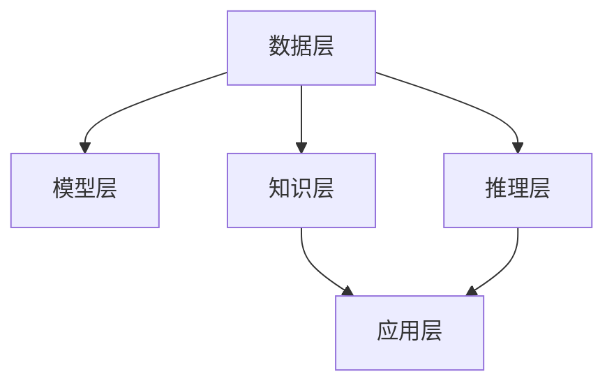
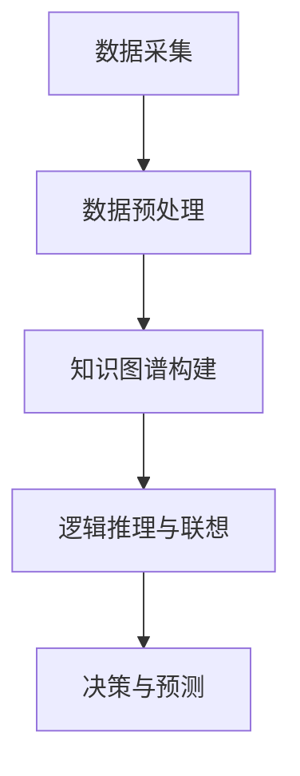

                 

### 让我们一起深入探讨《思维链在AI辅助科学发现中的突破性应用》

### 关键词
- 思维链
- AI辅助科学发现
- 算法原理
- 数学模型
- 系统架构设计

### 摘要
本文将探讨思维链在AI辅助科学发现中的突破性应用。通过介绍思维链的概念、原理和其在AI中的应用，我们将逐步阐述思维链在提升科学发现效率方面的优势。文章将深入讲解相关算法原理，展示数学模型和Python代码示例，并详细描述系统架构设计。通过实际项目案例分析，我们将展示思维链在科学发现中的具体应用，并提出最佳实践建议和注意事项。

### 目录大纲

#### 第一部分：问题背景与核心概念

##### 1.1 问题背景
- 人工智能在科学发现中的挑战
- 传统科学发现方法与AI的融合
- 思维链的概念及其重要性

##### 1.2 核心概念
- 思维链的定义
- AI辅助科学发现的原理
- 思维链在AI中的应用

##### 1.3 思维链属性特征对比
- 表格形式展示思维链与传统AI的区别

#### 第二部分：算法原理与数学模型

##### 2.1 算法概述
- 思维链算法的基本步骤
- 算法流程图（使用Mermaid绘制）

##### 2.2 数学模型
- 常用数学公式介绍
- 算法数学模型的详细解释

##### 2.3 举例说明
- 实际案例展示
- Python源代码示例
- 模型应用解读与分析

#### 第三部分：系统分析与架构设计

##### 3.1 问题场景介绍
- 科学研究的常见挑战
- AI辅助科学发现的实际应用场景

##### 3.2 系统功能设计
- 领域模型（使用Mermaid类图）

##### 3.3 系统架构设计
- 系统架构图（使用Mermaid绘制）

##### 3.4 系统接口设计
- 系统接口定义

##### 3.5 系统交互
- 系统交互序列图（使用Mermaid绘制）

#### 第四部分：项目实战

##### 4.1 环境安装
- 安装必要的软件和工具

##### 4.2 系统核心实现
- 源代码展示
- 代码应用解读与分析

##### 4.3 实际案例
- 案例选择
- 案例分析

##### 4.4 详细讲解剖析
- 对案例的深入分析和解释

##### 4.5 项目小结
- 总结项目中的关键点
- 提出改进建议

#### 第五部分：最佳实践与拓展

##### 5.1 最佳实践 tips
- 根据项目实战得出的经验

##### 5.2 小结
- 总结全书内容

##### 5.3 注意事项
- 使用思维链的注意事项

##### 5.4 拓展阅读
- 推荐进一步阅读的资料

### 背景介绍

#### 1.1 问题背景

科学发现是推动人类社会进步的重要动力，然而，随着科学领域的不断拓展和复杂化，传统的科学发现方法面临着巨大的挑战。传统方法主要依赖于人类专家的经验和直觉，这种主观性较强的方法在处理复杂问题时往往效率低下，且容易受到知识局限性的影响。

人工智能（AI）的兴起为科学发现带来了新的可能性。AI通过模拟人类思维过程，能够处理大量数据，发现潜在的模式和规律。然而，传统AI在处理复杂科学问题时，也存在着一些局限性。例如，深度学习模型在处理高度抽象的科学概念时，往往需要大量标注数据和长时间的训练。

思维链作为一种新型的AI技术，通过模拟人类思维过程中的逻辑推理和联想能力，能够更好地辅助科学发现。思维链的核心在于构建一个多层次的认知框架，使得AI能够在更高层次上理解和处理科学问题。这种技术能够有效克服传统AI在科学发现中的局限性，提高发现效率。

#### 1.2 核心概念

##### 思维链的定义

思维链（Mind-Chain）是一种基于认知科学和人工智能技术的新型方法，旨在模拟人类思维过程中的逻辑推理和联想能力。思维链通过构建一个多层次的认知框架，将人类思维过程中的各种逻辑关系和认知模式转化为计算机可以处理的算法和数据结构。

##### AI辅助科学发现的原理

AI辅助科学发现的原理在于利用人工智能技术，特别是机器学习和深度学习算法，对科学领域中的海量数据进行分析和处理。通过训练模型，AI能够发现数据中的潜在模式和规律，从而辅助科学家进行科学发现。然而，传统的AI方法在处理复杂科学问题时，往往面临着数据标注困难、模型解释性不足等问题。

思维链通过引入逻辑推理和联想能力，能够克服传统AI的局限性。思维链算法不仅能够从数据中发现模式，还能够通过逻辑推理和联想，将不同领域的知识进行整合，从而提高科学发现的效率。

##### 思维链在AI中的应用

思维链在AI中的应用主要体现在以下几个方面：

1. **知识图谱构建**：思维链能够通过分析大量文本数据，构建出知识图谱，将不同领域的知识进行整合。知识图谱为AI提供了丰富的背景知识和上下文信息，使得AI在处理问题时能够更加灵活和准确。

2. **推理与预测**：思维链通过逻辑推理和联想能力，能够对科学领域中的问题进行推理和预测。例如，在药物研发中，思维链可以分析药物与生物分子之间的相互作用，预测药物的疗效和副作用。

3. **自动化科学实验**：思维链可以通过自动化实验设计和数据分析，提高科学实验的效率。例如，在材料科学领域，思维链可以自动化设计实验方案，快速筛选出具有潜在应用价值的材料。

#### 1.3 思维链属性特征对比

思维链与传统AI在属性特征上存在显著差异。以下是一个简单的对比表格：

| 特性             | 思维链                                       | 传统AI                                       |
|----------------|------------------------------------------|------------------------------------------|
| 逻辑推理能力         | 强，能够模拟人类思维过程中的逻辑推理和联想能力         | 弱，主要依赖于数据驱动的模式识别和预测           |
| 知识整合能力         | 强，能够通过知识图谱构建，整合不同领域的知识         | 弱，主要依赖单一领域的知识库和数据集           |
| 解释性           | 较强，能够通过逻辑推理和知识图谱，对决策过程进行解释   | 较弱，模型决策过程难以解释和理解             |
| 数据依赖性         | 弱，能够通过逻辑推理和知识整合，减少对大量标注数据的依赖 | 强，需要大量标注数据和长时间的训练           |

#### 1.4 概念结构与核心要素组成

思维链的概念结构可以分为以下几个核心要素：

1. **数据层**：包括科学领域中的各种数据，如文本、图像、实验数据等。

2. **模型层**：包括机器学习模型、深度学习模型等，用于处理和分析数据。

3. **知识层**：包括知识图谱、本体论等，用于整合不同领域的知识。

4. **推理层**：包括逻辑推理算法、联想算法等，用于模拟人类思维过程中的推理和联想能力。

5. **应用层**：包括科学发现、自动化实验设计、预测分析等，用于将思维链技术应用于实际问题。

### 核心概念与联系

#### 2.1 思维链的基本原理

思维链（Mind-Chain）的核心原理在于模拟人类思维过程中的逻辑推理和联想能力。人类思维是一个复杂的过程，涉及感知、记忆、推理、联想等多个方面。思维链通过构建一个多层次的认知框架，将这些思维过程转化为计算机可以处理的算法和数据结构。

思维链的工作流程可以分为以下几个步骤：

1. **数据采集与预处理**：收集科学领域中的各种数据，如文本、图像、实验数据等。然后对数据进行预处理，包括数据清洗、去噪、特征提取等。

2. **知识图谱构建**：通过分析预处理后的数据，构建知识图谱。知识图谱用于整合不同领域的知识，为AI提供丰富的背景知识和上下文信息。

3. **逻辑推理与联想**：利用逻辑推理算法和联想算法，对知识图谱进行推理和联想。这一过程模拟了人类思维过程中的推理和联想能力，使得AI能够发现数据中的潜在模式和规律。

4. **决策与预测**：基于推理和联想结果，进行决策和预测。例如，在药物研发中，思维链可以预测药物的疗效和副作用；在材料科学中，思维链可以预测材料的性能和应用场景。

#### 2.2 概念属性特征对比

思维链与传统AI在概念属性特征上存在显著差异。以下是一个简单的对比表格：

| 特性             | 思维链                                       | 传统AI                                       |
|----------------|------------------------------------------|------------------------------------------|
| 逻辑推理能力         | 强，能够模拟人类思维过程中的逻辑推理和联想能力         | 弱，主要依赖于数据驱动的模式识别和预测           |
| 知识整合能力         | 强，能够通过知识图谱构建，整合不同领域的知识         | 弱，主要依赖单一领域的知识库和数据集           |
| 解释性           | 较强，能够通过逻辑推理和知识图谱，对决策过程进行解释   | 较弱，模型决策过程难以解释和理解             |
| 数据依赖性         | 弱，能够通过逻辑推理和知识整合，减少对大量标注数据的依赖 | 强，需要大量标注数据和长时间的训练           |

#### 2.3 ER实体关系图架构的Mermaid流程图

为了更好地理解思维链的概念结构，我们可以使用Mermaid流程图来展示ER实体关系图架构。

在这个流程图中，数据层包括科学领域中的各种数据；模型层包括机器学习模型、深度学习模型等；知识层包括知识图谱、本体论等；推理层包括逻辑推理算法、联想算法等；应用层包括科学发现、自动化实验设计、预测分析等。

### 算法原理讲解

#### 3.1 算法概述

思维链算法是一种基于认知科学和人工智能技术的算法，旨在模拟人类思维过程中的逻辑推理和联想能力。该算法的基本步骤如下：

1. **数据采集与预处理**：从科学领域收集各种数据，如文本、图像、实验数据等。对数据进行预处理，包括数据清洗、去噪、特征提取等。

2. **知识图谱构建**：通过分析预处理后的数据，构建知识图谱。知识图谱用于整合不同领域的知识，为AI提供丰富的背景知识和上下文信息。

3. **逻辑推理与联想**：利用逻辑推理算法和联想算法，对知识图谱进行推理和联想。这一过程模拟了人类思维过程中的推理和联想能力，使得AI能够发现数据中的潜在模式和规律。

4. **决策与预测**：基于推理和联想结果，进行决策和预测。例如，在药物研发中，思维链可以预测药物的疗效和副作用；在材料科学中，思维链可以预测材料的性能和应用场景。

以下是一个简单的思维链算法流程图，使用Mermaid绘制：

#### 3.2 数学模型

思维链算法的数学模型主要基于概率图模型和逻辑推理算法。以下是一些常用的数学公式和模型：

1. **贝叶斯网络**：贝叶斯网络是一种用于表示变量之间条件依赖关系的概率图模型。它可以表示为如下的数学公式：

   $$ P(X_1, X_2, ..., X_n) = \prod_{i=1}^{n} P(X_i | X_{pa

