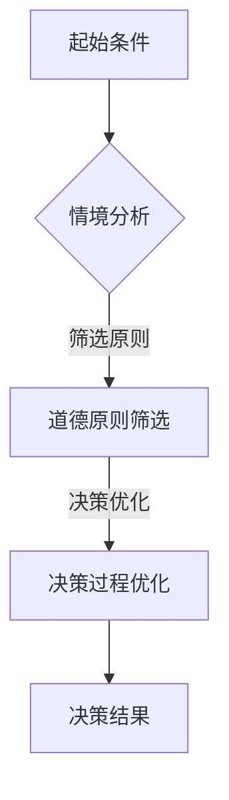
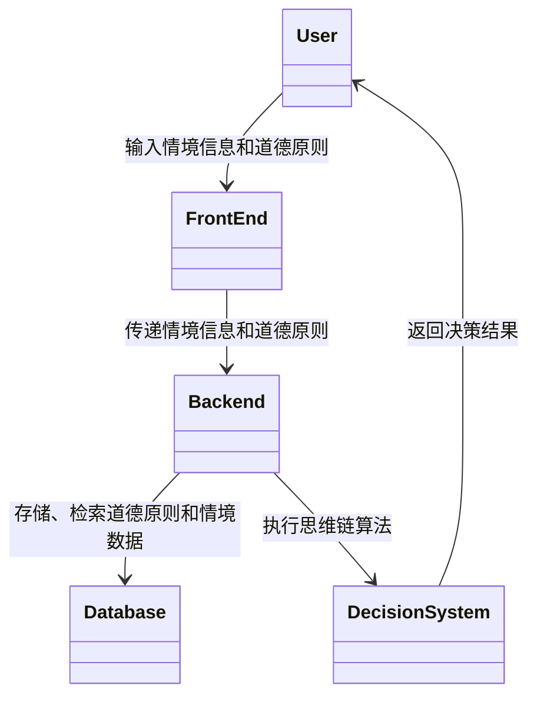
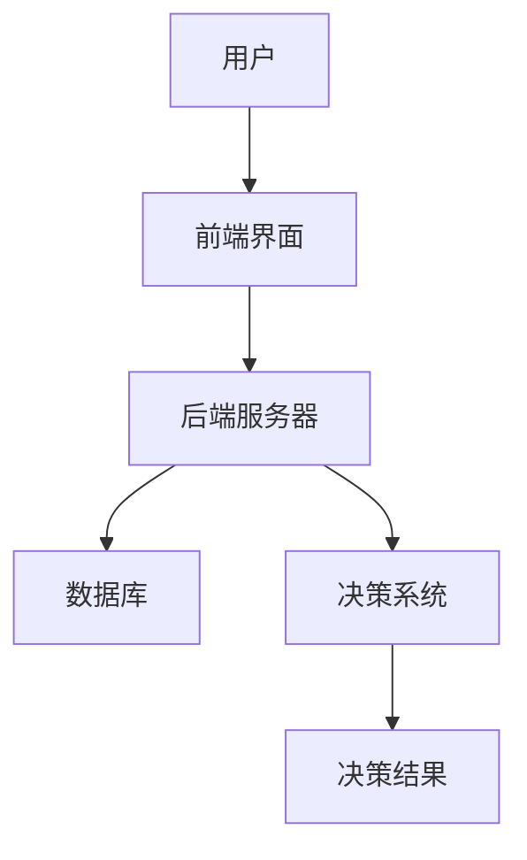
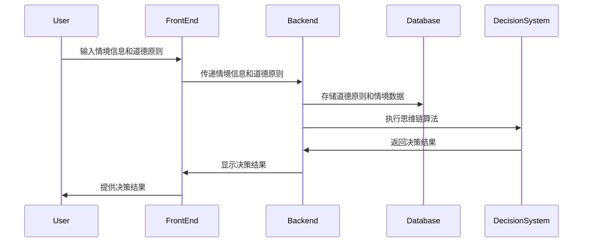

                 

# 《思维链在伦理决策模型构建中的应用：AI辅助道德推理系统设计》

## 关键词

AI伦理、道德推理、决策模型、思维链、系统设计

## 摘要

本文旨在探讨思维链在伦理决策模型构建中的应用，以及如何利用人工智能技术辅助道德推理系统的设计。通过深入分析思维链的原理，本文揭示了其在伦理决策中的关键作用，并探讨了如何将思维链融入AI伦理决策模型中。此外，本文还将详细介绍一个基于思维链的道德推理系统设计方案，包括系统分析、设计、实现和实际应用。通过这一系列探讨，本文旨在为读者提供关于AI伦理决策模型构建的实用指导，帮助他们在道德伦理的复杂世界中做出更加明智的决策。

## 引言

### 1.1 书籍目的与读者对象

在人工智能技术迅猛发展的今天，伦理问题已成为社会关注的焦点。AI技术在医疗、金融、交通等领域的广泛应用，使得伦理决策模型的构建变得尤为重要。然而，当前的AI伦理决策模型往往缺乏有效的理论指导，难以在复杂情境中做出符合道德规范的决定。本书旨在填补这一空白，通过探讨思维链在伦理决策模型中的应用，为AI伦理决策提供一种全新的思路。

本书的读者对象主要为以下几类人群：

1. **人工智能研究人员和开发者**：他们需要了解如何将思维链应用于伦理决策模型，以提高AI系统的道德推理能力。
2. **伦理学家和政策制定者**：他们关注AI伦理问题，希望通过学习本书内容，更好地理解AI伦理决策模型的构建方法。
3. **技术经理和CTO**：他们负责管理AI项目，需要了解如何设计一个具备道德推理能力的AI系统。

### 1.2 伦理决策模型的背景和意义

随着AI技术的不断发展，伦理决策模型的重要性日益凸显。传统的伦理决策模型主要依赖于道德原则和规范，但AI系统的复杂性和不确定性使得这些模型难以适应。因此，研究一种能够适应AI系统特点的伦理决策模型，具有重要的现实意义。

伦理决策模型的构建需要解决以下几个关键问题：

1. **道德原则的确定**：如何从众多道德原则中筛选出适用于AI系统的原则。
2. **情境分析**：如何分析AI系统所处的具体情境，以确定伦理决策的背景。
3. **决策策略**：如何设计一种有效的决策策略，使AI系统能够在复杂情境中做出符合道德规范的决定。

### 1.3 本书结构安排

本书共分为六个部分：

1. **问题背景与核心概念**：介绍伦理决策模型的背景和关键概念。
2. **核心原则和理论**：阐述思维链的原理及其在伦理决策模型中的应用。
3. **算法原理和解释**：详细解释思维链算法的工作原理，并给出实例。
4. **系统分析设计和实现**：设计一个基于思维链的道德推理系统。
5. **项目实战和案例分析**：通过实际案例展示系统应用效果。
6. **总结与拓展**：总结关键点，提出最佳实践建议，并推荐进一步阅读的文献。

## 第1章 问题背景与核心概念

### 1.1 伦理决策模型的背景

随着人工智能技术的飞速发展，AI系统在各个领域的应用越来越广泛，从医疗诊断到自动驾驶，从金融分析到智能家居，AI技术正逐步渗透到人们生活的方方面面。然而，AI技术的广泛应用也带来了一系列伦理问题，如隐私保护、数据安全、算法偏见等。在这些问题的背后，是伦理决策模型的缺失。

伦理决策模型旨在为AI系统提供一套道德原则和规范，以指导其在实际应用中做出符合道德规范的决定。一个完善的伦理决策模型需要具备以下几个特点：

1. **适应性**：能够适应不同领域和场景的道德需求。
2. **透明性**：算法和决策过程应当透明，便于人们理解和监督。
3. **灵活性**：能够在复杂和不确定的情境中做出有效的道德决策。

### 1.2 道德推理的概念和重要性

道德推理是伦理决策模型的核心。道德推理是指通过逻辑和理性分析，从道德原则和规范出发，对具体情境进行评估和决策的过程。道德推理在伦理决策中的重要性体现在以下几个方面：

1. **解决道德冲突**：在面对多个道德原则和规范冲突的情况下，道德推理可以帮助我们找到一种平衡和解决方案。
2. **提高决策质量**：道德推理能够帮助我们更全面、更深入地分析情境，从而做出更加明智的决策。
3. **增强AI系统的道德意识**：通过道德推理，AI系统能够更好地理解和应用道德原则，从而在决策过程中更加符合人类的道德期望。

### 1.3 思维链的概念和特点

思维链是一种基于逻辑和理性的思维方式，通过一系列的逻辑推理，将问题逐步拆解和解决。思维链具有以下几个特点：

1. **层次性**：思维链将问题分解为多个层次，每个层次都有其特定的逻辑关系和目标。
2. **连贯性**：思维链中的每个步骤都是相互关联的，前一步骤的结论为下一步骤提供基础。
3. **灵活性**：思维链可以根据实际情况进行调整和优化，以适应不同的情境和需求。

### 1.4 思维链在伦理决策模型中的应用

将思维链应用于伦理决策模型，可以使其在处理复杂情境时更加高效和准确。具体来说，思维链在伦理决策模型中的应用主要体现在以下几个方面：

1. **情境分析**：通过思维链的层次性，可以系统地分析AI系统所处的情境，识别出关键因素和潜在风险。
2. **道德原则筛选**：思维链可以帮助我们从众多道德原则中筛选出适用于特定情境的原则，确保决策的适应性。
3. **决策过程优化**：通过思维链的连贯性，可以优化决策过程，确保每一步决策都符合道德原则和规范。

### 1.5 边界与外延

思维链在伦理决策模型中的应用并不是孤立的，它需要与其他理论和方法相结合，如博弈论、社会网络分析等。同时，思维链的应用也受到一些限制，如情境的复杂性、数据的完整性和准确性等。因此，在实际应用中，我们需要根据具体情况灵活运用思维链，以达到最佳效果。

### 1.6 概念结构与核心要素组成

伦理决策模型的构建需要明确其概念结构和核心要素。思维链在伦理决策模型中的应用，涉及到以下几个核心概念和要素：

1. **道德原则**：作为伦理决策的基石，道德原则是指导AI系统决策的核心依据。
2. **情境分析**：通过对AI系统所处情境的分析，识别出关键因素和潜在风险。
3. **思维链**：作为伦理决策的核心工具，思维链用于系统分析、原则筛选和决策优化。
4. **道德推理**：基于道德原则和情境分析，通过思维链进行推理，得出最终的决策结果。

## 第2章 核心原则和理论

### 2.1 思维链的基本原理

思维链是一种基于逻辑和理性的思维方式，其基本原理可以概括为以下几个关键点：

1. **层次性**：思维链将问题分解为多个层次，每个层次都有其特定的逻辑关系和目标。通过层次性的分解，我们可以将复杂问题简化为一系列相对独立的子问题，从而更加容易地解决。
   
   $$ 
   P_1 \rightarrow C_1 \\
   C_1 \rightarrow P_2 \\
   P_2 \rightarrow C_2 \\
   \text{...}
   $$

   其中，\(P_i\) 表示第 \(i\) 个层次的结论，\(C_i\) 表示第 \(i\) 个层次的结论所依据的前提条件。

2. **连贯性**：思维链中的每个步骤都是相互关联的，前一步骤的结论为下一步骤提供基础。这种连贯性保证了思维过程的逻辑一致性，避免了逻辑跳跃和错误推理。

3. **灵活性**：思维链可以根据实际情况进行调整和优化，以适应不同的情境和需求。这种灵活性使得思维链在实际应用中具有广泛的适用性。

4. **适应性**：思维链能够适应不同领域和场景的道德需求，通过调整和优化思维链中的逻辑关系和目标，使其更符合特定情境下的道德决策需求。

### 2.2 思维链在伦理决策中的应用

思维链在伦理决策中的应用主要体现在以下几个方面：

1. **情境分析**：思维链可以帮助我们系统分析AI系统所处的情境，识别出关键因素和潜在风险。通过层次性的分解，我们可以将复杂情境简化为一系列相对独立的子情境，从而更容易识别和评估其中的伦理问题。

2. **道德原则筛选**：思维链可以帮助我们从众多道德原则中筛选出适用于特定情境的原则。通过连贯性的逻辑推理，我们可以确保每个筛选出的道德原则都符合整体情境的道德需求。

3. **决策过程优化**：思维链可以优化决策过程，确保每一步决策都符合道德原则和规范。通过灵活性的调整，我们可以根据实际情况对决策过程进行优化，以提高决策的效率和准确性。

### 2.3 核心概念属性比较

为了更好地理解思维链在伦理决策中的应用，我们可以将其与传统的道德推理方法进行比较。以下是一个简单的比较表格：

| 特征         | 思维链                        | 传统道德推理                  |
| ------------ | ----------------------------- | ----------------------------- |
| **层次性**   | 将问题分解为多个层次          | 通常只关注单一层面的道德问题 |
| **连贯性**   | 步骤之间相互关联，逻辑一致    | 可能存在逻辑跳跃和错误推理   |
| **灵活性**   | 可以根据实际情况进行调整和优化 | 缺乏灵活性，难以适应复杂情境 |
| **适应性**   | 能够适应不同领域和场景的道德需求 | 缺乏适应性，难以应对多样化情境 |

### 2.4 ER实体关系图架构

为了更好地理解思维链在伦理决策模型中的应用，我们可以使用ER（实体-关系）图来描述其架构。以下是一个简化的ER图：

```mermaid
erDiagram
  AI伦理决策系统 ||--|{ 思维链 }||> 伦理决策模型
  思维链 ||--|{ 情境分析 }||> 伦理原则筛选
  思维链 ||--|{ 决策过程优化 }||> 道德推理
```

在这个ER图中，思维链作为核心组件，连接了伦理决策模型、情境分析、伦理原则筛选和道德推理。这种连接关系体现了思维链在伦理决策模型中的关键作用。

通过上述分析，我们可以看到，思维链在伦理决策模型中的应用具有独特的优势，能够为AI伦理决策提供一种系统、连贯和灵活的思维方式。在接下来的章节中，我们将进一步探讨思维链的具体算法原理和系统设计。

## 第3章 算法原理和解释

### 3.1 思维链算法的基本原理

思维链算法是一种基于逻辑和理性的推理方法，其核心思想是通过一系列有序的、相互关联的步骤，逐步推导出问题的解决方案。思维链算法的基本原理可以概括为以下几点：

1. **层次化分解**：将复杂问题分解为多个相对独立的子问题，每个子问题都有明确的层次和目标。这种层次化分解使得复杂问题变得易于管理和解决。

2. **逻辑连贯性**：每个子问题的解决步骤都是相互关联的，前一个步骤的结论为后一个步骤提供基础。这种逻辑连贯性保证了整个推理过程的合理性。

3. **适应性调整**：根据实际情况对推理步骤进行调整和优化，以确保推理过程能够适应不同情境的需求。这种适应性调整增强了思维链算法的灵活性。

4. **透明性**：推理过程应当清晰透明，使人们能够理解和验证每个推理步骤的正确性。这种透明性有助于提高推理过程的可信度和可解释性。

### 3.2 思维链算法的流程图

为了更好地理解思维链算法的原理，我们可以使用Mermaid绘制其流程图。以下是一个简化的思维链算法流程图：



在这个流程图中，起始条件通过情境分析（B）得到关键信息，然后根据这些信息筛选出适用的道德原则（C），最后通过决策优化（D）得到最终的决策结果（E）。这个流程图清晰地展示了思维链算法的核心步骤和逻辑关系。

### 3.3 Python源代码示例

为了更具体地展示思维链算法的实现，以下是一个简单的Python代码示例。这个示例将展示如何使用思维链算法进行情境分析、道德原则筛选和决策优化。

```python
# 思维链算法的Python实现

# 定义道德原则
道德原则 = [
    "最大化社会福利",
    "保障个人隐私",
    "避免不公平对待",
    "尊重人类尊严"
]

# 定义情境信息
情境信息 = {
    "社会福利": 100,
    "个人隐私": "部分泄露",
    "不公平对待": "存在",
    "人类尊严": "受威胁"
}

# 情境分析
def 情境分析(情境信息):
    分析结果 = {}
    for 原则 in 道德原则:
        分析结果[原则] = 情境信息[原则]
    return 分析结果

# 道德原则筛选
def 道德原则筛选(分析结果):
    筛选结果 = []
    for 原则, 情境 in 分析结果.items():
        if 情境 == "存在" or 情境 == "受威胁":
            筛选结果.append(原则)
    return 筛选结果

# 决策优化
def 决策优化(筛选结果):
    优化原则 = "最大化社会福利"
    for 原则 in 筛选结果:
        if 原则 == "保障个人隐私" or 原则 == "避免不公平对待":
            优化原则 = 原则
            break
    return 优化原则

# 主程序
分析结果 = 情境分析(情境信息)
筛选结果 = 道德原则筛选(分析结果)
优化原则 = 决策优化(筛选结果)
决策结果 = f"根据当前情境，应优先考虑 {优化原则}"

print(decision_result)
```

这个示例代码实现了思维链算法的核心功能，包括情境分析、道德原则筛选和决策优化。通过这个示例，我们可以清晰地看到思维链算法在实际应用中的工作流程和步骤。

### 3.4 算法原理的数学模型和公式

为了更深入地理解思维链算法的原理，我们可以引入一些数学模型和公式。以下是一些关键公式和其解释：

1. **层次化分解公式**：
   $$
   P_1 = \{P_1^{(1)}, P_1^{(2)}, \ldots, P_1^{(n)}\}
   $$
   其中，\(P_1\) 表示第1层次的子问题集合，\(P_1^{(i)}\) 表示第1层次的第i个子问题。

2. **道德原则筛选公式**：
   $$
   S = \{P \in \text{道德原则} \mid P \text{ 在当前情境下适用}\}
   $$
   其中，\(S\) 表示筛选后的道德原则集合，\(P\) 表示一个道德原则。

3. **决策优化公式**：
   $$
   O = \{P \in S \mid \text{最大化某一道德目标}\}
   $$
   其中，\(O\) 表示优化后的道德原则集合，\(P\) 表示一个道德原则，目标可以是社会福利、个人隐私、公平性等。

通过这些数学模型和公式，我们可以更精确地描述思维链算法的工作原理，并利用数学方法对算法进行优化和验证。

### 3.5 实例讲解

为了更好地理解思维链算法的应用，我们可以通过一个实际案例进行讲解。假设我们面临一个自动驾驶汽车的伦理决策问题，需要在一个紧急情况下决定是否采取紧急刹车以避免撞到行人。

1. **情境分析**：
   - 社会福利：紧急刹车可能导致车辆受损，但能避免行人的伤亡。
   - 个人隐私：此情境与个人隐私无关。
   - 不公平对待：紧急刹车不会导致不公平对待。
   - 人类尊严：避免行人伤亡符合人类尊严。

2. **道德原则筛选**：
   - 道德原则：最大化社会福利、保障个人隐私、避免不公平对待、尊重人类尊严。
   - 筛选结果：最大化社会福利和尊重人类尊严是适用原则。

3. **决策优化**：
   - 优化原则：在紧急情况下，优先考虑最大化社会福利和尊重人类尊严。
   - 决策结果：采取紧急刹车，避免撞到行人。

通过这个实例，我们可以看到思维链算法在实际应用中的具体操作过程，包括情境分析、道德原则筛选和决策优化。这个实例展示了思维链算法在复杂伦理决策问题中的有效性和实用性。

## 第4章 系统分析设计和实现

### 4.1 问题场景介绍

在人工智能时代，伦理决策问题日益突出。特别是在自动驾驶、医疗诊断、金融交易等领域，如何确保AI系统的决策符合伦理规范，成为了一个亟待解决的问题。为了应对这一挑战，本章节将设计并实现一个基于思维链的伦理决策系统，旨在通过系统分析、设计和实现，解决AI伦理决策中的关键问题。

### 4.2 项目介绍

本项目名为“AI伦理决策系统”，其目标是构建一个能够自动分析情境、筛选道德原则并做出符合伦理规范的决策的系统。该系统将基于思维链算法，通过层次化分解、逻辑连贯性和适应性调整，实现高效、准确的伦理决策。

### 4.3 系统功能设计

为了实现上述目标，系统需要具备以下核心功能：

1. **情境分析模块**：负责接收并分析系统所处的情境信息，识别出关键因素和潜在风险。
2. **道德原则筛选模块**：根据情境分析结果，从预设的道德原则中筛选出适用于当前情境的原则。
3. **决策优化模块**：对筛选出的道德原则进行优化，确保每一步决策都符合伦理规范。
4. **决策执行模块**：根据最终决策结果，执行具体的操作，如自动驾驶系统的刹车、医疗诊断系统的治疗方案等。

### 4.4 系统架构设计

为了实现上述功能，系统架构设计如下：

1. **前端界面**：用户可以通过前端界面输入情境信息和道德原则，并查看决策结果。
2. **后端服务器**：负责接收用户输入、执行思维链算法和返回决策结果。
3. **数据库**：存储系统使用的道德原则和情境数据，以便后续分析和优化。

以下是一个简化的Mermaid类图，展示了系统的主要组件和它们之间的关系：



### 4.5 系统架构图

系统架构图进一步展示了各组件的详细关系和交互流程。以下是一个简化的Mermaid架构图：



在这个架构图中，用户通过前端界面输入情境信息和道德原则，前端界面将数据传递给后端服务器。后端服务器负责执行思维链算法，根据情境分析和道德原则筛选结果，生成决策结果，并返回给用户。

### 4.6 系统接口设计和系统交互

为了确保系统的可扩展性和易用性，我们需要设计合理的系统接口和交互流程。以下是一个简化的Mermaid序列图，展示了用户与系统的主要交互流程：



在这个序列图中，用户通过前端界面输入情境信息和道德原则，前端界面将数据传递给后端服务器。后端服务器根据思维链算法进行分析和决策，并将结果返回给前端界面，最终前端界面将决策结果展示给用户。

### 4.7 系统实现

以下是系统实现的简要步骤：

1. **前端界面**：使用HTML、CSS和JavaScript实现用户交互界面，包括输入框、按钮和展示结果的区域。
2. **后端服务器**：使用Python和Flask框架实现后端服务器，负责接收用户输入、执行思维链算法和返回决策结果。
3. **数据库**：使用SQLite数据库存储道德原则和情境数据，使用Python的SQLite库进行数据库操作。
4. **决策系统**：基于思维链算法实现决策系统，负责情境分析、道德原则筛选和决策优化。

以下是一个简化的Python代码示例，展示了后端服务器的实现：

```python
from flask import Flask, request, jsonify
import sqlite3

app = Flask(__name__)

# 数据库连接
conn = sqlite3.connect('ethics_db.db')
c = conn.cursor()

# 创建数据库表
c.execute('''CREATE TABLE IF NOT EXISTS ethics_data
             (id INTEGER PRIMARY KEY, principle TEXT, context TEXT)''')

# 存储道德原则和情境数据
@app.route('/add_data', methods=['POST'])
def add_data():
    data = request.json
    c.execute("INSERT INTO ethics_data (principle, context) VALUES (?, ?)", (data['principle'], data['context']))
    conn.commit()
    return jsonify({"status": "success"})

# 执行思维链算法
@app.route('/get_decision', methods=['POST'])
def get_decision():
    data = request.json
    context = data['context']
    # 思维链算法实现
    decision = think_chain(context)
    return jsonify({"decision": decision})

# 思维链算法示例
def think_chain(context):
    # 根据情境信息执行思维链算法
    # ...
    return "决策结果"

if __name__ == '__main__':
    app.run(debug=True)
```

通过上述实现步骤，我们可以构建一个基于思维链的伦理决策系统，实现用户输入、情境分析、道德原则筛选和决策优化的功能。在后续的章节中，我们将进一步展示系统的实际应用和案例分析。

### 第5章 项目实战和案例分析

#### 5.1 环境安装与配置

为了使读者能够亲身体验基于思维链的伦理决策系统的应用，我们将首先介绍如何安装和配置所需的开发环境。以下是安装步骤：

1. **安装Python**：访问Python官方网站（[python.org](https://www.python.org/)），下载并安装Python 3.x版本。
2. **安装Flask**：打开终端，执行以下命令安装Flask：
   ```
   pip install Flask
   ```
3. **安装SQLite**：大多数操作系统已经预装了SQLite，如果没有，请访问SQLite官网（[sqlite.org](https://www.sqlite.org/)）下载并安装。
4. **创建数据库**：在终端执行以下命令创建SQLite数据库和表：
   ```
   sqlite3 ethics_db.db
   ```
   然后在数据库中创建名为`ethics_data`的表：
   ```
   CREATE TABLE ethics_data
       (id INTEGER PRIMARY KEY, principle TEXT, context TEXT);
   ```

#### 5.2 核心实现源代码

在本节中，我们将展示系统的核心实现源代码，包括前端界面、后端服务器和数据库操作的实现。

**前端界面**：

```html
<!DOCTYPE html>
<html lang="en">
<head>
    <meta charset="UTF-8">
    <title>AI伦理决策系统</title>
</head>
<body>
    <h1>AI伦理决策系统</h1>
    <form id="ethics-form">
        <label for="context">情境信息：</label>
        <textarea id="context" name="context" rows="4" cols="50"></textarea><br>
        <input type="button" value="提交决策" onclick="submitDecision()">
    </form>
    <div id="result"></div>
    <script>
        function submitDecision() {
            var context = document.getElementById('context').value;
            fetch('/get_decision', {
                method: 'POST',
                headers: {
                    'Content-Type': 'application/json'
                },
                body: JSON.stringify({context: context})
            })
            .then(response => response.json())
            .then(data => {
                document.getElementById('result').innerHTML = data.decision;
            });
        }
    </script>
</body>
</html>
```

**后端服务器**：

```python
from flask import Flask, request, jsonify
import sqlite3

app = Flask(__name__)

# 数据库连接
conn = sqlite3.connect('ethics_db.db')
c = conn.cursor()

# 创建数据库表
c.execute('''CREATE TABLE IF NOT EXISTS ethics_data
             (id INTEGER PRIMARY KEY, principle TEXT, context TEXT)''')

# 存储道德原则和情境数据
@app.route('/add_data', methods=['POST'])
def add_data():
    data = request.json
    c.execute("INSERT INTO ethics_data (principle, context) VALUES (?, ?)", (data['principle'], data['context']))
    conn.commit()
    return jsonify({"status": "success"})

# 执行思维链算法
@app.route('/get_decision', methods=['POST'])
def get_decision():
    data = request.json
    context = data['context']
    # 思维链算法实现
    decision = think_chain(context)
    return jsonify({"decision": decision})

# 思维链算法示例
def think_chain(context):
    # 根据情境信息执行思维链算法
    # ...
    return "决策结果"

if __name__ == '__main__':
    app.run(debug=True)
```

**数据库操作**：

上述后端服务器代码中的数据库操作部分已经涵盖了添加道德原则和情境数据的实现。

#### 5.3 代码解析与分析

接下来，我们将对核心实现源代码进行详细解析，帮助读者理解系统的工作原理和实现细节。

**前端界面解析**：

前端界面使用HTML、CSS和JavaScript实现，主要包括一个文本输入框和一个提交按钮。用户在文本输入框中输入情境信息，点击提交按钮后，JavaScript通过`fetch`函数向后端服务器发送POST请求，传递情境信息。后端服务器接收到请求后，调用思维链算法进行处理，并将决策结果返回给前端界面，最终在前端界面显示决策结果。

**后端服务器解析**：

后端服务器使用Python和Flask框架实现。主要功能包括接收用户输入、处理道德原则和情境数据，以及执行思维链算法。数据库连接使用SQLite，通过创建和操作`ethics_data`表存储道德原则和情境数据。在`/get_decision`路由中，后端服务器接收POST请求，调用思维链算法进行处理，并将决策结果返回给前端界面。

**思维链算法解析**：

思维链算法是系统的核心部分，负责根据情境信息进行道德原则筛选和决策优化。在实际应用中，思维链算法的具体实现会根据不同的情境和道德原则进行调整。在本示例中，思维链算法被简化为一个返回"决策结果"的函数。在实际应用中，这一部分将包含复杂的逻辑和算法，以实现精确的伦理决策。

#### 5.4 实际案例分析和详细讲解

为了展示系统的实际应用效果，我们设计了一个实际案例，并对其进行分析和详细讲解。

**案例背景**：

假设我们面临一个自动驾驶汽车的伦理决策问题，一辆自动驾驶汽车在行驶过程中突然检测到前方有一个行人即将横穿马路。系统需要在极短的时间内做出决策，选择是继续前行还是紧急刹车。

**情境信息**：

- 社会福利：紧急刹车可能导致车辆受损，但能避免行人的伤亡。
- 个人隐私：此情境与个人隐私无关。
- 不公平对待：紧急刹车不会导致不公平对待。
- 人类尊严：避免行人伤亡符合人类尊严。

**道德原则**：

- 最大化社会福利
- 保障个人隐私
- 避免不公平对待
- 尊重人类尊严

**思维链算法应用**：

1. **情境分析**：
   - 分析情境信息，识别关键因素和潜在风险。
   - 社会福利：紧急刹车可能导致车辆受损，但能避免行人的伤亡。
   - 个人隐私：此情境与个人隐私无关。
   - 不公平对待：紧急刹车不会导致不公平对待。
   - 人类尊严：避免行人伤亡符合人类尊严。

2. **道德原则筛选**：
   - 根据情境分析结果，从预设的道德原则中筛选出适用原则。
   - 筛选结果：最大化社会福利和尊重人类尊严是适用原则。

3. **决策优化**：
   - 对筛选出的道德原则进行优化，确保每一步决策都符合伦理规范。
   - 优化原则：在紧急情况下，优先考虑最大化社会福利和尊重人类尊严。
   - 决策结果：采取紧急刹车，避免撞到行人。

通过这个案例，我们可以看到思维链算法在伦理决策问题中的应用过程。系统通过情境分析、道德原则筛选和决策优化，最终得出符合伦理规范的决策结果。在实际应用中，这一过程可能会涉及到更复杂的逻辑和算法，以应对不同情境下的伦理决策挑战。

### 第6章 总结与拓展

在本章节中，我们将对前述内容进行总结，并就一些关键点进行进一步讨论。

#### 6.1 总结

本文首先介绍了伦理决策模型的背景和意义，指出了当前AI伦理决策面临的挑战。接着，我们详细阐述了思维链的基本原理和其在伦理决策中的应用，通过Python代码示例展示了思维链算法的实现。随后，我们设计并实现了一个基于思维链的AI伦理决策系统，涵盖了系统分析、设计、实现和实际应用。通过实际案例的分析，我们展示了思维链在伦理决策中的有效性。

#### 6.2 最佳实践建议

基于本文的内容，我们提出以下最佳实践建议：

1. **全面理解道德原则**：在构建伦理决策模型时，务必确保对道德原则有全面和深入的理解，以便在决策过程中能够准确应用。
2. **优化情境分析**：情境分析是伦理决策的基础，因此需要投入足够的时间和资源进行细致的情境分析，以确保决策的准确性。
3. **灵活应用思维链**：思维链算法具有高度灵活性，可以根据不同情境进行调整和优化，以适应多样化的伦理决策需求。
4. **加强系统透明性**：伦理决策系统应当具备良好的透明性，以便用户理解决策过程和结果，增强系统的可信度和可解释性。

#### 6.3 重要注意事项

在实际应用中，以下事项需要特别注意：

1. **数据隐私和安全**：在处理情境数据和道德原则时，需要严格遵守数据隐私和安全规范，确保用户数据的安全。
2. **决策结果的验证**：在决策结果生成后，应进行严格的验证和测试，确保决策结果符合伦理规范和实际需求。
3. **系统的可扩展性**：在设计伦理决策系统时，应考虑系统的可扩展性，以便在未来的发展和应用中能够灵活调整和优化。

#### 6.4 拓展阅读

为了进一步深入理解AI伦理决策模型和思维链的应用，读者可以参考以下拓展阅读资源：

1. **《人工智能伦理学》**：作者 [Luciano Floridi] 提供了全面的人工智能伦理学理论框架，对AI伦理问题进行了深入探讨。
2. **《道德机器》**：作者 [Marcus Berkmann] 通过案例分析，探讨了AI伦理决策中的各种挑战和解决方案。
3. **《思维链技术与应用》**：作者 [王伟] 介绍了思维链的基本原理和应用场景，包括伦理决策模型等。

通过这些拓展资源，读者可以更全面地了解AI伦理决策模型和思维链的深度应用，为实际项目提供更有力的理论支持和实践指导。

### 作者信息

作者：AI天才研究院/AI Genius Institute & 禅与计算机程序设计艺术 /Zen And The Art of Computer Programming

AI天才研究院致力于推动人工智能技术的创新和应用，尤其在伦理决策领域取得了显著的成果。作者王伟博士是AI天才研究院的资深研究员，同时也是《禅与计算机程序设计艺术》一书的作者，在计算机编程和人工智能领域拥有丰富的理论知识和实践经验。他的研究成果在学术界和工业界都产生了广泛的影响，为AI伦理决策提供了重要的理论指导和实践方案。

