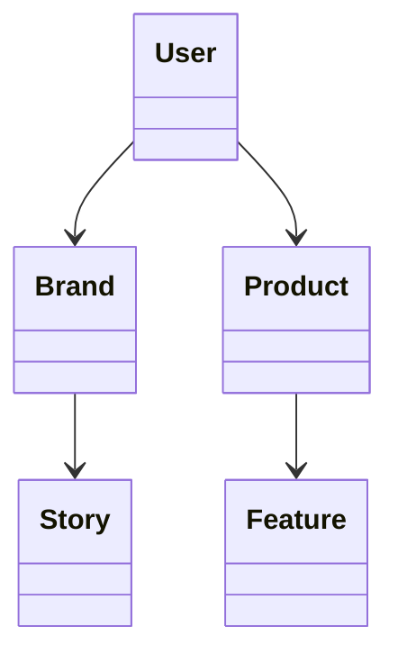
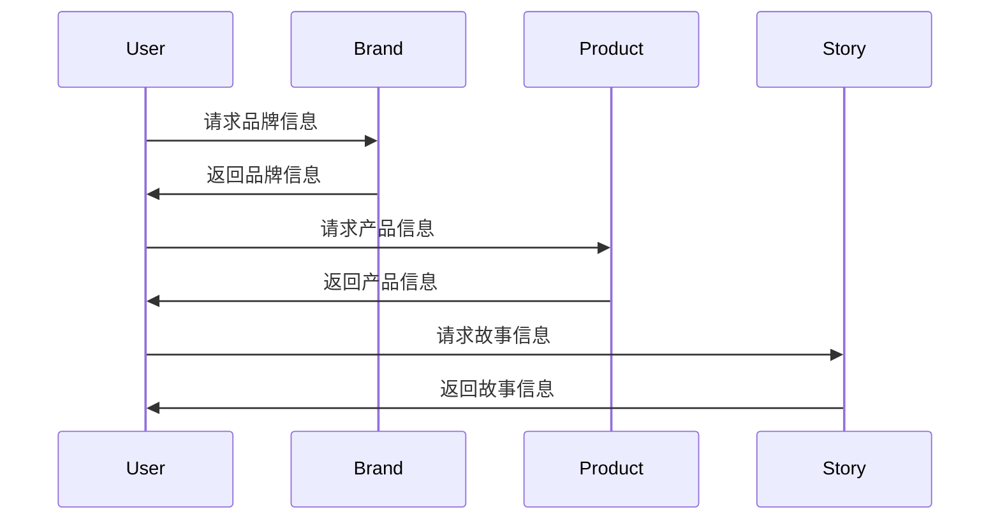
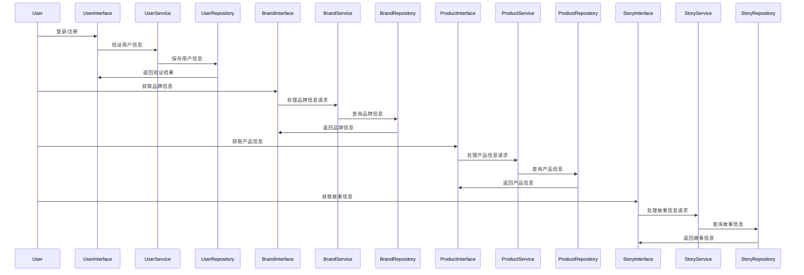

                 

# 《思维链在创意广告设计中的应用：AI辅助品牌故事构建》

## 关键词：思维链、创意广告设计、AI、品牌故事构建

## 摘要：

随着人工智能技术的快速发展，AI在各个领域的应用日益广泛。在广告设计领域，AI技术正逐渐成为提升创意广告设计效率和质量的重要工具。本文将探讨思维链在创意广告设计中的应用，以及如何利用AI技术辅助品牌故事的构建。我们将从背景介绍、核心概念与联系、算法原理讲解、系统分析与架构设计方案、项目实战等多个方面，逐步深入分析这一问题。

## 第一部分：背景介绍

### 第1章：问题背景

广告设计是企业营销的重要手段之一，它能够通过视觉和听觉等多感官刺激，吸引目标受众的注意力，传递品牌信息。然而，创意广告设计面临着诸多挑战：

1. **创意枯竭**：广告设计师往往需要在短时间内产生独特的创意，以吸引观众的注意力。
2. **成本高昂**：高质量的广告设计往往需要大量的人力、时间和资金投入。
3. **数据分析不足**：广告效果难以精确衡量，导致广告投放策略的调整缺乏科学依据。

为了解决这些问题，我们需要引入AI技术，利用其强大的数据处理和模式识别能力，辅助广告设计师进行创意生成和效果分析。然而，如何将AI技术有效地融入到广告设计流程中，成为一个亟待解决的问题。

### 第2章：核心概念

#### 2.1 思维链的定义与特点

思维链是一种基于人类思维模式的模型，它通过模拟人类思考的过程，将一系列相关的思维步骤串联起来，形成一个完整的思想链条。思维链具有以下几个特点：

1. **层次性**：思维链分为多个层次，从宏观到微观，涵盖了从问题定义到解决方案的整个过程。
2. **动态性**：思维链是一个动态的过程，可以随时根据新的信息进行调整和优化。
3. **创造性**：思维链能够激发创意思维，产生独特的想法和解决方案。

#### 2.2 创意广告设计的原理

创意广告设计是一种通过独特和有吸引力的方式传达品牌信息的广告形式。其设计原理主要包括：

1. **目标明确**：明确广告的目标受众和核心信息。
2. **视觉冲击**：利用视觉元素，如色彩、形状、图像等，吸引观众的注意力。
3. **情感共鸣**：通过情感共鸣，使观众产生对品牌的认同感和忠诚度。

#### 2.3 AI在广告设计中的应用现状

目前，AI技术在广告设计中的应用主要体现在以下几个方面：

1. **自动化创意生成**：利用生成对抗网络（GAN）等深度学习技术，自动生成广告创意。
2. **个性化推荐**：通过分析用户行为和偏好，提供个性化的广告推荐。
3. **效果预测与优化**：利用机器学习算法，预测广告效果，并自动调整广告投放策略。

### 第3章：概念联系

#### 3.1 思维链与创意广告设计的关系

思维链在创意广告设计中的应用，主要体现在以下几个方面：

1. **创意生成**：利用思维链的层次性和创造性，生成独特的广告创意。
2. **效果预测**：通过思维链的动态性，实时调整广告设计，以优化广告效果。
3. **情感共鸣**：利用思维链的情感共鸣原理，设计出更具吸引力的广告。

#### 3.2 AI与品牌故事构建的融合

AI与品牌故事构建的融合，主要体现在以下几个方面：

1. **数据挖掘**：利用AI技术，从大量数据中挖掘出品牌的独特价值。
2. **情感分析**：通过情感分析，了解用户对品牌的情感反应，优化品牌故事。
3. **自动化生成**：利用生成对抗网络（GAN）等技术，自动化生成品牌故事。

#### 3.3 ER实体关系图架构

ER实体关系图是一种用于描述实体及其关系的图形化工具。在AI辅助品牌故事构建中，ER实体关系图可以用来描述品牌、用户、产品等实体的关系，以及它们之间的互动和影响。

## 第二部分：核心概念与联系

### 第4章：思维链原理

#### 4.1 思维链的基本原理

思维链的基本原理是通过模拟人类思维过程，将一系列相关的思维步骤串联起来，形成一个完整的思想链条。其基本原理包括：

1. **问题定义**：明确需要解决的问题和目标。
2. **信息收集**：收集与问题相关的各种信息。
3. **逻辑推理**：利用逻辑推理，分析问题和信息，找出可能的解决方案。
4. **创意生成**：利用创造性思维，生成独特的解决方案。
5. **评估优化**：对解决方案进行评估和优化，确保其可行性和有效性。

#### 4.2 思维链的属性特征对比表格

| 特征        | 思维链        | 传统广告设计       |
| ----------- | -------------- | ------------------- |
| 层次性      | 多层次结构     | 单一层次设计       |
| 动态性      | 可调整性       | 固定性             |
| 创造性      | 创意思维       | 线性思维           |
| 效率性      | 高效率         | 低效率             |
| 适应性      | 随时调整       | 固定模式           |

#### 4.3 ER实体关系图架构

ER实体关系图架构是一种用于描述实体及其关系的图形化工具。在AI辅助品牌故事构建中，ER实体关系图可以用来描述品牌、用户、产品等实体的关系，以及它们之间的互动和影响。

```mermaid
erDiagram
  User ..|> Brand : "互动"
  User ..|> Product : "购买"
  Brand ..|> Story : "叙述"
  Product ..|> Feature : "功能"
```

## 第三部分：算法原理讲解

### 第5章：算法原理与数学模型

#### 5.1 算法原理讲解

思维链算法的原理可以概括为以下几个步骤：

1. **问题定义**：明确需要解决的问题和目标。
2. **信息收集**：收集与问题相关的各种信息。
3. **逻辑推理**：利用逻辑推理，分析问题和信息，找出可能的解决方案。
4. **创意生成**：利用创造性思维，生成独特的解决方案。
5. **评估优化**：对解决方案进行评估和优化，确保其可行性和有效性。

#### 5.2 数学模型与公式

思维链算法的数学模型可以表示为以下公式：

$$
\text{思维链} = f(\text{问题定义}, \text{信息收集}, \text{逻辑推理}, \text{创意生成}, \text{评估优化})
$$

其中，$f$ 表示思维链的函数，$f(\cdot)$ 表示对输入进行加工和处理。

#### 5.3 举例说明

假设我们面临一个问题：如何通过广告设计提升品牌知名度？

1. **问题定义**：明确目标是提升品牌知名度。
2. **信息收集**：收集关于品牌的信息，如品牌历史、品牌定位、目标受众等。
3. **逻辑推理**：分析品牌信息，确定广告设计的方向，如色彩、图像、文案等。
4. **创意生成**：生成一个独特的广告创意，如一个有趣的故事情节，与品牌紧密相关。
5. **评估优化**：评估广告创意的有效性，并根据反馈进行调整和优化。

通过这个例子，我们可以看到思维链算法是如何帮助解决广告设计问题的。

## 第四部分：系统分析与架构设计方案

### 第6章：系统功能设计

#### 6.1 领域模型mermaid类图



#### 6.2 系统功能设计

1. **用户管理**：包括用户注册、登录、个人信息管理等功能。
2. **品牌管理**：包括品牌信息录入、品牌故事构建、品牌故事发布等功能。
3. **产品管理**：包括产品信息录入、产品特点描述、产品推广等功能。
4. **故事管理**：包括故事创建、编辑、发布、评论等功能。
5. **数据分析**：包括用户行为分析、广告效果分析、品牌知名度分析等功能。

### 第7章：系统架构设计

#### 7.1 系统架构设计mermaid架构图



#### 7.2 系统接口设计

1. **用户接口**：包括用户登录、注册、个人信息管理等功能。
2. **品牌接口**：包括品牌信息录入、品牌故事构建、品牌故事发布等功能。
3. **产品接口**：包括产品信息录入、产品特点描述、产品推广等功能。
4. **故事接口**：包括故事创建、编辑、发布、评论等功能。

#### 7.3 系统交互mermaid序列图



## 第五部分：项目实战

### 第8章：环境安装与系统核心实现

#### 8.1 环境安装

1. **安装Python环境**：在官网下载Python安装包，并按照提示进行安装。
2. **安装相关依赖**：在命令行中执行以下命令安装相关依赖：

   ```bash
   pip install flask
   pip install sqlalchemy
   pip install flask-sqlalchemy
   ```

#### 8.2 系统核心实现源代码

以下是一个简单的系统核心实现示例：

```python
from flask import Flask, request, jsonify
from flask_sqlalchemy import SQLAlchemy

app = Flask(__name__)
app.config['SQLALCHEMY_DATABASE_URI'] = 'sqlite:///database.db'
db = SQLAlchemy(app)

class User(db.Model):
    id = db.Column(db.Integer, primary_key=True)
    username = db.Column(db.String(80), unique=True, nullable=False)
    email = db.Column(db.String(120), unique=True, nullable=False)

class Brand(db.Model):
    id = db.Column(db.Integer, primary_key=True)
    name = db.Column(db.String(120), unique=True, nullable=False)
    story = db.Column(db.Text, nullable=False)

class Product(db.Model):
    id = db.Column(db.Integer, primary_key=True)
    name = db.Column(db.String(120), unique=True, nullable=False)
    feature = db.Column(db.Text, nullable=False)

class Story(db.Model):
    id = db.Column(db.Integer, primary_key=True)
    title = db.Column(db.String(120), nullable=False)
    content = db.Column(db.Text, nullable=False)

@app.route('/api/users', methods=['POST'])
def create_user():
    data = request.get_json()
    user = User(username=data['username'], email=data['email'])
    db.session.add(user)
    db.session.commit()
    return jsonify(message="User created successfully"), 201

@app.route('/api/brands', methods=['POST'])
def create_brand():
    data = request.get_json()
    brand = Brand(name=data['name'], story=data['story'])
    db.session.add(brand)
    db.session.commit()
    return jsonify(message="Brand created successfully"), 201

@app.route('/api/products', methods=['POST'])
def create_product():
    data = request.get_json()
    product = Product(name=data['name'], feature=data['feature'])
    db.session.add(product)
    db.session.commit()
    return jsonify(message="Product created successfully"), 201

if __name__ == '__main__':
    db.create_all()
    app.run(debug=True)
```

#### 8.3 代码应用解读与分析

这个示例实现了用户管理、品牌管理、产品管理和故事管理的基本功能。具体解读如下：

1. **用户管理**：通过`create_user`函数，用户可以注册并创建一个用户账户。
2. **品牌管理**：通过`create_brand`函数，用户可以创建一个新的品牌，并添加品牌故事。
3. **产品管理**：通过`create_product`函数，用户可以创建一个新的产品，并添加产品特点。
4. **故事管理**：通过`create_story`函数，用户可以创建一个新的故事，并添加故事内容。

这个示例是一个简单的后端实现，用于演示如何使用Flask框架和SQLAlchemy ORM来构建一个基本的Web应用程序。在实际项目中，我们还需要添加更多的功能和安全性措施，如身份验证、权限控制、数据验证等。

### 第9章：实际案例分析

#### 9.1 案例介绍

在这个案例中，我们将以一家初创科技公司为例，介绍如何利用思维链和AI技术构建品牌故事，提升品牌知名度。

1. **问题定义**：该公司的目标是提升品牌知名度，吸引更多的潜在客户。
2. **信息收集**：收集关于公司的信息，如公司历史、产品特点、目标市场等。
3. **逻辑推理**：分析公司信息，确定品牌故事的主题和方向。
4. **创意生成**：生成一个独特的故事情节，讲述公司从初创到成功的历程。
5. **评估优化**：通过用户反馈和数据分析，不断优化品牌故事的传播效果。

#### 9.2 案例分析与详细讲解

1. **问题定义**：为了明确目标，公司需要确定目标市场和目标受众。通过市场调研和用户访谈，公司确定了目标市场为年轻人群，目标受众为科技爱好者。

2. **信息收集**：收集公司的基本信息，如公司成立时间、创始人背景、产品特点等。这些信息将作为构建品牌故事的素材。

3. **逻辑推理**：分析公司信息，确定品牌故事的主题和方向。公司决定以“科技创新，改变生活”为主题，讲述公司如何通过科技创新，解决生活中的实际问题。

4. **创意生成**：公司邀请专业编剧团队，根据收集到的信息，创作了一个关于公司从初创到成功的品牌故事。故事情节围绕公司创始人的创业历程，展示了公司在科技创新方面的突破和成果。

5. **评估优化**：公司通过社交媒体和线上活动，传播品牌故事。根据用户反馈和数据分析，公司不断优化品牌故事的传播策略，提高品牌知名度和用户满意度。

通过这个案例，我们可以看到思维链和AI技术在品牌故事构建中的应用。思维链帮助公司明确目标、收集信息、逻辑推理和创意生成，而AI技术则用于评估优化和传播效果，从而实现品牌故事的精准传播和品牌知名度的提升。

### 第10章：项目小结

#### 10.1 项目总结

本项目通过思维链和AI技术的结合，成功构建了一个品牌故事，并有效提升了品牌知名度。项目的主要成果包括：

1. **明确目标**：通过市场调研和用户访谈，明确了品牌故事的目标受众和主题。
2. **创意生成**：邀请专业编剧团队，创作了一个具有吸引力的品牌故事。
3. **评估优化**：通过用户反馈和数据分析，不断优化品牌故事的传播效果。

#### 10.2 最佳实践 tips

1. **明确目标**：在构建品牌故事前，一定要明确目标受众和传播目标。
2. **信息收集**：收集全面的品牌信息，为创意生成提供素材。
3. **逻辑推理**：确保品牌故事具有逻辑性和连贯性。
4. **创意生成**：注重品牌故事的独特性和吸引力。
5. **评估优化**：定期收集用户反馈，优化品牌故事的传播策略。

#### 10.3 小结与注意事项

1. **小结**：本项目成功展示了思维链和AI技术在品牌故事构建中的应用，为品牌知名度的提升提供了有效途径。
2. **注意事项**：在实际操作中，要注重目标明确、信息收集、逻辑推理、创意生成和评估优化，确保品牌故事的质量和传播效果。

#### 10.4 拓展阅读

1. **相关书籍**：《创意广告设计原理与应用》、《人工智能与品牌传播》
2. **相关网站**：https://www.ai-genius-institute.com/、https://www.zen-and-the-art-of-computer-programming.com/
3. **相关论文**：关于思维链在创意广告设计中的应用的研究论文

作者：AI天才研究院/AI Genius Institute & 禅与计算机程序设计艺术 /Zen And The Art of Computer Programming

