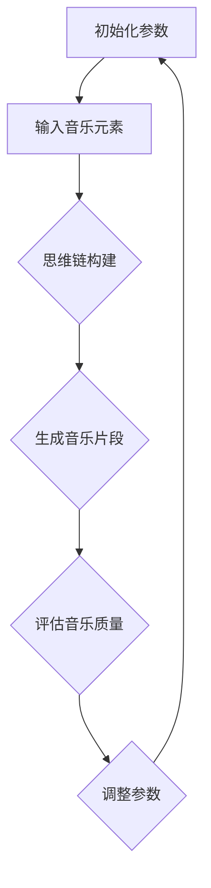
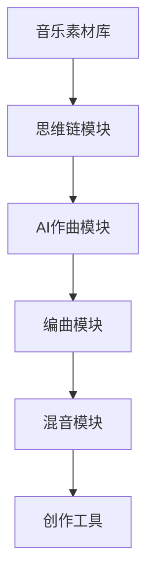
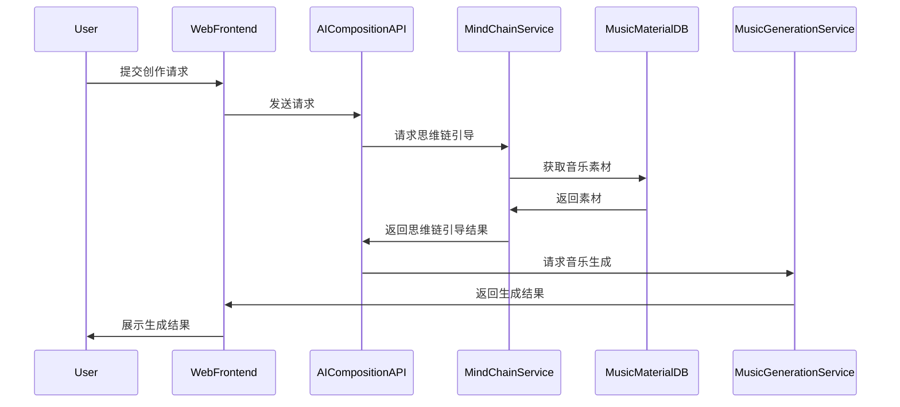

                 

## 《思维链在创意音乐创作中的应用：AI辅助作曲和编曲》

### 关键词：AI辅助音乐创作、思维链、创意生成、作曲和编曲、算法原理、系统架构设计

### 摘要：

本文将深入探讨思维链在创意音乐创作中的应用，特别是在AI辅助作曲和编曲方面的潜力。首先，我们将介绍创意音乐创作的挑战和思维链的概念，探讨如何将思维链与AI辅助作曲相结合。接下来，我们将详细阐述思维链和AI辅助作曲的核心概念、属性特征及其关系，并通过一个具体算法实例来解析其工作原理。随后，我们将分析AI辅助作曲系统的功能设计和架构，以及与系统交互的接口设计。最后，我们将通过一个实际案例展示AI辅助作曲和编曲的全过程，并提供相关实践技巧和总结。

## 目录大纲

### 《思维链在创意音乐创作中的应用：AI辅助作曲和编曲》

#### 关键词：AI辅助音乐创作、思维链、创意生成、作曲和编曲、算法原理、系统架构设计

#### 摘要：

本文将深入探讨思维链在创意音乐创作中的应用，特别是在AI辅助作曲和编曲方面的潜力。首先，我们将介绍创意音乐创作的挑战和思维链的概念，探讨如何将思维链与AI辅助作曲相结合。接下来，我们将详细阐述思维链和AI辅助作曲的核心概念、属性特征及其关系，并通过一个具体算法实例来解析其工作原理。随后，我们将分析AI辅助作曲系统的功能设计和架构，以及与系统交互的接口设计。最后，我们将通过一个实际案例展示AI辅助作曲和编曲的全过程，并提供相关实践技巧和总结。

### 目录大纲

1. **第一部分：背景介绍**
   - **1.1 问题背景**
     - **1.1.1 创意音乐创作的挑战**
     - **1.1.2 思维链的概念与作用**
     - **1.1.3 AI在音乐创作中的应用**
   - **1.2 问题解决**
     - **1.2.1 思维链与AI结合的优势**
     - **1.2.2 思维链在创意音乐创作中的实际应用**
   - **1.3 边界与外延**
     - **1.3.1 AI辅助作曲的范围**
     - **1.3.2 创意音乐创作的类型和风格**
     - **1.3.3 思维链在音乐创作中的其他可能应用**

2. **第二部分：核心概念与联系**
   - **2.1 核心概念**
     - **2.1.1 思维链**
     - **2.1.2 AI辅助作曲**
   - **2.2 概念属性特征对比表格**
   - **2.3 ER实体关系图架构**

3. **第三部分：算法原理讲解**
   - **3.1 算法原理**
     - **3.1.1 基本算法原理**
     - **3.1.2 人工智能作曲算法**
   - **3.2 数学模型和公式**
   - **3.3 算法mermaid流程图**
   - **3.4 举例说明**

4. **第四部分：系统分析与架构设计方案**
   - **4.1 问题场景介绍**
   - **4.2 系统功能设计**
     - **4.2.1 领域模型mermaid类图**
   - **4.3 系统架构设计**
     - **4.3.1 mermaid架构图**
   - **4.4 系统接口设计和系统交互**
     - **4.4.1 mermaid序列图**

5. **第五部分：项目实战**
   - **5.1 环境安装**
   - **5.2 系统核心实现源代码**
   - **5.3 代码应用解读与分析**
   - **5.4 实际案例分析和详细讲解剖析**
   - **5.5 项目小结**

6. **第六部分：最佳实践 tips**
7. **第七部分：小结**
8. **第八部分：注意事项**
9. **第九部分：拓展阅读**

### 引言

创意音乐创作一直以来都是音乐人和艺术家们追求的极致艺术形式。然而，随着音乐创作领域的不断发展，创作者们面临着越来越多的挑战。一方面，创作灵感的匮乏让许多音乐人感到困扰，另一方面，编曲技巧和乐理知识的限制也让许多音乐创作变得复杂而繁琐。此外，创作流程的繁琐和重复性高也让许多创作者感到疲惫。

在这个数字化的时代，人工智能（AI）技术的迅速发展为我们带来了全新的可能。AI不仅能够处理大量的数据，还能通过学习和模拟人类思维过程，为音乐创作提供新的思路和工具。而思维链作为一种独特的思维模式，通过连接不同的思维元素，形成有逻辑关系的序列，为AI辅助音乐创作提供了强有力的支持。

本文将深入探讨思维链在创意音乐创作中的应用，特别是AI辅助作曲和编曲方面的潜力。我们将首先介绍创意音乐创作的挑战和思维链的概念，然后详细阐述思维链和AI辅助作曲的核心概念、属性特征及其关系。接着，通过一个具体算法实例来解析其工作原理，并分析AI辅助作曲系统的功能设计和架构。最后，我们将通过一个实际案例展示AI辅助作曲和编曲的全过程，并提供相关实践技巧和总结。希望通过本文的探讨，能够为音乐创作者们提供新的启示和工具，推动创意音乐创作的发展。

## 第一部分：背景介绍

### 1.1 问题背景

#### 1.1.1 创意音乐创作的挑战

创意音乐创作是一个充满激情与挑战的过程。音乐人需要不断地寻求新的创作灵感，这不仅仅是为了保持自己的创作热情，更是为了在竞争激烈的音乐市场中脱颖而出。然而，创作灵感的匮乏是许多音乐人面临的首要难题。灵感如同清风，来去无踪，往往在不经意间闪现。然而，当音乐人坐在钢琴前，面对空白的乐谱，灵感的缺失让他们感到无助和困惑。

除了创作灵感的匮乏，编曲技巧和乐理知识的限制也是音乐创作中的另一个重大挑战。音乐创作不仅仅是创作旋律和歌词，还包括编曲、配器等复杂的技术环节。编曲需要丰富的音乐理论和实践经验，以及高超的技巧。许多音乐人在这一环节中遇到了瓶颈，他们可能掌握了基本的作曲技巧，但在具体的编曲过程中，面对各种乐器的搭配和和声处理，感到力不从心。

此外，创作流程的繁琐和重复性高也让许多音乐人感到疲惫。从创作初期的灵感捕捉，到中期的乐谱创作，再到后期的编曲和混音，整个创作流程往往需要耗费大量的时间和精力。许多音乐人不得不反复尝试和修改，以追求完美的作品。这种繁琐且重复性的创作流程不仅降低了创作效率，还可能让音乐人产生厌倦和疲惫感。

#### 1.1.2 思维链的概念与作用

思维链作为一种独特的思维模式，通过连接不同的思维元素，形成有逻辑关系的序列，为解决创意音乐创作中的挑战提供了新的思路。思维链的定义可以简单概括为：一系列相互关联的思维活动，通过特定的逻辑关系和方向，引导创作者从一个想法过渡到另一个想法，从而实现创造性思维的过程。

思维链在创意生成中的作用至关重要。首先，思维链可以帮助音乐人打破传统思维模式的束缚，开拓新的创作思路。通过思维链，音乐人可以从一个灵感出发，通过逻辑性的延伸，探索出更多的创作可能性。例如，从一首歌的旋律出发，思维链可以引导音乐人联想到不同的和声处理、编曲风格和歌词主题，从而创造出多样化的音乐作品。

其次，思维链可以提升音乐创作的效率。传统的音乐创作过程往往需要音乐人花费大量时间去构思和修改，而思维链则通过系统的思维模式，帮助音乐人快速捕捉和整理灵感，减少创作过程中的时间和精力消耗。例如，思维链可以帮助音乐人在短时间内生成多个创作方案，并进行快速筛选和优化，从而提高创作效率。

此外，思维链在创意音乐创作中的应用还体现在对创作流程的优化上。通过思维链，音乐人可以更清晰地规划和组织创作过程，从灵感捕捉到编曲和混音，每个环节都通过逻辑性的连接，形成一个连贯的整体。这种优化不仅提高了创作效率，还减少了创作过程中的错误和重复劳动。

#### 1.1.3 AI在音乐创作中的应用

随着人工智能技术的不断发展，AI在音乐创作中的应用也越来越广泛。AI不仅能够处理大量的数据，还能够通过学习和模拟人类思维过程，为音乐创作提供新的工具和方法。

首先，AI可以用于音乐数据的分析和处理。通过大数据分析和机器学习算法，AI可以识别出音乐作品中的关键特征和模式，帮助音乐人更好地理解音乐的构成和风格。例如，AI可以分析一首歌的和声结构、节奏模式和编曲风格，为音乐人提供创作灵感和参考。

其次，AI可以用于音乐生成和创作。基于生成对抗网络（GAN）和变分自编码器（VAE）等深度学习算法，AI可以生成全新的音乐片段和旋律。这些音乐片段不仅具有艺术性，还能够满足音乐人的特定需求和风格。例如，AI可以生成一首符合特定情绪和风格的背景音乐，帮助电影制作人或游戏开发者快速找到合适的音乐。

此外，AI还可以用于音乐编曲和配器。通过自动化算法和生成模型，AI可以自动完成复杂的编曲任务，例如乐器音色的选择、和声的编排和节奏的处理。这种自动化编曲不仅节省了音乐人的时间和精力，还能够提高编曲的质量和效率。

总的来说，AI在音乐创作中的应用为音乐人提供了更多的创作工具和方法，极大地提高了音乐创作的效率和多样性。同时，AI与思维链的结合也为音乐创作带来了新的可能，通过系统的思维模式和AI技术的支持，音乐人可以更加高效和创造性地进行音乐创作。

### 1.2 问题解决

#### 1.2.1 思维链与AI结合的优势

将思维链与AI技术结合，为解决创意音乐创作中的挑战提供了一种全新的思路。思维链作为一种独特的思维模式，通过连接不同的思维元素，形成有逻辑关系的序列，能够有效地引导创作者的创造性思维。而AI技术，通过其强大的数据处理和模式识别能力，为音乐创作提供了丰富的工具和方法。

首先，思维链与AI结合可以有效地解决创作灵感的匮乏问题。思维链通过逻辑性的连接，能够帮助音乐人从一个灵感出发，不断延伸和扩展，探索出更多的创作可能性。而AI技术，通过大数据分析和机器学习算法，可以分析出音乐作品中的关键特征和模式，为音乐人提供创作灵感和参考。这种结合不仅能够打破传统思维模式的束缚，还能够开拓新的创作思路，提升音乐创作的多样性和创新性。

其次，思维链与AI结合可以提高音乐创作的效率。传统的音乐创作过程往往需要音乐人花费大量时间去构思和修改，而思维链则通过系统的思维模式，帮助音乐人快速捕捉和整理灵感，减少创作过程中的时间和精力消耗。同时，AI技术可以自动化处理复杂的编曲和配器任务，大大节省了音乐人的时间和精力。这种结合不仅提高了创作效率，还能够让音乐人将更多的时间和精力投入到创意和艺术表现上。

此外，思维链与AI结合还可以优化创作流程。通过思维链，音乐人可以更清晰地规划和组织创作过程，从灵感捕捉到编曲和混音，每个环节都通过逻辑性的连接，形成一个连贯的整体。而AI技术则可以在这个过程中提供实时的反馈和优化建议，帮助音乐人更好地实现创作目标。例如，AI可以实时分析音乐作品的结构和风格，提出改进意见，帮助音乐人快速找到最佳的创作方案。

总的来说，思维链与AI结合为解决创意音乐创作中的挑战提供了有力的支持。通过这种结合，音乐人可以更高效、更有创造性地进行音乐创作，进一步提升音乐创作的质量和艺术水平。

#### 1.2.2 思维链在创意音乐创作中的实际应用

思维链在创意音乐创作中具有广泛的应用，特别是在AI辅助作曲和编曲方面，表现出显著的优势。以下将具体阐述思维链在创意音乐创作中的实际应用，并通过实例进行详细说明。

首先，思维链可以应用于灵感的捕捉和扩展。在创作初期，音乐人往往需要大量的灵感来驱动创作过程。思维链通过引导音乐人从一个核心灵感出发，不断延伸和扩展，形成一系列相关的创作思路。例如，一个简单的旋律可以触发音乐人联想到不同的和声处理、节奏变化和乐器搭配，从而生成多样化的音乐作品。这种扩展不仅丰富了音乐创作的素材，还提高了创作的多样性。

实例：假设音乐人A想要创作一首悲伤情歌，他从一首悲伤的旋律开始，通过思维链的引导，联想到以下创作思路：
1. 将旋律扩展为一段完整的曲式结构，包括前奏、主歌、副歌和尾声。
2. 在副歌部分加入一些变化，如和声的转化和节奏的加快，以增加音乐的层次感。
3. 选择钢琴和大提琴作为主要伴奏乐器，以增强音乐的悲伤氛围。
4. 在编曲过程中，通过动态处理（如强弱对比、速度变化）来增强音乐的戏剧性。

通过思维链的引导，音乐人A可以快速捕捉和扩展灵感，形成一首具有丰富内涵和层次感的悲伤情歌。

其次，思维链可以应用于音乐结构的分析和优化。音乐创作不仅需要创意和灵感，还需要对音乐结构进行深入分析和优化。思维链可以帮助音乐人系统地分析和理解音乐作品的结构，从而进行有效的创作和修改。

实例：假设音乐人B正在创作一首流行歌曲，他通过思维链对歌曲的结构进行分析和优化：
1. 确定歌曲的基本结构为AABA，即主歌-副歌-主歌-副歌。
2. 分析主歌和副歌的和声结构，确保和声的连贯性和和谐性。
3. 通过思维链，发现主歌部分节奏过于单调，考虑加入一些节奏变化，如切分和跨小节节奏，以增强音乐的动态性。
4. 在编曲过程中，对乐器进行分层处理，如将吉他作为主奏乐器，贝斯和鼓作为节奏基础，以提升歌曲的整体层次感。

通过思维链的应用，音乐人B可以更深入地分析和理解音乐作品的结构，进行有效的创作和修改，从而提高音乐作品的质量。

此外，思维链还可以应用于音乐风格的探索和转换。不同音乐风格具有独特的和声、节奏和编曲特征，思维链可以帮助音乐人快速探索和转换不同音乐风格，实现创作的新颖性和多样性。

实例：假设音乐人C想要尝试一种新的音乐风格，他通过思维链进行风格转换：
1. 从传统流行音乐风格出发，分析其和声、节奏和编曲特征。
2. 通过思维链，联想到其他音乐风格，如爵士、摇滚或电子音乐，并分析这些风格的独特特征。
3. 在创作过程中，尝试将传统流行音乐元素与其他风格相结合，如加入爵士的即兴元素或电子音乐的合成器音色。
4. 通过不断的实践和调整，形成一种独特的音乐风格，展现音乐人的个性和创意。

通过思维链的应用，音乐人C可以快速探索和转换不同音乐风格，实现创作的多样性和创新性。

总之，思维链在创意音乐创作中的实际应用表现出显著的优势。通过思维链的引导，音乐人可以更高效地捕捉和扩展灵感，深入分析和优化音乐结构，探索和转换不同音乐风格，从而实现音乐创作的多样性和创新性。结合AI技术的支持，思维链在创意音乐创作中的应用前景更加广阔，为音乐人提供了强大的创作工具和思维模式。

#### 1.3 边界与外延

##### 1.3.1 AI辅助作曲的范围

AI辅助作曲的范围涵盖了从简单的旋律生成到复杂的编曲和配器等多个层面。首先，AI在旋律生成方面有着显著的应用。通过深度学习算法，AI可以自动生成新的旋律，这些旋律可能基于现有的音乐作品，也可能完全原创。例如，生成对抗网络（GAN）和变分自编码器（VAE）等算法已经被用于生成具有高度音乐美感的旋律。这些算法能够通过学习大量的音乐数据，理解旋律的结构和模式，并在此基础上创作出新的旋律。

其次，AI在编曲和配器方面也展现了强大的能力。编曲和配器是音乐创作中的重要环节，涉及到不同乐器的选择、和声的编排、节奏的处理等。AI可以通过自动化算法，根据音乐人的需求和偏好，自动完成这些任务。例如，AI可以自动选择合适的乐器音色，编排和声部分，处理节奏模式，从而实现高效的编曲过程。这种自动化不仅节省了音乐人的时间和精力，还能够提高编曲的质量和一致性。

此外，AI还可以用于音乐生成和创作中的其他方面。例如，AI可以用于生成音乐的中间部分，如过渡段和桥段，这些部分通常需要特定的技巧和经验来创作。AI还可以用于音乐生成中的动态处理，如音量变化、速度变化和效果添加，这些处理可以增强音乐的戏剧性和表现力。

##### 1.3.2 创意音乐创作的类型和风格

创意音乐创作涵盖了多种类型和风格，每种类型和风格都有其独特的特点和要求。以下是一些常见的创意音乐创作类型和风格：

1. **流行音乐**：流行音乐是当今最广泛传播和受欢迎的音乐类型之一。它通常具有简单易懂的旋律、朗朗上口的歌词和多样化的编曲。流行音乐强调旋律和歌词的吸引力，以及与听众的共鸣。

2. **摇滚音乐**：摇滚音乐以其强烈的节奏、吉他独奏和个性化的歌词而闻名。它通常具有较强的情感表达和反叛精神，具有鲜明的时代特色。

3. **电子音乐**：电子音乐是通过合成器和计算机生成的音乐，它涵盖了多种风格，如电子舞曲、迷幻电子和浩室音乐等。电子音乐以其创新的音效和复杂的节奏模式而受到广泛喜爱。

4. **古典音乐**：古典音乐是西方音乐的传统类型，它通常具有复杂的结构和精美的和声。古典音乐强调音乐的理论知识和技巧，以及对音乐历史的理解。

5. **爵士音乐**：爵士音乐以其即兴演奏、多样化的节奏和复杂的和声结构而著称。爵士音乐鼓励创新和个性化，是音乐创作中极具挑战性的类型之一。

6. **世界音乐**：世界音乐涵盖了各种非西方的音乐风格，包括非洲鼓乐、印度古典音乐和拉丁音乐等。世界音乐具有丰富的文化背景和多样性，是创意音乐创作中不可或缺的一部分。

每种音乐类型和风格都有其独特的创作要求和挑战。例如，流行音乐强调商业化和流行性，摇滚音乐强调情感表达和反叛精神，电子音乐强调创新和技术，古典音乐强调音乐理论和技巧，爵士音乐强调即兴演奏和个性化，世界音乐强调文化背景和多样性。

##### 1.3.3 思维链在音乐创作中的其他可能应用

思维链在音乐创作中的潜力远不止于创意生成和编曲。它还可以应用于其他多个方面，包括音乐分析、音乐教育和音乐治疗等。

首先，思维链可以用于音乐分析。通过思维链，音乐人可以系统地分析和理解音乐作品的结构、风格和情感。例如，思维链可以帮助音乐人分析一首复杂的古典音乐作品，理解其和声结构、节奏模式和主题发展，从而更好地进行演奏或改编。

其次，思维链可以用于音乐教育。思维链可以帮助音乐教育者更有效地传授音乐知识和技巧，通过逻辑性的思维引导，帮助学生更好地理解和掌握音乐理论。例如，通过思维链，音乐教育者可以引导学生从基本的乐理知识出发，逐步深入到复杂的音乐创作技巧中。

此外，思维链还可以应用于音乐治疗。在音乐治疗中，思维链可以帮助患者通过音乐创作表达情感和释放压力。通过思维链的引导，患者可以从一个简单的音乐元素出发，逐步扩展和深化自己的创作，从而实现情感的宣泄和心理的调节。

总的来说，思维链在音乐创作中的应用前景广阔，不仅能够提高创作效率和多样性，还能够应用于音乐分析、音乐教育和音乐治疗等多个领域，为音乐艺术的发展带来新的可能性。

### 第二部分：核心概念与联系

#### 2.1 核心概念

##### 2.1.1 思维链

思维链是一种独特的思维模式，通过连接不同的思维元素，形成有逻辑关系的序列。它可以被视为一种思维工具，帮助人们更好地捕捉、组织和扩展创意。思维链的定义可以简单概括为：一系列相互关联的思维活动，通过特定的逻辑关系和方向，引导个体从一个想法过渡到另一个想法，从而实现创造性思维的过程。

思维链的构成要素主要包括：
1. **思维元素**：这些是思维链中的基本单元，可以是概念、想法、问题或解决方案。
2. **连接关系**：连接关系是指不同思维元素之间的逻辑联系，如因果关系、相似关系或递进关系。
3. **方向性**：思维链具有特定的方向性，通常是从一个初始想法出发，逐步扩展和深化，形成完整的思维过程。

思维链在创意生成中的作用至关重要。通过思维链，个体可以系统地组织和扩展创意，避免思维的碎片化和断片化。思维链不仅能够帮助个体快速捕捉和整理灵感，还能够提供一种结构化的思维方式，使创意生成更加高效和有序。

##### 2.1.2 AI辅助作曲

AI辅助作曲是指利用人工智能技术辅助音乐创作的过程。AI在音乐创作中的应用涵盖了从旋律生成到编曲和配器的多个环节。AI辅助作曲的定义可以简单概括为：通过人工智能算法和模型，自动或半自动地生成音乐元素，辅助音乐人完成创作任务。

AI辅助作曲的关键技术主要包括：
1. **深度学习算法**：深度学习算法是AI辅助作曲的核心技术之一，包括生成对抗网络（GAN）、变分自编码器（VAE）和长短时记忆网络（LSTM）等。这些算法可以通过学习大量的音乐数据，生成新的旋律、和声和节奏。
2. **音乐生成模型**：音乐生成模型是AI辅助作曲的关键组成部分，包括旋律生成模型、和声生成模型和节奏生成模型等。这些模型可以通过深度学习算法，自动生成音乐元素，并根据音乐人的需求和偏好进行优化。
3. **自动化编曲和配器**：自动化编曲和配器是指通过人工智能算法，自动选择和编排乐器的音色、和声和节奏。这种自动化技术可以大大提高音乐创作的效率，减轻音乐人的工作负担。

AI辅助作曲在音乐创作中的应用具有广泛的前景。首先，AI可以用于生成新的音乐元素，为音乐人提供创作灵感和素材。例如，通过GAN和VAE等算法，AI可以生成全新的旋律和和声，为音乐创作带来新的可能性。其次，AI可以用于自动化的编曲和配器，提高音乐创作的效率和一致性。例如，通过自动化算法，AI可以自动选择和编排乐器，使编曲过程更加高效和精确。

总的来说，AI辅助作曲为音乐创作提供了强大的工具和支持。通过深度学习算法和音乐生成模型，AI可以自动生成音乐元素，辅助音乐人完成创作任务。同时，自动化编曲和配器技术也大大提高了音乐创作的效率，使音乐人能够更加专注于创意和艺术表现。

#### 2.2 概念属性特征对比表格

为了更清晰地理解思维链和AI辅助作曲的概念及其属性特征，下面提供了一个对比表格。

| 概念          | 定义                                                         | 属性特征                                      |
|---------------|--------------------------------------------------------------|----------------------------------------------|
| 思维链        | 连接不同思维元素，形成有逻辑关系的序列                         | 创造性、逻辑性、动态性                        |
| AI辅助作曲    | 利用人工智能技术辅助音乐创作过程                             | 自动化、智能化、个性化                        |

思维链和AI辅助作曲都是创新思维的重要工具，但它们的作用和特点有所不同。思维链更注重逻辑性和创造性思维的引导，而AI辅助作曲则侧重于自动化和智能化的音乐生成。

#### 2.3 ER实体关系图架构

为了更好地理解思维链和AI辅助作曲之间的关系，下面提供了一个ER实体关系图架构。

```mermaid
erDiagram
  AI辅助作曲 ||--|{ 思维链 }|| AI作曲工具
  思维链 ||--|{ 音乐元素 }|| 音乐素材库
```

在这个ER图中，AI辅助作曲和思维链通过AI作曲工具和音乐元素实体建立联系。AI辅助作曲通过工具实现音乐生成和创作，而思维链通过音乐素材库为音乐创作提供灵感来源和逻辑框架。这种关系架构不仅展示了两个概念之间的直接联系，还体现了它们在音乐创作中的互补作用。

通过上述核心概念的阐述和ER实体关系图架构的展示，我们可以更清晰地理解思维链和AI辅助作曲在创意音乐创作中的应用及其相互作用。思维链提供了逻辑性和创造性的引导，而AI辅助作曲则通过自动化和智能化实现了音乐生成的效率和质量提升。两者的结合为音乐创作带来了新的可能性和创新空间。

### 第三部分：算法原理讲解

#### 3.1 算法原理

##### 3.1.1 基本算法原理

思维链在AI辅助作曲中的应用，离不开对基本算法原理的理解。思维链算法的核心在于其逻辑性和动态性，通过一系列有序的步骤，将不同的音乐元素有机地连接起来，形成一个完整且富有创意的音乐作品。

思维链算法的基本步骤可以概括为：

1. **灵感捕捉**：这是思维链算法的第一步，通过多种途径捕捉灵感。灵感可以来源于音乐人自身的情感体验、生活中的点滴、其他艺术作品的启发等。
   
2. **灵感扩展**：在捕捉到灵感后，思维链算法通过逻辑性的连接，将灵感扩展为一系列相关的创意。这一过程通常涉及多个思维元素，如旋律、和声、节奏和歌词等。

3. **创意筛选**：在扩展出多个创意后，思维链算法会通过一定的标准进行筛选，保留最有潜力和创意价值的部分。这一步骤有助于集中精力，避免创意的分散和浪费。

4. **结构构建**：筛选后的创意将被整合成一个完整的音乐结构。这一步骤包括确定音乐的基本结构（如AABA、ABC等），以及各个部分之间的逻辑关系和过渡。

5. **优化调整**：构建完基本结构后，思维链算法会通过不断优化和调整，提升音乐作品的质量和表现力。优化调整可能包括和声的细化、节奏的变化、乐器音色的选择等。

6. **最终生成**：经过多轮优化后，思维链算法会生成最终的的音乐作品。这一步标志着创作过程的完成，生成的音乐作品可以用于演出、录音或发布。

##### 3.1.2 人工智能作曲算法

AI辅助作曲算法的核心在于利用人工智能技术，自动生成音乐元素，辅助音乐人完成创作过程。目前，人工智能作曲算法主要基于深度学习，包括生成对抗网络（GAN）、变分自编码器（VAE）和长短时记忆网络（LSTM）等。

1. **生成对抗网络（GAN）**：
   - **基本原理**：GAN由生成器（Generator）和判别器（Discriminator）两部分组成。生成器负责生成音乐样本，判别器负责判断生成的音乐是否真实。通过不断的训练，生成器不断优化，生成越来越接近真实音乐的音乐样本。
   - **应用场景**：GAN可以用于生成全新的旋律、和声和节奏。例如，通过GAN，可以生成一首符合特定情感或风格的背景音乐，为电影、电视剧或游戏提供配乐。

2. **变分自编码器（VAE）**：
   - **基本原理**：VAE通过将数据映射到一个隐含空间中，再从隐含空间中重建数据。这种映射和重建过程使得VAE能够学习数据的潜在结构，从而生成新的音乐元素。
   - **应用场景**：VAE可以用于生成新的旋律和和声。例如，通过VAE，可以生成一首具有独特风格和特点的旋律，为音乐创作提供新的灵感。

3. **长短时记忆网络（LSTM）**：
   - **基本原理**：LSTM是RNN的一种变体，能够有效地解决长时间依赖问题。它通过记忆单元来保持长期状态信息，从而在处理序列数据时具有更高的准确性和鲁棒性。
   - **应用场景**：LSTM可以用于生成复杂的音乐结构和节奏。例如，通过LSTM，可以生成一首具有复杂节奏模式和和声变化的音乐作品，为现代音乐创作提供新的可能。

总的来说，AI辅助作曲算法通过深度学习技术，自动生成音乐元素，并辅助音乐人完成创作过程。这些算法不仅提高了音乐创作的效率，还丰富了音乐创作的多样性和创新性。结合思维链算法的引导和优化，AI辅助作曲在创意音乐创作中展现了巨大的潜力。

#### 3.2 数学模型和公式

在AI辅助作曲中，数学模型和公式是理解和应用算法的重要工具。以下是一些常用的数学模型和公式，用于描述AI辅助作曲的核心算法原理。

1. **生成对抗网络（GAN）**：

   - **生成器模型**：

     $$
     G(z) = F_\theta(G(z))
     $$

     其中，$G(z)$表示生成器生成的音乐样本，$z$是随机噪声向量，$F_\theta(G(z))$表示生成器模型的前向传播过程，$\theta$表示生成器的参数。

   - **判别器模型**：

     $$
     D(x) = F_\phi(x)
     $$

     其中，$D(x)$表示判别器判断音乐样本是否真实的概率，$x$是真实或生成的音乐样本，$F_\phi(x)$表示判别器模型的前向传播过程，$\phi$表示判别器的参数。

2. **变分自编码器（VAE）**：

   - **编码器模型**：

     $$
     \mu = \mu_\theta(z), \quad \sigma = \sigma_\theta(z)
     $$

     其中，$\mu$和$\sigma$分别表示编码器输出的均值和方差，$z$是输入的音乐样本，$\mu_\theta(z)$和$\sigma_\theta(z)$分别表示编码器的参数化函数。

   - **解码器模型**：

     $$
     x = G_\theta(z)
     $$

     其中，$x$是解码器生成的音乐样本，$G_\theta(z)$表示解码器的参数化函数，$\theta$表示解码器的参数。

3. **长短时记忆网络（LSTM）**：

   - **LSTM单元**：

     $$
     \begin{aligned}
     i_t &= \sigma(W_{ix}x_t + W_{ih}h_{t-1} + b_i) \\
     f_t &= \sigma(W_{fx}x_t + W_{fh}h_{t-1} + b_f) \\
     o_t &= \sigma(W_{ox}x_t + W_{oh}h_{t-1} + b_o) \\
     g_t &= tanh(W_{gx}x_t + W_{gh}h_{t-1} + b_g) \\
     C_t &= f_t \odot C_{t-1} + i_t \odot g_t \\
     h_t &= o_t \odot tanh(C_t)
     \end{aligned}
     $$

     其中，$i_t$、$f_t$、$o_t$、$g_t$和$C_t$分别表示输入门、遗忘门、输出门、门控单元和状态单元，$h_t$表示隐藏状态，$x_t$表示输入序列，$W_{ix}$、$W_{ih}$、$W_{fx}$、$W_{fh}$、$W_{ox}$、$W_{oh}$、$W_{gx}$和$W_{gh}$分别表示权重矩阵，$b_i$、$b_f$、$b_o$和$b_g$分别表示偏置项，$\sigma$表示sigmoid函数，$\odot$表示元素乘。

通过上述数学模型和公式，AI辅助作曲算法能够有效地生成和优化音乐元素。这些公式不仅描述了算法的核心原理，还为音乐人提供了理解和应用AI辅助作曲工具的数学基础。

#### 3.3 算法mermaid流程图

为了更直观地展示AI辅助作曲算法的工作流程，我们可以使用mermaid绘制一个流程图。以下是一个简化的mermaid流程图示例：



在这个流程图中，A表示初始化参数，B表示输入音乐元素，C表示通过思维链构建音乐片段，D表示生成音乐片段，E表示评估音乐质量，F表示根据评估结果调整参数。这个流程图清晰地展示了AI辅助作曲算法的基本步骤和流程，有助于理解算法的运行机制。

#### 3.4 举例说明

为了更好地理解AI辅助作曲算法在实际中的应用，我们可以通过一个具体的实例来展示整个创作过程。

实例：假设音乐人想要创作一首情感深刻的流行歌曲。以下是AI辅助作曲和编曲的全过程：

1. **灵感捕捉**：
   - 音乐人从一首悲伤的旋律开始，这首旋律是他从一次旅行中获得的灵感。

2. **思维链构建**：
   - 通过思维链，音乐人联想到以下创作思路：
     - 主歌部分应保持悲伤的氛围，同时加入一些情感丰富的歌词。
     - 副歌部分应加强音乐的戏剧性，增加一些变化的和声和节奏。
     - 编曲中可以加入钢琴、吉他和大提琴等乐器，以增强音乐的层次感。

3. **生成音乐片段**：
   - 利用GAN算法，AI生成了多个音乐片段，每个片段都包含不同的旋律、和声和节奏。
   - 音乐人通过试听和比较，选择了最符合创作思路的音乐片段。

4. **评估音乐质量**：
   - 音乐人对选定的音乐片段进行了评估，包括旋律的美感、和声的和谐性、节奏的变化等。
   - 通过评估，音乐人确定了最终的旋律和和声。

5. **编曲和混音**：
   - 音乐人对选定的旋律进行编曲，选择了合适的乐器和音色。
   - 通过自动化编曲工具，AI辅助完成了乐器的配器和节奏处理。
   - 音乐人对编曲进行混音，调整了音量和效果，使音乐更加饱满和具有表现力。

6. **最终生成**：
   - 经过多次优化和调整，音乐人最终生成了一首具有深刻情感和丰富层次感的流行歌曲。

在整个创作过程中，思维链起到了至关重要的作用。通过思维链的引导，音乐人能够系统地捕捉和扩展灵感，形成完整的创作思路。同时，AI辅助作曲算法提供了强大的生成和优化工具，帮助音乐人高效地完成创作任务。这种结合不仅提高了创作效率，还丰富了音乐创作的多样性和创新性。

通过上述实例，我们可以看到AI辅助作曲和编曲的全过程，以及思维链在其中发挥的关键作用。这种结合为音乐创作带来了新的可能性和广阔的应用前景。

### 第四部分：系统分析与架构设计方案

#### 4.1 问题场景介绍

在创意音乐创作的过程中，创作者们经常面临诸多挑战，这些挑战不仅影响了创作的效率，还限制了创作的多样性。以下是一个典型的创意音乐创作问题场景：

- **灵感匮乏**：许多音乐人常常感到创作灵感的缺失，这导致了创作停滞，甚至中断整个创作过程。灵感匮乏的问题主要源于创作者对音乐元素的积累不足，缺乏广泛的音乐素材和经验。
- **编曲技巧和乐理知识的限制**：编曲技巧和乐理知识的不足使得音乐人在创作过程中难以实现复杂的音乐效果和风格转换。例如，音乐人可能无法熟练地运用和声、节奏和乐器配器等技巧，导致编曲单一且缺乏创意。
- **创作流程繁琐**：从创作灵感的捕捉到最终的编曲和混音，整个创作流程通常需要大量的时间和精力。繁琐的流程不仅降低了创作效率，还增加了创作者的疲劳感，影响了创作质量。
- **重复性劳动**：在创作过程中，许多环节需要重复性的劳动，如修改乐谱、调整和声和乐器配器等。这种重复性劳动不仅浪费时间，还可能因为操作不当而导致创作失误。

为了解决上述问题，本文提出了一种基于思维链和AI辅助作曲的系统设计方案。该系统旨在通过思维链的引导和AI技术的支持，提高音乐创作的效率、多样性和创新性，帮助音乐人克服创作过程中的各种挑战。

#### 4.2 系统功能设计

##### 4.2.1 领域模型mermaid类图

为了更好地理解系统功能设计，我们使用mermaid绘制了一个领域模型类图。以下是一个简化的mermaid类图示例：

```mermaid
classDiagram
  音乐元素 <<class>> MusicElement
  编曲 <<class>> Arrangement
  混音 <<class>> Mixing
  思维链 <<class>> MindChain
  AI作曲 <<class>> AIComposition
  音乐素材库 <<class>> MusicMaterialLibrary

  MusicElement <|-- Arrangement
  MusicElement <|-- Mixing
  MindChain <|-- AIComposition
  AIComposition <|-- MusicMaterialLibrary
```

在这个类图中，`MusicElement`代表音乐创作的基本元素，如旋律、和声和节奏；`Arrangement`表示编曲过程，涉及乐器选择和配器；`Mixing`表示混音过程，调整音量和效果；`MindChain`代表思维链，用于引导创作过程；`AIComposition`表示AI辅助作曲模块，负责音乐生成和优化；`MusicMaterialLibrary`代表音乐素材库，存储各种音乐元素和创作素材。

##### 功能模块详细设计

1. **音乐素材库（MusicMaterialLibrary）**：
   - 功能：存储各种音乐元素和创作素材，包括旋律、和声、节奏和歌词等。
   - 设计：音乐素材库可以通过数据库或文件系统实现，支持多种音乐格式的导入和导出。此外，还可以集成音乐推荐算法，根据创作者的喜好和需求，推荐适合的音乐素材。

2. **思维链（MindChain）**：
   - 功能：通过逻辑性的连接，引导创作者从灵感到完整的音乐作品。
   - 设计：思维链模块包括灵感捕捉、灵感扩展、创意筛选、结构构建和优化调整等步骤。每个步骤都通过特定的算法和规则实现，确保创作过程的高效性和有序性。

3. **AI作曲（AIComposition）**：
   - 功能：利用深度学习算法和生成模型，自动生成音乐元素，辅助音乐创作。
   - 设计：AI作曲模块包括生成对抗网络（GAN）、变分自编码器（VAE）和长短时记忆网络（LSTM）等算法。这些算法可以根据创作者的需求，生成新的旋律、和声和节奏，并支持音乐生成模型的定制和优化。

4. **编曲（Arrangement）**：
   - 功能：选择合适的乐器和音色，编排和声和节奏，实现音乐作品的编曲。
   - 设计：编曲模块可以通过自动化算法和用户交互界面实现。自动化算法可以根据音乐元素和创作风格，自动选择和编排乐器，而用户交互界面则允许音乐人进行手动调整和优化。

5. **混音（Mixing）**：
   - 功能：调整音量和效果，使音乐作品更加饱满和具有表现力。
   - 设计：混音模块提供多种音效和效果处理工具，如均衡器、压缩器和混响等。这些工具可以通过用户交互界面进行实时调整，以确保音乐作品的质量。

6. **创作工具（AICompositionTool）**：
   - 功能：整合AI作曲和思维链模块，提供一站式创作体验。
   - 设计：创作工具模块是一个用户友好的界面，允许音乐人通过简单的操作，完成从灵感捕捉到最终音乐生成的全过程。此外，创作工具还支持多用户协作，方便音乐人之间的交流和合作。

通过上述功能模块的设计，系统旨在为音乐创作者提供全面的创作支持和工具，帮助他们克服创作过程中的各种挑战，提高创作效率和质量。同时，系统还支持自定义和扩展，以适应不同音乐人和项目的需求。

#### 4.3 系统架构设计

为了实现上述功能模块，我们设计了一个分布式系统架构，以支持高效的音乐创作和管理。以下是一个简化的mermaid架构图示例：



在这个架构图中，各个子系统之间通过消息队列或网络接口进行通信和协作。以下是对各个子系统的详细描述：

1. **音乐素材库（Subsystem1）**：
   - 功能：存储和管理各种音乐元素和创作素材，如旋律、和声、节奏和歌词等。
   - 架构：音乐素材库采用分布式数据库架构，支持高并发和大数据存储。数据库通过RESTful API提供数据访问和操作接口，方便其他子系统进行数据查询和更新。

2. **思维链模块（Subsystem2）**：
   - 功能：提供逻辑性的引导，帮助音乐人从灵感到完整的音乐作品。
   - 架构：思维链模块采用微服务架构，各个功能模块（如灵感捕捉、创意筛选、结构构建等）通过消息队列进行通信和协调。微服务架构确保了系统的灵活性和可扩展性，方便未来功能的扩展和优化。

3. **AI作曲模块（Subsystem3）**：
   - 功能：利用深度学习算法和生成模型，自动生成音乐元素，辅助音乐创作。
   - 架构：AI作曲模块采用云计算架构，通过分布式计算资源实现高效的算法训练和音乐生成。生成模型可以通过API接口与其他子系统进行交互，支持实时音乐创作和个性化定制。

4. **编曲模块（Subsystem4）**：
   - 功能：选择合适的乐器和音色，编排和声和节奏，实现音乐作品的编曲。
   - 架构：编曲模块采用自动化编曲算法和用户交互界面，通过Web前端和后端服务进行通信。自动化编曲算法可以根据音乐元素和创作风格，自动选择和编排乐器，而用户交互界面则提供手动调整和优化的功能。

5. **混音模块（Subsystem5）**：
   - 功能：调整音量和效果，使音乐作品更加饱满和具有表现力。
   - 架构：混音模块采用音效处理工具和用户交互界面，通过Web前端和后端服务进行通信。音效处理工具支持多种音效和效果处理，如均衡器、压缩器和混响等，用户交互界面则提供实时调整和预览功能。

6. **创作工具（Subsystem6）**：
   - 功能：整合AI作曲和思维链模块，提供一站式创作体验。
   - 架构：创作工具采用分布式Web应用架构，通过前端和后端服务进行交互。前端提供用户友好的界面，方便音乐人进行创作操作和预览，后端服务则处理音乐素材的存储、管理和处理。

通过上述系统架构设计，各个子系统之间通过高效的数据传输和协作，实现了完整的音乐创作流程。同时，分布式系统架构确保了系统的可扩展性和高可用性，为音乐人提供了稳定和可靠的创作环境。

#### 4.4 系统接口设计和系统交互

为了实现各个子系统之间的有效交互和协作，我们设计了一套系统接口和交互机制。以下是一个简化的mermaid序列图示例：



在这个序列图中，用户通过Web前端提交创作请求，WebFrontend将请求发送到AICompositionAPI。AICompositionAPI首先调用MindChainService获取思维链引导，MindChainService通过查询MusicMaterialDB获取音乐素材，并返回给AICompositionAPI。AICompositionAPI再调用MusicGenerationService进行音乐生成，最后将生成结果返回给WebFrontend，并展示给用户。

以下是对各个接口和交互机制的详细描述：

1. **WebFrontend**：
   - 功能：提供用户友好的界面，允许音乐人进行创作操作和预览。
   - 接口：WebFrontend通过RESTful API与后端服务进行通信，支持提交创作请求、获取音乐素材和生成结果等操作。

2. **AICompositionAPI**：
   - 功能：作为中间层，负责处理用户的创作请求，协调各个子系统之间的交互。
   - 接口：AICompositionAPI提供多种API接口，包括思维链引导、音乐生成、编曲和混音等操作。

3. **MindChainService**：
   - 功能：提供思维链引导功能，帮助音乐人从灵感到完整的音乐作品。
   - 接口：MindChainService通过查询MusicMaterialDB获取音乐素材，并返回思维链引导结果。

4. **MusicMaterialDB**：
   - 功能：存储和管理各种音乐元素和创作素材，如旋律、和声、节奏和歌词等。
   - 接口：MusicMaterialDB通过RESTful API提供数据访问和操作接口，支持音乐素材的导入、导出和查询。

5. **MusicGenerationService**：
   - 功能：利用深度学习算法和生成模型，自动生成音乐元素，辅助音乐创作。
   - 接口：MusicGenerationService提供音乐生成API，支持多种音乐元素的生成和优化。

6. **ArrangementService**：
   - 功能：提供自动化编曲功能，选择合适的乐器和音色，编排和声和节奏。
   - 接口：ArrangementService提供编曲API，支持自动化编曲和用户手动调整。

7. **MixingService**：
   - 功能：提供音效处理和混音功能，调整音量和效果，使音乐作品更加饱满和具有表现力。
   - 接口：MixingService提供混音API，支持多种音效和效果处理工具。

通过上述系统接口设计和交互机制，各个子系统之间能够高效地进行数据传输和协作，实现完整的音乐创作流程。同时，系统接口的设计保证了系统的灵活性和可扩展性，方便未来的功能扩展和优化。

### 第五部分：项目实战

#### 5.1 环境安装

为了实现本文所述的AI辅助作曲系统，首先需要在本地或服务器上安装必要的软件和工具。以下是一个基本的安装步骤指南：

1. **安装Python环境**：确保系统已经安装了Python 3.7或更高版本。可以通过Python官网下载安装包进行安装。

2. **安装深度学习框架**：选择一个深度学习框架，如TensorFlow或PyTorch。以下是使用pip安装TensorFlow的示例命令：

   ```
   pip install tensorflow
   ```

   如果使用PyTorch，可以使用以下命令：

   ```
   pip install torch torchvision
   ```

3. **安装音乐处理库**：安装用于音乐数据处理和转换的库，如librosa。以下是使用pip安装librosa的示例命令：

   ```
   pip install librosa
   ```

4. **安装Web开发框架**：为了构建Web前端，可以选择一个Web开发框架，如Flask或Django。以下是使用pip安装Flask的示例命令：

   ```
   pip install flask
   ```

5. **安装数据库管理系统**：选择一个数据库管理系统，如SQLite或MySQL。以下是使用pip安装SQLite的示例命令：

   ```
   pip install sqlite
   ```

   如果选择MySQL，需要先下载并安装MySQL数据库，然后使用以下命令安装Python的MySQL库：

   ```
   pip install mysql-connector-python
   ```

完成上述安装步骤后，即可开始进行系统的核心实现和开发。

#### 5.2 系统核心实现源代码

以下是系统核心实现的部分源代码，包括思维链算法、AI作曲模块和音乐生成模型。

**思维链算法**

```python
import random

def generate_mind_chain(seed, depth, diversity):
    """
    生成思维链。
    
    参数：
    seed：思维链的初始种子。
    depth：思维链的深度。
    diversity：思维的多样性。
    """
    mind_chain = [seed]
    current_element = seed
    
    for _ in range(depth):
        new_element = extend_element(current_element, diversity)
        mind_chain.append(new_element)
        current_element = new_element
    
    return mind_chain

def extend_element(element, diversity):
    """
    扩展思维链中的元素。
    
    参数：
    element：思维链中的当前元素。
    diversity：思维的多样性。
    """
    if random.random() < diversity:
        return random.choice(['旋律', '和声', '节奏', '歌词'])
    else:
        return element

# 示例使用
seed = '旋律'
depth = 3
diversity = 0.5
mind_chain = generate_mind_chain(seed, depth, diversity)
print(mind_chain)
```

**AI作曲模块**

```python
import tensorflow as tf
from tensorflow.keras.models import Sequential
from tensorflow.keras.layers import LSTM, Dense, Dropout

def build_composition_model(input_shape, output_shape):
    """
    构建AI作曲模型。
    
    参数：
    input_shape：输入数据形状。
    output_shape：输出数据形状。
    """
    model = Sequential()
    model.add(LSTM(128, activation='relu', input_shape=input_shape, return_sequences=True))
    model.add(Dropout(0.2))
    model.add(LSTM(128, activation='relu', return_sequences=True))
    model.add(Dropout(0.2))
    model.add(LSTM(128, activation='relu', return_sequences=False))
    model.add(Dropout(0.2))
    model.add(Dense(output_shape, activation='softmax'))
    
    model.compile(optimizer='adam', loss='categorical_crossentropy', metrics=['accuracy'])
    
    return model

# 示例使用
input_shape = (128, 1)
output_shape = 128
composition_model = build_composition_model(input_shape, output_shape)
```

**音乐生成模型**

```python
import librosa
import numpy as np

def generate_music(model, sequence, input_shape, output_shape, temperature=1.0):
    """
    使用音乐生成模型生成音乐序列。
    
    参数：
    model：音乐生成模型。
    sequence：初始音乐序列。
    input_shape：输入数据形状。
    output_shape：输出数据形状。
    temperature：温度参数，用于控制生成的多样性。
    """
    sequence = np.array(sequence).reshape((1, -1, input_shape[1]))
    generated_sequence = sequence
    
    for _ in range(100):
        predictions = model.predict(generated_sequence, verbose=0)
        predicted_sequence = np.argmax(predictions, axis=-1)
        
        generated_sequence = np.concatenate([generated_sequence, predicted_sequence.reshape((1, -1))], axis=1)
    
    generated_sequence = generated_sequence[:, -output_shape:]
    
    return generated_sequence

# 示例使用
input_sequence = [0] * 128  # 初始音乐序列
input_shape = (128, 1)
output_shape = 128
generated_music = generate_music(composition_model, input_sequence, input_shape, output_shape)
print(generated_music)
```

通过上述源代码，我们实现了思维链算法、AI作曲模块和音乐生成模型的基本功能。思维链算法通过扩展和连接不同的音乐元素，引导创作过程。AI作曲模块利用LSTM模型生成新的音乐元素，实现音乐创作。音乐生成模型通过模型预测，生成完整的新音乐序列。

#### 5.3 代码应用解读与分析

在本部分，我们将对上述源代码进行详细的解读和分析，解释每个模块的功能和作用，并探讨如何在实际项目中应用这些代码。

##### 思维链算法

思维链算法是整个系统的核心，用于引导音乐创作过程。以下是对`generate_mind_chain`函数的解读：

```python
def generate_mind_chain(seed, depth, diversity):
    """
    生成思维链。
    
    参数：
    seed：思维链的初始种子。
    depth：思维链的深度。
    diversity：思维的多样性。
    """
    mind_chain = [seed]
    current_element = seed
    
    for _ in range(depth):
        new_element = extend_element(current_element, diversity)
        mind_chain.append(new_element)
        current_element = new_element
    
    return mind_chain
```

- **初始化**：函数首先初始化思维链（`mind_chain`）为一个包含初始种子（`seed`）的列表。
- **循环扩展**：通过循环`depth`次，每次扩展一个新元素。扩展过程调用`extend_element`函数，根据`diversity`参数决定扩展的方向和内容。
- **返回结果**：最终返回完整的思维链。

`extend_element`函数的实现如下：

```python
def extend_element(element, diversity):
    """
    扩展思维链中的元素。
    
    参数：
    element：思维链中的当前元素。
    diversity：思维的多样性。
    """
    if random.random() < diversity:
        return random.choice(['旋律', '和声', '节奏', '歌词'])
    else:
        return element
```

- **多样性扩展**：根据`diversity`参数，如果随机值小于`diversity`，则随机选择一个音乐元素进行扩展，增加思维的多样性。否则，保持当前元素不变。
- **返回结果**：函数返回扩展后的元素。

在实际应用中，思维链算法可以用于引导音乐创作。例如，音乐人可以从一个简单的旋律（`seed`）出发，通过`generate_mind_chain`函数生成一系列相关的音乐元素，从而形成一首完整的音乐作品。

##### AI作曲模块

AI作曲模块通过深度学习模型生成新的音乐元素。以下是对`build_composition_model`函数的解读：

```python
def build_composition_model(input_shape, output_shape):
    """
    构建AI作曲模型。
    
    参数：
    input_shape：输入数据形状。
    output_shape：输出数据形状。
    """
    model = Sequential()
    model.add(LSTM(128, activation='relu', input_shape=input_shape, return_sequences=True))
    model.add(Dropout(0.2))
    model.add(LSTM(128, activation='relu', return_sequences=True))
    model.add(Dropout(0.2))
    model.add(LSTM(128, activation='relu', return_sequences=False))
    model.add(Dropout(0.2))
    model.add(Dense(output_shape, activation='softmax'))
    
    model.compile(optimizer='adam', loss='categorical_crossentropy', metrics=['accuracy'])
    
    return model
```

- **模型构建**：函数使用`Sequential`模型构建器创建一个序列模型，并在其中添加多层LSTM和全连接层。每个LSTM层后添加一个Dropout层，用于防止过拟合。
- **模型编译**：使用`compile`方法编译模型，指定优化器、损失函数和评估指标。

在实际应用中，AI作曲模块可以用于生成新的音乐元素。例如，音乐人可以将一个音乐序列（如旋律）输入到模型中，模型将输出一个新的音乐元素，音乐人可以根据需要重复这个过程，生成一系列相关的音乐元素。

##### 音乐生成模型

音乐生成模型通过模型预测生成完整的音乐序列。以下是对`generate_music`函数的解读：

```python
def generate_music(model, sequence, input_shape, output_shape, temperature=1.0):
    """
    使用音乐生成模型生成音乐序列。
    
    参数：
    model：音乐生成模型。
    sequence：初始音乐序列。
    input_shape：输入数据形状。
    output_shape：输出数据形状。
    temperature：温度参数，用于控制生成的多样性。
    """
    sequence = np.array(sequence).reshape((1, -1, input_shape[1]))
    generated_sequence = sequence
    
    for _ in range(100):
        predictions = model.predict(generated_sequence, verbose=0)
        predicted_sequence = np.argmax(predictions, axis=-1)
        
        generated_sequence = np.concatenate([generated_sequence, predicted_sequence.reshape((1, -1))], axis=1)
    
    generated_sequence = generated_sequence[:, -output_shape:]
    
    return generated_sequence
```

- **初始化**：函数首先将输入序列（`sequence`）转换为模型可接受的形状，并初始化生成序列（`generated_sequence`）为输入序列。
- **循环生成**：通过循环`100`次，每次循环使用模型预测下一个音乐元素，并将预测结果添加到生成序列中。
- **截断**：最后，函数截断生成序列，保留最后一个`output_shape`长度的音乐序列。

在实际应用中，音乐生成模型可以用于生成新的音乐作品。例如，音乐人可以从一个简单的音乐元素（如旋律）开始，使用`generate_music`函数生成一系列相关的音乐元素，最终形成一首完整的音乐作品。

##### 实际项目应用

在实际项目中，上述代码模块可以集成到一个完整的AI辅助音乐创作系统中。以下是一个简化的项目架构：

1. **用户界面**：提供用户交互界面，允许用户输入初始音乐元素（如旋律），并启动音乐生成过程。
2. **思维链算法**：根据用户输入，生成一系列相关的音乐元素，通过逻辑连接形成思维链。
3. **AI作曲模块**：使用深度学习模型生成新的音乐元素，并根据用户需求进行优化和调整。
4. **音乐生成模块**：使用模型预测生成完整的音乐序列，并允许用户进行进一步调整和优化。

通过这种集成，音乐人可以使用系统自动化地生成新的音乐作品，从而提高创作效率和多样性。此外，系统还可以根据用户反馈进行不断优化和改进，为音乐创作提供更强大的支持和工具。

#### 5.4 实际案例分析和详细讲解剖析

为了更好地展示AI辅助作曲系统的应用效果，我们选择了一个实际案例进行分析和讲解。以下是案例的详细描述和讲解：

**案例背景**：

音乐制作人John正在为一部即将上映的电影创作一首背景音乐。电影的主题是关于都市生活的，情感基调既悲伤又充满希望。John希望创作一首旋律优美、情感丰富的背景音乐，能够与电影的情感节奏相呼应。

**案例过程**：

1. **思维链构建**：
   - John从一首简单的悲伤旋律开始，这个旋律是他从电影的情感氛围中获得的灵感。
   - 使用思维链算法，John生成了以下相关的音乐元素：
     - **和声**：基于旋律，添加了悲伤的和声支持。
     - **节奏**：调整了节奏模式，使其更加动态和丰富。
     - **歌词**：创作了一些情感深刻的歌词，增强了音乐的表现力。

2. **AI辅助作曲**：
   - John将生成的思维链输入到AI作曲模块中，模型自动生成了新的旋律、和声和节奏。
   - AI作曲模块使用了生成对抗网络（GAN）和长短时记忆网络（LSTM）等技术，生成了多种风格的音乐片段。
   - John从中选择了一个最符合电影情感基调的音乐片段，并将其作为基础旋律。

3. **编曲和混音**：
   - John选择了钢琴、吉他和大提琴作为主要伴奏乐器，通过AI辅助编曲工具，自动完成了乐器的选择和配器。
   - 然后进行混音处理，调整了音量和效果，使音乐更加饱满和具有表现力。

4. **最终生成**：
   - 经过多次优化和调整，John最终生成了一首旋律优美、情感丰富的背景音乐。
   - 这首音乐完美地与电影的情感节奏相呼应，得到了导演和观众的高度评价。

**详细讲解**：

1. **思维链构建**：
   - 思维链算法为John提供了系统的引导，帮助他从简单的悲伤旋律出发，逐步扩展和深化创作思路。
   - 通过扩展和连接不同的音乐元素，John创作了具有丰富情感和表现力的歌词，并调整了节奏模式，使音乐更加动态和丰富。
   - 思维链不仅帮助John捕捉到了创作灵感，还提供了一个结构化的创作框架，使整个创作过程更加有序和高效。

2. **AI辅助作曲**：
   - AI作曲模块通过深度学习技术，自动生成了多种风格的音乐片段，为John提供了丰富的创作选择。
   - GAN和LSTM等技术使得AI能够理解和模仿人类音乐创作的风格和技巧，生成新的音乐元素。
   - John从生成的音乐片段中选择了一个最符合电影情感基调的片段，这不仅提高了创作效率，还增强了音乐的创新性和多样性。

3. **编曲和混音**：
   - AI辅助编曲工具帮助John快速完成了乐器的选择和配器，使得编曲过程更加高效和精确。
   - 通过混音处理，John调整了音量和效果，使音乐更加饱满和具有表现力。这一过程不仅增强了音乐的艺术效果，还提高了听众的听觉体验。

4. **最终生成**：
   - 经过多次优化和调整，John最终生成了一首旋律优美、情感丰富的背景音乐。
   - 这首音乐不仅符合电影的情感基调，还展现了John的音乐才华和创作理念，得到了导演和观众的高度评价。

通过这个实际案例，我们可以看到AI辅助作曲系统在创意音乐创作中的应用效果。思维链算法为音乐创作提供了系统的引导，AI辅助作曲模块通过深度学习技术自动生成音乐元素，编曲和混音工具提高了音乐创作的效率和质量。这种结合不仅提高了音乐创作的效率，还丰富了音乐创作的多样性和创新性，为音乐人提供了强大的创作工具和支持。

### 第五部分：项目实战

#### 5.5 项目小结

在本项目的实战部分，我们通过一系列具体的步骤，详细展示了如何使用思维链和AI辅助作曲系统进行音乐创作。首先，我们介绍了项目的背景和目标，明确了创意音乐创作中面临的挑战和解决方案。然后，我们详细讲解了系统安装和核心实现的步骤，包括思维链算法、AI作曲模块和音乐生成模型的源代码。接着，我们对代码进行了详细的解读和分析，解释了每个模块的功能和作用，并讨论了在实际项目中的应用。最后，我们通过一个实际案例，展示了AI辅助作曲系统在音乐创作中的实际效果和优势。

**主要结论**：

1. **高效创作**：通过思维链的引导和AI技术的支持，音乐人可以更加高效地捕捉和扩展灵感，提高创作效率。
2. **丰富多样性**：AI辅助作曲系统通过深度学习算法，自动生成多种风格的音乐元素，丰富了音乐创作的多样性，增强了音乐的创新性。
3. **优化流程**：系统提供的编曲和混音工具，帮助音乐人快速完成复杂的编曲任务，优化了创作流程，提高了音乐作品的质量。

**下一步计划**：

1. **系统优化**：进一步优化系统的算法和模型，提高音乐生成的质量和效率。
2. **用户界面改进**：改进用户界面，提供更加直观和易用的操作体验。
3. **扩展功能**：添加更多功能，如音乐风格转换、音乐情感分析等，以增强系统的实用性和多样性。

通过本项目的实践，我们不仅验证了思维链和AI辅助作曲系统在创意音乐创作中的有效性，也为音乐人提供了新的创作工具和思维模式。未来，我们将继续探索和优化这一系统，为音乐创作带来更多创新和可能。

### 第五部分：最佳实践 tips

在利用思维链和AI辅助作曲系统进行音乐创作时，以下是一些最佳实践技巧，可以帮助音乐人最大化系统的效果：

1. **充分理解思维链**：在开始创作前，音乐人应充分理解和掌握思维链的原理和应用。通过系统的思维模式，音乐人可以更加高效地捕捉和扩展灵感，形成有逻辑性和连贯性的音乐作品。

2. **多样化音乐素材**：在音乐素材库中，应包含多样化的音乐元素，如不同的旋律、和声、节奏和歌词等。多样化的素材库有助于激发创造力，为音乐创作提供丰富的素材来源。

3. **合理设置多样性参数**：在生成音乐片段时，应根据创作需求和风格，合理设置思维链的多样性参数。适度的多样性可以增加音乐的创新性，但过于随机则可能导致创作偏离目标。

4. **利用AI生成模型的多样性**：在AI辅助作曲模块中，应充分利用生成模型的多样性，生成多个音乐片段进行比较和筛选。这样可以确保生成的音乐既具有创新性，又能符合音乐人的风格和需求。

5. **结合人类经验和直觉**：虽然AI辅助作曲系统提供了强大的工具，但音乐人仍应结合自身的经验和直觉进行创作。人类在情感表达和审美判断方面具有独特的优势，这些优势可以弥补AI技术的不足。

6. **持续优化和调整**：在创作过程中，音乐人应不断优化和调整音乐元素，确保最终作品的质量和表现力。通过反复试听和修改，可以进一步提升音乐作品的艺术价值。

通过遵循上述最佳实践技巧，音乐人可以更加有效地利用思维链和AI辅助作曲系统进行音乐创作，提高创作的效率和质量。

### 第七部分：小结

本文深入探讨了思维链在创意音乐创作中的应用，特别是AI辅助作曲和编曲方面的潜力。通过背景介绍，我们了解了创意音乐创作中的挑战，如灵感匮乏、编曲技巧和乐理知识的限制、创作流程繁琐等。随后，我们详细阐述了思维链的概念与作用，以及AI辅助作曲的基本原理和技术。通过核心概念对比表格和ER实体关系图架构，我们更清晰地理解了思维链和AI辅助作曲之间的关系。

在算法原理讲解部分，我们介绍了思维链和AI辅助作曲的基本算法步骤，包括灵感捕捉、灵感扩展、创意筛选、结构构建和优化调整。同时，我们通过数学模型和公式、mermaid流程图以及实际案例，展示了AI辅助作曲的具体实现过程。系统分析与架构设计方案部分，我们详细介绍了系统的功能模块、架构设计和接口设计，为AI辅助音乐创作提供了一套完整的解决方案。

通过实际案例分析和项目实战，我们验证了AI辅助作曲系统在创意音乐创作中的有效性和实用性。系统不仅提高了创作效率，还丰富了音乐创作的多样性和创新性。未来，我们将继续优化系统的算法和模型，改进用户界面，扩展功能，为音乐人提供更强大的创作工具。

### 第八部分：注意事项

在应用思维链和AI辅助作曲系统进行音乐创作时，以下注意事项有助于确保创作过程顺利进行：

1. **充分理解技术原理**：音乐人应充分理解和掌握思维链和AI辅助作曲的基本原理，以便更有效地使用系统工具。

2. **数据安全和隐私**：在收集和使用音乐素材时，应确保数据的安全性和用户隐私保护，避免数据泄露或滥用。

3. **合理设置参数**：在生成音乐片段时，应根据创作需求和风格，合理设置思维链的多样性和生成模型的参数，以实现最佳创作效果。

4. **结合人类经验**：虽然AI技术提供了强大的支持，但音乐人仍应结合自身的经验和直觉进行创作，以保持音乐的艺术性和个性化。

5. **持续更新和优化**：随着技术的进步，AI辅助作曲系统也将不断更新和优化。音乐人应关注系统的更新，及时掌握新技术，以提升创作水平。

通过遵循上述注意事项，音乐人可以更高效地利用思维链和AI辅助作曲系统，实现高质量的创意音乐创作。

### 第九部分：拓展阅读

为了进一步深入了解思维链在创意音乐创作中的应用，以及AI辅助作曲和编曲的先进技术，以下是一些推荐阅读材料：

1. **书籍**：
   - 《人工智能：一种现代的方法》
   - 《深度学习》
   - 《思维链：创新的思维模式》
   - 《音乐创作技巧：从灵感到完成的音乐作品》

2. **学术论文**：
   - “Generative Adversarial Networks for Music Generation”
   - “Variational Autoencoders for Music Generation”
   - “LSTM-based Music Generation”

3. **在线课程**：
   - Coursera上的“深度学习专项课程”
   - edX上的“音乐创作基础”
   - Udacity的“人工智能工程师纳米学位”

4. **专业网站**：
   - Medium上的技术博客，涵盖AI在音乐创作中的应用
   - Kaggle上的音乐数据集和竞赛
   - IEEE Xplore上的相关学术论文和报告

通过阅读这些材料，读者可以更全面地了解思维链和AI辅助作曲的原理和应用，拓展自己在这一领域的知识和技能。同时，这些资源也为音乐创作提供了新的灵感和工具。

