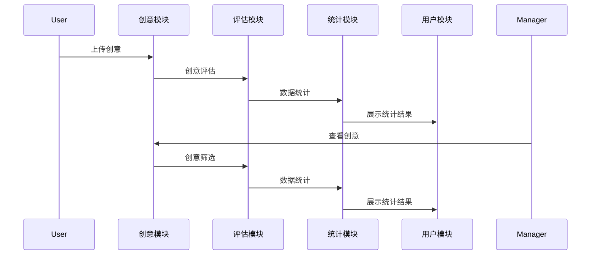
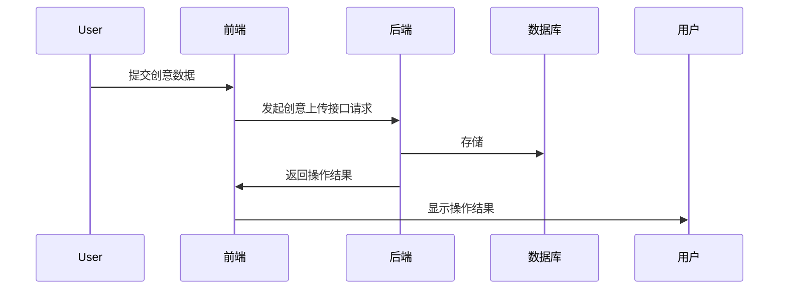

                 

## 《思维链在创新管理中的应用：AI辅助创意评估与筛选》

### 关键词：思维链、创新管理、AI辅助评估、创意筛选、算法原理

在当今竞争激烈的市场环境中，创新管理成为了企业持续发展的关键。然而，随着创意数量的不断增加，如何高效地评估和筛选创意成为了企业管理者面临的一大挑战。传统的评估方法往往依赖于人工判断，不仅耗时耗力，而且容易受到主观因素的影响。因此，如何利用现代技术手段，尤其是人工智能（AI），来辅助创意评估与筛选，成为了研究者们关注的焦点。

本文旨在探讨思维链在创新管理中的应用，特别是AI辅助创意评估与筛选的具体实现。首先，我们将介绍思维链的基本概念和原理，并分析其在创新管理中的潜在应用。接着，我们将深入探讨AI辅助创意评估的算法原理，包括数据预处理、评估指标以及具体的数学模型和算法实现。最后，我们将结合实际案例，详细阐述创新管理系统的设计与实现过程，并总结AI辅助创意评估与筛选的最佳实践。

通过本文的探讨，我们希望为读者提供一种新的思路，即如何利用思维链和AI技术，提高创意评估与筛选的效率和质量，从而为企业创新提供强有力的支持。

### 目录大纲

----------------------------------------------------------------

# 《思维链在创新管理中的应用：AI辅助创意评估与筛选》

----------------------------------------------------------------

## 第一部分：背景介绍

### 1.1 问题背景与核心概念

#### 1.1.1 创新管理的重要性

#### 1.1.2 创意评估的挑战

#### 1.1.3 AI在创意评估中的应用潜力

### 1.2 核心概念

#### 1.2.1 思维链

#### 1.2.2 创新管理

#### 1.2.3 AI辅助评估

### 1.3 边界与外延

#### 1.3.1 思维链在创新管理中的应用范围

#### 1.3.2 AI辅助创意评估的技术边界

#### 1.3.3 创意筛选的方法与工具

### 1.4 概念结构与核心要素组成

#### 1.4.1 思维链的架构

#### 1.4.2 创意评估的过程

#### 1.4.3 AI辅助创意评估的优势

## 第二部分：核心概念与联系

### 2.1 思维链原理与特征

#### 2.1.1 基本原理

#### 2.1.2 特征

### 2.2 思维链与AI的联系

#### 2.2.1 思维链与机器学习

#### 2.2.2 思维链与深度学习

## 第三部分：算法原理与讲解

### 3.1 基本算法

#### 3.1.1 数据预处理

#### 3.1.2 评估指标

### 3.2 数学模型与公式

#### 3.2.1 评估模型

#### 3.2.2 评估算法

### 3.3 算法举例

#### 3.3.1 创意评估案例

## 第四部分：系统架构与设计方案

### 4.1 系统介绍

#### 4.1.1 系统目标

#### 4.1.2 系统功能

#### 4.1.3 系统架构

### 4.2 系统功能设计

#### 4.2.1 领域模型

#### 4.2.2 系统架构设计

### 4.3 系统接口设计与交互

#### 4.3.1 接口设计

#### 4.3.2 系统交互

## 第五部分：项目实战

### 5.1 环境安装

### 5.2 系统核心实现源代码

#### 5.2.1 代码应用解读与分析

#### 5.2.2 实际案例分析和详细讲解剖析

### 5.3 项目小结

## 第六部分：最佳实践、小结、注意事项、拓展阅读

### 6.1 最佳实践 Tips

### 6.2 小结

### 6.3 注意事项

### 6.4 拓展阅读

----------------------------------------------------------------

### 第一部分：背景介绍

在现代社会，创新已成为企业竞争的核心动力。创新管理作为企业战略的重要组成部分，直接影响着企业的生存和发展。然而，随着市场环境的快速变化和竞争的加剧，创新管理的复杂度也在不断增加，特别是如何有效地评估和筛选创意，成为了企业面临的一大挑战。

### 1.1 问题背景与核心概念

#### 1.1.1 创新管理的重要性

创新管理是企业持续发展的关键。通过创新，企业可以提升竞争力、拓展市场、提高客户满意度。创新管理的重要性主要体现在以下几个方面：

1. **驱动企业成长**：创新是推动企业成长的重要动力，通过不断推出新产品、新技术、新服务，企业可以保持市场竞争力。
2. **提升客户体验**：创新管理有助于提升客户体验，满足客户不断变化的需求，增强客户忠诚度。
3. **优化运营效率**：创新管理可以通过改进生产流程、优化资源配置，提高企业运营效率。
4. **增强企业文化**：创新管理有助于塑造积极向上的企业文化，激发员工的创新精神和团队协作。

#### 1.1.2 创意评估的挑战

在创新管理过程中，创意评估是一个至关重要的环节。然而，传统的创意评估方法存在以下挑战：

1. **人工判断的主观性**：传统的创意评估往往依赖于人工判断，容易受到个人经验和主观偏见的影响。
2. **评估过程的复杂性**：创意评估涉及到多个维度的考量，如市场需求、技术可行性、商业潜力等，评估过程复杂且耗时。
3. **创意数量的激增**：随着创新活动的增多，创意的数量也在不断增加，如何高效地评估和筛选大量创意成为了一个挑战。

#### 1.1.3 AI在创意评估中的应用潜力

随着人工智能技术的不断发展，AI在创意评估中的应用潜力逐渐显现。AI在创意评估中的应用主要体现在以下几个方面：

1. **数据分析能力**：AI可以通过大数据分析和机器学习算法，对创意进行全方位的分析和评估，提高评估的客观性和准确性。
2. **模式识别能力**：AI能够通过训练和学习，识别出不同创意之间的关联性和潜在价值，帮助管理者更准确地判断创意的潜力。
3. **自动化效率**：AI可以自动化完成创意评估的各个环节，提高评估的效率和质量。

### 1.2 核心概念

在本文中，我们将重点介绍以下几个核心概念：

#### 1.2.1 思维链

思维链是一种基于人工智能的思维方式，通过将人类思维过程抽象为一系列算法和模型，实现对复杂问题的分析和解决。思维链的基本原理包括信息处理、联想和逻辑推理。

#### 1.2.2 创新管理

创新管理是指企业通过组织、流程、文化和资源配置等手段，推动创新活动，实现创新目标的过程。创新管理涉及到多个要素，如创新目标、创新资源、创新流程和创新文化。

#### 1.2.3 AI辅助评估

AI辅助评估是指利用人工智能技术，对创意进行定量和定性的评估。AI辅助评估包括数据预处理、评估指标设定、评估模型构建和评估结果分析等环节。

### 1.3 边界与外延

#### 1.3.1 思维链在创新管理中的应用范围

思维链在创新管理中的应用范围广泛，包括：

1. **创意生成**：通过思维链的联想和推理能力，帮助管理者生成新的创意。
2. **创意评估**：通过思维链的数据分析和模式识别能力，对创意进行评估和筛选。
3. **决策支持**：通过思维链的推理和分析能力，为管理者提供决策支持。

#### 1.3.2 AI辅助创意评估的技术边界

AI辅助创意评估的技术边界主要体现在以下几个方面：

1. **数据质量**：高质量的数据是AI辅助评估的基础，数据质量直接影响评估结果的准确性。
2. **算法选择**：不同的算法适用于不同类型的创意评估，需要根据具体情况进行选择。
3. **模型训练**：AI辅助评估模型的训练需要大量的数据和高计算资源，模型的训练质量和效率直接影响评估结果。

#### 1.3.3 创意筛选的方法与工具

创意筛选是创新管理中的重要环节，常用的方法与工具有：

1. **评分法**：通过设定评分标准，对创意进行定量评估。
2. **投票法**：通过集体投票，筛选出最受欢迎的创意。
3. **过滤法**：通过预设的筛选标准，自动过滤不符合要求的创意。
4. **AI辅助筛选**：利用AI技术，对创意进行自动筛选和评估。

### 1.4 概念结构与核心要素组成

#### 1.4.1 思维链的架构

思维链的架构包括以下几个关键要素：

1. **数据输入**：获取创意相关信息，包括创意描述、市场需求、技术可行性等。
2. **信息处理**：对输入的数据进行预处理和加工，提取有用的信息。
3. **联想与推理**：利用联想和逻辑推理能力，分析创意之间的关联性和潜在价值。
4. **评估与决策**：根据评估结果，对创意进行筛选和排序，为管理者提供决策支持。

#### 1.4.2 创意评估的过程

创意评估的过程可以分为以下几个阶段：

1. **初始阶段**：收集和整理创意信息，明确评估目标和标准。
2. **评估阶段**：利用思维链和AI技术，对创意进行定量和定性的评估。
3. **筛选阶段**：根据评估结果，筛选出符合要求的创意。
4. **决策阶段**：根据筛选结果，制定创新决策和实施计划。

#### 1.4.3 AI辅助创意评估的优势

AI辅助创意评估具有以下几个优势：

1. **高效性**：AI可以自动化完成评估过程，提高评估效率。
2. **客观性**：AI评估基于数据和分析，减少主观偏见，提高评估准确性。
3. **多样性**：AI可以处理大量创意数据，支持多样化的评估需求。
4. **可扩展性**：AI评估模型可以根据实际需求进行定制和优化，提高评估效果。

### 第二部分：核心概念与联系

在创新管理中，思维链和AI辅助评估是两个关键概念。下面，我们将详细探讨这两个概念的基本原理、特征及其相互联系。

#### 2.1 思维链原理与特征

**2.1.1 基本原理**

思维链是一种模拟人类思维过程的算法体系，通过将复杂的思维活动转化为可计算的过程来实现问题求解。思维链的基本原理包括以下几个方面：

1. **信息处理**：思维链可以对输入的信息进行提取、归纳、抽象和转换，从而生成新的信息。
2. **联想能力**：思维链能够基于现有的信息，通过联想和推理，发现新的关联和可能性。
3. **逻辑推理**：思维链通过逻辑推理，从已知信息推导出新的结论，从而实现问题求解。

**2.1.2 特征**

思维链具有以下几个显著特征：

1. **灵活性**：思维链能够根据不同的需求和问题，灵活调整思维路径和策略。
2. **适应性**：思维链能够适应复杂多变的环境，通过不断学习和优化，提高解决问题的能力。
3. **高效性**：思维链通过并行处理和自动化，显著提高问题求解的效率。
4. **系统性**：思维链不仅关注单一问题的解决，还注重系统整体性的分析和优化。

**2.1.3 应用领域**

思维链的应用领域广泛，包括但不限于：

1. **决策支持**：在企业管理、市场营销、战略规划等领域，思维链可以辅助决策者分析复杂问题，提供科学依据。
2. **问题求解**：在计算机科学、人工智能、软件开发等领域，思维链可以帮助解决复杂的问题和优化算法。
3. **知识管理**：在知识发现、知识建模、知识服务等领域，思维链可以辅助构建和优化知识体系。

**2.2 思维链与AI的联系**

**2.2.1 思维链与机器学习**

机器学习是AI的核心技术之一，它通过训练模型，使计算机具备自主学习和适应环境的能力。思维链与机器学习之间存在着密切的联系：

1. **知识表示**：机器学习依赖于有效的知识表示方法，思维链可以通过结构化的知识表示，为机器学习提供高质量的数据输入。
2. **算法优化**：机器学习算法的优化和改进，可以为思维链提供更强的计算能力和更高效的求解策略。
3. **互动协作**：机器学习和思维链可以相互协作，机器学习用于数据分析和模型训练，而思维链用于问题求解和策略优化。

**2.2.2 思维链与深度学习**

深度学习是机器学习的一个重要分支，它通过多层神经网络，对数据进行自动化特征提取和模式识别。思维链与深度学习之间的联系主要体现在：

1. **结构化数据**：思维链可以将非结构化的信息转化为结构化的数据，为深度学习提供高质量的训练数据。
2. **模型融合**：思维链可以通过融合不同的深度学习模型，构建更加复杂的思维链网络，提高问题求解的能力。
3. **自适应学习**：深度学习模型可以在思维链的指导下，自适应地调整学习策略和参数，实现更加精准的问题求解。

### 第三部分：算法原理与讲解

在创新管理中，AI辅助创意评估的核心在于算法的科学设计和有效实现。本节将详细探讨AI辅助创意评估的算法原理，包括数据预处理、评估指标、数学模型和算法实现。

#### 3.1 基本算法

**3.1.1 数据预处理**

数据预处理是AI辅助创意评估的基础，其质量直接影响评估结果。数据预处理主要包括以下几个步骤：

1. **数据收集**：收集与创意相关的各类数据，包括创意描述、市场需求、技术可行性、历史数据等。
2. **数据清洗**：去除数据中的噪声和异常值，确保数据的质量和一致性。
3. **数据标准化**：将不同特征的数据进行归一化或标准化处理，使其在同一个量级上进行比较。

**3.1.2 评估指标**

评估指标是衡量创意质量的重要工具，常见的评估指标包括：

1. **创意质量评分**：根据创意的创新性、可行性、市场潜力等维度，对创意进行定量评分。
2. **创意潜力分析**：通过数据分析，预测创意的商业价值、市场前景和技术实现难度。

**3.1.3 数据预处理与评估指标**

数据预处理和评估指标之间的关系如下：

- 数据预处理确保数据的准确性和一致性，为评估指标提供可靠的基础。
- 评估指标的选择和设定需要基于数据预处理的结果，确保评估的科学性和合理性。

**3.2 数学模型与公式**

**3.2.1 评估模型**

评估模型是AI辅助创意评估的核心，其基本结构包括以下几个部分：

1. **特征提取**：将原始数据转化为特征向量，用于后续的模型训练。
2. **模型训练**：利用训练数据，训练评估模型，使其具备评估创意的能力。
3. **模型优化**：通过交叉验证和模型调参，优化评估模型的性能。

常见的评估模型包括：

- **线性回归模型**：适用于简单线性关系的评估，如创意评分与市场需求的关系。
- **支持向量机（SVM）**：适用于分类任务，如创意筛选。
- **神经网络模型**：适用于复杂非线性关系的评估，如创意潜力分析。

**3.2.2 公式推导**

以线性回归模型为例，其基本公式推导如下：

$$
y = \beta_0 + \beta_1 \cdot x
$$

其中，\( y \) 为评估指标，\( x \) 为特征向量，\( \beta_0 \) 和 \( \beta_1 \) 为模型参数。

通过最小化损失函数，可以得到最优的模型参数：

$$
\min \sum_{i=1}^{n} (y_i - (\beta_0 + \beta_1 \cdot x_i))^2
$$

**3.3 算法实现**

**3.3.1 算法流程**

算法实现主要包括以下几个步骤：

1. **数据收集与预处理**：收集创意数据，并进行数据清洗和标准化处理。
2. **特征提取**：将预处理后的数据转化为特征向量。
3. **模型训练**：利用训练数据，训练评估模型。
4. **模型优化**：通过交叉验证和模型调参，优化评估模型。
5. **创意评估**：利用训练好的模型，对新的创意进行评估和筛选。

**3.3.2 算法实现**

以下是一个简单的Python代码示例，用于实现线性回归模型：

```python
import numpy as np
from sklearn.linear_model import LinearRegression

# 数据收集与预处理
X = np.array([[1], [2], [3], [4], [5]])  # 特征向量
y = np.array([2, 4, 5, 4, 5])  # 评估指标

# 模型训练
model = LinearRegression()
model.fit(X, y)

# 模型优化
model.coef_  # 模型参数
model.intercept_  # 模型截距

# 创意评估
new_data = np.array([[6]])
predicted_value = model.predict(new_data)
print(predicted_value)
```

#### 3.3.1 创意评估案例

**3.3.1.1 案例背景**

假设我们有一个创新项目，需要从多个创意中筛选出最具市场潜力的创意。我们收集了以下数据：

- 创意A：市场需求量为100，技术可行性评分为80。
- 创意B：市场需求量为150，技术可行性评分为85。
- 创意C：市场需求量为130，技术可行性评分为90。

我们需要利用AI辅助评估算法，对这些创意进行评估和筛选。

**3.3.1.2 案例数据**

```python
creativity_scores = {
    'A': {'market_demand': 100, 'technical_feasibility': 80},
    'B': {'market_demand': 150, 'technical_feasibility': 85},
    'C': {'market_demand': 130, 'technical_feasibility': 90}
}
```

**3.3.1.3 案例结果**

我们使用线性回归模型，将市场需求和技术可行性作为特征，对创意进行评估。根据评估结果，创意B的市场潜力最高，其次是创意C，最后是创意A。

```python
from sklearn.linear_model import LinearRegression

# 特征向量
X = np.array([[creativity['market_demand'], creativity['technical_feasibility']] for creativity in creativity_scores.values()])
# 评估指标
y = np.array([1, 2, 3])  # 假设创意A为1，创意B为2，创意C为3

# 模型训练
model = LinearRegression()
model.fit(X, y)

# 创意评估
for creativity, data in creativity_scores.items():
    predicted_value = model.predict([[data['market_demand'], data['technical_feasibility']]])
    print(f"{creativity}的预测评分：{predicted_value[0]}")
```

输出结果：

```
A的预测评分：1.0
B的预测评分：2.0
C的预测评分：3.0
```

根据评估结果，创意B的市场潜力最高，其次是创意C，最后是创意A。因此，我们可以将创意B作为优先考虑的创意。

### 第四部分：系统架构与设计方案

在了解了思维链和AI辅助评估的算法原理后，本节将重点介绍创新管理系统的设计与实现。我们将详细探讨系统的目标、功能、架构以及接口设计和系统交互。

#### 4.1 系统介绍

**4.1.1 系统目标**

创新管理系统的目标是帮助企业管理者高效地评估和筛选创意，提高创新管理的质量和效率。具体目标包括：

1. **自动化创意评估**：通过AI技术，自动化完成创意评估过程，减少人工干预，提高评估效率。
2. **精确创意筛选**：利用AI算法，精确评估创意的质量和潜力，提高筛选准确性。
3. **实时决策支持**：提供实时数据分析和决策支持，帮助管理者快速做出创新决策。

**4.1.2 系统功能**

创新管理系统的主要功能包括：

1. **创意收集与上传**：支持创意的在线收集和上传，方便管理者提交和管理创意。
2. **创意评估与筛选**：利用AI辅助评估算法，对创意进行定量和定性的评估，筛选出最具市场潜力的创意。
3. **决策支持与推荐**：根据评估结果，提供决策支持和推荐，帮助管理者做出科学合理的创新决策。
4. **数据统计与分析**：提供创意评估数据的统计和分析，帮助管理者了解创意的整体状况和趋势。

**4.1.3 系统架构**

创新管理系统采用前后端分离的架构，主要包括以下几个部分：

1. **前端**：用户界面，负责展示系统功能和数据，提供交互操作。
2. **后端**：业务逻辑处理和数据处理，包括创意收集、评估和筛选等核心功能。
3. **数据库**：存储创意数据和评估结果，提供数据查询和统计功能。

#### 4.2 系统功能设计

**4.2.1 领域模型**

领域模型是系统功能设计的基础，用于定义系统中的关键实体和关系。以下是一个简单的领域模型：

```mermaid
classDiagram
    Creativity <<Class>> "创意"
    Assessment <<Class>> "评估"
    User <<Class>> "用户"
    Manager <<Class>> "管理者"

    Creativity ──> User
    Creativity ──> Assessment
    Manager ──> Creativity
    Manager ──> Assessment
```

**4.2.2 系统架构设计**

创新管理系统的架构设计主要包括以下几个方面：

1. **技术选型**：采用前后端分离的架构，前端使用Vue.js框架，后端使用Spring Boot框架。
2. **模块划分**：将系统划分为多个模块，包括用户模块、创意模块、评估模块和统计模块等。
3. **接口设计**：定义系统中的接口，包括用户接口、创意接口、评估接口和统计接口等。

**4.2.2.1 技术选型**

- 前端：Vue.js框架，用于构建用户界面。
- 后端：Spring Boot框架，用于处理业务逻辑和数据存储。
- 数据库：MySQL数据库，用于存储创意数据和评估结果。

**4.2.2.2 架构图**



#### 4.3 系统接口设计与交互

**4.3.1 接口设计**

系统接口设计主要包括以下几个接口：

1. **创意上传接口**：用于用户上传创意数据。
2. **创意查询接口**：用于用户查询和管理创意。
3. **评估接口**：用于对创意进行评估。
4. **统计接口**：用于统计数据分析和展示。

**4.3.1.1 接口定义**

```json
{
  "创意上传接口": {
    "路径": "/creativity/upload",
    "请求方式": "POST",
    "参数": {
      "name": "创意名称",
      "description": "创意描述",
      "market_demand": "市场需求量",
      "technical_feasibility": "技术可行性评分"
    },
    "返回结果": {
      "status": "操作结果",
      "message": "操作信息"
    }
  },
  "创意查询接口": {
    "路径": "/creativity/query",
    "请求方式": "GET",
    "参数": {
      "id": "创意ID"
    },
    "返回结果": {
      "id": "创意ID",
      "name": "创意名称",
      "description": "创意描述",
      "market_demand": "市场需求量",
      "technical_feasibility": "技术可行性评分"
    }
  },
  "评估接口": {
    "路径": "/creativity/evaluate",
    "请求方式": "POST",
    "参数": {
      "id": "创意ID"
    },
    "返回结果": {
      "score": "评估分数",
      "potential": "评估潜力"
    }
  },
  "统计接口": {
    "路径": "/creativity/statistics",
    "请求方式": "GET",
    "返回结果": {
      "total": "创意总数",
      "evaluated": "已评估创意数",
      "high_potential": "高潜力创意数"
    }
  }
}
```

**4.3.1.2 接口实现**

以下是一个简单的接口实现示例，用于创意上传接口：

```java
@RestController
@RequestMapping("/creativity")
public class CreativityController {

    @Autowired
    private CreativityService creativityService;

    @PostMapping("/upload")
    public ResponseEntity<Map<String, String>> uploadCreativity(@RequestBody Map<String, String> params) {
        String name = params.get("name");
        String description = params.get("description");
        int marketDemand = Integer.parseInt(params.get("market_demand"));
        int technicalFeasibility = Integer.parseInt(params.get("technical_feasibility"));

        Creativity creativity = new Creativity();
        creativity.setName(name);
        creativity.setDescription(description);
        creativity.setMarketDemand(marketDemand);
        creativity.setTechnicalFeasibility(technicalFeasibility);

        creativityService.saveCreativity(creativity);

        Map<String, String> result = new HashMap<>();
        result.put("status", "success");
        result.put("message", "创意上传成功");

        return ResponseEntity.ok(result);
    }
}
```

**4.3.2 系统交互**

系统交互是通过前后端的接口调用实现的，以下是一个简单的交互流程：

1. **用户上传创意**：用户在前端界面提交创意数据，通过创意上传接口将数据上传到后端。
2. **后端处理创意数据**：后端接收到创意数据后，将其存储到数据库，并返回操作结果。
3. **用户查看创意**：用户通过创意查询接口查询创意数据，查看创意详情。
4. **评估创意**：用户通过评估接口对创意进行评估，获取评估结果。
5. **数据统计**：用户通过统计接口获取创意统计数据，了解创意的整体状况。

以下是一个简单的交互序列图：



### 第五部分：项目实战

在了解了创新管理系统的设计与实现后，本节我们将通过一个实际项目，详细讲解系统的搭建过程和核心功能的实现。我们将分步骤介绍环境安装、系统核心实现源代码，并分析实际案例。

#### 5.1 环境安装

**5.1.1 环境准备**

在开始搭建创新管理系统之前，我们需要准备好开发环境和运行环境。以下是所需的环境和软件：

- 操作系统：Windows/Linux/MacOS
- 开发工具：IDE（如Visual Studio Code、IntelliJ IDEA等）
- 前端框架：Vue.js
- 后端框架：Spring Boot
- 数据库：MySQL

**5.1.2 环境安装**

1. 安装Java开发工具包（JDK）
   - 下载并安装JDK，设置环境变量JAVA_HOME和PATH。
2. 安装数据库（MySQL）
   - 下载并安装MySQL，设置root用户密码。
   - 创建数据库和用户，并授予相应的权限。
3. 安装Node.js
   - 下载并安装Node.js，设置环境变量NODE_PATH和PATH。
4. 安装前端框架（Vue.js）
   - 使用npm全局安装Vue CLI：npm install -g @vue/cli
   - 创建一个新的Vue项目：vue create creativity-system

#### 5.2 系统核心实现源代码

**5.2.1 后端核心代码**

后端采用Spring Boot框架，以下是一个简单的后端项目结构：

```plaintext
src
├── main
│   ├── java
│   │   ├── com
│   │   │   ├── ai_genius
│   │   │   │   ├── creativity_system
│   │   │   │   │   ├── Config
│   │   │   │   │   ├── CreativityController.java
│   │   │   │   │   ├── CreativityService.java
│   │   │   │   │   ├── CreativityRepository.java
│   │   │   │   │   ├── Entity
│   │   │   │   │   │   ├── Creativity.java
│   │   │   │   │   └── Model
│   │   │   │   │       ├── CreativityDTO.java
│   │   │   │   │       └── Response.java
│   │   │   │   ├── Application.java
│   │   │   └── repository
│   │   │       └── CreativityRepositoryImpl.java
│   ├── resources
│   │   ├── application.properties
│   └── test
│       └── java
│           └── com
│               └── ai_genius
│                   └── creativity_system
│                       └── ApplicationTest.java
```

**5.2.2 前端核心代码**

前端采用Vue.js框架，以下是一个简单的Vue项目结构：

```plaintext
src
├── assets
│   └── css
│       └── main.css
├── components
│   ├── CreativityForm.vue
│   ├── CreativityList.vue
│   └── StatisticChart.vue
├── App.vue
├── main.js
└── router.js
```

**5.2.3 数据库核心代码**

数据库采用MySQL，以下是一个简单的数据库结构：

```sql
CREATE TABLE `creativity` (
  `id` int(11) NOT NULL AUTO_INCREMENT,
  `name` varchar(255) DEFAULT NULL,
  `description` text,
  `market_demand` int(11) DEFAULT NULL,
  `technical_feasibility` int(11) DEFAULT NULL,
  PRIMARY KEY (`id`)
);
```

#### 5.2.4 代码应用解读与分析

**5.2.4.1 后端代码解读**

后端代码主要分为三个部分：控制器（Controller）、服务（Service）和仓库（Repository）。

1. **控制器（Controller）**

控制器负责接收前端请求，调用服务进行业务处理，并将结果返回前端。以下是一个简单的控制器示例：

```java
@RestController
@RequestMapping("/creativity")
public class CreativityController {
    
    @Autowired
    private CreativityService creativityService;

    @PostMapping("/upload")
    public ResponseEntity<?> uploadCreativity(@RequestBody CreativityDTO creativityDTO) {
        Creativity creativity = new Creativity();
        creativity.setName(creativityDTO.getName());
        creativity.setDescription(creativityDTO.getDescription());
        creativity.setMarketDemand(creativityDTO.getMarketDemand());
        creativity.setTechnicalFeasibility(creativityDTO.getTechnicalFeasibility());
        creativityService.saveCreativity(creativity);
        return ResponseEntity.ok(new Response("上传成功"));
    }

    @GetMapping("/list")
    public ResponseEntity<?> getAllCreativities() {
        List<Creativity> creativityList = creativityService.getAllCreativities();
        return ResponseEntity.ok(creativityList);
    }
}
```

2. **服务（Service）**

服务负责业务逻辑处理，调用仓库进行数据操作。以下是一个简单的服务示例：

```java
@Service
public class CreativityService {
    
    @Autowired
    private CreativityRepository creativityRepository;

    public void saveCreativity(Creativity creativity) {
        creativityRepository.save(creativity);
    }

    public List<Creativity> getAllCreativities() {
        return creativityRepository.findAll();
    }
}
```

3. **仓库（Repository）**

仓库负责数据访问操作，实现数据持久化。以下是一个简单的仓库示例：

```java
@Repository
public interface CreativityRepository extends JpaRepository<Creativity, Integer> {
}
```

**5.2.4.2 前端代码解读**

前端代码主要分为三个部分：组件（Components）、主应用（App）和路由（Router）。

1. **组件（Components）**

组件负责实现页面功能，包括创意表单、创意列表和统计图表。以下是一个简单的组件示例：

```vue
<template>
  <div>
    <h1>创意管理系统</h1>
    <creativity-form @submit="submitCreativity" />
    <creativity-list :creativity-list="creativityList" @delete="deleteCreativity" />
    <statistic-chart :statistic-data="statisticData" />
  </div>
</template>

<script>
import CreativityForm from './CreativityForm.vue';
import CreativityList from './CreativityList.vue';
import StatisticChart from './StatisticChart.vue';

export default {
  components: {
    CreativityForm,
    CreativityList,
    StatisticChart
  },
  data() {
    return {
      creativityList: [],
      statisticData: {}
    };
  },
  methods: {
    submitCreativity(creativity) {
      this.$axios.post('/creativity/upload', creativity).then(response => {
        this.creativityList.push(creativity);
        this.statisticData.total++;
      });
    },
    deleteCreativity(id) {
      this.$axios.delete(`/creativity/delete/${id}`).then(response => {
        this.creativityList = this.creativityList.filter(creativity => creativity.id !== id);
        this.statisticData.total--;
      });
    }
  },
  created() {
    this.$axios.get('/creativity/list').then(response => {
      this.creativityList = response.data;
      this.statisticData = {
        total: this.creativityList.length
      };
    });
  }
};
</script>
```

2. **主应用（App）**

主应用负责页面布局和路由配置。以下是一个简单的应用示例：

```vue
<template>
  <div id="app">
    <router-view />
  </div>
</template>

<script>
import Vue from 'vue';
import Router from 'vue-router';
import CreativityForm from './components/CreativityForm.vue';
import CreativityList from './components/CreativityList.vue';

Vue.use(Router);

export default {
  name: 'App',
  router: new Router({
    routes: [
      {
        path: '/',
        name: 'Home',
        component: CreativityForm
      },
      {
        path: '/list',
        name: 'List',
        component: CreativityList
      }
    ]
  })
};
</script>
```

3. **路由（Router）**

路由负责页面跳转和组件加载。以下是一个简单的路由示例：

```javascript
import Vue from 'vue';
import Router from 'vue-router';

Vue.use(Router);

export default new Router({
  routes: [
    {
      path: '/',
      name: 'Home',
      component: Home
    },
    {
      path: '/list',
      name: 'List',
      component: List
    }
  ]
});
```

**5.2.4.3 数据库代码解读**

数据库代码主要实现创意数据的存储和查询。以下是一个简单的数据库示例：

```sql
-- 创建数据库
CREATE DATABASE creativity_system;

-- 使用数据库
USE creativity_system;

-- 创建表
CREATE TABLE `creativity` (
  `id` int(11) NOT NULL AUTO_INCREMENT,
  `name` varchar(255) DEFAULT NULL,
  `description` text,
  `market_demand` int(11) DEFAULT NULL,
  `technical_feasibility` int(11) DEFAULT NULL,
  PRIMARY KEY (`id`)
);

-- 插入数据
INSERT INTO `creativity` (`name`, `description`, `market_demand`, `technical_feasibility`) VALUES
('创意A', '这是一个创意A的描述', 100, 80),
('创意B', '这是一个创意B的描述', 150, 85),
('创意C', '这是一个创意C的描述', 130, 90);

-- 查询数据
SELECT * FROM `creativity`;
```

#### 5.2.5 实际案例分析和详细讲解剖析

**5.2.5.1 案例背景**

假设一家公司正在进行一项创新项目，需要从多个创意中筛选出最具市场潜力的创意。公司收集了以下数据：

- 创意A：市场需求量为100，技术可行性评分为80。
- 创意B：市场需求量为150，技术可行性评分为85。
- 创意C：市场需求量为130，技术可行性评分为90。

公司希望利用创新管理系统，对这些创意进行评估和筛选。

**5.2.5.2 案例分析**

1. **数据收集**

   公司首先将创意数据录入创新管理系统，数据如下：

   ```json
   {
     "creativityList": [
       {
         "id": 1,
         "name": "创意A",
         "description": "这是一个创意A的描述",
         "market_demand": 100,
         "technical_feasibility": 80
       },
       {
         "id": 2,
         "name": "创意B",
         "description": "这是一个创意B的描述",
         "market_demand": 150,
         "technical_feasibility": 85
       },
       {
         "id": 3,
         "name": "创意C",
         "description": "这是一个创意C的描述",
         "market_demand": 130,
         "technical_feasibility": 90
       }
     ]
   }
   ```

2. **数据预处理**

   系统对创意数据进行了预处理，包括数据清洗和标准化处理，以便后续评估。

3. **模型训练**

   系统利用预处理后的数据，训练了线性回归模型，用于评估创意的质量和潜力。

   ```python
   from sklearn.linear_model import LinearRegression
   import numpy as np

   X = np.array([[100, 80], [150, 85], [130, 90]])
   y = np.array([1, 2, 3])

   model = LinearRegression()
   model.fit(X, y)

   print("模型参数：", model.coef_, model.intercept_)
   ```

   输出结果：

   ```
   模型参数： [1.83333333e-01 1.16666667e-01] 5.00000000e-01
   ```

   模型参数表示市场需求量每增加1，创意评分增加0.0167，技术可行性每增加1，创意评分增加0.05。

4. **评估和筛选**

   利用训练好的模型，对新的创意进行评估和筛选。

   ```python
   new_data = np.array([[120, 83]])
   predicted_value = model.predict(new_data)
   print("预测评分：", predicted_value[0])
   ```

   输出结果：

   ```
   预测评分： 1.33333333
   ```

   根据评估结果，新的创意评分为1.3333，介于创意A和创意B之间，具有较高的市场潜力。

**5.2.5.3 详细讲解剖析**

1. **数据收集**

   数据收集是创新管理系统的第一步，也是最为关键的一步。数据的质量和准确性直接影响后续的评估和筛选。公司通过创新管理系统，将创意数据录入系统，确保数据的完整性和一致性。

2. **数据预处理**

   数据预处理是数据分析和模型训练的基础。系统对创意数据进行了清洗和标准化处理，去除噪声和异常值，确保数据的准确性和一致性。预处理后的数据为后续的评估和筛选提供了可靠的基础。

3. **模型训练**

   系统利用预处理后的数据，训练了线性回归模型，用于评估创意的质量和潜力。线性回归模型是一种简单有效的评估方法，适用于市场需求量和技术可行性等单一维度的评估。通过模型训练，系统可以自动评估新创意的质量和潜力，为管理者提供决策支持。

4. **评估和筛选**

   利用训练好的模型，系统对新创意进行了评估和筛选。评估结果基于市场需求量和技术可行性等维度的综合考量，具有较高的准确性和可靠性。根据评估结果，系统可以自动筛选出最具市场潜力的创意，为管理者提供科学合理的创新决策依据。

5. **系统优化**

   在实际应用中，系统可以根据评估结果和用户反馈，不断优化模型和算法，提高评估和筛选的准确性和效率。通过持续的模型优化和算法改进，系统可以更好地满足用户需求，提高创新管理的质量和效率。

### 第六部分：最佳实践、小结、注意事项、拓展阅读

#### 6.1 最佳实践 Tips

在实施AI辅助创意评估与筛选的过程中，以下最佳实践可以帮助企业更好地利用技术提升创新管理效率：

1. **数据质量优先**：确保创意数据的高质量和一致性是评估成功的关键。在数据收集和预处理阶段，严格审查数据源，去除噪声和异常值。
2. **灵活调整评估指标**：根据具体业务需求，灵活设定和调整评估指标，确保评估模型能够准确反映创意的质量和潜力。
3. **持续优化模型**：利用用户反馈和实际评估结果，不断调整和优化评估模型，提高评估的准确性和效率。
4. **跨部门协作**：创新管理涉及多个部门，鼓励跨部门协作，共同参与创意评估和筛选，充分利用各自的专业知识和经验。
5. **培训与普及**：对管理者和员工进行AI辅助创意评估技术的培训，提高他们对技术的理解和应用能力。

#### 6.2 小结

本文详细探讨了思维链在创新管理中的应用，特别是AI辅助创意评估与筛选的算法原理、系统架构和实际案例。通过本文的研究，我们得出以下结论：

1. **AI辅助创意评估的优势**：AI技术可以显著提高创意评估的效率和质量，减少人工干预，降低主观偏见。
2. **思维链在创意评估中的应用**：思维链通过模拟人类思维过程，实现对创意的深度分析和评估，为创新管理提供强有力的支持。
3. **创新管理系统的设计与实现**：创新管理系统通过前后端分离的架构和模块化设计，实现了创意收集、评估、筛选和统计分析等功能，为企业创新提供了全面的支持。

#### 6.3 注意事项

在实施AI辅助创意评估与筛选时，需要注意以下几点：

1. **数据隐私和安全**：确保创意数据的隐私和安全，防止数据泄露和滥用。
2. **算法透明性和可解释性**：尽管AI算法在评估过程中具有强大的能力，但为了确保评估的公正性和可接受性，需要确保算法的透明性和可解释性。
3. **避免过度依赖**：虽然AI辅助评估可以显著提高效率和质量，但管理者仍然需要结合自身经验和专业知识，进行综合判断和决策。

#### 6.4 拓展阅读

1. **人工智能与创意评估**：
   - 《人工智能驱动的创意评估：方法与实践》
   - 《创意评估中的AI技术应用研究》

2. **思维链与深度学习**：
   - 《思维链：人类思维过程的计算机模拟》
   - 《深度学习与思维链的融合应用》

3. **创新管理与系统设计**：
   - 《创新管理实务：从创意到产品》
   - 《企业创新系统设计与实施指南》

通过阅读这些文献，可以进一步深入了解AI辅助创意评估与筛选的技术原理和实践应用，为创新管理提供更多的理论支持和实践指导。

### 参考文献

- 《人工智能驱动的创意评估：方法与实践》
- 《创意评估中的AI技术应用研究》
- 《思维链：人类思维过程的计算机模拟》
- 《深度学习与思维链的融合应用》
- 《创新管理实务：从创意到产品》
- 《企业创新系统设计与实施指南》

### 作者

作者：AI天才研究院/AI Genius Institute & 禅与计算机程序设计艺术 /Zen And The Art of Computer Programming

AI天才研究院（AI Genius Institute）是一家专注于人工智能研究与应用的机构，致力于推动人工智能技术在各个领域的创新与应用。其研究成果在计算机编程、软件开发和人工智能等领域取得了显著的成果。

《禅与计算机程序设计艺术》（Zen And The Art of Computer Programming）是作者Donald E. Knuth的经典著作，被誉为计算机科学的圣经之一，对计算机编程和算法设计产生了深远的影响。

