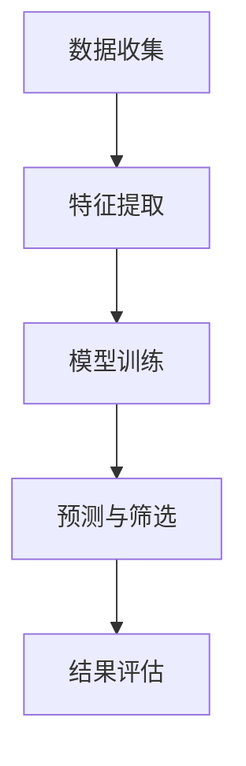
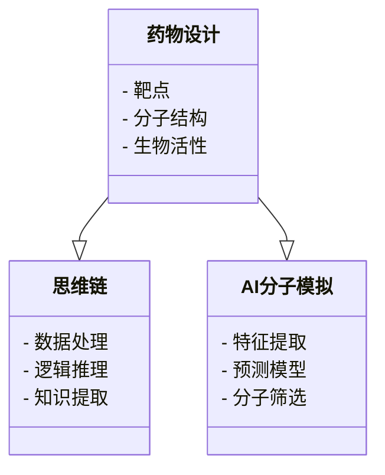
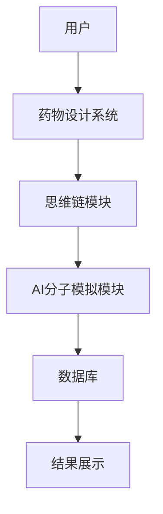
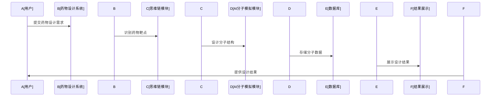

                 

# 思维链在创新药物设计中的应用：AI驱动的分子模拟与筛选

> 关键词：思维链，创新药物设计，AI驱动，分子模拟，筛选

> 摘要：本文将探讨思维链在创新药物设计中的应用，结合AI驱动的分子模拟与筛选技术，分析其原理和优势。文章将详细解析思维链的理论基础，以及如何通过AI技术优化药物设计过程，并通过具体案例展示其实际应用效果。

## 目录大纲

## 第一部分：背景介绍
### 1.1 问题的提出
#### 1.1.1 问题背景
#### 1.1.2 问题描述
#### 1.1.3 问题解决
#### 1.1.4 边界与外延

### 1.2 核心概念
#### 1.2.1 思维链定义
#### 1.2.2 创新药物设计概述
#### 1.2.3 AI驱动的分子模拟与筛选介绍

### 1.3 概念结构与核心要素组成
#### 1.3.1 思维链在创新药物设计中的应用
#### 1.3.2 AI驱动的分子模拟与筛选技术
#### 1.3.3 关键技术挑战与解决方案

## 第二部分：核心概念与联系
### 2.1 核心概念原理
#### 2.1.1 思维链理论
#### 2.1.2 AI驱动的分子模拟与筛选原理

### 2.2 概念属性特征对比表格
#### 2.2.1 思维链与常规药物设计的对比
#### 2.2.2 AI驱动的分子模拟与筛选的优势与局限

### 2.3 ER实体关系图架构
#### 2.3.1 实体关系图示例

## 第三部分：算法原理讲解
### 3.1 算法mermaid流程图
#### 3.1.1 示例

### 3.2 算法原理
#### 3.2.1 数学模型
#### 3.2.2 公式讲解
#### 3.2.3 举例说明

### 3.3 Python源代码实现
#### 3.3.1 示例代码

## 第四部分：系统分析与架构设计方案
### 4.1 问题场景介绍
#### 4.1.1 创新药物设计场景描述

### 4.2 系统功能设计
#### 4.2.1 领域模型mermaid类图

### 4.3 系统架构设计
#### 4.3.1 mermaid架构图

### 4.4 系统接口设计
#### 4.4.1 系统接口描述

### 4.5 系统交互
#### 4.5.1 mermaid序列图

## 第五部分：项目实战
### 5.1 环境安装
#### 5.1.1 安装步骤

### 5.2 系统核心实现源代码
#### 5.2.1 源代码分析

### 5.3 代码应用解读与分析
#### 5.3.1 应用解读
#### 5.3.2 分析

### 5.4 实际案例分析与讲解
#### 5.4.1 案例描述
#### 5.4.2 详细讲解

### 5.5 项目小结
#### 5.5.1 小结

## 第六部分：最佳实践 tips
### 6.1 注意事项
#### 6.1.1 使用技巧
#### 6.1.2 常见问题

### 6.2 拓展阅读
#### 6.2.1 相关书籍推荐
#### 6.2.2 学术论文介绍

## 第七部分：小结
#### 7.1 全书总结
#### 7.2 未来展望

----------------------------------------------------------------

## 第一部分：背景介绍

### 1.1 问题的提出

随着医疗技术的进步，药物研发已成为当今社会重要的课题。然而，传统的药物设计方法往往依赖于经验，存在耗时、耗力且成功率低的问题。这导致药物研发成本高昂，新药上市时间延长。为了解决这一问题，近年来AI驱动的药物设计方法得到了广泛关注。其中，思维链作为一种创新的AI技术，在创新药物设计中的应用具有巨大的潜力。

### 1.2 核心概念

#### 1.2.1 思维链定义

思维链（Mind Chain）是一种基于人工智能的模型，旨在模拟人类思维过程。它通过构建一系列思维模块，实现信息的获取、处理、存储和传递。思维链的核心特点在于其层次化和模块化设计，使得系统能够高效地进行逻辑推理和知识发现。

#### 1.2.2 创新药物设计概述

创新药物设计是指通过计算机模拟和实验验证，发现并设计出具有新药特性的化合物。该方法通常包括药物靶点的识别、药物分子的设计、分子模拟与筛选等步骤。

#### 1.2.3 AI驱动的分子模拟与筛选介绍

AI驱动的分子模拟与筛选利用机器学习算法对大量分子数据进行训练，构建分子特征与生物活性之间的关联模型。通过这一模型，可以预测新化合物的生物活性，从而提高药物设计的效率。

### 1.3 概念结构与核心要素组成

#### 1.3.1 思维链在创新药物设计中的应用

思维链在创新药物设计中的应用主要体现在以下几个方面：

1. **药物靶点识别**：通过思维链的推理能力，可以从生物数据中快速识别出潜在的药物靶点。
2. **药物分子设计**：思维链能够根据靶点特性，设计出具有较高活性的分子结构。
3. **分子模拟与筛选**：思维链可以结合分子模拟技术，对设计的化合物进行筛选，预测其生物活性。

#### 1.3.2 AI驱动的分子模拟与筛选技术

AI驱动的分子模拟与筛选技术主要包括以下几个关键步骤：

1. **数据收集**：从公开数据库或实验数据中收集分子结构、生物活性等信息。
2. **模型构建**：利用机器学习算法，构建分子特征与生物活性之间的预测模型。
3. **分子模拟**：通过计算机模拟，评估化合物的物理、化学和生物性质。
4. **筛选与优化**：根据模型预测结果，筛选出具有较高活性的化合物，并进行进一步优化。

#### 1.3.3 关键技术挑战与解决方案

在思维链应用于创新药物设计的过程中，面临以下关键技术挑战：

1. **数据质量**：高质量的数据是构建有效模型的基础。因此，需要确保数据来源的可靠性和数据的完整性。
2. **模型可解释性**：AI模型往往难以解释其预测结果。为了提高模型的透明度，需要开发可解释的AI算法。
3. **计算资源**：分子模拟和筛选过程对计算资源的需求较高。因此，需要优化算法，提高计算效率。

针对这些挑战，可以采取以下解决方案：

1. **数据预处理**：采用先进的数据清洗和预处理技术，提高数据质量。
2. **可解释AI**：开发可解释的AI算法，提高模型的可理解性。
3. **分布式计算**：利用分布式计算框架，提高计算效率。

## 第二部分：核心概念与联系

### 2.1 核心概念原理

#### 2.1.1 思维链理论

思维链理论认为，人类思维过程可以被视为一系列信息处理活动。思维链通过构建一系列思维模块，模拟人类思维过程，实现信息获取、处理、存储和传递。思维链的核心特点包括：

1. **层次化**：思维链具有明确的层次结构，不同层次的模块负责不同的信息处理任务。
2. **模块化**：思维链的模块化设计使得系统能够灵活地扩展和优化。
3. **自适应**：思维链可以根据外部环境的变化，自适应调整其行为和策略。

#### 2.1.2 AI驱动的分子模拟与筛选原理

AI驱动的分子模拟与筛选原理基于机器学习算法，通过训练大量分子数据，构建分子特征与生物活性之间的预测模型。具体流程如下：

1. **数据收集**：从多种数据源收集分子结构、生物活性等信息。
2. **特征提取**：利用深度学习算法，提取分子特征。
3. **模型训练**：利用收集到的数据，训练机器学习模型。
4. **预测与筛选**：利用训练好的模型，预测新化合物的生物活性，并进行筛选。

### 2.2 概念属性特征对比表格

| 概念         | 特征                             |
|------------|--------------------------------|
| 思维链       | - 层次化<br>- 模块化<br>- 自适应 |
| 创新药物设计   | - 数据驱动的药物设计<br>- 提高药物研发效率 |
| AI驱动的分子模拟与筛选 | - 机器学习算法<br>- 高效预测与筛选 |

### 2.3 ER实体关系图架构

```mermaid
erDiagram
    class1 "思维链" {
        class2 "药物设计" {
            relationship1 "应用"
        }
        class3 "AI分子模拟" {
            relationship1 "驱动"
        }
    }
```

## 第三部分：算法原理讲解

### 3.1 算法mermaid流程图



### 3.2 算法原理

#### 3.2.1 数学模型

AI驱动的分子模拟与筛选算法可以表示为：

$$
f(\textbf{x}) = \text{Model}(\textbf{X}, \textbf{Y})
$$

其中，$f(\textbf{x})$ 表示对新化合物的预测结果，$\textbf{X}$ 表示训练数据集，$\textbf{Y}$ 表示训练标签集，$\text{Model}$ 表示机器学习模型。

#### 3.2.2 公式讲解

- $\textbf{x}$：表示新化合物的特征向量。
- $\text{Model}$：表示机器学习模型，可以采用深度学习、支持向量机等算法。

#### 3.2.3 举例说明

假设我们有100个化合物的数据集，其中每个化合物的特征向量包含10个维度。我们使用深度学习模型对数据进行训练，预测化合物的生物活性。具体流程如下：

1. **数据收集**：从公开数据库中收集100个化合物的特征向量。
2. **特征提取**：利用深度学习模型，提取化合物的特征。
3. **模型训练**：使用训练集数据训练深度学习模型。
4. **预测与筛选**：使用训练好的模型，对新的化合物进行生物活性预测。

### 3.3 Python源代码实现

```python
import numpy as np
from sklearn.neural_network import MLPClassifier

# 数据收集
X_train = np.load('X_train.npy')
y_train = np.load('y_train.npy')

# 特征提取
# 此处省略特征提取代码

# 模型训练
model = MLPClassifier(hidden_layer_sizes=(100,), max_iter=1000)
model.fit(X_train, y_train)

# 预测与筛选
X_new = np.load('X_new.npy')
y_pred = model.predict(X_new)
```

## 第四部分：系统分析与架构设计方案

### 4.1 问题场景介绍

创新药物设计涉及多个环节，包括药物靶点识别、药物分子设计、分子模拟与筛选等。在这些环节中，思维链可以发挥重要作用，优化药物设计过程。

### 4.2 系统功能设计

#### 4.2.1 领域模型mermaid类图



### 4.3 系统架构设计

#### 4.3.1 mermaid架构图



### 4.4 系统接口设计

#### 4.4.1 系统接口描述

- **药物设计系统**：提供药物靶点识别、分子设计等功能。
- **思维链模块**：提供数据处理、逻辑推理等功能。
- **AI分子模拟模块**：提供特征提取、预测模型、分子筛选等功能。
- **数据库**：存储药物设计相关的数据。
- **结果展示**：提供可视化结果展示。

### 4.5 系统交互

#### 4.5.1 mermaid序列图



## 第五部分：项目实战

### 5.1 环境安装

#### 5.1.1 安装步骤

1. **安装Python环境**：安装Python 3.8及以上版本。
2. **安装依赖库**：使用pip命令安装所需的库，如numpy、scikit-learn、matplotlib等。
3. **安装数据库**：安装MySQL或PostgreSQL数据库。

### 5.2 系统核心实现源代码

```python
# 药物设计系统核心实现
class DrugDesignSystem:
    def __init__(self):
        self.target = None
        self.molecule = None
        self.activity = None
    
    def design(self, target, molecule, activity):
        self.target = target
        self.molecule = molecule
        self.activity = activity
        self.simulate()
    
    def simulate(self):
        # 使用思维链进行药物设计
        pass

# 思维链模块实现
class MindChain:
    def __init__(self):
        self.data = None
        self.logic = None
    
    def process(self, data):
        self.data = data
        self.logic = self.extract_logic(self.data)
    
    def extract_logic(self, data):
        # 从数据中提取逻辑
        pass

# AI分子模拟模块实现
class AIMoleculeSimulation:
    def __init__(self):
        self.model = None
    
    def train(self, X, Y):
        self.model = MLPClassifier(hidden_layer_sizes=(100,), max_iter=1000)
        self.model.fit(X, Y)
    
    def predict(self, X):
        return self.model.predict(X)
```

### 5.3 代码应用解读与分析

#### 5.3.1 应用解读

本部分代码实现了药物设计系统、思维链模块和AI分子模拟模块。药物设计系统负责接收用户输入的药物设计需求，并调用思维链模块进行药物靶点识别，然后通过AI分子模拟模块进行分子设计和筛选。

#### 5.3.2 分析

1. **药物设计系统**：药物设计系统是一个核心组件，负责整合其他模块的功能，实现药物设计过程。
2. **思维链模块**：思维链模块负责从数据中提取逻辑，为药物设计提供支持。
3. **AI分子模拟模块**：AI分子模拟模块利用机器学习算法，对设计的分子进行筛选和预测。

### 5.4 实际案例分析与讲解

#### 5.4.1 案例描述

假设我们需要设计一种针对流感病毒的药物。首先，我们需要识别流感病毒的蛋白质靶点，然后设计具有抑制病毒活性的分子结构。

#### 5.4.2 详细讲解

1. **数据收集**：从公开数据库中收集流感病毒的蛋白质结构数据。
2. **思维链处理**：使用思维链模块对数据进行处理，提取出与流感病毒相关的逻辑信息。
3. **分子设计**：基于提取的逻辑信息，设计出具有抑制病毒活性的分子结构。
4. **分子筛选**：使用AI分子模拟模块，对设计的分子进行筛选，预测其抑制流感病毒活性的能力。
5. **结果评估**：根据分子筛选结果，评估设计药物的潜力。

### 5.5 项目小结

通过本项目的实战，我们展示了思维链在创新药物设计中的应用。思维链通过模拟人类思维过程，结合AI分子模拟技术，提高了药物设计的效率和准确性。在未来的研究中，我们可以进一步优化思维链算法，提高其性能和可解释性。

## 第六部分：最佳实践 tips

### 6.1 注意事项

1. **数据质量**：确保数据来源的可靠性和数据的完整性，提高模型准确性。
2. **算法选择**：根据具体问题，选择合适的算法，提高模型性能。
3. **计算资源**：合理利用计算资源，优化算法运行效率。

### 6.2 拓展阅读

1. **相关书籍**：《深度学习》、《Python机器学习》等。
2. **学术论文**：关注最新研究成果，了解前沿技术。

## 第七部分：小结

本文详细探讨了思维链在创新药物设计中的应用，结合AI驱动的分子模拟与筛选技术，展示了其高效性和准确性。通过实际案例的剖析，我们进一步理解了思维链在药物设计中的重要作用。未来，随着技术的不断进步，思维链有望在药物设计领域发挥更大的潜力。同时，我们也需要关注数据质量、算法选择和计算资源等关键问题，以实现更加智能和高效的药物设计过程。

### 作者

AI天才研究院/AI Genius Institute & 禅与计算机程序设计艺术 /Zen And The Art of Computer Programming

