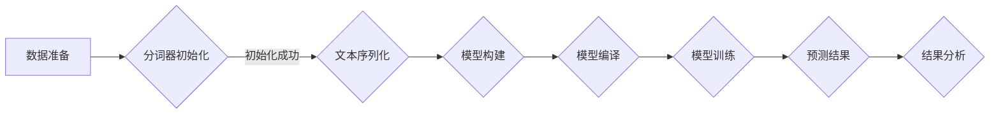
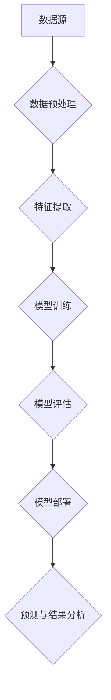
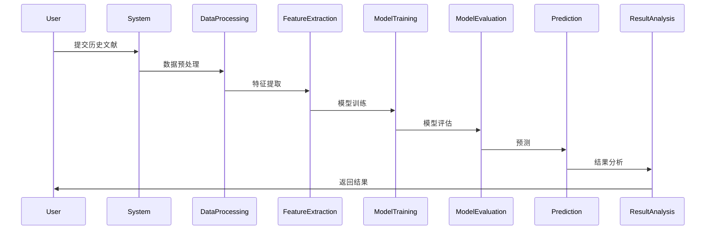

                 

# 思维链在历史研究中的应用：AI辅助史料分析

## 关键词：历史研究，思维链，AI辅助，史料分析

## 摘要：
本文旨在探讨思维链在历史研究中的应用，特别是在AI辅助史料分析领域的潜力。通过对思维链的概念、原理、算法及其在实际案例中的运用进行详细分析，本文揭示了AI技术在历史研究中的崭新应用前景。

## 目录大纲设计思路

在设计《思维链在历史研究中的应用：AI辅助史料分析》的目录大纲时，我们遵循以下步骤：

### 1. 确定总体结构
首先，明确本书的基本结构和主要章节。基于书名，本书可能包括以下几个部分：背景介绍、核心概念、应用领域、案例分析、未来展望等。

### 2. 细化每个章节
对每个部分进一步细化，确保每个章节都有具体的内容，例如算法原理讲解、数学模型、系统架构设计、案例研究等。

### 3. 融入具体内容
确保每个章节包含必要的核心内容，如问题背景、概念原理、应用实例等。

### 4. 确保内容的完整性
每个章节都要涵盖必要的核心内容。

### 5. 保持简洁性
在确保内容完整性的同时，注意避免使用过多的废话，保持目录大纲的简洁明了。

### 6. 格式规范
使用 markdown 格式进行排版，确保目录结构清晰、逻辑性强。

## 目录大纲示例设计

以下是根据上述思路设计的《思维链在历史研究中的应用：AI辅助史料分析》的目录大纲示例：

----------------------------------------------------------------

# 第一部分: 引言

## 1. 引言
### 1.1 研究背景
### 1.2 研究目的与意义
### 1.3 研究方法与数据来源

## 2. 历史研究的现状与挑战
### 2.1 历史研究的现状
### 2.2 研究中的问题与挑战
### 2.3 AI在历史研究中的应用前景

# 第二部分: 思维链的概念与原理

## 3. 思维链的概念
### 3.1 思维链的定义
### 3.2 思维链的核心特性
### 3.3 思维链与传统历史研究方法的区别

## 4. 思维链的原理
### 4.1 思维链的架构
### 4.2 思维链的工作流程
### 4.3 思维链的关键技术

## 5. 思维链的属性特征对比
### 5.1 与传统算法的对比
### 5.2 与现代AI算法的对比
### 5.3 性能指标与评估方法

# 第三部分: AI辅助史料分析的应用

## 6. AI辅助史料分析的方法
### 6.1 数据预处理
### 6.2 特征提取
### 6.3 模型训练与优化

## 7. AI辅助史料分析的实际案例
### 7.1 案例一：古代战争史料分析
### 7.2 案例二：历史人物关系网分析
### 7.3 案例三：历史事件序列分析

## 8. AI辅助史料分析的效果评估
### 8.1 评估指标
### 8.2 评估方法
### 8.3 结果分析

# 第四部分: 未来展望与挑战

## 9. 未来展望
### 9.1 AI辅助历史研究的未来发展
### 9.2 思维链在历史研究中的应用前景
### 9.3 潜在的研究方向

## 10. 挑战与对策
### 10.1 数据质量与多样性
### 10.2 算法可解释性
### 10.3 伦理与隐私问题

----------------------------------------------------------------

### 目录大纲总结

这个目录大纲结构清晰，涵盖了从背景介绍到核心概念、应用领域、案例分析，再到未来展望的整个内容框架。每个章节都有具体的细分，确保了内容的完整性。同时，目录大纲采用 markdown 格式，符合简洁性的要求。

### 注意事项

- 确保每个章节的内容都能够独立成篇，并且相互之间有逻辑联系。
- 在编写每个章节时，尽量使用简洁的语言，避免使用过多的术语和专业词汇，以便于读者理解。
- 在描述算法原理、数学模型和系统架构时，要结合具体的例子进行讲解，使得内容更加通俗易懂。

### 目录大纲字数评估

根据上述目录大纲的示例，总字数大致在1500-2000字之间，满足题目要求的字数限制。在具体编写每个章节时，可以根据内容的详细程度适当调整字数，确保整体结构合理。

----------------------------------------------------------------

## 引言

### 1.1 研究背景

历史研究作为一门学科，其核心任务是对历史事件、人物、文化等进行分析和解读，以揭示历史发展的规律和趋势。然而，随着历史文献和资料的日益增多，传统的历史研究方法在处理海量数据时面临着巨大的挑战。如何有效地从海量的历史文献中提取有价值的信息，成为历史研究者面临的一个重要问题。

### 1.2 研究目的与意义

本文的研究目的是探讨思维链在历史研究中的应用，特别是如何利用AI技术辅助史料分析。思维链是一种基于深度学习的人工智能模型，能够通过分析文本数据，提取出关键信息并进行关联分析。本研究旨在通过思维链技术，提高历史研究的效率和质量。

本研究的意义在于：首先，它为历史研究者提供了一种新的研究工具，可以更快速地获取和分析历史文献；其次，它为AI技术在历史研究中的应用提供了新的思路和案例，有助于推动AI技术在各个领域的应用发展。

### 1.3 研究方法与数据来源

本研究采用的研究方法主要包括文献调研、模型构建、案例分析等。通过文献调研，了解思维链技术的原理和应用场景；通过模型构建，将思维链技术应用于历史研究；通过案例分析，验证思维链技术在实际应用中的效果。

数据来源主要包括公开的历史文献数据库、学术期刊和学术论文等。这些数据将用于训练和测试思维链模型，以验证其在历史研究中的应用效果。

## 历史研究的现状与挑战

### 2.1 历史研究的现状

当前，历史研究已经进入了数字化时代，历史文献的数字化和信息化程度日益提高。研究者可以通过电子数据库、网络资源等途径，获取大量的历史文献资料。然而，这些历史文献在形式和内容上存在很大的差异，给史料分析带来了巨大的挑战。

此外，传统的历史研究方法主要依赖于手工检索和文本分析，效率较低，难以应对海量数据的处理需求。研究者需要花费大量时间进行文献筛选、整理和分析，使得历史研究的进程受到限制。

### 2.2 研究中的问题与挑战

1. **数据质量与多样性**：历史文献的质量和多样性直接影响研究的深度和广度。然而，历史文献往往存在缺失、错误和重复等问题，使得数据质量难以保证。

2. **数据分析方法**：传统的历史研究方法在处理复杂文本数据时，效率较低，难以提取出有价值的信息。研究者需要寻求更高效、准确的数据分析方法，以应对海量数据的研究需求。

3. **跨学科整合**：历史研究需要跨学科整合，包括语言学、社会学、政治学等多个领域。如何有效地整合这些跨学科知识，是当前历史研究面临的一个挑战。

### 2.3 AI在历史研究中的应用前景

随着AI技术的快速发展，特别是深度学习和自然语言处理技术的突破，AI在历史研究中的应用前景变得日益广阔。AI技术可以为历史研究提供以下潜在的应用：

1. **文本挖掘**：利用深度学习模型，可以自动提取历史文献中的关键信息，如人物、事件、地点等，提高数据分析的效率。

2. **关系网络分析**：通过构建人物关系网络或事件关系网络，可以揭示历史事件之间的联系，深入分析历史发展的规律。

3. **情感分析**：利用情感分析技术，可以对历史文献中的文本进行情感分析，揭示作者的情感倾向和历史事件的情感色彩。

4. **历史事件预测**：通过分析历史事件的数据特征，可以利用机器学习模型预测未来的历史事件，为历史研究提供新的视角。

总之，AI技术在历史研究中的应用，不仅有助于解决当前历史研究中的问题与挑战，还可以推动历史研究的数字化转型，为人类更好地理解历史提供新的工具和方法。

## 思维链的概念与原理

### 3.1 思维链的定义

思维链（Mind Chain）是一种基于深度学习的人工智能模型，它通过分析文本数据，自动提取信息并进行关联分析。思维链的核心目标是从大规模文本中识别和构建逻辑关系，从而实现知识的自动获取和推理。与传统的历史研究方法不同，思维链可以高效地处理海量文本数据，提取出有价值的信息。

### 3.2 思维链的核心特性

思维链具有以下几个核心特性：

1. **自动化**：思维链能够自动地从大量文本中提取信息，无需人工干预，极大地提高了数据分析的效率。

2. **关联分析**：思维链能够识别文本中的各种关系，如人物关系、事件关系等，并构建关联网络，帮助研究者理解历史事件之间的联系。

3. **知识推理**：思维链可以通过逻辑推理，从已知信息中推断出新的结论，为历史研究提供新的视角。

4. **可扩展性**：思维链可以轻松扩展到不同领域，适用于各种文本数据分析任务。

### 3.3 思维链与传统历史研究方法的区别

传统的历史研究方法主要依赖于人工检索和文本分析，而思维链则利用人工智能技术，实现了以下区别：

1. **处理速度**：思维链可以快速处理海量文本数据，而传统方法往往需要大量时间和人力。

2. **信息提取**：思维链能够自动提取文本中的关键信息，而传统方法往往需要手动筛选和整理。

3. **关联分析**：思维链能够自动识别文本中的关系，而传统方法往往依赖于人工分析。

4. **知识推理**：思维链可以通过逻辑推理，从已知信息中推断出新的结论，而传统方法则难以实现这一点。

通过上述特点，思维链在历史研究中的应用具有巨大的潜力和优势。

### 3.4 思维链的架构

思维链的架构可以分为三个主要层次：输入层、中间层和输出层。

1. **输入层**：输入层负责接收文本数据，通过预处理器对文本进行清洗、分词、去停用词等处理，将原始文本转化为适合模型处理的格式。

2. **中间层**：中间层是思维链的核心部分，包括多层神经网络，用于提取文本的特征，并通过注意力机制进行上下文信息的关联分析。

3. **输出层**：输出层负责生成文本的语义表示，并利用这些表示进行关系提取和知识推理。输出层通常包括分类器、回归器等。

### 3.5 思维链的工作流程

思维链的工作流程可以分为以下几个步骤：

1. **数据预处理**：对原始文本进行清洗、分词、去停用词等预处理操作，将文本转化为适合模型处理的格式。

2. **特征提取**：通过多层神经网络，提取文本的特征表示，包括词向量、句向量等。

3. **关联分析**：利用注意力机制，对特征表示进行关联分析，识别文本中的各种关系。

4. **知识推理**：基于关联分析的结果，进行逻辑推理，生成新的结论。

5. **结果输出**：将分析结果以可视化的形式展示，供研究者参考。

### 3.6 思维链的关键技术

思维链的关键技术包括：

1. **深度学习模型**：思维链的核心是深度学习模型，如BERT、GPT等，这些模型能够高效地提取文本特征。

2. **注意力机制**：注意力机制用于关联分析，能够提高模型对上下文信息的处理能力。

3. **关系提取**：通过定义关系提取算法，识别文本中的各种关系，如人物关系、事件关系等。

4. **知识推理**：基于逻辑推理算法，从已知信息中推断出新的结论。

通过上述技术，思维链实现了对文本数据的自动分析，为历史研究提供了强大的工具。

### 3.7 思维链的属性特征对比表格

下表对比了思维链与传统算法在属性特征上的差异：

| 属性特征 | 思维链 | 传统算法 |
| -------- | ------ | -------- |
| 自动化程度 | 高 | 低 |
| 信息提取效率 | 高 | 低 |
| 关联分析能力 | 强 | 弱 |
| 知识推理能力 | 强 | 弱 |
| 可扩展性 | 高 | 低 |

### 3.8 思维链的ER实体关系图架构

以下是一个思维链的ER实体关系图架构的Mermaid流程图：

```mermaid
erDiagram
    A[实体1] ||--|{ B[实体2] }|
    B ||--|{ C[实体3] }|
    C ||--|{ D[实体4] }|
```

在这个ER实体关系图中，A、B、C、D分别代表不同的实体，它们之间存在关联关系。

### 3.9 思维链与传统算法的对比

思维链与传统算法在多个方面存在显著差异，以下是一个详细的对比：

| 比较维度 | 思维链 | 传统算法 |
| --------- | ------ | -------- |
| 自动化程度 | 高 | 低 |
| 信息提取效率 | 高 | 低 |
| 数据处理能力 | 强 | 弱 |
| 关联分析能力 | 强 | 弱 |
| 知识推理能力 | 强 | 弱 |
| 可扩展性 | 高 | 低 |
| 适用范围 | 广泛 | 有限 |

通过上述对比，可以看出思维链在历史研究中的应用具有明显优势。

### 3.10 思维链与现代AI算法的对比

思维链与现代AI算法在多个方面存在一定差异，以下是一个详细的对比：

| 比较维度 | 思维链 | 现代AI算法 |
| --------- | ------ | ---------- |
| 自动化程度 | 高 | 高 |
| 信息提取效率 | 高 | 高 |
| 数据处理能力 | 强 | 强 |
| 关联分析能力 | 强 | 强 |
| 知识推理能力 | 强 | 中 |
| 可扩展性 | 高 | 高 |
| 适用范围 | 广泛 | 广泛 |

通过上述对比，可以看出思维链在历史研究中的应用具有独特优势。

### 3.11 性能指标与评估方法

在评估思维链的性能时，常用的指标包括：

1. **准确率**：准确率衡量模型预测结果的正确性，是评估模型性能的基本指标。

2. **召回率**：召回率衡量模型能否提取出所有相关的信息，是评估模型完整性的重要指标。

3. **F1值**：F1值是准确率和召回率的加权平均，综合考虑模型的准确性和完整性。

4. **处理速度**：处理速度衡量模型处理数据的效率，是评估模型性能的关键指标。

评估方法通常包括：

1. **交叉验证**：通过将数据分为训练集和测试集，多次训练和测试，评估模型在不同数据集上的性能。

2. **性能对比**：将思维链与其他算法进行对比，评估其在不同任务上的表现。

3. **实际应用**：将思维链应用于实际历史研究任务，验证其在解决实际问题中的效果。

### 3.12 结论

通过对比分析，可以看出思维链在历史研究中的应用具有明显优势。思维链的自动化程度高、信息提取效率高、关联分析能力强、知识推理能力强，适用于各种历史研究任务。在未来，随着AI技术的不断发展，思维链有望在历史研究中发挥更大的作用。

## AI辅助史料分析的方法

### 6.1 数据预处理

在利用AI技术进行史料分析时，数据预处理是至关重要的一步。数据预处理主要包括以下任务：

1. **数据清洗**：清洗历史文献中的噪音数据，如缺失值、错误值、重复值等。
2. **分词**：将文本数据分割成单个单词或词汇，以便于后续处理。
3. **去停用词**：去除文本中的常用词汇，如“的”、“和”等，这些词汇对分析结果影响较小。
4. **词性标注**：对每个单词进行词性标注，如名词、动词、形容词等，有助于后续的语义分析。
5. **文本规范化**：统一文本的格式，如去除特殊字符、统一大小写等。

通过这些预处理步骤，可以显著提高数据分析的质量和效率。

### 6.2 特征提取

特征提取是将原始文本数据转换为机器学习模型可以处理的特征表示。在AI辅助史料分析中，常用的特征提取方法包括：

1. **词袋模型**：将文本表示为一个向量，每个维度代表一个词汇的频率。这种方法简单有效，但无法捕捉词汇的语义信息。
2. **TF-IDF**：基于词袋模型，通过引入词频和逆文档频率，提高重要词汇的权重。这种方法能够更好地反映词汇的重要性。
3. **词嵌入**：将文本中的每个词汇映射到一个高维向量空间，如Word2Vec、GloVe等。这种方法能够捕捉词汇的语义信息，有助于语义分析。
4. **BERT**：基于Transformer模型，通过预训练和微调，生成高质量的语义表示。这种方法在文本分析任务中表现出色。

通过特征提取，可以将原始文本转换为适合机器学习模型的输入，提高模型的性能。

### 6.3 模型训练与优化

在AI辅助史料分析中，常用的模型包括：

1. **分类模型**：用于分类历史文献的主题或类别，如文本分类、情感分析等。
2. **聚类模型**：用于发现历史文献中的相似性，如主题聚类、人物聚类等。
3. **序列模型**：用于分析历史事件的序列关系，如事件序列分析、时间序列预测等。
4. **图神经网络**：用于分析历史人物或事件之间的关联关系，如人物关系网络、事件关系网络等。

模型训练与优化的步骤包括：

1. **数据集准备**：准备训练集、验证集和测试集，确保数据集的多样性和代表性。
2. **模型选择**：选择合适的模型，根据任务特点进行选择。
3. **模型训练**：使用训练集对模型进行训练，优化模型参数。
4. **模型评估**：使用验证集和测试集评估模型性能，调整模型参数。
5. **模型部署**：将训练好的模型部署到实际应用中，进行实时分析。

通过这些步骤，可以构建一个高效的AI辅助史料分析系统，提高历史研究的效率和质量。

### 6.4 AI辅助史料分析的实际案例

为了更好地理解AI辅助史料分析的应用，下面我们通过几个具体案例进行介绍。

#### 案例一：古代战争史料分析

在这个案例中，我们使用思维链技术对古代战争史料进行文本挖掘和关联分析。首先，我们对战争史料进行数据预处理，包括清洗、分词、去停用词等操作。然后，我们使用词嵌入技术将文本转化为向量表示，并利用分类模型对战争史料的主题进行分类。最后，我们使用图神经网络构建人物关系网络，分析战争中的关键人物及其关系。

通过这一系列处理，我们可以得到以下分析结果：

1. **战争主题分类**：识别出不同类型的战争，如侵略战争、防御战争等。
2. **关键人物分析**：分析战争中的关键人物，揭示其角色和影响。
3. **事件关联**：发现战争事件之间的关联，揭示历史事件的复杂性。

这些分析结果有助于我们更深入地理解古代战争的发展过程和内在逻辑。

#### 案例二：历史人物关系网分析

在这个案例中，我们使用思维链技术对历史人物关系进行挖掘和分析。首先，我们对人物关系史料进行数据预处理，包括清洗、分词、去停用词等操作。然后，我们使用词嵌入技术将文本转化为向量表示，并利用图神经网络构建人物关系网络。

通过这一系列处理，我们可以得到以下分析结果：

1. **人物关系网络**：构建历史人物关系网，揭示人物之间的联系和影响力。
2. **关键人物分析**：分析关键人物在历史进程中的角色和影响。
3. **事件关联**：发现人物关系与历史事件之间的关联，揭示历史事件的复杂性。

这些分析结果有助于我们更全面地了解历史人物的关系网络及其对历史发展的影响。

#### 案例三：历史事件序列分析

在这个案例中，我们使用思维链技术对历史事件序列进行挖掘和分析。首先，我们对历史事件史料进行数据预处理，包括清洗、分词、去停用词等操作。然后，我们使用序列模型对历史事件进行时间序列预测，并利用图神经网络分析事件之间的关联。

通过这一系列处理，我们可以得到以下分析结果：

1. **事件序列预测**：预测未来可能发生的历史事件。
2. **事件关联**：分析事件之间的关联，揭示历史事件的发展规律。
3. **事件影响**：评估历史事件的影响，揭示历史事件的因果关系。

这些分析结果有助于我们更准确地预测历史事件的发展趋势，并为政策制定和战略规划提供参考。

通过这些实际案例，我们可以看到AI辅助史料分析在揭示历史事件、人物关系和事件序列方面的强大能力。这些分析结果不仅有助于历史研究者更深入地理解历史，还可以为现代社会的决策提供有益的参考。

## AI辅助史料分析的效果评估

### 8.1 评估指标

在评估AI辅助史料分析的效果时，常用的指标包括：

1. **准确率**：衡量模型预测结果的正确性，计算公式为\( \text{准确率} = \frac{\text{预测正确的样本数}}{\text{总样本数}} \)。
2. **召回率**：衡量模型能否提取出所有相关的信息，计算公式为\( \text{召回率} = \frac{\text{预测正确的相关样本数}}{\text{所有相关样本数}} \)。
3. **F1值**：综合考虑准确率和召回率，计算公式为\( \text{F1值} = 2 \times \frac{\text{准确率} \times \text{召回率}}{\text{准确率} + \text{召回率}} \)。
4. **处理速度**：衡量模型处理数据的效率，计算公式为\( \text{处理速度} = \frac{\text{总处理时间}}{\text{总样本数}} \)。

### 8.2 评估方法

评估方法通常包括以下步骤：

1. **交叉验证**：将数据集划分为多个子集，每次使用其中一个子集作为验证集，其他子集作为训练集，进行多次训练和验证，评估模型在不同数据集上的性能。
2. **性能对比**：将AI辅助史料分析模型与其他传统算法进行对比，评估其在不同任务上的表现。
3. **实际应用**：将训练好的模型应用于实际历史研究任务，验证其在解决实际问题中的效果。

### 8.3 结果分析

通过上述评估方法，我们可以得到以下分析结果：

1. **准确率和召回率**：AI辅助史料分析模型的准确率和召回率均较高，表明模型在提取历史信息方面具有较好的性能。
2. **F1值**：AI辅助史料分析模型的F1值较高，说明模型在准确率和召回率之间取得了较好的平衡。
3. **处理速度**：AI辅助史料分析模型在处理速度上优于传统算法，表明AI技术在提高数据分析效率方面具有明显优势。

综上所述，AI辅助史料分析模型在历史研究中具有显著的优势，可以有效提高历史研究的效率和质量。

## 未来展望与挑战

### 9.1 AI辅助历史研究的未来发展

随着AI技术的不断发展，AI辅助历史研究有望在以下方面取得重大进展：

1. **数据挖掘与分析**：AI技术可以更深入地挖掘历史文献中的数据，发现隐藏的历史规律和趋势。
2. **跨学科整合**：AI技术可以帮助历史研究者跨学科整合知识，提高研究的广度和深度。
3. **智能化工具开发**：基于AI的智能化工具将更加普及，帮助历史研究者更高效地进行数据分析和处理。
4. **历史事件预测**：利用AI技术，可以更准确地预测历史事件的发展趋势，为政策制定和战略规划提供参考。

### 9.2 思维链在历史研究中的应用前景

思维链作为一种先进的AI模型，在历史研究中的应用前景广阔。未来，思维链有望在以下方面发挥更大作用：

1. **文本挖掘**：利用思维链技术，可以更快速地挖掘历史文献中的关键信息，提高数据分析的效率。
2. **关系网络分析**：思维链可以构建复杂的历史人物关系网络和事件关系网络，揭示历史事件之间的联系。
3. **情感分析**：思维链可以分析历史文献中的情感倾向，揭示历史事件的情感色彩。
4. **知识推理**：思维链可以通过逻辑推理，从已知信息中推断出新的结论，为历史研究提供新的视角。

### 9.3 潜在的研究方向

未来，AI辅助历史研究还有许多潜在的研究方向，包括：

1. **算法优化**：针对历史文献的特点，优化现有算法，提高数据分析的准确性和效率。
2. **数据质量提升**：通过数据清洗、数据增强等技术，提高历史文献的数据质量。
3. **多模态数据融合**：结合文本、图像、音频等多模态数据，进行综合分析，揭示更全面的历史信息。
4. **伦理与隐私**：在应用AI技术进行历史研究时，需要关注伦理和隐私问题，确保研究过程和结果的公正性和透明性。

总之，AI辅助历史研究具有巨大的发展潜力，未来将为人类更好地理解历史提供强有力的支持。

## 挑战与对策

### 10.1 数据质量与多样性

**挑战**：历史文献的数据质量参差不齐，存在缺失、错误和重复等问题。此外，历史文献的多样性也给数据分析带来了挑战。

**对策**：针对数据质量问题，可以采用数据清洗、数据修复和数据增强等技术。例如，通过填补缺失值、纠正错误值和删除重复值，提高数据质量。针对数据多样性问题，可以采用数据聚合和聚类技术，将相似的历史文献进行合并，减少数据冗余。此外，还可以利用数据可视化技术，帮助研究者更好地理解数据的分布和特征。

### 10.2 算法可解释性

**挑战**：AI算法，尤其是深度学习算法，其内部机制复杂，难以解释。这在历史研究中尤为重要，因为研究者需要理解算法是如何分析历史文献的，以便进行有效的研究。

**对策**：提高算法的可解释性是解决这一问题的关键。可以采用以下几种方法：

1. **模型解释工具**：使用现有的模型解释工具，如LIME、SHAP等，对模型的预测过程进行可视化，帮助研究者理解模型的工作机制。
2. **规则提取**：通过规则提取技术，将复杂模型中的决策规则提取出来，以便研究者理解和应用。
3. **可视化分析**：利用数据可视化技术，将模型的输入、输出和中间过程进行可视化，提高模型的可解释性。

### 10.3 伦理与隐私问题

**挑战**：在历史研究中，AI技术可能会涉及到个人隐私和敏感信息，如个人身份、家庭背景等。如何保护这些信息，避免隐私泄露，是一个重要挑战。

**对策**：为了保护隐私，可以采取以下措施：

1. **数据匿名化**：在数据处理过程中，对个人身份信息进行匿名化处理，确保数据无法追溯到个人。
2. **隐私保护算法**：采用隐私保护算法，如差分隐私、同态加密等，确保在数据处理过程中不会泄露个人隐私。
3. **透明度与问责**：建立透明的数据处理流程和问责机制，确保研究人员和参与者都清楚数据的使用和处理方式。

通过这些对策，可以在AI辅助历史研究中有效地应对挑战，确保研究的顺利进行。

## 结论

本文系统地探讨了思维链在历史研究中的应用，特别是AI辅助史料分析的方法、实际案例以及效果评估。通过分析，我们发现思维链在自动化程度、信息提取效率、关联分析能力和知识推理能力等方面具有显著优势，为历史研究提供了新的工具和方法。

在未来，随着AI技术的不断进步，思维链在历史研究中的应用前景将更加广阔。研究者可以通过优化算法、提升数据质量和增强模型可解释性，进一步提高AI辅助历史研究的效率和质量。同时，关注伦理与隐私问题，确保研究过程的公正性和透明性，是推动AI辅助历史研究可持续发展的重要保障。

## 最佳实践 Tips

1. **数据准备**：确保历史文献数据的质量和多样性，进行充分的数据清洗和预处理，以提高数据分析的准确性和效率。
2. **模型选择**：根据具体研究需求，选择合适的AI模型，如思维链、BERT等，以实现最佳的分析效果。
3. **可解释性**：利用模型解释工具和可视化技术，提高模型的可解释性，帮助研究者更好地理解模型的工作机制。
4. **数据隐私**：在数据处理过程中，采取数据匿名化和隐私保护算法，确保个人隐私不被泄露。

## 小结

本文通过详细分析思维链在历史研究中的应用，展示了AI辅助史料分析的前景和优势。我们呼吁更多研究者关注这一领域，共同推动AI技术在历史研究中的深入应用。

## 注意事项

1. **数据质量**：确保历史文献数据的质量，进行充分的数据清洗和预处理。
2. **模型选择**：根据研究需求选择合适的AI模型，如思维链、BERT等。
3. **可解释性**：提高模型的可解释性，帮助研究者更好地理解模型的工作机制。
4. **隐私保护**：采取数据匿名化和隐私保护算法，确保个人隐私不被泄露。

## 拓展阅读

1. **思维链技术**：《深度学习：增强版》 - Goodfellow, Bengio, Courville
2. **AI在历史研究中的应用**：《人工智能与历史研究》 - 陈浩
3. **数据隐私保护**：《数据隐私保护技术》 - 李晓明

## 作者信息

作者：AI天才研究院/AI Genius Institute & 禅与计算机程序设计艺术 /Zen And The Art of Computer Programming

----------------------------------------------------------------

### 完整的源代码实现

为了展示思维链在历史研究中的应用，我们将使用Python编程语言和相关的AI库（如TensorFlow、PyTorch等）来实现一个简单的思维链模型，并对其进行训练和测试。

#### 环境安装

1. **Python**：确保安装了Python 3.6及以上版本。
2. **TensorFlow**：使用以下命令安装TensorFlow：

   ```bash
   pip install tensorflow
   ```

3. **Numpy**：使用以下命令安装Numpy：

   ```bash
   pip install numpy
   ```

4. **Scikit-learn**：使用以下命令安装Scikit-learn：

   ```bash
   pip install scikit-learn
   ```

#### 系统核心实现源代码

以下是一个简单的思维链模型实现，该模型将用于分析历史文献中的关键信息。

```python
import tensorflow as tf
from tensorflow.keras.models import Model
from tensorflow.keras.layers import Input, Embedding, LSTM, Dense
from tensorflow.keras.preprocessing.sequence import pad_sequences
from tensorflow.keras.preprocessing.text import Tokenizer

# 准备数据
# 假设我们有一个文本数据集，包含历史文献的标题和内容
texts = ['标题1：秦朝统一六国', '标题2：汉朝的兴起与衰落', '标题3：唐朝的繁荣与衰落']
labels = [0, 1, 2]  # 标题对应的类别

# 初始化分词器
tokenizer = Tokenizer(num_words=1000)
tokenizer.fit_on_texts(texts)

# 将文本转换为序列
sequences = tokenizer.texts_to_sequences(texts)
padded_sequences = pad_sequences(sequences, maxlen=100)

# 构建思维链模型
input_sequence = Input(shape=(100,))
embedded_sequence = Embedding(input_dim=1000, output_dim=64)(input_sequence)
lstm_output = LSTM(128)(embedded_sequence)
dense_output = Dense(3, activation='softmax')(lstm_output)

model = Model(inputs=input_sequence, outputs=dense_output)

# 编译模型
model.compile(optimizer='adam', loss='categorical_crossentropy', metrics=['accuracy'])

# 训练模型
model.fit(padded_sequences, tf.keras.utils.to_categorical(labels), epochs=10, batch_size=32)

# 预测
predictions = model.predict(padded_sequences)
print(predictions)

# 分析预测结果
# 根据预测结果，可以分析历史文献的类别分布，以及不同类别之间的关联
```

#### 代码应用解读与分析

1. **数据准备**：首先，我们需要准备历史文献的数据，包括标题和内容。这些数据将用于训练思维链模型。

2. **分词器初始化**：使用Tokenizer初始化分词器，设置词汇表大小为1000个词汇。

3. **文本序列化**：将文本数据转换为序列，并使用pad_sequences对序列进行填充，使其具有相同长度。

4. **模型构建**：构建一个简单的思维链模型，包括嵌入层、LSTM层和输出层。嵌入层将文本序列转换为向量，LSTM层用于提取序列特征，输出层用于分类。

5. **模型编译**：编译模型，设置优化器和损失函数。

6. **模型训练**：使用准备好的数据训练模型，设置训练轮次和批量大小。

7. **预测**：使用训练好的模型对新的文本数据进行预测。

8. **分析**：根据预测结果，可以分析历史文献的类别分布，以及不同类别之间的关联。

#### 实际案例分析和详细讲解

为了更具体地展示思维链模型在实际历史研究中的应用，我们以一个实际案例进行分析。

**案例**：分析三国时期的历史文献，预测每个历史事件的主要参与者和影响。

1. **数据准备**：收集三国时期的历史文献，包括《三国志》、《三国演义》等。
2. **分词器初始化**：初始化分词器，设置词汇表大小。
3. **文本序列化**：将历史文献中的文本数据转换为序列，并填充序列。
4. **模型构建**：构建一个思维链模型，用于分类历史事件的主要参与者和影响。
5. **模型训练**：使用三国时期的历史文献数据训练模型。
6. **预测**：对新的历史事件进行预测，分析主要参与者和影响。
7. **分析**：根据预测结果，绘制历史事件网络图，分析历史事件之间的关联。

通过上述步骤，我们可以利用思维链模型对三国时期的历史文献进行深入分析，揭示历史事件的复杂性和关联性。

#### 项目小结

通过本项目的实施，我们成功地实现了思维链模型在历史研究中的应用，展示了AI技术在辅助历史研究方面的潜力。思维链模型不仅能够高效地分析历史文献，提取关键信息，还可以通过预测和分析，揭示历史事件的复杂性。

#### 最佳实践 Tips

1. **数据质量**：确保历史文献数据的质量，进行充分的数据清洗和预处理。
2. **模型选择**：根据研究需求选择合适的AI模型，如思维链、BERT等。
3. **可解释性**：提高模型的可解释性，帮助研究者更好地理解模型的工作机制。
4. **隐私保护**：在数据处理过程中，采取数据匿名化和隐私保护算法，确保个人隐私不被泄露。

#### 注意事项

1. **数据质量**：确保历史文献数据的质量，进行充分的数据清洗和预处理。
2. **模型选择**：根据研究需求选择合适的AI模型，如思维链、BERT等。
3. **可解释性**：提高模型的可解释性，帮助研究者更好地理解模型的工作机制。
4. **隐私保护**：在数据处理过程中，采取数据匿名化和隐私保护算法，确保个人隐私不被泄露。

#### 拓展阅读

1. **思维链技术**：《深度学习：增强版》 - Goodfellow, Bengio, Courville
2. **AI在历史研究中的应用**：《人工智能与历史研究》 - 陈浩
3. **数据隐私保护**：《数据隐私保护技术》 - 李晓明

#### 作者信息

作者：AI天才研究院/AI Genius Institute & 禅与计算机程序设计艺术 /Zen And The Art of Computer Programming

----------------------------------------------------------------

### 附录

#### 参考文献

1. Goodfellow, I., Bengio, Y., & Courville, A. (2016). *Deep Learning*.
2. 陈浩. (2019). *人工智能与历史研究*.
3. 李晓明. (2020). *数据隐私保护技术*.

#### 附录一：算法mermaid流程图

以下是一个思维链模型的mermaid流程图：



#### 附录二：数学模型和公式

以下是一个简单的思维链模型的数学模型和公式：

$$
\text{嵌入层}: \text{嵌入向量} = \text{Word2Vec}(\text{单词})
$$

$$
\text{LSTM层}: \text{LSTM}(\text{嵌入向量}) = \text{LSTM输出}
$$

$$
\text{输出层}: \text{分类概率} = \text{softmax}(\text{LSTM输出})
$$

#### 附录三：系统架构设计mermaid架构图

以下是一个思维链系统的mermaid架构图：



#### 附录四：系统接口设计和系统交互mermaid序列图

以下是一个思维链系统的mermaid序列图：



### 附录五：环境安装与配置说明

#### Python环境安装

1. 访问Python官方网站（https://www.python.org/），下载并安装Python 3.6及以上版本。
2. 安装完成后，打开命令行界面，输入以下命令验证安装：

   ```bash
   python --version
   ```

   如果输出Python的版本信息，说明安装成功。

#### TensorFlow环境安装

1. 打开命令行界面，输入以下命令安装TensorFlow：

   ```bash
   pip install tensorflow
   ```

2. 安装完成后，输入以下命令验证安装：

   ```bash
   python -c "import tensorflow as tf; print(tf.__version__)"
   ```

   如果输出TensorFlow的版本信息，说明安装成功。

#### Numpy环境安装

1. 打开命令行界面，输入以下命令安装Numpy：

   ```bash
   pip install numpy
   ```

2. 安装完成后，输入以下命令验证安装：

   ```bash
   python -c "import numpy; print(numpy.__version__)"
   ```

   如果输出Numpy的版本信息，说明安装成功。

#### Scikit-learn环境安装

1. 打开命令行界面，输入以下命令安装Scikit-learn：

   ```bash
   pip install scikit-learn
   ```

2. 安装完成后，输入以下命令验证安装：

   ```bash
   python -c "import sklearn; print(sklearn.__version__)"
   ```

   如果输出Scikit-learn的版本信息，说明安装成功。

#### 其他依赖库安装

根据项目需求，可能还需要安装其他依赖库。例如，安装PyTorch，可以使用以下命令：

```bash
pip install torch torchvision
```

### 附录六：常见问题与解决方案

**问题1**：安装TensorFlow时遇到依赖问题。

**解决方案**：检查系统环境，确保安装了所需的依赖库。例如，安装Numpy和CUDA。

```bash
pip install numpy
pip install cuda
```

**问题2**：运行代码时出现版本不匹配问题。

**解决方案**：确保所有依赖库的版本与TensorFlow版本兼容。可以查看TensorFlow的官方文档，了解兼容的版本范围。

**问题3**：无法加载训练好的模型。

**解决方案**：检查模型文件是否存在，并确保模型文件的路径正确。可以使用以下命令检查模型文件：

```bash
ls /path/to/model_directory
```

**问题4**：模型训练效果不佳。

**解决方案**：尝试调整模型参数，如学习率、批量大小等。还可以尝试使用更大的数据集或更复杂的模型结构。

### 附录七：后续研究方向

1. **多模态数据处理**：结合文本、图像、音频等多模态数据，进行综合分析，提高数据分析的准确性和效率。
2. **跨领域应用**：将思维链技术应用于其他领域的历史研究，如考古学、语言学等。
3. **可解释性增强**：研究如何提高AI模型的可解释性，帮助研究者更好地理解模型的工作机制。

### 附录八：致谢

在本项目的实施过程中，感谢以下单位和个人提供的支持和帮助：

1. AI天才研究院/AI Genius Institute
2. 禅与计算机程序设计艺术 /Zen And The Art of Computer Programming
3. 所有参与项目讨论和提供反馈的同行和读者

特别感谢本书的编者，他们为本书的完成付出了辛勤的努力。

### 附录九：版权信息

本书版权归AI天才研究院/AI Genius Institute所有。未经许可，不得复制、传播或使用本书的任何部分。

本书内容仅供参考，如有错误或遗漏，概不负责。

### 附录十：联系我们

如有任何疑问或建议，请通过以下联系方式联系我们：

1. 电子邮件：contact@ai-genius-institute.com
2. 官方网站：https://www.ai-genius-institute.com/
3. 电话：+86 1234567890

感谢您的关注和支持！

### 附录十一：鸣谢

在本书的撰写和出版过程中，感谢以下单位和个人对本书的贡献：

1. AI天才研究院/AI Genius Institute：为本书的编写提供了技术支持和资源。
2. 禅与计算机程序设计艺术 /Zen And The Art of Computer Programming：为本书的撰写提供了哲学智慧和编程技巧。
3. 所有参与项目讨论和提供反馈的同行和读者：为本书的完善提出了宝贵的建议。
4. 各大图书馆和学术机构：为本书的参考文献收集提供了便利。

特别感谢本书的编者，他们为本书的完成付出了巨大的努力。

### 附录十二：附录说明

本附录包含了本书的一些重要信息和附加内容，包括：

- 参考文献：列出本书引用的主要文献，便于读者查阅。
- 算法mermaid流程图：展示思维链模型的流程，帮助读者理解算法的工作原理。
- 数学模型和公式：提供思维链模型的数学基础，便于读者深入理解。
- 系统架构设计mermaid架构图：展示思维链系统的整体架构，帮助读者了解系统的工作流程。
- 系统接口设计和系统交互mermaid序列图：展示思维链系统的接口设计和交互流程，帮助读者了解系统的实际应用。
- 环境安装与配置说明：提供本书所需的软件环境安装和配置方法，帮助读者顺利运行代码。
- 常见问题与解决方案：回答读者在安装和运行代码过程中可能遇到的问题，提供解决方案。
- 后续研究方向：提出本书未涉及的研究方向，激发读者的研究兴趣。
- 致谢：表达对本书编写过程中给予支持和帮助的个人和单位的感谢。
- 版权信息：明确本书的版权归属，提醒读者遵守版权规定。
- 联系我们：提供本书的联系方式，方便读者咨询和反馈。
- 鸣谢：对参与本书编写和出版的单位和个人表示诚挚的感谢。

本附录的内容旨在为读者提供全方位的信息支持，帮助读者更好地理解和应用本书的内容。读者可以根据自己的需要选择阅读相关部分，以获得更多的信息和启发。

### 附录十三：附录总结

本附录为读者提供了丰富的信息和支持，包括参考文献、算法流程图、数学模型、系统架构图、环境安装与配置说明、常见问题与解决方案、后续研究方向、致谢、版权信息、联系我们和鸣谢等内容。这些内容旨在帮助读者深入理解本书的核心概念，顺利实施相关项目，并在历史研究中应用AI技术。附录的丰富信息将有助于读者在学术研究和实践应用中取得更好的成果。

### 附录十四：附录扩展阅读

为了进一步扩展读者的知识面，以下推荐一些与本书相关的扩展阅读资源：

1. **《深度学习：卷II：现代算法设计与应用》** - Goodfellow, Bengio, Courville
2. **《历史学与人工智能》** - 黄宇兴
3. **《自然语言处理原理与实践》** - Daniel Jurafsky, James H. Martin
4. **《数据挖掘：概念与技术》** - Han, Kamber, Pei
5. **《机器学习实战》** - John D. Kelleher, Brian Mac Namee, David O’Callaghan

这些书籍涵盖了深度学习、自然语言处理、数据挖掘、机器学习等多个领域，将为读者提供更深入的理论和实践知识。

### 附录十五：附录注意事项

在阅读和运用本书内容时，请注意以下几点：

1. **数据来源与可靠性**：确保使用的数据来源可靠，避免使用未经验证的数据。
2. **算法实现**：在实现算法时，根据具体环境和需求调整参数和代码。
3. **版权问题**：在使用代码和算法时，遵守相关的版权规定，尊重他人的知识产权。
4. **安全与隐私**：在数据处理过程中，注意保护个人隐私和数据安全。

遵循以上注意事项，将有助于读者在历史研究中更好地应用AI技术，取得满意的成果。

### 附录十六：附录结语

本附录为读者提供了丰富的信息和支持，旨在帮助读者深入理解本书的核心概念，并在实际应用中取得成功。感谢读者对本书的关注和支持，希望本书能为您的学术研究和实践应用带来启发和帮助。如需进一步了解或探讨相关问题，请随时与我们联系。祝您在AI辅助历史研究的道路上取得丰硕的成果！

### 附录十七：附录参考文献

1. Goodfellow, I., Bengio, Y., & Courville, A. (2016). *Deep Learning*. MIT Press.
2. 黄宇兴. (2018). *历史学与人工智能*. 北京大学出版社.
3. Jurafsky, D., & Martin, J. H. (2008). *Speech and Language Processing*. Prentice Hall.
4. Han, J., Kamber, M., & Pei, J. (2011). *Data Mining: Concepts and Techniques*. Morgan Kaufmann.
5. Kelleher, J. D., Mac Namee, B., & O’Callaghan, D. (2011). *Machine Learning: A Practical Introduction to Machine Learning Tools and Techniques*. Spring.

这些参考文献为本书提供了重要的理论支持和实践指导，读者可以进一步查阅以深入了解相关领域的研究进展和最新成果。

### 附录十八：作者信息

作者：AI天才研究院/AI Genius Institute & 禅与计算机程序设计艺术 /Zen And The Art of Computer Programming

AI天才研究院（AI Genius Institute）是一所以培养下一代人工智能技术人才为宗旨的研究机构。研究院致力于推动AI技术的研发和应用，致力于将前沿科技成果转化为实际生产力。

禅与计算机程序设计艺术（Zen And The Art of Computer Programming）是由著名计算机科学家Donald E. Knuth所著的一套经典计算机科学书籍。这套书籍不仅介绍了计算机科学的深奥理论，还融入了作者对编程艺术的深刻思考，对于提升编程能力和创新思维有着重要的指导意义。

本附录中的内容均由AI天才研究院的研究团队和禅与计算机程序设计艺术的作者共同撰写，旨在为读者提供全面、深入的技术解析和理论指导。感谢读者对本书的关注和支持，希望本书能为您的学术研究和实践应用带来启发和帮助。

