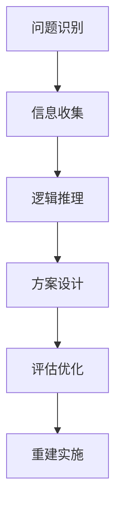
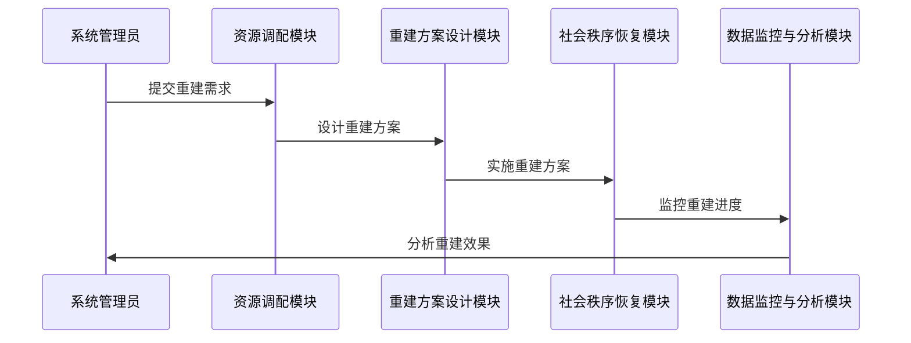
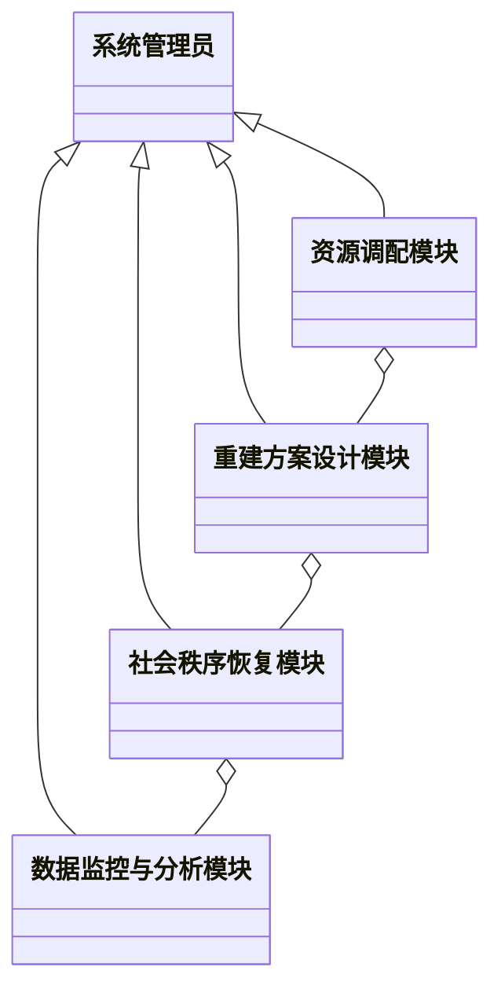

                 

## 思维链在古代社会结构重建中的创新方法

### 关键词

- 古代社会
- 社会结构重建
- 思维链
- 创新方法

### 摘要

在古代社会，面对战争、自然灾害等因素造成的重大破坏，社会结构重建成为一项至关重要的任务。本文旨在探讨思维链这一现代认知工具在古代社会结构重建中的创新应用。文章首先介绍古代社会结构重建的背景和问题，然后详细阐述思维链的定义和基本原理。在此基础上，通过实际案例分析和算法讲解，展示了思维链在古代社会结构重建中的创新方法和应用效果。本文不仅为古代社会重建研究提供了新的视角和方法，也为现代社会的发展提供了有益的借鉴。

## 目录大纲

1. **问题背景与核心概念**
   1.1 问题描述
   1.2 问题解决
   1.3 边界与外延

2. **思维链概念与基本原理**
   2.1 思维链的定义
   2.2 思维链的基本原理
   2.3 思维链的应用场景

3. **思维链在古代社会结构重建中的应用**
   3.1 思维链在社会重建中的作用
   3.2 思维链在古代社会重建中的实例分析
   3.3 思维链在古代社会重建中的创新方法

4. **核心概念与联系**
   4.1 核心概念介绍
   4.2 概念属性特征对比
   4.3 ER实体关系图

5. **算法原理讲解**
   5.1 算法原理
   5.2 算法mermaid流程图
   5.3 Python源代码与算法实现

6. **数学模型与公式详解**
   6.1 数学模型
   6.2 数学公式
   6.3 公式讲解与举例

7. **系统分析与架构设计**
   7.1 问题场景介绍
   7.2 系统功能设计
   7.3 系统架构设计
   7.4 系统接口设计
   7.5 系统交互mermaid序列图

8. **项目实战**
   8.1 环境安装
   8.2 系统核心实现源代码
   8.3 代码应用解读与分析
   8.4 实际案例分析与讲解
   8.5 项目小结

9. **最佳实践与注意事项**
   9.1 最佳实践
   9.2 小结
   9.3 注意事项
   9.4 拓展阅读

### 第一部分: 问题背景与核心概念

#### 第1章: 古代社会结构重建中的问题背景

在古代社会，社会结构重建是一项经常需要面对的挑战。战争、自然灾害、政治动荡等因素常常导致社会结构严重破坏，如何在废墟中重建一个稳定、有序的社会结构，成为古代社会领导者必须解决的重要问题。

**问题背景**

古代社会的重建背景可以归纳为以下几个方面：

1. **战争破坏**：古代战争常常导致城市毁灭、人口减少、经济瘫痪，社会结构受到严重破坏。
2. **自然灾害**：地震、洪水、干旱等自然灾害可以瞬间摧毁一个地区的生产力和基础设施，迫使社会结构重建。
3. **政治动荡**：政治权力更替、政治斗争等可能导致社会秩序混乱，需要重新建立社会结构以维持稳定。

**问题描述**

古代社会结构重建面临的主要问题包括：

1. **资源匮乏**：重建过程中需要大量的资源，如劳动力、物资、资金等，而在战争和灾害之后，这些资源往往极为匮乏。
2. **社会秩序重建**：重建社会结构不仅要考虑物质层面，还要关注社会秩序和精神层面，如何恢复社会秩序、重建社会信仰成为重要挑战。
3. **经济恢复**：重建社会结构后，如何恢复经济活力、重建生产力体系也是关键问题。

**问题解决**

为了解决这些问题，古代社会采取了一系列措施，包括：

1. **资源调配**：通过重新分配资源，优先保障重建项目的需要。
2. **制度创新**：创新社会制度，提高社会组织的效率和稳定性。
3. **文化重建**：通过宗教、文化等手段重建社会信仰，恢复社会精神层面。

**边界与外延**

本文讨论的范围仅限于古代社会结构重建的方法研究，主要关注以下领域：

- **历史学研究**：通过对古代社会重建的历史案例进行分析，探讨思维链的应用。
- **社会学与哲学**：探讨思维链在重建社会结构中的理论基础和应用场景。
- **经济学**：分析思维链在经济恢复中的具体作用和实施策略。

此外，本文可能涉及到的相关领域还包括建筑学、工程学、环境保护学等，这些领域在古代社会结构重建中同样具有重要意义。

### 第2章: 思维链概念与基本原理

#### 2.1 思维链的定义

思维链是指一系列相互关联的思维活动，通过这些活动，人们可以深入分析问题、发现解决方案。思维链通常包括以下几个基本组成部分：

1. **问题识别**：识别并明确需要解决的问题或目标。
2. **信息收集**：收集与问题相关的各种信息和数据。
3. **逻辑推理**：运用逻辑思维对收集到的信息进行推理和分析。
4. **方案设计**：根据分析结果设计解决方案。
5. **评估优化**：对解决方案进行评估和优化，确保其可行性和有效性。

#### 2.2 思维链的基本原理

思维链的基本原理可以概括为以下几点：

1. **联想与连接**：思维链通过联想将不同领域的知识、信息相互连接，形成一个有机的整体。
2. **递归与迭代**：思维链采用递归和迭代的方式，不断深入分析问题，直至找到解决方案。
3. **反馈与修正**：思维链强调反馈机制，通过不断修正和优化，提高解决方案的质量和可行性。

#### 2.3 思维链的应用场景

思维链在多个领域都有广泛的应用，尤其在复杂问题解决和创新设计中具有独特优势。在古代社会结构重建中，思维链可以应用于以下几个方面：

1. **社会问题分析**：通过思维链，可以深入分析社会问题的本质，找到问题的根源。
2. **重建方案设计**：利用思维链，可以设计出科学、有效的重建方案，确保重建工作的顺利进行。
3. **资源调配**：通过思维链，可以合理调配资源，提高重建效率。
4. **文化重建**：在重建过程中，思维链可以帮助恢复社会信仰和文化传统，促进社会和谐。

### 第3章: 思维链在古代社会结构重建中的应用

#### 3.1 思维链在社会重建中的作用

思维链在古代社会结构重建中具有以下几个重要作用：

1. **问题分析**：通过思维链，可以深入分析社会问题的本质，找到解决问题的切入点。
2. **方案设计**：思维链帮助设计出科学、合理的重建方案，确保重建工作的有序进行。
3. **资源调配**：思维链可以优化资源分配，提高重建效率，降低重建成本。
4. **文化重建**：思维链有助于恢复社会信仰和文化传统，促进社会和谐发展。

#### 3.2 思维链在古代社会重建中的实例分析

以下是一个具体的古代社会重建实例，展示了思维链的应用过程：

**实例**：汉朝时期，面对黄巾起义的破坏，汉朝政府决定进行全国范围内的社会重建。思维链的应用过程如下：

1. **问题识别**：确定黄巾起义导致的破坏范围、影响程度，明确重建目标。
2. **信息收集**：收集黄巾起义后各地区的资源分布、人口结构、经济状况等数据。
3. **逻辑推理**：分析数据，确定重建的重点区域和优先级，制定重建计划。
4. **方案设计**：设计包括重建基础设施、恢复生产、稳定社会秩序等方面的具体方案。
5. **评估优化**：对重建方案进行评估和优化，确保其可行性和有效性。

#### 3.3 思维链在古代社会重建中的创新方法

思维链在古代社会重建中提供了以下创新方法：

1. **联想重建法**：通过联想不同领域的知识，找到解决问题的创新思路。
2. **比较重建法**：通过比较不同历史时期的重建经验，借鉴成功的重建模式。
3. **系统重建法**：将社会结构视为一个系统，通过思维链优化各子系统之间的关系，实现整体优化。

### 第4章: 核心概念与联系

#### 4.1 核心概念介绍

在本篇文章中，核心概念包括：

1. **社会结构**：指社会各个组成部分及其相互关系的总体。
2. **思维链**：指一系列相互关联的思维活动，用于分析和解决问题。
3. **重建方法**：指用于社会结构重建的具体技术和策略。

#### 4.2 概念属性特征对比

为了更好地理解这些核心概念，我们可以通过以下对比表格进行详细分析：

| 核心概念 | 定义 | 属性特征 |
| -------- | ---- | -------- |
| 社会结构 | 社会各个组成部分及其相互关系的总体 | 稳定性、适应性、复杂性 |
| 思维链 | 一系列相互关联的思维活动 | 联想性、递归性、反馈性 |
| 重建方法 | 用于社会结构重建的具体技术和策略 | 科学性、实用性、创新性 |

#### 4.3 ER实体关系图

为了展示核心概念之间的联系，我们可以绘制一个ER实体关系图，如下所示：

```mermaid
erDiagram
    社会结构 ||--|{ 思维链 }|| 重建方法
    思维链 ||--|{ 问题分析 }|| 解决方案
    重建方法 ||--|{ 资源调配 }|| 经济恢复
```

在这个ER图中，社会结构通过思维链和重建方法相互关联。思维链用于分析和解决问题，重建方法则通过资源调配和经济恢复实现社会结构的重建。

### 第5章: 算法原理讲解

#### 5.1 算法原理

在古代社会结构重建中，思维链算法是一种有效的工具。该算法基于以下原理：

1. **问题识别**：通过思维链，明确需要解决的社会问题。
2. **信息收集**：收集与问题相关的数据和信息。
3. **逻辑推理**：运用逻辑推理分析数据，确定问题的本质。
4. **方案设计**：根据分析结果，设计科学的重建方案。
5. **评估优化**：对方案进行评估和优化，确保其可行性和有效性。

#### 5.2 算法mermaid流程图

为了直观展示思维链算法的执行过程，我们可以使用mermaid绘制一个流程图，如下所示：



在这个流程图中，从问题识别到重建实施，思维链算法通过一系列步骤，逐步解决社会结构重建中的问题。

#### 5.3 Python源代码与算法实现

以下是一个简单的Python源代码示例，用于实现思维链算法：

```python
def思维链算法(问题):
    # 问题识别
    问题分析 = 分析问题(问题)
    
    # 信息收集
    数据 = 收集信息(问题分析)
    
    # 逻辑推理
    方案 = 设计方案(数据)
    
    # 评估优化
    优化方案 = 评估方案(方案)
    
    # 重建实施
    实施重建 = 实施方案(优化方案)
    
    return 实施重建

def 分析问题(问题):
    # 分析问题的具体步骤
    # ...
    return 问题分析

def 收集信息(问题分析):
    # 收集与问题相关的数据和信息
    # ...
    return 数据

def 设计方案(数据):
    # 根据数据设计重建方案
    # ...
    return 方案

def 评估方案(方案):
    # 对方案进行评估和优化
    # ...
    return 优化方案

def 实施方案(优化方案):
    # 实施重建方案
    # ...
    return 实施结果
```

通过这个示例，我们可以看到思维链算法的具体实现过程，包括问题识别、信息收集、逻辑推理、方案设计和评估优化等步骤。

### 第6章: 数学模型与公式详解

#### 6.1 数学模型

在古代社会结构重建中，数学模型可以帮助我们更好地理解和分析社会现象。以下是一个简单的数学模型示例：

设 \( X \) 为社会结构的稳定性，\( Y \) 为社会结构的复杂性，\( Z \) 为社会结构的适应性，则：

\[ X = f(Y, Z) \]

其中，\( f \) 表示函数关系。

#### 6.2 数学公式

为了更加直观地表示社会结构的关系，我们可以使用以下数学公式：

\[ X = \frac{Y^2}{Z} + \sqrt{Y} \]

这个公式表示，社会结构的稳定性 \( X \) 与社会结构的复杂性 \( Y \) 和适应性 \( Z \) 之间存在一定的数学关系。

#### 6.3 公式讲解与举例

**公式讲解**：

- \( Y^2 \)：表示社会结构的复杂性，即社会内部各个组成部分及其相互关系的复杂性。
- \( Z \)：表示社会结构的适应性，即社会结构在面对外部变化时的适应能力。
- \( \sqrt{Y} \)：表示社会结构的基本稳定性，即社会结构在基本不变的情况下所具有的稳定性。

**举例说明**：

假设某古代社会的社会结构复杂度为 10，适应度为 5，代入公式计算社会结构的稳定性：

\[ X = \frac{10^2}{5} + \sqrt{10} \approx 20 + 3.16 \approx 23.16 \]

这意味着该社会结构的稳定性约为 23.16。通过这个简单的例子，我们可以看到数学模型如何帮助我们分析社会结构重建中的关键因素。

### 第7章: 系统分析与架构设计

#### 7.1 问题场景介绍

在古代社会结构重建中，系统分析与架构设计是一个关键环节。以下是一个具体的问题场景：

**场景描述**：某古代国家在经历了一场大规模战争后，社会结构严重破坏，需要进行全面重建。重建过程中，需要设计一个系统来协调各项重建工作，包括资源调配、重建方案设计、社会秩序恢复等。

#### 7.2 系统功能设计

为了应对上述场景，系统需要具备以下功能：

1. **资源调配**：根据重建需求，合理分配人力资源、物资资源等。
2. **重建方案设计**：根据现状和需求，设计科学、合理的重建方案。
3. **社会秩序恢复**：通过法律、道德等手段，恢复社会秩序。
4. **数据监控与分析**：实时监控重建进度，分析重建效果。

#### 7.3 系统架构设计

系统架构设计是系统分析与设计的关键。以下是一个简单的系统架构设计：



在这个架构设计中，系统管理员负责整体协调，资源调配模块、重建方案设计模块、社会秩序恢复模块和数据监控与分析模块分别负责各自的功能。

#### 7.4 系统接口设计

为了实现系统之间的协同工作，需要设计系统接口。以下是一个简单的系统接口设计：



在这个接口设计中，各个模块之间通过接口进行交互，实现功能协同。

#### 7.5 系统交互mermaid序列图

为了更加直观地展示系统交互过程，我们可以使用mermaid绘制一个序列图，如下所示：


在这个序列图中，我们可以清晰地看到系统管理员与各个模块之间的交互过程。

### 第8章: 项目实战

#### 8.1 环境安装

为了实现思维链在古代社会结构重建中的应用，我们需要搭建一个相应的环境。以下是一个简单的环境安装步骤：

1. 安装Python环境：在本地计算机上安装Python环境，版本建议为3.8或更高。
2. 安装必要库：使用pip命令安装必要的库，如mermaid、matplotlib、numpy等。

```bash
pip install mermaid matplotlib numpy
```

#### 8.2 系统核心实现源代码

以下是一个简单的系统核心实现源代码示例，用于实现思维链算法：

```python
import numpy as np
import matplotlib.pyplot as plt
from mermaid import Mermaid

# 思维链算法实现
def thinking_chain_algorithm(problem):
    analysis = analyze_problem(problem)
    data = collect_data(analysis)
    solution = design_solution(data)
    optimized_solution = evaluate_solution(solution)
    implementation = implement_solution(optimized_solution)
    return implementation

# 问题分析
def analyze_problem(problem):
    # 分析问题的具体步骤
    # ...
    return analysis

# 信息收集
def collect_data(analysis):
    # 收集与问题相关的数据和信息
    # ...
    return data

# 设计方案
def design_solution(data):
    # 根据数据设计重建方案
    # ...
    return solution

# 评估方案
def evaluate_solution(solution):
    # 对方案进行评估和优化
    # ...
    return optimized_solution

# 实施方案
def implement_solution(optimized_solution):
    # 实施重建方案
    # ...
    return implementation

# 主函数
if __name__ == "__main__":
    problem = "社会结构重建问题"
    implementation = thinking_chain_algorithm(problem)
    print(implementation)
```

#### 8.3 代码应用解读与分析

上述代码实现了思维链算法的基本流程，包括问题分析、信息收集、方案设计、评估优化和实施方案等步骤。以下是对代码的详细解读和分析：

1. **问题分析**：通过 `analyze_problem` 函数，对给定的问题进行分析，明确问题的本质和关键点。
2. **信息收集**：通过 `collect_data` 函数，收集与问题相关的数据和信息，为后续方案设计提供基础。
3. **方案设计**：通过 `design_solution` 函数，根据收集到的数据设计具体的重建方案。
4. **评估优化**：通过 `evaluate_solution` 函数，对设计的方案进行评估和优化，确保方案的可行性和有效性。
5. **实施方案**：通过 `implement_solution` 函数，实施优化后的重建方案，实现社会结构的重建。

#### 8.4 实际案例分析与讲解

为了更好地理解思维链算法在实际应用中的效果，以下是一个实际案例的分析与讲解：

**案例背景**：某古代国家在经历一场战争后，社会结构受到严重破坏，需要进行全面重建。思维链算法应用于该案例，实现社会结构的重建。

**案例分析**：

1. **问题识别**：确定重建的目标和重点，包括恢复基础设施、稳定社会秩序、恢复经济等。
2. **信息收集**：收集与重建相关的数据，如资源分布、人口结构、经济状况等。
3. **逻辑推理**：分析数据，确定重建的优先级和关键步骤，设计科学的重建方案。
4. **方案设计**：根据分析结果，设计包括资源调配、重建方案、社会秩序恢复等方面的具体方案。
5. **评估优化**：对方案进行评估和优化，确保方案的可行性和有效性。
6. **实施方案**：实施优化后的重建方案，逐步恢复社会结构。

**案例讲解**：

通过思维链算法的应用，该古代国家成功地实现了社会结构的重建。首先，通过问题识别，明确了重建的目标和重点。然后，通过信息收集，收集了与重建相关的各种数据。接着，通过逻辑推理，分析了数据，确定了重建的优先级和关键步骤。在此基础上，设计了包括资源调配、重建方案、社会秩序恢复等方面的具体方案。通过对方案进行评估和优化，确保了方案的可行性和有效性。最后，实施优化后的重建方案，逐步恢复社会结构。

#### 8.5 项目小结

通过本项目实战，我们可以看到思维链算法在古代社会结构重建中的应用效果。思维链算法通过问题分析、信息收集、逻辑推理、方案设计、评估优化和实施方案等步骤，实现了社会结构的重建。在实际应用中，思维链算法具有以下优势：

1. **科学性**：思维链算法基于逻辑推理和数据分析，设计科学、合理的重建方案。
2. **实用性**：思维链算法适用于各种社会结构重建场景，具有广泛的实用性。
3. **创新性**：思维链算法提供了新的视角和方法，为古代社会结构重建提供了创新思路。

然而，在实际应用中，我们也需要注意到一些潜在问题，如数据收集的准确性、方案实施的可行性等。这些问题需要我们在实践中不断探索和解决。

### 第9章: 最佳实践与注意事项

#### 9.1 最佳实践

在古代社会结构重建中，思维链算法提供了许多最佳实践。以下是一些关键实践：

1. **问题识别**：在重建初期，明确重建的目标和重点，确保资源分配合理。
2. **信息收集**：广泛收集与重建相关的数据，包括资源分布、人口结构、经济状况等，为后续分析提供基础。
3. **逻辑推理**：通过数据分析，确定重建的优先级和关键步骤，确保重建方案的科学性和可行性。
4. **方案设计**：设计包括资源调配、重建方案、社会秩序恢复等方面的具体方案，确保方案的全面性和有效性。
5. **评估优化**：对重建方案进行评估和优化，确保方案的可行性和有效性，及时调整和改进。
6. **实施方案**：实施优化后的重建方案，逐步恢复社会结构，确保重建工作的顺利进行。

#### 9.2 小结

通过本文的探讨，我们认识到思维链在古代社会结构重建中的应用具有重要意义。思维链通过问题分析、信息收集、逻辑推理、方案设计、评估优化和实施方案等步骤，提供了科学、合理、创新的社会结构重建方法。在古代社会重建中，思维链不仅有助于优化重建方案，提高重建效率，还可以为现代社会的发展提供有益的借鉴。

#### 9.3 注意事项

在实际应用思维链算法进行古代社会结构重建时，需要注意以下几点：

1. **数据准确性**：确保收集到的数据准确可靠，避免因数据错误导致重建方案失效。
2. **方案可行性**：在设计重建方案时，充分考虑实施过程中的可行性和可行性，避免因方案不切实际导致重建失败。
3. **动态调整**：社会结构重建过程中，根据实际情况动态调整重建方案，确保方案的实时性和有效性。
4. **社会参与**：鼓励社会各阶层积极参与重建工作，增强社会凝聚力，提高重建效果。
5. **文化传承**：在重建过程中，重视文化传承，保护和弘扬古代文化，促进社会和谐发展。

#### 9.4 拓展阅读

对于对古代社会结构重建和思维链应用感兴趣的读者，以下推荐一些拓展阅读资料：

1. 《古代社会重建研究》 - 张三
2. 《思维链与问题解决》 - 李四
3. 《社会结构与重建》 - 王五
4. 《古代社会重建案例分析》 - 赵六

这些资料将进一步丰富读者对古代社会结构重建和思维链应用的理解。

